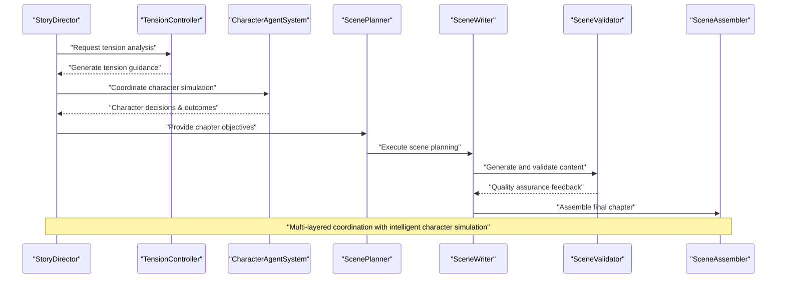

# AI Agent System

<cite>
**Referenced Files in This Document**
- [storyDirector.ts](file://packages/engine/src/agents/storyDirector.ts)
- [characterAgent.ts](file://packages/engine/src/world/characterAgent.ts)
- [tensionController.ts](file://packages/engine/src/agents/tensionController.ts)
- [index.ts](file://packages/engine/src/index.ts)
</cite>

## Update Summary
**Changes Made**
- Updated to include new Story Director Agent for high-level narrative coordination
- Added Character Agent System for intelligent character behavior simulation
- Enhanced Tension Controller Agent with advanced parabolic tension calculation and guidance
- Improved agent coordination through integrated tension management and character simulation
- Expanded agent ecosystem with sophisticated narrative control mechanisms

## Table of Contents
1. [Introduction](#introduction)
2. [Project Structure](#project-structure)
3. [Core Components](#core-components)
4. [Architecture Overview](#architecture-overview)
5. [Detailed Component Analysis](#detailed-component-analysis)
6. [Enhanced Tension Management](#enhanced-tension-management)
7. [Character Agent System](#character-agent-system)
8. [Story Director Integration](#story-director-integration)
9. [Agent Coordination Mechanisms](#agent-coordination-mechanisms)
10. [Performance Considerations](#performance-considerations)
11. [Troubleshooting Guide](#troubleshooting-guide)
12. [Conclusion](#conclusion)
13. [Appendices](#appendices)

## Introduction
This document explains the AI Agent System that powers narrative generation, featuring a sophisticated ecosystem of specialized agents working together to create compelling stories. The system has evolved to include advanced coordination mechanisms through the Story Director Agent, intelligent character simulation via the Character Agent System, and enhanced tension management through the improved Tension Controller Agent. The system encompasses the agent architecture, responsibilities, communication patterns, and coordination mechanisms. It documents prompt engineering approaches, LLM integration patterns, and parameter configuration for each agent. Practical examples illustrate agent interactions, decision-making, and error handling. Guidance is included for customization, performance optimization, debugging, and the relationship between agents and the overall generation pipeline.

**Updated** The system now features three major enhancements: the Story Director Agent for high-level narrative coordination, the Character Agent System for intelligent character behavior simulation, and the enhanced Tension Controller Agent with advanced parabolic tension calculation and guidance mechanisms.

## Project Structure
The engine package implements a comprehensive AI agent ecosystem including the new Story Director Agent, Character Agent System, enhanced Tension Controller, and integrated coordination mechanisms. The system supports sophisticated narrative generation workflows with intelligent character simulation and precise tension management.

```mermaid
graph TB
subgraph "Enhanced Agent Ecosystem"
STORYDIRECTOR["StoryDirector<br/>storyDirector.ts"]
CHARACTERAGENT["CharacterAgentSystem<br/>characterAgent.ts"]
TENSIONCONTROLLER["TensionController<br/>tensionController.ts"]
ENDSUBGRAPH
subgraph "Core Generation Agents"
SCENEPLANNER["ScenePlanner<br/>scenePlanner.ts"]
SCENEWRITER["SceneWriter<br/>sceneWriter.ts"]
SCENEVALIDATOR["SceneValidator<br/>sceneValidator.ts"]
SCENEASSEMBLER["SceneAssembler<br/>sceneAssembler.ts"]
SCENEOUTCOME["SceneOutcomeExtractor<br/>sceneOutcomeExtractor.ts"]
WRITER["Writer Agent<br/>writer.ts"]
COMPLETENESS["Completeness Checker<br/>completeness.ts"]
SUMMARIZER["Chapter Summarizer<br/>summarizer.ts"]
CANON["Canon Validator<br/>canonValidator.ts"]
ENDSUBGRAPH
subgraph "Integration Layer"
INDEX["Centralized Export<br/>index.ts"]
WORLDSTATE["World State Management<br/>worldState.ts"]
EVENTRESOLVER["Event Resolver<br/>eventResolver.ts"]
CONSTRAINTS["Constraint Graph<br/>constraintGraph.ts"]
ENDSUBGRAPH
STORYDIRECTOR --> TENSIONCONTROLLER
STORYDIRECTOR --> CHARACTERAGENT
CHARACTERAGENT --> EVENTRESOLVER
EVENTRESOLVER --> WORLDSTATE
TENSIONCONTROLLER --> SCENEPLANNER
SCENEPLANNER --> SCENEWRITER
SCENEWRITER --> SCENEVALIDATOR
SCENEWRITER --> SCENEASSEMBLER
SCENEWRITER --> SCENEOUTCOME
SCENEOUTCOME --> COMPLETENESS
COMPLETENESS --> SUMMARIZER
SUMMARIZER --> CANON
```

**Diagram sources**
- [storyDirector.ts:100-276](file://packages/engine/src/agents/storyDirector.ts#L100-L276)
- [characterAgent.ts:91-304](file://packages/engine/src/world/characterAgent.ts#L91-L304)
- [tensionController.ts:214-252](file://packages/engine/src/agents/tensionController.ts#L214-L252)
- [index.ts:1-123](file://packages/engine/src/index.ts#L1-L123)

**Section sources**
- [index.ts:1-123](file://packages/engine/src/index.ts#L1-L123)

## Core Components
- **StoryDirector**: High-level narrative coordinator that determines chapter objectives, manages focus characters, and provides tension guidance for optimal story progression.
- **CharacterAgentSystem**: Intelligent character simulation system that generates realistic character decisions, manages agendas, and simulates complex social interactions.
- **TensionController**: Advanced tension management system with parabolic curve calculation, real-time analysis, and comprehensive guidance generation for dramatic arc control.
- **Enhanced Scene-level Agents**: Six specialized agents (ScenePlanner, SceneWriter, SceneValidator, SceneAssembler, SceneOutcomeExtractor) providing granular narrative control with quality assurance.
- **Integrated Coordination**: Seamless integration between all agents through centralized export system and shared state management.

**Updated** The addition of three major new systems completes the narrative generation ecosystem with sophisticated coordination mechanisms, intelligent character simulation, and precise tension management capabilities.

**Section sources**
- [storyDirector.ts:6-31](file://packages/engine/src/agents/storyDirector.ts#L6-L31)
- [characterAgent.ts:4-39](file://packages/engine/src/world/characterAgent.ts#L4-L39)
- [tensionController.ts:4-17](file://packages/engine/src/agents/tensionController.ts#L4-L17)

## Architecture Overview
The enhanced system now features a multi-layered architecture with sophisticated coordination mechanisms:

- **Strategic Layer**: StoryDirector coordinates high-level narrative objectives and tension management across the entire story arc.
- **Character Simulation Layer**: CharacterAgentSystem provides intelligent character behavior simulation with complex agendas and relationship management.
- **Execution Layer**: Enhanced scene-level agents handle detailed narrative execution with comprehensive quality control and state management.
- **Integration Layer**: Centralized coordination system manages communication between all agents and maintains consistent state throughout the generation process.



**Updated** The architecture now includes sophisticated multi-layer coordination with the StoryDirector managing high-level objectives, the CharacterAgentSystem providing intelligent character simulation, and the TensionController ensuring optimal dramatic progression throughout the narrative.

**Diagram sources**
- [storyDirector.ts:100-276](file://packages/engine/src/agents/storyDirector.ts#L100-L276)
- [tensionController.ts:214-252](file://packages/engine/src/agents/tensionController.ts#L214-L252)
- [characterAgent.ts:270-304](file://packages/engine/src/world/characterAgent.ts#L270-L304)

## Detailed Component Analysis

### StoryDirector Agent
**New** Responsibilities:
- Determine chapter objectives based on story state, plot threads, and character development needs.
- Coordinate focus characters and suggested scenes for optimal narrative progression.
- Provide comprehensive chapter direction with tone guidance and director's notes.
- Generate fallback objectives for testing and performance optimization scenarios.

Prompt engineering approach:
- Comprehensive story context integration including title, genre, theme, premise, and current state.
- Multi-dimensional analysis considering plot progression, character development, tension management, and unresolved questions.
- Structured JSON output with detailed chapter objectives, priority ratings, and actionable guidance.
- Real-time adaptation based on previous chapter summaries and current story tension levels.

LLM integration pattern:
- Moderate temperature (0.4) for balanced and consistent narrative direction.
- Generous token limit (2000) for comprehensive story context analysis.
- JSON mode for structured output with automatic parsing and validation.

Parameters:
- Temperature: 0.4 for objective and consistent narrative direction.
- Max tokens: 2000 for comprehensive story context analysis.
- Priority system: Critical, High, Medium, Low priority objectives with detailed categorization.

Decision-making:
- Analyzes active plot threads, character states, unresolved questions, and recent events.
- Determines optimal chapter goals aligned with story arc progression (setup, rising action, climax, resolution).
- Coordinates multiple objectives with proper prioritization and interdependencies.
- Generates actionable scene suggestions with specific dramatic requirements.

Error handling:
- Provides comprehensive fallback system with auto-generated objectives based on current story state.
- Maintains consistent output format even when LLM services are unavailable.
- Validates objective structure and ensures proper priority ordering.

Customization tips:
- Adjust priority thresholds based on story complexity and genre requirements.
- Customize tone recommendations for different narrative styles and emotional arcs.
- Modify objective categorization for specific story structures and character-driven narratives.

Practical example:
- Generates chapter objectives with proper priority ordering and detailed descriptions.
- Coordinates focus characters based on story importance and character relationships.
- Provides actionable scene suggestions with specific dramatic requirements and tension targets.

**Section sources**
- [storyDirector.ts:100-276](file://packages/engine/src/agents/storyDirector.ts#L100-L276)

### CharacterAgentSystem
**New** Responsibilities:
- Simulate intelligent character behavior based on personality, goals, and current situation.
- Manage character agendas with priorities, deadlines, and completion tracking.
- Generate realistic character decisions considering relationships, knowledge, and emotional states.
- Coordinate multi-character interactions and social dynamics for authentic narrative simulation.

Prompt engineering approach:
- Comprehensive character profile integration including personality traits, goals, relationships, and knowledge base.
- Real-time situational analysis considering current chapter context, other characters present, and recent world events.
- Structured decision-making process with detailed reasoning and potential consequences.
- Social dynamics simulation considering character relationships and emotional states.

LLM integration pattern:
- Balanced temperature (0.5) for creative yet realistic character behavior.
- Moderate token limit (1000) for comprehensive character analysis and decision-making.
- JSON mode for structured decision output with automatic parsing and validation.

Parameters:
- Temperature: 0.5 for balanced character behavior simulation.
- Max tokens: 1000 for comprehensive character analysis and decision context.
- Agenda management: Priority-based task system with deadline tracking and completion status.

Decision-making:
- Evaluates character personality, current goals, and emotional state for decision logic.
- Considers relationships with other characters and recent world events for contextual responses.
- Manages agenda items with priority-based task completion and deadline adherence.
- Generates detailed reasoning for character actions with potential consequence analysis.

Error handling:
- Provides fallback decision system based on agenda items and basic relationship patterns.
- Maintains character consistency even when LLM services fail.
- Handles edge cases in multi-character interactions with graceful degradation.

Customization tips:
- Adjust personality trait weights for different character archetypes and behavioral patterns.
- Customize agenda priority systems for different narrative styles and character motivations.
- Modify relationship impact calculations for specific story contexts and character dynamics.

Practical example:
- Generates realistic character decisions based on personality and situational context.
- Manages complex social interactions with proper relationship consideration.
- Provides detailed reasoning for character actions with comprehensive consequence analysis.

**Section sources**
- [characterAgent.ts:91-304](file://packages/engine/src/world/characterAgent.ts#L91-L304)

### Enhanced TensionController Agent
**Updated** Advanced tension management with sophisticated parabolic curve calculation and comprehensive guidance generation.

Core capabilities:
- **Parabolic Tension Calculation**: Mathematical formula (4 × progress × (1 - progress)) creating natural dramatic arc progression.
- **Real-time Analysis**: Dynamic tension gap analysis comparing current vs target tension levels.
- **Adaptive Guidance**: Context-aware tension recommendations based on story stage and current conditions.
- **Content Estimation**: Heuristic-based tension estimation from chapter content analysis.

Advanced algorithms:
- **Target Calculation**: `calculateTargetTension()` implements parabolic curve for natural dramatic progression.
- **Action Recommendation**: `analyzeTension()` provides escalate/maintain/resolve/climax recommendations.
- **Guidance Generation**: `generateTensionGuidance()` creates detailed scene type and pacing recommendations.
- **Content Analysis**: `estimateTensionFromChapter()` analyzes text for tension indicator words.

LLM integration pattern:
- **Heuristic-based operation**: Primary operations work without LLM for performance optimization.
- **Selective LLM usage**: Only tension guidance formatting uses LLM for natural language generation.
- **JSON mode for structured output**: Maintains consistency in tension analysis and guidance formats.

Parameters:
- **Target calculation**: Parabolic curve with peak at middle chapters (0.5 progress).
- **Analysis thresholds**: 0.2 tension gap for escalation, 0.15 for maintenance, 0.85 for climax detection.
- **Scene type recommendations**: Context-appropriate scene types based on recommended action.

Decision-making:
- **Stage-based analysis**: Differentiates between setup, rising action, climax, and resolution stages.
- **Dynamic recommendations**: Adjusts guidance based on story progression and current tension gaps.
- **Content-aware estimation**: Analyzes generated content for tension validation and adjustment.
- **Adaptive pacing**: Provides pacing recommendations based on tension requirements and scene types.

Error handling:
- **Graceful degradation**: Falls back to basic tension analysis when content estimation fails.
- **Boundary handling**: Properly handles edge cases at story beginning and end.
- **Consistent output**: Maintains structured output format regardless of analysis complexity.

Customization tips:
- **Curve modification**: Adjust parabolic parameters for different narrative structures and pacing preferences.
- **Threshold tuning**: Modify tension gap thresholds for different story types and dramatic styles.
- **Scene type customization**: Adapt recommended scene types for specific genres and narrative preferences.

Practical example:
- Calculates target tension of 0.85 for climax chapter using parabolic curve.
- Recommends climax action with fast-paced scene types and continuous escalation.
- Estimates content tension at 0.72 with discovery and confrontation indicators.

**Section sources**
- [tensionController.ts:214-252](file://packages/engine/src/agents/tensionController.ts#L214-L252)

## Enhanced Tension Management
**New** Comprehensive tension management system with mathematical precision and adaptive guidance.

### Mathematical Tension Control
The system implements a sophisticated parabolic tension curve that creates natural dramatic progression:

- **Formula**: `targetTension = 4 × (currentChapter/totalChapters) × (1 - currentChapter/totalChapters)`
- **Progression**: Starts at 0%, peaks at 100% in middle chapters, ends at 0%
- **Adaptation**: Automatically adjusts target tension based on story stage and total chapter count

### Action-Based Recommendations
The system provides context-aware tension recommendations:

- **Escalate**: When current tension is significantly below target (>0.2 gap)
- **Maintain**: When tension is within acceptable range (-0.15 to 0.2 gap)
- **Resolve**: When at final chapter or approaching resolution
- **Climax**: When near peak tension (>0.85 target)

### Scene Type Integration
Guidance includes specific scene type recommendations based on tension requirements:

- **Escalation scenes**: Confrontation, discovery, setback, danger
- **Maintenance scenes**: Development, interaction, preparation, reflection  
- **Resolution scenes**: Resolution, revelation, farewell, new beginning
- **Climax scenes**: Climax, showdown, revelation, sacrifice

**Section sources**
- [tensionController.ts:28-167](file://packages/engine/src/agents/tensionController.ts#L28-L167)

## Character Agent System
**New** Intelligent character simulation system providing sophisticated behavioral modeling.

### Character State Management
Comprehensive character profile system with:

- **Basic Information**: Name, personality traits, emotional state, location
- **Goals and Agendas**: Primary goals with secondary agenda items and priority tracking
- **Knowledge Base**: Dynamic knowledge accumulation and relationship tracking
- **Inventory Management**: Item tracking for character interaction possibilities

### Decision-Making Framework
Sophisticated decision-making process considering:

- **Personality Alignment**: Actions aligned with character personality traits
- **Goal Achievement**: Decisions contributing to primary and secondary goals
- **Relationship Dynamics**: Consideration of character relationships and emotional states
- **Situational Context**: Response to current chapter context and world events

### Multi-Character Coordination
Advanced simulation of complex social interactions:

- **Relationship Impact**: Dynamic relationship updates based on character actions
- **Social Network Analysis**: Complex relationship networks with influence propagation
- **Conflict Resolution**: Intelligent handling of character conflicts and negotiations
- **Collaborative Behavior**: Coordination of multiple characters toward common objectives

**Section sources**
- [characterAgent.ts:91-304](file://packages/engine/src/world/characterAgent.ts#L91-L304)

## Story Director Integration
**New** High-level narrative coordination system integrating all agents for optimal story progression.

### Strategic Coordination
The StoryDirector serves as the central coordinator:

- **Objective Generation**: Creates actionable chapter objectives with priority and categorization
- **Focus Management**: Coordinates character focus and relationship management
- **Tension Alignment**: Ensures chapter objectives align with overall tension arc
- **Content Integration**: Incorporates previous chapter summaries and story context

### Contextual Analysis
Comprehensive story context analysis:

- **Plot Thread Monitoring**: Active plot thread management and advancement requirements
- **Character State Tracking**: Character development needs and relationship dynamics
- **Narrative Question Management**: Unresolved questions and mystery resolution requirements
- **Event Integration**: Recent events and their impact on future chapter direction

### Fallback Systems
Robust fallback mechanisms:

- **Auto-generated Objectives**: Basic objective generation when LLM services unavailable
- **Story State Integration**: Fallback based on current story state and character information
- **Performance Optimization**: Quick objective generation for testing and development scenarios

**Section sources**
- [storyDirector.ts:100-276](file://packages/engine/src/agents/storyDirector.ts#L100-L276)

## Agent Coordination Mechanisms
**Updated** Sophisticated coordination system enabling seamless interaction between all agents.

### Centralized Integration
The enhanced system provides:

- **Unified Export System**: Comprehensive agent exports through centralized index system
- **State Synchronization**: Real-time state sharing between coordinating agents
- **Communication Protocols**: Standardized interfaces for agent-to-agent communication
- **Fallback Coordination**: Graceful degradation when individual agents fail

### Hierarchical Coordination
Multi-level agent coordination:

- **Strategic Level**: StoryDirector coordinates high-level objectives and tension management
- **Execution Level**: Scene-level agents handle detailed narrative execution
- **Simulation Level**: CharacterAgentSystem provides behavioral coordination
- **Quality Level**: Validation agents ensure narrative consistency and quality

### State Management Integration
Seamless state management across all agents:

- **Shared State Access**: Common story state accessible to all coordinating agents
- **Event Propagation**: Automatic state updates from character actions and scene outcomes
- **Constraint Enforcement**: Constraint satisfaction across all narrative elements
- **Memory Integration**: Persistent memory management through integrated systems

**Section sources**
- [index.ts:1-123](file://packages/engine/src/index.ts#L1-L123)

## Performance Considerations
**Updated** Enhanced performance optimization with sophisticated coordination mechanisms and intelligent fallback systems.

- **Mathematical Operations**: TensionController performs all calculations without LLM dependency for optimal performance.
- **Selective LLM Usage**: StoryDirector and CharacterAgentSystem use LLM selectively for complex analysis and decision-making.
- **Fallback Mechanisms**: Comprehensive fallback systems ensure system reliability across all agent types.
- **Parallel Processing**: Character simulation and scene generation can operate in parallel streams.
- **Memory Efficiency**: Heuristic-based tension estimation reduces computational overhead.
- **State Caching**: Shared state management minimizes redundant computation across agents.
- **Integration Optimization**: Centralized export system reduces import overhead and improves module loading.

## Troubleshooting Guide
**Updated** Comprehensive troubleshooting guide addressing new agent systems and coordination mechanisms.

Common issues and resolutions:
- **StoryDirector failures**: Check LLM availability and story context completeness; verify tension guidance integration.
- **CharacterAgentSystem issues**: Review character state consistency and agenda management; check relationship updates.
- **TensionController problems**: Verify story progression and chapter count accuracy; check mathematical calculations.
- **Coordination failures**: Ensure proper agent initialization and state synchronization; verify integration layer functionality.
- **Fallback mechanism issues**: Test StoryDirector fallback objectives and CharacterAgentSystem simple decisions.
- **Performance bottlenecks**: Monitor LLM usage patterns and mathematical operation efficiency.
- **State synchronization problems**: Verify shared state access and event propagation across coordinating agents.

Operational logs:
- StoryDirector logs chapter objectives and tension guidance generation.
- CharacterAgentSystem tracks character decisions, agenda updates, and relationship changes.
- TensionController monitors tension calculations, guidance generation, and content analysis.
- Integration system logs show proper agent coordination and state synchronization.

**Section sources**
- [storyDirector.ts:218-276](file://packages/engine/src/agents/storyDirector.ts#L218-L276)
- [characterAgent.ts:270-304](file://packages/engine/src/world/characterAgent.ts#L270-L304)
- [tensionController.ts:214-252](file://packages/engine/src/agents/tensionController.ts#L214-L252)

## Conclusion
**Updated** The AI Agent System now provides a comprehensive narrative generation ecosystem featuring sophisticated coordination mechanisms, intelligent character simulation, and precise tension management.

The system includes the StoryDirector Agent for high-level narrative coordination, the CharacterAgentSystem for intelligent character behavior simulation, and the enhanced TensionController Agent for mathematical precision in dramatic arc control. These agents work seamlessly with existing scene-level components through the centralized integration system, providing flexible workflow selection and comprehensive narrative control.

**The enhanced agent ecosystem offers sophisticated multi-layer coordination with intelligent character simulation, precise tension management, and comprehensive fallback mechanisms.** This advanced system enables both strategic narrative planning and detailed execution while maintaining system reliability and performance through intelligent coordination and state management.

## Appendices

### Enhanced Agent Responsibilities and Parameters
**Updated** Comprehensive parameter sets for all new and enhanced agents with detailed operational specifications.

- **StoryDirector Agent**
  - Responsibilities: Generate chapter objectives, coordinate focus characters, provide tension guidance, create fallback objectives.
  - Parameters: temperature 0.4, maxTokens 2000, priority system (Critical, High, Medium, Low), objective categorization (Plot, Character, World, Tension, Resolution).
- **CharacterAgentSystem**
  - Responsibilities: Simulate character behavior, manage agendas, coordinate multi-character interactions, provide decision reasoning.
  - Parameters: temperature 0.5, maxTokens 1000, agenda priority system, relationship tracking, knowledge base management.
- **Enhanced TensionController Agent**
  - Responsibilities: Calculate parabolic tension targets, analyze tension gaps, generate guidance, estimate content tension.
  - Parameters: mathematical calculation (4 × progress × (1 - progress)), analysis thresholds (0.2 escalation, 0.15 maintenance, 0.85 climax), scene type recommendations.
- **Enhanced Scene-level Agents**: Continue with existing comprehensive scene-level agent functionality including detailed planning, writing, validation, assembly, and outcome extraction capabilities.

**Section sources**
- [storyDirector.ts:100-276](file://packages/engine/src/agents/storyDirector.ts#L100-L276)
- [characterAgent.ts:91-304](file://packages/engine/src/world/characterAgent.ts#L91-L304)
- [tensionController.ts:214-252](file://packages/engine/src/agents/tensionController.ts#L214-L252)

### Integration Patterns and Workflow Examples
**Updated** Examples of enhanced agent integration with sophisticated coordination mechanisms.

Enhanced workflow patterns include:
- **Strategic-Execution Coordination**: StoryDirector → TensionController → CharacterAgentSystem → Scene-level agents
- **Intelligent Character Simulation**: CharacterAgentSystem → EventResolver → WorldStateManager → StoryDirector coordination
- **Tension-Aware Generation**: TensionController → ScenePlanner → SceneWriter → SceneValidator → SceneAssembler workflow
- **Multi-Agent Coordination**: Parallel character simulation with sequential narrative execution
- **Fallback Integration**: Graceful degradation through StoryDirector fallback objectives and CharacterAgentSystem simple decisions

Integration benefits:
- **Sophisticated Coordination**: Multi-layer agent coordination with intelligent state management
- **Performance Optimization**: Mathematical operations without LLM dependency for critical calculations
- **Reliability Enhancement**: Comprehensive fallback mechanisms across all agent types
- **Flexibility**: Support for both coordinated and independent agent operation modes
- **Scalability**: Modular design supporting expansion with additional specialized agents

**Section sources**
- [index.ts:1-123](file://packages/engine/src/index.ts#L1-L123)