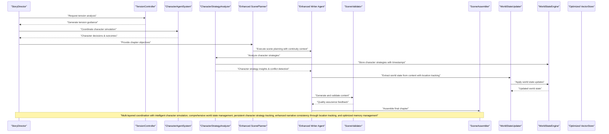

# AI Agent System

<cite>
**Referenced Files in This Document**
- [storyDirector.ts](file://packages/engine/src/agents/storyDirector.ts)
- [characterAgent.ts](file://packages/engine/src/world/characterAgent.ts)
- [tensionController.ts](file://packages/engine/src/agents/tensionController.ts)
- [index.ts](file://packages/engine/src/index.ts)
- [worldStateUpdater.ts](file://packages/engine/src/agents/worldStateUpdater.ts)
- [worldStateEngine.ts](file://packages/engine/src/world/worldStateEngine.ts)
- [worldState.ts](file://packages/engine/src/world/worldState.ts)
- [generateChapter.ts](file://packages/engine/src/pipeline/generateChapter.ts)
- [stateUpdater.ts](file://packages/engine/src/agents/stateUpdater.ts)
- [characterStrategy.ts](file://packages/engine/src/agents/characterStrategy.ts)
- [writer.ts](file://packages/engine/src/agents/writer.ts)
- [scenePlanner.ts](file://packages/engine/src/agents/scenePlanner.ts)
- [vectorStore.ts](file://packages/engine/src/memory/vectorStore.ts)
- [sceneWriter.ts](file://packages/engine/src/agents/sceneWriter.ts)
</cite>

## Update Summary
**Changes Made**
- Updated to reflect Applied Changes: Enhanced Writer prompts now include current character states and location requirements, ScenePlanner improvements with continuity context integration, and VectorStore optimizations for better memory initialization handling
- Enhanced Writer Agent with current character states and location continuity requirements for improved narrative consistency
- Improved ScenePlanner with continuity context integration including previous ending location and emotional state tracking
- Enhanced VectorStore with optimized memory initialization handling and better capacity management for improved performance

## Table of Contents
1. [Introduction](#introduction)
2. [Project Structure](#project-structure)
3. [Core Components](#core-components)
4. [Architecture Overview](#architecture-overview)
5. [Detailed Component Analysis](#detailed-component-analysis)
6. [Enhanced Tension Management](#enhanced-tension-management)
7. [Character Agent System](#character-agent-system)
8. [Story Director Integration](#story-director-integration)
9. [World State Management System](#world-state-management-system)
10. [CharacterStrategyAnalyzer Integration](#characterstrategyanalyzer-integration)
11. [WorldStateUpdater Integration](#worldstateupdater-integration)
12. [Enhanced Writer Agent](#enhanced-writer-agent)
13. [Improved ScenePlanner](#improved-sceneplanner)
14. [Optimized VectorStore](#optimized-vectorstore)
15. [Agent Coordination Mechanisms](#agent-coordination-mechanisms)
16. [Performance Considerations](#performance-considerations)
17. [Troubleshooting Guide](#troubleshooting-guide)
18. [Conclusion](#conclusion)
19. [Appendices](#appendices)

## Introduction
This document explains the AI Agent System that powers narrative generation, featuring a sophisticated ecosystem of specialized agents working together to create compelling stories. The system has evolved to include advanced coordination mechanisms through the Story Director Agent, intelligent character simulation via the Character Agent System, enhanced tension management through the improved Tension Controller Agent, comprehensive world state management with the enhanced CharacterStrategyAnalyzer agent, integrated WorldStateUpdater system for persistent character strategy tracking, and significantly enhanced Writer Agent with current character states and location continuity requirements. The system encompasses the agent architecture, responsibilities, communication patterns, and coordination mechanisms. It documents prompt engineering approaches, LLM integration patterns, and parameter configuration for each agent. Practical examples illustrate agent interactions, decision-making, and error handling. Guidance is included for customization, performance optimization, debugging, and the relationship between agents and the overall generation pipeline.

**Updated** The system now features seven major enhancements: the Story Director Agent for high-level narrative coordination, the Character Agent System for intelligent character behavior simulation, the enhanced Tension Controller Agent with advanced parabolic tension calculation and guidance, the enhanced CharacterStrategyAnalyzer Agent for comprehensive character analysis, strategy tracking, and conflict detection, the WorldStateUpdater Agent for comprehensive world state extraction and validation, the integrated WorldStateEngine for persistent character strategy management, the enhanced Writer Agent with current character states and location continuity requirements, and the improved ScenePlanner with continuity context integration.

## Project Structure
The engine package implements a comprehensive AI agent ecosystem including the enhanced CharacterStrategyAnalyzer Agent, Story Director Agent, Character Agent System, enhanced Tension Controller, WorldStateUpdater Agent, integrated coordination mechanisms, enhanced Writer Agent with continuity requirements, and improved ScenePlanner with continuity context. The system supports sophisticated narrative generation workflows with intelligent character simulation, precise tension management, comprehensive world state tracking, persistent character strategy management, and enhanced narrative consistency through location continuity tracking.

```mermaid
graph TB
subgraph "Enhanced Agent Ecosystem"
STORYDIRECTOR["StoryDirector<br/>storyDirector.ts"]
CHARACTERAGENT["CharacterAgentSystem<br/>characterAgent.ts"]
TENSIONCONTROLLER["TensionController<br/>tensionController.ts"]
CHARACTERSTRATEGY["CharacterStrategyAnalyzer<br/>characterStrategy.ts"]
WORLDSTATEUPDATER["WorldStateUpdater<br/>worldStateUpdater.ts"]
ENDSUBGRAPH
subgraph "Core Generation Agents"
SCENEPLANNER["Enhanced ScenePlanner<br/>scenePlanner.ts"]
SCENEWRITER["SceneWriter<br/>sceneWriter.ts"]
SCENEVALIDATOR["SceneValidator<br/>sceneValidator.ts"]
SCENEASSEMBLER["SceneAssembler<br/>sceneAssembler.ts"]
SCENEOUTCOME["SceneOutcomeExtractor<br/>sceneOutcomeExtractor.ts"]
WRITER["Enhanced Writer Agent<br/>writer.ts"]
COMPLETENESS["Completeness Checker<br/>completeness.ts"]
SUMMARIZER["Chapter Summarizer<br/>summarizer.ts"]
CANON["Canon Validator<br/>canonValidator.ts"]
STATEUPDATER["StateUpdater<br/>stateUpdater.ts"]
ENDSUBGRAPH
subgraph "World State Management"
WORLDSTATEENGINE["WorldStateEngine<br/>worldStateEngine.ts"]
WORLDSTATEMANAGER["WorldStateManager<br/>worldState.ts"]
EVENTRESOLVER["Event Resolver<br/>eventResolver.ts"]
CONSTRAINTS["Constraint Graph<br/>constraintGraph.ts"]
ENDSUBGRAPH
subgraph "Memory System"
VECTORSTORE["Optimized VectorStore<br/>vectorStore.ts"]
MEMORYRETRIEVER["MemoryRetriever<br/>memoryRetriever.ts"]
CANONSTORE["CanonStore<br/>canonStore.ts"]
ENDSUBGRAPH
subgraph "Integration Layer"
INDEX["Centralized Export<br/>index.ts"]
GENERATECHAPTER["GenerateChapter Pipeline<br/>generateChapter.ts"]
ENDSUBGRAPH
STORYDIRECTOR --> TENSIONCONTROLLER
STORYDIRECTOR --> CHARACTERAGENT
CHARACTERAGENT --> EVENTRESOLVER
EVENTRESOLVER --> WORLDSTATEMANAGER
CHARACTERSTRATEGY --> WORLDSTATEENGINE
WORLDSTATEUPDATER --> WORLDSTATEENGINE
WORLDSTATEUPDATER --> GENERATECHAPTER
CHARACTERSTRATEGY --> GENERATECHAPTER
GENERATECHAPTER --> WORLDSTATEUPDATER
GENERATECHAPTER --> CHARACTERSTRATEGY
GENERATECHAPTER --> VECTORSTORE
SCENEPLANNER --> SCENEWRITER
SCENEWRITER --> SCENEVALIDATOR
SCENEWRITER --> SCENEASSEMBLER
SCENEWRITER --> SCENEOUTCOME
SCENEOUTCOME --> COMPLETENESS
COMPLETENESS --> SUMMARIZER
SUMMARIZER --> CANON
STATEUPDATER --> SUMMARIZER
VECTORSTORE --> MEMORYRETRIEVER
MEMORYRETRIEVER --> WRITER
```

**Diagram sources**
- [storyDirector.ts:100-276](file://packages/engine/src/agents/storyDirector.ts#L100-L276)
- [characterAgent.ts:91-304](file://packages/engine/src/world/characterAgent.ts#L91-L304)
- [tensionController.ts:214-252](file://packages/engine/src/agents/tensionController.ts#L214-L252)
- [characterStrategy.ts:71-218](file://packages/engine/src/agents/characterStrategy.ts#L71-L218)
- [worldStateUpdater.ts:80-251](file://packages/engine/src/agents/worldStateUpdater.ts#L80-L251)
- [worldStateEngine.ts:64-352](file://packages/engine/src/world/worldStateEngine.ts#L64-L352)
- [generateChapter.ts:40-420](file://packages/engine/src/pipeline/generateChapter.ts#L40-L420)
- [index.ts:1-140](file://packages/engine/src/index.ts#L1-L140)
- [writer.ts:156-285](file://packages/engine/src/agents/writer.ts#L156-L285)
- [scenePlanner.ts:76-83](file://packages/engine/src/agents/scenePlanner.ts#L76-L83)
- [vectorStore.ts:31-40](file://packages/engine/src/memory/vectorStore.ts#L31-L40)

**Section sources**
- [index.ts:1-140](file://packages/engine/src/index.ts#L1-L140)

## Core Components
- **StoryDirector**: High-level narrative coordinator that determines chapter objectives, manages focus characters, and provides tension guidance for optimal story progression.
- **CharacterAgentSystem**: Intelligent character simulation system that generates realistic character decisions, manages agendas, and simulates complex social interactions.
- **TensionController**: Advanced tension management system with parabolic curve calculation, real-time analysis, and comprehensive guidance generation for dramatic arc control.
- **Enhanced CharacterStrategyAnalyzer**: Comprehensive character analysis agent that examines character behaviors, motivations, and narrative arcs to provide strategic insights for story development, with sophisticated conflict detection and persistent strategy tracking.
- **WorldStateUpdater**: LLM-based world state extraction agent that analyzes scene/chapter content and updates the WorldStateEngine with new facts, character movements, object changes, and relationship updates.
- **Enhanced Scene-level Agents**: Six specialized agents (ScenePlanner, SceneWriter, SceneValidator, SceneAssembler, SceneOutcomeExtractor) providing granular narrative control with quality assurance and enhanced continuity context.
- **Integrated Coordination**: Seamless integration between all agents through centralized export system and shared state management.
- **Enhanced Writer Agent**: Professional novelist agent that writes immersive narrative prose with current character states and location continuity requirements for improved narrative consistency.
- **Optimized VectorStore**: Memory management system with enhanced initialization handling and capacity management for improved performance and reliability.

**Updated** The addition of the enhanced Writer Agent with current character states and location continuity requirements, the improved ScenePlanner with continuity context integration, and the optimized VectorStore with better memory initialization handling completes the narrative generation ecosystem with sophisticated character analysis and strategy tracking, comprehensive extraction and validation capabilities, seamless integration with the existing agent ecosystem and WorldStateEngine for persistent character strategy management with conflict detection and resolution capabilities, enhanced narrative consistency through location tracking, and improved memory management performance.

**Section sources**
- [storyDirector.ts:6-31](file://packages/engine/src/agents/storyDirector.ts#L6-L31)
- [characterAgent.ts:4-39](file://packages/engine/src/world/characterAgent.ts#L4-L39)
- [tensionController.ts:4-17](file://packages/engine/src/agents/tensionController.ts#L4-L17)
- [characterStrategy.ts:5-23](file://packages/engine/src/agents/characterStrategy.ts#L5-L23)
- [worldStateUpdater.ts:1-251](file://packages/engine/src/agents/worldStateUpdater.ts#L1-L251)
- [writer.ts:66-126](file://packages/engine/src/agents/writer.ts#L66-L126)
- [vectorStore.ts:19-40](file://packages/engine/src/memory/vectorStore.ts#L19-L40)

## Architecture Overview
The enhanced system now features a multi-layered architecture with sophisticated coordination mechanisms, comprehensive world state management, advanced character strategy analysis with conflict detection, enhanced narrative consistency through location tracking, and optimized memory management:

- **Strategic Layer**: StoryDirector coordinates high-level narrative objectives and tension management across the entire story arc.
- **Character Simulation Layer**: CharacterAgentSystem provides intelligent character behavior simulation with complex agendas and relationship management.
- **Enhanced Character Strategy Layer**: CharacterStrategyAnalyzer analyzes character behaviors, motivations, and narrative arcs to provide strategic insights, track character development, and detect potential conflicts between character strategies.
- **Execution Layer**: Enhanced scene-level agents handle detailed narrative execution with comprehensive quality control and state management, including continuity context integration.
- **World State Layer**: WorldStateUpdater and WorldStateEngine provide comprehensive world state tracking, extraction, and validation for narrative consistency, with persistent character strategy storage and retrieval.
- **Memory Management Layer**: Optimized VectorStore provides efficient memory storage and retrieval with enhanced initialization handling and capacity management.
- **Integration Layer**: Centralized coordination system manages communication between all agents and maintains consistent state throughout the generation process.



**Updated** The architecture now includes sophisticated multi-layer coordination with the StoryDirector managing high-level objectives, the CharacterAgentSystem providing intelligent character simulation, the enhanced CharacterStrategyAnalyzer offering strategic character insights with conflict detection, the TensionController ensuring optimal dramatic progression, the WorldStateUpdater maintaining comprehensive world state consistency throughout the narrative with enhanced location tracking, the Optimized VectorStore providing efficient memory management, and the enhanced Writer Agent ensuring narrative consistency through current character states and location continuity requirements.

**Diagram sources**
- [storyDirector.ts:100-276](file://packages/engine/src/agents/storyDirector.ts#L100-L276)
- [tensionController.ts:214-252](file://packages/engine/src/agents/tensionController.ts#L214-L252)
- [characterAgent.ts:270-304](file://packages/engine/src/world/characterAgent.ts#L270-L304)
- [characterStrategy.ts:231-247](file://packages/engine/src/agents/characterStrategy.ts#L231-L247)
- [worldStateUpdater.ts:231-247](file://packages/engine/src/agents/worldStateUpdater.ts#L231-L247)
- [worldStateEngine.ts:64-352](file://packages/engine/src/world/worldStateEngine.ts#L64-L352)
- [writer.ts:193-202](file://packages/engine/src/agents/writer.ts#L193-L202)
- [scenePlanner.ts:13-14](file://packages/engine/src/agents/scenePlanner.ts#L13-L14)
- [vectorStore.ts:31-40](file://packages/engine/src/memory/vectorStore.ts#L31-L40)

## Detailed Component Analysis

### StoryDirector Agent
**New** Responsibilities:
- Determine chapter objectives based on story state, plot threads, and character development needs.
- Coordinate focus characters and suggested scenes for optimal narrative progression.
- Provide comprehensive chapter direction with tone guidance and director's notes.
- Generate fallback objectives for testing and performance optimization scenarios.

Prompt engineering approach:
- Comprehensive story context integration including title, genre, theme, premise, and current state.
- Multi-dimensional analysis considering plot progression, character development, tension management, and unresolved questions.
- Structured JSON output with detailed chapter objectives, priority ratings, and actionable guidance.
- Real-time adaptation based on previous chapter summaries and current story tension levels.

LLM integration pattern:
- Moderate temperature (0.4) for balanced and consistent narrative direction.
- Generous token limit (2000) for comprehensive story context analysis.
- JSON mode for structured output with automatic parsing and validation.

Parameters:
- Temperature: 0.4 for objective and consistent narrative direction.
- Max tokens: 2000 for comprehensive story context analysis.
- Priority system: Critical, High, Medium, Low priority objectives with detailed categorization.

Decision-making:
- Analyzes active plot threads, character states, unresolved questions, and recent events.
- Determines optimal chapter goals aligned with story arc progression (setup, rising action, climax, resolution).
- Coordinates multiple objectives with proper prioritization and interdependencies.
- Generates actionable scene suggestions with specific dramatic requirements.

Error handling:
- Provides comprehensive fallback system with auto-generated objectives based on current story state.
- Maintains consistent output format even when LLM services are unavailable.
- Validates objective structure and ensures proper priority ordering.

Customization tips:
- Adjust priority thresholds based on story complexity and genre requirements.
- Customize tone recommendations for different narrative styles and emotional arcs.
- Modify objective categorization for specific story structures and character-driven narratives.

Practical example:
- Generates chapter objectives with proper priority ordering and detailed descriptions.
- Coordinates focus characters based on story importance and character relationships.
- Provides actionable scene suggestions with specific dramatic requirements and tension targets.

**Section sources**
- [storyDirector.ts:100-276](file://packages/engine/src/agents/storyDirector.ts#L100-L276)

### CharacterAgentSystem
**New** Responsibilities:
- Simulate intelligent character behavior based on personality, goals, and current situation.
- Manage character agendas with priorities, deadlines, and completion tracking.
- Generate realistic character decisions considering relationships, knowledge, and emotional states.
- Coordinate multi-character interactions and social dynamics for authentic narrative simulation.

Prompt engineering approach:
- Comprehensive character profile integration including personality traits, goals, relationships, and knowledge base.
- Real-time situational analysis considering current chapter context, other characters present, and recent world events.
- Structured decision-making process with detailed reasoning and potential consequences.
- Social dynamics simulation considering character relationships and emotional states.

LLM integration pattern:
- Balanced temperature (0.5) for creative yet realistic character behavior.
- Moderate token limit (1000) for comprehensive character analysis and decision-making.
- JSON mode for structured decision output with automatic parsing and validation.

Parameters:
- Temperature: 0.5 for balanced character behavior simulation.
- Max tokens: 1000 for comprehensive character analysis and decision context.
- Agenda management: Priority-based task system with deadline tracking and completion status.

Decision-making:
- Evaluates character personality, current goals, and emotional state for decision logic.
- Considers relationships with other characters and recent world events for contextual responses.
- Manages agenda items with priority-based task completion and deadline adherence.
- Generates detailed reasoning for character actions with potential consequence analysis.

Error handling:
- Provides fallback decision system based on agenda items and basic relationship patterns.
- Maintains character consistency even when LLM services fail.
- Handles edge cases in multi-character interactions with graceful degradation.

Customization tips:
- Adjust personality trait weights for different character archetypes and behavioral patterns.
- Customize agenda priority systems for different narrative styles and character motivations.
- Modify relationship impact calculations for specific story contexts and character dynamics.

Practical example:
- Generates realistic character decisions based on personality and situational context.
- Manages complex social interactions with proper relationship consideration.
- Provides detailed reasoning for character actions with comprehensive consequence analysis.

**Section sources**
- [characterAgent.ts:91-304](file://packages/engine/src/world/characterAgent.ts#L91-L304)

### Enhanced TensionController Agent
**Updated** Advanced tension management with sophisticated parabolic curve calculation and comprehensive guidance generation.

Core capabilities:
- **Parabolic Tension Calculation**: Mathematical formula (4 × progress × (1 - progress)) creating natural dramatic arc progression.
- **Real-time Analysis**: Dynamic tension gap analysis comparing current vs target tension levels.
- **Adaptive Guidance**: Context-aware tension recommendations based on story stage and current conditions.
- **Content Estimation**: Heuristic-based tension estimation from chapter content analysis.

Advanced algorithms:
- **Target Calculation**: `calculateTargetTension()` implements parabolic curve for natural dramatic progression.
- **Action Recommendation**: `analyzeTension()` provides escalate/maintain/resolve/climax recommendations.
- **Guidance Generation**: `generateTensionGuidance()` creates detailed scene type and pacing recommendations.
- **Content Analysis**: `estimateTensionFromChapter()` analyzes text for tension indicator words.

LLM integration pattern:
- **Heuristic-based operation**: Primary operations work without LLM for performance optimization.
- **Selective LLM usage**: Only tension guidance formatting uses LLM for natural language generation.
- **JSON mode for structured output**: Maintains consistency in tension analysis and guidance formats.

Parameters:
- **Target calculation**: Parabolic curve with peak at middle chapters (0.5 progress).
- **Analysis thresholds**: 0.2 tension gap for escalation, 0.15 for maintenance, 0.85 for climax detection.
- **Scene type recommendations**: Context-appropriate scene types based on recommended action.

Decision-making:
- **Stage-based analysis**: Differentiates between setup, rising action, climax, and resolution stages.
- **Dynamic recommendations**: Adjusts guidance based on story progression and current tension gaps.
- **Content-aware estimation**: Analyzes generated content for tension validation and adjustment.
- **Adaptive pacing**: Provides pacing recommendations based on tension requirements and scene types.

Error handling:
- **Graceful degradation**: Falls back to basic tension analysis when content estimation fails.
- **Boundary handling**: Properly handles edge cases at story beginning and end.
- **Consistent output**: Maintains structured output format regardless of analysis complexity.

Customization tips:
- **Curve modification**: Adjust parabolic parameters for different narrative structures and pacing preferences.
- **Threshold tuning**: Modify tension gap thresholds for different story types and dramatic styles.
- **Scene type customization**: Adapt recommended scene types for specific genres and narrative preferences.

Practical example:
- Calculates target tension of 0.85 for climax chapter using parabolic curve.
- Recommends climax action with fast-paced scene types and continuous escalation.
- Estimates content tension at 0.72 with discovery and confrontation indicators.

**Section sources**
- [tensionController.ts:214-252](file://packages/engine/src/agents/tensionController.ts#L214-L252)

### Enhanced CharacterStrategyAnalyzer Agent
**Updated** Comprehensive character analysis and strategy tracking agent that examines character behaviors, motivations, and narrative arcs to provide strategic insights for story development, with sophisticated conflict detection and persistent strategy management.

Core responsibilities:
- **Character Analysis**: Examine character roles, backgrounds, and current situations to understand motivations and goals.
- **Strategy Generation**: Determine character current goals, long-term objectives, and next chapter targets.
- **Relationship Mapping**: Analyze character relationships with other key characters and emotional states.
- **Enhanced Conflict Detection**: Identify potential conflicts between character strategies and relationships with sophisticated analysis.
- **New Character Handling**: Provide initial strategy establishment for newly introduced characters.
- **Persistent Strategy Tracking**: Integrate with WorldStateEngine for long-term character strategy storage and retrieval with updatedAtChapter timestamps.

Enhanced analysis capabilities:
- **Current Goal Determination**: Identify character's immediate objectives and short-term motivations.
- **Long-term Objective Mapping**: Understand character's ultimate story objectives and character arcs.
- **Motivation Analysis**: Extract emotional drivers and psychological reasons behind character actions.
- **Obstacle Identification**: Recognize barriers and challenges impeding character progress.
- **Relationship Assessment**: Evaluate character relationships with trust, hostility, and dynamic changes.
- **Emotional Arc Tracking**: Monitor character emotional development and state changes over time.
- **Next Chapter Target Setting**: Define specific objectives for upcoming narrative developments.

Conflict detection system:
- **Goal Collision Analysis**: Identifies when multiple characters desire the same objectives using keyword matching heuristics.
- **Hostile Relationship Screening**: Flags conflicts between characters with enemy relationships.
- **Heuristic Conflict Scoring**: Uses common action keywords to identify potential goal conflicts.
- **Conflict Reporting**: Provides detailed descriptions and character pairings for identified conflicts.

Enhanced prompt engineering approach:
- **Comprehensive Character Context**: Integrates character background, role, and current story position.
- **Chapter-specific Analysis**: Considers chapter number, title, and summary for contextual understanding.
- **Previous Strategy Integration**: Uses WorldStateEngine stored strategies for continuity analysis with updatedAtChapter tracking.
- **Relationship Context**: Includes other characters for comprehensive relationship mapping.
- **Structured JSON Output**: Provides detailed character strategy information in standardized format with comprehensive fields.

Enhanced LLM integration pattern:
- **Temperature Control**: Uses 0.4 temperature for focused and analytical character assessment.
- **Token Management**: Limits analysis to 1500 tokens for comprehensive yet efficient character evaluation.
- **JSON Mode**: Relies on structured output for reliable parsing and strategy storage.

Enhanced parameters:
- **Temperature**: 0.4 for analytical and consistent character strategy analysis.
- **Max Tokens**: 1500 for comprehensive character context and strategy evaluation.
- **Conflict Detection**: Enhanced heuristic-based conflict identification using keyword matching and relationship analysis.

Application logic:
- **Enhanced Strategy Storage**: Integrates with WorldStateEngine to persist character strategies with updatedAtChapter timestamps.
- **New Character Recognition**: Detects previously unseen characters and provides initial strategy setup.
- **Conflict Reporting**: Generates conflict reports for narrative coordination and tension management.
- **Error Handling**: Continues analysis even when individual character evaluations fail.

Enhanced customization tips:
- **Conflict Detection Tuning**: Adjust keyword matching thresholds for different narrative styles.
- **Strategy Persistence**: Customize WorldStateEngine integration for different storage requirements.
- **Analysis Depth**: Modify prompt complexity for different story complexities and character depths.

Practical example:
- Analyzes character motivations and establishes current goals for established characters with updatedAtChapter tracking.
- Detects conflicts between characters with competing objectives and hostile relationships using enhanced conflict detection.
- Provides next chapter targets that drive narrative progression and character development with comprehensive strategy persistence.

**Section sources**
- [characterStrategy.ts:71-218](file://packages/engine/src/agents/characterStrategy.ts#L71-L218)

### WorldStateUpdater Agent
**New** Comprehensive world state extraction and validation agent that analyzes scene/chapter content to update the WorldStateEngine with new facts and changes.

Core responsibilities:
- **Content Analysis**: Extract world state changes from scene/chapter content including character movements, deaths, object movements, discoveries, relationship changes, emotional changes, and new events.
- **State Extraction**: Parse LLM responses to identify and extract specific world state modifications.
- **Engine Integration**: Apply updates to the WorldStateEngine through well-defined operations.
- **Error Handling**: Graceful degradation with empty update fallback when LLM processing fails.

Enhanced extraction capabilities:
- **Character Movements**: Track character location changes and update presence lists with enhanced continuity context.
- **Character Deaths**: Handle character mortality and update alive status.
- **Object Movements**: Track object location and ownership changes.
- **Discoveries**: Record character discoveries of objects and facts.
- **Relationship Changes**: Update character relationships with trust and hostility adjustments.
- **Emotional Changes**: Track character emotional state modifications.
- **New Events**: Create timeline entries with participants and locations.

Enhanced prompt engineering approach:
- **Comprehensive State Context**: Formats current world state including characters, objects, and locations for LLM analysis.
- **Structured Extraction**: Uses detailed JSON schema with specific field categories for reliable parsing.
- **Content Limiting**: Limits content analysis to prevent token overflow while maintaining context.
- **Enhanced Location Tracking**: Includes explicit location tracking instructions for continuity validation.
- **Error Resilience**: Includes fallback mechanisms for malformed JSON responses.

LLM integration pattern:
- **Temperature Control**: Uses 0.3 temperature for focused and consistent extraction.
- **Token Management**: Limits content to 3000 characters to prevent overflow.
- **JSON Mode**: Relies on structured JSON output for reliable parsing and validation.

Parameters:
- **Temperature**: 0.3 for focused and consistent world state extraction.
- **Max Tokens**: 1500 for comprehensive content analysis and extraction.
- **Content Limit**: 3000 characters for optimal performance and reliability.

Enhanced application logic:
- **Movement Updates**: Applies character and object location changes through engine operations with continuity validation.
- **Death Handling**: Processes character mortality with proper state updates.
- **Discovery Management**: Records discoveries and updates character knowledge.
- **Relationship Updates**: Adjusts trust and hostility levels with bounds checking.
- **Event Creation**: Generates timeline entries with participant extraction from content.
- **Error Recovery**: Continues processing despite individual operation failures.

Customization tips:
- **Extraction Schema**: Modify the WorldStateUpdate interface to track additional world state aspects.
- **Content Analysis**: Adjust content limiting and state formatting for different story complexities.
- **Error Handling**: Customize error recovery strategies for different reliability requirements.

Practical example:
- Extracts character movement from scene content: "Alice moved from the library to the garden" with enhanced continuity tracking.
- Processes object discovery: "Bob found a key in the chest, adding knowledge to his inventory".
- Updates relationship: "Alice and Bob's trust decreased by 0.1 due to betrayal".

**Section sources**
- [worldStateUpdater.ts:1-251](file://packages/engine/src/agents/worldStateUpdater.ts#L1-L251)

## Enhanced Tension Management
**New** Comprehensive tension management system with mathematical precision and adaptive guidance.

### Mathematical Tension Control
The system implements a sophisticated parabolic tension curve that creates natural dramatic progression:

- **Formula**: `targetTension = 4 × (currentChapter/totalChapters) × (1 - currentChapter/totalChapters)`
- **Progression**: Starts at 0%, peaks at 100% in middle chapters, ends at 0%
- **Adaptation**: Automatically adjusts target tension based on story stage and total chapter count

### Action-Based Recommendations
The system provides context-aware tension recommendations:

- **Escalate**: When current tension is significantly below target (>0.2 gap)
- **Maintain**: When tension is within acceptable range (-0.15 to 0.2 gap)
- **Resolve**: When at final chapter or approaching resolution
- **Climax**: When near peak tension (>0.85 target)

### Scene Type Integration
Guidance includes specific scene type recommendations based on tension requirements:

- **Escalation scenes**: Confrontation, discovery, setback, danger
- **Maintenance scenes**: Development, interaction, preparation, reflection  
- **Resolution scenes**: Resolution, revelation, farewell, new beginning
- **Climax scenes**: Climax, showdown, revelation, sacrifice

**Section sources**
- [tensionController.ts:28-167](file://packages/engine/src/agents/tensionController.ts#L28-L167)

## Character Agent System
**New** Intelligent character simulation system providing sophisticated behavioral modeling.

### Character State Management
Comprehensive character profile system with:

- **Basic Information**: Name, personality traits, emotional state, location
- **Goals and Agendas**: Primary goals with secondary agenda items and priority tracking
- **Knowledge Base**: Dynamic knowledge accumulation and relationship tracking
- **Inventory Management**: Item tracking for character interaction possibilities

### Decision-Making Framework
Sophisticated decision-making process considering:

- **Personality Alignment**: Actions aligned with character personality traits
- **Goal Achievement**: Decisions contributing to primary and secondary goals
- **Relationship Dynamics**: Consideration of character relationships and emotional states
- **Situational Context**: Response to current chapter context and world events

### Multi-Character Coordination
Advanced simulation of complex social interactions:

- **Relationship Impact**: Dynamic relationship updates based on character actions
- **Social Network Analysis**: Complex relationship networks with influence propagation
- **Conflict Resolution**: Intelligent handling of character conflicts and negotiations
- **Collaborative Behavior**: Coordination of multiple characters toward common objectives

**Section sources**
- [characterAgent.ts:91-304](file://packages/engine/src/world/characterAgent.ts#L91-L304)

## Story Director Integration
**New** High-level narrative coordination system integrating all agents for optimal story progression.

### Strategic Coordination
The StoryDirector serves as the central coordinator:

- **Objective Generation**: Creates actionable chapter objectives with priority and categorization
- **Focus Management**: Coordinates character focus and relationship management
- **Tension Alignment**: Ensures chapter objectives align with overall tension arc
- **Content Integration**: Incorporates previous chapter summaries and story context

### Contextual Analysis
Comprehensive story context analysis:

- **Plot Thread Monitoring**: Active plot thread management and advancement requirements
- **Character State Tracking**: Character development needs and relationship dynamics
- **Narrative Question Management**: Unresolved questions and mystery resolution requirements
- **Event Integration**: Recent events and their impact on future chapter direction

### Fallback Systems
Robust fallback mechanisms:

- **Auto-generated Objectives**: Basic objective generation when LLM services unavailable
- **Story State Integration**: Fallback based on current story state and character information
- **Performance Optimization**: Quick objective generation for testing and development scenarios

**Section sources**
- [storyDirector.ts:100-276](file://packages/engine/src/agents/storyDirector.ts#L100-L276)

## World State Management System
**Updated** Comprehensive world state management system providing authoritative tracking of story reality with enhanced character strategy persistence and location continuity tracking.

### WorldStateEngine Architecture
The WorldStateEngine serves as the authoritative database for story reality:

- **Character Management**: Tracks character names, alive status, locations, knowledge, emotional states, and goals
- **Location Tracking**: Manages locations with descriptions, present characters, objects, and connections
- **Object Management**: Tracks objects with locations, owners, discovery records, and properties
- **Relationship Modeling**: Maintains character relationships with trust levels, hostility, and relationship types
- **Timeline Management**: Records events with descriptions, participants, locations, timestamps, and chapter/scene context
- **Enhanced Character Strategies**: Stores character strategies with currentGoal, longTermGoal, motivation, nextChapterTarget, and updatedAtChapter for temporal tracking
- **Enhanced Location Continuity**: Tracks character locations across chapters for narrative consistency
- **Consistency Enforcement**: Prevents logical impossibilities like teleportation or impossible knowledge

### Core Operations
Comprehensive state manipulation capabilities:

- **Character Operations**: Add, move, kill, update knowledge, set emotional states, and track strategies
- **Location Operations**: Add, connect, and manage location characteristics
- **Object Operations**: Add, move, and track discoveries
- **Relationship Operations**: Set and retrieve relationship states
- **Timeline Operations**: Add and manage event records
- **Enhanced Strategy Operations**: Set and retrieve character strategies with updatedAtChapter timestamps for historical tracking
- **Enhanced Location Operations**: Track character movements and locations across chapters
- **Validation Helpers**: Provide consistency checks and state queries

### Enhanced Strategy Management
Sophisticated character strategy persistence and retrieval:

- **Strategy Persistence**: Character strategies stored with updatedAtChapter timestamps for temporal tracking
- **Strategy Retrieval**: Previous character strategies retrieved for continuity analysis with updatedAtChapter context
- **Strategy Updates**: New strategies overwrite previous ones with updated character development and timestamp tracking
- **Enhanced Conflict Analysis**: Multiple character strategies analyzed for potential narrative conflicts with updatedAtChapter context
- **Error Recovery**: Individual strategy failures don't compromise overall generation

### Enhanced Location Continuity Management
Sophisticated location tracking and continuity validation:

- **Location Tracking**: Character locations tracked across chapters for narrative consistency
- **Continuity Validation**: Location continuity enforced between chapters with movement validation
- **Transition Tracking**: Character movement tracking with source and destination locations
- **Emotional State Continuity**: Character emotional states tracked across chapters for consistency
- **Error Recovery**: Location tracking failures handled gracefully without compromising generation

### State Formatting
Structured state presentation for LLM consumption:

- **Character Formatting**: Lists characters with status, location, and emotional state
- **Location Formatting**: Presents locations with present characters
- **Timeline Formatting**: Shows recent events for context
- **Enhanced Strategy Formatting**: Formats character strategies with current goals, targets, and temporal context for prompt integration
- **Enhanced Location Formatting**: Formats character locations and continuity context for prompt integration

### Integration Points
Seamless integration with other systems:

- **Generation Pipeline**: Provides state context for scene generation and strategy analysis with updatedAtChapter tracking and location continuity
- **Validation Systems**: Enforces logical consistency during generation
- **Memory Systems**: Supports knowledge-based memory extraction
- **Constraint Systems**: Enables constraint satisfaction checking
- **Enhanced Strategy Tracking**: Maintains persistent character development records with temporal context
- **Enhanced Location Tracking**: Maintains persistent location continuity across chapters

**Section sources**
- [worldStateEngine.ts:1-352](file://packages/engine/src/world/worldStateEngine.ts#L1-L352)

## CharacterStrategyAnalyzer Integration
**Updated** Sophisticated integration of the enhanced CharacterStrategyAnalyzer Agent with the generation pipeline and World State Engine, featuring comprehensive conflict detection and persistent strategy management with enhanced location continuity tracking.

### Enhanced Pipeline Integration
The CharacterStrategyAnalyzer integrates seamlessly into the scene-level generation workflow with sophisticated conflict detection and enhanced location continuity:

- **Strategic Analysis**: Processes chapter content and character information to generate strategic insights with updatedAtChapter tracking and location continuity validation
- **Real-time Strategy Updates**: Stores character strategies in WorldStateEngine for persistent tracking with timestamp management
- **Enhanced Conflict Detection**: Identifies potential narrative conflicts between character strategies using sophisticated keyword matching and relationship analysis
- **New Character Handling**: Establishes initial strategies for newly introduced characters with updatedAtChapter timestamps
- **Location Continuity Integration**: Incorporates location continuity requirements into character strategy analysis
- **Error Isolation**: Continues generation even if character strategy analysis fails

### Enhanced Strategy Storage and Retrieval
Comprehensive character strategy management through WorldStateEngine with updatedAtChapter tracking:

- **Enhanced Strategy Persistence**: Character strategies stored with updatedAtChapter timestamps for historical tracking and temporal context
- **Strategy Retrieval**: Previous character strategies retrieved for continuity analysis with updatedAtChapter context
- **Strategy Updates**: New strategies overwrite previous ones with updated character development and timestamp tracking
- **Enhanced Conflict Analysis**: Multiple character strategies analyzed for potential narrative conflicts with updatedAtChapter context
- **Error Recovery**: Individual strategy failures don't compromise overall generation

### Enhanced Analysis Process
Structured character analysis with comprehensive context and updatedAtChapter tracking:

- **Character Context**: Integrates character background, role, and current story position
- **Chapter Analysis**: Considers chapter number, title, and summary for contextual understanding
- **Previous Strategy Integration**: Uses WorldStateEngine stored strategies for continuity analysis with updatedAtChapter context
- **Relationship Context**: Includes other characters for comprehensive relationship mapping
- **New Character Detection**: Identifies newly introduced characters for initial strategy establishment
- **Conflict Identification**: Detects potential conflicts between character objectives and relationships using enhanced conflict detection system
- **Location Continuity Context**: Incorporates location continuity requirements into character analysis

### Enhanced Conflict Resolution Benefits
Enhanced narrative coherence through systematic conflict detection with updatedAtChapter context:

- **Goal Collision Prevention**: Identifies when multiple characters desire the same objectives using keyword matching heuristics
- **Relationship Conflict Management**: Flags conflicts between characters with enemy relationships
- **Narrative Tension Enhancement**: Provides strategic insights for dramatic conflict development with updatedAtChapter tracking
- **Character Development Tracking**: Monitors character growth and changing motivations over time with temporal context
- **Story Progression Guidance**: Offers insights for maintaining coherent character-driven narratives with updatedAtChapter timestamps
- **Location Continuity Enhancement**: Ensures character location consistency across narrative conflicts

**Section sources**
- [generateChapter.ts:222-267](file://packages/engine/src/pipeline/generateChapter.ts#L222-L267)
- [characterStrategy.ts:71-218](file://packages/engine/src/agents/characterStrategy.ts#L71-L218)
- [worldStateEngine.ts:310-320](file://packages/engine/src/world/worldStateEngine.ts#L310-L320)

## WorldStateUpdater Integration
**New** Sophisticated integration of the WorldStateUpdater Agent with the generation pipeline and World State Engine, featuring enhanced location continuity tracking and improved extraction capabilities.

### Pipeline Integration
The WorldStateUpdater integrates seamlessly into the scene-level generation workflow with enhanced location continuity:

- **Real-time Updates**: Processes scene content immediately after generation for immediate world state consistency
- **Enhanced Location Tracking**: Maintains current world state context for accurate extraction with location continuity validation
- **Error Isolation**: Continues generation even if world state updates fail
- **Performance Optimization**: Applies updates asynchronously to minimize generation delays
- **Location Continuity Validation**: Validates location continuity between chapters and scenes

### Enhanced Update Application
Comprehensive world state application with robust error handling and location continuity:

- **Movement Updates**: Character and object location changes with presence list updates and continuity validation
- **Death Processing**: Character mortality with location cleanup and state updates
- **Discovery Recording**: Object discoveries with character knowledge updates
- **Relationship Adjustment**: Trust and hostility modifications with bounds checking
- **Event Creation**: Timeline entries with participant extraction and location assignment
- **Enhanced Location Continuity**: Explicit location tracking instructions for continuity validation
- **Error Recovery**: Individual operation failures don't compromise overall generation

### Enhanced State Extraction Process
Structured extraction from narrative content with location continuity requirements:

- **Content Analysis**: Identifies world state changes through LLM-powered analysis with continuity validation
- **Schema Compliance**: Extracts updates according to predefined WorldStateUpdate interface
- **Context Formatting**: Formats current world state for LLM consumption with location continuity context
- **Content Limiting**: Prevents token overflow while maintaining extraction effectiveness
- **Enhanced Location Tracking**: Includes explicit location tracking instructions for continuity validation
- **JSON Parsing**: Handles malformed responses with graceful fallback

### Enhanced Validation Benefits
Enhanced narrative consistency through systematic validation with location continuity:

- **Logical Consistency**: Prevents impossible scenarios like characters appearing in multiple locations
- **Knowledge Tracking**: Ensures characters only know facts they've discovered
- **Relationship Integrity**: Maintains believable character relationships over time
- **Timeline Accuracy**: Creates coherent event sequences with proper participants
- **Spatial Logic**: Enforces reasonable movement patterns and object locations
- **Location Continuity**: Ensures character location consistency across chapters and scenes
- **Enhanced World State Synchronization**: Real-time world state updates during generation process with location tracking

**Section sources**
- [generateChapter.ts:278-286](file://packages/engine/src/pipeline/generateChapter.ts#L278-L286)
- [worldStateUpdater.ts:80-251](file://packages/engine/src/agents/worldStateUpdater.ts#L80-L251)
- [worldStateEngine.ts:64-352](file://packages/engine/src/world/worldStateEngine.ts#L64-L352)

## Enhanced Writer Agent
**Updated** Professional novelist agent that writes immersive narrative prose with current character states and location continuity requirements for improved narrative consistency.

### Enhanced Prompt Engineering
The Writer Agent now includes sophisticated current character states and location continuity requirements:

- **Current Character States**: Integrates protagonist's current location, emotional state, and status into chapter prompts
- **Location Continuity Requirements**: Ensures chapters begin at the correct location with explicit transition requirements
- **Enhanced Continuity Context**: Provides detailed continuity context including character emotional states and location tracking
- **Holistic Integration**: Weaves scene frameworks together with current character states for natural narrative flow

### Enhanced Continuity Features
Sophisticated location and character state tracking:

- **Protagonist Location Tracking**: Extracts protagonist's current location from WorldStateEngine for continuity validation
- **Emotional State Integration**: Includes character emotional states in continuity context for authenticity
- **Status Tracking**: Maintains character alive/deceased status across chapters
- **Transition Requirements**: Explicitly requires characters to show how they moved to new locations
- **Continuity Validation**: Ensures narrative consistency through location and character state tracking

### Enhanced Prompt Structure
Comprehensive character state integration:

- **Character State Section**: Includes current location, emotional state, and status for each character
- **Continuity Requirements**: Explicit instructions for maintaining location continuity between chapters
- **Enhanced Word Count Targets**: Substantial chapter targets with proper depth and development
- **Flow Integration**: Natural narrative flow that incorporates character states and continuity requirements

### Enhanced LLM Integration Pattern
Optimized for enhanced continuity requirements:

- **Temperature Control**: Uses 0.8 temperature for creative yet consistent narrative generation
- **Token Management**: Limits to 8000 tokens for comprehensive holistic chapter generation
- **Task Optimization**: Specialized task configuration for generation with continuity requirements
- **Validation Integration**: Built-in validation for continuity requirements and character state consistency

### Enhanced Parameters
Optimized for enhanced continuity and quality:

- **Temperature**: 0.8 for balanced creativity and consistency in narrative generation
- **Max Tokens**: 8000 for comprehensive holistic chapter generation with continuity requirements
- **Continuity Focus**: Enhanced emphasis on location continuity and character state consistency
- **Quality Targets**: Substantial word count targets with proper narrative depth

### Enhanced Application Logic
Sophisticated continuity validation and integration:

- **World State Integration**: Retrieves current character states from WorldStateEngine for continuity validation
- **Continuity Requirements**: Ensures chapters begin at correct locations with explicit transition requirements
- **Character State Tracking**: Maintains character emotional states and locations across chapters
- **Enhanced Validation**: Validates continuity requirements and character state consistency
- **Error Recovery**: Continues generation even with continuity validation issues

### Enhanced Customization Tips
Optimized for enhanced continuity requirements:

- **Continuity Configuration**: Customize continuity requirements for different narrative styles and character-driven stories
- **Character State Integration**: Modify character state tracking for different story complexities and character depths
- **Location Continuity**: Adjust location continuity requirements for different genre preferences and narrative structures
- **Word Count Targets**: Modify word count targets for different story lengths and narrative preferences

### Practical Example
Enhanced continuity integration in action:

- **Character State Integration**: "Protagonist: Current Location: Garden, Emotional State: Anxious, Status: Alive"
- **Continuity Requirements**: "Chapter must begin with protagonist at 'Garden' unless explicitly showing transition"
- **Enhanced Flow**: Natural narrative flow that incorporates character states and location continuity
- **Quality Validation**: Substantial chapter with proper depth and development while maintaining continuity

**Section sources**
- [writer.ts:156-285](file://packages/engine/src/agents/writer.ts#L156-L285)
- [writer.ts:193-202](file://packages/engine/src/agents/writer.ts#L193-L202)

## Improved ScenePlanner
**Updated** Enhanced scene planning agent with continuity context integration including previous ending location and emotional state tracking for improved narrative consistency.

### Enhanced Continuity Context Integration
Sophisticated continuity tracking and integration:

- **Previous Ending Location**: Tracks where the previous chapter ended for location continuity validation
- **Emotional State Context**: Includes character emotional states at chapter endings for authenticity
- **Transition Requirements**: Explicit continuity requirements for first scenes of chapters
- **Location Validation**: Ensures first scenes begin at correct locations with transition validation

### Enhanced Continuity Features
Comprehensive continuity tracking:

- **Ending Location Tracking**: Extracts protagonist's ending location from WorldStateEngine for continuity validation
- **Emotional State Integration**: Includes character emotional states at chapter endings for context
- **Transition Validation**: Requires explicit transitions for character movement between chapters
- **Continuity Requirements**: Explicit instructions for maintaining location continuity between chapters
- **Context Integration**: Provides detailed context about how chapters ended for narrative authenticity

### Enhanced Prompt Engineering
Sophisticated continuity context integration:

- **Continuity Context Section**: Includes previous ending location and emotional state context
- **Continuity Requirements**: Explicit instructions for maintaining location continuity
- **Transition Instructions**: Detailed requirements for character transitions between chapters
- **Context Validation**: Continuity validation through explicit location and emotional state tracking
- **Enhanced Scene Planning**: Scene planning with comprehensive continuity context integration

### Enhanced LLM Integration Pattern
Optimized for continuity requirements:

- **Temperature Control**: Uses 0.7 temperature for balanced scene planning with continuity requirements
- **Token Management**: Limits to 2000 tokens for comprehensive scene planning with continuity context
- **Continuity Focus**: Enhanced emphasis on location continuity and transition validation
- **Validation Integration**: Built-in validation for continuity requirements and location tracking

### Enhanced Parameters
Optimized for continuity and quality:

- **Temperature**: 0.7 for balanced scene planning with continuity requirements
- **Max Tokens**: 2000 for comprehensive scene planning with continuity context
- **Continuity Focus**: Enhanced emphasis on location continuity and transition validation
- **Context Integration**: Comprehensive continuity context integration for enhanced narrative flow

### Enhanced Application Logic
Sophisticated continuity validation and integration:

- **World State Integration**: Retrieves previous ending location from WorldStateEngine for continuity validation
- **Emotional State Context**: Includes character emotional states at chapter endings for context
- **Continuity Requirements**: Ensures first scenes begin at correct locations with transition validation
- **Enhanced Validation**: Validates continuity requirements and location tracking
- **Error Recovery**: Continues planning even with continuity validation issues

### Enhanced Customization Tips
Optimized for enhanced continuity requirements:

- **Continuity Configuration**: Customize continuity requirements for different narrative styles and character-driven stories
- **Emotional State Integration**: Modify emotional state tracking for different story complexities and character depths
- **Transition Requirements**: Adjust transition requirements for different genre preferences and narrative structures
- **Context Integration**: Modify continuity context integration for different story lengths and narrative preferences

### Practical Example
Enhanced continuity integration in action:

- **Continuity Context**: "Previous Ending Location: Library, Context: Protagonist was at Library, feeling anxious"
- **Continuity Requirements**: "First scene must begin at 'Library' unless explicitly showing transition"
- **Enhanced Planning**: Scene planning with comprehensive continuity context integration
- **Quality Validation**: Balanced scene count with proper continuity requirements

**Section sources**
- [scenePlanner.ts:76-83](file://packages/engine/src/agents/scenePlanner.ts#L76-L83)
- [scenePlanner.ts:13-14](file://packages/engine/src/agents/scenePlanner.ts#L13-L14)

## Optimized VectorStore
**Updated** Memory management system with enhanced initialization handling and capacity management for improved performance and reliability.

### Enhanced Initialization Handling
Sophisticated memory initialization and management:

- **Lazy Initialization**: Delays index initialization until embedding dimension is known
- **Memory Preservation**: Preserves loaded memories during initialization resets
- **Dimension Detection**: Automatically detects embedding dimensions from first embedding
- **Index Rebuilding**: Rebuilds HNSW index with correct dimensions when loading from storage
- **Capacity Management**: Automatic capacity management with 50% growth increments

### Enhanced Capacity Management
Optimized memory capacity and performance:

- **Auto-resize**: Automatically resizes index when nearing capacity (50% growth)
- **Capacity Checking**: Ensures sufficient capacity before adding new memories
- **Efficient Indexing**: Optimized HNSW index with hierarchical navigation and cosine distance
- **Memory Tracking**: Efficient memory tracking with Map data structure for O(1) operations
- **Dimension Management**: Automatic dimension detection and management for embedding consistency

### Enhanced Memory Operations
Sophisticated memory operations and management:

- **Memory Addition**: Efficient memory addition with embedding generation and indexing
- **Search Operations**: Optimized similarity search with dimension validation
- **Category Filtering**: Category-based memory filtering for enhanced retrieval
- **Chapter-based Retrieval**: Chapter-specific memory retrieval for context
- **Serialization**: Efficient serialization for persistence with memory preservation

### Enhanced Embedding Management
Optimized embedding generation and management:

- **Embedding Generation**: Automatic embedding generation with multiple provider support
- **Mock Embeddings**: Fallback to mock embeddings for testing without API access
- **Provider Configuration**: Configurable embedding providers with API key and base URL support
- **Dimension Consistency**: Ensures embedding dimension consistency across operations
- **Error Handling**: Graceful degradation with mock embeddings when API fails

### Enhanced LLM Integration Pattern
Optimized for memory management and performance:

- **Provider Flexibility**: Supports multiple embedding providers with configurable settings
- **API Fallback**: Automatic fallback to mock embeddings when API unavailable
- **Configuration Management**: Centralized embedding configuration management
- **Performance Optimization**: Optimized embedding operations for memory management
- **Error Resilience**: Graceful handling of embedding API failures

### Enhanced Parameters
Optimized for performance and reliability:

- **Initialization**: Lazy initialization with memory preservation
- **Capacity Growth**: 50% capacity growth for efficient scaling
- **Index Configuration**: HierarchicalNSW with cosine distance and optimized parameters
- **Embedding Models**: Support for multiple embedding models with automatic detection
- **Error Handling**: Comprehensive error handling with fallback mechanisms

### Enhanced Application Logic
Sophisticated memory management and optimization:

- **Lazy Initialization**: Initializes index only when embedding dimension is known
- **Memory Preservation**: Preserves loaded memories during initialization resets
- **Auto-resize**: Automatically resizes index when nearing capacity
- **Dimension Validation**: Validates embedding dimensions for consistency
- **Error Recovery**: Graceful degradation with mock embeddings when API fails

### Enhanced Customization Tips
Optimized for enhanced performance and reliability:

- **Capacity Configuration**: Customize capacity growth rates for different memory usage patterns
- **Embedding Providers**: Configure embedding providers for different performance requirements
- **Index Parameters**: Adjust HNSW index parameters for different memory sizes and performance needs
- **Error Handling**: Customize error handling strategies for different deployment environments
- **Memory Serialization**: Optimize serialization for different persistence requirements

### Practical Example
Enhanced memory management in action:

- **Lazy Initialization**: "VectorStore initialized with lazy loading and memory preservation"
- **Auto-resize**: "Index automatically resized to 15,000 elements when reaching 10,000 capacity"
- **Dimension Detection**: "Embedding dimension automatically detected as 1536 from first embedding"
- **Mock Embeddings**: "Using mock embeddings when OpenAI API unavailable"
- **Efficient Operations**: "O(1) memory operations with Map data structure for optimal performance"

**Section sources**
- [vectorStore.ts:31-40](file://packages/engine/src/memory/vectorStore.ts#L31-L40)
- [vectorStore.ts:70-79](file://packages/engine/src/memory/vectorStore.ts#L70-L79)
- [vectorStore.ts:243-259](file://packages/engine/src/memory/vectorStore.ts#L243-L259)

## Agent Coordination Mechanisms
**Updated** Sophisticated coordination system enabling seamless interaction between all agents and comprehensive world state management with enhanced character strategy tracking and location continuity.

### Centralized Integration
The enhanced system provides:

- **Unified Export System**: Comprehensive agent exports through centralized index system including new CharacterStrategyAnalyzer and WorldStateUpdater.
- **State Synchronization**: Real-time state sharing between coordinating agents and WorldStateEngine with updatedAtChapter tracking and location continuity.
- **Communication Protocols**: Standardized interfaces for agent-to-agent communication.
- **Enhanced Fallback Coordination**: Graceful degradation when individual agents fail, including CharacterStrategyAnalyzer and WorldStateUpdater failures.
- **Memory Integration**: Seamless integration between VectorStore and Writer Agent for enhanced memory management.

### Hierarchical Coordination
Multi-level agent coordination with enhanced continuity:

- **Strategic Level**: StoryDirector coordinates high-level objectives and tension management.
- **Execution Level**: Scene-level agents handle detailed narrative execution with CharacterStrategyAnalyzer integration and updatedAtChapter tracking.
- **Simulation Level**: CharacterAgentSystem provides behavioral coordination.
- **Enhanced Analysis Level**: CharacterStrategyAnalyzer provides strategic character insights, conflict detection, and updatedAtChapter tracking.
- **Validation Level**: WorldStateUpdater ensures narrative consistency and logical coherence with enhanced location tracking.
- **Quality Level**: Validation agents ensure narrative consistency and quality.
- **Memory Level**: VectorStore provides efficient memory management with enhanced initialization and capacity handling.

### Enhanced State Management Integration
Seamless state management across all agents and world state systems with updatedAtChapter tracking and location continuity:

- **Shared State Access**: Common story state accessible to all coordinating agents and WorldStateEngine with updatedAtChapter context.
- **Event Propagation**: Automatic state updates from character actions, scene outcomes, and world state changes with updatedAtChapter timestamps.
- **Constraint Enforcement**: Constraint satisfaction across all narrative elements and world state consistency.
- **Memory Integration**: Persistent memory management through integrated systems with world state tracking.
- **Enhanced World State Synchronization**: Real-time world state updates during generation process with updatedAtChapter tracking and location continuity.
- **Enhanced Strategy Persistence**: Character strategies maintained across chapters for coherent character development with updatedAtChapter timestamps.
- **Enhanced Location Continuity**: Character locations tracked across chapters for narrative consistency.

**Section sources**
- [index.ts:1-140](file://packages/engine/src/index.ts#L1-L140)

## Performance Considerations
**Updated** Enhanced performance optimization with sophisticated coordination mechanisms, intelligent fallback systems, comprehensive world state management, advanced character strategy analysis with updatedAtChapter tracking, enhanced narrative consistency through location tracking, and optimized memory management.

- **Mathematical Operations**: TensionController performs all calculations without LLM dependency for optimal performance.
- **Selective LLM Usage**: StoryDirector, CharacterAgentSystem, enhanced CharacterStrategyAnalyzer, and WorldStateUpdater use LLM selectively for complex analysis and decision-making.
- **Enhanced Fallback Mechanisms**: Comprehensive fallback systems ensure system reliability across all agent types, including CharacterStrategyAnalyzer and WorldStateUpdater failures.
- **Parallel Processing**: Character simulation, scene generation, world state updates, and character strategy analysis can operate in parallel streams.
- **Memory Efficiency**: Heuristic-based tension estimation, content-limited world state extraction, and strategy analysis reduce computational overhead.
- **Enhanced State Caching**: Shared state management with updatedAtChapter tracking minimizes redundant computation across agents and world state systems.
- **Integration Optimization**: Centralized export system reduces import overhead and improves module loading.
- **Enhanced World State Optimization**: WorldStateEngine provides efficient state queries and updates for real-time consistency checking with updatedAtChapter tracking and location continuity.
- **Enhanced Strategy Persistence**: CharacterStrategyAnalyzer integrates with WorldStateEngine for efficient strategy storage and retrieval with updatedAtChapter timestamps.
- **VectorStore Optimization**: Optimized memory initialization handling and capacity management improve memory system performance and reliability.
- **Continuity Validation**: Enhanced location continuity tracking adds minimal overhead while ensuring narrative consistency.

## Troubleshooting Guide
**Updated** Comprehensive troubleshooting guide addressing new agent systems, coordination mechanisms, world state management with updatedAtChapter tracking, enhanced narrative consistency through location tracking, and optimized memory management.

Common issues and resolutions:
- **StoryDirector failures**: Check LLM availability and story context completeness; verify tension guidance integration.
- **CharacterAgentSystem issues**: Review character state consistency and agenda management; check relationship updates.
- **TensionController problems**: Verify story progression and chapter count accuracy; check mathematical calculations.
- **Enhanced CharacterStrategyAnalyzer failures**: Check LLM availability and extraction prompt formatting; verify WorldStateEngine connectivity and strategy persistence with updatedAtChapter tracking.
- **WorldStateUpdater failures**: Check LLM availability and extraction prompt formatting; verify WorldStateEngine connectivity and enhanced location tracking.
- **WorldStateEngine issues**: Review state consistency and constraint satisfaction; check for logical impossibilities and strategy storage with updatedAtChapter context.
- **Enhanced Writer Agent issues**: Verify WorldStateEngine connectivity and character state integration; check continuity requirements and location tracking.
- **Enhanced ScenePlanner issues**: Check WorldStateEngine connectivity and continuity context integration; verify previous ending location tracking.
- **Optimized VectorStore issues**: Check initialization handling and capacity management; verify embedding provider configuration and dimension consistency.
- **Coordination failures**: Ensure proper agent initialization and state synchronization; verify integration layer functionality.
- **Enhanced Fallback mechanism issues**: Test StoryDirector fallback objectives, CharacterAgentSystem simple decisions, enhanced CharacterStrategyAnalyzer error handling, and WorldStateUpdater empty update handling.
- **Performance bottlenecks**: Monitor LLM usage patterns, mathematical operation efficiency, world state update frequency, strategy analysis overhead with updatedAtChapter tracking, and memory management performance.
- **State synchronization problems**: Verify shared state access, event propagation across coordinating agents and world state systems, and strategy persistence with updatedAtChapter timestamps.
- **Location continuity issues**: Check WorldStateEngine location tracking, continuity validation, and character state integration.

Operational logs:
- StoryDirector logs chapter objectives and tension guidance generation.
- CharacterAgentSystem tracks character decisions, agenda updates, and relationship changes.
- TensionController monitors tension calculations, guidance generation, and content analysis.
- Enhanced CharacterStrategyAnalyzer logs strategy analysis requests, LLM responses, conflict detection results, and application operations with updatedAtChapter tracking.
- WorldStateUpdater logs extraction requests, LLM responses, and application operations with enhanced location tracking.
- WorldStateEngine logs state modifications, constraint validations, strategy storage with updatedAtChapter timestamps, consistency checks, and location continuity validation.
- Enhanced Writer Agent logs continuity requirements, character state integration, and enhanced narrative flow.
- Enhanced ScenePlanner logs continuity context integration, location tracking, and enhanced scene planning.
- Optimized VectorStore logs initialization handling, capacity management, embedding operations, and memory management.
- Integration system logs show proper agent coordination, state synchronization, and world state updates with updatedAtChapter tracking and location continuity.

**Section sources**
- [storyDirector.ts:218-276](file://packages/engine/src/agents/storyDirector.ts#L218-L276)
- [characterAgent.ts:270-304](file://packages/engine/src/world/characterAgent.ts#L270-L304)
- [tensionController.ts:214-252](file://packages/engine/src/agents/tensionController.ts#L214-L252)
- [characterStrategy.ts:231-247](file://packages/engine/src/agents/characterStrategy.ts#L231-L247)
- [worldStateUpdater.ts:124-127](file://packages/engine/src/agents/worldStateUpdater.ts#L124-L127)
- [worldStateEngine.ts:343-345](file://packages/engine/src/world/worldStateEngine.ts#L343-L345)
- [writer.ts:193-202](file://packages/engine/src/agents/writer.ts#L193-L202)
- [scenePlanner.ts:13-14](file://packages/engine/src/agents/scenePlanner.ts#L13-L14)
- [vectorStore.ts:31-40](file://packages/engine/src/memory/vectorStore.ts#L31-L40)

## Conclusion
**Updated** The AI Agent System now provides a comprehensive narrative generation ecosystem featuring sophisticated coordination mechanisms, intelligent character simulation, precise tension management, comprehensive world state tracking, advanced character strategy analysis with conflict detection and updatedAtChapter tracking, enhanced narrative consistency through location tracking, and optimized memory management with improved performance and reliability.

The system includes the StoryDirector Agent for high-level narrative coordination, the CharacterAgentSystem for intelligent character behavior simulation, the enhanced TensionController Agent for mathematical precision in dramatic arc control, the enhanced CharacterStrategyAnalyzer Agent for comprehensive character analysis, strategy tracking, and conflict detection, and the WorldStateUpdater Agent for comprehensive world state extraction and validation. These agents work seamlessly with existing scene-level components through the centralized integration system, providing flexible workflow selection and comprehensive narrative control.

**The enhanced agent ecosystem offers sophisticated multi-layer coordination with intelligent character simulation, precise tension management, comprehensive world state tracking, persistent character strategy management with updatedAtChapter timestamps, robust consistency enforcement through enhanced conflict detection, enhanced narrative consistency through location tracking, and optimized memory management with improved performance and reliability.** This advanced system enables both strategic narrative planning and detailed execution while maintaining system reliability and performance through intelligent coordination, state management, comprehensive world state validation, advanced character development tracking with temporal context, and enhanced continuity enforcement.

## Appendices

### Enhanced Agent Responsibilities and Parameters
**Updated** Comprehensive parameter sets for all new and enhanced agents with detailed operational specifications and updatedAtChapter tracking.

- **StoryDirector Agent**
  - Responsibilities: Generate chapter objectives, coordinate focus characters, provide tension guidance, create fallback objectives.
  - Parameters: temperature 0.4, maxTokens 2000, priority system (Critical, High, Medium, Low), objective categorization (Plot, Character, World, Tension, Resolution).
- **CharacterAgentSystem**
  - Responsibilities: Simulate character behavior, manage agendas, coordinate multi-character interactions, provide decision reasoning.
  - Parameters: temperature 0.5, maxTokens 1000, agenda priority system, relationship tracking, knowledge base management.
- **Enhanced TensionController Agent**
  - Responsibilities: Calculate parabolic tension targets, analyze tension gaps, generate guidance, estimate content tension.
  - Parameters: mathematical calculation (4 × progress × (1 - progress)), analysis thresholds (0.2 escalation, 0.15 maintenance, 0.85 climax), scene type recommendations.
- **Enhanced CharacterStrategyAnalyzer Agent**
  - Responsibilities: Analyze character behaviors, determine motivations and goals, detect conflicts, manage new character strategies, integrate with WorldStateEngine, provide updatedAtChapter tracking.
  - Parameters: temperature 0.4, maxTokens 1500, conflict detection heuristics, strategy persistence with updatedAtChapter timestamps, error handling mechanisms.
- **WorldStateUpdater Agent**
  - Responsibilities: Extract world state changes from content, update WorldStateEngine, handle errors gracefully, maintain narrative consistency, provide enhanced location tracking.
  - Parameters: temperature 0.3, maxTokens 1500, content limit 3000, extraction schema compliance, error recovery mechanisms, enhanced location continuity validation.
- **Enhanced Writer Agent**
  - Responsibilities: Write immersive narrative prose, integrate current character states, maintain location continuity, provide holistic chapter generation.
  - Parameters: temperature 0.8, maxTokens 8000, continuity focus, enhanced word count targets, character state integration.
- **Enhanced ScenePlanner**
  - Responsibilities: Plan scenes with continuity context, track previous ending locations, provide enhanced scene frameworks.
  - Parameters: temperature 0.7, maxTokens 2000, continuity focus, enhanced scene planning, location tracking integration.
- **Optimized VectorStore**
  - Responsibilities: Manage memory initialization, handle capacity management, provide efficient memory operations, support embedding generation.
  - Parameters: lazy initialization, auto-resize (50% growth), dimension detection, capacity management, embedding provider support.

**Section sources**
- [storyDirector.ts:100-276](file://packages/engine/src/agents/storyDirector.ts#L100-L276)
- [characterAgent.ts:91-304](file://packages/engine/src/world/characterAgent.ts#L91-L304)
- [tensionController.ts:214-252](file://packages/engine/src/agents/tensionController.ts#L214-L252)
- [characterStrategy.ts:71-218](file://packages/engine/src/agents/characterStrategy.ts#L71-L218)
- [worldStateUpdater.ts:80-251](file://packages/engine/src/agents/worldStateUpdater.ts#L80-L251)
- [writer.ts:66-126](file://packages/engine/src/agents/writer.ts#L66-L126)
- [writer.ts:156-285](file://packages/engine/src/agents/writer.ts#L156-L285)
- [scenePlanner.ts:20-232](file://packages/engine/src/agents/scenePlanner.ts#L20-L232)
- [vectorStore.ts:19-275](file://packages/engine/src/memory/vectorStore.ts#L19-L275)

### Integration Patterns and Workflow Examples
**Updated** Examples of enhanced agent integration with sophisticated coordination mechanisms and comprehensive world state management with updatedAtChapter tracking and enhanced location continuity.

Enhanced workflow patterns include:
- **Strategic-Execution Coordination**: StoryDirector → TensionController → CharacterAgentSystem → Scene-level agents with enhanced CharacterStrategyAnalyzer integration and updatedAtChapter tracking.
- **Intelligent Character Simulation**: CharacterAgentSystem → EventResolver → WorldStateManager → StoryDirector coordination.
- **Tension-Aware Generation**: TensionController → Enhanced ScenePlanner → Enhanced Writer Agent → SceneValidator → SceneAssembler workflow with real-time world state validation and updatedAtChapter tracking.
- **Enhanced Character Strategy Integration**: Enhanced CharacterStrategyAnalyzer → WorldStateEngine → Scene-level agents for coherent character-driven narrative with updatedAtChapter timestamps.
- **Multi-Agent Coordination**: Parallel character simulation with sequential narrative execution, concurrent world state updates, and integrated strategy analysis with updatedAtChapter tracking.
- **Enhanced World State Consistency**: Real-time extraction and application of world state changes during scene generation with updatedAtChapter tracking and enhanced location continuity.
- **Enhanced Strategy Persistence**: Character strategies maintained across chapters for coherent character development tracking with updatedAtChapter timestamps.
- **Enhanced Conflict Detection**: Systematic identification and management of character strategy conflicts for enhanced narrative tension with updatedAtChapter context.
- **Enhanced Continuity Management**: Sophisticated location tracking and continuity validation across chapters and scenes.
- **Optimized Memory Management**: Efficient memory initialization and capacity management for improved performance and reliability.

Enhanced integration benefits:
- **Sophisticated Coordination**: Multi-layer agent coordination with intelligent state management, comprehensive world state tracking, and persistent character strategy management with updatedAtChapter timestamps.
- **Enhanced Performance Optimization**: Mathematical operations without LLM dependency for critical calculations, selective LLM usage for complex operations, and efficient strategy persistence with updatedAtChapter tracking.
- **Enhanced Reliability**: Comprehensive fallback mechanisms across all agent types, including robust error handling in enhanced CharacterStrategyAnalyzer and WorldStateUpdater.
- **Enhanced Flexibility**: Support for both coordinated and independent agent operation modes with real-time world state validation and strategy tracking with updatedAtChapter timestamps.
- **Enhanced Scalability**: Modular design supporting expansion with additional specialized agents, enhanced world state management, and advanced character development tracking with temporal context.
- **Enhanced Consistency Assurance**: Automated world state validation, constraint enforcement, systematic character strategy analysis throughout the generation process with updatedAtChapter timestamps.
- **Enhanced Continuity Assurance**: Sophisticated location tracking, continuity validation, and character state management across chapters and scenes.
- **Enhanced Memory Performance**: Optimized memory initialization handling, capacity management, and embedding operations for improved system performance.

**Section sources**
- [index.ts:1-140](file://packages/engine/src/index.ts#L1-L140)
- [generateChapter.ts:222-267](file://packages/engine/src/pipeline/generateChapter.ts#L222-L267)
- [worldStateEngine.ts:247-269](file://packages/engine/src/world/worldStateEngine.ts#L247-L269)
- [writer.ts:193-202](file://packages/engine/src/agents/writer.ts#L193-L202)
- [scenePlanner.ts:76-83](file://packages/engine/src/agents/scenePlanner.ts#L76-L83)
- [vectorStore.ts:31-40](file://packages/engine/src/memory/vectorStore.ts#L31-L40)