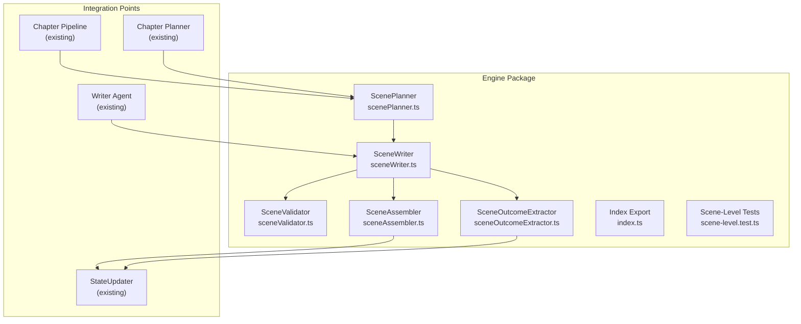
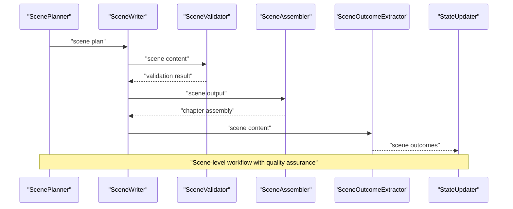
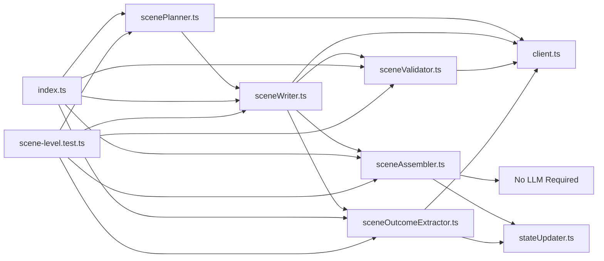

# AI Agent System

<cite>
**Referenced Files in This Document**
- [scenePlanner.ts](file://packages/engine/src/agents/scenePlanner.ts)
- [sceneWriter.ts](file://packages/engine/src/agents/sceneWriter.ts)
- [sceneValidator.ts](file://packages/engine/src/agents/sceneValidator.ts)
- [sceneAssembler.ts](file://packages/engine/src/scene/sceneAssembler.ts)
- [sceneOutcomeExtractor.ts](file://packages/engine/src/scene/sceneOutcomeExtractor.ts)
- [scene-level.test.ts](file://packages/engine/src/test/scene-level.test.ts)
- [index.ts](file://packages/engine/src/index.ts)
</cite>

## Update Summary
**Changes Made**
- Updated to reflect Applied Changes: Added six new scene-level agent modules (ScenePlanner, SceneWriter, SceneValidator, SceneAssembler, SceneOutcomeExtractor) to the AI Agent System
- These agents work together to create a complete scene-level generation pipeline that replaces the previous chapter-level approach
- The new pipeline operates at the scene granularity level, providing more granular control over narrative flow and quality
- Scene-level agents include comprehensive planning, writing, validation, assembly, and outcome extraction capabilities
- The system now supports both chapter-level and scene-level generation workflows

## Table of Contents
1. [Introduction](#introduction)
2. [Project Structure](#project-structure)
3. [Core Components](#core-components)
4. [Architecture Overview](#architecture-overview)
5. [Detailed Component Analysis](#detailed-component-analysis)
6. [Dependency Analysis](#dependency-analysis)
7. [Performance Considerations](#performance-considerations)
8. [Troubleshooting Guide](#troubleshooting-guide)
9. [Conclusion](#conclusion)
10. [Appendices](#appendices)

## Introduction
This document explains the AI Agent System that powers narrative generation. The system has evolved to support both chapter-level and scene-level generation workflows, with the new scene-level agents providing granular control over narrative elements. The system covers the agent architecture, responsibilities, communication patterns, and coordination mechanisms. It documents prompt engineering approaches, LLM integration patterns, and parameter configuration for each agent. Practical examples illustrate agent interactions, decision-making, and error handling. Guidance is included for customization, performance optimization, debugging, and the relationship between agents and the overall generation pipeline.

**Updated** The system now includes advanced scene-level generation capabilities with dedicated agents for planning, writing, validating, assembling, and extracting outcomes from individual scenes, complementing the existing chapter-level agents.

## Project Structure
The engine package implements the AI agents, LLM integration, memory/canon storage, story state management, constraint graphs, and both chapter and scene generation pipelines. The CLI app orchestrates story lifecycle and invokes the appropriate pipeline.

**Diagram sources**
- [scenePlanner.ts:16-109](file://packages/engine/src/agents/scenePlanner.ts#L16-L109)
- [sceneWriter.ts:19-111](file://packages/engine/src/agents/sceneWriter.ts#L19-L111)
- [sceneValidator.ts:14-65](file://packages/engine/src/agents/sceneValidator.ts#L14-L65)
- [sceneAssembler.ts:14-42](file://packages/engine/src/scene/sceneAssembler.ts#L14-L42)
- [sceneOutcomeExtractor.ts:14-67](file://packages/engine/src/scene/sceneOutcomeExtractor.ts#L14-L67)
- [index.ts:15-17](file://packages/engine/src/index.ts#L15-L17)
- [scene-level.test.ts:22-30](file://packages/engine/src/test/scene-level.test.ts#L22-L30)

**Section sources**
- [index.ts:1-123](file://packages/engine/src/index.ts#L1-L123)
- [scene-level.test.ts:1-301](file://packages/engine/src/test/scene-level.test.ts#L1-L301)

## Core Components
- **ScenePlanner**: Creates detailed scene plans from chapter objectives, managing scene structure, character placement, and tension progression.
- **SceneWriter**: Generates immersive narrative prose for individual scenes with character focus and location-specific details.
- **SceneValidator**: Ensures scene quality and consistency against requirements, including character presence, location accuracy, and canon compliance.
- **SceneAssembler**: Combines individual scene outputs into cohesive chapter content with proper transitions and formatting.
- **SceneOutcomeExtractor**: Extracts state changes and narrative outcomes from scenes for story state updates and continuity maintenance.
- **Integrated Index Export**: Exports all new scene-level agents alongside existing chapter-level functionality for seamless integration.

**Updated** The addition of six new scene-level agent modules completes the narrative generation system with granular scene control, enabling both chapter-level and scene-level generation workflows with comprehensive quality assurance and state management capabilities.

**Section sources**
- [scenePlanner.ts:12-109](file://packages/engine/src/agents/scenePlanner.ts#L12-L109)
- [sceneWriter.ts:15-111](file://packages/engine/src/agents/sceneWriter.ts#L15-L111)
- [sceneValidator.ts:11-65](file://packages/engine/src/agents/sceneValidator.ts#L11-L65)
- [sceneAssembler.ts:11-42](file://packages/engine/src/scene/sceneAssembler.ts#L11-L42)
- [sceneOutcomeExtractor.ts:10-67](file://packages/engine/src/scene/sceneOutcomeExtractor.ts#L10-L67)
- [index.ts:15-17](file://packages/engine/src/index.ts#L15-L17)

## Architecture Overview
The system now supports a dual-level generation architecture with scene-level agents working alongside existing chapter-level components:

- **Scene Planning Level**: ScenePlanner creates detailed scene breakdowns from chapter objectives, managing character placement, location assignments, and tension progression.
- **Scene Execution Level**: SceneWriter generates individual scene content with immersive prose, SceneValidator ensures quality compliance, and SceneAssembler combines scenes into chapters.
- **Outcome Processing Level**: SceneOutcomeExtractor extracts narrative changes for state updates, working with the existing StateUpdater pipeline.
- **Integration Layer**: New scene-level agents integrate seamlessly with existing chapter-level components through the centralized index export system.

**Updated** The architecture now includes comprehensive scene-level generation capabilities with quality validation at each step, ensuring high-quality narrative output at the individual scene level while maintaining integration with existing chapter-level workflows.

**Diagram sources**
- [scenePlanner.ts:16-109](file://packages/engine/src/agents/scenePlanner.ts#L16-L109)
- [sceneWriter.ts:19-111](file://packages/engine/src/agents/sceneWriter.ts#L19-L111)
- [sceneValidator.ts:14-65](file://packages/engine/src/agents/sceneValidator.ts#L14-L65)
- [sceneAssembler.ts:14-42](file://packages/engine/src/scene/sceneAssembler.ts#L14-L42)
- [sceneOutcomeExtractor.ts:14-67](file://packages/engine/src/scene/sceneOutcomeExtractor.ts#L14-L67)

## Detailed Component Analysis

### ScenePlanner Agent
**New** Responsibilities:
- Transform chapter objectives into detailed scene breakdowns with specific character assignments and location requirements.
- Manage scene tension progression from setup to climax, ensuring narrative flow and dramatic arc consistency.
- Generate scene-specific details including purpose statements, conflict descriptions, and scene types.
- Provide fallback mechanisms for scene planning when LLM services are unavailable.

Prompt engineering approach:
- Comprehensive scene planning template with detailed character and setting requirements.
- Progressive tension building guidance from 0-10 scale with specific target ranges.
- Scene type classification (dialogue, action, reveal, investigation, transition) with appropriate guidance.
- JSON structure enforcement for reliable parsing and validation.

LLM integration pattern:
- Moderate temperature (0.7) for creative yet focused scene planning.
- High token limit (2000) for detailed scene descriptions and planning context.
- JSON mode for structured scene plan generation with automatic validation.

Parameters:
- Temperature: 0.7 for balanced creativity in scene planning.
- Max tokens: 2000 for comprehensive scene detail generation.
- Target scene count: configurable default of 4 scenes per chapter.

Decision-making:
- Creates 1-6 scenes per chapter based on target scene count with progressive tension building.
- Assigns characters to scenes based on story requirements and character roles.
- Ensures each scene has clear purpose, location, and tension level.
- Generates natural scene transitions and maintains narrative coherence.

Error handling:
- Provides fallback scene plan generation using story context and character information.
- Validates scene plan structure and throws descriptive errors for malformed output.
- Maintains sequential scene numbering and proper scene ID assignment.

Customization tips:
- Adjust target scene count based on story complexity and genre requirements.
- Modify tension progression curves for different narrative styles and dramatic arcs.
- Customize scene types and character assignments for specific story needs.

Practical example:
- Generates detailed scene breakdowns with 4 scenes per chapter.
- Creates progressive tension from 3-7 across scenes with proper character placement.
- Ensures critical plot points are covered in opening and closing scenes.

**Section sources**
- [scenePlanner.ts:12-170](file://packages/engine/src/agents/scenePlanner.ts#L12-L170)

### SceneWriter Agent
**New** Responsibilities:
- Generate immersive narrative prose for individual scenes with character-focused storytelling.
- Maintain scene-specific focus while contributing to overall chapter narrative flow.
- Handle scene continuation and quality control for extended narrative sequences.
- Provide fallback mechanisms for scene generation when LLM services fail.

Prompt engineering approach:
- Scene-specific writing template with character details and context integration.
- Immersive prose guidelines emphasizing sensory details and narrative engagement.
- Target tension maintenance with specific tension level guidance (0-10 scale).
- Scene boundary management to ensure natural continuation to next scene.

LLM integration pattern:
- Higher temperature (0.8) for creative and engaging narrative generation.
- Generous token limit (2500) for immersive scene content with proper context.
- JSON mode for structured scene output with content, summary, and word count.

Parameters:
- Temperature: 0.8 for creative and engaging scene writing.
- Max tokens: 2500 for comprehensive scene content generation.
- Content validation: minimum 100 characters for quality assurance.

Decision-making:
- Focuses on single scene narrative without rushing to resolve all story elements.
- Maintains target tension level throughout scene content.
- Ensures proper scene transitions and narrative flow.
- Handles scene continuation based on natural ending points.

Error handling:
- Provides fallback scene generation based on scene type and character information.
- Validates scene content length and quality before returning results.
- Maintains consistent scene output structure with automatic word count calculation.

Customization tips:
- Adjust writing style and tone based on genre and story requirements.
- Modify tension guidance for different dramatic styles and pacing needs.
- Customize character focus and dialogue emphasis for character-driven narratives.

Practical example:
- Generates immersive scene content with proper character interaction.
- Maintains 6/10 target tension with appropriate narrative pacing.
- Ensures natural scene boundaries with proper continuation cues.

**Section sources**
- [sceneWriter.ts:15-139](file://packages/engine/src/agents/sceneWriter.ts#L15-L139)

### SceneValidator Agent
**New** Responsibilities:
- Validate scene quality against specific requirements including character presence, location accuracy, and purpose fulfillment.
- Ensure scene content meets minimum quality standards and narrative coherence.
- Check for canon compliance and consistency with established story facts.
- Provide both LLM-powered and quick validation modes for different performance needs.

Prompt engineering approach:
- Quality control template with specific validation criteria and requirements.
- Comprehensive validation checklist covering characters, location, purpose, and tension.
- Canon compliance checking with established story facts and consistency rules.
- Structured validation result reporting with violation details.

LLM integration pattern:
- Low temperature (0.3) for consistent and objective validation assessment.
- Moderate token limit (1000) for comprehensive validation analysis.
- JSON mode for structured validation result reporting.

Parameters:
- Temperature: 0.3 for objective and consistent validation assessment.
- Max tokens: 1000 for comprehensive validation analysis.
- Validation modes: LLM-powered and quick validation for performance optimization.

Decision-making:
- Performs multi-level validation including content length, character presence, and location accuracy.
- Checks for narrative purpose fulfillment and tension level appropriateness.
- Validates against established canon facts and story consistency requirements.
- Provides detailed violation reporting with specific issue descriptions.

Error handling:
- Implements quick validation mode for performance-critical scenarios.
- Provides fallback validation using basic content analysis and character/location checks.
- Returns structured validation results with comprehensive violation reporting.

Customization tips:
- Adjust validation thresholds based on story complexity and quality requirements.
- Customize violation reporting for different narrative styles and consistency needs.
- Balance LLM-powered validation with quick validation for optimal performance.

Practical example:
- Validates scene content against character requirements and location accuracy.
- Checks for proper tension level maintenance and narrative purpose fulfillment.
- Provides detailed violation reporting with specific improvement suggestions.

**Section sources**
- [sceneValidator.ts:11-117](file://packages/engine/src/agents/sceneValidator.ts#L11-L117)

### SceneAssembler Agent
**New** Responsibilities:
- Combine individual scene outputs into cohesive chapter content with proper transitions and formatting.
- Generate chapter titles and summaries from scene-level information and planning context.
- Calculate chapter statistics including word count, scene count, and narrative metrics.
- Maintain narrative flow and structural coherence across multiple scene contributions.

Prompt engineering approach:
- Chapter assembly template with scene combination and transition management.
- Title generation algorithm with descriptive goal extraction and tension-based naming.
- Summary generation from individual scene summaries with narrative flow enhancement.
- Formatting guidelines for chapter presentation and readability.

LLM integration pattern:
- Minimal LLM usage for chapter-level operations (no LLM required for core assembly).
- Heuristic-based algorithms for title generation and content combination.
- Structured output formatting for chapter presentation.

Parameters:
- No LLM parameters needed for core assembly operations.
- Dynamic title generation based on chapter goals and tension levels.
- Automatic content formatting with proper scene separation and transitions.

Decision-making:
- Generates meaningful chapter titles from descriptive chapter goals or tension indicators.
- Combines scene content with appropriate transitions and paragraph separation.
- Creates comprehensive chapter summaries from individual scene summaries.
- Calculates chapter statistics and maintains narrative coherence.

Error handling:
- Validates scene output structure and throws descriptive errors for malformed input.
- Handles edge cases in title generation and content combination.
- Maintains consistent chapter formatting and structural integrity.

Customization tips:
- Adjust title generation algorithms for different naming conventions and styles.
- Customize summary generation for different narrative summary preferences.
- Modify transition handling for different narrative flow and pacing styles.

Practical example:
- Combines multiple scene outputs into cohesive chapter content.
- Generates descriptive chapter titles from chapter goals and tension levels.
- Creates comprehensive chapter summaries with proper narrative flow.

**Section sources**
- [sceneAssembler.ts:11-115](file://packages/engine/src/scene/sceneAssembler.ts#L11-L115)

### SceneOutcomeExtractor Agent
**New** Responsibilities:
- Extract state changes and narrative outcomes from individual scenes for story state updates.
- Identify key events, character developments, location changes, and new information revealed.
- Provide structured outcome data for integration with the existing StateUpdater pipeline.
- Support both detailed LLM-powered extraction and fallback outcome generation.

Prompt engineering approach:
- Outcome extraction template with specific change identification requirements.
- Comprehensive change tracking for events, character states, location dynamics, and new information.
- Structured extraction format with organized outcome categories and data structures.
- Integration-ready output format for seamless StateUpdater pipeline integration.

LLM integration pattern:
- Moderate temperature (0.4) for balanced and comprehensive outcome extraction.
- Moderate token limit (1500) for detailed outcome analysis and change identification.
- JSON mode for structured outcome extraction with automatic parsing.

Parameters:
- Temperature: 0.4 for balanced and comprehensive outcome extraction.
- Max tokens: 1500 for detailed outcome analysis and change identification.
- Outcome merging: automatic merging of multiple scene outcomes with duplicate removal.

Decision-making:
- Identifies key events that occurred during scene execution.
- Tracks character changes including emotional states, knowledge acquisition, and status updates.
- Monitors location changes and character movement patterns.
- Extracts new information revealed and integrates with existing story knowledge.

Error handling:
- Provides fallback outcome generation with basic scene completion tracking.
- Implements automatic outcome merging with duplicate removal and data consolidation.
- Handles malformed extraction output with graceful fallback mechanisms.

Customization tips:
- Adjust extraction focus based on story complexity and outcome tracking needs.
- Customize outcome categories for different narrative styles and tracking preferences.
- Modify merging algorithms for different outcome consolidation strategies.

Practical example:
- Extracts comprehensive outcomes including key events, character changes, and new information.
- Generates structured outcome data for StateUpdater pipeline integration.
- Merges multiple scene outcomes with duplicate removal and data consolidation.

**Section sources**
- [sceneOutcomeExtractor.ts:10-117](file://packages/engine/src/scene/sceneOutcomeExtractor.ts#L10-L117)

### Integration and Export System
**Updated** The centralized index export system now includes comprehensive scene-level agent exports alongside existing chapter-level functionality.

Responsibilities:
- Export all new scene-level agents (planScenes, writeScene, validateScene, quickValidateScene) with proper typing.
- Maintain backward compatibility with existing chapter-level agent exports.
- Provide unified access to both scene-level and chapter-level generation capabilities.
- Support integration with existing pipeline components and workflows.

Export structure:
- Scene planning functions: planScenes
- Scene writing functions: writeScene
- Scene validation functions: validateScene, quickValidateScene
- Scene assembly functions: assembleChapter, formatChapterWithHeading
- Scene outcome functions: extractSceneOutcome, mergeSceneOutcomes

Integration patterns:
- Seamless integration with existing StateUpdater pipeline for outcome processing.
- Compatibility with existing Chapter Planner and Writer Agent workflows.
- Support for both synchronous and asynchronous scene-level generation workflows.
- Unified typing system supporting both scene-level and chapter-level operations.

**Section sources**
- [index.ts:15-17](file://packages/engine/src/index.ts#L15-L17)
- [index.ts:120-123](file://packages/engine/src/index.ts#L120-L123)

## Dependency Analysis
**Updated** The scene-level agents integrate seamlessly with existing chapter-level components while maintaining independence for flexible workflow selection.

The new scene-level agents depend on the LLM client for generation and validation tasks, while core assembly and outcome extraction functions operate independently. Integration with existing StateUpdater pipeline enables comprehensive narrative state management.

**Updated** The dependency graph shows comprehensive integration of scene-level agents with existing system components, including LLM client integration, StateUpdater pipeline connectivity, and unified export system.

**Diagram sources**
- [scenePlanner.ts:1-20](file://packages/engine/src/agents/scenePlanner.ts#L1-L20)
- [sceneWriter.ts:1-32](file://packages/engine/src/agents/sceneWriter.ts#L1-L32)
- [sceneValidator.ts:1-18](file://packages/engine/src/agents/sceneValidator.ts#L1-L18)
- [sceneAssembler.ts:1-10](file://packages/engine/src/scene/sceneAssembler.ts#L1-L10)
- [sceneOutcomeExtractor.ts:1-10](file://packages/engine/src/scene/sceneOutcomeExtractor.ts#L1-L10)
- [index.ts:15-17](file://packages/engine/src/index.ts#L15-L17)
- [scene-level.test.ts:22-30](file://packages/engine/src/test/scene-level.test.ts#L22-L30)

**Section sources**
- [index.ts:1-123](file://packages/engine/src/index.ts#L1-L123)
- [scene-level.test.ts:1-301](file://packages/engine/src/test/scene-level.test.ts#L1-L301)

## Performance Considerations
**Updated** Performance considerations now include the computational overhead of scene-level generation with individual validation and outcome processing.

- **Token budget management**: SceneWriter uses highest token limit (2500) for immersive content; ScenePlanner uses 2000 for detailed planning; SceneValidator uses 1000 for validation; SceneOutcomeExtractor uses 1500 for comprehensive outcome analysis.
- **Temperature tuning**: ScenePlanner uses 0.7 for balanced creativity; SceneWriter uses 0.8 for creative engagement; SceneValidator uses 0.3 for objective assessment; SceneOutcomeExtractor uses 0.4 for balanced extraction.
- **Parallel processing**: Scene-level agents can operate in parallel streams for improved throughput in multi-scene chapters.
- **Quality validation**: SceneValidator provides both LLM-powered and quick validation modes for performance optimization.
- **Fallback mechanisms**: All scene-level agents include comprehensive fallback functionality for reliability and reduced LLM dependency.
- **Memory efficiency**: SceneAssembler and SceneOutcomeExtractor operate without LLM for core operations, reducing computational overhead.
- **Integration optimization**: Centralized index export system minimizes import overhead and improves module loading performance.

## Troubleshooting Guide
**Updated** Troubleshooting guide now includes scene-level agent-specific considerations and integration challenges.

Common issues and resolutions:
- **Scene planning failures**: Check LLM availability and token limits; verify story context and character information completeness.
- **Scene writing quality issues**: Adjust SceneWriter temperature and prompt context; verify scene plan quality and character requirements.
- **Scene validation failures**: Review SceneValidator criteria and violation reports; check for character presence and location accuracy issues.
- **Assembly errors**: Verify scene output structure and content validity; check for proper scene numbering and transition handling.
- **Outcome extraction problems**: Review SceneOutcomeExtractor prompt clarity and content quality; verify integration with StateUpdater pipeline.
- **Integration conflicts**: Ensure proper import/export from centralized index system; verify type compatibility between scene-level and chapter-level components.
- **Performance bottlenecks**: Implement quick validation mode for performance-critical scenarios; consider parallel scene processing for multi-scene chapters.
- **Fallback mechanism failures**: Test fallback functionality for all scene-level agents; verify manual validation and assembly capabilities.

Operational logs:
- ScenePlanner logs scene plan generation and validation results.
- SceneWriter logs scene content generation and quality metrics.
- SceneValidator logs validation results and violation analysis.
- SceneAssembler logs chapter assembly and formatting operations.
- SceneOutcomeExtractor logs outcome extraction and merging operations.
- Integration system logs show proper export and import of scene-level agents.

**Section sources**
- [scene-level.test.ts:94-301](file://packages/engine/src/test/scene-level.test.ts#L94-L301)

## Conclusion
**Updated** The AI Agent System now provides comprehensive narrative generation capabilities at both chapter and scene levels, with six new scene-level agents completing the generation pipeline.

The system includes ScenePlanner for detailed scene breakdowns, SceneWriter for immersive narrative generation, SceneValidator for quality assurance, SceneAssembler for chapter composition, and SceneOutcomeExtractor for state management integration. These agents work seamlessly with existing chapter-level components through the centralized index export system, providing flexible workflow selection and comprehensive narrative control.

**The new scene-level generation pipeline offers granular control over narrative elements, comprehensive quality validation at the individual scene level, and seamless integration with existing StateUpdater pipeline for automatic story state management.** This dual-level approach enables both high-level chapter planning and detailed scene execution, supporting diverse narrative styles and generation requirements while maintaining system reliability and performance.

## Appendices

### Scene-Level Agent Responsibilities and Parameters
**Updated** Comprehensive parameter sets for all six new scene-level agents with detailed operational specifications.

- **ScenePlanner Agent**
  - Responsibilities: Create detailed scene plans from chapter objectives, manage character placement and tension progression.
  - Parameters: temperature 0.7, maxTokens 2000, targetSceneCount 4.
- **SceneWriter Agent**
  - Responsibilities: Generate immersive narrative prose for individual scenes with character focus and tension maintenance.
  - Parameters: temperature 0.8, maxTokens 2500, content validation threshold 100 characters.
- **SceneValidator Agent**
  - Responsibilities: Validate scene quality against requirements, check canon compliance, provide structured validation results.
  - Parameters: temperature 0.3, maxTokens 1000, validation modes (LLM-powered and quick).
- **SceneAssembler Agent**
  - Responsibilities: Combine scenes into cohesive chapters, generate titles and summaries, calculate chapter statistics.
  - Parameters: No LLM parameters needed, dynamic title generation, automatic content formatting.
- **SceneOutcomeExtractor Agent**
  - Responsibilities: Extract state changes and outcomes from scenes, identify key events and character developments.
  - Parameters: temperature 0.4, maxTokens 1500, automatic outcome merging with duplicate removal.
- **Integration System**
  - Responsibilities: Export scene-level agents alongside existing chapter-level functionality, maintain backward compatibility.
  - Parameters: Unified export system, comprehensive typing support, seamless integration with existing pipeline components.

**Section sources**
- [scenePlanner.ts:16-109](file://packages/engine/src/agents/scenePlanner.ts#L16-L109)
- [sceneWriter.ts:19-111](file://packages/engine/src/agents/sceneWriter.ts#L19-L111)
- [sceneValidator.ts:14-65](file://packages/engine/src/agents/sceneValidator.ts#L14-L65)
- [sceneAssembler.ts:14-42](file://packages/engine/src/scene/sceneAssembler.ts#L14-L42)
- [sceneOutcomeExtractor.ts:14-67](file://packages/engine/src/scene/sceneOutcomeExtractor.ts#L14-L67)
- [index.ts:15-17](file://packages/engine/src/index.ts#L15-L17)

### Scene-Level Testing Framework
**Updated** Comprehensive testing framework demonstrating all scene-level agent functionality and integration capabilities.

Key test scenarios include:
- **Scene planning validation** with proper scene structure, character assignment, and tension progression.
- **Scene writing quality** with immersive content generation, character focus, and narrative coherence.
- **Scene validation effectiveness** with comprehensive requirement checking and violation reporting.
- **Scene assembly functionality** with proper content combination, transition handling, and formatting.
- **Scene outcome extraction** with comprehensive change tracking and integration readiness.
- **Integration testing** with centralized export system and compatibility with existing components.
- **Fallback mechanism validation** across all scene-level agents for reliability and performance optimization.

Test results demonstrate:
- **Scene planning accuracy** with proper tension progression and character placement.
- **Writing quality** with immersive prose and narrative engagement.
- **Validation effectiveness** with comprehensive requirement checking and detailed violation reporting.
- **Assembly reliability** with proper content combination and formatting.
- **Outcome extraction completeness** with comprehensive change tracking and data organization.
- **Integration compatibility** with existing system components and workflows.

**Section sources**
- [scene-level.test.ts:33-301](file://packages/engine/src/test/scene-level.test.ts#L33-L301)

### Integration Patterns and Workflow Examples
**Updated** Examples of scene-level agent integration with existing chapter-level components and workflow flexibility.

Workflow patterns include:
- **Scene-first generation**: ScenePlanner → SceneWriter → SceneValidator → SceneAssembler → SceneOutcomeExtractor → StateUpdater
- **Hybrid approach**: Chapter-level planning with scene-level execution for quality control
- **Quality assurance pipeline**: Individual scene validation with chapter-level assembly
- **State management integration**: Outcome extraction feeding directly into StateUpdater pipeline
- **Performance optimization**: Quick validation mode for rapid iteration and testing

Integration benefits:
- **Flexible workflow selection** between chapter-level and scene-level approaches
- **Comprehensive quality control** at both scene and chapter levels
- **Seamless state management** through unified outcome extraction and processing
- **Performance optimization** through fallback mechanisms and validation modes
- **Backward compatibility** with existing chapter-level workflows and components

**Section sources**
- [scene-level.test.ts:94-301](file://packages/engine/src/test/scene-level.test.ts#L94-L301)
- [index.ts:15-17](file://packages/engine/src/index.ts#L15-L17)