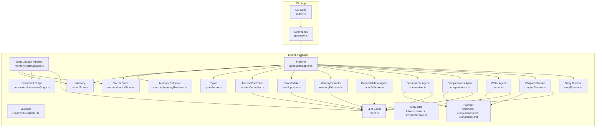
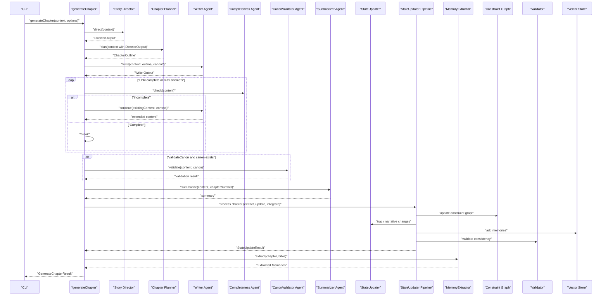
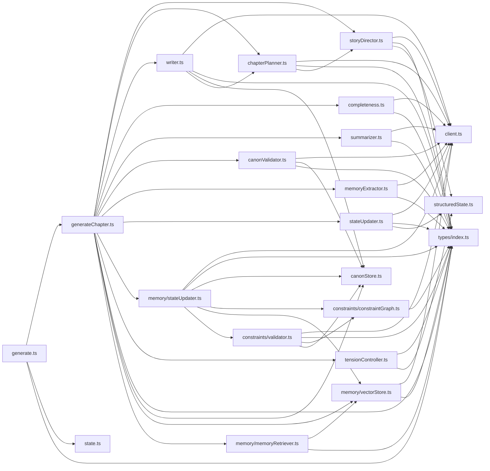

# AI Agent System

<cite>
**Referenced Files in This Document**
- [writer.ts](file://packages/engine/src/agents/writer.ts)
- [completeness.ts](file://packages/engine/src/agents/completeness.ts)
- [summarizer.ts](file://packages/engine/src/agents/summarizer.ts)
- [canonValidator.ts](file://packages/engine/src/agents/canonValidator.ts)
- [chapterPlanner.ts](file://packages/engine/src/agents/chapterPlanner.ts)
- [storyDirector.ts](file://packages/engine/src/agents/storyDirector.ts)
- [memoryExtractor.ts](file://packages/engine/src/agents/memoryExtractor.ts)
- [stateUpdater.ts](file://packages/engine/src/agents/stateUpdater.ts)
- [tensionController.ts](file://packages/engine/src/agents/tensionController.ts)
- [stateUpdater.ts](file://packages/engine/src/memory/stateUpdater.ts)
- [constraintGraph.ts](file://packages/engine/src/constraints/constraintGraph.ts)
- [validator.ts](file://packages/engine/src/constraints/validator.ts)
- [client.ts](file://packages/engine/src/llm/client.ts)
- [generateChapter.ts](file://packages/engine/src/pipeline/generateChapter.ts)
- [index.ts](file://packages/engine/src/index.ts)
- [types/index.ts](file://packages/engine/src/types/index.ts)
- [canonStore.ts](file://packages/engine/src/memory/canonStore.ts)
- [state.ts](file://packages/engine/src/story/state.ts)
- [bible.ts](file://packages/engine/src/story/bible.ts)
- [structuredState.ts](file://packages/engine/src/story/structuredState.ts)
- [writer.md](file://packages/engine/src/llm/prompts/writer.md)
- [completeness.md](file://packages/engine/src/llm/prompts/completeness.md)
- [summarizer.md](file://packages/engine/src/llm/prompts/summarizer.md)
- [generate.ts](file://apps/cli/src/commands/generate.ts)
- [index.ts](file://apps/cli/src/index.ts)
- [vectorStore.ts](file://packages/engine/src/memory/vectorStore.ts)
- [memoryRetriever.ts](file://packages/engine/src/memory/memoryRetriever.ts)
- [state-updater.test.ts](file://packages/engine/src/test/state-updater.test.ts)
- [vector-memory.test.ts](file://packages/engine/src/test/vector-memory.test.ts)
- [constraints.test.ts](file://packages/engine/src/test/constraints.test.ts)
</cite>

## Update Summary
**Changes Made**
- Updated to reflect Applied Changes: Enhanced AI agent system with new agents for memory extraction, state updating, and story validation
- Integrated vector memory system with hierarchical navigable small world (HNSW) indexing
- Added comprehensive constraint graph system for automatic narrative consistency enforcement
- Enhanced StateUpdater Pipeline with dual-mode operation (LLM-powered and quick-update)
- Integrated MemoryExtractor, StateUpdater, and Constraint Graph into the automated storytelling pipeline
- Added Validator system with dual-mode validation combining graph-based and LLM-based consistency checking

## Table of Contents
1. [Introduction](#introduction)
2. [Project Structure](#project-structure)
3. [Core Components](#core-components)
4. [Architecture Overview](#architecture-overview)
5. [Detailed Component Analysis](#detailed-component-analysis)
6. [Dependency Analysis](#dependency-analysis)
7. [Performance Considerations](#performance-considerations)
8. [Troubleshooting Guide](#troubleshooting-guide)
9. [Conclusion](#conclusion)
10. [Appendices](#appendices)

## Introduction
This document explains the AI Agent System that powers narrative generation. It covers the agent architecture, responsibilities, communication patterns, and coordination mechanisms. It documents prompt engineering approaches, LLM integration patterns, and parameter configuration for each agent. Practical examples illustrate agent interactions, decision-making, and error handling. Guidance is included for customization, performance optimization, debugging, and the relationship between agents and the overall generation pipeline.

**Updated** The system now includes advanced memory extraction, state updating, and constraint validation capabilities, forming a complete feedback loop for fully autonomous storytelling with automatic consistency maintenance and memory integration.

## Project Structure
The engine package implements the AI agents, LLM integration, memory/canon storage, story state management, constraint graphs, and the chapter generation pipeline. The CLI app orchestrates story lifecycle and invokes the pipeline.

**Diagram sources**
- [index.ts](file://packages/engine/src/index.ts#L1-L116)
- [client.ts](file://packages/engine/src/llm/client.ts#L1-L106)
- [generateChapter.ts](file://packages/engine/src/pipeline/generateChapter.ts#L1-L108)
- [storyDirector.ts](file://packages/engine/src/agents/storyDirector.ts#L1-L276)
- [chapterPlanner.ts](file://packages/engine/src/agents/chapterPlanner.ts#L1-L326)
- [writer.ts](file://packages/engine/src/agents/writer.ts#L1-L146)
- [completeness.ts](file://packages/engine/src/agents/completeness.ts#L1-L56)
- [summarizer.ts](file://packages/engine/src/agents/summarizer.ts#L1-L64)
- [canonValidator.ts](file://packages/engine/src/agents/canonValidator.ts#L1-L59)
- [memoryExtractor.ts](file://packages/engine/src/agents/memoryExtractor.ts#L1-L97)
- [stateUpdater.ts](file://packages/engine/src/agents/stateUpdater.ts#L1-L193)
- [stateUpdater.ts](file://packages/engine/src/memory/stateUpdater.ts#L1-L435)
- [tensionController.ts](file://packages/engine/src/agents/tensionController.ts#L1-L252)
- [constraintGraph.ts](file://packages/engine/src/constraints/constraintGraph.ts#L1-L471)
- [validator.ts](file://packages/engine/src/constraints/validator.ts#L1-L286)
- [vectorStore.ts](file://packages/engine/src/memory/vectorStore.ts#L1-L208)
- [memoryRetriever.ts](file://packages/engine/src/memory/memoryRetriever.ts#L1-L200)
- [canonStore.ts](file://packages/engine/src/memory/canonStore.ts#L1-L134)
- [bible.ts](file://packages/engine/src/story/bible.ts#L1-L73)
- [state.ts](file://packages/engine/src/story/state.ts#L1-L30)
- [structuredState.ts](file://packages/engine/src/story/structuredState.ts#L1-L235)
- [writer.md](file://packages/engine/src/llm/prompts/writer.md#L1-L38)
- [completeness.md](file://packages/engine/src/llm/prompts/completeness.md#L1-L26)
- [summarizer.md](file://packages/engine/src/llm/prompts/summarizer.md#L1-L13)
- [generate.ts](file://apps/cli/src/commands/generate.ts#L1-L55)
- [index.ts](file://apps/cli/src/index.ts#L1-L54)

**Section sources**
- [index.ts](file://packages/engine/src/index.ts#L1-L116)
- [generate.ts](file://apps/cli/src/commands/generate.ts#L1-L55)
- [index.ts](file://apps/cli/src/index.ts#L1-L54)

## Core Components
- **Story Director**: Analyzes story state and generates high-level chapter objectives and direction.
- **Chapter Planner**: Converts story direction into detailed scene-by-scene chapter outlines with tension progression.
- **Writer Agent**: Creates full chapters using structured prompts and manages continuations until completion.
- **Completeness Agent**: Validates that a chapter ends at a natural stopping point.
- **Summarizer Agent**: Produces concise summaries and extracts key events.
- **CanonValidator Agent**: Ensures narrative consistency against the Story Canon.
- **MemoryExtractor**: Extracts important narrative facts for future chapters.
- **StateUpdater**: Tracks and updates story state based on chapter content.
- **StateUpdater Pipeline**: **Enhanced** Comprehensive post-chapter processing pipeline that integrates memory extraction, constraint graph updates, structured state management, and automatic consistency checking.
- **Constraint Graph**: **New** Automatic constraint graph that maintains logical consistency across the narrative universe with spatial, knowledge, timeline, and logical constraints.
- **Validator**: **New** Dual-mode validation system combining graph-based and LLM-based consistency checking with automatic violation detection and suggestions.
- **Vector Store**: **New** Hierarchical Navigable Small World (HNSW) vector database for semantic memory storage and retrieval.
- **Memory Retriever**: **New** Intelligent memory retrieval system that contextualizes narrative memories for chapter generation.
- **TensionController**: Manages narrative tension throughout the story arc.
- **LLM Client**: Provides unified access to multiple providers with configurable parameters.
- **Pipeline**: Orchestrates agent interactions, retries, and state updates with integrated memory and constraint systems.
- **Memory**: Stores and formats Story Canon facts for validation and prompting.
- **Story Utilities**: Create and manage story metadata and state progression.

**Updated** The addition of the StateUpdater Pipeline, Constraint Graph, Vector Store, and Validator completes the narrative engine's feedback loop, enabling fully autonomous storytelling with automatic consistency maintenance, memory integration, and intelligent retrieval capabilities.

**Section sources**
- [storyDirector.ts](file://packages/engine/src/agents/storyDirector.ts#L100-L276)
- [chapterPlanner.ts](file://packages/engine/src/agents/chapterPlanner.ts#L110-L326)
- [writer.ts](file://packages/engine/src/agents/writer.ts#L48-L146)
- [completeness.ts](file://packages/engine/src/agents/completeness.ts#L30-L56)
- [summarizer.ts](file://packages/engine/src/agents/summarizer.ts#L17-L64)
- [canonValidator.ts](file://packages/engine/src/agents/canonValidator.ts#L31-L59)
- [memoryExtractor.ts](file://packages/engine/src/agents/memoryExtractor.ts#L52-L97)
- [stateUpdater.ts](file://packages/engine/src/agents/stateUpdater.ts#L85-L193)
- [stateUpdater.ts](file://packages/engine/src/memory/stateUpdater.ts#L90-L435)
- [constraintGraph.ts](file://packages/engine/src/constraints/constraintGraph.ts#L29-L471)
- [validator.ts](file://packages/engine/src/constraints/validator.ts#L73-L286)
- [vectorStore.ts](file://packages/engine/src/memory/vectorStore.ts#L19-L208)
- [memoryRetriever.ts](file://packages/engine/src/memory/memoryRetriever.ts#L1-L200)
- [tensionController.ts](file://packages/engine/src/agents/tensionController.ts#L214-L252)
- [client.ts](file://packages/engine/src/llm/client.ts#L31-L106)
- [generateChapter.ts](file://packages/engine/src/pipeline/generateChapter.ts#L26-L108)
- [canonStore.ts](file://packages/engine/src/memory/canonStore.ts#L101-L129)
- [bible.ts](file://packages/engine/src/story/bible.ts#L1-L73)
- [state.ts](file://packages/engine/src/story/state.ts#L1-L30)
- [structuredState.ts](file://packages/engine/src/story/structuredState.ts#L23-L235)

## Architecture Overview
The system follows a pipeline-driven architecture with enhanced automated planning capabilities and complete feedback loop:
- The CLI loads a story and constructs a GenerationContext.
- The Story Director analyzes current story state and generates chapter objectives.
- The Chapter Planner converts objectives into detailed scene-by-scene outlines with tension progression.
- The Writer Agent uses the detailed outline to create chapter content with structured scene guidance.
- The Completeness Agent checks for natural stopping points; if incomplete, the Writer Agent continues the chapter.
- The CanonValidator optionally validates against the Story Canon.
- The Summarizer produces a chapter summary.
- **The StateUpdater Pipeline processes the completed chapter, extracting memories, updating constraint graphs, managing narrative state, and performing consistency validation.**
- The MemoryExtractor stores important narrative facts for future chapters.
- The pipeline updates story state and persists all artifacts.

**Updated** The architecture now includes the StateUpdater Pipeline as a central coordinator that processes completed chapters, integrating memory extraction, constraint graph updates, structured state management, and consistency validation into a seamless feedback loop with vector memory integration.

**Diagram sources**
- [generateChapter.ts](file://packages/engine/src/pipeline/generateChapter.ts#L26-L108)
- [storyDirector.ts](file://packages/engine/src/agents/storyDirector.ts#L100-L276)
- [chapterPlanner.ts](file://packages/engine/src/agents/chapterPlanner.ts#L110-L326)
- [writer.ts](file://packages/engine/src/agents/writer.ts#L55-L117)
- [completeness.ts](file://packages/engine/src/agents/completeness.ts#L37-L52)
- [canonValidator.ts](file://packages/engine/src/agents/canonValidator.ts#L32-L55)
- [summarizer.ts](file://packages/engine/src/agents/summarizer.ts#L24-L38)
- [stateUpdater.ts](file://packages/engine/src/agents/stateUpdater.ts#L85-L193)
- [stateUpdater.ts](file://packages/engine/src/memory/stateUpdater.ts#L90-L435)
- [constraintGraph.ts](file://packages/engine/src/constraints/constraintGraph.ts#L29-L471)
- [validator.ts](file://packages/engine/src/constraints/validator.ts#L73-L286)
- [memoryExtractor.ts](file://packages/engine/src/agents/memoryExtractor.ts#L52-L97)
- [vectorStore.ts](file://packages/engine/src/memory/vectorStore.ts#L66-L93)

## Detailed Component Analysis

### Story Director Agent
Responsibilities:
- Analyze current story state and generate high-level chapter objectives.
- Determine chapter tone, focus characters, and suggested scenes.
- Provide structured guidance for the Chapter Planner based on story progression.

Prompt engineering approach:
- Uses comprehensive story context including themes, character states, and plot threads.
- Emphasizes story arc positioning and tension management.
- Generates structured JSON output with prioritized objectives.

LLM integration pattern:
- Balanced temperature for creative yet focused direction generation.
- Structured JSON mode for reliable output parsing.

Parameters:
- Temperature: 0.4 for balanced creativity.
- Max tokens: 2000 for comprehensive analysis.

Decision-making:
- Calculates target tension based on story arc position.
- Prioritizes objectives by importance and story necessity.
- Adapts tone and focus based on current narrative needs.

**Section sources**
- [storyDirector.ts](file://packages/engine/src/agents/storyDirector.ts#L100-L276)
- [tensionController.ts](file://packages/engine/src/agents/tensionController.ts#L28-L149)

### Chapter Planner Agent
**New** Responsibilities:
- Convert high-level chapter objectives into detailed scene-by-scene outlines.
- Plan progressive tension building from setup to climax.
- Ensure each scene serves specific narrative objectives.
- Generate scene transitions and planner notes for writer guidance.

Prompt engineering approach:
- Comprehensive scene planning template with tension progression guidelines.
- Detailed character and setting requirements for each scene.
- Word count estimation and scene sequencing logic.
- JSON structure enforcement for reliable parsing.

LLM integration pattern:
- Low temperature (0.4) for consistent scene planning.
- High token limit (2500) for detailed scene descriptions.
- JSON mode for structured scene outline generation.

Parameters:
- Temperature: 0.4 for consistent scene planning.
- Max tokens: 2500 for detailed scene descriptions.
- Target word count: configurable default of 2500 words.

Decision-making:
- Creates 3-6 scenes per chapter with progressive tension building.
- Opens with setup scenes, progresses through development scenes, and climaxes in final scene.
- Balances critical and high-priority objectives across scenes.
- Generates natural scene transitions and planner notes.

Error handling:
- Provides fallback outline generation without LLM when needed.
- Validates outline coverage against objectives.
- Handles malformed JSON gracefully with fallback mechanisms.

Customization tips:
- Adjust target word count per story needs.
- Modify scene count based on story complexity.
- Customize tension progression curves for different genres.
- Fine-tune objective prioritization for story-specific needs.

Practical example:
- Generates detailed scene breakdowns with 2500-word estimates.
- Creates progressive tension from 20% to 90% across scenes.
- Ensures critical objectives are covered in opening and closing scenes.

**Section sources**
- [chapterPlanner.ts](file://packages/engine/src/agents/chapterPlanner.ts#L110-L326)

### Writer Agent
Responsibilities:
- Assemble a narrative chapter prompt from Story Bible, Canon, recent summaries, and detailed chapter outline.
- Generate initial chapter content and, if needed, continue from the last sentence to reach a natural stopping point.
- Extract chapter title and compute word count.

Prompt engineering approach:
- Uses a structured template with placeholders for story metadata, characters, recent summaries, chapter outline, and guidelines.
- The prompt emphasizes narrative craft and targets a specific word count.
- Integrates detailed scene planning from the Chapter Planner.

LLM integration pattern:
- Calls the LLM client with tuned temperature and token limits.
- Provides fallback title extraction if the LLM does not include a title header.

Parameters:
- Temperature: balanced creativity for writing.
- Max tokens: generous allowance for full chapters.
- Target word count: influences prompt guidance and inferred chapter goal.

Decision-making:
- Infers chapter goal based on progress through the story to maintain narrative arc logic.
- Extracts title heuristically from the first few lines.
- Uses detailed scene outline to guide narrative structure.

Error handling:
- Returns a default title if parsing fails.
- Continues operation even if title extraction is unsuccessful.

Customization tips:
- Adjust target word count per story needs.
- Modify writing guidelines in the prompt template for tone or style.
- Tune temperature for more deterministic or creative outputs.

Practical example:
- Initial generation using detailed scene outline guidance.
- Continuation until a natural ending is achieved with scene structure adherence.

**Section sources**
- [writer.ts](file://packages/engine/src/agents/writer.ts#L48-L146)
- [writer.md](file://packages/engine/src/llm/prompts/writer.md#L1-L38)
- [client.ts](file://packages/engine/src/llm/client.ts#L78-L81)

### Completeness Agent
Responsibilities:
- Determine if a chapter ends at a natural stopping point.

Prompt engineering approach:
- Defines explicit criteria for completeness and incompleteness.
- Restricts response to a single word to reduce ambiguity.

LLM integration pattern:
- Uses low temperature and minimal tokens for deterministic classification.

Parameters:
- Temperature: very low for strict classification.
- Max tokens: small to constrain output.

Decision-making:
- Normalizes response and treats any inclusion of "INCOMPLETE" as incomplete.

Error handling:
- Returns a reason when classification is inconclusive.

Practical example:
- Repeatedly checks content after each continuation until "COMPLETE".

**Section sources**
- [completeness.ts](file://packages/engine/src/agents/completeness.ts#L30-L56)
- [completeness.md](file://packages/engine/src/llm/prompts/completeness.md#L1-L26)
- [client.ts](file://packages/engine/src/llm/client.ts#L78-L81)

### Summarizer Agent
Responsibilities:
- Produce a concise chapter summary and extract key events.

Prompt engineering approach:
- Focuses on major events, plot progress, and character changes.
- Constrains summary length to under 120 tokens.

LLM integration pattern:
- Moderate temperature and token limit for coherent summarization.

Parameters:
- Temperature: slightly creative to improve coherence.
- Max tokens: sufficient for a compact summary.

Decision-making:
- Extracts key events by scanning sentence-initial keywords.

Error handling:
- Returns empty character changes map when unavailable.

Practical example:
- Generates a summary and key events list for downstream state updates.

**Section sources**
- [summarizer.ts](file://packages/engine/src/agents/summarizer.ts#L17-L64)
- [summarizer.md](file://packages/engine/src/llm/prompts/summarizer.md#L1-L13)
- [client.ts](file://packages/engine/src/llm/client.ts#L78-L81)

### CanonValidator Agent
Responsibilities:
- Validate chapter content against the Story Canon and report contradictions.

Prompt engineering approach:
- Explicitly defines categories of contradictions and instructs JSON output.
- Limits input text length to reduce token usage.

LLM integration pattern:
- Uses JSON mode via the LLM client to enforce structured output.
- Parses and validates JSON response.

Parameters:
- Temperature: low for precise validation.
- Max tokens: moderate to accommodate JSON.

Decision-making:
- Returns valid with empty violations when no facts exist.
- Attempts JSON parsing; defaults to valid if parsing fails.

Error handling:
- Gracefully handles malformed JSON by treating as valid.

Practical example:
- Validates against character roles, backgrounds, plot thread statuses, and world rules.

**Section sources**
- [canonValidator.ts](file://packages/engine/src/agents/canonValidator.ts#L31-L59)
- [client.ts](file://packages/engine/src/llm/client.ts#L83-L95)
- [canonStore.ts](file://packages/engine/src/memory/canonStore.ts#L101-L129)

### MemoryExtractor Agent
**New** Responsibilities:
- Extract important narrative facts from chapters for future story continuity.
- Categorize extracted memories into events, character, world, and plot categories.
- Generate standalone sentences that capture important story details.

Prompt engineering approach:
- Clear categorization guidelines for different memory types.
- Specific examples of what constitutes important narrative facts.
- JSON output structure for reliable parsing.

LLM integration pattern:
- Low temperature (0.3) for consistent memory extraction.
- Structured JSON mode for reliable output parsing.

Parameters:
- Temperature: 0.3 for focused extraction.
- Max tokens: 2000 for comprehensive memory analysis.

Decision-making:
- Prioritizes significant events, character development, world details, and plot threads.
- Ensures extracted memories are specific enough for continuity maintenance.
- Limits extraction to 5-10 memories per chapter.

Error handling:
- Returns empty array when extraction fails.
- Handles malformed JSON gracefully.

**Section sources**
- [memoryExtractor.ts](file://packages/engine/src/agents/memoryExtractor.ts#L52-L97)

### StateUpdater Agent
**New** Responsibilities:
- Track and update story state based on chapter content and summaries.
- Monitor character development, plot thread progression, and question resolution.
- Maintain recent events and unresolved questions for narrative continuity.

Prompt engineering approach:
- Comprehensive state tracking with character and plot thread analysis.
- Clear separation of character updates, plot thread changes, and question management.
- Structured JSON output for reliable state updates.

LLM integration pattern:
- Low temperature (0.3) for consistent state analysis.
- Structured JSON mode for reliable state updates.

Parameters:
- Temperature: 0.3 for focused analysis.
- Max tokens: 2000 for comprehensive state tracking.

Decision-making:
- Updates character emotional states, locations, and relationship changes.
- Advances plot thread status and tension levels.
- Manages question lifecycle from introduction to resolution.

Error handling:
- Returns empty updates when analysis fails.
- Handles malformed JSON gracefully.

**Section sources**
- [stateUpdater.ts](file://packages/engine/src/agents/stateUpdater.ts#L85-L193)

### StateUpdater Pipeline
**Enhanced** Responsibilities:
- **Comprehensive post-chapter processing pipeline** that integrates memory extraction, constraint graph updates, structured state management, and consistency validation.
- **Automatic constraint graph integration** that updates character locations, knowledge, and events.
- **Multi-stage processing** including memory extraction, state updates, constraint graph maintenance, recent event tracking, and validation.
- **Dual-mode operation** supporting both LLM-powered and quick-update modes for testing and production scenarios.
- **Vector store integration** for semantic memory storage and retrieval.
- **Automatic consistency checking** through the Validator system.

Prompt engineering approach:
- **Advanced state extraction** with comprehensive character, plot thread, and world change tracking.
- **Structured extraction** for character modifications, plot thread updates, new facts, and world changes.
- **Automatic integration** with constraint graph, vector store, and validation systems.

LLM integration pattern:
- **Low temperature (0.3)** for consistent state extraction and integration.
- **High token limits (2000)** for comprehensive state analysis.
- **Structured JSON mode** for reliable extraction parsing.

Parameters:
- **Temperature: 0.3** for focused extraction.
- **Max tokens: 2000** for comprehensive state analysis.
- **Dual-mode operation** supporting both LLM-powered and quick-update modes.

Decision-making:
- **Character state updates** including emotional state, location, knowledge, relationships, and goals.
- **Plot thread management** with status updates, tension adjustments, and summary changes.
- **Constraint graph integration** including character location updates, knowledge graph expansion, and event registration.
- **Memory extraction** with automatic vector store integration.
- **Recent event tracking** maintaining narrative continuity.
- **Consistency validation** through automatic constraint checking and LLM-based validation.

Error handling:
- **Quick update mode** for testing and fallback scenarios.
- **Graceful degradation** when LLM services are unavailable.
- **Comprehensive validation** of extracted state changes.
- **Automatic error recovery** through constraint graph validation.

Customization tips:
- **Adjust extraction parameters** based on story complexity and memory requirements.
- **Configure constraint graph updates** for different narrative universes and rules.
- **Fine-tune memory extraction** categories and vector store integration.
- **Optimize for performance** by choosing appropriate update modes.
- **Customize validation thresholds** for different narrative styles and consistency requirements.

Practical example:
- **Full pipeline execution** processing a completed chapter through memory extraction, constraint graph updates, state management, and validation.
- **Automatic constraint graph integration** updating character locations and knowledge relationships.
- **Vector store integration** adding narrative memories for future retrieval.
- **Dual-mode operation** allowing testing without LLM dependencies.

**Section sources**
- [stateUpdater.ts](file://packages/engine/src/memory/stateUpdater.ts#L90-L435)

### Constraint Graph
**Enhanced** Responsibilities:
- **Automatic constraint graph maintenance** that tracks characters, locations, facts, events, and items.
- **Spatial constraints** preventing impossible character movements and teleportation.
- **Knowledge constraints** ensuring characters cannot know things they haven't learned.
- **Timeline constraints** maintaining chronological order of events.
- **Logical consistency** checking for impossible or contradictory situations.
- **Automatic graph updates** during state processing and memory integration.
- **Query capabilities** for character knowledge and location retrieval.

Prompt engineering approach:
- **Graph construction** with automatic node and edge creation.
- **Constraint validation** with detailed violation reporting.
- **Automatic integration** with state updates, memory extraction, and validation.

LLM integration pattern:
- **Heuristic-based validation** (no LLM required for core graph operations).
- **Manual constraint checking** for complex logical relationships.
- **Automatic graph updates** during state processing.

Parameters:
- **No LLM parameters** needed for core graph operations.
- **Automatic serialization** and deserialization for persistence.
- **Efficient adjacency lists** for fast constraint checking.

Decision-making:
- **Character location tracking** with automatic edge updates.
- **Knowledge graph expansion** with automatic fact node creation.
- **Event registration** with participant tracking and timeline validation.
- **Constraint violation detection** with severity assessment and suggested fixes.
- **Automatic query processing** for knowledge and location retrieval.

Error handling:
- **Automatic graph recovery** from inconsistent states.
- **Detailed violation reporting** with suggested fixes.
- **Graceful degradation** when constraint violations are detected.
- **Serialization/deserialization** for persistent constraint storage.

**Section sources**
- [constraintGraph.ts](file://packages/engine/src/constraints/constraintGraph.ts#L29-L471)

### Validator
**Enhanced** Responsibilities:
- **Dual-mode validation** combining graph-based and LLM-based consistency checking.
- **Graph-based validation** using the constraint graph for spatial, knowledge, timeline, and logical consistency.
- **LLM-based validation** providing additional semantic consistency checking.
- **Violation aggregation** combining and deduplicating validation results.
- **Automatic error suggestion** with actionable fixes for constraint violations.
- **Comprehensive validation reporting** with severity assessment and detailed explanations.

Prompt engineering approach:
- **Comprehensive validation prompt** covering all constraint types.
- **Structured violation reporting** with detailed descriptions and suggested fixes.
- **Automatic integration** with both constraint graph and LLM validation.

LLM integration pattern:
- **Low temperature (0.3)** for consistent validation.
- **Moderate token limits (1500)** for comprehensive validation analysis.
- **Structured JSON mode** for reliable violation reporting.

Parameters:
- **Temperature: 0.3** for focused validation.
- **Max tokens: 1500** for comprehensive validation analysis.
- **Dual-mode operation** supporting both graph-only and LLM-enhanced validation.

Decision-making:
- **Graph-based validation** using constraint graph checks.
- **LLM-based validation** for semantic consistency and nuanced violations.
- **Violation aggregation** combining and deduplicating results.
- **Severity assessment** distinguishing between errors and warnings.
- **Automatic error suggestion** with actionable fixes for constraint violations.

Error handling:
- **Fallback to graph validation** when LLM validation fails.
- **Automatic violation deduplication** preventing redundant reports.
- **Comprehensive error reporting** with suggested fixes.
- **Graceful degradation** when validation services are unavailable.

**Section sources**
- [validator.ts](file://packages/engine/src/constraints/validator.ts#L73-L286)

### Vector Store
**New** Responsibilities:
- **Hierarchical Navigable Small World (HNSW) indexing** for efficient semantic memory storage.
- **Vector embedding generation** using OpenAI text-embedding-3-small model.
- **Semantic search capabilities** with cosine similarity scoring.
- **Memory categorization** for event, character, world, and plot memories.
- **Automatic capacity management** with dynamic resizing and auto-embedding generation.
- **Persistent storage** with serialization/deserialization for memory preservation.

Prompt engineering approach:
- **Mock embedding generation** for testing without external APIs.
- **Dynamic index management** for optimal performance scaling.
- **Category-based filtering** for targeted memory retrieval.

LLM integration pattern:
- **OpenAI embeddings API** for high-quality vector representations.
- **Fallback mock embeddings** for testing and offline scenarios.
- **Auto-resize capability** for growing memory collections.

Parameters:
- **Dimension: 1536** for text-embedding-3-small compatibility.
- **Default capacity: 10000** with automatic resizing.
- **Cosine similarity** for semantic matching.
- **Mock embedding mode** controlled by USE_MOCK_EMBEDDINGS environment variable.

Decision-making:
- **Automatic embedding generation** using OpenAI API with fallback to mock embeddings.
- **Dynamic index resizing** to accommodate growing memory collections.
- **Efficient search algorithms** using HNSW for KNN nearest neighbor search.
- **Category-based filtering** for targeted memory retrieval.

Error handling:
- **API fallback** to mock embeddings when OpenAI API is unavailable.
- **Index auto-resize** to prevent capacity exhaustion.
- **Serialization/deserialization** for persistent memory storage.
- **Graceful degradation** when vector services are unavailable.

**Section sources**
- [vectorStore.ts](file://packages/engine/src/memory/vectorStore.ts#L19-L208)

### Memory Retriever
**New** Responsibilities:
- **Intelligent memory retrieval** for contextual chapter generation.
- **Semantic search integration** with vector store for relevant memory discovery.
- **Context-aware formatting** for LLM prompts with narrative memories.
- **Category-based filtering** for targeted memory selection.
- **Chapter-specific retrieval** for current and recent narrative context.
- **Prompt formatting** for seamless integration into writing workflows.

Prompt engineering approach:
- **Contextual memory formatting** for LLM prompts.
- **Category-based memory selection** for narrative coherence.
- **Chapter progression awareness** for relevant memory prioritization.

LLM integration pattern:
- **Vector store integration** for semantic memory search.
- **Memory formatting** for prompt inclusion.
- **Context-aware retrieval** for chapter-specific needs.

Parameters:
- **Default K: 5** for semantic search results.
- **Category filtering** for targeted memory selection.
- **Chapter-aware context** for relevant memory prioritization.

Decision-making:
- **Semantic similarity search** using vector store embeddings.
- **Category-based filtering** for narrative coherence.
- **Context-aware prioritization** for chapter-specific memory relevance.
- **Prompt formatting** for seamless LLM integration.

Error handling:
- **Graceful fallback** when vector store is unavailable.
- **Category filtering** for relevant memory selection.
- **Chapter-aware context** for memory prioritization.

**Section sources**
- [memoryRetriever.ts](file://packages/engine/src/memory/memoryRetriever.ts#L1-L200)

### TensionController Agent
**New** Responsibilities:
- Calculate target tension levels based on story arc position.
- Analyze current tension vs target and provide guidance recommendations.
- Generate tension guidance for writers including scene types and pacing notes.

Prompt engineering approach:
- Mathematical formula for natural dramatic arc progression.
- Clear tension analysis with gap assessment and recommended actions.
- Practical guidance for scene types and pacing adjustments.

LLM integration pattern:
- Heuristic calculations for tension estimation (no LLM required).
- Manual guidance generation for writer support.

Parameters:
- No LLM parameters needed for core calculations.
- Uses mathematical formulas for tension progression.

Decision-making:
- Calculates parabolic tension curve: 4 × progress × (1 - progress).
- Recommends escalation, maintenance, or resolution actions based on tension gaps.
- Provides genre-appropriate scene type recommendations.

Error handling:
- Returns neutral guidance when story state is incomplete.
- Handles edge cases for single-chapter stories.

**Section sources**
- [tensionController.ts](file://packages/engine/src/agents/tensionController.ts#L28-L252)

### LLM Client and Provider
Responsibilities:
- Provide a unified interface to multiple LLM providers.
- Load configuration from environment variables.
- Support JSON mode for structured outputs.

Integration patterns:
- Supports OpenAI and DeepSeek providers.
- Exposes complete and completeJSON methods.
- Merges default and per-call configuration.

Parameters:
- Model selection via environment.
- Temperature and maxTokens tuning per agent needs.

Debugging:
- Logs model usage for traceability.

**Section sources**
- [client.ts](file://packages/engine/src/llm/client.ts#L31-L106)

### Pipeline: generateChapter
**Updated** Responsibilities:
- Orchestrate the end-to-end chapter generation workflow with enhanced planning.
- Coordinate Story Director and Chapter Planner for detailed scene planning.
- Manage retries for continuation until completeness.
- Optionally validate against the Story Canon.
- Construct the final chapter artifact and summary.
- Extract and store memories for future chapters.
- **Process completed chapters through the StateUpdater Pipeline for comprehensive state management.**
- **Integrate with Constraint Graph and Validator for consistency checking.**
- **Initialize and manage Vector Store for semantic memory integration.**
- **Coordinate Memory Retriever for contextual memory retrieval.**

Coordination mechanisms:
- Streams context to Story Director, then Chapter Planner, then Writer Agent, then Completeness Agent, then optional CanonValidator, then Summarizer, then StateUpdater Pipeline.
- Updates story state with chapter summaries and narrative changes.
- Integrates tension guidance and memory extraction throughout the pipeline.
- **Manages automatic constraint graph updates, validation, and vector store integration throughout the process.**
- **Coordinates memory retrieval for contextual chapter generation.**

Error handling:
- Logs attempts and violations.
- Returns structured result with chapter, summary, violations, and memories extracted.
- **Handles vector store initialization and memory extraction errors gracefully.**
- **Manages constraint graph and validation failures with fallback mechanisms.**

**Section sources**
- [generateChapter.ts](file://packages/engine/src/pipeline/generateChapter.ts#L26-L108)

### Memory: Canon Store
Responsibilities:
- Store and manage Story Canon facts across categories.
- Format facts for inclusion in prompts.

Operations:
- Extract from Story Bible.
- Add/update facts.
- Retrieve by category or subject/attribute.
- Format for LLM prompts.

**Section sources**
- [canonStore.ts](file://packages/engine/src/memory/canonStore.ts#L17-L129)

### Story Utilities
Responsibilities:
- Create and update Story Bible metadata.
- Create and update story state, including chapter summaries and tension calculation.
- Format structured state for prompt inclusion.

**Section sources**
- [bible.ts](file://packages/engine/src/story/bible.ts#L1-L73)
- [state.ts](file://packages/engine/src/story/state.ts#L1-L30)
- [structuredState.ts](file://packages/engine/src/story/structuredState.ts#L181-L235)

## Dependency Analysis
**Updated** The agents now include sophisticated interdependencies with the new StateUpdater Pipeline coordinating with Constraint Graph, Validator, Vector Store, and Memory Retriever systems.

The agents depend on the LLM client and share types and memory utilities. The pipeline coordinates agents and integrates with memory, story utilities, constraint graph, vector store, and validation systems.

**Updated** The dependency graph now shows the StateUpdater Pipeline as a central coordinator that integrates with Constraint Graph, Validator, Vector Store, and Memory Retriever systems, managing the complete feedback loop for narrative consistency, memory management, and intelligent retrieval.

**Diagram sources**
- [storyDirector.ts](file://packages/engine/src/agents/storyDirector.ts#L1-L31)
- [chapterPlanner.ts](file://packages/engine/src/agents/chapterPlanner.ts#L1-L33)
- [writer.ts](file://packages/engine/src/agents/writer.ts#L1-L5)
- [completeness.ts](file://packages/engine/src/agents/completeness.ts#L1-L2)
- [summarizer.ts](file://packages/engine/src/agents/summarizer.ts#L1-L2)
- [canonValidator.ts](file://packages/engine/src/agents/canonValidator.ts#L1-L2)
- [memoryExtractor.ts](file://packages/engine/src/agents/memoryExtractor.ts#L1-L4)
- [stateUpdater.ts](file://packages/engine/src/agents/stateUpdater.ts#L1-L4)
- [stateUpdater.ts](file://packages/engine/src/memory/stateUpdater.ts#L1-L6)
- [tensionController.ts](file://packages/engine/src/agents/tensionController.ts#L1-L3)
- [constraintGraph.ts](file://packages/engine/src/constraints/constraintGraph.ts#L1-L6)
- [validator.ts](file://packages/engine/src/constraints/validator.ts#L1-L5)
- [vectorStore.ts](file://packages/engine/src/memory/vectorStore.ts#L1-L3)
- [memoryRetriever.ts](file://packages/engine/src/memory/memoryRetriever.ts#L1-L4)
- [client.ts](file://packages/engine/src/llm/client.ts#L1-L6)
- [generateChapter.ts](file://packages/engine/src/pipeline/generateChapter.ts#L1-L10)
- [types/index.ts](file://packages/engine/src/types/index.ts#L60-L90)
- [canonStore.ts](file://packages/engine/src/memory/canonStore.ts#L1-L15)
- [state.ts](file://packages/engine/src/story/state.ts#L1-L30)
- [structuredState.ts](file://packages/engine/src/story/structuredState.ts#L1-L31)
- [generate.ts](file://apps/cli/src/commands/generate.ts#L1-L55)

**Section sources**
- [index.ts](file://packages/engine/src/index.ts#L1-L116)
- [generateChapter.ts](file://packages/engine/src/pipeline/generateChapter.ts#L1-L108)

## Performance Considerations
**Updated** Performance considerations now include the additional computational load of comprehensive state management, constraint graph integration, vector memory operations, and dual-mode validation.

- **Token budget management**: Set maxTokens per agent to balance quality and cost. Writers and Summarizers can use higher limits; Completeness and CanonValidator use smaller limits. Chapter Planner uses the highest token limit (2500) for detailed scene planning. **StateUpdater Pipeline uses moderate limits (2000) for comprehensive state extraction.**
- **Temperature tuning**: Lower temperatures for classification and validation; moderate for summarization; balanced for writing; low for focused extraction tasks. **StateUpdater uses 0.3 temperature for consistent state analysis.**
- **Prompt reuse**: Keep prompts concise and consistent to reduce token usage and improve reproducibility.
- **Retry strategy**: Limit continuation attempts to avoid runaway token consumption.
- **Provider selection**: Choose models appropriate for the task; use JSON mode for structured outputs.
- **Memory formatting**: Limit input sizes for validation (e.g., truncate chapter text) to control costs.
- **Scene planning efficiency**: Chapter Planner's fallback mechanism reduces LLM dependency for basic scenarios.
- **Parallel processing**: Consider batching memory extraction and state updates for better throughput.
- **Constraint graph optimization**: **Use efficient adjacency lists and automatic graph updates to minimize computational overhead.**
- **State pipeline efficiency**: **Implement dual-mode operation (quick vs LLM-powered) to optimize performance based on requirements.**
- **Vector store optimization**: **Use HNSW indexing with appropriate capacity management and embedding generation strategies.**
- **Memory retrieval efficiency**: **Implement category-based filtering and semantic search with optimized K values.**
- **Validation performance**: **Use dual-mode validation to balance accuracy and speed, with graph-based validation as fallback.**

## Troubleshooting Guide
**Updated** Troubleshooting guide now includes StateUpdater-specific considerations, constraint graph integration issues, vector store problems, and memory retrieval challenges.

Common issues and resolutions:
- **Incomplete chapters**: Increase max continuation attempts or adjust writing guidelines to encourage natural endings.
- **JSON parsing failures**: CanonValidator falls back to valid when JSON is invalid; ensure prompts enforce JSON strictly.
- **Missing titles**: Writer falls back to a default title; verify prompt includes title guidance.
- **Provider misconfiguration**: Verify environment variables for provider, base URL, and model; the client throws on unknown provider.
- **Validation overhead**: Disable canon validation when iterating quickly; enable during final checks.
- **Scene planning failures**: Use Chapter Planner's fallback outline generation when LLM fails.
- **Outline coverage issues**: Review Chapter Planner validation results and adjust objectives if scenes miss critical priorities.
- **Tension mismatch**: Check TensionController analysis and adjust story state if target tension differs from narrative needs.
- **State update failures**: **Verify StateUpdater Pipeline configuration and ensure proper integration with constraint graph, vector store, and validator.**
- **Constraint graph violations**: **Review constraint graph statistics and check for location, knowledge, timeline, and logical consistency violations.**
- **Memory extraction issues**: **Ensure vector store is properly initialized and accessible during state updates.**
- **Vector store failures**: **Check embedding generation API availability and configure mock embeddings for testing.**
- **Memory retrieval problems**: **Verify vector store initialization and memory categorization for accurate semantic search.**
- **Dual-mode operation problems**: **Test both quick and LLM-powered modes to identify performance bottlenecks.**
- **Validation service unavailability**: **Use quick validation mode when LLM validation fails, relying on constraint graph checks.**

Operational logs:
- Pipeline logs chapter generation steps and counts.
- LLM client logs model usage for traceability.
- Chapter Planner logs scene outline generation and validation results.
- Story Director logs objective generation and priority assessments.
- **StateUpdater Pipeline logs extraction results, constraint graph updates, memory integration, and validation outcomes.**
- **Constraint Graph logs node and edge updates with validation results and query performance.**
- **Validator logs combined graph and LLM validation results with violation details and suggested fixes.**
- **Vector Store logs embedding generation, memory storage, and search performance metrics.**
- **Memory Retriever logs semantic search results and memory formatting for prompts.**

**Section sources**
- [generateChapter.ts](file://packages/engine/src/pipeline/generateChapter.ts#L27-L53)
- [client.ts](file://packages/engine/src/llm/client.ts#L63-L75)
- [writer.ts](file://packages/engine/src/agents/writer.ts#L90-L94)
- [canonValidator.ts](file://packages/engine/src/agents/canonValidator.ts#L49-L55)
- [chapterPlanner.ts](file://packages/engine/src/agents/chapterPlanner.ts#L110-L122)
- [storyDirector.ts](file://packages/engine/src/agents/storyDirector.ts#L100-L112)
- [stateUpdater.ts](file://packages/engine/src/memory/stateUpdater.ts#L90-L120)
- [constraintGraph.ts](file://packages/engine/src/constraints/constraintGraph.ts#L229-L245)
- [validator.ts](file://packages/engine/src/constraints/validator.ts#L83-L124)
- [vectorStore.ts](file://packages/engine/src/memory/vectorStore.ts#L125-L148)
- [memoryRetriever.ts](file://packages/engine/src/memory/memoryRetriever.ts#L1-L200)

## Conclusion
**Updated** The AI Agent System now composes specialized agents around a robust pipeline with enhanced automated planning capabilities and complete feedback loop.

The system includes the Story Director for high-level narrative guidance, the Chapter Planner for detailed scene-by-scene planning, the Writer Agent for chapter creation, the Completeness Agent for structural validation, the Summarizer for narrative synthesis, the CanonValidator for consistency checking, the MemoryExtractor for continuity maintenance, the StateUpdater for narrative tracking, the StateUpdater Pipeline for comprehensive post-chapter processing, the Constraint Graph for automatic consistency enforcement, the Validator for dual-mode validation, the Vector Store for semantic memory management, the Memory Retriever for intelligent memory retrieval, and the TensionController for dramatic arc management.

The LLM client abstracts provider differences and supports structured outputs across all agents. **The new StateUpdater Pipeline, Constraint Graph, Vector Store, and Validator complete the feedback loop, enabling fully autonomous storytelling with automatic consistency maintenance, memory integration, intelligent retrieval, and comprehensive validation.** Together, they form a scalable, debuggable, and customizable generation pipeline suitable for iterative storytelling with significantly expanded automated capabilities and advanced memory management.

## Appendices

### Agent Responsibilities and Parameters
**Updated** Enhanced with new agents and expanded parameter sets including StateUpdater Pipeline, Constraint Graph, Validator, Vector Store, and Memory Retriever.

- **Story Director Agent**
  - Responsibilities: Analyze story state, generate objectives, determine tone and focus.
  - Parameters: temperature 0.4, maxTokens 2000.
- **Chapter Planner Agent**
  - Responsibilities: Convert objectives to scene outlines, manage tension progression, ensure objective coverage.
  - Parameters: temperature 0.4, maxTokens 2500, targetWordCount 2500.
- **Writer Agent**
  - Responsibilities: Create chapters, infer goals, handle continuations, extract titles, compute word counts.
  - Parameters: temperature, maxTokens, targetWordCount.
- **Completeness Agent**
  - Responsibilities: Classify completeness.
  - Parameters: temperature, maxTokens.
- **Summarizer Agent**
  - Responsibilities: Summarize and extract key events.
  - Parameters: temperature, maxTokens.
- **CanonValidator Agent**
  - Responsibilities: Detect contradictions and return JSON.
  - Parameters: temperature, maxTokens.
- **MemoryExtractor Agent**
  - Responsibilities: Extract narrative memories for continuity.
  - Parameters: temperature 0.3, maxTokens 2000.
- **StateUpdater Agent**
  - Responsibilities: Track narrative changes and update story state.
  - Parameters: temperature 0.3, maxTokens 2000.
- **StateUpdater Pipeline**
  - Responsibilities: **Comprehensive post-chapter processing with memory extraction, constraint graph updates, state management, and validation.**
  - Parameters: temperature 0.3, maxTokens 2000, **dual-mode operation**.
- **Constraint Graph**
  - Responsibilities: **Automatic constraint maintenance with spatial, knowledge, timeline, and logical consistency checking.**
  - Parameters: **No LLM parameters**, automatic graph operations.
- **Validator**
  - Responsibilities: **Dual-mode validation combining graph-based and LLM-based consistency checking with automatic error suggestions.**
  - Parameters: temperature 0.3, maxTokens 1500, **dual-mode operation**.
- **Vector Store**
  - Responsibilities: **Hierarchical Navigable Small World indexing for semantic memory storage and retrieval.**
  - Parameters: **Dimension 1536, default capacity 10000, cosine similarity, mock embedding mode.**
- **Memory Retriever**
  - Responsibilities: **Intelligent memory retrieval for contextual chapter generation with semantic search.**
  - Parameters: **Default K=5, category filtering, chapter-aware context.**
- **TensionController Agent**
  - Responsibilities: Calculate target tension and provide guidance.
  - Parameters: None (mathematical calculations).

**Section sources**
- [storyDirector.ts](file://packages/engine/src/agents/storyDirector.ts#L100-L276)
- [chapterPlanner.ts](file://packages/engine/src/agents/chapterPlanner.ts#L110-L326)
- [writer.ts](file://packages/engine/src/agents/writer.ts#L55-L94)
- [completeness.ts](file://packages/engine/src/agents/completeness.ts#L37-L52)
- [summarizer.ts](file://packages/engine/src/agents/summarizer.ts#L24-L38)
- [canonValidator.ts](file://packages/engine/src/agents/canonValidator.ts#L32-L55)
- [memoryExtractor.ts](file://packages/engine/src/agents/memoryExtractor.ts#L52-L97)
- [stateUpdater.ts](file://packages/engine/src/agents/stateUpdater.ts#L85-L193)
- [stateUpdater.ts](file://packages/engine/src/memory/stateUpdater.ts#L90-L435)
- [constraintGraph.ts](file://packages/engine/src/constraints/constraintGraph.ts#L29-L471)
- [validator.ts](file://packages/engine/src/constraints/validator.ts#L73-L286)
- [vectorStore.ts](file://packages/engine/src/memory/vectorStore.ts#L19-L208)
- [memoryRetriever.ts](file://packages/engine/src/memory/memoryRetriever.ts#L1-L200)
- [tensionController.ts](file://packages/engine/src/agents/tensionController.ts#L214-L252)

### Prompt Engineering Notes
**Updated** Enhanced with StateUpdater, Constraint Graph, Validator, Vector Store, and Memory Retriever prompt engineering guidance.

- Use explicit criteria and constrained outputs for classification tasks.
- Provide clear structure and examples for summarization.
- Enforce JSON output for validation tasks.
- Keep prompts modular and reusable across agents.
- Chapter Planner requires detailed scene progression guidelines.
- Story Director needs comprehensive story context and tension management.
- Memory extraction requires clear categorization examples.
- State tracking needs specific change detection patterns.
- **StateUpdater Pipeline requires comprehensive extraction templates for character, plot thread, and world changes.**
- **Constraint Graph integration requires automatic node and edge creation templates.**
- **Validator prompts need comprehensive constraint checking with detailed violation reporting and error suggestions.**
- **Vector Store prompts need embedding generation and memory categorization guidelines.**
- **Memory Retriever prompts require semantic search and context-aware formatting.**

**Section sources**
- [writer.md](file://packages/engine/src/llm/prompts/writer.md#L1-L38)
- [completeness.md](file://packages/engine/src/llm/prompts/completeness.md#L1-L26)
- [summarizer.md](file://packages/engine/src/llm/prompts/summarizer.md#L1-L13)
- [client.ts](file://packages/engine/src/llm/client.ts#L83-L95)
- [chapterPlanner.ts](file://packages/engine/src/agents/chapterPlanner.ts#L35-L108)
- [storyDirector.ts](file://packages/engine/src/agents/storyDirector.ts#L33-L98)
- [memoryExtractor.ts](file://packages/engine/src/agents/memoryExtractor.ts#L14-L50)
- [stateUpdater.ts](file://packages/engine/src/agents/stateUpdater.ts#L25-L83)
- [stateUpdater.ts](file://packages/engine/src/memory/stateUpdater.ts#L31-L88)
- [constraintGraph.ts](file://packages/engine/src/constraints/constraintGraph.ts#L1-L471)
- [validator.ts](file://packages/engine/src/constraints/validator.ts#L22-L71)
- [vectorStore.ts](file://packages/engine/src/memory/vectorStore.ts#L125-L148)
- [memoryRetriever.ts](file://packages/engine/src/memory/memoryRetriever.ts#L1-L200)

### CLI Usage Example
**Updated** Enhanced with new agent integration, StateUpdater Pipeline, Constraint Graph, Vector Store, and Validator.

- Initialize a story and generate chapters iteratively using the CLI command.
- The CLI constructs GenerationContext and persists state and chapters after each run.
- The pipeline now coordinates Story Director, Chapter Planner, Writer agents, and **StateUpdater Pipeline** automatically.
- **Memory extraction, constraint graph updates, state management, and validation occur seamlessly in the background.**
- **Constraint Graph and Validator provide automatic consistency checking throughout the process.**
- **Vector Store manages semantic memory storage and retrieval for intelligent chapter generation.**
- **Memory Retriever provides contextual memory integration for enhanced narrative coherence.**

**Section sources**
- [generate.ts](file://apps/cli/src/commands/generate.ts#L19-L54)
- [index.ts](file://apps/cli/src/index.ts#L35-L51)

### StateUpdater Pipeline Testing
**Enhanced** Comprehensive testing framework for the StateUpdater Pipeline demonstrates complete functionality with vector memory integration and constraint graph validation.

Key test scenarios include:
- **Component initialization** with constraint graph, vector store, and canon store setup.
- **Quick update mode** demonstrating fallback functionality without LLM.
- **Vector store integration** verifying memory extraction and storage with HNSW indexing.
- **Constraint graph updates** validating automatic graph maintenance and query capabilities.
- **Structured state updates** ensuring proper narrative state management.
- **Multi-chapter simulation** demonstrating scalability and consistency across iterations.
- **Memory search functionality** verifying semantic retrieval with cosine similarity scoring.
- **Dual-mode operation** testing both quick and LLM-powered update modes.
- **Validation integration** demonstrating automatic consistency checking through the Validator system.

Test results demonstrate:
- **Automatic constraint graph updates** with proper node and edge management.
- **Vector store integration** with memory extraction, HNSW indexing, and semantic search.
- **Structured state management** with comprehensive character and plot thread updates.
- **Multi-chapter consistency** maintaining narrative coherence across iterations.
- **Performance optimization** with dual-mode operation support and capacity management.
- **Validation integration** with automatic constraint checking and error suggestions.

**Section sources**
- [state-updater.test.ts](file://packages/engine/src/test/state-updater.test.ts#L1-L251)

### Vector Store Testing
**New** Comprehensive testing framework for the Vector Store demonstrates semantic memory capabilities.

Key test scenarios include:
- **Vector store initialization** with HNSW indexing and capacity management.
- **Memory embedding generation** with OpenAI API integration and mock embedding fallback.
- **Semantic search functionality** with cosine similarity scoring and KNN retrieval.
- **Category-based filtering** for targeted memory retrieval.
- **Memory serialization** for persistent storage and retrieval.
- **Memory extraction integration** demonstrating chapter-to-memory conversion.

Test results demonstrate:
- **HNSW indexing** with efficient nearest neighbor search algorithms.
- **Embedding generation** with automatic API fallback to mock embeddings.
- **Semantic search** with accurate similarity scoring and result ranking.
- **Category filtering** for narrative coherence and targeted retrieval.
- **Persistent storage** with serialization/deserialization for memory preservation.
- **Integration capabilities** with memory extraction and retrieval workflows.

**Section sources**
- [vector-memory.test.ts](file://packages/engine/src/test/vector-memory.test.ts#L1-L185)

### Constraint Graph Testing
**New** Comprehensive testing framework for the Constraint Graph demonstrates automatic consistency enforcement.

Key test scenarios include:
- **Constraint graph creation** with character, location, and event node management.
- **Knowledge and location queries** for character state retrieval.
- **Constraint violation detection** for timeline and knowledge consistency.
- **Automatic graph updates** for character location changes and event registration.
- **Serialization and deserialization** for persistent constraint storage.
- **Dual-mode validation** with graph-based and LLM-based consistency checking.

Test results demonstrate:
- **Automatic node and edge management** with efficient adjacency list operations.
- **Query capabilities** for character knowledge and location retrieval.
- **Constraint violation detection** with severity assessment and suggested fixes.
- **Automatic graph updates** with proper edge management and constraint enforcement.
- **Persistent storage** with serialization/deserialization for constraint preservation.
- **Validation integration** with automatic consistency checking and error reporting.

**Section sources**
- [constraints.test.ts](file://packages/engine/src/test/constraints.test.ts#L1-L264)