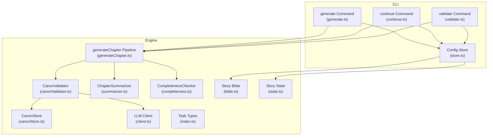
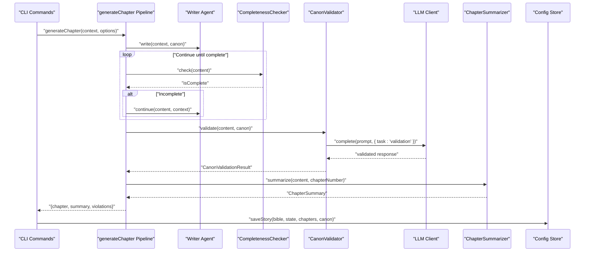
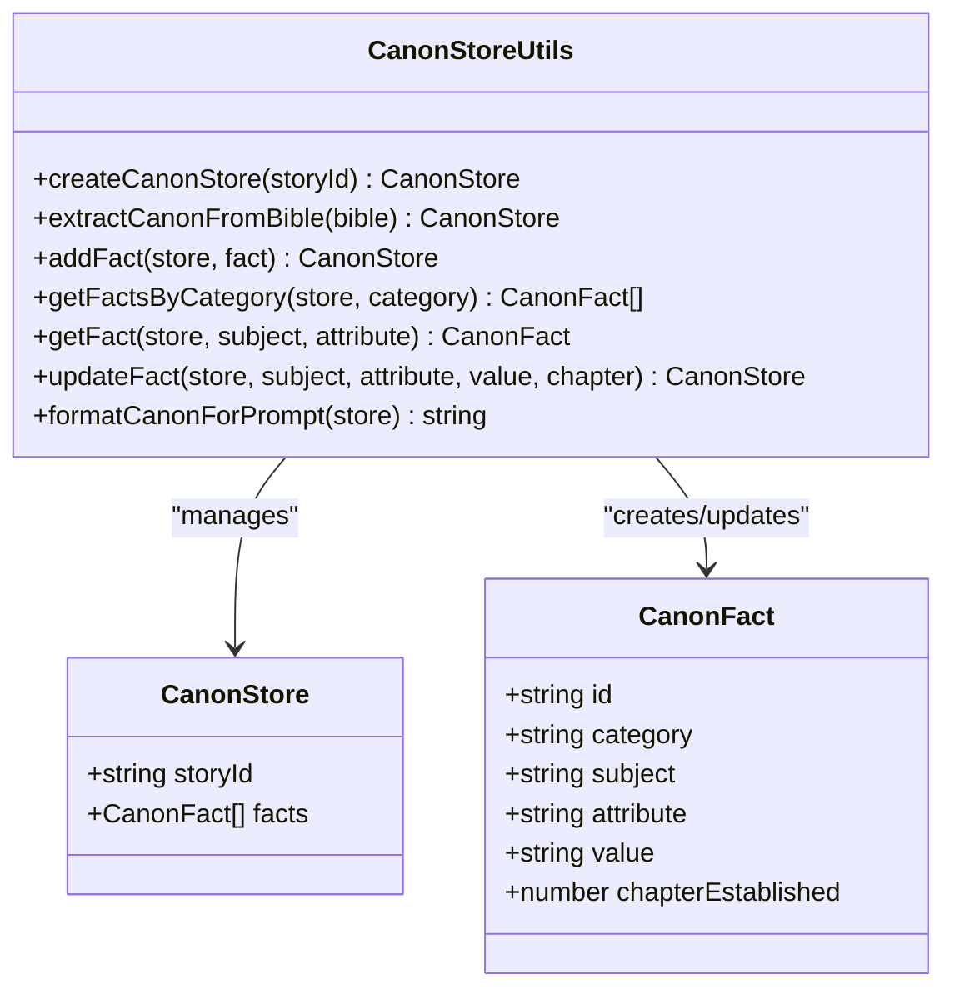
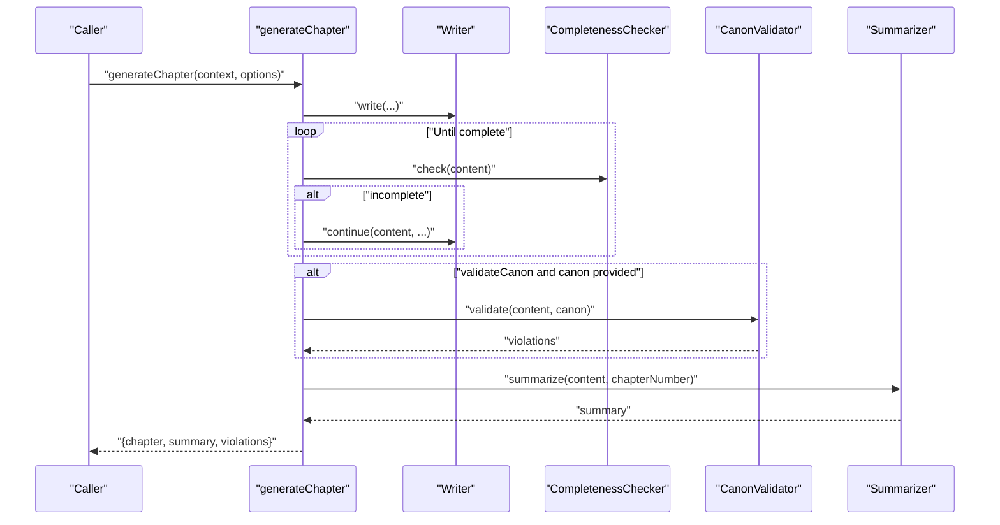
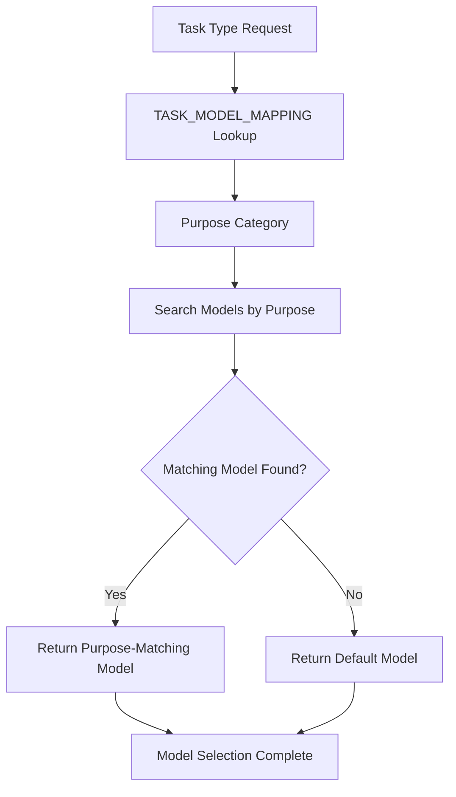
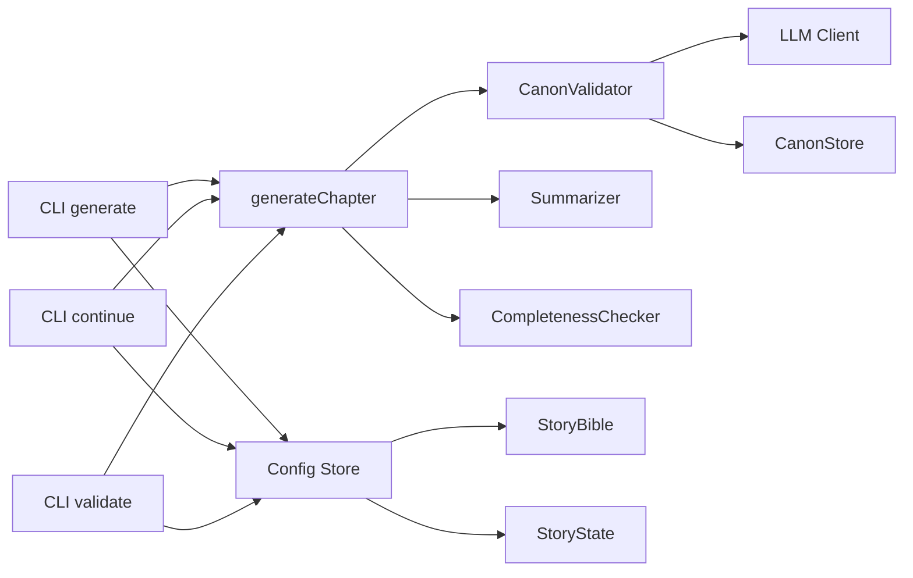

# Canon Validator Agent

<cite>
**Referenced Files in This Document**
- [canonValidator.ts](file://packages/engine/src/agents/canonValidator.ts)
- [canonStore.ts](file://packages/engine/src/memory/canonStore.ts)
- [generateChapter.ts](file://packages/engine/src/pipeline/generateChapter.ts)
- [client.ts](file://packages/engine/src/llm/client.ts)
- [bible.ts](file://packages/engine/src/story/bible.ts)
- [state.ts](file://packages/engine/src/story/state.ts)
- [summarizer.ts](file://packages/engine/src/agents/summarizer.ts)
- [completeness.ts](file://packages/engine/src/agents/completeness.ts)
- [generate.ts](file://apps/cli/src/commands/generate.ts)
- [continue.ts](file://apps/cli/src/commands/continue.ts)
- [store.ts](file://apps/cli/src/config/store.ts)
- [simple.test.ts](file://packages/engine/src/test/simple.test.ts)
- [round6.md](file://Narrative Operating System/round6.md)
- [index.ts](file://packages/engine/src/types/index.ts)
- [validate.ts](file://apps/cli/src/commands/validate.ts)
</cite>

## Update Summary
**Changes Made**
- Enhanced LLM client with task-specific model selection capabilities
- Updated Canon Validator to use `task: 'validation'` parameter for optimal model selection
- Added comprehensive task-type definitions and model mapping configurations
- Improved validation performance through purpose-specific model routing

## Table of Contents
1. [Introduction](#introduction)
2. [Project Structure](#project-structure)
3. [Core Components](#core-components)
4. [Architecture Overview](#architecture-overview)
5. [Detailed Component Analysis](#detailed-component-analysis)
6. [Task-Specific Model Selection](#task-specific-model-selection)
7. [Dependency Analysis](#dependency-analysis)
8. [Performance Considerations](#performance-considerations)
9. [Troubleshooting Guide](#troubleshooting-guide)
10. [Conclusion](#conclusion)
11. [Appendices](#appendices)

## Introduction
The Canon Validator Agent enforces narrative consistency by validating generated chapters against the Story Canon. It prevents contradictions in character continuity, plot thread status, and world rules, ensuring story integrity across the narrative operating system. The agent integrates tightly with the canonical memory store, the chapter generation pipeline, and the CLI workflow, providing feedback loops that maintain logical coherence. Recent enhancements include intelligent task-specific model selection that optimizes validation performance through purpose-driven model routing.

## Project Structure
The Canon Validator Agent resides in the engine package alongside supporting modules for story creation, memory, summarization, and completeness checking. The CLI commands orchestrate generation and persistence, while the LLM client provides the reasoning backbone with enhanced task-specific model selection capabilities.

**Diagram sources**
- [canonValidator.ts:1-60](file://packages/engine/src/agents/canonValidator.ts#L1-L60)
- [canonStore.ts:1-134](file://packages/engine/src/memory/canonStore.ts#L1-L134)
- [generateChapter.ts:1-290](file://packages/engine/src/pipeline/generateChapter.ts#L1-L290)
- [summarizer.ts:1-65](file://packages/engine/src/agents/summarizer.ts#L1-L65)
- [completeness.ts:1-56](file://packages/engine/src/agents/completeness.ts#L1-L56)
- [client.ts:1-200](file://packages/engine/src/llm/client.ts#L1-L200)
- [bible.ts:1-73](file://packages/engine/src/story/bible.ts#L1-L73)
- [state.ts:1-30](file://packages/engine/src/story/state.ts#L1-L30)
- [index.ts:106-114](file://packages/engine/src/types/index.ts#L106-L114)
- [generate.ts:1-55](file://apps/cli/src/commands/generate.ts#L1-L55)
- [continue.ts:1-52](file://apps/cli/src/commands/continue.ts#L1-L52)
- [store.ts:1-78](file://apps/cli/src/config/store.ts#L1-L78)
- [validate.ts:1-107](file://apps/cli/src/commands/validate.ts#L1-L107)

**Section sources**
- [canonValidator.ts:1-60](file://packages/engine/src/agents/canonValidator.ts#L1-L60)
- [canonStore.ts:1-134](file://packages/engine/src/memory/canonStore.ts#L1-L134)
- [generateChapter.ts:1-290](file://packages/engine/src/pipeline/generateChapter.ts#L1-L290)
- [client.ts:1-200](file://packages/engine/src/llm/client.ts#L1-L200)
- [bible.ts:1-73](file://packages/engine/src/story/bible.ts#L1-L73)
- [state.ts:1-30](file://packages/engine/src/story/state.ts#L1-L30)
- [summarizer.ts:1-65](file://packages/engine/src/agents/summarizer.ts#L1-L65)
- [completeness.ts:1-56](file://packages/engine/src/agents/completeness.ts#L1-L56)
- [generate.ts:1-55](file://apps/cli/src/commands/generate.ts#L1-L55)
- [continue.ts:1-52](file://apps/cli/src/commands/continue.ts#L1-L52)
- [store.ts:1-78](file://apps/cli/src/config/store.ts#L1-L78)
- [validate.ts:1-107](file://apps/cli/src/commands/validate.ts#L1-L107)

## Core Components
- CanonValidator: Validates chapter content against the Story Canon and returns a structured result indicating validity and specific violations.
- CanonStore: Manages canonical facts (character roles/backgrounds, plot thread statuses, world rules) and formats them for prompts.
- generateChapter Pipeline: Orchestrates writing, completeness checking, validation, and summarization, collecting violations for downstream actions.
- LLM Client: Provides a unified interface to external providers for reasoning tasks with intelligent task-specific model selection.
- Story Bible and State: Define the foundational narrative context and progression metrics.
- Summarizer and CompletenessChecker: Support narrative quality and structural coherence during generation.

**Section sources**
- [canonValidator.ts:31-56](file://packages/engine/src/agents/canonValidator.ts#L31-L56)
- [canonStore.ts:12-129](file://packages/engine/src/memory/canonStore.ts#L12-L129)
- [generateChapter.ts:20-71](file://packages/engine/src/pipeline/generateChapter.ts#L20-L71)
- [client.ts:31-105](file://packages/engine/src/llm/client.ts#L31-L105)
- [bible.ts:1-73](file://packages/engine/src/story/bible.ts#L1-L73)
- [state.ts:1-30](file://packages/engine/src/story/state.ts#L1-L30)
- [summarizer.ts:17-63](file://packages/engine/src/agents/summarizer.ts#L17-L63)
- [completeness.ts:30-55](file://packages/engine/src/agents/completeness.ts#L30-L55)

## Architecture Overview
The Canon Validator Agent participates in the chapter generation pipeline. After the writer produces content, the pipeline optionally validates against the Canon, summarizes the chapter, and updates story state. The CLI commands coordinate persistence and iteration until the story reaches its target number of chapters. Enhanced task-specific model selection ensures validation tasks use optimal chat models for consistency checking.

**Diagram sources**
- [generateChapter.ts:20-71](file://packages/engine/src/pipeline/generateChapter.ts#L20-L71)
- [canonValidator.ts:31-56](file://packages/engine/src/agents/canonValidator.ts#L31-L56)
- [client.ts:135-147](file://packages/engine/src/llm/client.ts#L135-L147)
- [summarizer.ts:24-38](file://packages/engine/src/agents/summarizer.ts#L24-L38)
- [completeness.ts:37-52](file://packages/engine/src/agents/completeness.ts#L37-L52)
- [generate.ts:28-54](file://apps/cli/src/commands/generate.ts#L28-L54)
- [continue.ts:32-51](file://apps/cli/src/commands/continue.ts#L32-L51)
- [store.ts:15-26](file://apps/cli/src/config/store.ts#L15-L26)

## Detailed Component Analysis

### CanonValidator
Responsibilities:
- Accepts chapter text and the current CanonStore.
- Formats the Canon for inclusion in a validation prompt.
- Queries the LLM to detect contradictions against character continuity, plot threads, and world rules.
- Returns a structured result with validity and a list of violation descriptions.
- Gracefully handles empty canons and malformed LLM responses.

**Updated** Enhanced with task-specific model selection using `task: 'validation'` parameter for optimal chat model routing.

Validation algorithm:
- If the CanonStore contains no facts, validation passes immediately.
- The CanonStore is formatted into a human-readable section.
- A fixed prompt instructs the LLM to identify contradictions and return a JSON object containing validity and violations.
- The LLM response is parsed; on failure, the agent conservatively treats the chapter as valid.

**Diagram sources**
- [canonValidator.ts:31-56](file://packages/engine/src/agents/canonValidator.ts#L31-L56)
- [client.ts:135-147](file://packages/engine/src/llm/client.ts#L135-L147)
- [canonStore.ts:101-129](file://packages/engine/src/memory/canonStore.ts#L101-L129)

**Section sources**
- [canonValidator.ts:31-56](file://packages/engine/src/agents/canonValidator.ts#L31-L56)

### CanonStore
Responsibilities:
- Defines the CanonFact and CanonStore structures.
- Extracts canonical facts from the StoryBible (characters' roles/backgrounds, plot threads' statuses).
- Adds, retrieves, updates, and filters facts.
- Formats the Canon for LLM prompts.

Key behaviors:
- Fact categories include character, world, plot, and timeline.
- Extraction populates initial facts from the Bible's characters and plot threads.
- Updates preserve chapter-establishment metadata for tracking provenance.

**Diagram sources**
- [canonStore.ts:3-134](file://packages/engine/src/memory/canonStore.ts#L3-L134)

**Section sources**
- [canonStore.ts:12-129](file://packages/engine/src/memory/canonStore.ts#L12-L129)

### generateChapter Pipeline
Responsibilities:
- Writes chapter content via the writer agent.
- Iteratively continues writing until completeness criteria are met.
- Optionally validates against the Canon and collects violations.
- Summarizes the chapter and constructs the chapter entity.
- Returns the chapter, summary, and violations for persistence and reporting.

Integration points:
- Uses the CanonValidator when enabled and a CanonStore is provided.
- Coordinates with the Summarizer and CompletenessChecker.
- Persists results via the Config Store.

**Diagram sources**
- [generateChapter.ts:20-71](file://packages/engine/src/pipeline/generateChapter.ts#L20-L71)
- [canonValidator.ts:31-56](file://packages/engine/src/agents/canonValidator.ts#L31-L56)
- [summarizer.ts:24-38](file://packages/engine/src/agents/summarizer.ts#L24-L38)
- [completeness.ts:37-52](file://packages/engine/src/agents/completeness.ts#L37-L52)

**Section sources**
- [generateChapter.ts:20-71](file://packages/engine/src/pipeline/generateChapter.ts#L20-L71)

### LLM Client
Responsibilities:
- Provides a unified provider abstraction for external LLM APIs.
- Supports configurable providers and models via environment variables.
- Exposes completion methods and a strict JSON completion variant.
- Implements intelligent task-specific model selection based on task type.

**Updated** Enhanced with comprehensive task-specific model selection capabilities including validation task routing to optimal chat models.

Usage in Canon Validator:
- The validator sets conservative parameters (low temperature and bounded tokens) and specifies `task: 'validation'` to ensure optimal model selection.
- The LLM client routes validation tasks to chat-purpose models optimized for consistency checking.

**Section sources**
- [client.ts:31-105](file://packages/engine/src/llm/client.ts#L31-L105)
- [client.ts:135-147](file://packages/engine/src/llm/client.ts#L135-L147)
- [canonValidator.ts:44-48](file://packages/engine/src/agents/canonValidator.ts#L44-L48)

### Story Bible and State
Responsibilities:
- StoryBible defines the foundational narrative context (characters, plot threads, tone, setting).
- StoryState tracks progression (current chapter, total chapters, tension, summaries).

Integration:
- Canon extraction derives canonical facts from the Bible.
- State updates incorporate chapter summaries to reflect evolving story metrics.

**Section sources**
- [bible.ts:1-73](file://packages/engine/src/story/bible.ts#L1-L73)
- [state.ts:14-29](file://packages/engine/src/story/state.ts#L14-L29)

### Summarizer and CompletenessChecker
Responsibilities:
- Summarizer generates concise chapter summaries and extracts key events.
- CompletenessChecker ensures chapters end at natural narrative boundaries.

Role in Validation:
- While not performing contradiction detection, they support the pipeline's quality gates and inform the CanonValidator about chapter boundaries and content focus.

**Section sources**
- [summarizer.ts:17-63](file://packages/engine/src/agents/summarizer.ts#L17-L63)
- [completeness.ts:30-55](file://packages/engine/src/agents/completeness.ts#L30-L55)

## Task-Specific Model Selection

**New Section** The LLM client now implements intelligent task-specific model selection to optimize performance and cost efficiency across different validation scenarios.

### Task Type Definitions
The system defines distinct task types with specific model purposes:
- `generation`: Complex creative writing using reasoning models
- `validation`: Canon validation using chat models optimized for consistency checking
- `summarization`: Chapter summarization using fast models
- `extraction`: Memory/state extraction using chat models
- `planning`: Scene/chapter planning using reasoning models
- `default`: Fallback to chat models

### Model Mapping Configuration
The TASK_MODEL_MAPPING ensures appropriate model selection:
- Validation tasks route to chat-purpose models for optimal consistency checking
- Generation and planning tasks use reasoning models for complex creative tasks
- Summarization tasks utilize fast models for cost-effective processing
- Extraction tasks employ chat models for structured data processing

### Implementation Details
The `getModelForTask` method intelligently selects models based on task requirements:
- Searches for models matching the task's purpose category
- Falls back to default models when no purpose-matching models are available
- Ensures validation tasks always use appropriate chat models regardless of configuration

**Diagram sources**
- [client.ts:39-47](file://packages/engine/src/llm/client.ts#L39-L47)
- [client.ts:113-125](file://packages/engine/src/llm/client.ts#L113-L125)
- [index.ts:106-114](file://packages/engine/src/types/index.ts#L106-L114)

**Section sources**
- [client.ts:39-47](file://packages/engine/src/llm/client.ts#L39-L47)
- [client.ts:113-125](file://packages/engine/src/llm/client.ts#L113-L125)
- [index.ts:106-114](file://packages/engine/src/types/index.ts#L106-L114)

## Dependency Analysis
The Canon Validator Agent depends on the LLM client for reasoning and the CanonStore for canonical facts. The generateChapter pipeline coordinates these dependencies and exposes validation results to the CLI for persistence and reporting. Enhanced task-specific model selection improves validation performance through intelligent model routing.

**Diagram sources**
- [canonValidator.ts:1-60](file://packages/engine/src/agents/canonValidator.ts#L1-L60)
- [canonStore.ts:1-134](file://packages/engine/src/memory/canonStore.ts#L1-L134)
- [generateChapter.ts:1-290](file://packages/engine/src/pipeline/generateChapter.ts#L1-L290)
- [client.ts:1-200](file://packages/engine/src/llm/client.ts#L1-L200)
- [summarizer.ts:1-65](file://packages/engine/src/agents/summarizer.ts#L1-L65)
- [completeness.ts:1-56](file://packages/engine/src/agents/completeness.ts#L1-L56)
- [generate.ts:1-55](file://apps/cli/src/commands/generate.ts#L1-L55)
- [continue.ts:1-52](file://apps/cli/src/commands/continue.ts#L1-L52)
- [store.ts:1-78](file://apps/cli/src/config/store.ts#L1-L78)
- [validate.ts:1-107](file://apps/cli/src/commands/validate.ts#L1-L107)
- [bible.ts:1-73](file://packages/engine/src/story/bible.ts#L1-L73)
- [state.ts:1-30](file://packages/engine/src/story/state.ts#L1-L30)

**Section sources**
- [canonValidator.ts:1-60](file://packages/engine/src/agents/canonValidator.ts#L1-L60)
- [generateChapter.ts:1-290](file://packages/engine/src/pipeline/generateChapter.ts#L1-L290)
- [client.ts:1-200](file://packages/engine/src/llm/client.ts#L1-L200)
- [store.ts:1-78](file://apps/cli/src/config/store.ts#L1-L78)

## Performance Considerations
- Prompt truncation: The validator limits chapter text length to reduce token usage and latency.
- Conservative LLM parameters: Low temperature and bounded tokens improve determinism for structured validation.
- Early exit on empty canon: Avoids unnecessary LLM calls when no canonical facts exist.
- Iterative continuation: Completeness checking reduces retries by extending content until natural closure is achieved.
- **Enhanced** Task-specific model selection: Validation tasks automatically use optimal chat models for improved performance and cost efficiency.

## Troubleshooting Guide
Common issues and resolutions:
- Empty CanonStore: Validation passes immediately; ensure the StoryBible is populated with characters and plot threads before generating.
- Malformed LLM response: The validator falls back to treating the chapter as valid; verify provider configuration and prompt formatting.
- Violations detected: Review the returned violation descriptions and adjust subsequent generations to align with established facts.
- Ambiguous references: The validator flags contradictions; clarify character identities or plot thread statuses in the CanonStore before proceeding.
- Edge cases: Very long chapters may be truncated; consider splitting content or adjusting truncation thresholds.
- **New** Model selection issues: If validation tasks aren't using expected models, check the TASK_MODEL_MAPPING configuration and ensure purpose-matching models are available.

**Section sources**
- [canonValidator.ts:33-35](file://packages/engine/src/agents/canonValidator.ts#L33-L35)
- [canonValidator.ts:49-54](file://packages/engine/src/agents/canonValidator.ts#L49-L54)
- [generateChapter.ts:46-53](file://packages/engine/src/pipeline/generateChapter.ts#L46-L53)
- [client.ts:39-47](file://packages/engine/src/llm/client.ts#L39-L47)

## Conclusion
The Canon Validator Agent is a critical component for maintaining narrative consistency. By integrating with the canonical memory store and the chapter generation pipeline, it detects contradictions early, supports iterative refinement, and preserves story integrity. Recent enhancements with task-specific model selection ensure validation tasks use optimal chat models for consistency checking, improving both performance and cost efficiency. Its conservative design and fallback behavior ensure robust operation even with imperfect LLM responses.

## Appendices

### Validation Scenarios and Examples
- Character continuity violation: A chapter states a character's background or role differs from the CanonStore; the validator reports a specific contradiction.
- Plot thread contradiction: A chapter contradicts the established status of a plot thread; the validator flags the inconsistency.
- World rule violation: A chapter introduces a world rule that conflicts with the CanonStore; the validator identifies the violation.
- Ambiguous reference handling: When a character's identity is unclear, the validator flags the contradiction; resolve by updating the CanonStore with precise identities and attributes.
- False positive mitigation: If the validator flags a minor stylistic difference, review the CanonStore for overly strict constraints and adjust as needed.

**Section sources**
- [canonValidator.ts:17-29](file://packages/engine/src/agents/canonValidator.ts#L17-L29)
- [canonStore.ts:101-129](file://packages/engine/src/memory/canonStore.ts#L101-L129)

### Coordination with Other Validation Systems
- CompletenessChecker ensures chapters end naturally, reducing false positives in the CanonValidator.
- Summarizer provides context for understanding narrative flow and identifying potential inconsistencies.
- The Narrative Constraints Graph concept outlines a broader framework encompassing spatial, knowledge, timeline, and canon constraints; the Canon Validator focuses on canon-specific contradictions while complementing the broader constraint system.
- **Enhanced** Task-specific model selection ensures validation tasks integrate seamlessly with other validation systems through optimized model routing.

**Section sources**
- [completeness.ts:30-55](file://packages/engine/src/agents/completeness.ts#L30-L55)
- [summarizer.ts:17-63](file://packages/engine/src/agents/summarizer.ts#L17-L63)
- [round6.md:179-229](file://Narrative Operating System/round6.md#L179-L229)

### Task-Specific Model Configuration
**New Section** Comprehensive model configuration for different validation scenarios:

#### Validation Task Optimization
- **Purpose**: Consistency checking and contradiction detection
- **Optimal Model**: Chat models with strong reasoning capabilities
- **Configuration**: `task: 'validation'` → routes to chat-purpose models
- **Benefits**: Improved accuracy for narrative consistency checks

#### Model Selection Process
1. Task type identification (`validation`)
2. Purpose category lookup (`chat`)
3. Model search by purpose
4. Automatic fallback to default models
5. Provider selection for optimal performance

**Section sources**
- [client.ts:39-47](file://packages/engine/src/llm/client.ts#L39-L47)
- [client.ts:113-125](file://packages/engine/src/llm/client.ts#L113-L125)
- [index.ts:106-114](file://packages/engine/src/types/index.ts#L106-L114)