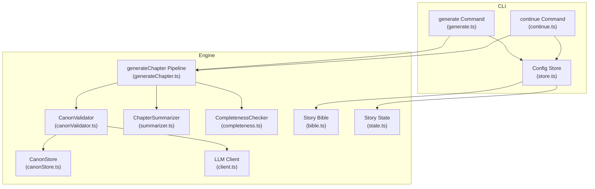
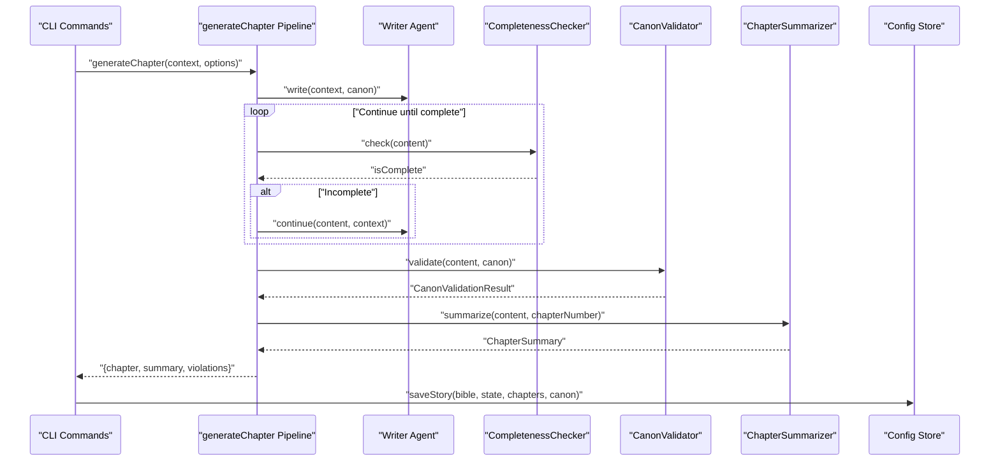
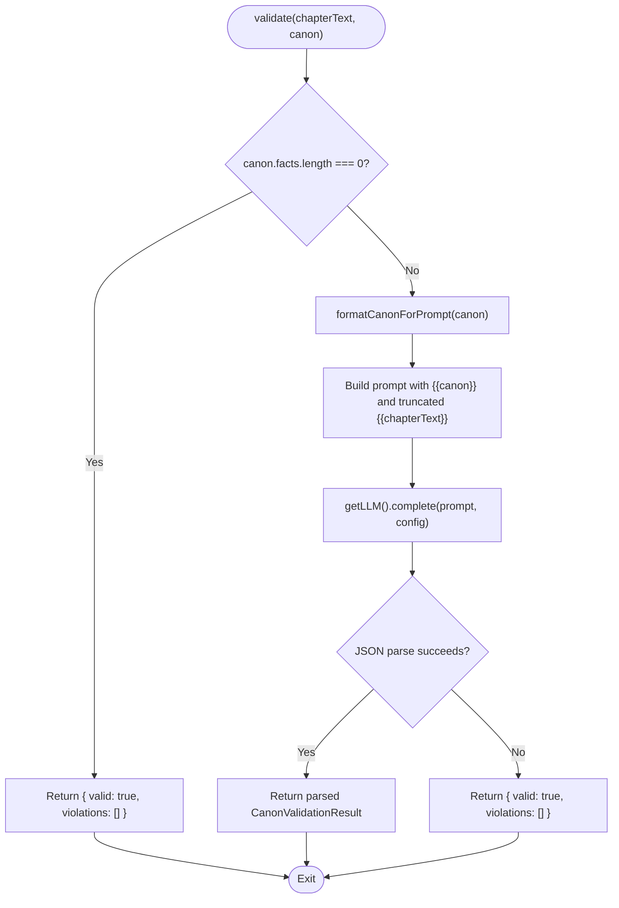
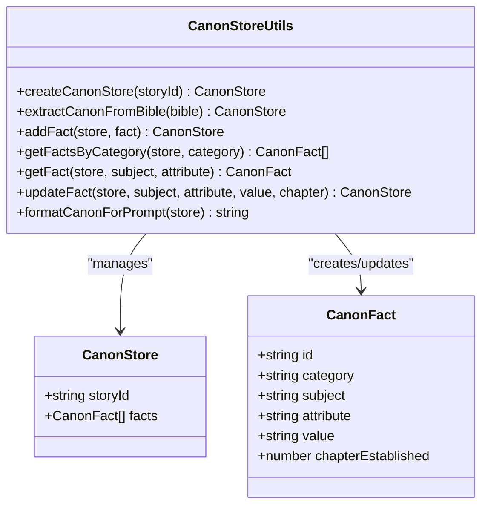
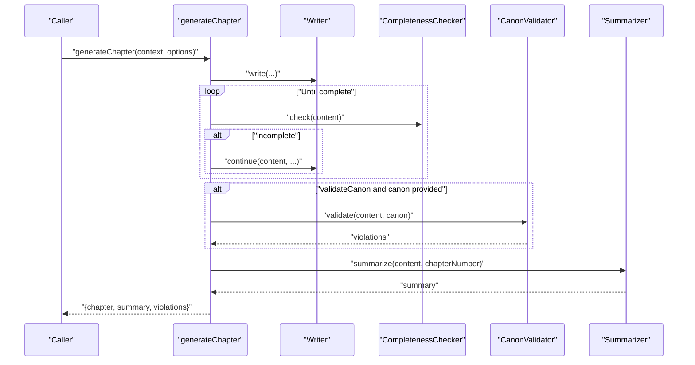
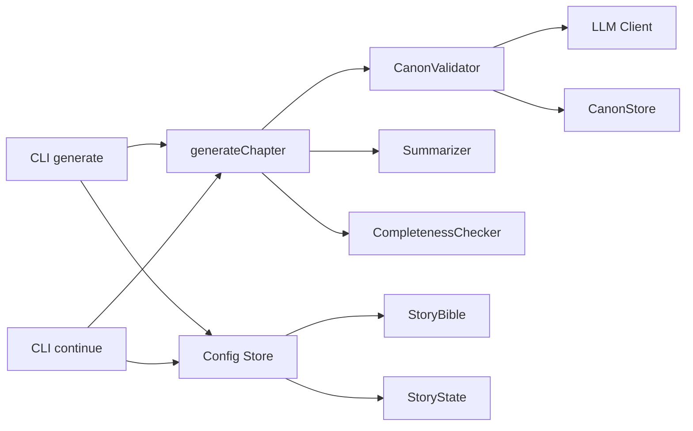

# Canon Validator Agent

<cite>
**Referenced Files in This Document**
- [canonValidator.ts](file://packages/engine/src/agents/canonValidator.ts)
- [canonStore.ts](file://packages/engine/src/memory/canonStore.ts)
- [generateChapter.ts](file://packages/engine/src/pipeline/generateChapter.ts)
- [client.ts](file://packages/engine/src/llm/client.ts)
- [bible.ts](file://packages/engine/src/story/bible.ts)
- [state.ts](file://packages/engine/src/story/state.ts)
- [summarizer.ts](file://packages/engine/src/agents/summarizer.ts)
- [completeness.ts](file://packages/engine/src/agents/completeness.ts)
- [generate.ts](file://apps/cli/src/commands/generate.ts)
- [continue.ts](file://apps/cli/src/commands/continue.ts)
- [store.ts](file://apps/cli/src/config/store.ts)
- [simple.test.ts](file://packages/engine/src/test/simple.test.ts)
- [round6.md](file://Narrative Operating System/round6.md)
</cite>

## Table of Contents
1. [Introduction](#introduction)
2. [Project Structure](#project-structure)
3. [Core Components](#core-components)
4. [Architecture Overview](#architecture-overview)
5. [Detailed Component Analysis](#detailed-component-analysis)
6. [Dependency Analysis](#dependency-analysis)
7. [Performance Considerations](#performance-considerations)
8. [Troubleshooting Guide](#troubleshooting-guide)
9. [Conclusion](#conclusion)
10. [Appendices](#appendices)

## Introduction
The Canon Validator Agent enforces narrative consistency by validating generated chapters against the Story Canon. It prevents contradictions in character continuity, plot thread status, and world rules, ensuring story integrity across the narrative operating system. The agent integrates tightly with the canonical memory store, the chapter generation pipeline, and the CLI workflow, providing feedback loops that maintain logical coherence.

## Project Structure
The Canon Validator Agent resides in the engine package alongside supporting modules for story creation, memory, summarization, and completeness checking. The CLI commands orchestrate generation and persistence, while the LLM client provides the reasoning backbone.

**Diagram sources**
- [canonValidator.ts](file://packages/engine/src/agents/canonValidator.ts#L1-L59)
- [canonStore.ts](file://packages/engine/src/memory/canonStore.ts#L1-L134)
- [generateChapter.ts](file://packages/engine/src/pipeline/generateChapter.ts#L1-L76)
- [summarizer.ts](file://packages/engine/src/agents/summarizer.ts#L1-L64)
- [completeness.ts](file://packages/engine/src/agents/completeness.ts#L1-L56)
- [client.ts](file://packages/engine/src/llm/client.ts#L1-L106)
- [bible.ts](file://packages/engine/src/story/bible.ts#L1-L73)
- [state.ts](file://packages/engine/src/story/state.ts#L1-L30)
- [generate.ts](file://apps/cli/src/commands/generate.ts#L1-L55)
- [continue.ts](file://apps/cli/src/commands/continue.ts#L1-L52)
- [store.ts](file://apps/cli/src/config/store.ts#L1-L78)

**Section sources**
- [canonValidator.ts](file://packages/engine/src/agents/canonValidator.ts#L1-L59)
- [canonStore.ts](file://packages/engine/src/memory/canonStore.ts#L1-L134)
- [generateChapter.ts](file://packages/engine/src/pipeline/generateChapter.ts#L1-L76)
- [client.ts](file://packages/engine/src/llm/client.ts#L1-L106)
- [bible.ts](file://packages/engine/src/story/bible.ts#L1-L73)
- [state.ts](file://packages/engine/src/story/state.ts#L1-L30)
- [summarizer.ts](file://packages/engine/src/agents/summarizer.ts#L1-L64)
- [completeness.ts](file://packages/engine/src/agents/completeness.ts#L1-L56)
- [generate.ts](file://apps/cli/src/commands/generate.ts#L1-L55)
- [continue.ts](file://apps/cli/src/commands/continue.ts#L1-L52)
- [store.ts](file://apps/cli/src/config/store.ts#L1-L78)

## Core Components
- CanonValidator: Validates chapter content against the Story Canon and returns a structured result indicating validity and specific violations.
- CanonStore: Manages canonical facts (character roles/backgrounds, plot thread statuses, world rules) and formats them for prompts.
- generateChapter Pipeline: Orchestrates writing, completeness checking, validation, and summarization, collecting violations for downstream actions.
- LLM Client: Provides a unified interface to external providers for reasoning tasks.
- Story Bible and State: Define the foundational narrative context and progression metrics.
- Summarizer and CompletenessChecker: Support narrative quality and structural coherence during generation.

**Section sources**
- [canonValidator.ts](file://packages/engine/src/agents/canonValidator.ts#L31-L56)
- [canonStore.ts](file://packages/engine/src/memory/canonStore.ts#L12-L129)
- [generateChapter.ts](file://packages/engine/src/pipeline/generateChapter.ts#L20-L71)
- [client.ts](file://packages/engine/src/llm/client.ts#L31-L105)
- [bible.ts](file://packages/engine/src/story/bible.ts#L1-L73)
- [state.ts](file://packages/engine/src/story/state.ts#L1-L30)
- [summarizer.ts](file://packages/engine/src/agents/summarizer.ts#L17-L63)
- [completeness.ts](file://packages/engine/src/agents/completeness.ts#L30-L55)

## Architecture Overview
The Canon Validator Agent participates in the chapter generation pipeline. After the writer produces content, the pipeline optionally validates against the Canon, summarizes the chapter, and updates story state. The CLI commands coordinate persistence and iteration until the story reaches its target number of chapters.

**Diagram sources**
- [generateChapter.ts](file://packages/engine/src/pipeline/generateChapter.ts#L20-L71)
- [canonValidator.ts](file://packages/engine/src/agents/canonValidator.ts#L31-L56)
- [summarizer.ts](file://packages/engine/src/agents/summarizer.ts#L24-L38)
- [completeness.ts](file://packages/engine/src/agents/completeness.ts#L37-L52)
- [generate.ts](file://apps/cli/src/commands/generate.ts#L28-L54)
- [continue.ts](file://apps/cli/src/commands/continue.ts#L32-L51)
- [store.ts](file://apps/cli/src/config/store.ts#L15-L26)

## Detailed Component Analysis

### CanonValidator
Responsibilities:
- Accepts chapter text and the current CanonStore.
- Formats the Canon for inclusion in a validation prompt.
- Queries the LLM to detect contradictions against character continuity, plot threads, and world rules.
- Returns a structured result with validity and a list of violation descriptions.
- Gracefully handles empty canons and malformed LLM responses.

Validation algorithm:
- If the CanonStore contains no facts, validation passes immediately.
- The CanonStore is formatted into a human-readable section.
- A fixed prompt instructs the LLM to identify contradictions and return a JSON object containing validity and violations.
- The LLM response is parsed; on failure, the agent conservatively treats the chapter as valid.

**Diagram sources**
- [canonValidator.ts](file://packages/engine/src/agents/canonValidator.ts#L31-L56)
- [canonStore.ts](file://packages/engine/src/memory/canonStore.ts#L101-L129)

**Section sources**
- [canonValidator.ts](file://packages/engine/src/agents/canonValidator.ts#L31-L56)

### CanonStore
Responsibilities:
- Defines the CanonFact and CanonStore structures.
- Extracts canonical facts from the StoryBible (characters’ roles/backgrounds, plot threads’ statuses).
- Adds, retrieves, updates, and filters facts.
- Formats the Canon for LLM prompts.

Key behaviors:
- Fact categories include character, world, plot, and timeline.
- Extraction populates initial facts from the Bible’s characters and plot threads.
- Updates preserve chapter-establishment metadata for tracking provenance.

**Diagram sources**
- [canonStore.ts](file://packages/engine/src/memory/canonStore.ts#L3-L134)

**Section sources**
- [canonStore.ts](file://packages/engine/src/memory/canonStore.ts#L12-L129)

### generateChapter Pipeline
Responsibilities:
- Writes chapter content via the writer agent.
- Iteratively continues writing until completeness criteria are met.
- Optionally validates against the Canon and collects violations.
- Summarizes the chapter and constructs the chapter entity.
- Returns the chapter, summary, and violations for persistence and reporting.

Integration points:
- Uses the CanonValidator when enabled and a CanonStore is provided.
- Coordinates with the Summarizer and CompletenessChecker.
- Persists results via the Config Store.

**Diagram sources**
- [generateChapter.ts](file://packages/engine/src/pipeline/generateChapter.ts#L20-L71)
- [canonValidator.ts](file://packages/engine/src/agents/canonValidator.ts#L31-L56)
- [summarizer.ts](file://packages/engine/src/agents/summarizer.ts#L24-L38)
- [completeness.ts](file://packages/engine/src/agents/completeness.ts#L37-L52)

**Section sources**
- [generateChapter.ts](file://packages/engine/src/pipeline/generateChapter.ts#L20-L71)

### LLM Client
Responsibilities:
- Provides a unified provider abstraction for external LLM APIs.
- Supports configurable providers and models via environment variables.
- Exposes completion methods and a strict JSON completion variant.

Usage in Canon Validator:
- The validator sets conservative parameters (low temperature and bounded tokens) to encourage deterministic, concise responses suitable for structured validation.

**Section sources**
- [client.ts](file://packages/engine/src/llm/client.ts#L31-L105)
- [canonValidator.ts](file://packages/engine/src/agents/canonValidator.ts#L44-L47)

### Story Bible and State
Responsibilities:
- StoryBible defines the foundational narrative context (characters, plot threads, tone, setting).
- StoryState tracks progression (current chapter, total chapters, tension, summaries).

Integration:
- Canon extraction derives canonical facts from the Bible.
- State updates incorporate chapter summaries to reflect evolving story metrics.

**Section sources**
- [bible.ts](file://packages/engine/src/story/bible.ts#L1-L73)
- [state.ts](file://packages/engine/src/story/state.ts#L14-L29)

### Summarizer and CompletenessChecker
Responsibilities:
- Summarizer generates concise chapter summaries and extracts key events.
- CompletenessChecker ensures chapters end at natural narrative boundaries.

Role in Validation:
- While not performing contradiction detection, they support the pipeline’s quality gates and inform the CanonValidator about chapter boundaries and content focus.

**Section sources**
- [summarizer.ts](file://packages/engine/src/agents/summarizer.ts#L17-L63)
- [completeness.ts](file://packages/engine/src/agents/completeness.ts#L30-L55)

## Dependency Analysis
The Canon Validator Agent depends on the LLM client for reasoning and the CanonStore for canonical facts. The generateChapter pipeline coordinates these dependencies and exposes validation results to the CLI for persistence and reporting.

**Diagram sources**
- [canonValidator.ts](file://packages/engine/src/agents/canonValidator.ts#L1-L59)
- [canonStore.ts](file://packages/engine/src/memory/canonStore.ts#L1-L134)
- [generateChapter.ts](file://packages/engine/src/pipeline/generateChapter.ts#L1-L76)
- [client.ts](file://packages/engine/src/llm/client.ts#L1-L106)
- [summarizer.ts](file://packages/engine/src/agents/summarizer.ts#L1-L64)
- [completeness.ts](file://packages/engine/src/agents/completeness.ts#L1-L56)
- [generate.ts](file://apps/cli/src/commands/generate.ts#L1-L55)
- [continue.ts](file://apps/cli/src/commands/continue.ts#L1-L52)
- [store.ts](file://apps/cli/src/config/store.ts#L1-L78)
- [bible.ts](file://packages/engine/src/story/bible.ts#L1-L73)
- [state.ts](file://packages/engine/src/story/state.ts#L1-L30)

**Section sources**
- [canonValidator.ts](file://packages/engine/src/agents/canonValidator.ts#L1-L59)
- [generateChapter.ts](file://packages/engine/src/pipeline/generateChapter.ts#L1-L76)
- [client.ts](file://packages/engine/src/llm/client.ts#L1-L106)
- [store.ts](file://apps/cli/src/config/store.ts#L1-L78)

## Performance Considerations
- Prompt truncation: The validator limits chapter text length to reduce token usage and latency.
- Conservative LLM parameters: Low temperature and bounded tokens improve determinism for structured validation.
- Early exit on empty canon: Avoids unnecessary LLM calls when no canonical facts exist.
- Iterative continuation: Completeness checking reduces retries by extending content until natural closure is achieved.

[No sources needed since this section provides general guidance]

## Troubleshooting Guide
Common issues and resolutions:
- Empty CanonStore: Validation passes immediately; ensure the StoryBible is populated with characters and plot threads before generating.
- Malformed LLM response: The validator falls back to treating the chapter as valid; verify provider configuration and prompt formatting.
- Violations detected: Review the returned violation descriptions and adjust subsequent generations to align with established facts.
- Ambiguous references: The validator flags contradictions; clarify character identities or plot thread statuses in the CanonStore before proceeding.
- Edge cases: Very long chapters may be truncated; consider splitting content or adjusting truncation thresholds.

**Section sources**
- [canonValidator.ts](file://packages/engine/src/agents/canonValidator.ts#L33-L35)
- [canonValidator.ts](file://packages/engine/src/agents/canonValidator.ts#L49-L54)
- [generateChapter.ts](file://packages/engine/src/pipeline/generateChapter.ts#L46-L53)

## Conclusion
The Canon Validator Agent is a critical component for maintaining narrative consistency. By integrating with the canonical memory store and the chapter generation pipeline, it detects contradictions early, supports iterative refinement, and preserves story integrity. Its conservative design and fallback behavior ensure robust operation even with imperfect LLM responses.

[No sources needed since this section summarizes without analyzing specific files]

## Appendices

### Validation Scenarios and Examples
- Character continuity violation: A chapter states a character’s background or role differs from the CanonStore; the validator reports a specific contradiction.
- Plot thread contradiction: A chapter contradicts the established status of a plot thread; the validator flags the inconsistency.
- World rule violation: A chapter introduces a world rule that conflicts with the CanonStore; the validator identifies the violation.
- Ambiguous reference handling: When a character’s identity is unclear, the validator flags the contradiction; resolve by updating the CanonStore with precise identities and attributes.
- False positive mitigation: If the validator flags a minor stylistic difference, review the CanonStore for overly strict constraints and adjust as needed.

**Section sources**
- [canonValidator.ts](file://packages/engine/src/agents/canonValidator.ts#L17-L29)
- [canonStore.ts](file://packages/engine/src/memory/canonStore.ts#L101-L129)

### Coordination with Other Validation Systems
- CompletenessChecker ensures chapters end naturally, reducing false positives in the CanonValidator.
- Summarizer provides context for understanding narrative flow and identifying potential inconsistencies.
- The Narrative Constraints Graph concept outlines a broader framework encompassing spatial, knowledge, timeline, and canon constraints; the Canon Validator focuses on canon-specific contradictions while complementing the broader constraint system.

**Section sources**
- [completeness.ts](file://packages/engine/src/agents/completeness.ts#L30-L55)
- [summarizer.ts](file://packages/engine/src/agents/summarizer.ts#L17-L63)
- [round6.md](file://Narrative Operating System/round6.md#L179-L229)