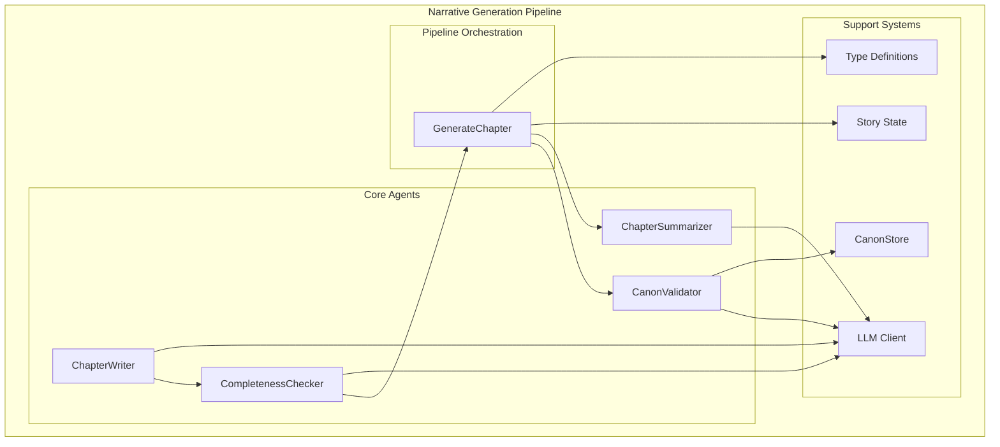
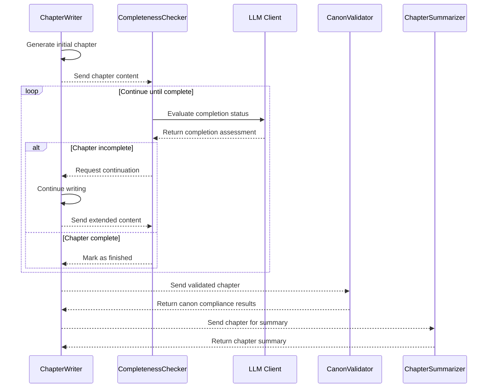
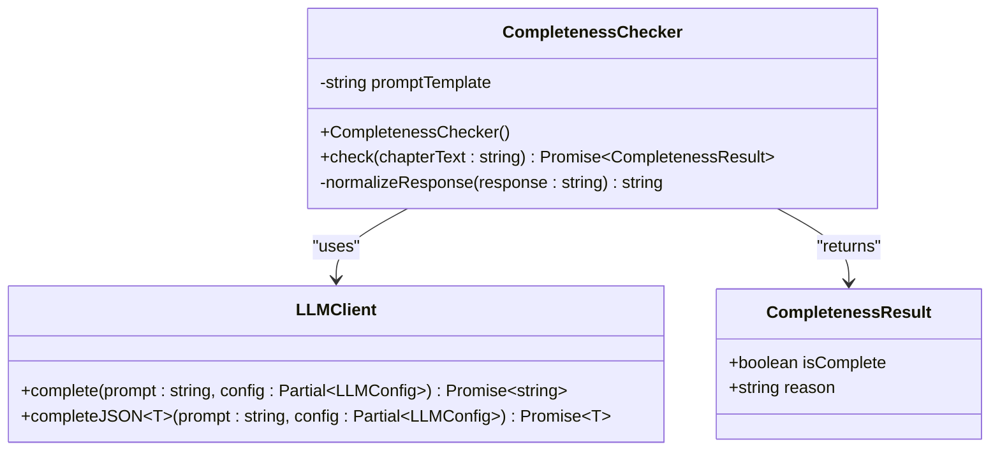
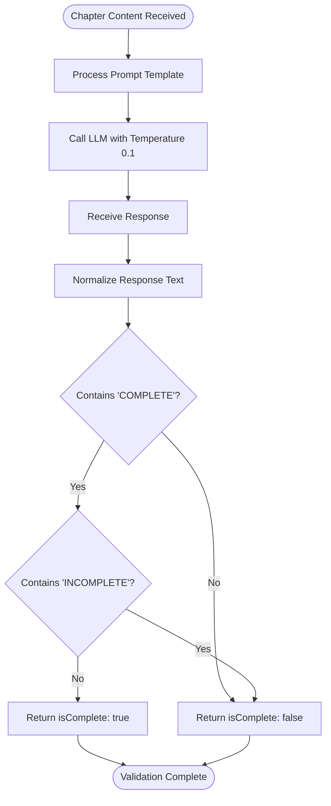
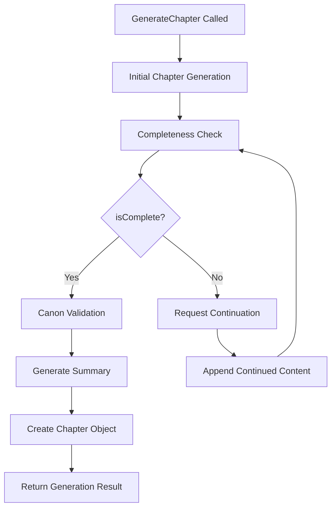
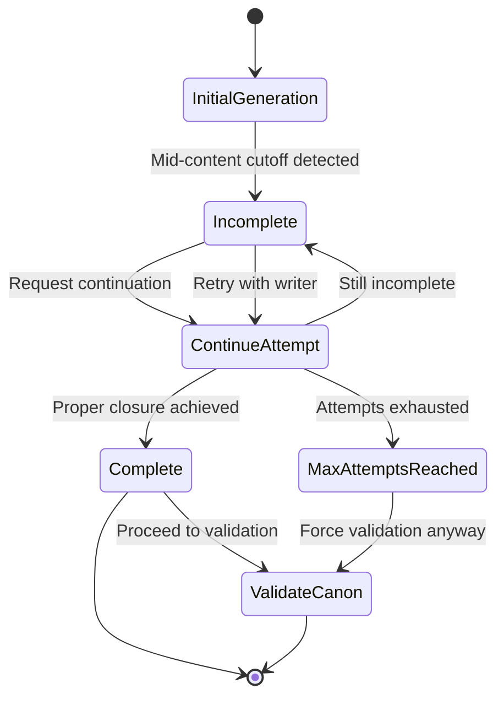
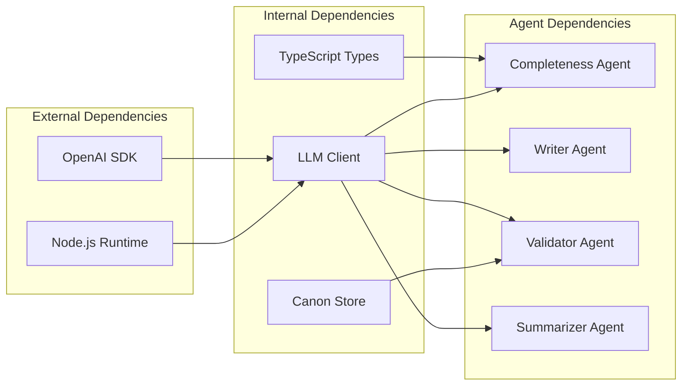
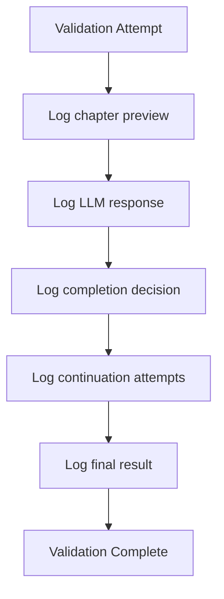

# Completeness Agent

<cite>
**Referenced Files in This Document**
- [completeness.ts](file://packages/engine/src/agents/completeness.ts)
- [completeness.md](file://packages/engine/src/llm/prompts/completeness.md)
- [generateChapter.ts](file://packages/engine/src/pipeline/generateChapter.ts)
- [writer.ts](file://packages/engine/src/agents/writer.ts)
- [summarizer.ts](file://packages/engine/src/agents/summarizer.ts)
- [canonValidator.ts](file://packages/engine/src/agents/canonValidator.ts)
- [client.ts](file://packages/engine/src/llm/client.ts)
- [types/index.ts](file://packages/engine/src/types/index.ts)
- [canonStore.ts](file://packages/engine/src/memory/canonStore.ts)
- [state.ts](file://packages/engine/src/story/state.ts)
- [simple.test.ts](file://packages/engine/src/test/simple.test.ts)
</cite>

## Table of Contents
1. [Introduction](#introduction)
2. [Project Structure](#project-structure)
3. [Core Components](#core-components)
4. [Architecture Overview](#architecture-overview)
5. [Detailed Component Analysis](#detailed-component-analysis)
6. [Dependency Analysis](#dependency-analysis)
7. [Performance Considerations](#performance-considerations)
8. [Troubleshooting Guide](#troubleshooting-guide)
9. [Conclusion](#conclusion)

## Introduction
The Completeness Agent is a specialized validation component designed to ensure narrative quality and structural completeness in generated chapters. Its primary function is to evaluate whether a chapter text ends at a natural stopping point, preventing mid-sentence or mid-paragraph cutoffs that would compromise reader comprehension and narrative flow.

Unlike traditional validators that focus on character consistency or plot thread adherence, the Completeness Agent operates as a structural quality gate, ensuring that each chapter segment provides proper narrative closure while maintaining the integrity of the storytelling experience.

## Project Structure
The Completeness Agent is part of a sophisticated narrative generation pipeline that orchestrates multiple specialized agents working in concert to produce coherent, well-structured narratives.

**Diagram sources**
- [generateChapter.ts](file://packages/engine/src/pipeline/generateChapter.ts#L20-L71)
- [completeness.ts](file://packages/engine/src/agents/completeness.ts#L30-L55)
- [writer.ts](file://packages/engine/src/agents/writer.ts#L48-L145)

**Section sources**
- [generateChapter.ts](file://packages/engine/src/pipeline/generateChapter.ts#L1-L76)
- [completeness.ts](file://packages/engine/src/agents/completeness.ts#L1-L56)

## Core Components
The Completeness Agent consists of several interconnected components that work together to provide robust narrative validation:

### Primary Components
- **CompletenessChecker Class**: Main validation logic encapsulated in a dedicated class
- **Prompt Template System**: Structured prompts that guide LLM evaluation
- **LLM Integration**: Seamless integration with the underlying language model infrastructure
- **Result Processing**: Consistent result formatting and decision-making logic

### Validation Criteria
The agent evaluates chapters against strict structural criteria:
- Natural ending points at scene or chapter breaks
- Complete sentence and paragraph endings
- Proper narrative closure for segment boundaries
- Prevention of mid-content cutoffs

**Section sources**
- [completeness.ts](file://packages/engine/src/agents/completeness.ts#L30-L55)
- [completeness.md](file://packages/engine/src/llm/prompts/completeness.md#L1-L26)

## Architecture Overview
The Completeness Agent operates within a comprehensive validation pipeline that ensures narrative quality at multiple levels.

**Diagram sources**
- [generateChapter.ts](file://packages/engine/src/pipeline/generateChapter.ts#L20-L71)
- [completeness.ts](file://packages/engine/src/agents/completeness.ts#L37-L52)
- [writer.ts](file://packages/engine/src/agents/writer.ts#L96-L117)

The architecture demonstrates a sophisticated feedback loop where the Completeness Agent serves as a quality gate, continuously evaluating and requesting continuations until proper narrative closure is achieved.

**Section sources**
- [generateChapter.ts](file://packages/engine/src/pipeline/generateChapter.ts#L20-L71)
- [writer.ts](file://packages/engine/src/agents/writer.ts#L96-L117)

## Detailed Component Analysis

### CompletenessChecker Implementation
The CompletenessChecker class provides a focused, single-purpose validation mechanism with clear separation of concerns.

**Diagram sources**
- [completeness.ts](file://packages/engine/src/agents/completeness.ts#L30-L55)
- [client.ts](file://packages/engine/src/llm/client.ts#L31-L95)

#### Validation Logic Architecture
The validation process follows a deterministic decision tree:

**Diagram sources**
- [completeness.ts](file://packages/engine/src/agents/completeness.ts#L37-L52)

#### Prompt Engineering Approach
The agent employs a minimalist prompt engineering strategy focused on clarity and precision:

**Key Prompt Design Elements:**
- **Clear Binary Classification**: Explicitly instructs LLM to return only one word
- **Strict Criteria Definition**: Defines complete/incomplete conditions precisely
- **Minimal Ambiguity**: Eliminates potential for nuanced interpretation
- **Consistent Formatting**: Standardized structure for reliable parsing

**Section sources**
- [completeness.ts](file://packages/engine/src/agents/completeness.ts#L4-L28)
- [completeness.md](file://packages/engine/src/llm/prompts/completeness.md#L1-L26)

### Integration with Generation Pipeline
The Completeness Agent integrates seamlessly into the chapter generation workflow, serving as a critical quality control mechanism.

**Diagram sources**
- [generateChapter.ts](file://packages/engine/src/pipeline/generateChapter.ts#L20-L71)

#### Decision-Making Algorithm
The generation pipeline implements a controlled iteration strategy:

1. **Initial Generation**: Writer creates first draft
2. **Validation Pass**: CompletenessChecker evaluates structural quality
3. **Iteration Control**: Maximum 3 continuation attempts
4. **Quality Gate**: Only complete chapters proceed to validation
5. **Resource Efficiency**: Prevents unnecessary processing of incomplete content

**Section sources**
- [generateChapter.ts](file://packages/engine/src/pipeline/generateChapter.ts#L32-L43)

### Scoring Mechanisms and Failure Detection
The Completeness Agent operates on a binary scoring system with built-in failure detection patterns:

#### Failure Detection Patterns
- **Mid-sentence Cutoffs**: Incomplete clause termination
- **Mid-scene Abruptness**: Sudden narrative interruption
- **Narrative Continuity Violations**: Clear indication the story continues elsewhere

#### Remediation Strategies
The system implements automatic remediation through iterative continuation:

**Diagram sources**
- [generateChapter.ts](file://packages/engine/src/pipeline/generateChapter.ts#L32-L43)

**Section sources**
- [generateChapter.ts](file://packages/engine/src/pipeline/generateChapter.ts#L32-L43)

## Dependency Analysis
The Completeness Agent maintains minimal dependencies while integrating effectively with the broader ecosystem.

**Diagram sources**
- [completeness.ts](file://packages/engine/src/agents/completeness.ts#L1-L2)
- [client.ts](file://packages/engine/src/llm/client.ts#L1-L106)

### Coupling and Cohesion Analysis
The agent demonstrates excellent design principles:

**Low Coupling Benefits:**
- Minimal external dependencies
- Clear separation of concerns
- Easy testing and mocking capabilities

**High Cohesion Advantages:**
- Focused validation logic
- Single responsibility principle
- Maintainable codebase

**Section sources**
- [completeness.ts](file://packages/engine/src/agents/completeness.ts#L1-L56)
- [client.ts](file://packages/engine/src/llm/client.ts#L31-L95)

## Performance Considerations
The Completeness Agent is optimized for efficiency and reliability:

### Computational Efficiency
- **Lightweight Processing**: Minimal computational overhead
- **Conservative Token Limits**: Restrictive maxTokens to prevent excessive consumption
- **Early Termination**: Immediate exit when complete chapters are detected

### Resource Management
- **Temperature Control**: Low temperature (0.1) ensures deterministic responses
- **Prompt Optimization**: Concise templates reduce processing time
- **Result Normalization**: Efficient string processing for decision making

### Scalability Factors
- **Independent Operation**: Can run in parallel with other agents
- **Stateless Design**: No persistent state requirements
- **Modular Architecture**: Easy to replace or extend

## Troubleshooting Guide

### Common Issues and Solutions

#### Issue: False Negative Results
**Symptoms**: Valid chapters marked as incomplete
**Causes**: 
- Overly strict prompt interpretation
- Content formatting variations
- Model response inconsistencies

**Solutions**:
- Adjust temperature settings for more lenient evaluation
- Implement response normalization improvements
- Add confidence scoring mechanism

#### Issue: Excessive Continuation Attempts
**Symptoms**: Multiple continuation requests despite valid content
**Causes**:
- Ambiguous content boundaries
- Model uncertainty in completion assessment
- Prompt ambiguity

**Solutions**:
- Enhance prompt specificity for boundary detection
- Implement confidence thresholding
- Add contextual awareness of narrative structure

#### Issue: Performance Bottlenecks
**Symptoms**: Slow validation response times
**Causes**:
- High token consumption
- Network latency
- Model response variability

**Solutions**:
- Optimize prompt length
- Implement caching strategies
- Use model-specific optimizations

### Debugging Strategies
The system provides comprehensive logging and monitoring capabilities:

**Section sources**
- [generateChapter.ts](file://packages/engine/src/pipeline/generateChapter.ts#L39-L42)
- [completeness.ts](file://packages/engine/src/agents/completeness.ts#L40-L43)

## Conclusion
The Completeness Agent represents a focused, efficient solution for ensuring narrative structural quality in automated story generation. Its minimalist design philosophy, combined with robust integration patterns, creates a reliable foundation for maintaining high-quality storytelling standards.

The agent's strength lies in its clarity and precision—operating as a binary quality gate that prevents narrative fragmentation while remaining unobtrusive to the creative process. Through its integration with the broader generation pipeline, it contributes to a cohesive system where structural integrity is maintained without sacrificing narrative flow or creative flexibility.

Future enhancements could include expanded validation criteria, confidence scoring mechanisms, and adaptive prompting strategies to further improve accuracy and reduce false positives while maintaining the agent's core efficiency benefits.