# Enhanced Scene Planning System

<cite>
**Referenced Files in This Document**
- [packages/engine/src/index.ts](file://packages/engine/src/index.ts)
- [packages/engine/src/agents/scenePlanner.ts](file://packages/engine/src/agents/scenePlanner.ts)
- [packages/engine/src/agents/storyDirector.ts](file://packages/engine/src/agents/storyDirector.ts)
- [packages/engine/src/agents/chapterPlanner.ts](file://packages/engine/src/agents/chapterPlanner.ts)
- [packages/engine/src/agents/sceneValidator.ts](file://packages/engine/src/agents/sceneValidator.ts)
- [packages/engine/src/scene/sceneAssembler.ts](file://packages/engine/src/scene/sceneAssembler.ts)
- [packages/engine/src/scene/sceneOutcomeExtractor.ts](file://packages/engine/src/scene/sceneOutcomeExtractor.ts)
- [packages/engine/src/world/worldStateEngine.ts](file://packages/engine/src/world/worldStateEngine.ts)
- [packages/engine/src/memory/canonStore.ts](file://packages/engine/src/memory/canonStore.ts)
- [packages/engine/src/types/index.ts](file://packages/engine/src/types/index.ts)
- [packages/engine/src/agents/tensionController.ts](file://packages/engine/src/agents/tensionController.ts)
- [packages/engine/src/pipeline/generateChapter.ts](file://packages/engine/src/pipeline/generateChapter.ts)
- [packages/engine/src/agents/sceneWriter.ts](file://packages/engine/src/agents/sceneWriter.ts)
- [packages/engine/src/memory/stateUpdater.ts](file://packages/engine/src/memory/stateUpdater.ts)
- [packages/engine/src/story/structuredState.ts](file://packages/engine/src/story/structuredState.ts)
- [packages/engine/src/world/characterAgent.ts](file://packages/engine/src/world/characterAgent.ts)
- [packages/engine/src/scope/scopeBuilder.ts](file://packages/engine/src/scope/scopeBuilder.ts)
- [apps/cli/src/index.ts](file://apps/cli/src/index.ts)
- [packages/engine/src/test/story-director.test.ts](file://packages/engine/src/test/story-director.test.ts)
- [packages/engine/src/test/chapter-planner.test.ts](file://packages/engine/src/test/chapter-planner.test.ts)
- [packages/engine/src/test/scene-level.test.ts](file://packages/engine/src/test/scene-level.test.ts)
</cite>

## Update Summary
**Changes Made**
- Enhanced Story Director integration with comprehensive chapter objectives and structure guidance
- Improved scene validation system with both LLM-based and quick validation modes
- Added Chapter Planner component for collaborative planning with story objectives
- Updated scene planning workflow to support organic scene development capabilities
- Enhanced collaborative planning system with story objectives and chapter structure guidance

## Table of Contents
1. [Introduction](#introduction)
2. [Project Structure](#project-structure)
3. [Core Components](#core-components)
4. [Architecture Overview](#architecture-overview)
5. [Detailed Component Analysis](#detailed-component-analysis)
6. [Dependency Analysis](#dependency-analysis)
7. [Performance Considerations](#performance-considerations)
8. [Troubleshooting Guide](#troubleshooting-guide)
9. [Conclusion](#conclusion)

## Introduction
The Enhanced Scene Planning System is a sophisticated narrative generation framework built around a scene-centric approach to storytelling. This system orchestrates the creation of coherent, tension-driven narratives through intelligent scene planning, character-driven decision-making, and world-state simulation. The system operates on a multi-agent architecture where specialized components handle different aspects of narrative construction, from high-level story direction to granular scene composition.

The system emphasizes narrative coherence through several key mechanisms: tension management following a natural dramatic arc, character agency through autonomous decision-making, world-state consistency enforcement, and iterative validation processes. It supports both traditional chapter-level generation and the advanced scene-level approach that forms the foundation of the enhanced planning system.

**Updated** The system now features enhanced Story Director integration that provides comprehensive chapter objectives, focus characters, suggested scenes, and chapter structure guidance, enabling collaborative planning between human authors and AI systems.

## Project Structure
The Enhanced Scene Planning System is organized as a modular TypeScript monorepo with clear separation of concerns across multiple domains:

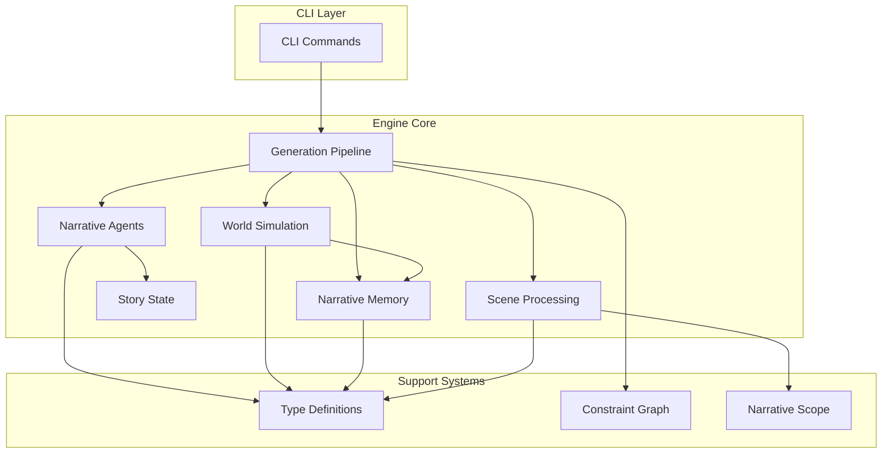

**Diagram sources**
- [packages/engine/src/index.ts:1-151](file://packages/engine/src/index.ts#L1-L151)
- [packages/engine/src/pipeline/generateChapter.ts:1-395](file://packages/engine/src/pipeline/generateChapter.ts#L1-L395)

The system follows a layered architecture pattern with clear boundaries between presentation (CLI), orchestration (Pipeline), domain-specific processing (Agents, World, Memory), and shared infrastructure (Types, Constraints, Scope).

**Section sources**
- [packages/engine/src/index.ts:1-151](file://packages/engine/src/index.ts#L1-L151)
- [apps/cli/src/index.ts:1-177](file://apps/cli/src/index.ts#L1-L177)

## Core Components

### Enhanced Story Director System
The Story Director now provides comprehensive chapter direction through detailed objectives, focus characters, suggested scenes, and chapter structure guidance, enabling collaborative planning between human authors and AI systems.

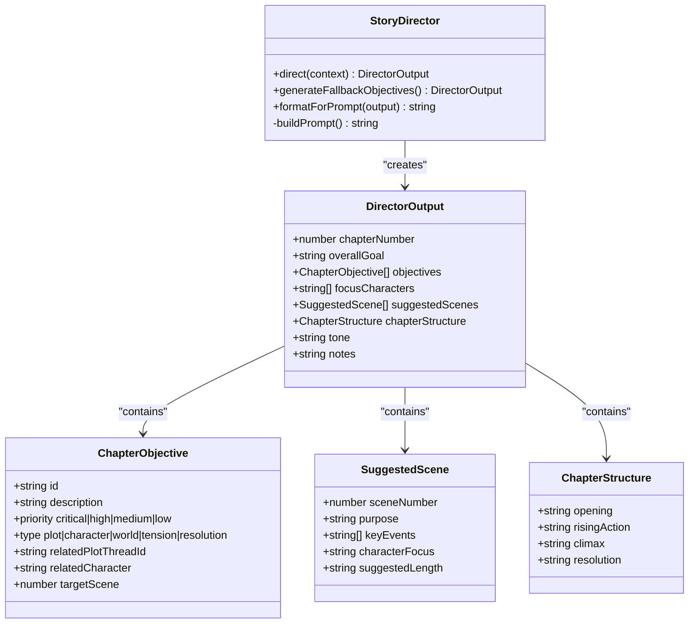

**Diagram sources**
- [packages/engine/src/agents/storyDirector.ts:31-40](file://packages/engine/src/agents/storyDirector.ts#L31-L40)
- [packages/engine/src/agents/storyDirector.ts:6-14](file://packages/engine/src/agents/storyDirector.ts#L6-L14)
- [packages/engine/src/agents/storyDirector.ts:16-22](file://packages/engine/src/agents/storyDirector.ts#L16-L22)
- [packages/engine/src/agents/storyDirector.ts:24-29](file://packages/engine/src/agents/storyDirector.ts#L24-L29)

The Story Director analyzes story state, tension guidance, and previous chapter summaries to generate actionable chapter objectives with priority levels and specific targets for scene development.

**Section sources**
- [packages/engine/src/agents/storyDirector.ts:1-320](file://packages/engine/src/agents/storyDirector.ts#L1-L320)

### Chapter Planner Integration
The Chapter Planner works collaboratively with the Story Director to convert high-level objectives into detailed scene-by-scene outlines with specific character assignments and tension progression.

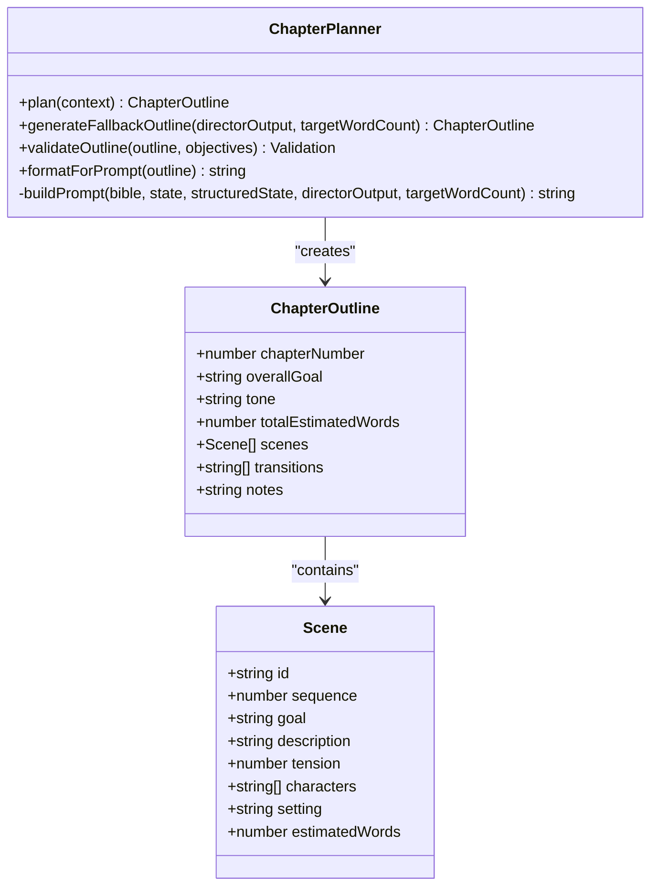

**Diagram sources**
- [packages/engine/src/agents/chapterPlanner.ts:17-25](file://packages/engine/src/agents/chapterPlanner.ts#L17-L25)
- [packages/engine/src/agents/chapterPlanner.ts:6-15](file://packages/engine/src/agents/chapterPlanner.ts#L6-L15)

The Chapter Planner creates detailed scene breakdowns with progressive tension building, specific character assignments, and estimated word counts for each scene.

**Section sources**
- [packages/engine/src/agents/chapterPlanner.ts:1-326](file://packages/engine/src/agents/chapterPlanner.ts#L1-L326)

### Enhanced Scene Planning Engine
The Scene Planning Engine now integrates with the Story Director to create scenes that align with specific chapter objectives and structure guidance.

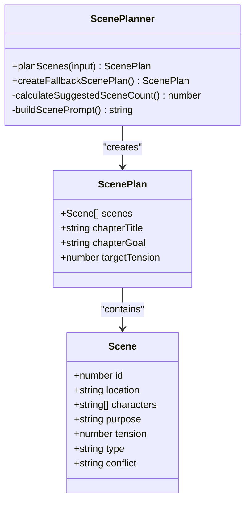

**Diagram sources**
- [packages/engine/src/agents/scenePlanner.ts:18-152](file://packages/engine/src/agents/scenePlanner.ts#L18-L152)
- [packages/engine/src/types/index.ts:128-133](file://packages/engine/src/types/index.ts#L128-L133)

The planner employs adaptive scene counting based on story progress, generating 3-7 scenes depending on narrative position within the overall arc. Each scene is carefully crafted to advance plot, develop characters, and maintain appropriate tension levels while aligning with Story Director objectives.

**Section sources**
- [packages/engine/src/agents/scenePlanner.ts:1-221](file://packages/engine/src/agents/scenePlanner.ts#L1-L221)
- [packages/engine/src/types/index.ts:118-152](file://packages/engine/src/types/index.ts#L118-L152)

### Enhanced Scene Validation System
The scene validation system now provides both comprehensive LLM-based validation and fast validation modes for different use cases.

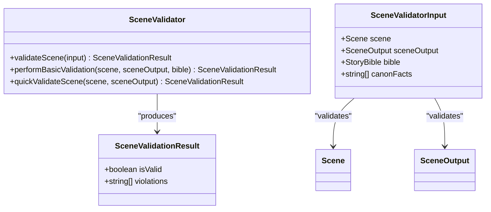

**Diagram sources**
- [packages/engine/src/agents/sceneValidator.ts:14-65](file://packages/engine/src/agents/sceneValidator.ts#L14-L65)
- [packages/engine/src/agents/sceneValidator.ts:103-119](file://packages/engine/src/agents/sceneValidator.ts#L103-L119)

The validation system includes both detailed LLM-based validation that checks for canon compliance, character presence, location accuracy, and purpose fulfillment, plus quick validation for performance-critical paths that focuses on content length and basic structural requirements.

**Section sources**
- [packages/engine/src/agents/sceneValidator.ts:1-119](file://packages/engine/src/agents/sceneValidator.ts#L1-L119)

### Story Direction and Tension Management
The StoryDirector coordinates high-level narrative direction while the TensionController ensures dramatic consistency throughout the story arc.

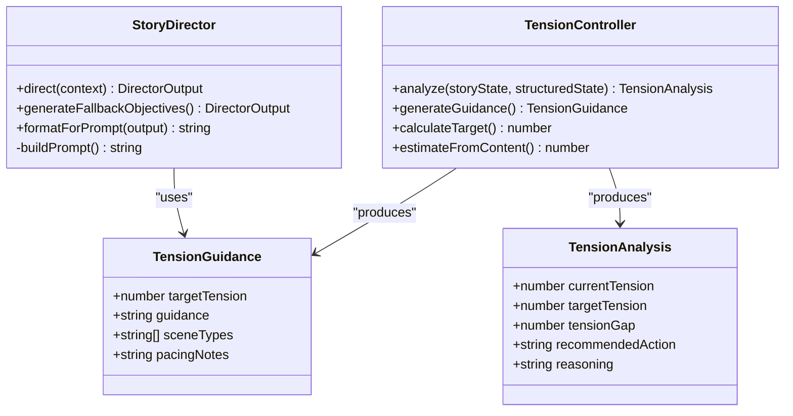

**Diagram sources**
- [packages/engine/src/agents/storyDirector.ts:134-320](file://packages/engine/src/agents/storyDirector.ts#L134-L320)
- [packages/engine/src/agents/tensionController.ts:214-252](file://packages/engine/src/agents/tensionController.ts#L214-L252)

The tension management system implements a parabolic curve that naturally builds toward the story's climax and resolves tension in the final chapters, creating authentic dramatic pacing.

**Section sources**
- [packages/engine/src/agents/storyDirector.ts:1-320](file://packages/engine/src/agents/storyDirector.ts#L1-L320)
- [packages/engine/src/agents/tensionController.ts:1-252](file://packages/engine/src/agents/tensionController.ts#L1-L252)

### Character Agency and Decision-Making
The CharacterAgentSystem provides autonomous decision-making capabilities, allowing characters to act according to their personalities, goals, and current circumstances.

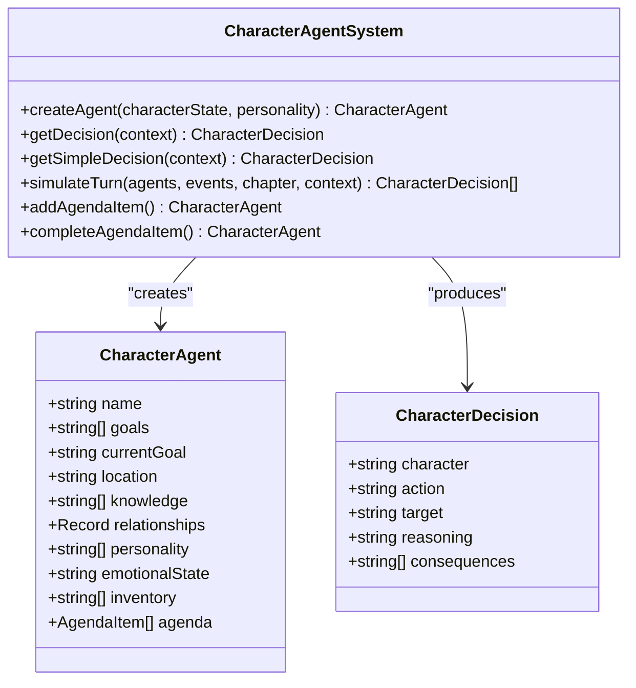

**Diagram sources**
- [packages/engine/src/world/characterAgent.ts:91-304](file://packages/engine/src/world/characterAgent.ts#L91-L304)

This system enables emergent storytelling where character actions drive plot development rather than following predetermined scripts.

**Section sources**
- [packages/engine/src/world/characterAgent.ts:1-304](file://packages/engine/src/world/characterAgent.ts#L1-L304)

### World State Simulation and Consistency
The WorldStateEngine maintains a comprehensive simulation of the fictional world, tracking character locations, relationships, objects, and timeline events.

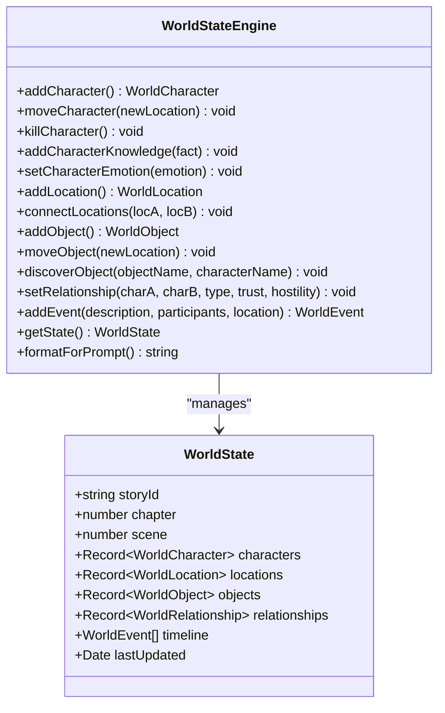

**Diagram sources**
- [packages/engine/src/world/worldStateEngine.ts:64-352](file://packages/engine/src/world/worldStateEngine.ts#L64-L352)

The engine enforces logical consistency, preventing impossible scenarios like characters appearing in multiple locations simultaneously or having knowledge they shouldn't possess.

**Section sources**
- [packages/engine/src/world/worldStateEngine.ts:1-352](file://packages/engine/src/world/worldStateEngine.ts#L1-L352)

### Narrative Scope Windows
The ScopeBuilder optimizes performance by loading only relevant context for each scene, reducing token usage and computational overhead.

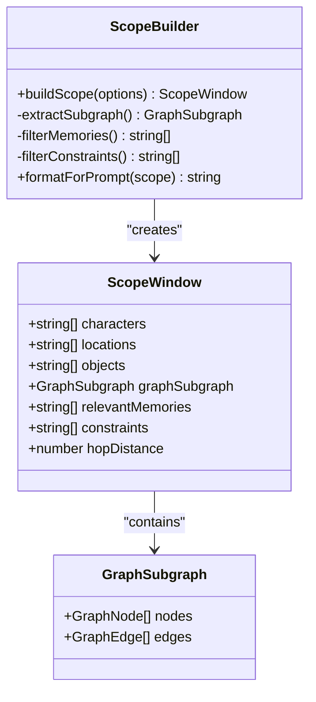

**Diagram sources**
- [packages/engine/src/scope/scopeBuilder.ts:49-480](file://packages/engine/src/scope/scopeBuilder.ts#L49-L480)

This system performs breadth-first expansion from center characters, collecting all entities reachable within a specified hop distance.

**Section sources**
- [packages/engine/src/scope/scopeBuilder.ts:1-480](file://packages/engine/src/scope/scopeBuilder.ts#L1-L480)

## Architecture Overview

The Enhanced Scene Planning System employs a sophisticated multi-agent architecture that coordinates multiple specialized components:

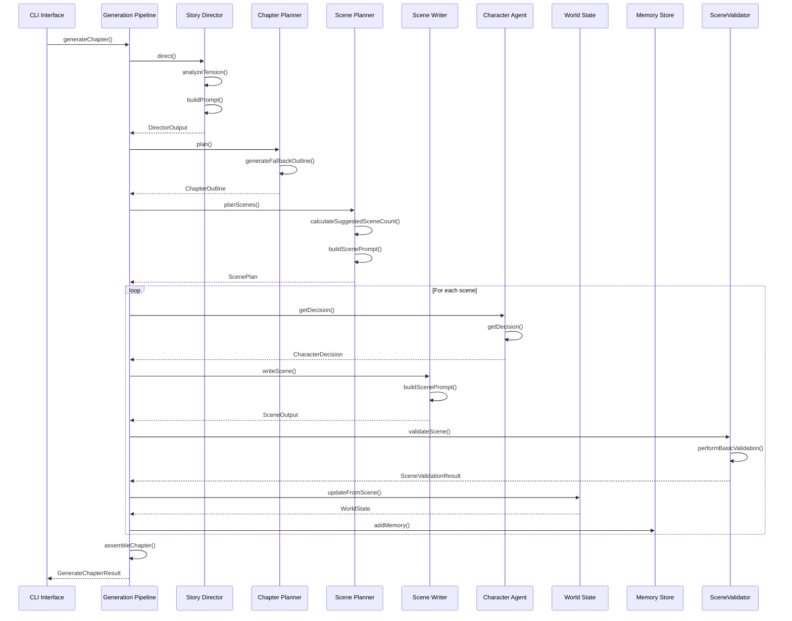

**Diagram sources**
- [packages/engine/src/pipeline/generateChapter.ts:67-208](file://packages/engine/src/pipeline/generateChapter.ts#L67-L208)
- [packages/engine/src/agents/storyDirector.ts:134-146](file://packages/engine/src/agents/storyDirector.ts#L134-L146)
- [packages/engine/src/agents/scenePlanner.ts:18-166](file://packages/engine/src/agents/scenePlanner.ts#L18-L166)
- [packages/engine/src/agents/sceneWriter.ts:20-144](file://packages/engine/src/agents/sceneWriter.ts#L20-L144)
- [packages/engine/src/agents/sceneValidator.ts:14-65](file://packages/engine/src/agents/sceneValidator.ts#L14-L65)

The pipeline orchestrates a sophisticated workflow where high-level story direction feeds into detailed scene planning, which then generates individual scenes with character agency and world-state consistency.

**Section sources**
- [packages/engine/src/pipeline/generateChapter.ts:1-395](file://packages/engine/src/pipeline/generateChapter.ts#L1-L395)

## Detailed Component Analysis

### Enhanced Collaborative Planning Workflow
The scene generation process now represents a sophisticated collaboration between human authors and AI systems, moving from chapter-level objectives to granular scene composition:

```mermaid
flowchart TD
Start([Start Enhanced Planning]) --> LoadContext["Load Story Context<br/>- Story Bible<br/>- Current State<br/>- Previous Summaries"]
LoadContext --> DirectorDirection["Story Director Analysis<br/>- Comprehensive Objectives<br/>- Focus Characters<br/>- Chapter Structure<br/>- Tone Guidance"]
DirectorDirection --> ChapterPlanning["Chapter Planning<br/>- Scene-by-Scene Outline<br/>- Progressive Tension<br/>- Character Assignments<br/>- Word Count Estimation"]
ChapterPlanning --> ScenePlanning["Scene Planning<br/>- Adaptive Scene Count<br/>- Location Selection<br/>- Character Composition<br/>- Tension Distribution"]
ScenePlanning --> CharacterDecisions["Character Agent Decisions<br/>- Personality-driven Actions<br/>- Goal Alignment<br/>- Relationship Dynamics<br/>- Contextual Responses"]
CharacterDecisions --> SceneWriting["Scene Writing<br/>- Focused Prose<br/>- Tension Control<br/>- Character Agency<br/>- World Consistency"]
SceneWriting --> Validation["Enhanced Scene Validation<br/>- LLM-based Quality Check<br/>- Canon Compliance<br/>- Structural Integrity<br/>- Quick Validation Option"]
Validation --> OutcomeExtraction["Outcome Extraction<br/>- Event Tracking<br/>- Character Changes<br/>- Knowledge Updates<br/>- Relationship Shifts"]
OutcomeExtraction --> WorldUpdate["World State Update<br/>- Location Changes<br/>- Object Movement<br/>- Timeline Updates<br/>- Constraint Checking"]
WorldUpdate --> MemoryStore["Memory Storage<br/>- Narrative Events<br/>- Character Insights<br/>- Plot Developments<br/>- World Changes"]
MemoryStore --> NextScene{"More Scenes?"}
NextScene --> |Yes| CharacterDecisions
NextScene --> |No| Assembly["Chapter Assembly<br/>- Content Integration<br/>- Transition Creation<br/>- Summary Generation"]
Assembly --> End([Complete Chapter])
```

**Diagram sources**
- [packages/engine/src/pipeline/generateChapter.ts:67-208](file://packages/engine/src/pipeline/generateChapter.ts#L67-L208)
- [packages/engine/src/agents/sceneWriter.ts:20-144](file://packages/engine/src/agents/sceneWriter.ts#L20-L144)
- [packages/engine/src/scene/sceneOutcomeExtractor.ts:14-67](file://packages/engine/src/scene/sceneOutcomeExtractor.ts#L14-L67)
- [packages/engine/src/agents/sceneValidator.ts:14-65](file://packages/engine/src/agents/sceneValidator.ts#L14-L65)

This enhanced workflow ensures each scene serves multiple narrative functions: advancing plot, developing characters, maintaining tension, and contributing to world-building while preserving logical consistency and aligning with collaborative authorship goals.

**Section sources**
- [packages/engine/src/pipeline/generateChapter.ts:1-395](file://packages/engine/src/pipeline/generateChapter.ts#L1-L395)
- [packages/engine/src/agents/sceneWriter.ts:1-198](file://packages/engine/src/agents/sceneWriter.ts#L1-L198)

### Chapter Assembly and Cohesion
The SceneAssembler component integrates individual scenes into a cohesive chapter while maintaining narrative flow and proper formatting.

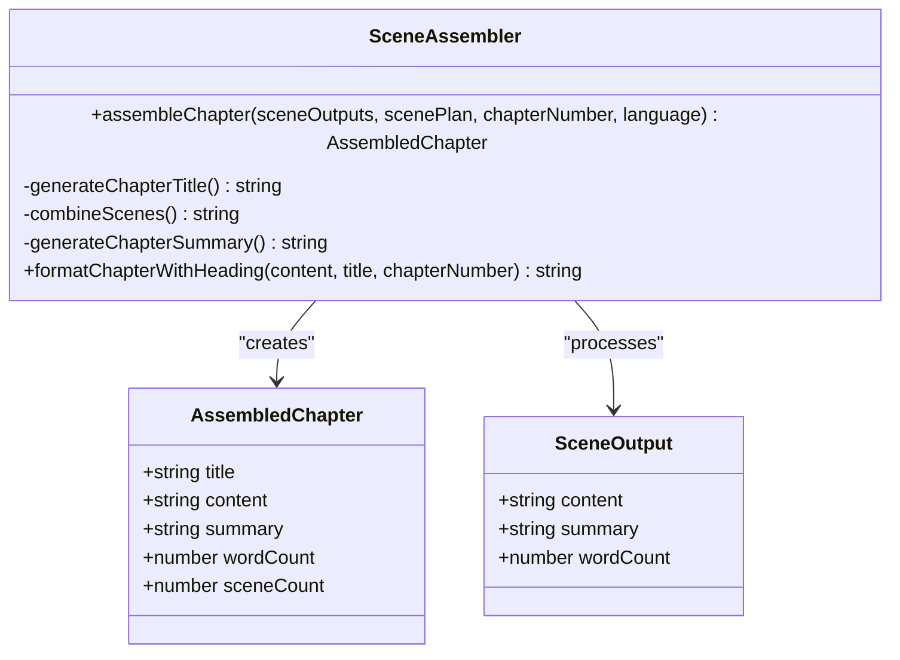

**Diagram sources**
- [packages/engine/src/scene/sceneAssembler.ts:14-112](file://packages/engine/src/scene/sceneAssembler.ts#L14-L112)

The assembler employs sophisticated title generation strategies, content combination techniques, and summary synthesis methods to create polished, readable chapters.

**Section sources**
- [packages/engine/src/scene/sceneAssembler.ts:1-112](file://packages/engine/src/scene/sceneAssembler.ts#L1-L112)

### State Management and Evolution
The system maintains comprehensive state tracking through multiple interconnected systems that monitor character development, plot progression, and world changes.

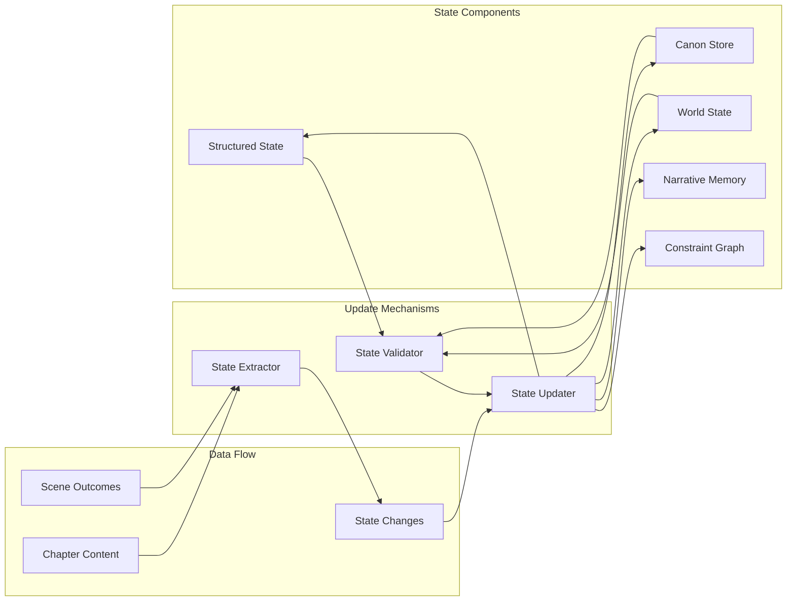

**Diagram sources**
- [packages/engine/src/memory/stateUpdater.ts:90-435](file://packages/engine/src/memory/stateUpdater.ts#L90-L435)
- [packages/engine/src/story/structuredState.ts:33-235](file://packages/engine/src/story/structuredState.ts#L33-L235)

The state management system provides comprehensive tracking of story evolution, enabling sophisticated narrative consistency checking and intelligent content generation.

**Section sources**
- [packages/engine/src/memory/stateUpdater.ts:1-435](file://packages/engine/src/memory/stateUpdater.ts#L1-L435)
- [packages/engine/src/story/structuredState.ts:1-235](file://packages/engine/src/story/structuredState.ts#L1-L235)

## Dependency Analysis

The Enhanced Scene Planning System exhibits a well-structured dependency hierarchy with clear separation of concerns and minimal circular dependencies:

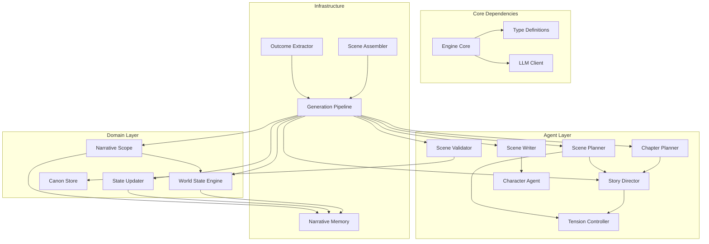

**Diagram sources**
- [packages/engine/src/index.ts:1-151](file://packages/engine/src/index.ts#L1-L151)
- [packages/engine/src/pipeline/generateChapter.ts:1-395](file://packages/engine/src/pipeline/generateChapter.ts#L1-L395)

The dependency structure demonstrates excellent modularity with clear directional dependencies: infrastructure components depend on domain models, which depend on agent components, which coordinate through the pipeline.

**Section sources**
- [packages/engine/src/index.ts:1-151](file://packages/engine/src/index.ts#L1-L151)
- [packages/engine/src/pipeline/generateChapter.ts:1-395](file://packages/engine/src/pipeline/generateChapter.ts#L1-L395)

## Performance Considerations

The Enhanced Scene Planning System incorporates several performance optimization strategies:

### Token Efficiency
- **Adaptive Scene Counting**: Reduces unnecessary token usage by adjusting scene counts based on narrative position
- **Scope Windowing**: Limits context to relevant entities, dramatically reducing prompt sizes
- **Incremental Processing**: Processes scenes sequentially rather than in bulk
- **Quick Validation Mode**: Provides fast validation for performance-critical paths

### Computational Optimization
- **Parallel Processing**: Scene generation occurs independently, enabling parallel execution
- **Fallback Mechanisms**: Robust fallbacks prevent pipeline failures and maintain performance
- **Memory Management**: Efficient memory usage through targeted context loading
- **Collaborative Planning**: Reduces redundant processing through shared objectives and structure guidance

### Quality Assurance
- **Multi-layer Validation**: Validates at scene, chapter, and story levels
- **Consistency Checking**: World-state and canon validation prevents expensive rework
- **Iterative Improvement**: Continuous refinement through outcome extraction and state updates
- **Enhanced Collaboration**: Story Director objectives reduce ambiguity and improve generation quality

## Troubleshooting Guide

### Common Issues and Solutions

**Enhanced Story Director Failures**
- **Symptoms**: Missing objectives, unclear chapter structure, or inconsistent tone guidance
- **Causes**: Insufficient story state context, missing previous chapter summaries, or inadequate tension analysis
- **Solutions**: Verify structured state initialization, ensure proper tension analysis, check previous chapter summaries availability

**Chapter Planning Issues**
- **Symptoms**: Scenes that don't align with objectives, inconsistent character assignments, or poor tension progression
- **Causes**: Story Director objectives not properly integrated, missing focus characters, or inadequate scene-by-scene guidance
- **Solutions**: Review Story Director output formatting, verify objective-priority mapping, check character state consistency

**Scene Generation Failures**
- **Symptoms**: Empty scene outputs or malformed JSON
- **Causes**: LLM output formatting issues, token limits exceeded, or missing Story Director guidance
- **Solutions**: Enable fallback mechanisms, adjust temperature settings, increase max tokens, verify Story Director integration

**Enhanced Validation Problems**
- **Symptoms**: Overly strict validation blocking legitimate content or insufficient validation missing issues
- **Causes**: LLM-based validation being too strict or quick validation being too lenient
- **Solutions**: Adjust validation thresholds, use appropriate validation mode for context, review validation criteria

**World State Inconsistencies**
- **Symptoms**: Characters appearing in impossible locations or contradictory facts
- **Causes**: Incomplete state updates or missing validation steps
- **Solutions**: Implement comprehensive validation, ensure proper state synchronization

**Performance Degradation**
- **Symptoms**: Slow generation times or memory exhaustion
- **Causes**: Excessive context loading or inefficient processing loops
- **Solutions**: Optimize scope windows, implement caching strategies, monitor resource usage, consider quick validation mode

**Section sources**
- [packages/engine/src/agents/sceneWriter.ts:138-144](file://packages/engine/src/agents/sceneWriter.ts#L138-L144)
- [packages/engine/src/agents/sceneValidator.ts:59-65](file://packages/engine/src/agents/sceneValidator.ts#L59-L65)
- [packages/engine/src/agents/tensionController.ts:214-252](file://packages/engine/src/agents/tensionController.ts#L214-L252)

## Conclusion

The Enhanced Scene Planning System represents a significant advancement in AI-powered narrative generation, offering unprecedented control over story structure while maintaining the organic quality that makes fiction compelling. Through its sophisticated multi-agent architecture, the system achieves a balance between authorial control and emergent storytelling, enabling writers to craft complex, coherent narratives with confidence.

The system's strength lies in its comprehensive approach to narrative construction, where enhanced Story Director integration, character agency, world consistency, and iterative validation work together to produce high-quality stories. The scene-level approach provides granular control over narrative pacing and character development, while the underlying systems ensure logical consistency and thematic coherence.

**Updated** Key innovations include the enhanced Story Director system with comprehensive chapter objectives and structure guidance, the Chapter Planner component for collaborative planning, the enhanced scene validation system with both LLM-based and quick validation modes, and sophisticated world-state simulation with organic scene development capabilities. These components work together to create a robust platform for AI-assisted storytelling that respects narrative conventions while embracing the creative possibilities of artificial intelligence.

The system's modular design and extensive validation mechanisms position it as a solid foundation for future enhancements, including expanded character interaction modeling, more sophisticated world simulation, and advanced narrative analysis capabilities. As AI continues to evolve, this system provides a strong framework for pushing the boundaries of automated storytelling while maintaining the artistic integrity that defines great literature.

The enhanced collaborative planning capabilities enable seamless integration between human authors and AI systems, where Story Director objectives guide the creative process while maintaining the flexibility for organic scene development. This represents a significant step forward in AI-assisted creative writing, offering both structure and freedom in equal measure.