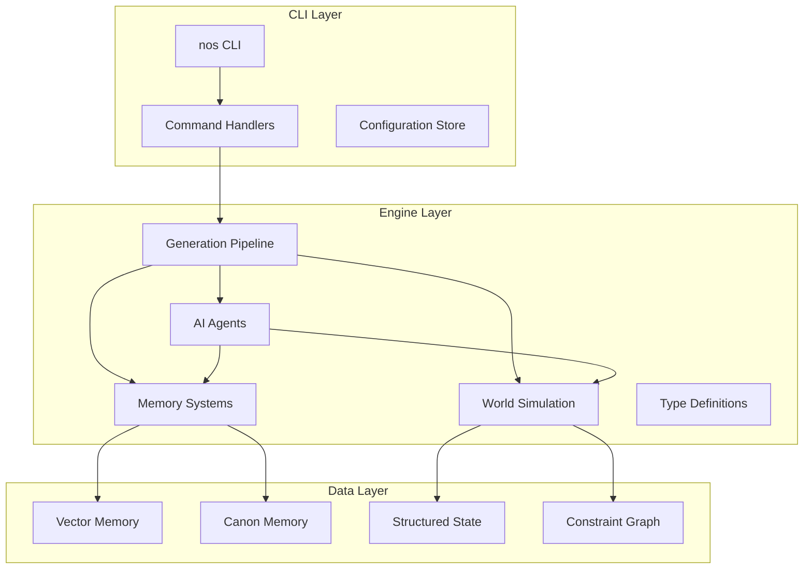
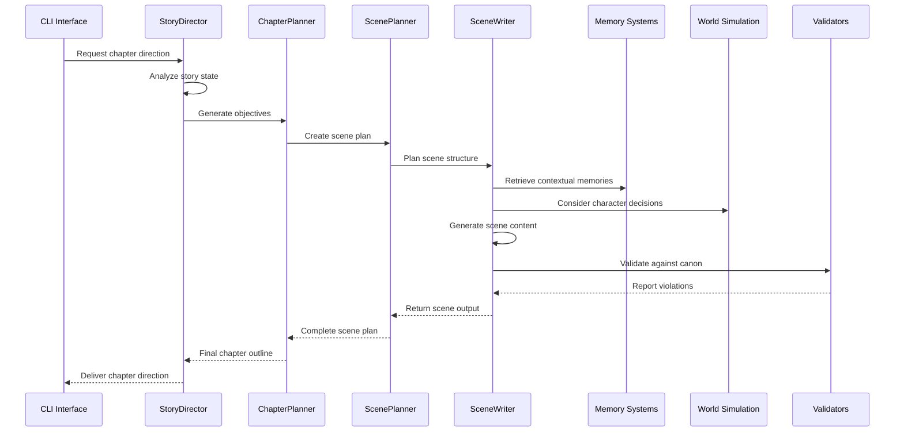
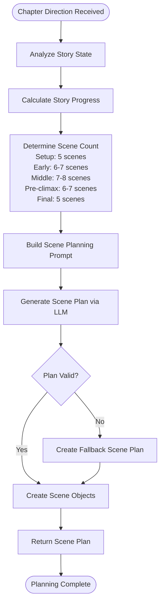
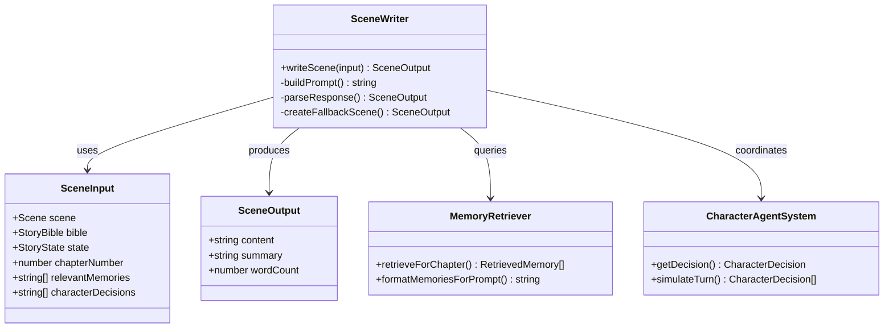
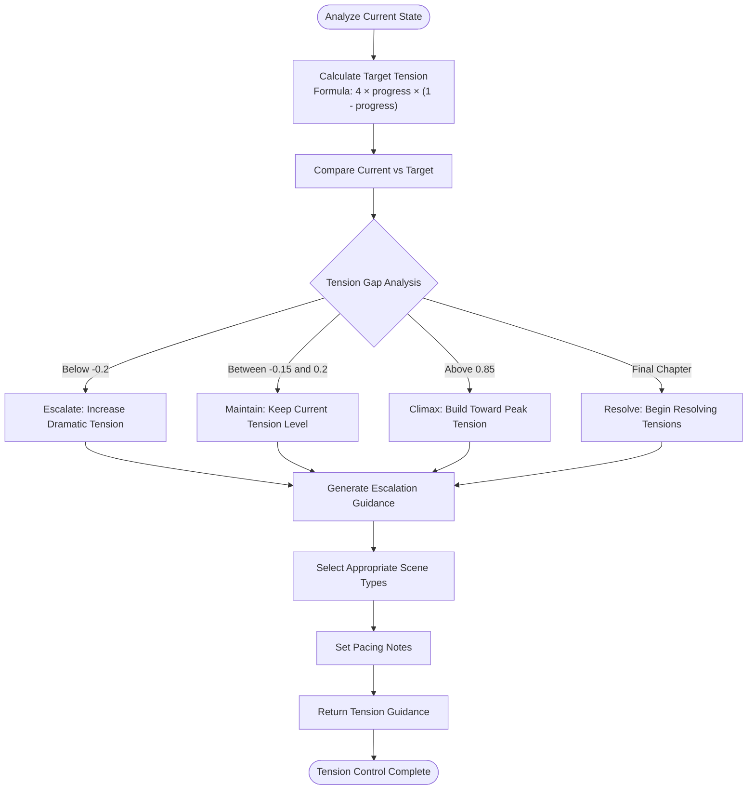
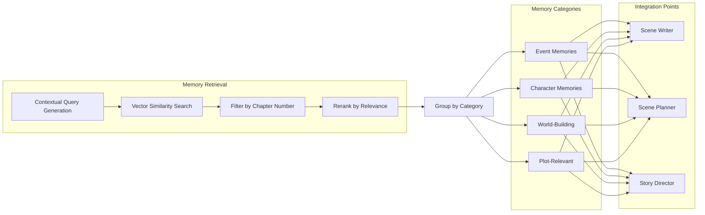
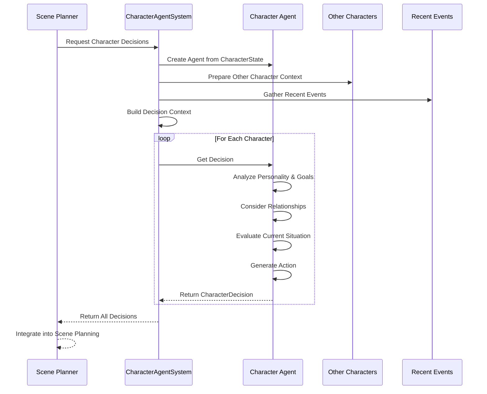
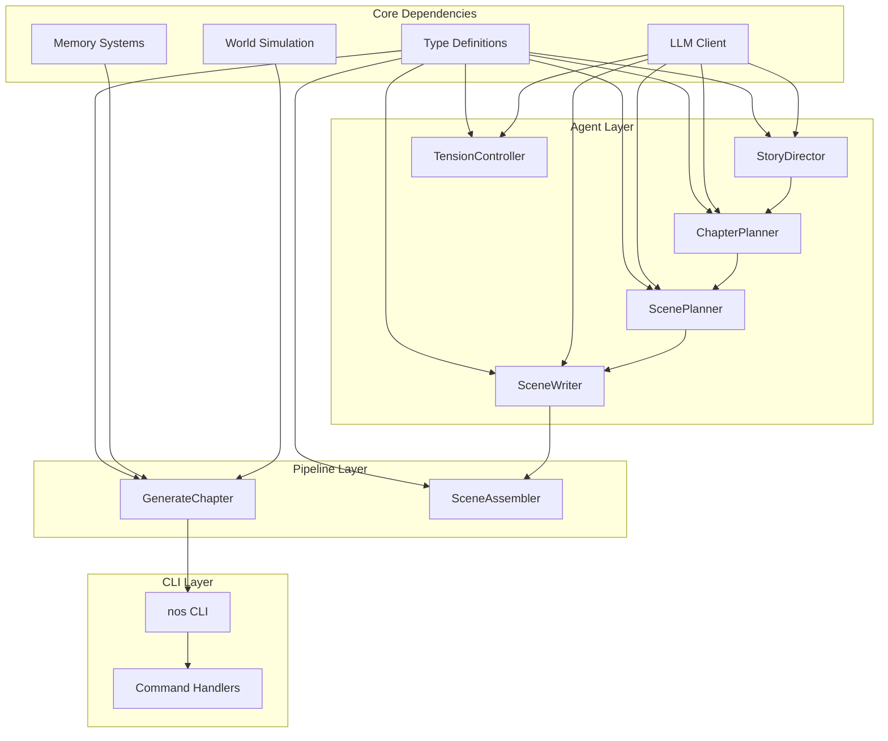

# Enhanced Scene Writing System

<cite>
**Referenced Files in This Document**
- [README.md](file://README.md)
- [packages/engine/src/index.ts](file://packages/engine/src/index.ts)
- [packages/engine/src/agents/sceneWriter.ts](file://packages/engine/src/agents/sceneWriter.ts)
- [packages/engine/src/agents/scenePlanner.ts](file://packages/engine/src/agents/scenePlanner.ts)
- [packages/engine/src/agents/storyDirector.ts](file://packages/engine/src/agents/storyDirector.ts)
- [packages/engine/src/agents/chapterPlanner.ts](file://packages/engine/src/agents/chapterPlanner.ts)
- [packages/engine/src/pipeline/generateChapter.ts](file://packages/engine/src/pipeline/generateChapter.ts)
- [packages/engine/src/types/index.ts](file://packages/engine/src/types/index.ts)
- [packages/engine/src/agents/tensionController.ts](file://packages/engine/src/agents/tensionController.ts)
- [packages/engine/src/memory/memoryRetriever.ts](file://packages/engine/src/memory/memoryRetriever.ts)
- [packages/engine/src/world/characterAgent.ts](file://packages/engine/src/world/characterAgent.ts)
- [packages/engine/src/scene/sceneAssembler.ts](file://packages/engine/src/scene/sceneAssembler.ts)
- [apps/cli/src/index.ts](file://apps/cli/src/index.ts)
- [apps/cli/src/commands/generate.ts](file://apps/cli/src/commands/generate.ts)
- [apps/cli/src/commands/init.ts](file://apps/cli/src/commands/init.ts)
- [apps/cli/src/commands/status.ts](file://apps/cli/src/commands/status.ts)
</cite>

## Table of Contents
1. [Introduction](#introduction)
2. [Project Structure](#project-structure)
3. [Core Components](#core-components)
4. [Architecture Overview](#architecture-overview)
5. [Detailed Component Analysis](#detailed-component-analysis)
6. [Dependency Analysis](#dependency-analysis)
7. [Performance Considerations](#performance-considerations)
8. [Troubleshooting Guide](#troubleshooting-guide)
9. [Conclusion](#conclusion)

## Introduction
The Enhanced Scene Writing System is an AI-native narrative engine designed to generate long-form stories with persistent memory, autonomous world simulation, and logical consistency enforcement. It transforms story creation from linear text generation into a sophisticated, multi-agent pipeline that plans, executes, validates, and evolves narratives across chapters and scenes.

The system operates on the principle that stories are living systems, not static texts. It maintains a hierarchical memory architecture inspired by human storytelling cognition, ensuring continuity, coherence, and logical consistency across extended narratives.

## Project Structure
The project follows a modular monorepo architecture with clear separation between the CLI interface and the core narrative engine:

**Diagram sources**
- [apps/cli/src/index.ts:1-177](file://apps/cli/src/index.ts#L1-L177)
- [packages/engine/src/index.ts:1-151](file://packages/engine/src/index.ts#L1-L151)

The system consists of two main packages:
- **@narrative-os/cli**: Command-line interface for story creation and management
- **@narrative-os/engine**: Core narrative engine with AI agents and memory systems

**Section sources**
- [README.md:197-212](file://README.md#L197-L212)
- [apps/cli/src/index.ts:1-177](file://apps/cli/src/index.ts#L1-L177)
- [packages/engine/src/index.ts:1-151](file://packages/engine/src/index.ts#L1-L151)

## Core Components
The Enhanced Scene Writing System comprises several interconnected components that work together to create coherent, consistent narratives:

### AI Agents
The system employs specialized AI agents that handle different aspects of narrative generation:

- **StoryDirector**: Analyzes story state and generates chapter objectives
- **ChapterPlanner**: Converts objectives into detailed scene-by-scene outlines
- **ScenePlanner**: Creates individual scene breakdowns with specific purposes
- **SceneWriter**: Generates immersive narrative prose for each scene
- **TensionController**: Manages narrative arc and pacing across chapters

### Memory Systems
A hierarchical memory architecture ensures narrative consistency and coherence:

- **VectorStore**: HNSW-based semantic memory retrieval
- **CanonStore**: Immutable facts that must never be contradicted
- **StructuredState**: Real-time tracking of character emotions, locations, and knowledge
- **ConstraintGraph**: Knowledge graph enforcing logical consistency

### World Simulation
Autonomous character agents with goals and agendas drive narrative development:

- **CharacterAgentSystem**: Individual character decision-making
- **WorldStateEngine**: Persistent world state management
- **EventResolver**: Handles character interactions and consequences

**Section sources**
- [README.md:36-46](file://README.md#L36-L46)
- [packages/engine/src/agents/storyDirector.ts:134-320](file://packages/engine/src/agents/storyDirector.ts#L134-L320)
- [packages/engine/src/agents/chapterPlanner.ts:110-326](file://packages/engine/src/agents/chapterPlanner.ts#L110-L326)
- [packages/engine/src/agents/scenePlanner.ts:18-228](file://packages/engine/src/agents/scenePlanner.ts#L18-L228)
- [packages/engine/src/agents/sceneWriter.ts:20-198](file://packages/engine/src/agents/sceneWriter.ts#L20-L198)

## Architecture Overview
The Enhanced Scene Writing System implements a sophisticated multi-agent architecture that orchestrates narrative generation through coordinated AI agents:

**Diagram sources**
- [packages/engine/src/pipeline/generateChapter.ts:71-355](file://packages/engine/src/pipeline/generateChapter.ts#L71-L355)
- [packages/engine/src/agents/storyDirector.ts:134-320](file://packages/engine/src/agents/storyDirector.ts#L134-L320)
- [packages/engine/src/agents/chapterPlanner.ts:110-326](file://packages/engine/src/agents/chapterPlanner.ts#L110-L326)
- [packages/engine/src/agents/scenePlanner.ts:18-228](file://packages/engine/src/agents/scenePlanner.ts#L18-L228)
- [packages/engine/src/agents/sceneWriter.ts:20-198](file://packages/engine/src/agents/sceneWriter.ts#L20-L198)

The architecture follows a pipeline pattern where each stage builds upon the previous one, ensuring narrative coherence and logical consistency. The system maintains persistence through structured state updates and memory extraction, allowing stories to evolve organically across chapters.

**Section sources**
- [README.md:20-34](file://README.md#L20-L34)
- [packages/engine/src/pipeline/generateChapter.ts:41-65](file://packages/engine/src/pipeline/generateChapter.ts#L41-L65)

## Detailed Component Analysis

### Scene Planning System
The scene planning system represents the heart of the Enhanced Scene Writing System, transforming high-level chapter objectives into detailed scene breakdowns:

**Diagram sources**
- [packages/engine/src/agents/scenePlanner.ts:18-166](file://packages/engine/src/agents/scenePlanner.ts#L18-L166)
- [packages/engine/src/agents/chapterPlanner.ts:110-326](file://packages/engine/src/agents/chapterPlanner.ts#L110-L326)

The scene planning process considers story progress, character dynamics, and narrative structure to create appropriate scene counts and arrangements. The system adapts scene complexity based on story phase, ensuring optimal narrative development throughout the story arc.

**Section sources**
- [packages/engine/src/agents/scenePlanner.ts:18-166](file://packages/engine/src/agents/scenePlanner.ts#L18-L166)
- [packages/engine/src/agents/chapterPlanner.ts:110-326](file://packages/engine/src/agents/chapterPlanner.ts#L110-L326)

### Scene Writing Engine
The scene writing engine transforms planned scenes into immersive narrative prose through sophisticated prompting and validation:

**Diagram sources**
- [packages/engine/src/agents/sceneWriter.ts:20-198](file://packages/engine/src/agents/sceneWriter.ts#L20-L198)
- [packages/engine/src/memory/memoryRetriever.ts:18-174](file://packages/engine/src/memory/memoryRetriever.ts#L18-L174)
- [packages/engine/src/world/characterAgent.ts:91-304](file://packages/engine/src/world/characterAgent.ts#L91-L304)

The scene writing process incorporates multiple contextual factors including character decisions, relevant memories, and narrative tension. The system maintains strict quality standards, validating output against canonical facts and ensuring coherent narrative flow.

**Section sources**
- [packages/engine/src/agents/sceneWriter.ts:20-198](file://packages/engine/src/agents/sceneWriter.ts#L20-L198)
- [packages/engine/src/memory/memoryRetriever.ts:18-174](file://packages/engine/src/memory/memoryRetriever.ts#L18-L174)
- [packages/engine/src/world/characterAgent.ts:91-304](file://packages/engine/src/world/characterAgent.ts#L91-L304)

### Tension Management System
The tension management system enforces narrative arc consistency through mathematical modeling and adaptive guidance:

**Diagram sources**
- [packages/engine/src/agents/tensionController.ts:28-149](file://packages/engine/src/agents/tensionController.ts#L28-L149)

The tension system implements a parabolic curve formula that creates natural dramatic arcs, peaking at the story's midpoint and resolving at the conclusion. This mathematical approach ensures narrative engagement while maintaining logical consistency.

**Section sources**
- [packages/engine/src/agents/tensionController.ts:28-149](file://packages/engine/src/agents/tensionController.ts#L28-L149)

### Memory Integration System
The memory integration system provides contextual awareness through semantic retrieval and narrative context:

**Diagram sources**
- [packages/engine/src/memory/memoryRetriever.ts:25-102](file://packages/engine/src/memory/memoryRetriever.ts#L25-L102)

The memory system enables contextual awareness by retrieving relevant past events, character developments, and world-building details. This ensures narrative consistency while preventing characters from accessing future knowledge.

**Section sources**
- [packages/engine/src/memory/memoryRetriever.ts:25-102](file://packages/engine/src/memory/memoryRetriever.ts#L25-L102)

### Character Decision System
The character decision system simulates autonomous character behavior through sophisticated AI reasoning:

**Diagram sources**
- [packages/engine/src/world/characterAgent.ts:187-210](file://packages/engine/src/world/characterAgent.ts#L187-L210)
- [packages/engine/src/world/characterAgent.ts:270-300](file://packages/engine/src/world/characterAgent.ts#L270-L300)

The character decision system creates believable character actions by considering personality traits, emotional states, relationships, and current circumstances. This autonomy enhances narrative authenticity and reader engagement.

**Section sources**
- [packages/engine/src/world/characterAgent.ts:187-210](file://packages/engine/src/world/characterAgent.ts#L187-L210)
- [packages/engine/src/world/characterAgent.ts:270-300](file://packages/engine/src/world/characterAgent.ts#L270-L300)

## Dependency Analysis
The Enhanced Scene Writing System exhibits strong modularity with well-defined dependencies between components:

**Diagram sources**
- [packages/engine/src/index.ts:1-151](file://packages/engine/src/index.ts#L1-L151)
- [packages/engine/src/pipeline/generateChapter.ts:1-40](file://packages/engine/src/pipeline/generateChapter.ts#L1-L40)

The dependency structure demonstrates clear separation of concerns with minimal circular dependencies. Each component has specific responsibilities, enabling maintainability and extensibility.

**Section sources**
- [packages/engine/src/index.ts:1-151](file://packages/engine/src/index.ts#L1-L151)
- [packages/engine/src/pipeline/generateChapter.ts:1-40](file://packages/engine/src/pipeline/generateChapter.ts#L1-L40)

## Performance Considerations
The Enhanced Scene Writing System implements several performance optimization strategies:

### Memory Efficiency
- **HNSW Vector Search**: O(log n) semantic memory retrieval using Hierarchical Navigable Small World graphs
- **Incremental Memory Loading**: Vector stores are initialized only when needed
- **Memory Filtering**: Automatic exclusion of future chapter memories prevents temporal inconsistencies

### Computational Optimization
- **Modular Processing**: Each agent operates independently, enabling parallel execution where possible
- **Fallback Mechanisms**: Robust fallback systems ensure generation continues even when LLM calls fail
- **Selective Validation**: Optional validation modes reduce computational overhead during development

### Resource Management
- **Memory Retrieval Limits**: Configurable limits on retrieved memories prevent excessive memory usage
- **Token Management**: Careful control of LLM token usage optimizes cost and performance
- **State Persistence**: Efficient serialization minimizes I/O overhead

## Troubleshooting Guide
Common issues and their solutions in the Enhanced Scene Writing System:

### Generation Failures
**Issue**: Scene generation fails with validation errors
**Solution**: Check canon store for conflicting facts and adjust scene planning parameters

**Issue**: Memory retrieval returns irrelevant results  
**Solution**: Improve contextual query generation and adjust similarity thresholds

**Issue**: Character decisions seem inconsistent
**Solution**: Review character personality profiles and relationship matrices

### Performance Issues
**Issue**: Slow generation times
**Solution**: Reduce target scene count, disable optional validations, or upgrade hardware

**Issue**: Memory usage increases rapidly
**Solution**: Implement memory cleanup policies and optimize vector store configuration

### Integration Problems
**Issue**: CLI commands fail to execute
**Solution**: Verify LLM provider configuration and API credentials

**Issue**: Story state corruption
**Solution**: Implement backup strategies and validate state serialization

**Section sources**
- [packages/engine/src/agents/sceneWriter.ts:138-144](file://packages/engine/src/agents/sceneWriter.ts#L138-L144)
- [packages/engine/src/agents/scenePlanner.ts:160-166](file://packages/engine/src/agents/scenePlanner.ts#L160-L166)
- [packages/engine/src/pipeline/generateChapter.ts:377-389](file://packages/engine/src/pipeline/generateChapter.ts#L377-L389)

## Conclusion
The Enhanced Scene Writing System represents a significant advancement in AI-powered narrative generation. By combining sophisticated AI agents, persistent memory systems, and autonomous world simulation, it creates coherent, engaging stories that maintain logical consistency across extended narratives.

The system's modular architecture enables both automated story generation and manual author control, while its hierarchical memory structure ensures narrative continuity and character development. The integration of tension management, character agency, and constraint enforcement creates rich, believable worlds that evolve naturally through the story arc.

Future enhancements could include expanded character relationship modeling, more sophisticated world simulation, and advanced narrative analysis capabilities. The foundation established by this system provides a robust platform for continued innovation in AI-assisted storytelling.