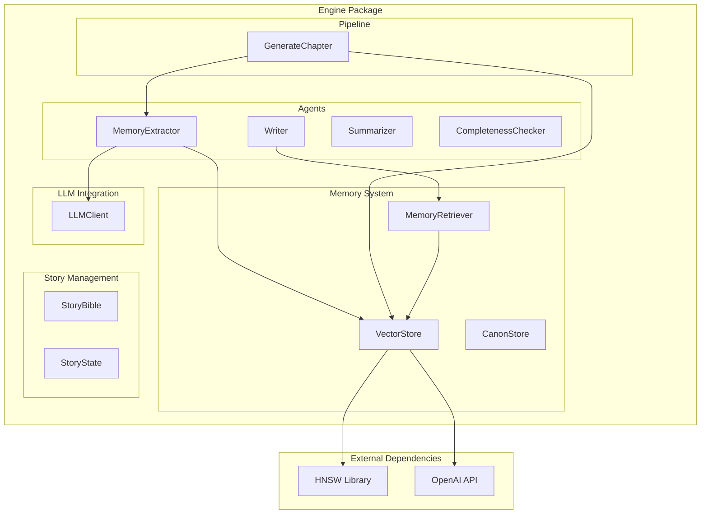
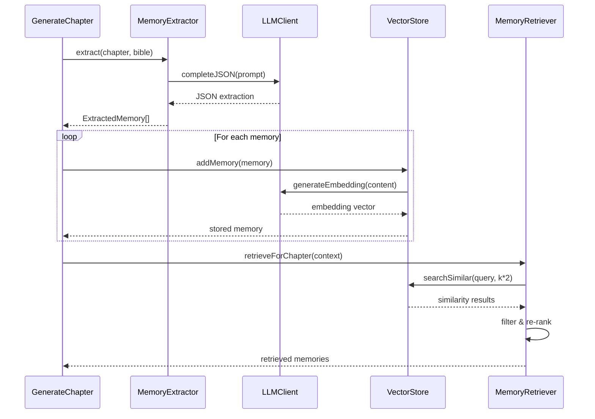
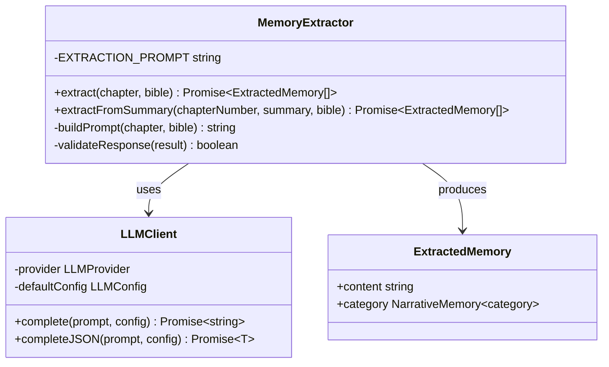
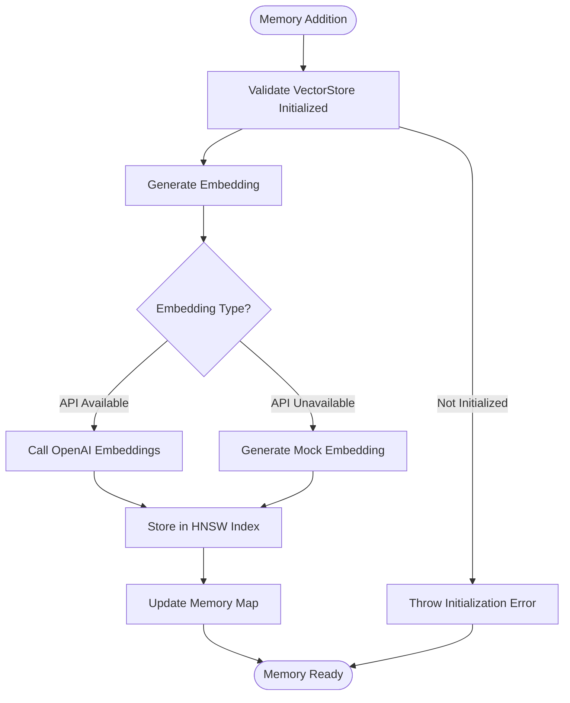
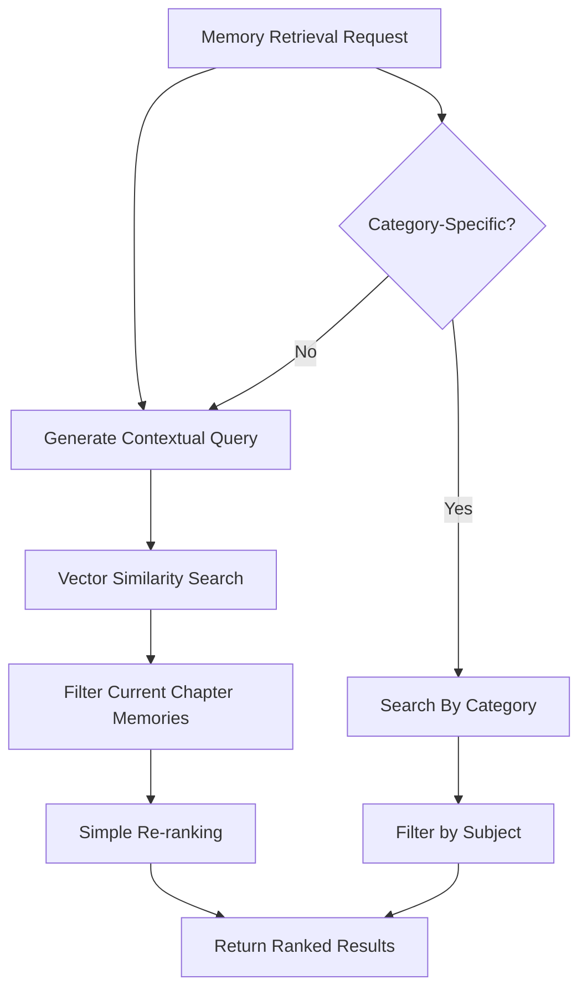
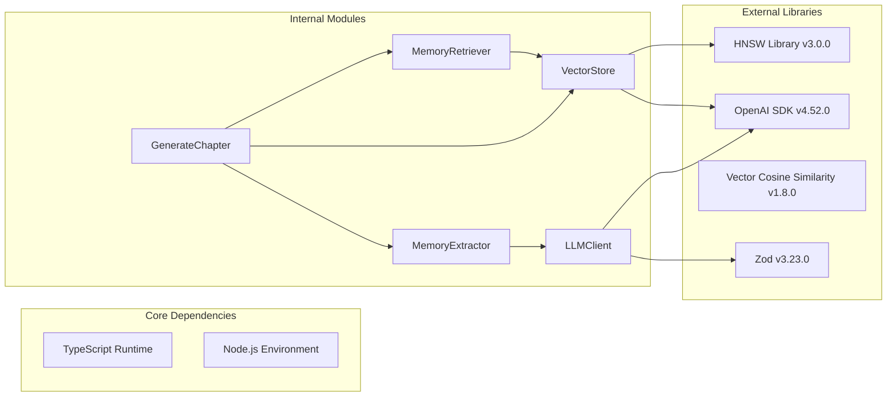

# Memory Extractor Agent

<cite>
**Referenced Files in This Document**
- [memoryExtractor.ts](file://packages/engine/src/agents/memoryExtractor.ts)
- [vectorStore.ts](file://packages/engine/src/memory/vectorStore.ts)
- [memoryRetriever.ts](file://packages/engine/src/memory/memoryRetriever.ts)
- [client.ts](file://packages/engine/src/llm/client.ts)
- [generateChapter.ts](file://packages/engine/src/pipeline/generateChapter.ts)
- [index.ts](file://packages/engine/src/index.ts)
- [index.ts](file://packages/engine/src/types/index.ts)
- [bible.ts](file://packages/engine/src/story/bible.ts)
- [state.ts](file://packages/engine/src/story/state.ts)
- [summarizer.ts](file://packages/engine/src/agents/summarizer.ts)
- [writer.ts](file://packages/engine/src/agents/writer.ts)
</cite>

## Table of Contents
1. [Introduction](#introduction)
2. [Project Structure](#project-structure)
3. [Core Components](#core-components)
4. [Architecture Overview](#architecture-overview)
5. [Detailed Component Analysis](#detailed-component-analysis)
6. [Dependency Analysis](#dependency-analysis)
7. [Performance Considerations](#performance-considerations)
8. [Troubleshooting Guide](#troubleshooting-guide)
9. [Conclusion](#conclusion)

## Introduction
The Memory Extractor Agent is a core component of the Narrative Operating System that automatically identifies and extracts narrative memories from generated chapters. It serves as the bridge between creative writing and persistent storytelling knowledge, enabling the system to maintain continuity, track character development, and preserve world-building details across the entire story arc.

The agent operates by analyzing chapter content and extracting structured facts categorized into four fundamental narrative types: events, character moments, world details, and plot developments. These extracted memories are then stored in a vector-based memory system that enables semantic search and retrieval for future writing contexts.

## Project Structure
The Memory Extractor Agent is part of a larger narrative generation ecosystem organized into distinct functional domains:

**Diagram sources**
- [memoryExtractor.ts](file://packages/engine/src/agents/memoryExtractor.ts#L1-L97)
- [vectorStore.ts](file://packages/engine/src/memory/vectorStore.ts#L1-L173)
- [memoryRetriever.ts](file://packages/engine/src/memory/memoryRetriever.ts#L1-L174)
- [generateChapter.ts](file://packages/engine/src/pipeline/generateChapter.ts#L1-L108)

**Section sources**
- [index.ts](file://packages/engine/src/index.ts#L1-L43)
- [memoryExtractor.ts](file://packages/engine/src/agents/memoryExtractor.ts#L1-L97)

## Core Components

### MemoryExtractor Class
The MemoryExtractor is the primary component responsible for transforming unstructured narrative content into structured, searchable memories. It implements two extraction modes:

1. **Full Chapter Extraction**: Processes complete chapter content with content length limiting
2. **Summary Extraction**: Handles chapter summaries for efficiency in batch processing

The extraction process follows a systematic approach:
- Template-based prompt engineering with story context injection
- Structured JSON output parsing with validation
- Category assignment for semantic organization
- Temperature-controlled creativity vs. consistency

### VectorStore System
The VectorStore provides persistent memory storage with advanced semantic search capabilities:
- Hierarchical Navigable Small World (HNSW) indexing for efficient similarity search
- Embedding generation using OpenAI's text-embedding-3-small model
- Multi-category memory organization (event, character, world, plot)
- Serialization support for persistence across sessions

### MemoryRetriever Integration
The MemoryRetriever enables contextual memory access:
- Chapter-specific memory filtering (excluding future chapters)
- Category-based retrieval for targeted content
- Re-ranking based on relevance scores
- Prompt formatting for seamless integration with writing agents

**Section sources**
- [memoryExtractor.ts](file://packages/engine/src/agents/memoryExtractor.ts#L52-L97)
- [vectorStore.ts](file://packages/engine/src/memory/vectorStore.ts#L19-L173)
- [memoryRetriever.ts](file://packages/engine/src/memory/memoryRetriever.ts#L18-L174)

## Architecture Overview

**Diagram sources**
- [generateChapter.ts](file://packages/engine/src/pipeline/generateChapter.ts#L26-L103)
- [memoryExtractor.ts](file://packages/engine/src/agents/memoryExtractor.ts#L52-L97)
- [vectorStore.ts](file://packages/engine/src/memory/vectorStore.ts#L37-L58)
- [memoryRetriever.ts](file://packages/engine/src/memory/memoryRetriever.ts#L25-L41)

The architecture demonstrates a clean separation of concerns:
- **Extraction Layer**: Converts narrative content to structured memories
- **Storage Layer**: Provides persistent, searchable memory with embeddings
- **Retrieval Layer**: Enables contextual memory access for writing agents
- **Integration Layer**: Seamlessly connects all components in the generation pipeline

## Detailed Component Analysis

### MemoryExtractor Implementation

**Diagram sources**
- [memoryExtractor.ts](file://packages/engine/src/agents/memoryExtractor.ts#L52-L97)
- [client.ts](file://packages/engine/src/llm/client.ts#L31-L96)

The MemoryExtractor employs sophisticated prompt engineering techniques:
- **Context Injection**: Story Bible details (title, genre, setting) are embedded into prompts
- **Task Specification**: Clear extraction guidelines with specific categories and quantities
- **Output Control**: JSON-only responses with temperature optimization for consistency
- **Content Management**: Intelligent truncation to prevent token limit issues

### VectorStore Memory Management

**Diagram sources**
- [vectorStore.ts](file://packages/engine/src/memory/vectorStore.ts#L37-L58)
- [vectorStore.ts](file://packages/engine/src/memory/vectorStore.ts#L90-L133)

The VectorStore implements robust error handling and fallback mechanisms:
- **API Resilience**: Automatic fallback to mock embeddings when OpenAI API is unavailable
- **Index Persistence**: Complete serialization/deserialization for state restoration
- **Memory Organization**: Efficient chapter-based memory grouping
- **Search Optimization**: Configurable similarity thresholds and result limits

### Memory Retrieval Strategy

**Diagram sources**
- [memoryRetriever.ts](file://packages/engine/src/memory/memoryRetriever.ts#L25-L41)
- [memoryRetriever.ts](file://packages/engine/src/memory/memoryRetriever.ts#L60-L73)

The retrieval system prioritizes relevance and context:
- **Temporal Filtering**: Prevents access to future chapter memories
- **Category Targeting**: Enables specialized retrieval for characters, plots, or events
- **Relevance Scoring**: Uses vector similarity as the primary ranking metric
- **Prompt Formatting**: Converts retrieved memories into writer-friendly format

**Section sources**
- [memoryExtractor.ts](file://packages/engine/src/agents/memoryExtractor.ts#L14-L50)
- [vectorStore.ts](file://packages/engine/src/memory/vectorStore.ts#L30-L35)
- [memoryRetriever.ts](file://packages/engine/src/memory/memoryRetriever.ts#L104-L115)

## Dependency Analysis

**Diagram sources**
- [package.json](file://packages/engine/package.json#L11-L16)
- [memoryExtractor.ts](file://packages/engine/src/agents/memoryExtractor.ts#L1-L3)
- [vectorStore.ts](file://packages/engine/src/memory/vectorStore.ts#L1-L2)

The dependency structure reveals a modular architecture with clear boundaries:
- **Storage Dependencies**: HNSW library for efficient vector indexing
- **LLM Dependencies**: OpenAI SDK for embeddings and completion services
- **Validation Dependencies**: Zod for runtime type safety
- **Internal Coupling**: Minimal cross-module dependencies for maintainability

**Section sources**
- [package.json](file://packages/engine/package.json#L1-L22)
- [index.ts](file://packages/engine/src/index.ts#L1-L43)

## Performance Considerations

### Memory Extraction Efficiency
The MemoryExtractor optimizes for both quality and performance:
- **Content Truncation**: Limits chapter content to 8000 characters to prevent token overflow
- **Temperature Control**: Maintains temperature 0.3 for consistent, factual extraction
- **Batch Processing**: Supports summary-based extraction for improved throughput
- **JSON Validation**: Built-in response parsing reduces downstream errors

### Vector Storage Optimization
The VectorStore implements several performance enhancements:
- **Dimension Management**: Fixed 1536-dimensional embeddings for optimal balance
- **Index Initialization**: Configurable index parameters for different scale requirements
- **Memory Mapping**: Efficient ID-to-memory mapping for fast retrieval
- **Embedding Caching**: Reuse of embeddings across operations

### Retrieval Performance
Memory retrieval achieves optimal performance through:
- **Hierarchical Indexing**: HNSW provides logarithmic search complexity
- **Early Filtering**: Temporal and categorical filters reduce result sets
- **Configurable K-values**: Adjustable similarity thresholds balance precision and recall
- **Minimal API Calls**: Batch operations and local caching reduce external dependencies

## Troubleshooting Guide

### Common Issues and Solutions

**Memory Extraction Failures**
- **Symptom**: JSON parsing errors during extraction
- **Cause**: LLM response format inconsistencies
- **Solution**: Verify prompt template integrity and adjust temperature settings

**Vector Store Initialization Errors**
- **Symptom**: "VectorStore not initialized" errors
- **Cause**: Missing initialization call before memory operations
- **Solution**: Ensure `await vectorStore.initialize()` is called before use

**Embedding API Failures**
- **Symptom**: OpenAI API rate limits or service unavailability
- **Cause**: External service dependency failures
- **Solution**: Enable mock embeddings via environment variable for testing

**Memory Retrieval Performance Issues**
- **Symptom**: Slow memory search operations
- **Cause**: Large index sizes or insufficient memory allocation
- **Solution**: Optimize HNSW parameters and consider index rebuilding

**Section sources**
- [memoryExtractor.ts](file://packages/engine/src/agents/memoryExtractor.ts#L62-L68)
- [vectorStore.ts](file://packages/engine/src/memory/vectorStore.ts#L38-L40)
- [vectorStore.ts](file://packages/engine/src/memory/vectorStore.ts#L102-L113)

## Conclusion

The Memory Extractor Agent represents a sophisticated solution for automated narrative knowledge management. Its integration with the broader Narrative Operating System creates a self-improving storytelling engine capable of maintaining consistency, tracking development, and preserving creative insights across extended narratives.

The agent's strength lies in its balanced approach to creativity and consistency, leveraging structured extraction techniques while maintaining the flexibility needed for artistic expression. The combination of semantic memory storage, intelligent retrieval, and seamless pipeline integration establishes a foundation for scalable, high-quality automated storytelling.

Future enhancements could include advanced memory reasoning, cross-story knowledge transfer, and adaptive extraction strategies based on narrative complexity and genre requirements.