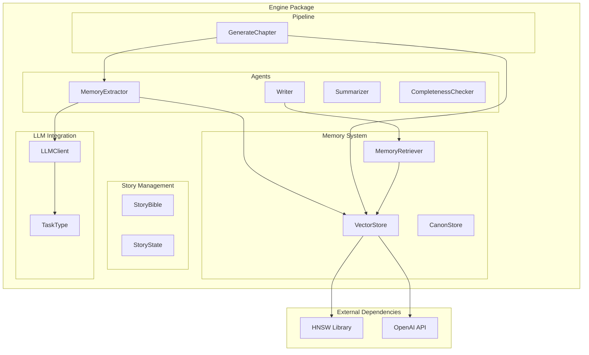
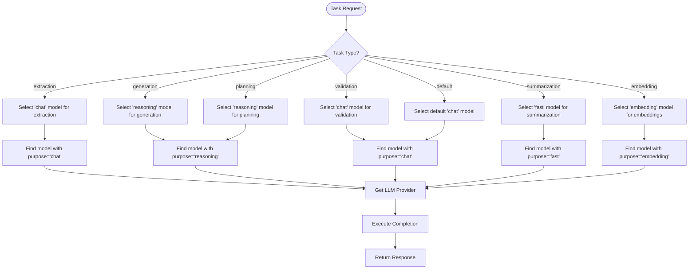
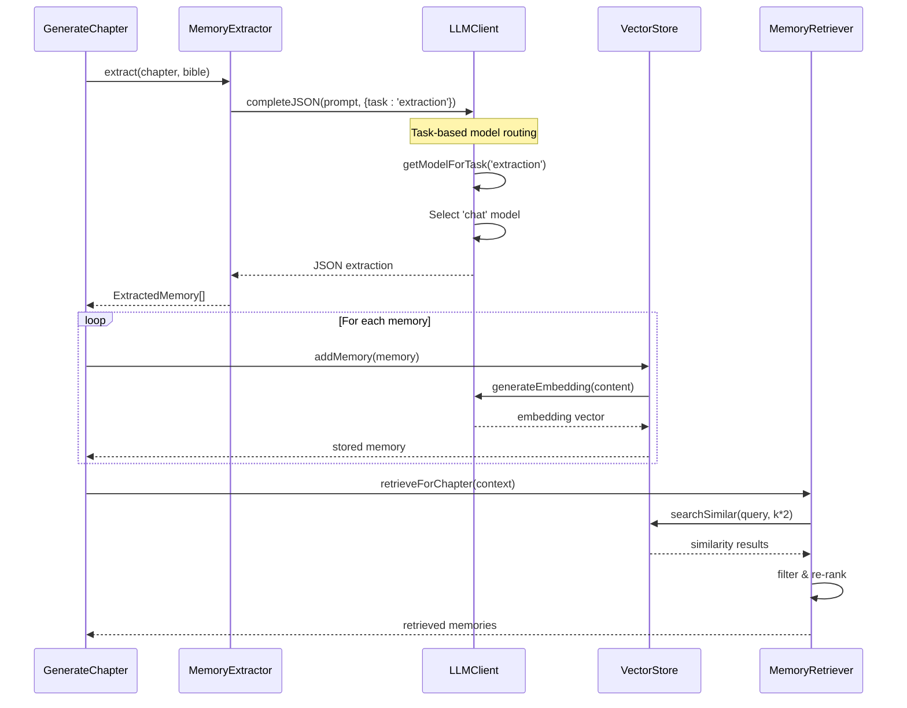
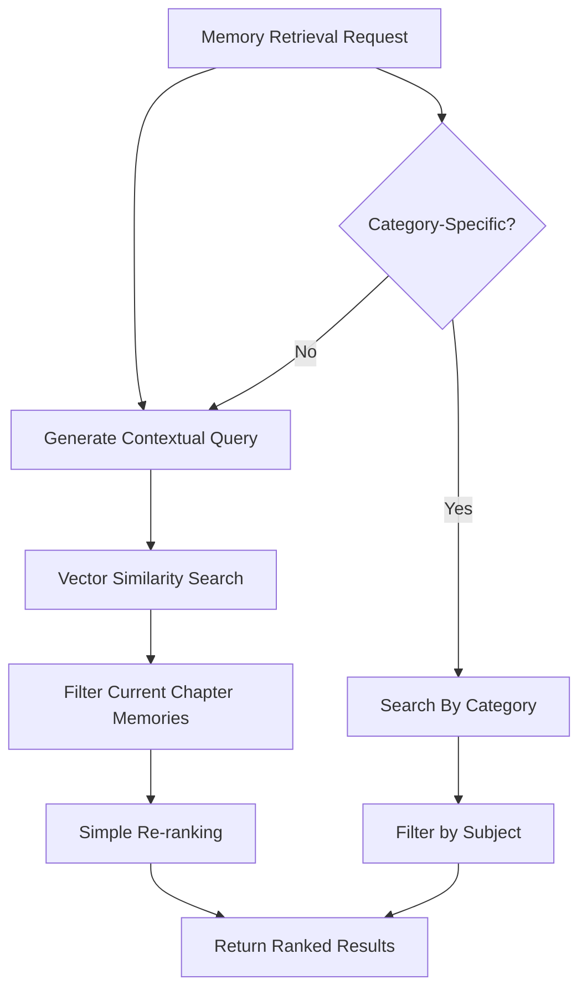
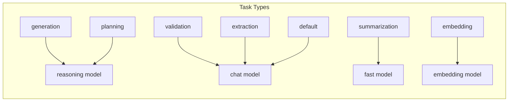
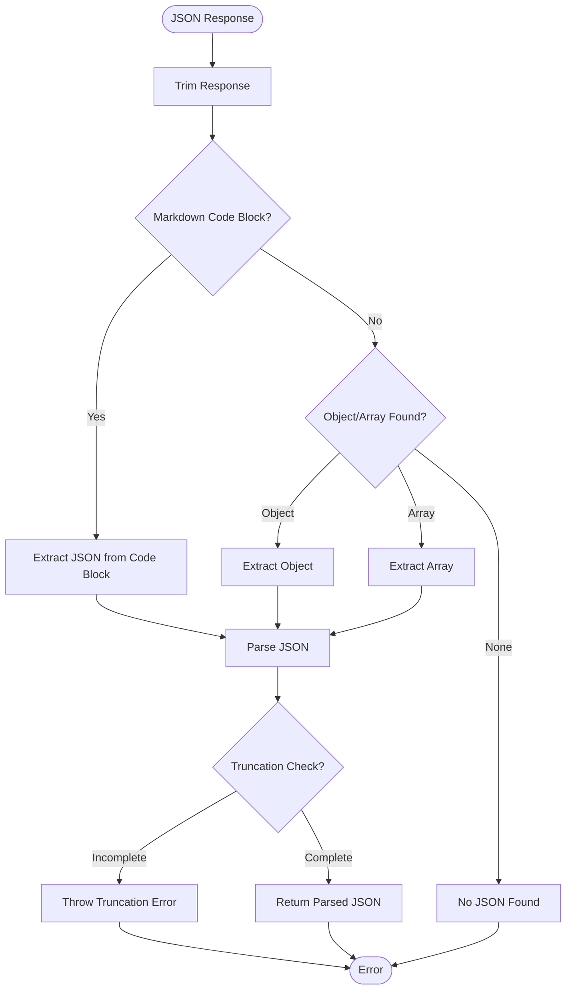
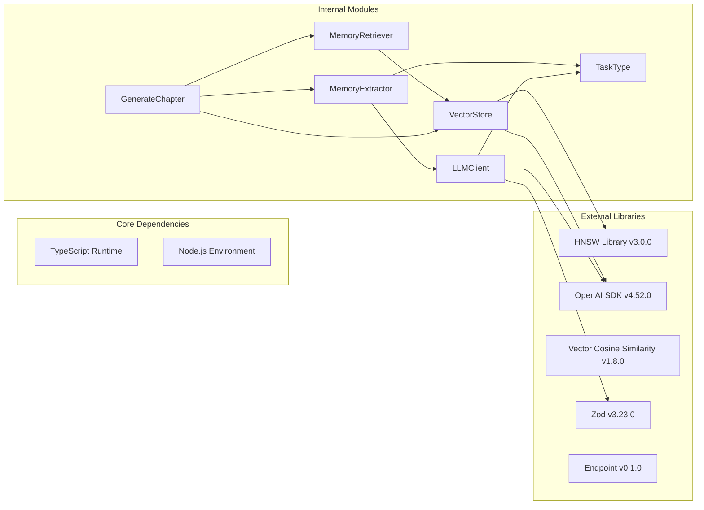

# Memory Extractor Agent

<cite>
**Referenced Files in This Document**
- [memoryExtractor.ts](file://packages/engine/src/agents/memoryExtractor.ts)
- [client.ts](file://packages/engine/src/llm/client.ts)
- [index.ts](file://packages/engine/src/types/index.ts)
- [vectorStore.ts](file://packages/engine/src/memory/vectorStore.ts)
- [memoryRetriever.ts](file://packages/engine/src/memory/memoryRetriever.ts)
- [generateChapter.ts](file://packages/engine/src/pipeline/generateChapter.ts)
- [index.ts](file://packages/engine/src/index.ts)
- [bible.ts](file://packages/engine/src/story/bible.ts)
- [state.ts](file://packages/engine/src/story/state.ts)
- [summarizer.ts](file://packages/engine/src/agents/summarizer.ts)
- [writer.ts](file://packages/engine/src/agents/writer.ts)
</cite>

## Update Summary
**Changes Made**
- Updated MemoryExtractor implementation section to reflect task-specific model selection
- Enhanced LLM Client architecture section to document the new task-based model routing
- Added new section on Task-Based Model Selection explaining the extraction task configuration
- Updated dependency analysis to include the new TaskType interface
- Revised performance considerations to account for optimized model selection
- Enhanced JSON parsing section to document truncation detection improvements

## Table of Contents
1. [Introduction](#introduction)
2. [Project Structure](#project-structure)
3. [Core Components](#core-components)
4. [Architecture Overview](#architecture-overview)
5. [Detailed Component Analysis](#detailed-component-analysis)
6. [Task-Based Model Selection](#task-based-model-selection)
7. [Enhanced JSON Parsing and Truncation Detection](#enhanced-json-parsing-and-truncation-detection)
8. [Dependency Analysis](#dependency-analysis)
9. [Performance Considerations](#performance-considerations)
10. [Troubleshooting Guide](#troubleshooting-guide)
11. [Conclusion](#conclusion)

## Introduction
The Memory Extractor Agent is a core component of the Narrative Operating System that automatically identifies and extracts narrative memories from generated chapters. It serves as the bridge between creative writing and persistent storytelling knowledge, enabling the system to maintain continuity, track character development, and preserve world-building details across the entire story arc.

The agent operates by analyzing chapter content and extracting structured facts categorized into four fundamental narrative types: events, character moments, world details, and plot developments. These extracted memories are then stored in a vector-based memory system that enables semantic search and retrieval for future writing contexts.

**Enhanced** The Memory Extractor now utilizes task-specific model selection, ensuring that memory extraction operations use chat models optimized for structured data extraction rather than default model configurations. The LLM client has been enhanced with improved JSON parsing that includes truncation detection to prevent incomplete response errors.

## Project Structure
The Memory Extractor Agent is part of a larger narrative generation ecosystem organized into distinct functional domains:



**Diagram sources**
- [memoryExtractor.ts:1-99](file://packages/engine/src/agents/memoryExtractor.ts#L1-L99)
- [client.ts:39-47](file://packages/engine/src/llm/client.ts#L39-L47)
- [index.ts:107-113](file://packages/engine/src/types/index.ts#L107-L113)

**Section sources**
- [index.ts:1-43](file://packages/engine/src/index.ts#L1-L43)
- [memoryExtractor.ts:1-99](file://packages/engine/src/agents/memoryExtractor.ts#L1-L99)

## Core Components

### MemoryExtractor Class
The MemoryExtractor is the primary component responsible for transforming unstructured narrative content into structured, searchable memories. It implements two extraction modes:

1. **Full Chapter Extraction**: Processes complete chapter content with intelligent content length limiting
2. **Summary Extraction**: Handles chapter summaries for efficiency in batch processing

The extraction process follows a systematic approach:
- Template-based prompt engineering with story context injection
- Structured JSON output parsing with validation
- Category assignment for semantic organization
- Temperature-controlled creativity vs. consistency
- **Task-specific model selection** for optimized extraction performance

**Enhanced** The MemoryExtractor now passes `task: 'extraction'` in its LLM configuration, ensuring that extraction operations use chat models optimized for structured data extraction rather than default model configurations.

### Enhanced LLM Client Architecture
The LLM Client now implements a sophisticated task-based model routing system:



**Diagram sources**
- [client.ts:39-47](file://packages/engine/src/llm/client.ts#L39-L47)
- [client.ts:152-164](file://packages/engine/src/llm/client.ts#L152-L164)

The task-based routing ensures that extraction operations use chat models optimized for structured data extraction, while other operations use models suited to their specific requirements.

### VectorStore System
The VectorStore provides persistent memory storage with advanced semantic search capabilities:
- Hierarchical Navigable Small World (HNSW) indexing for efficient similarity search
- Embedding generation using OpenAI's text-embedding-3-small model
- Multi-category memory organization (event, character, world, plot)
- Serialization support for persistence across sessions

### MemoryRetriever Integration
The MemoryRetriever enables contextual memory access:
- Chapter-specific memory filtering (excluding future chapters)
- Category-based retrieval for targeted content
- Re-ranking based on relevance scores
- Prompt formatting for seamless integration with writing agents

**Section sources**
- [memoryExtractor.ts:52-99](file://packages/engine/src/agents/memoryExtractor.ts#L52-L99)
- [client.ts:39-47](file://packages/engine/src/llm/client.ts#L39-L47)
- [vectorStore.ts:19-208](file://packages/engine/src/memory/vectorStore.ts#L19-L208)
- [memoryRetriever.ts:18-174](file://packages/engine/src/memory/memoryRetriever.ts#L18-L174)

## Architecture Overview



**Diagram sources**
- [generateChapter.ts:26-103](file://packages/engine/src/pipeline/generateChapter.ts#L26-L103)
- [memoryExtractor.ts:62-66](file://packages/engine/src/agents/memoryExtractor.ts#L62-L66)
- [client.ts:152-164](file://packages/engine/src/llm/client.ts#L152-L164)

The architecture demonstrates a clean separation of concerns with enhanced task-specific model selection:
- **Extraction Layer**: Converts narrative content to structured memories using optimized chat models
- **Storage Layer**: Provides persistent, searchable memory with embeddings
- **Retrieval Layer**: Enables contextual memory access for writing agents
- **Integration Layer**: Seamlessly connects all components in the generation pipeline

## Detailed Component Analysis

### MemoryExtractor Implementation

```mermaid
classDiagram
class MemoryExtractor {
+extract(chapter, bible) Promise~ExtractedMemory[]~
+extractFromSummary(chapterNumber, summary, bible) Promise~ExtractedMemory[]~
-EXTRACTION_PROMPT string
-buildPrompt(chapter, bible) string
-validateResponse(result) boolean
}
class LLMClient {
+complete(prompt, config) Promise~string~
+completeJSON(prompt, config) Promise~T~
+getModelForTask(task) ModelConfig
-provider LLMProvider
-defaultConfig LLMConfig
}
class ExtractedMemory {
+content string
+category NarrativeMemory~category~
}
class TaskType {
<<enumeration>>
generation
validation
summarization
extraction
planning
embedding
default
}
MemoryExtractor --> LLMClient : uses with task : 'extraction'
MemoryExtractor --> ExtractedMemory : produces
LLMClient --> TaskType : routes by task
```

**Diagram sources**
- [memoryExtractor.ts:52-99](file://packages/engine/src/agents/memoryExtractor.ts#L52-L99)
- [client.ts:152-164](file://packages/engine/src/llm/client.ts#L152-L164)
- [index.ts:107-115](file://packages/engine/src/types/index.ts#L107-L115)

The MemoryExtractor employs sophisticated prompt engineering techniques with enhanced task-specific model selection:
- **Context Injection**: Story Bible details (title, genre, setting) are embedded into prompts
- **Task Specification**: Clear extraction guidelines with specific categories and quantities
- **Output Control**: JSON-only responses with temperature optimization for consistency
- **Content Management**: Intelligent truncation to prevent token limit issues (limited to 8000 characters)
- **Model Optimization**: Automatic selection of chat models optimized for structured extraction
- **Enhanced Error Handling**: Improved JSON parsing with truncation detection for reliable extraction

### VectorStore Memory Management


**Diagram sources**
- [vectorStore.ts:125-148](file://packages/engine/src/memory/vectorStore.ts#L125-L148)
- [vectorStore.ts:90-133](file://packages/engine/src/memory/vectorStore.ts#L90-L133)

The VectorStore implements robust error handling and fallback mechanisms:
- **API Resilience**: Automatic fallback to mock embeddings when OpenAI API is unavailable
- **Index Persistence**: Complete serialization/deserialization for state restoration
- **Memory Organization**: Efficient chapter-based memory grouping
- **Search Optimization**: Configurable similarity thresholds and result limits

### Memory Retrieval Strategy



**Diagram sources**
- [memoryRetriever.ts:25-41](file://packages/engine/src/memory/memoryRetriever.ts#L25-L41)
- [memoryRetriever.ts:60-73](file://packages/engine/src/memory/memoryRetriever.ts#L60-L73)

The retrieval system prioritizes relevance and context:
- **Temporal Filtering**: Prevents access to future chapter memories
- **Category Targeting**: Enables specialized retrieval for characters, plots, or events
- **Relevance Scoring**: Uses vector similarity as the primary ranking metric
- **Prompt Formatting**: Converts retrieved memories into writer-friendly format

**Section sources**
- [memoryExtractor.ts:14-50](file://packages/engine/src/agents/memoryExtractor.ts#L14-L50)
- [client.ts:39-47](file://packages/engine/src/llm/client.ts#L39-L47)
- [vectorStore.ts:30-35](file://packages/engine/src/memory/vectorStore.ts#L30-L35)
- [memoryRetriever.ts:104-115](file://packages/engine/src/memory/memoryRetriever.ts#L104-L115)

## Task-Based Model Selection

The Memory Extractor now benefits from a sophisticated task-based model selection system that ensures optimal model usage for different operations:

### Task Type Configuration
The system defines seven distinct task types, each mapped to specific model purposes:



**Diagram sources**
- [client.ts:39-47](file://packages/engine/src/llm/client.ts#L39-L47)

### Model Purpose Mapping
Each task type is associated with a specific model purpose:
- **generation**: Complex creative writing requiring reasoning capabilities
- **planning**: Scene/chapter planning with logical reasoning
- **validation**: Canon validation using chat models
- **summarization**: Fast text processing for chapter summaries
- **extraction**: Structured data extraction using optimized chat models
- **embedding**: Text embeddings using embedding models
- **default**: Fallback to chat models

### Implementation Details
The task-based selection occurs in the `getModelForTask` method:
1. **Task Resolution**: Determines the appropriate model purpose based on the task type
2. **Model Matching**: Searches through configured models to find one with matching purpose
3. **Fallback Handling**: Falls back to default model if no matching purpose is found
4. **Provider Selection**: Returns the corresponding LLM provider for the selected model

**Section sources**
- [client.ts:39-47](file://packages/engine/src/llm/client.ts#L39-L47)
- [client.ts:152-164](file://packages/engine/src/llm/client.ts#L152-L164)
- [index.ts:107-115](file://packages/engine/src/types/index.ts#L107-L115)

## Enhanced JSON Parsing and Truncation Detection

The LLM Client's JSON parsing has been significantly enhanced with robust truncation detection to prevent incomplete response errors:

### JSON Parsing Improvements
The `completeJSON` method now includes sophisticated parsing logic:



**Diagram sources**
- [client.ts:188-227](file://packages/engine/src/llm/client.ts#L188-L227)

### Truncation Detection Features
The enhanced JSON parsing includes:
- **Markdown Code Block Detection**: Automatically extracts JSON from ```json blocks
- **Brace Matching**: Finds and extracts JSON objects/arrays by matching braces
- **Truncation Prevention**: Detects incomplete JSON responses and throws descriptive errors
- **Token Limit Handling**: Prevents errors when responses are cut off mid-JSON

### MemoryExtractor Integration
The MemoryExtractor now benefits from these improvements:
- **Reliable Extraction**: JSON parsing errors are minimized with robust truncation detection
- **Consistent Output**: Structured extraction results are more reliable
- **Better Error Messages**: Descriptive errors help diagnose extraction issues

**Section sources**
- [client.ts:188-227](file://packages/engine/src/llm/client.ts#L188-L227)
- [memoryExtractor.ts:62-66](file://packages/engine/src/agents/memoryExtractor.ts#L62-L66)

## Dependency Analysis



**Diagram sources**
- [package.json:11-16](file://packages/engine/package.json#L11-L16)
- [memoryExtractor.ts:1-3](file://packages/engine/src/agents/memoryExtractor.ts#L1-L3)
- [client.ts:1-2](file://packages/engine/src/llm/client.ts#L1-L2)
- [index.ts:107-115](file://packages/engine/src/types/index.ts#L107-L115)

The dependency structure reveals a modular architecture with clear boundaries and enhanced task-based routing:
- **Storage Dependencies**: HNSW library for efficient vector indexing
- **LLM Dependencies**: OpenAI SDK for embeddings and completion services
- **Validation Dependencies**: Zod for runtime type safety
- **Task Dependencies**: TaskType enumeration for model routing
- **Internal Coupling**: Minimal cross-module dependencies for maintainability

**Section sources**
- [package.json:1-22](file://packages/engine/package.json#L1-L22)
- [index.ts:1-43](file://packages/engine/src/index.ts#L1-L43)

## Performance Considerations

### Memory Extraction Efficiency
The MemoryExtractor optimizes for both quality and performance with enhanced model selection:
- **Content Truncation**: Limits chapter content to 8000 characters to prevent token overflow
- **Temperature Control**: Maintains temperature 0.3 for consistent, factual extraction
- **Batch Processing**: Supports summary-based extraction for improved throughput
- **JSON Validation**: Built-in response parsing reduces downstream errors
- **Task-Specific Models**: Uses optimized chat models for structured extraction operations
- **Enhanced Error Handling**: Robust JSON parsing prevents extraction failures

### Enhanced Model Selection Performance
The task-based model selection system provides several performance benefits:
- **Optimized Model Choice**: Ensures extraction operations use models specifically tuned for structured data
- **Reduced Token Usage**: Chat models optimized for extraction typically use fewer tokens than general-purpose models
- **Faster Response Times**: Purpose-specific models respond more efficiently to extraction prompts
- **Improved Accuracy**: Specialized models produce more accurate structured extraction results

### Vector Storage Optimization
The VectorStore implements several performance enhancements:
- **Dimension Management**: Fixed 1536-dimensional embeddings for optimal balance
- **Index Initialization**: Configurable index parameters for different scale requirements
- **Memory Mapping**: Efficient ID-to-memory mapping for fast retrieval
- **Embedding Caching**: Reuse of embeddings across operations

### Retrieval Performance
Memory retrieval achieves optimal performance through:
- **Hierarchical Indexing**: HNSW provides logarithmic search complexity
- **Early Filtering**: Temporal and categorical filters reduce result sets
- **Configurable K-values**: Adjustable similarity thresholds balance precision and recall
- **Minimal API Calls**: Batch operations and local caching reduce external dependencies

## Troubleshooting Guide

### Common Issues and Solutions

**Memory Extraction Failures**
- **Symptom**: JSON parsing errors during extraction
- **Cause**: LLM response format inconsistencies or truncation
- **Solution**: Verify prompt template integrity and adjust temperature settings
- **Updated**: Ensure task: 'extraction' parameter is properly passed to maintain model optimization
- **Enhanced**: The improved JSON parsing now detects and reports truncation issues more effectively

**Vector Store Initialization Errors**
- **Symptom**: "VectorStore not initialized" errors
- **Cause**: Missing initialization call before memory operations
- **Solution**: Ensure `await vectorStore.initialize()` is called before use

**Embedding API Failures**
- **Symptom**: OpenAI API rate limits or service unavailability
- **Cause**: External service dependency failures
- **Solution**: Enable mock embeddings via environment variable for testing

**Memory Retrieval Performance Issues**
- **Symptom**: Slow memory search operations
- **Cause**: Large index sizes or insufficient memory allocation
- **Solution**: Optimize HNSW parameters and consider index rebuilding

**Task-Based Model Selection Issues**
- **Symptom**: Extraction operations not using optimized models
- **Cause**: Missing or incorrect task parameter configuration
- **Solution**: Verify that `task: 'extraction'` is included in LLM configuration for memory extraction operations

**JSON Truncation Errors**
- **Symptom**: "JSON response appears to be truncated" errors
- **Cause**: Response cut off mid-JSON or insufficient maxTokens
- **Solution**: Increase maxTokens parameter in extraction configuration
- **Enhanced**: The new truncation detection provides more descriptive error messages

**Section sources**
- [memoryExtractor.ts:62-68](file://packages/engine/src/agents/memoryExtractor.ts#L62-L68)
- [client.ts:152-164](file://packages/engine/src/llm/client.ts#L152-L164)
- [client.ts:214-220](file://packages/engine/src/llm/client.ts#L214-L220)
- [vectorStore.ts:38-40](file://packages/engine/src/memory/vectorStore.ts#L38-L40)
- [vectorStore.ts:102-113](file://packages/engine/src/memory/vectorStore.ts#L102-L113)

## Conclusion

The Memory Extractor Agent represents a sophisticated solution for automated narrative knowledge management. Its integration with the broader Narrative Operating System creates a self-improving storytelling engine capable of maintaining consistency, tracking development, and preserving creative insights across extended narratives.

**Enhanced** The recent addition of task-specific model selection significantly improves the agent's performance and accuracy by ensuring that memory extraction operations use chat models optimized for structured data extraction. The enhanced JSON parsing with truncation detection provides more reliable extraction results, while the improved error handling makes debugging easier. These enhancements maintain the agent's balanced approach to creativity and consistency while leveraging specialized models for improved extraction quality.

The agent's strength lies in its intelligent model selection, sophisticated prompt engineering, and seamless integration with the broader narrative ecosystem. The combination of semantic memory storage, intelligent retrieval, and task-optimized extraction establishes a foundation for scalable, high-quality automated storytelling.

Future enhancements could include advanced memory reasoning, cross-story knowledge transfer, adaptive extraction strategies based on narrative complexity and genre requirements, and dynamic model selection based on extraction quality metrics.