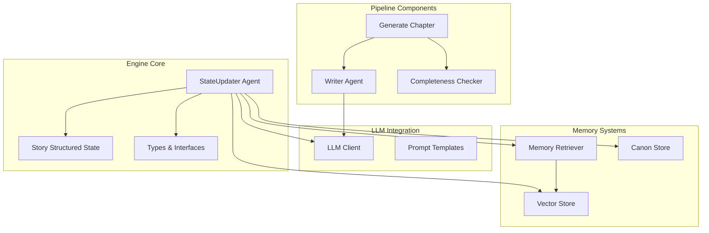
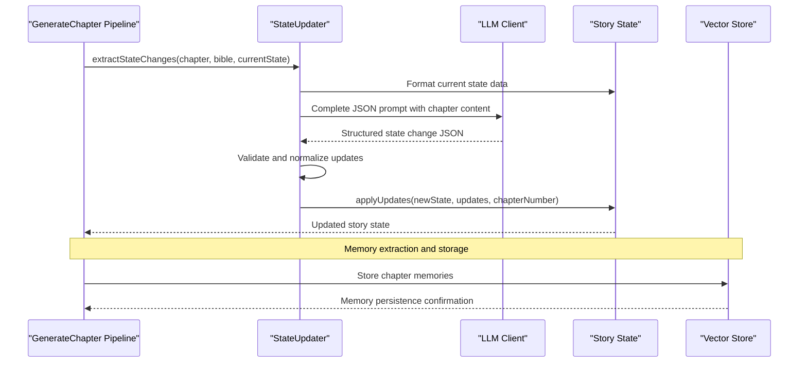
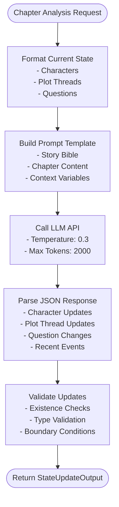
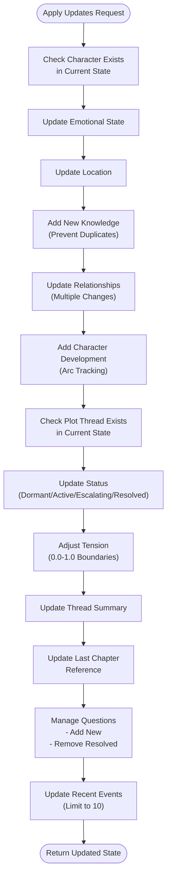
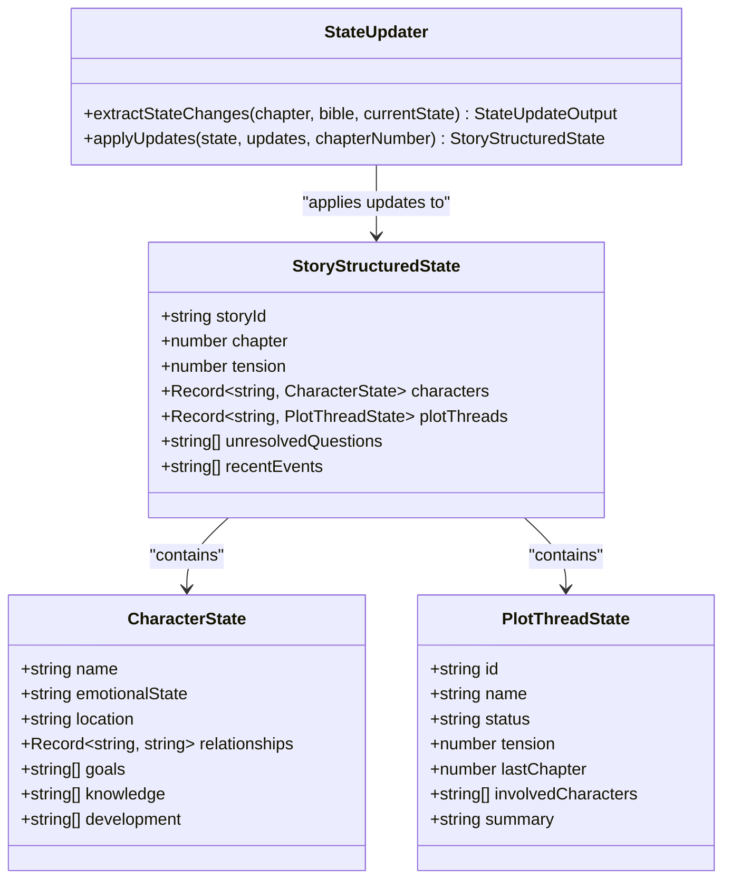
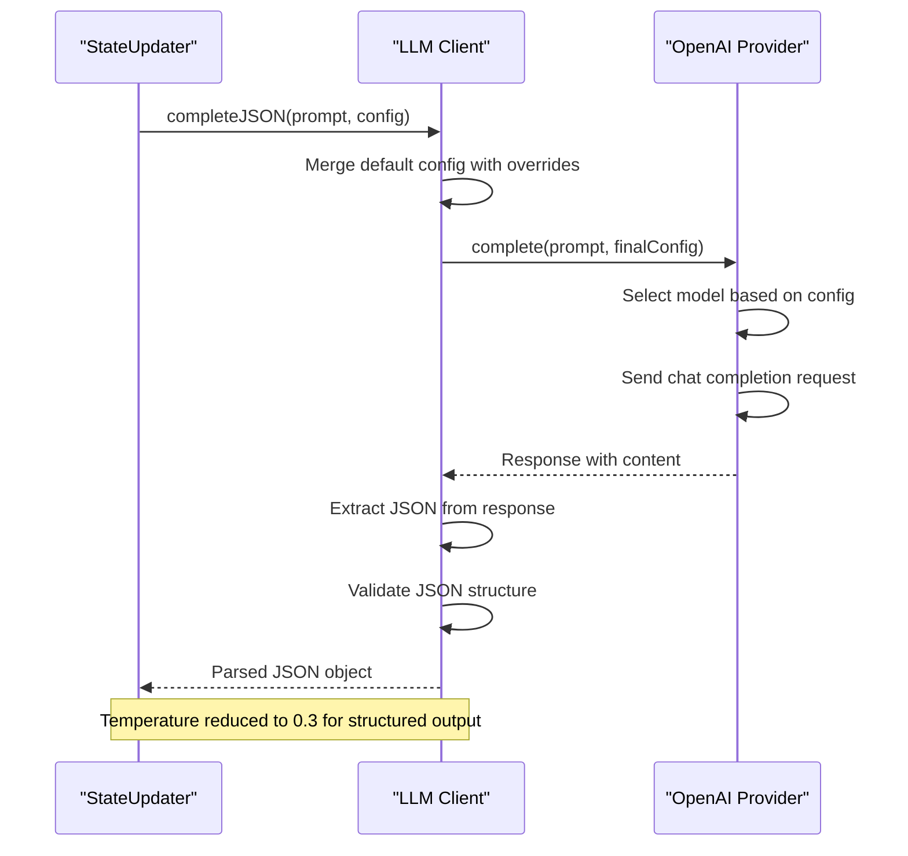
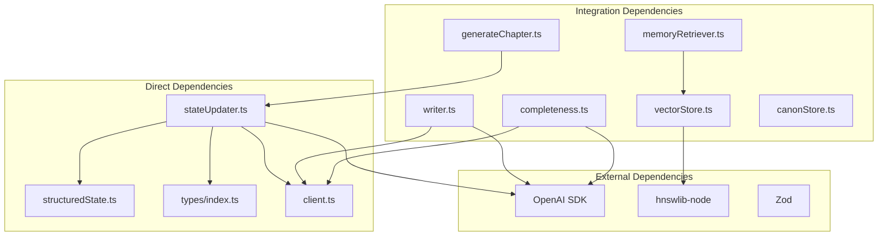

# StateUpdater Agent

<cite>
**Referenced Files in This Document**
- [stateUpdater.ts](file://packages/engine/src/agents/stateUpdater.ts)
- [structuredState.ts](file://packages/engine/src/story/structuredState.ts)
- [types/index.ts](file://packages/engine/src/types/index.ts)
- [client.ts](file://packages/engine/src/llm/client.ts)
- [generateChapter.ts](file://packages/engine/src/pipeline/generateChapter.ts)
- [writer.ts](file://packages/engine/src/agents/writer.ts)
- [completeness.ts](file://packages/engine/src/agents/completeness.ts)
- [memoryRetriever.ts](file://packages/engine/src/memory/memoryRetriever.ts)
- [vectorStore.ts](file://packages/engine/src/memory/vectorStore.ts)
- [canonStore.ts](file://packages/engine/src/memory/canonStore.ts)
- [worldState.ts](file://packages/engine/src/world/worldState.ts)
- [index.ts](file://packages/engine/src/index.ts)
</cite>

## Table of Contents
1. [Introduction](#introduction)
2. [Project Structure](#project-structure)
3. [Core Components](#core-components)
4. [Architecture Overview](#architecture-overview)
5. [Detailed Component Analysis](#detailed-component-analysis)
6. [Dependency Analysis](#dependency-analysis)
7. [Performance Considerations](#performance-considerations)
8. [Troubleshooting Guide](#troubleshooting-guide)
9. [Conclusion](#conclusion)

## Introduction
The StateUpdater Agent is a core component of the Narrative Operating System that analyzes chapters and extracts meaningful state changes to maintain coherent storytelling. It serves as the narrative state tracker that transforms raw chapter content into structured updates for characters, plot threads, questions, and recent events.

The agent operates by analyzing chapter content against the story's current state and extracting changes in character emotional states, locations, knowledge, relationships, and plot thread progression. It maintains narrative consistency while enabling dynamic story evolution.

## Project Structure
The StateUpdater Agent is part of the broader Narrative Operating System engine, organized into several key subsystems:

**Diagram sources**
- [stateUpdater.ts](file://packages/engine/src/agents/stateUpdater.ts#L85-L193)
- [structuredState.ts](file://packages/engine/src/story/structuredState.ts#L23-L31)
- [client.ts](file://packages/engine/src/llm/client.ts#L38-L120)

**Section sources**
- [index.ts](file://packages/engine/src/index.ts#L1-L91)

## Core Components

### StateUpdater Class
The StateUpdater is the primary component responsible for analyzing chapters and extracting state changes. It implements two main methods:

- `extractStateChanges()`: Analyzes chapter content using LLM prompting to identify narrative changes
- `applyUpdates()`: Applies extracted changes to the current story state

### StateUpdateOutput Interface
Defines the structured output format containing:
- Character updates with emotional states, locations, knowledge, and relationship changes
- Plot thread updates with status changes and tension modifications
- New and resolved questions
- Recent events summary

### Story Structured State
Maintains the narrative state with:
- Character states including emotional states, locations, relationships, and knowledge
- Plot thread states with tension levels and progression
- Unresolved questions and recent events tracking

**Section sources**
- [stateUpdater.ts](file://packages/engine/src/agents/stateUpdater.ts#L5-L23)
- [structuredState.ts](file://packages/engine/src/story/structuredState.ts#L3-L31)

## Architecture Overview

The StateUpdater Agent integrates with the broader Narrative Operating System through a well-defined architecture:

**Diagram sources**
- [generateChapter.ts](file://packages/engine/src/pipeline/generateChapter.ts#L26-L103)
- [stateUpdater.ts](file://packages/engine/src/agents/stateUpdater.ts#L85-L193)
- [client.ts](file://packages/engine/src/llm/client.ts#L85-L109)

The architecture follows a pipeline pattern where the StateUpdater Agent receives processed chapters from the generation pipeline and applies structured updates to maintain narrative coherence.

## Detailed Component Analysis

### StateUpdater Implementation

#### Extraction Phase
The extraction phase transforms unstructured chapter content into structured state changes:

**Diagram sources**
- [stateUpdater.ts](file://packages/engine/src/agents/stateUpdater.ts#L85-L119)

#### Application Phase
The application phase safely applies validated updates to the story state:

**Diagram sources**
- [stateUpdater.ts](file://packages/engine/src/agents/stateUpdater.ts#L121-L189)

**Section sources**
- [stateUpdater.ts](file://packages/engine/src/agents/stateUpdater.ts#L85-L193)

### Integration with Story State Management

The StateUpdater seamlessly integrates with the structured state management system:

**Diagram sources**
- [stateUpdater.ts](file://packages/engine/src/agents/stateUpdater.ts#L85-L193)
- [structuredState.ts](file://packages/engine/src/story/structuredState.ts#L23-L31)

**Section sources**
- [structuredState.ts](file://packages/engine/src/story/structuredState.ts#L1-L235)

### LLM Integration Pattern

The StateUpdater leverages a sophisticated LLM integration pattern:

**Diagram sources**
- [client.ts](file://packages/engine/src/llm/client.ts#L85-L109)
- [stateUpdater.ts](file://packages/engine/src/agents/stateUpdater.ts#L113-L116)

**Section sources**
- [client.ts](file://packages/engine/src/llm/client.ts#L38-L120)

## Dependency Analysis

The StateUpdater Agent has carefully managed dependencies that support its core functionality:

**Diagram sources**
- [stateUpdater.ts](file://packages/engine/src/agents/stateUpdater.ts#L1-L4)
- [generateChapter.ts](file://packages/engine/src/pipeline/generateChapter.ts#L1-L10)
- [vectorStore.ts](file://packages/engine/src/memory/vectorStore.ts#L1-L3)

The dependency graph reveals a clean separation of concerns where the StateUpdater focuses on state management while delegating LLM operations to the client module and integration concerns to the pipeline components.

**Section sources**
- [index.ts](file://packages/engine/src/index.ts#L1-L91)

## Performance Considerations

### Memory Management
The StateUpdater implements efficient state management patterns:

- **Immutable Updates**: Creates new state objects rather than mutating existing ones
- **Selective Updates**: Only applies changes that exist in the current state
- **Boundary Checking**: Validates numeric ranges for tension values (0.0-1.0)
- **Array Limiting**: Caps recent events to 10 entries to prevent memory bloat

### LLM Efficiency
The agent optimizes LLM usage through:

- **Temperature Control**: Uses 0.3 temperature for structured JSON responses
- **Token Limits**: Restricts chapter content to 6000 characters to manage costs
- **Prompt Optimization**: Dynamically builds prompts with only relevant context

### Processing Pipeline
The integration with the generation pipeline ensures efficient processing:

- **Batch Operations**: Processes multiple updates in single apply operation
- **Early Termination**: Validates updates before applying to reduce errors
- **Incremental Learning**: Builds upon previous chapter content for context

## Troubleshooting Guide

### Common Issues and Solutions

#### LLM Response Parsing Failures
**Problem**: JSON parsing errors from LLM responses
**Solution**: The LLM client includes robust error handling with markdown code block extraction and JSON validation

#### State Consistency Issues
**Problem**: Attempting to update non-existent characters or plot threads
**Solution**: The StateUpdater performs existence checks before applying updates

#### Memory Management Problems
**Problem**: Excessive memory usage from accumulated state
**Solution**: Built-in limits on recent events (10 items) and duplicate prevention in knowledge updates

#### Integration Challenges
**Problem**: Vector store initialization errors
**Solution**: Ensure proper initialization before memory operations and handle mock embedding fallbacks

**Section sources**
- [stateUpdater.ts](file://packages/engine/src/agents/stateUpdater.ts#L121-L189)
- [client.ts](file://packages/engine/src/llm/client.ts#L90-L109)

## Conclusion

The StateUpdater Agent represents a sophisticated approach to narrative state management in AI-powered storytelling systems. Its design emphasizes:

- **Narrative Coherence**: Maintains logical consistency across character and plot developments
- **Scalable Architecture**: Integrates cleanly with the broader Narrative Operating System ecosystem
- **Performance Optimization**: Implements efficient state management and LLM usage patterns
- **Robust Error Handling**: Provides comprehensive validation and fallback mechanisms

The agent successfully bridges the gap between unstructured chapter content and structured narrative state, enabling dynamic story evolution while maintaining coherence and consistency. Its modular design allows for easy extension and customization as the system evolves.

Through careful attention to state management, LLM integration patterns, and performance considerations, the StateUpdater Agent provides a solid foundation for advanced narrative generation capabilities within the Narrative Operating System framework.