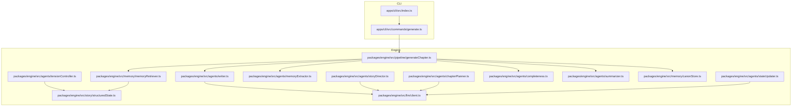
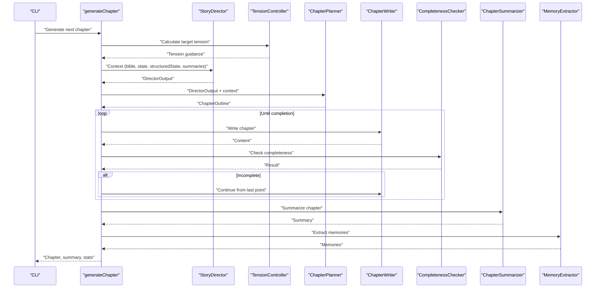
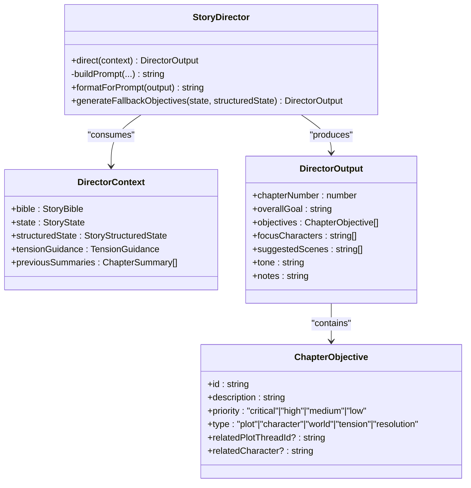
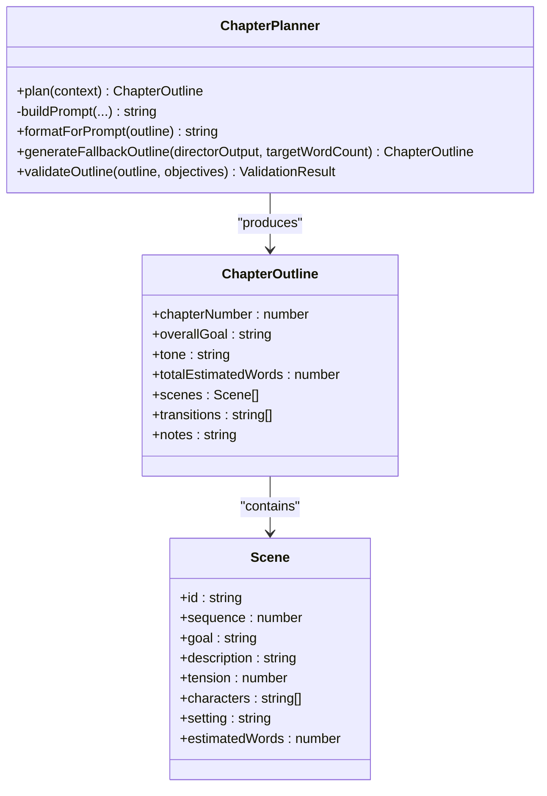
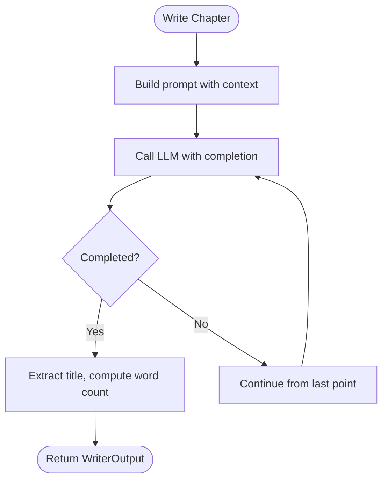
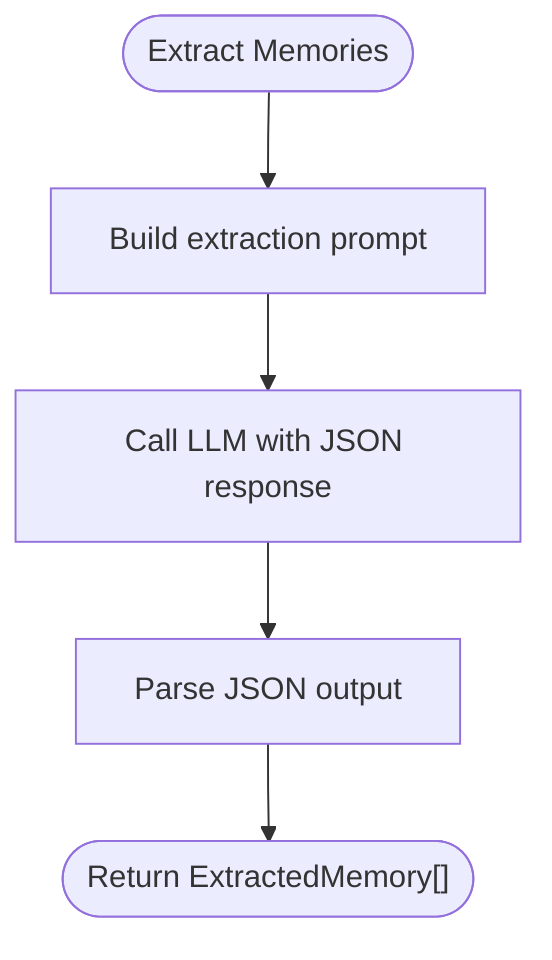
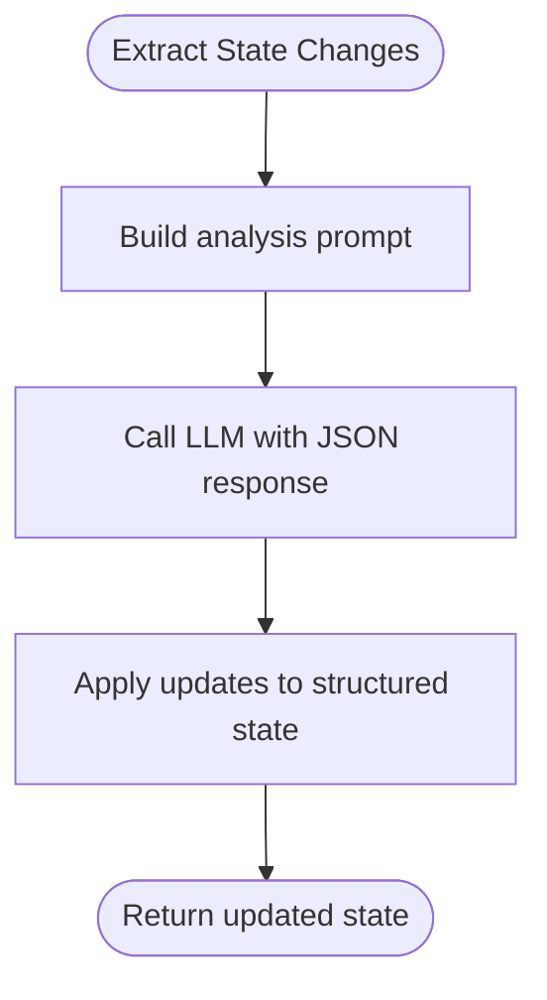
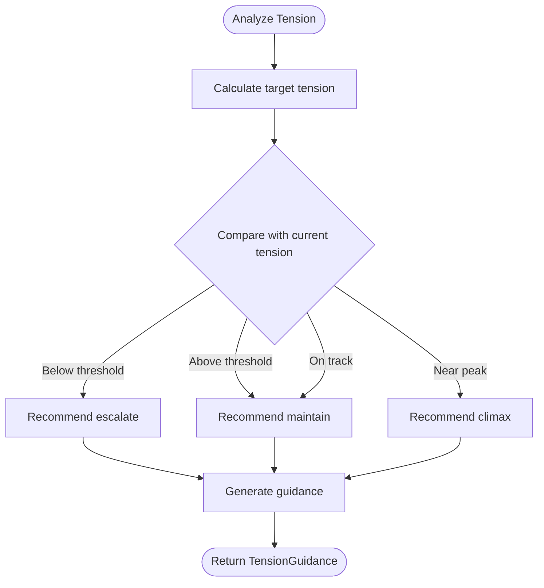
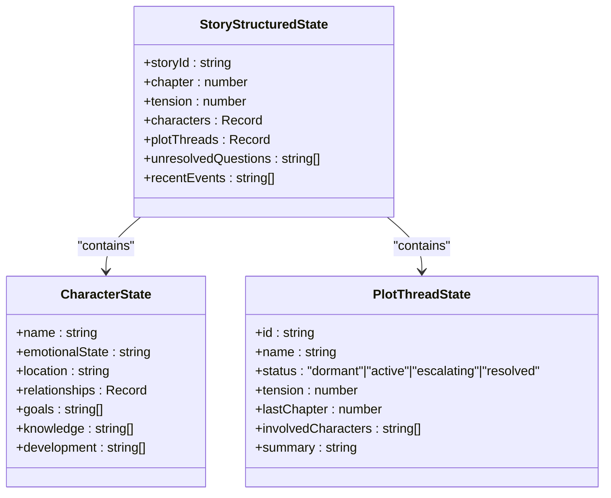
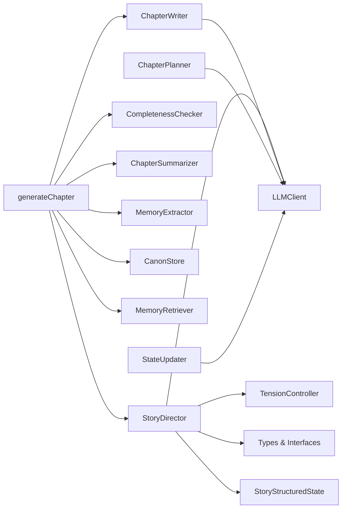

# StoryDirector Agent

<cite>
**Referenced Files in This Document**
- [storyDirector.ts](file://packages/engine/src/agents/storyDirector.ts)
- [chapterPlanner.ts](file://packages/engine/src/agents/chapterPlanner.ts)
- [writer.ts](file://packages/engine/src/agents/writer.ts)
- [memoryExtractor.ts](file://packages/engine/src/agents/memoryExtractor.ts)
- [stateUpdater.ts](file://packages/engine/src/agents/stateUpdater.ts)
- [tensionController.ts](file://packages/engine/src/agents/tensionController.ts)
- [completeness.ts](file://packages/engine/src/agents/completeness.ts)
- [summarizer.ts](file://packages/engine/src/agents/summarizer.ts)
- [generateChapter.ts](file://packages/engine/src/pipeline/generateChapter.ts)
- [types/index.ts](file://packages/engine/src/types/index.ts)
- [structuredState.ts](file://packages/engine/src/story/structuredState.ts)
- [canonStore.ts](file://packages/engine/src/memory/canonStore.ts)
- [memoryRetriever.ts](file://packages/engine/src/memory/memoryRetriever.ts)
- [client.ts](file://packages/engine/src/llm/client.ts)
- [generate.ts](file://apps/cli/src/commands/generate.ts)
- [index.ts](file://apps/cli/src/index.ts)
- [worldState.ts](file://packages/engine/src/world/worldState.ts)
</cite>

## Table of Contents
1. [Introduction](#introduction)
2. [Project Structure](#project-structure)
3. [Core Components](#core-components)
4. [Architecture Overview](#architecture-overview)
5. [Detailed Component Analysis](#detailed-component-analysis)
6. [Dependency Analysis](#dependency-analysis)
7. [Performance Considerations](#performance-considerations)
8. [Troubleshooting Guide](#troubleshooting-guide)
9. [Conclusion](#conclusion)

## Introduction
This document describes the StoryDirector Agent ecosystem within the Narrative Operating System. The StoryDirector orchestrates chapter-level narrative creation by synthesizing story context, tension dynamics, and character/plot states into actionable directives for the writing pipeline. It collaborates with supporting agents for planning, writing, memory extraction, state tracking, and quality assurance to produce coherent, tension-aligned chapters that evolve the story according to a natural dramatic arc.

## Project Structure
The system is organized into modular packages:
- Engine: Core narrative agents, story state management, memory systems, and generation pipeline
- CLI: Command-line interface for story lifecycle management
- World simulation: Optional world state management for richer narrative environments



**Diagram sources**
- [index.ts](file://apps/cli/src/index.ts#L1-L54)
- [generate.ts](file://apps/cli/src/commands/generate.ts#L1-L70)
- [generateChapter.ts](file://packages/engine/src/pipeline/generateChapter.ts#L1-L108)
- [storyDirector.ts](file://packages/engine/src/agents/storyDirector.ts#L1-L276)
- [chapterPlanner.ts](file://packages/engine/src/agents/chapterPlanner.ts#L1-L326)
- [writer.ts](file://packages/engine/src/agents/writer.ts#L1-L164)
- [memoryExtractor.ts](file://packages/engine/src/agents/memoryExtractor.ts#L1-L97)
- [stateUpdater.ts](file://packages/engine/src/agents/stateUpdater.ts#L1-L193)
- [tensionController.ts](file://packages/engine/src/agents/tensionController.ts#L1-L252)
- [completeness.ts](file://packages/engine/src/agents/completeness.ts#L1-L56)
- [summarizer.ts](file://packages/engine/src/agents/summarizer.ts#L1-L64)
- [structuredState.ts](file://packages/engine/src/story/structuredState.ts#L1-L235)
- [canonStore.ts](file://packages/engine/src/memory/canonStore.ts#L1-L134)
- [memoryRetriever.ts](file://packages/engine/src/memory/memoryRetriever.ts#L1-L174)
- [client.ts](file://packages/engine/src/llm/client.ts#L1-L120)

**Section sources**
- [index.ts](file://apps/cli/src/index.ts#L1-L54)
- [generate.ts](file://apps/cli/src/commands/generate.ts#L1-L70)
- [generateChapter.ts](file://packages/engine/src/pipeline/generateChapter.ts#L1-L108)

## Core Components
- StoryDirector: Generates chapter-level objectives, focus characters, suggested scenes, and tone based on story context and tension guidance.
- ChapterPlanner: Converts objectives into a detailed scene-by-scene outline with tension progression and estimated word counts.
- ChapterWriter: Produces polished prose aligned with story context, canon, and memory.
- MemoryExtractor: Extracts narrative facts from chapters for persistent storage.
- StateUpdater: Tracks and applies state changes across characters, plot threads, questions, and recent events.
- TensionController: Computes target tension using a parabolic curve and provides guidance for escalation, maintenance, climax, or resolution.
- CompletenessChecker: Ensures chapters end at natural stopping points.
- ChapterSummarizer: Creates concise chapter summaries for historical context.
- Generation Pipeline: Orchestrates writing, validation, summarization, and memory extraction.

**Section sources**
- [storyDirector.ts](file://packages/engine/src/agents/storyDirector.ts#L1-L276)
- [chapterPlanner.ts](file://packages/engine/src/agents/chapterPlanner.ts#L1-L326)
- [writer.ts](file://packages/engine/src/agents/writer.ts#L1-L164)
- [memoryExtractor.ts](file://packages/engine/src/agents/memoryExtractor.ts#L1-L97)
- [stateUpdater.ts](file://packages/engine/src/agents/stateUpdater.ts#L1-L193)
- [tensionController.ts](file://packages/engine/src/agents/tensionController.ts#L1-L252)
- [completeness.ts](file://packages/engine/src/agents/completeness.ts#L1-L56)
- [summarizer.ts](file://packages/engine/src/agents/summarizer.ts#L1-L64)
- [generateChapter.ts](file://packages/engine/src/pipeline/generateChapter.ts#L1-L108)

## Architecture Overview
The StoryDirector Agent operates as the narrative architect, coordinating tension-aware direction with detailed scene planning and authoring. The pipeline ensures quality through completion checks, optional canon validation, summarization, and memory persistence.



**Diagram sources**
- [generateChapter.ts](file://packages/engine/src/pipeline/generateChapter.ts#L26-L103)
- [storyDirector.ts](file://packages/engine/src/agents/storyDirector.ts#L100-L173)
- [chapterPlanner.ts](file://packages/engine/src/agents/chapterPlanner.ts#L110-L175)
- [writer.ts](file://packages/engine/src/agents/writer.ts#L61-L112)
- [completeness.ts](file://packages/engine/src/agents/completeness.ts#L37-L52)
- [summarizer.ts](file://packages/engine/src/agents/summarizer.ts#L24-L38)
- [memoryExtractor.ts](file://packages/engine/src/agents/memoryExtractor.ts#L53-L68)
- [tensionController.ts](file://packages/engine/src/agents/tensionController.ts#L214-L249)

## Detailed Component Analysis

### StoryDirector Agent
The StoryDirector synthesizes story context and tension guidance into a structured directive for the next chapter. It builds a comprehensive prompt from the Story Bible, current story state, active plot threads, character states, unresolved questions, recent events, and recent chapter summaries. It returns a JSON object containing chapter number, overall goal, prioritized objectives, focus characters, suggested scenes, tone, and notes.



**Diagram sources**
- [storyDirector.ts](file://packages/engine/src/agents/storyDirector.ts#L6-L31)
- [storyDirector.ts](file://packages/engine/src/agents/storyDirector.ts#L100-L273)

**Section sources**
- [storyDirector.ts](file://packages/engine/src/agents/storyDirector.ts#L100-L273)

### ChapterPlanner Agent
The ChapterPlanner transforms the StoryDirector's output into a detailed scene-by-scene outline. It constructs a prompt incorporating story context, objectives, focus characters, suggested scenes, and current story state, then produces a JSON structure with scenes, transitions, and notes. It also provides a fallback planner for deterministic outlines.



**Diagram sources**
- [chapterPlanner.ts](file://packages/engine/src/agents/chapterPlanner.ts#L17-L33)
- [chapterPlanner.ts](file://packages/engine/src/agents/chapterPlanner.ts#L110-L323)

**Section sources**
- [chapterPlanner.ts](file://packages/engine/src/agents/chapterPlanner.ts#L110-L323)

### ChapterWriter Agent
The ChapterWriter composes prose aligned with the story Bible, character profiles, relevant memories, recent summaries, and chapter goals. It supports continuation for incomplete chapters and infers chapter goals based on narrative arc progression.



**Diagram sources**
- [writer.ts](file://packages/engine/src/agents/writer.ts#L61-L112)

**Section sources**
- [writer.ts](file://packages/engine/src/agents/writer.ts#L61-L164)

### MemoryExtractor Agent
The MemoryExtractor identifies key narrative facts from chapters and summaries, categorizing them as events, characters, world details, or plot developments. It limits input content length and returns structured memories for persistence.



**Diagram sources**
- [memoryExtractor.ts](file://packages/engine/src/agents/memoryExtractor.ts#L53-L93)

**Section sources**
- [memoryExtractor.ts](file://packages/engine/src/agents/memoryExtractor.ts#L53-L97)

### StateUpdater Agent
The StateUpdater analyzes chapter content to update character states, plot thread statuses and tensions, unresolved questions, and recent events. It applies updates to the structured state and maintains narrative continuity.



**Diagram sources**
- [stateUpdater.ts](file://packages/engine/src/agents/stateUpdater.ts#L86-L189)

**Section sources**
- [stateUpdater.ts](file://packages/engine/src/agents/stateUpdater.ts#L86-L193)

### TensionController
The TensionController computes target tension using a parabolic curve based on chapter position and generates guidance for escalation, maintenance, climax, or resolution. It also estimates tension from chapter content heuristically.



**Diagram sources**
- [tensionController.ts](file://packages/engine/src/agents/tensionController.ts#L28-L149)

**Section sources**
- [tensionController.ts](file://packages/engine/src/agents/tensionController.ts#L28-L252)

### Generation Pipeline
The pipeline coordinates the entire chapter generation process: writing, completion checking, optional canon validation, summarization, and memory extraction. It manages memory retrieval and persistence, returning structured results for downstream use.

```mermaid
sequenceDiagram
participant Gen as "generateChapter"
participant WR as "ChapterWriter"
participant CC as "CompletenessChecker"
participant CV as "CanonValidator"
participant SM as "ChapterSummarizer"
participant ME as "MemoryExtractor"
participant VS as "VectorStore"
Gen->>WR : "Write chapter"
loop While incomplete
Gen->>CC : "Check completion"
alt Incomplete
Gen->>WR : "Continue"
end
end
Gen->>CV : "Validate canon (optional)"
Gen->>SM : "Summarize"
Gen->>ME : "Extract memories"
ME->>VS : "Add memories"
Gen-->>Results["Return chapter, summary, violations, memories"]
```

**Diagram sources**
- [generateChapter.ts](file://packages/engine/src/pipeline/generateChapter.ts#L26-L103)

**Section sources**
- [generateChapter.ts](file://packages/engine/src/pipeline/generateChapter.ts#L26-L108)

### Supporting Systems

#### Story Structured State
The structured state encapsulates story tension, characters, plot threads, unresolved questions, and recent events. It provides initialization helpers and formatting utilities for prompts.



**Diagram sources**
- [structuredState.ts](file://packages/engine/src/story/structuredState.ts#L23-L31)
- [structuredState.ts](file://packages/engine/src/story/structuredState.ts#L3-DirectorContext : "consumes"
  SD --> TensionGuidance : "uses"
  SD --> ChapterSummary : "references"
  SD --> DirectorOutput : "produces"
  CP --> DirectorOutput : "consumes"
  CP --> ChapterOutline : "produces"
  WR --> WriterOutput : "produces"
  ME --> ExtractedMemory : "produces"
  SU --> StateUpdateOutput : "produces"
  TC --> TensionAnalysis : "produces"
  TC --> TensionGuidance : "produces"
  GenPipeline --> Chapter : "produces"
  GenPipeline --> ChapterSummary : "produces"
  GenPipeline --> CanonViolation : "produces"
  GenPipeline --> Memory : "produces"
```

**Diagram sources**
- [types/index.ts](file://packages/engine/src/types/index.ts#L1-L90)
- [storyDirector.ts](file://packages/engine/src/agents/storyDirector.ts#L25-L31)
- [chapterPlanner.ts](file://packages/engine/src/agents/chapterPlanner.ts#L27-L33)
- [writer.ts](file://packages/engine/src/agents/writer.ts#L61-L64)
- [memoryExtractor.ts](file://packages/engine/src/agents/memoryExtractor.ts#L53-L68)
- [stateUpdater.ts](file://packages/engine/src/agents/stateUpdater.ts#L86-L90)
- [tensionController.ts](file://packages/engine/src/agents/tensionController.ts#L58-L61)
- [generateChapter.ts](file://packages/engine/src/pipeline/generateChapter.ts#L26-L31)

**Section sources**
- [types/index.ts](file://packages/engine/src/types/index.ts#L1-L90)

## Dependency Analysis
The StoryDirector Agent integrates tightly with the generation pipeline and depends on:
- LLM client for JSON and text completions
- TensionController for target tension computation and guidance
- StoryBible, StoryState, and StoryStructuredState for context
- Optional CanonStore and VectorStore for continuity and memory



**Diagram sources**
- [storyDirector.ts](file://packages/engine/src/agents/storyDirector.ts#L1-L10)
- [generateChapter.ts](file://packages/engine/src/pipeline/generateChapter.ts#L1-L10)
- [client.ts](file://packages/engine/src/llm/client.ts#L1-L120)
- [tensionController.ts](file://packages/engine/src/agents/tensionController.ts#L1-L252)
- [structuredState.ts](file://packages/engine/src/story/structuredState.ts#L1-L235)
- [types/index.ts](file://packages/engine/src/types/index.ts#L1-L90)

**Section sources**
- [storyDirector.ts](file://packages/engine/src/agents/storyDirector.ts#L1-L10)
- [generateChapter.ts](file://packages/engine/src/pipeline/generateChapter.ts#L1-L10)
- [client.ts](file://packages/engine/src/llm/client.ts#L1-L120)

## Performance Considerations
- Prompt construction: Minimizing prompt size by limiting recent events and summaries reduces token usage and latency.
- Temperature tuning: Lower temperatures for JSON extraction improve consistency; higher temperatures for creative writing enhance fluency.
- Vector search: Limiting retrieved memories and using category filters reduces re-ranking overhead.
- Iterative continuation: Cap continuation attempts to bound cost and time.
- Token limits: Respect maxTokens for each LLM call to avoid truncation and retries.

## Troubleshooting Guide
- JSON parsing failures: Ensure LLM responses are valid JSON and handle markdown code blocks.
- Incomplete chapters: Increase continuation attempts or adjust writing parameters.
- Canon violations: Review Story Canon facts and regenerate with stricter validation.
- Memory extraction: Verify vector store initialization and category filtering.
- Tension misalignment: Adjust target tension calculation or manual overrides.

**Section sources**
- [client.ts](file://packages/engine/src/llm/client.ts#L90-L109)
- [generateChapter.ts](file://packages/engine/src/pipeline/generateChapter.ts#L45-L56)
- [canonStore.ts](file://packages/engine/src/memory/canonStore.ts#L101-L129)

## Conclusion
The StoryDirector Agent provides a robust framework for tension-aligned, objective-driven chapter generation. By combining narrative direction, scene planning, and quality controls, it enables scalable, coherent storytelling. Integrations with memory, state tracking, and world simulation further enrich narrative depth and continuity.