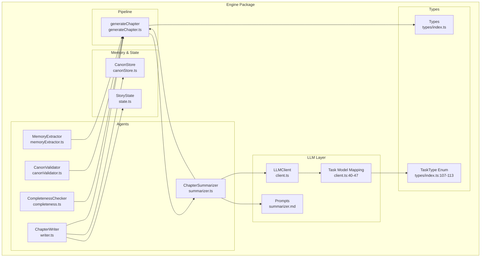
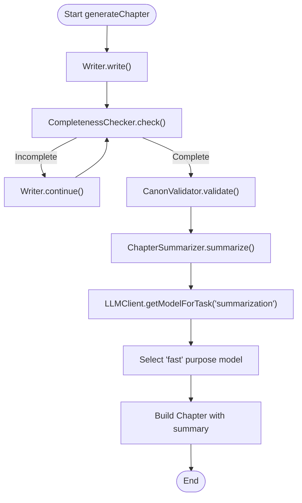
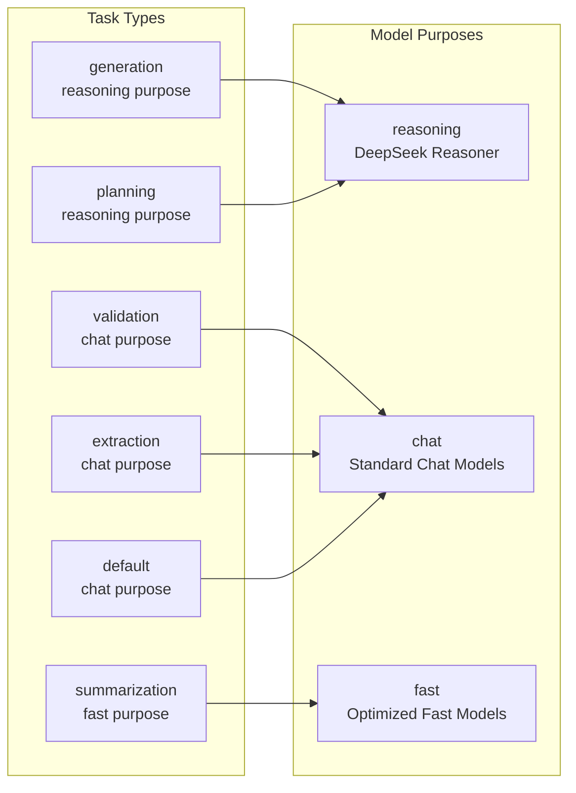
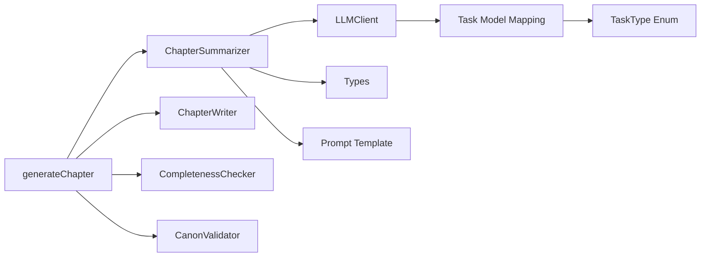

# Summarizer Agent

<cite>
**Referenced Files in This Document**
- [summarizer.ts](file://packages/engine/src/agents/summarizer.ts)
- [summarizer.md](file://packages/engine/src/llm/prompts/summarizer.md)
- [generateChapter.ts](file://packages/engine/src/pipeline/generateChapter.ts)
- [index.ts](file://packages/engine/src/index.ts)
- [types/index.ts](file://packages/engine/src/types/index.ts)
- [client.ts](file://packages/engine/src/llm/client.ts)
- [writer.ts](file://packages/engine/src/agents/writer.ts)
- [completeness.ts](file://packages/engine/src/agents/completeness.ts)
- [canonValidator.ts](file://packages/engine/src/agents/canonValidator.ts)
- [memoryExtractor.ts](file://packages/engine/src/agents/memoryExtractor.ts)
- [canonStore.ts](file://packages/engine/src/memory/canonStore.ts)
- [state.ts](file://packages/engine/src/story/state.ts)
- [simple.test.ts](file://packages/engine/src/test/simple.test.ts)
</cite>

## Update Summary
**Changes Made**
- Updated Task-Specific Model Selection section to reflect the new 'summarization' task parameter
- Added comprehensive documentation for the task-based model routing system
- Enhanced performance considerations to include fast model optimization
- Updated architecture diagrams to show task routing through LLM client
- Added new section on Task Type Configuration and Model Mapping

## Table of Contents
1. [Introduction](#introduction)
2. [Project Structure](#project-structure)
3. [Core Components](#core-components)
4. [Architecture Overview](#architecture-overview)
5. [Detailed Component Analysis](#detailed-component-analysis)
6. [Task-Specific Model Selection](#task-specific-model-selection)
7. [Dependency Analysis](#dependency-analysis)
8. [Performance Considerations](#performance-considerations)
9. [Troubleshooting Guide](#troubleshooting-guide)
10. [Conclusion](#conclusion)
11. [Appendices](#appendices)

## Introduction
This document provides comprehensive documentation for the Summarizer Agent responsible for chapter synthesis and narrative condensation within the Narrative Operating System. The Summarizer Agent produces concise summaries of generated chapters while extracting key narrative events, preserving essential plot and character developments, and maintaining coherence with the broader story context. It integrates tightly with the generation pipeline, working alongside the Writer, Completeness Checker, and Canon Validator to ensure high-quality, coherent storytelling.

**Updated** Enhanced with task-specific model selection that routes summarization operations to optimized fast models for improved performance and cost efficiency.

## Project Structure
The Summarizer Agent resides in the engine package and participates in the chapter generation pipeline. The relevant files and their roles are:

- agents/summarizer.ts: Implements the ChapterSummarizer class and exports a singleton instance used for summarizing chapters.
- llm/prompts/summarizer.md: Defines the base prompt template for chapter summarization.
- pipeline/generateChapter.ts: Orchestrates the end-to-end generation process, invoking the summarizer after content creation.
- types/index.ts: Defines the ChapterSummary interface and related types used by the summarizer, including TaskType enumeration.
- llm/client.ts: Provides the LLM client abstraction with task-based model routing and completion interface used by the summarizer.
- agents/writer.ts, agents/completeness.ts, agents/canonValidator.ts, agents/memoryExtractor.ts: Other pipeline agents that collaborate with the summarizer and demonstrate task-specific model usage.
- memory/canonStore.ts: Supplies canonical facts and formatting utilities used by other agents and indirectly influences context for summarization.
- story/state.ts: Manages story state including chapter summaries, which inform the generation context for subsequent chapters.
- test/simple.test.ts: Demonstrates usage of the summarizer within the generation pipeline.



**Diagram sources**
- [summarizer.ts:1-65](file://packages/engine/src/agents/summarizer.ts#L1-L65)
- [generateChapter.ts:1-76](file://packages/engine/src/pipeline/generateChapter.ts#L1-L76)
- [client.ts:1-200](file://packages/engine/src/llm/client.ts#L1-L200)
- [writer.ts:1-166](file://packages/engine/src/agents/writer.ts#L1-L166)
- [completeness.ts:1-56](file://packages/engine/src/agents/completeness.ts#L1-L56)
- [canonValidator.ts:1-60](file://packages/engine/src/agents/canonValidator.ts#L1-L60)
- [memoryExtractor.ts:1-99](file://packages/engine/src/agents/memoryExtractor.ts#L1-L99)
- [canonStore.ts:1-134](file://packages/engine/src/memory/canonStore.ts#L1-L134)
- [state.ts:1-30](file://packages/engine/src/story/state.ts#L1-L30)
- [types/index.ts:1-149](file://packages/engine/src/types/index.ts#L1-L149)

**Section sources**
- [summarizer.ts:1-65](file://packages/engine/src/agents/summarizer.ts#L1-L65)
- [generateChapter.ts:1-76](file://packages/engine/src/pipeline/generateChapter.ts#L1-L76)
- [client.ts:1-200](file://packages/engine/src/llm/client.ts#L1-L200)
- [types/index.ts:1-149](file://packages/engine/src/types/index.ts#L1-L149)

## Core Components
- ChapterSummarizer: Encapsulates summarization logic, prompt construction, and key event extraction. It uses the LLM client to produce concise summaries and identifies key events based on sentence patterns.
- LLM Client: Provides a unified interface for interacting with different LLM providers, handling configuration and completion requests with task-specific model routing.
- Generation Pipeline: Coordinates chapter generation, including iterative continuation checks, canonical validation, and summarization.
- Types: Define the ChapterSummary interface, TaskType enumeration, and related structures used across the system.

Key capabilities:
- Prompt-driven summarization with token limits and focus areas.
- Lightweight key event extraction from chapter text.
- Task-specific model selection for optimal performance and cost efficiency.
- Integration with the broader generation pipeline for coherent narrative synthesis.

**Section sources**
- [summarizer.ts:17-61](file://packages/engine/src/agents/summarizer.ts#L17-L61)
- [client.ts:135-147](file://packages/engine/src/llm/client.ts#L135-L147)
- [generateChapter.ts:20-71](file://packages/engine/src/pipeline/generateChapter.ts#L20-L71)
- [types/index.ts:53-58](file://packages/engine/src/types/index.ts#L53-L58)
- [types/index.ts:107-113](file://packages/engine/src/types/index.ts#L107-L113)

## Architecture Overview
The Summarizer Agent operates within the chapter generation pipeline with enhanced task-specific model routing. The flow is:

1. Writer generates chapter content based on story context and canonical facts.
2. Completeness Checker evaluates whether the chapter ends naturally; if not, Writer continues iteratively.
3. Canon Validator checks for contradictions against the story canon; violations are recorded.
4. Summarizer produces a concise summary and extracts key events from the final chapter content using optimized fast models.
5. The pipeline constructs a Chapter entity with metadata, including the summary.

```mermaid
sequenceDiagram
participant Gen as "generateChapter"
participant Wr as "ChapterWriter"
participant CC as "CompletenessChecker"
participant CV as "CanonValidator"
participant SM as "ChapterSummarizer"
participant LLM as "LLMClient"
Gen->>Wr : write(context, canon)
loop Continue until complete
Wr-->>Gen : content
Gen->>CC : check(content)
alt Incomplete
Gen->>Wr : continue(content, context)
else Complete
break
end
end
alt validateCanon enabled
Gen->>CV : validate(content, canon)
CV-->>Gen : violations
end
Gen->>SM : summarize(content, chapterNumber)
SM->>LLM : complete(prompt, {temperature, maxTokens, task : 'summarization'})
LLM->>LLM : getModelForTask('summarization')
LLM->>LLM : Select 'fast' purpose model
LLM-->>SM : summary text
SM-->>Gen : ChapterSummary
Gen-->>Gen : build Chapter with summary
```

**Diagram sources**
- [generateChapter.ts:20-71](file://packages/engine/src/pipeline/generateChapter.ts#L20-L71)
- [writer.ts:103-107](file://packages/engine/src/agents/writer.ts#L103-L107)
- [completeness.ts:37-52](file://packages/engine/src/agents/completeness.ts#L37-L52)
- [canonValidator.ts:44-48](file://packages/engine/src/agents/canonValidator.ts#L44-L48)
- [summarizer.ts:24-31](file://packages/engine/src/agents/summarizer.ts#L24-L31)
- [client.ts:135-147](file://packages/engine/src/llm/client.ts#L135-L147)
- [client.ts:113-125](file://packages/engine/src/llm/client.ts#L113-L125)

## Detailed Component Analysis

### ChapterSummarizer Implementation
The ChapterSummarizer class encapsulates:
- Prompt templating for summarization.
- LLM completion with controlled temperature and token limits, including task-specific routing.
- Key event extraction using sentence pattern matching.
- Output formatting into a ChapterSummary structure.

```mermaid
classDiagram
class ChapterSummarizer {
-string promptTemplate
+constructor()
+summarize(chapterText, chapterNumber) ChapterSummary
-extractKeyEvents(text) string[]
}
class LLMClient {
+complete(prompt, config) string
+completeJSON~T~(prompt, config) T
+getModelForTask(task) ModelConfig
}
class ChapterSummary {
+number chapterNumber
+string summary
+string[] keyEvents
+Record<string,string> characterChanges
}
ChapterSummarizer --> LLMClient : "uses with task : 'summarization'"
ChapterSummarizer --> ChapterSummary : "produces"
```

**Diagram sources**
- [summarizer.ts:17-61](file://packages/engine/src/agents/summarizer.ts#L17-L61)
- [client.ts:135-147](file://packages/engine/src/llm/client.ts#L135-L147)
- [client.ts:113-125](file://packages/engine/src/llm/client.ts#L113-L125)
- [types/index.ts:53-58](file://packages/engine/src/types/index.ts#L53-L58)

Key implementation details:
- Prompt construction replaces a placeholder with the chapter text and focuses on major events, plot progress, and character changes.
- Temperature is set low to encourage deterministic, concise outputs suitable for summaries.
- Key event extraction scans the first several sentences for indicative verbs, limiting computation and focusing on early narrative beats.
- **Updated** Task-specific model selection automatically routes summarization to optimized fast models for improved performance.

**Section sources**
- [summarizer.ts:4-38](file://packages/engine/src/agents/summarizer.ts#L4-L38)
- [summarizer.md:1-13](file://packages/engine/src/llm/prompts/summarizer.md#L1-L13)
- [types/index.ts:53-58](file://packages/engine/src/types/index.ts#L53-L58)

### Prompt Construction and Styles
The summarization prompt emphasizes:
- Event identification: major events that occurred.
- Plot advancement: progress made in the story.
- Character development: important changes or revelations.

Style considerations:
- Token limit enforced via configuration to keep summaries concise.
- Focused instruction set to guide the model toward narrative synthesis rather than creative elaboration.

Integration with generation context:
- While the summarizer itself does not directly consume story state, the chapter content it summarizes is produced within a context that includes recent summaries and canonical facts, indirectly influencing the narrative content and thus the summary.

**Section sources**
- [summarizer.ts:4-15](file://packages/engine/src/agents/summarizer.ts#L4-L15)
- [summarizer.md:1-13](file://packages/engine/src/llm/prompts/summarizer.md#L1-L13)
- [writer.ts:77-80](file://packages/engine/src/agents/writer.ts#L77-L80)

### Length Optimization Strategies
- Token budget: The summarizer sets a conservative maximum token count for LLM completions to ensure summaries remain compact.
- Sentence truncation: Key event extraction limits scanning to a fixed number of sentences to reduce computational overhead.
- Prompt efficiency: The prompt template is concise and directive, minimizing unnecessary tokens.
- **Updated** Fast model optimization: Task-specific routing ensures summarization uses optimized fast models designed for efficient text processing.

Coherence maintenance approaches:
- Low temperature ensures factual, focused summaries aligned with the chapter content.
- Structured prompt framing directs the model to prioritize narrative elements over stylistic elaboration.

**Section sources**
- [summarizer.ts:27-30](file://packages/engine/src/agents/summarizer.ts#L27-L30)
- [summarizer.ts:40-60](file://packages/engine/src/agents/summarizer.ts#L40-L60)

### Narrative Essence Preservation Methods
- Focus areas in the prompt ensure that summaries capture major events, plot progress, and character changes—core narrative elements.
- Key event extraction complements the LLM summary by highlighting specific turning points, providing structured recall of significant moments.
- The integration with the generation pipeline ensures summaries reflect the canonical context and recent narrative history, reducing drift over time.

**Section sources**
- [summarizer.ts:6-9](file://packages/engine/src/agents/summarizer.ts#L6-L9)
- [writer.ts:29-31](file://packages/engine/src/agents/writer.ts#L29-L31)
- [canonStore.ts:101-129](file://packages/engine/src/memory/canonStore.ts#L101-L129)

### Integration with Generation Pipeline
The summarizer is invoked after chapter generation completes:
- After iterative continuation checks, canonical validation, and final content assembly, the summarizer produces a ChapterSummary.
- The summary is attached to the Chapter entity along with metadata such as word count and generation timestamp.



**Diagram sources**
- [generateChapter.ts:20-71](file://packages/engine/src/pipeline/generateChapter.ts#L20-L71)
- [writer.ts:96-117](file://packages/engine/src/agents/writer.ts#L96-L117)
- [completeness.ts:37-52](file://packages/engine/src/agents/completeness.ts#L37-L52)
- [canonValidator.ts:32-55](file://packages/engine/src/agents/canonValidator.ts#L32-L55)
- [summarizer.ts:24-31](file://packages/engine/src/agents/summarizer.ts#L24-L31)
- [client.ts:113-125](file://packages/engine/src/llm/client.ts#L113-L125)

**Section sources**
- [generateChapter.ts:20-71](file://packages/engine/src/pipeline/generateChapter.ts#L20-L71)
- [writer.ts:55-94](file://packages/engine/src/agents/writer.ts#L55-L94)
- [completeness.ts:37-52](file://packages/engine/src/agents/completeness.ts#L37-L52)
- [canonValidator.ts:32-55](file://packages/engine/src/agents/canonValidator.ts#L32-L55)
- [summarizer.ts:24-31](file://packages/engine/src/agents/summarizer.ts#L24-L31)

### Quality Metrics and Examples
Quality metrics derived from the implementation:
- Summary length: Controlled via token limits and prompt constraints.
- Event coverage: Key event extraction identifies representative narrative moments.
- Canonical alignment: Summaries are produced from content validated against the story canon.

Example usage and outputs:
- The test demonstrates successful chapter generation and summary extraction, showing how the summarizer integrates into the pipeline and returns a formatted summary.

**Section sources**
- [summarizer.ts:27-30](file://packages/engine/src/agents/summarizer.ts#L27-L30)
- [summarizer.ts:40-60](file://packages/engine/src/agents/summarizer.ts#L40-L60)
- [simple.test.ts:55-70](file://packages/engine/src/test/simple.test.ts#L55-L70)

## Task-Specific Model Selection

**New Section** The Summarizer Agent now benefits from a sophisticated task-specific model selection system that optimizes performance and cost efficiency by routing different operations to specialized models.

### Task Type Configuration and Model Mapping

The LLM client implements a comprehensive task routing system defined by the TaskType enumeration and model mapping configuration:



**Diagram sources**
- [client.ts:40-47](file://packages/engine/src/llm/client.ts#L40-L47)
- [types/index.ts:107-113](file://packages/engine/src/types/index.ts#L107-L113)

### Model Routing Mechanism

The task routing works through the following process:

1. **Task Identification**: Each agent operation specifies its task type in the configuration object
2. **Purpose Mapping**: The LLM client maps the task to an appropriate model purpose
3. **Model Selection**: The client selects a model with the matching purpose from available configurations
4. **Execution**: The operation executes using the optimized model

### Summarization Task Optimization

For the Summarizer Agent, the 'summarization' task is mapped to 'fast' purpose models, providing:

- **Performance**: Optimized models designed for efficient text processing
- **Cost Efficiency**: Reduced token costs compared to reasoning models
- **Latency**: Faster response times for batch operations
- **Scalability**: Better throughput for multiple concurrent summarization tasks

**Section sources**
- [client.ts:39-47](file://packages/engine/src/llm/client.ts#L39-L47)
- [client.ts:113-125](file://packages/engine/src/llm/client.ts#L113-L125)
- [client.ts:135-147](file://packages/engine/src/llm/client.ts#L135-L147)
- [types/index.ts:107-113](file://packages/engine/src/types/index.ts#L107-L113)

## Dependency Analysis
The Summarizer Agent depends on:
- LLM Client for inference with task-specific model routing.
- Types for structured output and task type definitions.
- Prompt templates for consistent instruction.

Coupling and cohesion:
- Cohesive summarization logic within ChapterSummarizer.
- Loose coupling to LLM client via an interface abstraction with task routing.
- Clear separation of concerns with other pipeline agents.

Potential circular dependencies:
- None observed; the summarizer does not depend on other agents directly.

External dependencies:
- LLM provider configuration and model selection handled by the LLM client with task-specific routing.



**Diagram sources**
- [summarizer.ts:1-3](file://packages/engine/src/agents/summarizer.ts#L1-L3)
- [client.ts:135-147](file://packages/engine/src/llm/client.ts#L135-L147)
- [client.ts:40-47](file://packages/engine/src/llm/client.ts#L40-L47)
- [types/index.ts:53-58](file://packages/engine/src/types/index.ts#L53-L58)
- [types/index.ts:107-113](file://packages/engine/src/types/index.ts#L107-L113)
- [generateChapter.ts:1-7](file://packages/engine/src/pipeline/generateChapter.ts#L1-L7)
- [writer.ts:1-4](file://packages/engine/src/agents/writer.ts#L1-L4)
- [completeness.ts:1-2](file://packages/engine/src/agents/completeness.ts#L1-L2)
- [canonValidator.ts:1-2](file://packages/engine/src/agents/canonValidator.ts#L1-L2)

**Section sources**
- [summarizer.ts:1-3](file://packages/engine/src/agents/summarizer.ts#L1-L3)
- [client.ts:135-147](file://packages/engine/src/llm/client.ts#L135-L147)
- [types/index.ts:53-58](file://packages/engine/src/types/index.ts#L53-L58)
- [generateChapter.ts:1-7](file://packages/engine/src/pipeline/generateChapter.ts#L1-L7)

## Performance Considerations

**Updated** Enhanced with task-specific model optimization for improved performance and cost efficiency.

- Token budgeting: The summarizer caps LLM completions to maintain fast, predictable latency.
- Early termination in key event extraction: Limits scanning to a small subset of sentences to reduce processing time.
- **New** Task-specific model routing: The LLM client automatically selects optimized fast models for summarization operations, significantly improving performance and reducing costs.
- **New** Purpose-based model selection: Models are categorized by purpose ('reasoning', 'chat', 'fast') allowing for intelligent routing based on operation requirements.
- Provider configuration: The LLM client supports multiple providers and configurable models, allowing tuning for cost and speed.
- Iterative generation: The pipeline's continuation loop avoids excessive retries, minimizing total compute usage.

Large chapter handling:
- The summarizer processes the entire chapter content; for very long chapters, consider chunking or sampling strategies if performance becomes a bottleneck.
- Key event extraction is bounded by sentence count, mitigating worst-case scaling.
- **New** Fast model optimization provides consistent performance regardless of chapter length.

**Section sources**
- [summarizer.ts:27-30](file://packages/engine/src/agents/summarizer.ts#L27-L30)
- [summarizer.ts:40-60](file://packages/engine/src/agents/summarizer.ts#L40-L60)
- [client.ts:40-47](file://packages/engine/src/llm/client.ts#L40-L47)
- [client.ts:113-125](file://packages/engine/src/llm/client.ts#L113-L125)

## Troubleshooting Guide

**Updated** Added troubleshooting guidance for task-specific model routing issues.

Common issues and resolutions:
- Empty or low-quality summaries:
  - Verify prompt template and ensure chapter text is passed correctly.
  - Adjust LLM configuration (temperature, max tokens) if summaries are too verbose or too vague.
- Key event extraction returning few items:
  - The extractor scans a limited number of sentences and relies on indicative verbs; consider expanding heuristics if needed.
- Canonical drift concerns:
  - The summarizer does not directly manage canon; rely on the separation of narrative memory and immutable canon as described in the project documentation to prevent fact mutation during compression cycles.
- **New** Task routing failures:
  - Verify that the 'summarization' task parameter is correctly set in the summarizer configuration.
  - Check that the LLM client has available models with 'fast' purpose configured.
  - Ensure the TASK_MODEL_MAPPING includes 'summarization' -> 'fast' configuration.

Integration debugging:
- Confirm that generateChapter invokes the summarizer after content completion and validation.
- Ensure the LLM client is configured with a valid provider and API key.
- **New** Verify that task-specific model routing is functioning by checking the model purpose selection in the LLM client logs.

**Section sources**
- [summarizer.ts:24-38](file://packages/engine/src/agents/summarizer.ts#L24-L38)
- [summarizer.ts:40-60](file://packages/engine/src/agents/summarizer.ts#L40-L60)
- [generateChapter.ts:55-55](file://packages/engine/src/pipeline/generateChapter.ts#L55-L55)
- [client.ts:113-125](file://packages/engine/src/llm/client.ts#L113-L125)
- [client.ts:40-47](file://packages/engine/src/llm/client.ts#L40-L47)

## Conclusion
The Summarizer Agent provides a focused, efficient mechanism for synthesizing chapter narratives into concise, coherent summaries while extracting key events. Its integration with the generation pipeline ensures summaries align with canonical facts and recent narrative context, supporting long-term narrative stability. 

**Updated** The enhanced task-specific model selection system now automatically routes summarization operations to optimized fast models, providing significant improvements in performance and cost efficiency while maintaining the high-quality narrative synthesis that the Summarizer Agent is known for. With careful configuration of token budgets, prompt constraints, and task routing, it delivers reliable performance across diverse chapter lengths and story genres.

## Appendices

### API Reference
- ChapterSummarizer.summarize(chapterText, chapterNumber): Produces a ChapterSummary containing the chapter number, summary text, and extracted key events.
- LLMClient.complete(prompt, config): Executes LLM inference with provider-specific configuration and automatic task-based model routing.
- generateChapter(context, options): Orchestrates the full generation pipeline, including summarization with optimized model selection.
- **New** TaskType enumeration: Defines task categories ('generation', 'validation', 'summarization', 'extraction', 'planning', 'default') for model routing.

**Section sources**
- [summarizer.ts:24-38](file://packages/engine/src/agents/summarizer.ts#L24-L38)
- [client.ts:135-147](file://packages/engine/src/llm/client.ts#L135-L147)
- [generateChapter.ts:20-71](file://packages/engine/src/pipeline/generateChapter.ts#L20-L71)
- [index.ts:8-15](file://packages/engine/src/index.ts#L8-L15)
- [types/index.ts:107-113](file://packages/engine/src/types/index.ts#L107-L113)