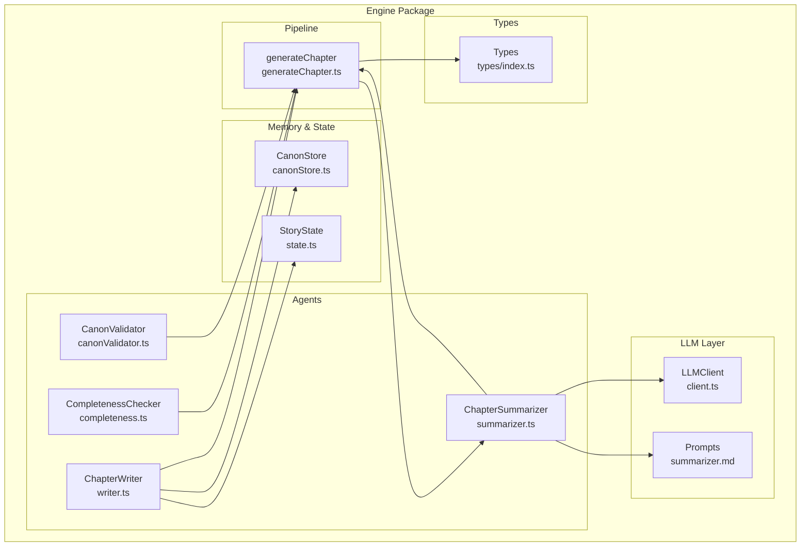
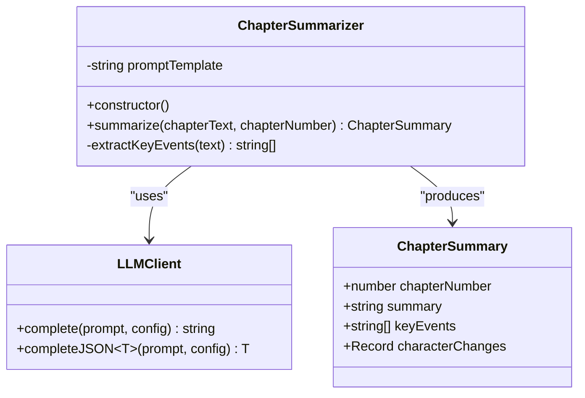
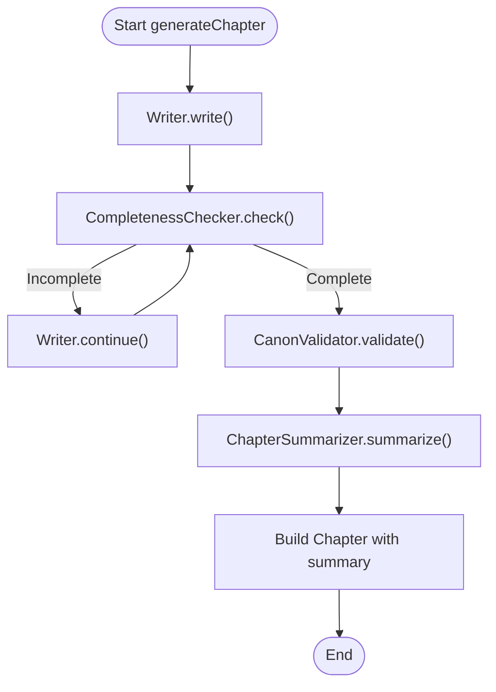
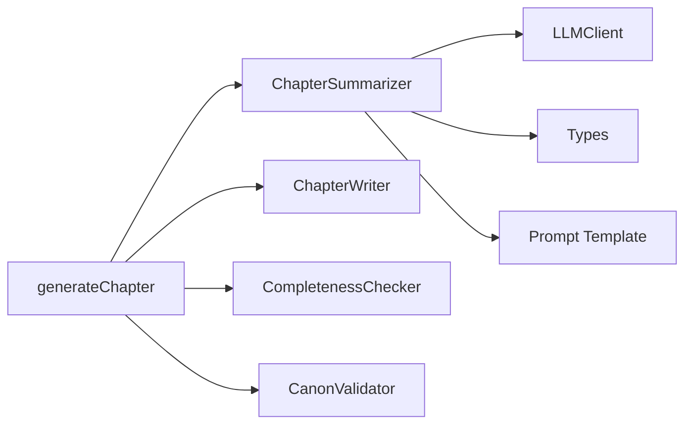

# Summarizer Agent

<cite>
**Referenced Files in This Document**
- [summarizer.ts](file://packages/engine/src/agents/summarizer.ts)
- [summarizer.md](file://packages/engine/src/llm/prompts/summarizer.md)
- [generateChapter.ts](file://packages/engine/src/pipeline/generateChapter.ts)
- [index.ts](file://packages/engine/src/index.ts)
- [types/index.ts](file://packages/engine/src/types/index.ts)
- [client.ts](file://packages/engine/src/llm/client.ts)
- [writer.ts](file://packages/engine/src/agents/writer.ts)
- [completeness.ts](file://packages/engine/src/agents/completeness.ts)
- [canonValidator.ts](file://packages/engine/src/agents/canonValidator.ts)
- [canonStore.ts](file://packages/engine/src/memory/canonStore.ts)
- [state.ts](file://packages/engine/src/story/state.ts)
- [simple.test.ts](file://packages/engine/src/test/simple.test.ts)
</cite>

## Table of Contents
1. [Introduction](#introduction)
2. [Project Structure](#project-structure)
3. [Core Components](#core-components)
4. [Architecture Overview](#architecture-overview)
5. [Detailed Component Analysis](#detailed-component-analysis)
6. [Dependency Analysis](#dependency-analysis)
7. [Performance Considerations](#performance-considerations)
8. [Troubleshooting Guide](#troubleshooting-guide)
9. [Conclusion](#conclusion)
10. [Appendices](#appendices)

## Introduction
This document provides comprehensive documentation for the Summarizer Agent responsible for chapter synthesis and narrative condensation within the Narrative Operating System. The Summarizer Agent produces concise summaries of generated chapters while extracting key narrative events, preserving essential plot and character developments, and maintaining coherence with the broader story context. It integrates tightly with the generation pipeline, working alongside the Writer, Completeness Checker, and Canon Validator to ensure high-quality, coherent storytelling.

## Project Structure
The Summarizer Agent resides in the engine package and participates in the chapter generation pipeline. The relevant files and their roles are:

- agents/summarizer.ts: Implements the ChapterSummarizer class and exports a singleton instance used for summarizing chapters.
- llm/prompts/summarizer.md: Defines the base prompt template for chapter summarization.
- pipeline/generateChapter.ts: Orchestrates the end-to-end generation process, invoking the summarizer after content creation.
- types/index.ts: Defines the ChapterSummary interface and related types used by the summarizer.
- llm/client.ts: Provides the LLM client abstraction and completion interface used by the summarizer.
- agents/writer.ts, agents/completeness.ts, agents/canonValidator.ts: Other pipeline agents that collaborate with the summarizer.
- memory/canonStore.ts: Supplies canonical facts and formatting utilities used by other agents and indirectly influences context for summarization.
- story/state.ts: Manages story state including chapter summaries, which inform the generation context for subsequent chapters.
- test/simple.test.ts: Demonstrates usage of the summarizer within the generation pipeline.



**Diagram sources**
- [summarizer.ts](file://packages/engine/src/agents/summarizer.ts#L1-L64)
- [generateChapter.ts](file://packages/engine/src/pipeline/generateChapter.ts#L1-L76)
- [client.ts](file://packages/engine/src/llm/client.ts#L1-L106)
- [writer.ts](file://packages/engine/src/agents/writer.ts#L1-L146)
- [completeness.ts](file://packages/engine/src/agents/completeness.ts#L1-L56)
- [canonValidator.ts](file://packages/engine/src/agents/canonValidator.ts#L1-L59)
- [canonStore.ts](file://packages/engine/src/memory/canonStore.ts#L1-L134)
- [state.ts](file://packages/engine/src/story/state.ts#L1-L30)
- [types/index.ts](file://packages/engine/src/types/index.ts#L1-L90)

**Section sources**
- [summarizer.ts](file://packages/engine/src/agents/summarizer.ts#L1-L64)
- [generateChapter.ts](file://packages/engine/src/pipeline/generateChapter.ts#L1-L76)
- [client.ts](file://packages/engine/src/llm/client.ts#L1-L106)
- [types/index.ts](file://packages/engine/src/types/index.ts#L1-L90)

## Core Components
- ChapterSummarizer: Encapsulates summarization logic, prompt construction, and key event extraction. It uses the LLM client to produce concise summaries and identifies key events based on sentence patterns.
- LLM Client: Provides a unified interface for interacting with different LLM providers, handling configuration and completion requests.
- Generation Pipeline: Coordinates chapter generation, including iterative continuation checks, canonical validation, and summarization.
- Types: Define the ChapterSummary interface and related structures used across the system.

Key capabilities:
- Prompt-driven summarization with token limits and focus areas.
- Lightweight key event extraction from chapter text.
- Integration with the broader generation pipeline for coherent narrative synthesis.

**Section sources**
- [summarizer.ts](file://packages/engine/src/agents/summarizer.ts#L17-L61)
- [client.ts](file://packages/engine/src/llm/client.ts#L31-L105)
- [generateChapter.ts](file://packages/engine/src/pipeline/generateChapter.ts#L20-L71)
- [types/index.ts](file://packages/engine/src/types/index.ts#L53-L58)

## Architecture Overview
The Summarizer Agent operates within the chapter generation pipeline. The flow is:

1. Writer generates chapter content based on story context and canonical facts.
2. Completeness Checker evaluates whether the chapter ends naturally; if not, Writer continues iteratively.
3. Canon Validator checks for contradictions against the story canon; violations are recorded.
4. Summarizer produces a concise summary and extracts key events from the final chapter content.
5. The pipeline constructs a Chapter entity with metadata, including the summary.

```mermaid
sequenceDiagram
participant Gen as "generateChapter"
participant Wr as "ChapterWriter"
participant CC as "CompletenessChecker"
participant CV as "CanonValidator"
participant SM as "ChapterSummarizer"
participant LLM as "LLMClient"
Gen->>Wr : write(context, canon)
loop Continue until complete
Wr-->>Gen : content
Gen->>CC : check(content)
alt Incomplete
Gen->>Wr : continue(content, context)
else Complete
break
end
end
alt validateCanon enabled
Gen->>CV : validate(content, canon)
CV-->>Gen : violations
end
Gen->>SM : summarize(content, chapterNumber)
SM->>LLM : complete(prompt, {temperature, maxTokens})
LLM-->>SM : summary text
SM-->>Gen : ChapterSummary
Gen-->>Gen : build Chapter with summary
```

**Diagram sources**
- [generateChapter.ts](file://packages/engine/src/pipeline/generateChapter.ts#L20-L71)
- [writer.ts](file://packages/engine/src/agents/writer.ts#L55-L94)
- [completeness.ts](file://packages/engine/src/agents/completeness.ts#L37-L52)
- [canonValidator.ts](file://packages/engine/src/agents/canonValidator.ts#L32-L55)
- [summarizer.ts](file://packages/engine/src/agents/summarizer.ts#L24-L38)
- [client.ts](file://packages/engine/src/llm/client.ts#L78-L81)

## Detailed Component Analysis

### ChapterSummarizer Implementation
The ChapterSummarizer class encapsulates:
- Prompt templating for summarization.
- LLM completion with controlled temperature and token limits.
- Key event extraction using sentence pattern matching.
- Output formatting into a ChapterSummary structure.



**Diagram sources**
- [summarizer.ts](file://packages/engine/src/agents/summarizer.ts#L17-L61)
- [client.ts](file://packages/engine/src/llm/client.ts#L31-L105)
- [types/index.ts](file://packages/engine/src/types/index.ts#L53-L58)

Key implementation details:
- Prompt construction replaces a placeholder with the chapter text and focuses on major events, plot progress, and character changes.
- Temperature is set low to encourage deterministic, concise outputs suitable for summaries.
- Key event extraction scans the first several sentences for indicative verbs, limiting computation and focusing on early narrative beats.

**Section sources**
- [summarizer.ts](file://packages/engine/src/agents/summarizer.ts#L4-L38)
- [summarizer.md](file://packages/engine/src/llm/prompts/summarizer.md#L1-L13)
- [types/index.ts](file://packages/engine/src/types/index.ts#L53-L58)

### Prompt Construction and Styles
The summarization prompt emphasizes:
- Event identification: major events that occurred.
- Plot advancement: progress made in the story.
- Character development: important changes or revelations.

Style considerations:
- Token limit enforced via configuration to keep summaries concise.
- Focused instruction set to guide the model toward narrative synthesis rather than creative elaboration.

Integration with generation context:
- While the summarizer itself does not directly consume story state, the chapter content it summarizes is produced within a context that includes recent summaries and canonical facts, indirectly influencing the narrative content and thus the summary.

**Section sources**
- [summarizer.ts](file://packages/engine/src/agents/summarizer.ts#L4-L15)
- [summarizer.md](file://packages/engine/src/llm/prompts/summarizer.md#L1-L13)
- [writer.ts](file://packages/engine/src/agents/writer.ts#L60-L63)

### Length Optimization Strategies
- Token budget: The summarizer sets a conservative maximum token count for LLM completions to ensure summaries remain compact.
- Sentence truncation: Key event extraction limits scanning to a fixed number of sentences to reduce computational overhead.
- Prompt efficiency: The prompt template is concise and directive, minimizing unnecessary tokens.

Coherence maintenance approaches:
- Low temperature ensures factual, focused summaries aligned with the chapter content.
- Structured prompt framing directs the model to prioritize narrative elements over stylistic elaboration.

**Section sources**
- [summarizer.ts](file://packages/engine/src/agents/summarizer.ts#L27-L30)
- [summarizer.ts](file://packages/engine/src/agents/summarizer.ts#L40-L60)

### Narrative Essence Preservation Methods
- Focus areas in the prompt ensure that summaries capture major events, plot progress, and character changes—core narrative elements.
- Key event extraction complements the LLM summary by highlighting specific turning points, providing structured recall of significant moments.
- The integration with the generation pipeline ensures summaries reflect the canonical context and recent narrative history, reducing drift over time.

**Section sources**
- [summarizer.ts](file://packages/engine/src/agents/summarizer.ts#L6-L9)
- [writer.ts](file://packages/engine/src/agents/writer.ts#L29-L31)
- [canonStore.ts](file://packages/engine/src/memory/canonStore.ts#L101-L129)

### Integration with Generation Pipeline
The summarizer is invoked after chapter generation completes:
- After iterative continuation checks, canonical validation, and final content assembly, the summarizer produces a ChapterSummary.
- The summary is attached to the Chapter entity along with metadata such as word count and generation timestamp.



**Diagram sources**
- [generateChapter.ts](file://packages/engine/src/pipeline/generateChapter.ts#L20-L71)
- [writer.ts](file://packages/engine/src/agents/writer.ts#L96-L117)
- [completeness.ts](file://packages/engine/src/agents/completeness.ts#L37-L52)
- [canonValidator.ts](file://packages/engine/src/agents/canonValidator.ts#L32-L55)
- [summarizer.ts](file://packages/engine/src/agents/summarizer.ts#L24-L38)

**Section sources**
- [generateChapter.ts](file://packages/engine/src/pipeline/generateChapter.ts#L20-L71)
- [writer.ts](file://packages/engine/src/agents/writer.ts#L55-L94)
- [completeness.ts](file://packages/engine/src/agents/completeness.ts#L37-L52)
- [canonValidator.ts](file://packages/engine/src/agents/canonValidator.ts#L32-L55)
- [summarizer.ts](file://packages/engine/src/agents/summarizer.ts#L24-L38)

### Quality Metrics and Examples
Quality metrics derived from the implementation:
- Summary length: Controlled via token limits and prompt constraints.
- Event coverage: Key event extraction identifies representative narrative moments.
- Canonical alignment: Summaries are produced from content validated against the story canon.

Example usage and outputs:
- The test demonstrates successful chapter generation and summary extraction, showing how the summarizer integrates into the pipeline and returns a formatted summary.

**Section sources**
- [summarizer.ts](file://packages/engine/src/agents/summarizer.ts#L27-L30)
- [summarizer.ts](file://packages/engine/src/agents/summarizer.ts#L40-L60)
- [simple.test.ts](file://packages/engine/src/test/simple.test.ts#L55-L70)

## Dependency Analysis
The Summarizer Agent depends on:
- LLM Client for inference.
- Types for structured output.
- Prompt templates for consistent instruction.

Coupling and cohesion:
- Cohesive summarization logic within ChapterSummarizer.
- Loose coupling to LLM client via an interface abstraction.
- Clear separation of concerns with other pipeline agents.

Potential circular dependencies:
- None observed; the summarizer does not depend on other agents directly.

External dependencies:
- LLM provider configuration and model selection handled by the LLM client.



**Diagram sources**
- [summarizer.ts](file://packages/engine/src/agents/summarizer.ts#L1-L3)
- [client.ts](file://packages/engine/src/llm/client.ts#L31-L105)
- [types/index.ts](file://packages/engine/src/types/index.ts#L53-L58)
- [generateChapter.ts](file://packages/engine/src/pipeline/generateChapter.ts#L1-L7)
- [writer.ts](file://packages/engine/src/agents/writer.ts#L1-L4)
- [completeness.ts](file://packages/engine/src/agents/completeness.ts#L1-L2)
- [canonValidator.ts](file://packages/engine/src/agents/canonValidator.ts#L1-L2)

**Section sources**
- [summarizer.ts](file://packages/engine/src/agents/summarizer.ts#L1-L3)
- [client.ts](file://packages/engine/src/llm/client.ts#L31-L105)
- [types/index.ts](file://packages/engine/src/types/index.ts#L53-L58)
- [generateChapter.ts](file://packages/engine/src/pipeline/generateChapter.ts#L1-L7)

## Performance Considerations
- Token budgeting: The summarizer caps LLM completions to maintain fast, predictable latency.
- Early termination in key event extraction: Limits scanning to a small subset of sentences to reduce processing time.
- Provider configuration: The LLM client supports multiple providers and configurable models, allowing tuning for cost and speed.
- Iterative generation: The pipeline’s continuation loop avoids excessive retries, minimizing total compute usage.

Large chapter handling:
- The summarizer processes the entire chapter content; for very long chapters, consider chunking or sampling strategies if performance becomes a bottleneck.
- Key event extraction is bounded by sentence count, mitigating worst-case scaling.

**Section sources**
- [summarizer.ts](file://packages/engine/src/agents/summarizer.ts#L27-L30)
- [summarizer.ts](file://packages/engine/src/agents/summarizer.ts#L40-L60)
- [client.ts](file://packages/engine/src/llm/client.ts#L46-L76)

## Troubleshooting Guide
Common issues and resolutions:
- Empty or low-quality summaries:
  - Verify prompt template and ensure chapter text is passed correctly.
  - Adjust LLM configuration (temperature, max tokens) if summaries are too verbose or too vague.
- Key event extraction returning few items:
  - The extractor scans a limited number of sentences and relies on indicative verbs; consider expanding heuristics if needed.
- Canonical drift concerns:
  - The summarizer does not directly manage canon; rely on the separation of narrative memory and immutable canon as described in the project documentation to prevent fact mutation during compression cycles.

Integration debugging:
- Confirm that generateChapter invokes the summarizer after content completion and validation.
- Ensure the LLM client is configured with a valid provider and API key.

**Section sources**
- [summarizer.ts](file://packages/engine/src/agents/summarizer.ts#L24-L38)
- [summarizer.ts](file://packages/engine/src/agents/summarizer.ts#L40-L60)
- [generateChapter.ts](file://packages/engine/src/pipeline/generateChapter.ts#L55-L55)
- [client.ts](file://packages/engine/src/llm/client.ts#L46-L76)

## Conclusion
The Summarizer Agent provides a focused, efficient mechanism for synthesizing chapter narratives into concise, coherent summaries while extracting key events. Its integration with the generation pipeline ensures summaries align with canonical facts and recent narrative context, supporting long-term narrative stability. With careful configuration of token budgets and prompt constraints, it delivers reliable performance across diverse chapter lengths and story genres.

## Appendices

### API Reference
- ChapterSummarizer.summarize(chapterText, chapterNumber): Produces a ChapterSummary containing the chapter number, summary text, and extracted key events.
- LLMClient.complete(prompt, config): Executes LLM inference with provider-specific configuration.
- generateChapter(context, options): Orchestrates the full generation pipeline, including summarization.

**Section sources**
- [summarizer.ts](file://packages/engine/src/agents/summarizer.ts#L24-L38)
- [client.ts](file://packages/engine/src/llm/client.ts#L78-L81)
- [generateChapter.ts](file://packages/engine/src/pipeline/generateChapter.ts#L20-L71)
- [index.ts](file://packages/engine/src/index.ts#L8-L15)