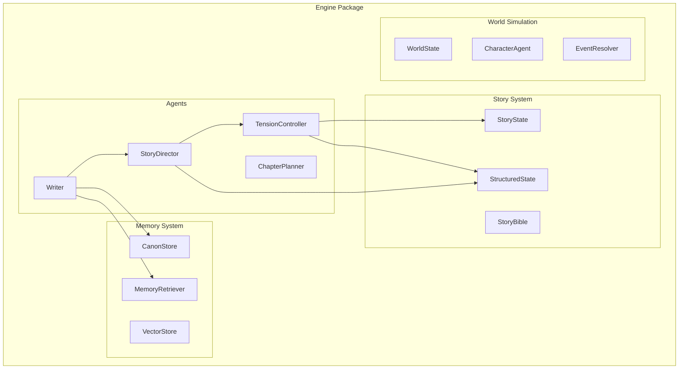
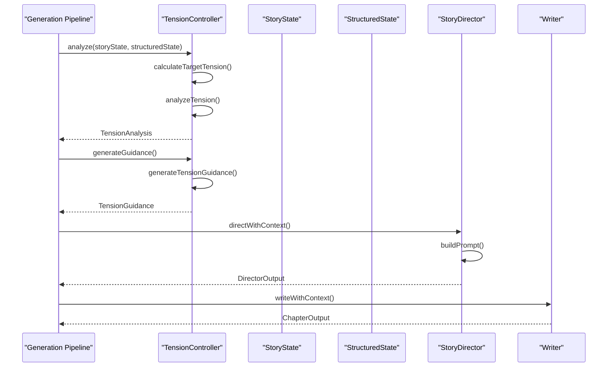
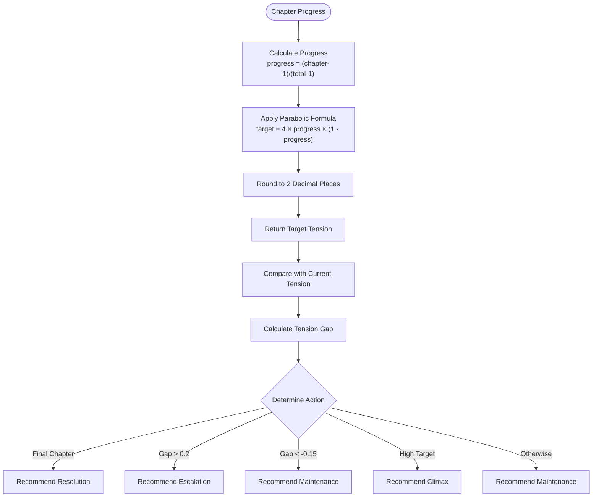
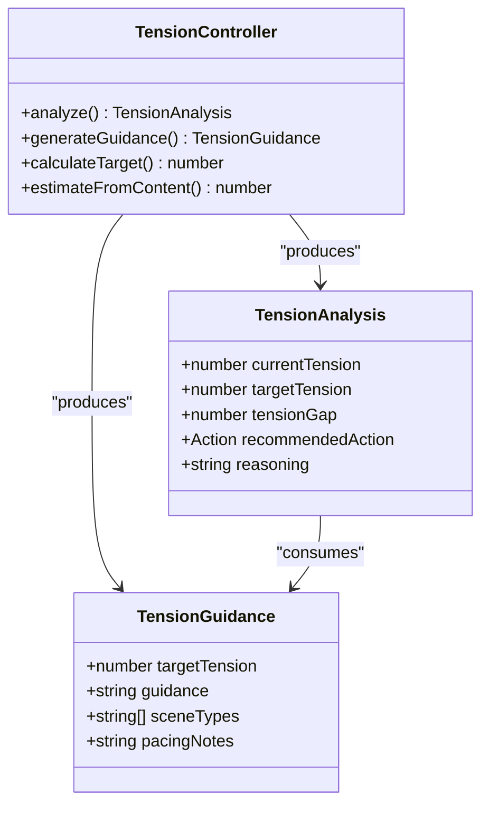
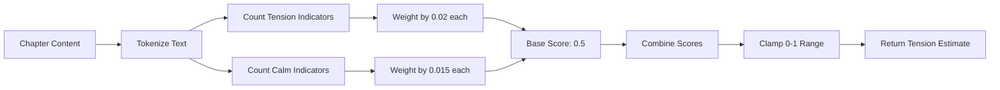
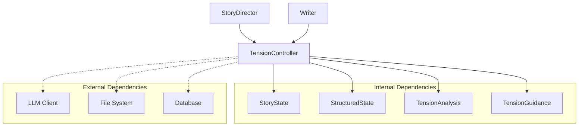
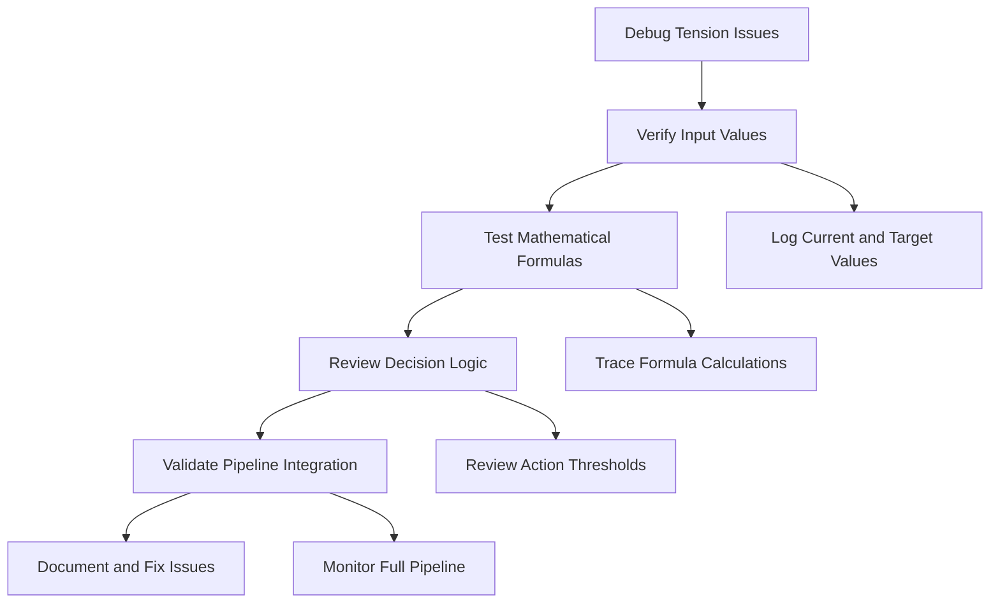

# TensionController Agent

<cite>
**Referenced Files in This Document**
- [tensionController.ts](file://packages/engine/src/agents/tensionController.ts)
- [state.ts](file://packages/engine/src/story/state.ts)
- [structuredState.ts](file://packages/engine/src/story/structuredState.ts)
- [index.ts](file://packages/engine/src/index.ts)
- [tension-controller.test.ts](file://packages/engine/src/test/tension-controller.test.ts)
- [storyDirector.ts](file://packages/engine/src/agents/storyDirector.ts)
- [generateChapter.ts](file://packages/engine/src/pipeline/generateChapter.ts)
- [implementation-plan.md](file://implementation-plan.md)
</cite>

## Table of Contents
1. [Introduction](#introduction)
2. [Project Structure](#project-structure)
3. [Core Components](#core-components)
4. [Architecture Overview](#architecture-overview)
5. [Detailed Component Analysis](#detailed-component-analysis)
6. [Dependency Analysis](#dependency-analysis)
7. [Performance Considerations](#performance-considerations)
8. [Troubleshooting Guide](#troubleshooting-guide)
9. [Conclusion](#conclusion)

## Introduction
The TensionController Agent is a sophisticated narrative pacing system designed to maintain natural dramatic arcs throughout story generation. It implements a mathematical tension curve formula that creates authentic story structure, ensuring chapters build toward peaks and resolve appropriately. This agent serves as the foundation for narrative tension management in the Narrative Operating System, providing both analytical capabilities and practical guidance for writers.

The agent operates on a parabolic tension curve formula: `targetTension = 4 × progress × (1 - progress)`, which creates the classic dramatic arc pattern of rising action, climax, and resolution. This mathematical approach ensures stories follow natural narrative expectations rather than flat or random tension patterns.

## Project Structure
The TensionController Agent is part of the Narrative Operating System's engine package, organized within the agents directory alongside other narrative components. The system follows a modular architecture where each agent has specific responsibilities while integrating seamlessly with the broader narrative pipeline.

**Diagram sources**
- [tensionController.ts](file://packages/engine/src/agents/tensionController.ts#L1-L252)
- [index.ts](file://packages/engine/src/index.ts#L1-L91)

**Section sources**
- [tensionController.ts](file://packages/engine/src/agents/tensionController.ts#L1-L252)
- [index.ts](file://packages/engine/src/index.ts#L1-L91)

## Core Components

### Tension Analysis System
The TensionController provides a comprehensive tension analysis framework that evaluates current narrative tension against target tension curves. The system calculates tension gaps and recommends appropriate actions to maintain dramatic balance.

### Target Tension Calculation
The agent implements a sophisticated parabolic tension curve that creates natural dramatic progression:
- **Setup Phase**: Low tension at beginning (approaches 0%)
- **Rising Action**: Increasing tension toward middle chapters
- **Climax**: Peak tension around chapter midpoint
- **Resolution**: Decreasing tension toward conclusion

### Guidance Generation
Beyond analysis, the agent generates practical writing guidance including recommended scene types, pacing notes, and specific narrative directions tailored to the current tension requirements.

**Section sources**
- [tensionController.ts](file://packages/engine/src/agents/tensionController.ts#L28-L97)
- [tensionController.ts](file://packages/engine/src/agents/tensionController.ts#L102-L149)

## Architecture Overview

The TensionController Agent integrates deeply with the Narrative Operating System's story state management and narrative pipeline. Its architecture demonstrates a clean separation of concerns with specialized functions for tension calculation, analysis, and guidance generation.

**Diagram sources**
- [tensionController.ts](file://packages/engine/src/agents/tensionController.ts#L214-L249)
- [storyDirector.ts](file://packages/engine/src/agents/storyDirector.ts#L100-L173)
- [generateChapter.ts](file://packages/engine/src/pipeline/generateChapter.ts#L26-L103)

The integration architecture shows how the TensionController serves as a bridge between story state analysis and practical writing guidance, feeding directly into the StoryDirector's decision-making process.

**Section sources**
- [tensionController.ts](file://packages/engine/src/agents/tensionController.ts#L214-L249)
- [storyDirector.ts](file://packages/engine/src/agents/storyDirector.ts#L100-L173)

## Detailed Component Analysis

### Mathematical Tension Curve Implementation

The TensionController implements a precise mathematical formula for tension calculation that creates authentic dramatic progression:

**Diagram sources**
- [tensionController.ts](file://packages/engine/src/agents/tensionController.ts#L28-L97)

The mathematical precision ensures consistent tension progression across stories of varying lengths, maintaining narrative authenticity regardless of story structure.

### Tension Analysis Decision Logic

The analysis system employs sophisticated decision-making logic that considers multiple factors:

| Condition | Action | Threshold | Reasoning |
|-----------|--------|-----------|-----------|
| Final Chapter Reached | Resolve | - | Bring tensions to resolution |
| Tension Gap > 0.2 | Escalate | +0.2 | Tension below target by 20% |
| Tension Gap < -0.15 | Maintain | -0.15 | Tension above target by 15% |
| Target > 0.85 | Climax | +0.85 | Near peak tension threshold |
| Otherwise | Maintain | Default | Tension on track |

### Guidance Generation System

The guidance generation component transforms tension analysis into practical writing instructions:

**Diagram sources**
- [tensionController.ts](file://packages/engine/src/agents/tensionController.ts#L4-L17)
- [tensionController.ts](file://packages/engine/src/agents/tensionController.ts#L214-L249)

**Section sources**
- [tensionController.ts](file://packages/engine/src/agents/tensionController.ts#L58-L97)
- [tensionController.ts](file://packages/engine/src/agents/tensionController.ts#L102-L149)

### Content-Based Tension Estimation

The agent includes advanced content analysis capabilities that estimate tension from written text using lexical analysis:

**Diagram sources**
- [tensionController.ts](file://packages/engine/src/agents/tensionController.ts#L173-L209)

The content-based estimation provides valuable insights into actual narrative tension versus target tension, enabling fine-tuned adjustments to writing approaches.

**Section sources**
- [tensionController.ts](file://packages/engine/src/agents/tensionController.ts#L173-L209)

## Dependency Analysis

The TensionController Agent maintains minimal external dependencies while integrating with several core system components:

**Diagram sources**
- [tensionController.ts](file://packages/engine/src/agents/tensionController.ts#L1-L10)
- [storyDirector.ts](file://packages/engine/src/agents/storyDirector.ts#L1-L31)

The agent's dependency structure demonstrates clean architectural boundaries, with clear separation between story state management and external system integration.

**Section sources**
- [tensionController.ts](file://packages/engine/src/agents/tensionController.ts#L1-L10)
- [index.ts](file://packages/engine/src/index.ts#L15-L26)

## Performance Considerations

The TensionController Agent is designed for optimal performance through several key strategies:

### Mathematical Efficiency
- **O(1) Complexity**: All calculations use constant-time mathematical operations
- **Minimal Memory Usage**: Stateless calculations with no persistent data structures
- **Precision Control**: Rounded results prevent floating-point accumulation errors

### Integration Optimization
- **Lazy Evaluation**: Guidance generation only occurs when needed
- **Cached Results**: Target tension calculations can be cached for repeated use
- **Batch Processing**: Multiple chapters can be processed efficiently in sequence

### Scalability Features
- **Parallel Processing**: Independent chapter tension calculations can run concurrently
- **Memory Management**: No long-term state retention reduces memory footprint
- **Resource Efficiency**: Minimal computational overhead during story generation

## Troubleshooting Guide

### Common Issues and Solutions

**Issue**: Tension values outside expected range
- **Cause**: Incorrect chapter numbering or total chapter calculation
- **Solution**: Verify story state initialization and ensure proper chapter progression

**Issue**: Inconsistent tension recommendations
- **Cause**: Rapid fluctuations in current tension values
- **Solution**: Implement smoothing algorithms or adjust analysis thresholds

**Issue**: Guidance mismatch with story context
- **Cause**: Over-reliance on automated recommendations
- **Solution**: Allow human override and incorporate contextual factors

### Debugging Strategies

The agent provides comprehensive logging and testing capabilities:

**Section sources**
- [tension-controller.test.ts](file://packages/engine/src/test/tension-controller.test.ts#L1-L143)

## Conclusion

The TensionController Agent represents a sophisticated approach to narrative tension management, combining mathematical precision with practical writing guidance. Its implementation demonstrates excellent software engineering practices through clean architecture, comprehensive testing, and seamless integration with the broader Narrative Operating System.

The agent's parabolic tension curve formula creates authentic dramatic progression that aligns with reader expectations, while its analysis and guidance systems provide practical support for writers. The comprehensive testing suite ensures reliability and correctness across various scenarios and story structures.

Future enhancements could include machine learning-based adaptation for different genres, dynamic threshold adjustment based on story context, and integration with more sophisticated narrative theory models. However, the current implementation provides a robust foundation for automatic tension management in narrative generation systems.

The TensionController Agent exemplifies how mathematical modeling and artificial intelligence can work together to create compelling, well-structured narratives that engage readers while maintaining authorial control over creative direction.