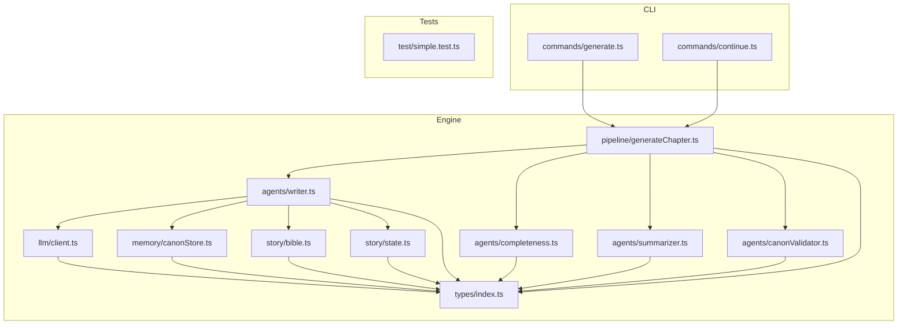
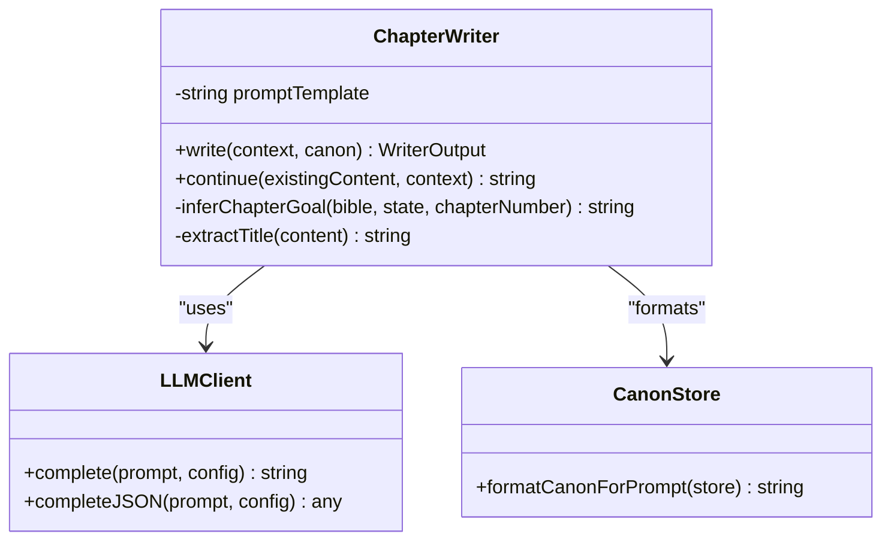
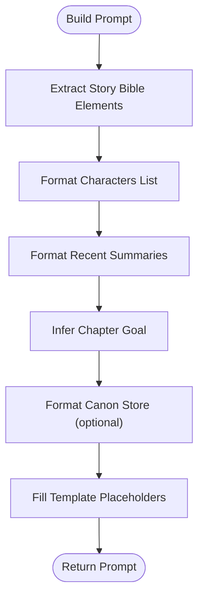
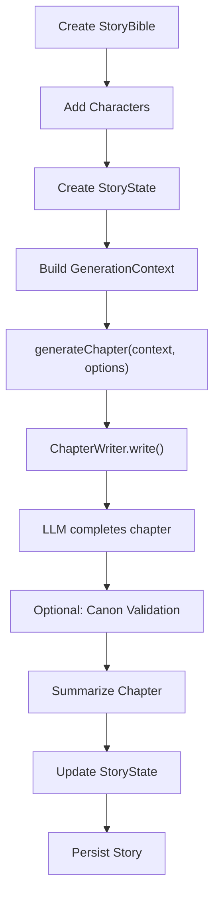
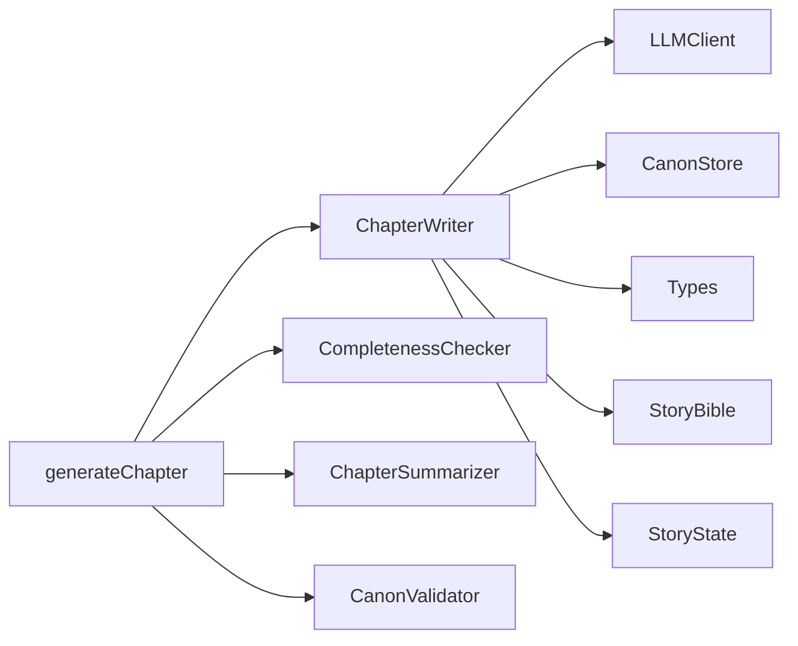

# Writer Agent

<cite>
**Referenced Files in This Document**
- [writer.ts](file://packages/engine/src/agents/writer.ts)
- [writer.md](file://packages/engine/src/llm/prompts/writer.md)
- [generateChapter.ts](file://packages/engine/src/pipeline/generateChapter.ts)
- [bible.ts](file://packages/engine/src/story/bible.ts)
- [state.ts](file://packages/engine/src/story/state.ts)
- [client.ts](file://packages/engine/src/llm/client.ts)
- [types/index.ts](file://packages/engine/src/types/index.ts)
- [canonStore.ts](file://packages/engine/src/memory/canonStore.ts)
- [completeness.ts](file://packages/engine/src/agents/completeness.ts)
- [summarizer.ts](file://packages/engine/src/agents/summarizer.ts)
- [canonValidator.ts](file://packages/engine/src/agents/canonValidator.ts)
- [generate.ts](file://apps/cli/src/commands/generate.ts)
- [continue.ts](file://apps/cli/src/commands/continue.ts)
- [simple.test.ts](file://packages/engine/src/test/simple.test.ts)
</cite>

## Table of Contents
1. [Introduction](#introduction)
2. [Project Structure](#project-structure)
3. [Core Components](#core-components)
4. [Architecture Overview](#architecture-overview)
5. [Detailed Component Analysis](#detailed-component-analysis)
6. [Dependency Analysis](#dependency-analysis)
7. [Performance Considerations](#performance-considerations)
8. [Troubleshooting Guide](#troubleshooting-guide)
9. [Conclusion](#conclusion)
10. [Appendices](#appendices)

## Introduction
This document provides comprehensive documentation for the Writer Agent responsible for chapter creation and narrative prose generation. It details the ChapterWriter class implementation, including prompt construction, context processing, and LLM integration patterns. It explains the writing workflow from story bible processing to chapter completion, including character integration, tone maintenance, and goal-oriented writing. It also covers the chapter continuation mechanism, title extraction logic, and word count management. Practical examples of prompt template usage, parameter configuration, and output formatting are included, along with guidelines for enforcing writing standards, maintaining narrative consistency, and optimizing performance.

## Project Structure
The Writer Agent resides in the engine package and integrates with supporting modules for story management, memory, LLM providers, and quality checks. The CLI commands orchestrate chapter generation and continuation.



**Diagram sources**
- [writer.ts](file://packages/engine/src/agents/writer.ts#L1-L146)
- [generateChapter.ts](file://packages/engine/src/pipeline/generateChapter.ts#L1-L76)
- [bible.ts](file://packages/engine/src/story/bible.ts#L1-L73)
- [state.ts](file://packages/engine/src/story/state.ts#L1-L30)
- [canonStore.ts](file://packages/engine/src/memory/canonStore.ts#L1-L134)
- [completeness.ts](file://packages/engine/src/agents/completeness.ts#L1-L56)
- [summarizer.ts](file://packages/engine/src/agents/summarizer.ts#L1-L64)
- [canonValidator.ts](file://packages/engine/src/agents/canonValidator.ts#L1-L59)
- [client.ts](file://packages/engine/src/llm/client.ts#L1-L106)
- [types/index.ts](file://packages/engine/src/types/index.ts#L1-L90)
- [generate.ts](file://apps/cli/src/commands/generate.ts#L1-L55)
- [continue.ts](file://apps/cli/src/commands/continue.ts#L1-L52)
- [simple.test.ts](file://packages/engine/src/test/simple.test.ts#L1-L73)

**Section sources**
- [writer.ts](file://packages/engine/src/agents/writer.ts#L1-L146)
- [generateChapter.ts](file://packages/engine/src/pipeline/generateChapter.ts#L1-L76)
- [client.ts](file://packages/engine/src/llm/client.ts#L1-L106)
- [types/index.ts](file://packages/engine/src/types/index.ts#L1-L90)

## Core Components
- ChapterWriter: Orchestrates prompt construction, LLM invocation, continuation logic, title extraction, and word count computation.
- LLMClient: Provides unified access to multiple LLM providers with configurable defaults and runtime overrides.
- Generation Pipeline: Coordinates chapter generation, completeness checks, canonical validation, and summarization.
- Story Management: StoryBible and StoryState define the narrative context and progression state.
- Memory: CanonStore maintains canonical facts for consistency checks.
- Quality Agents: CompletenessChecker, CanonValidator, and ChapterSummarizer enforce quality and coherence.

**Section sources**
- [writer.ts](file://packages/engine/src/agents/writer.ts#L48-L146)
- [client.ts](file://packages/engine/src/llm/client.ts#L31-L106)
- [generateChapter.ts](file://packages/engine/src/pipeline/generateChapter.ts#L20-L76)
- [bible.ts](file://packages/engine/src/story/bible.ts#L3-L26)
- [state.ts](file://packages/engine/src/story/state.ts#L3-L24)
- [canonStore.ts](file://packages/engine/src/memory/canonStore.ts#L17-L58)
- [completeness.ts](file://packages/engine/src/agents/completeness.ts#L30-L56)
- [summarizer.ts](file://packages/engine/src/agents/summarizer.ts#L17-L64)
- [canonValidator.ts](file://packages/engine/src/agents/canonValidator.ts#L31-L59)

## Architecture Overview
The Writer Agent follows a modular architecture:
- Input: GenerationContext (bible, state, chapterNumber, targetWordCount)
- Prompt Construction: Uses a structured template with placeholders for story elements, characters, recent summaries, chapter goal, and writing guidelines
- LLM Integration: Delegates to LLMClient, which selects provider based on environment configuration
- Output Processing: Extracts title, computes word count, and returns WriterOutput
- Continuation Loop: Repeatedly checks completeness and continues until satisfied or attempts exhausted
- Quality Assurance: Validates against canonical facts and summarizes chapter content

```mermaid
sequenceDiagram
participant CLI as "CLI Commands"
participant Gen as "generateChapter"
participant Writer as "ChapterWriter"
participant LLM as "LLMClient"
participant Check as "CompletenessChecker"
participant Sum as "ChapterSummarizer"
participant Can as "CanonValidator"
CLI->>Gen : "generateChapter(context, options)"
Gen->>Writer : "write(context, canon)"
Writer->>Writer : "build prompt from template"
Writer->>LLM : "complete(prompt, config)"
LLM-->>Writer : "chapter content"
Writer->>Writer : "extractTitle(content)"
Writer->>Writer : "compute wordCount"
Writer-->>Gen : "WriterOutput"
loop "until complete or attempts exhausted"
Gen->>Check : "check(content)"
alt "incomplete"
Gen->>Writer : "continue(existingContent, context)"
Writer->>LLM : "complete(continuation prompt)"
LLM-->>Writer : "additional content"
Writer-->>Gen : "merged content"
else "complete"
break
end
end
alt "validateCanon"
Gen->>Can : "validate(content, canon)"
Can-->>Gen : "violations"
end
Gen->>Sum : "summarize(content, chapterNumber)"
Sum-->>Gen : "summary"
Gen-->>CLI : "GenerateChapterResult"
```

**Diagram sources**
- [generateChapter.ts](file://packages/engine/src/pipeline/generateChapter.ts#L20-L76)
- [writer.ts](file://packages/engine/src/agents/writer.ts#L55-L117)
- [client.ts](file://packages/engine/src/llm/client.ts#L78-L81)
- [completeness.ts](file://packages/engine/src/agents/completeness.ts#L37-L52)
- [summarizer.ts](file://packages/engine/src/agents/summarizer.ts#L24-L38)
- [canonValidator.ts](file://packages/engine/src/agents/canonValidator.ts#L32-L55)

## Detailed Component Analysis

### ChapterWriter Implementation
The ChapterWriter class encapsulates the entire writing workflow:
- Prompt Template: A structured template defines story elements, characters, recent summaries, chapter goal, and writing guidelines
- Context Processing: Builds prompt sections from StoryBible, StoryState, and optional CanonStore
- LLM Integration: Invokes getLLM().complete with tuned parameters for creativity and token limits
- Continuation Mechanism: Generates a continuation prompt to extend existing content without repetition
- Title Extraction: Heuristically extracts title from the first few lines
- Word Count Management: Computes word count from the generated content



**Diagram sources**
- [writer.ts](file://packages/engine/src/agents/writer.ts#L48-L146)
- [client.ts](file://packages/engine/src/llm/client.ts#L31-L106)
- [canonStore.ts](file://packages/engine/src/memory/canonStore.ts#L101-L129)

**Section sources**
- [writer.ts](file://packages/engine/src/agents/writer.ts#L48-L146)
- [writer.md](file://packages/engine/src/llm/prompts/writer.md#L1-L38)

### Prompt Construction and Context Processing
- Story Bible Elements: Title, theme, genre, setting, tone, premise
- Characters: Name, role, personality traits, goals
- Recent Chapter Summaries: Last three summaries formatted as chapter-numbered entries
- Chapter Goal: Inferred based on story progress (establishment, development, escalation, resolution)
- Writing Guidelines: Perspective, style, voice consistency, goal alignment, stopping point, target word count
- Canonical Facts: Formatted sections for characters, world, and plot



**Diagram sources**
- [writer.ts](file://packages/engine/src/agents/writer.ts#L55-L83)
- [writer.md](file://packages/engine/src/llm/prompts/writer.md#L6-L37)
- [canonStore.ts](file://packages/engine/src/memory/canonStore.ts#L101-L129)

**Section sources**
- [writer.ts](file://packages/engine/src/agents/writer.ts#L55-L83)
- [writer.md](file://packages/engine/src/llm/prompts/writer.md#L6-L37)

### Chapter Continuation Mechanism
The continuation mechanism ensures chapters reach a natural stopping point:
- Continuation Prompt: Requests continuation without repeating existing content
- Natural Ending: Encourages continuation from the last sentence
- Iterative Completion: Repeats until completeness or max attempts reached
- Word Count Recalculation: Updates word count after each continuation

```mermaid
sequenceDiagram
participant Gen as "generateChapter"
participant Writer as "ChapterWriter"
participant LLM as "LLMClient"
participant Check as "CompletenessChecker"
Gen->>Writer : "write(context, canon)"
Writer->>LLM : "complete(full prompt)"
LLM-->>Writer : "initial content"
loop "while incomplete and attempts remain"
Gen->>Check : "check(content)"
alt "incomplete"
Gen->>Writer : "continue(existingContent, context)"
Writer->>LLM : "complete(continuation prompt)"
LLM-->>Writer : "additional content"
Writer-->>Gen : "merged content"
else "complete"
break
end
end
```

**Diagram sources**
- [generateChapter.ts](file://packages/engine/src/pipeline/generateChapter.ts#L32-L43)
- [writer.ts](file://packages/engine/src/agents/writer.ts#L96-L117)
- [completeness.ts](file://packages/engine/src/agents/completeness.ts#L37-L52)

**Section sources**
- [generateChapter.ts](file://packages/engine/src/pipeline/generateChapter.ts#L32-L43)
- [writer.ts](file://packages/engine/src/agents/writer.ts#L96-L117)

### Title Extraction Logic
Title extraction uses heuristics to detect chapter titles:
- Scans the first ten lines of content
- Recognizes markdown-style headings or lines starting with "Chapter"
- Strips formatting and trims whitespace
- Falls back to a default title if none found

**Section sources**
- [writer.ts](file://packages/engine/src/agents/writer.ts#L133-L142)

### Word Count Management
Word count computation:
- Splits content by whitespace to estimate word count
- Updated after initial generation and after each continuation
- Used for progress tracking and compliance with target word counts

**Section sources**
- [writer.ts](file://packages/engine/src/agents/writer.ts#L90-L91)
- [generateChapter.ts](file://packages/engine/src/pipeline/generateChapter.ts#L40-L41)

### Writing Workflow from Story Bible to Chapter Completion
The workflow integrates story elements, character profiles, and narrative state:
- StoryBible: Defines core story elements and target chapters
- StoryState: Tracks current chapter, total chapters, and recent summaries
- Chapter Goal Inference: Progress-based goals guide narrative direction
- Canonical Integration: Optional CanonStore enforces continuity
- Quality Checks: Completeness, summarization, and canonical validation



**Diagram sources**
- [bible.ts](file://packages/engine/src/story/bible.ts#L3-L26)
- [state.ts](file://packages/engine/src/story/state.ts#L3-L24)
- [generateChapter.ts](file://packages/engine/src/pipeline/generateChapter.ts#L20-L76)
- [writer.ts](file://packages/engine/src/agents/writer.ts#L55-L94)
- [canonValidator.ts](file://packages/engine/src/agents/canonValidator.ts#L32-L55)
- [summarizer.ts](file://packages/engine/src/agents/summarizer.ts#L24-L38)

**Section sources**
- [bible.ts](file://packages/engine/src/story/bible.ts#L3-L26)
- [state.ts](file://packages/engine/src/story/state.ts#L3-L24)
- [generateChapter.ts](file://packages/engine/src/pipeline/generateChapter.ts#L20-L76)
- [writer.ts](file://packages/engine/src/agents/writer.ts#L119-L131)

### LLM Integration Patterns
- Provider Abstraction: LLMClient supports OpenAI and DeepSeek providers
- Environment Configuration: Provider, API keys, and model selection via environment variables
- Default Config: Centralized defaults with per-call overrides
- JSON Mode: Specialized method for structured outputs with strict parsing

**Section sources**
- [client.ts](file://packages/engine/src/llm/client.ts#L31-L106)
- [writer.ts](file://packages/engine/src/agents/writer.ts#L85-L88)

### Practical Examples and Parameter Configuration
- CLI Usage: The CLI commands demonstrate how to construct GenerationContext and invoke generateChapter
- Test Usage: The test suite shows end-to-end generation with StoryBible, StoryState, and CanonStore
- Parameter Tuning: Temperature and maxTokens are set for balanced creativity and output length

Examples:
- CLI generate command constructs a GenerationContext with targetWordCount and invokes generateChapter
- CLI continue command loops through remaining chapters, persisting progress
- Test demonstrates minimal configuration for quick iteration

**Section sources**
- [generate.ts](file://apps/cli/src/commands/generate.ts#L21-L26)
- [continue.ts](file://apps/cli/src/commands/continue.ts#L25-L30)
- [simple.test.ts](file://packages/engine/src/test/simple.test.ts#L48-L53)

### Output Formatting and Data Models
- WriterOutput: Standardized structure for chapter content, title, and word count
- Chapter: Final chapter entity with metadata and timestamps
- GenerationContext: Input contract for the generation pipeline
- Types: Strong typing for story elements, state, and LLM configuration

**Section sources**
- [types/index.ts](file://packages/engine/src/types/index.ts#L67-L71)
- [types/index.ts](file://packages/engine/src/types/index.ts#L33-L42)
- [types/index.ts](file://packages/engine/src/types/index.ts#L60-L65)

## Dependency Analysis
The Writer Agent has clear, focused dependencies:
- Direct Dependencies: LLMClient, CanonStore, GenerationContext, WriterOutput
- Indirect Dependencies: StoryBible, StoryState, and quality agents
- Coupling: Low to moderate; ChapterWriter depends on LLMClient and CanonStore, but remains cohesive around writing tasks



**Diagram sources**
- [writer.ts](file://packages/engine/src/agents/writer.ts#L1-L4)
- [generateChapter.ts](file://packages/engine/src/pipeline/generateChapter.ts#L1-L6)
- [types/index.ts](file://packages/engine/src/types/index.ts#L1-L90)

**Section sources**
- [writer.ts](file://packages/engine/src/agents/writer.ts#L1-L4)
- [generateChapter.ts](file://packages/engine/src/pipeline/generateChapter.ts#L1-L6)

## Performance Considerations
- Token Limits: Adjust maxTokens based on chapter length targets and provider capabilities
- Temperature Tuning: Higher temperatures increase creativity but may reduce coherence; balance for narrative consistency
- Continuation Attempts: Limit maxContinuationAttempts to prevent runaway token usage
- Prompt Size Management: Trim recent summaries and limit character lists for long stories
- Provider Selection: Choose providers aligned with cost and latency requirements
- Caching: Consider caching repeated canonical facts and frequently used story elements

## Troubleshooting Guide
Common issues and resolutions:
- Incomplete Chapters: Increase maxContinuationAttempts or adjust targetWordCount
- Title Extraction Failures: Ensure chapter content starts with a clear title or heading
- Canonical Violations: Review CanonStore facts and refine character/world/plot attributes
- LLM Provider Errors: Verify environment variables and model availability
- JSON Parsing Errors: Use completeJSON for structured outputs and validate provider support

**Section sources**
- [generateChapter.ts](file://packages/engine/src/pipeline/generateChapter.ts#L14-L18)
- [writer.ts](file://packages/engine/src/agents/writer.ts#L133-L142)
- [canonValidator.ts](file://packages/engine/src/agents/canonValidator.ts#L49-L54)
- [client.ts](file://packages/engine/src/llm/client.ts#L78-L95)

## Conclusion
The Writer Agent provides a robust, extensible framework for automated chapter generation. Its modular design enables clear separation of concerns, while integrated quality checks ensure narrative consistency and completeness. By leveraging structured prompts, canonical memory, and iterative continuation, it produces coherent, goal-oriented prose that aligns with story goals and maintains stylistic guidelines.

## Appendices
- Prompt Templates: The writer prompt template and related templates define the structure for story elements, characters, goals, and guidelines
- CLI Integration: Commands demonstrate practical usage patterns for single and batch generation
- Testing Patterns: The test suite illustrates end-to-end generation with minimal configuration

**Section sources**
- [writer.md](file://packages/engine/src/llm/prompts/writer.md#L1-L38)
- [generate.ts](file://apps/cli/src/commands/generate.ts#L1-L55)
- [continue.ts](file://apps/cli/src/commands/continue.ts#L1-L52)
- [simple.test.ts](file://packages/engine/src/test/simple.test.ts#L1-L73)