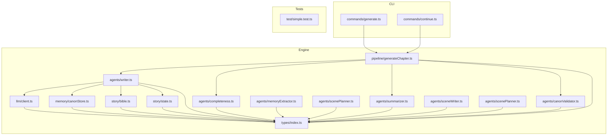
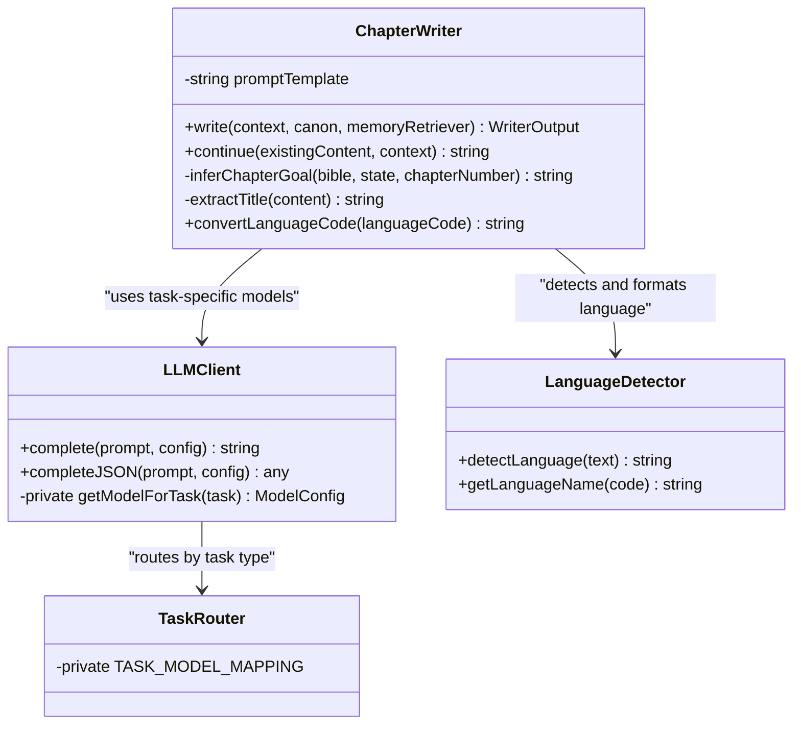
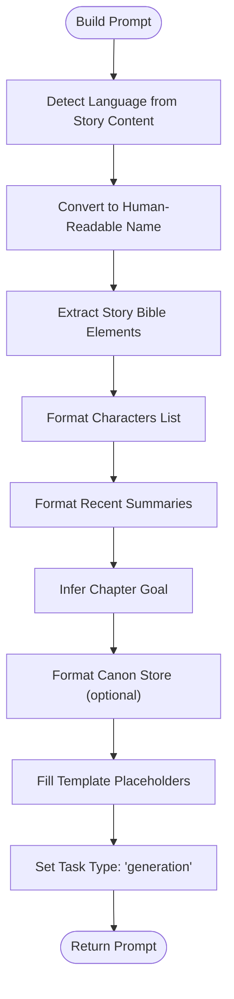
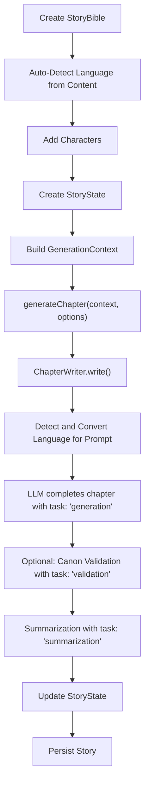
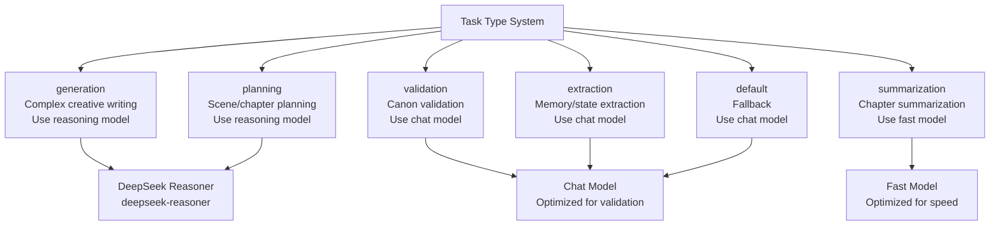
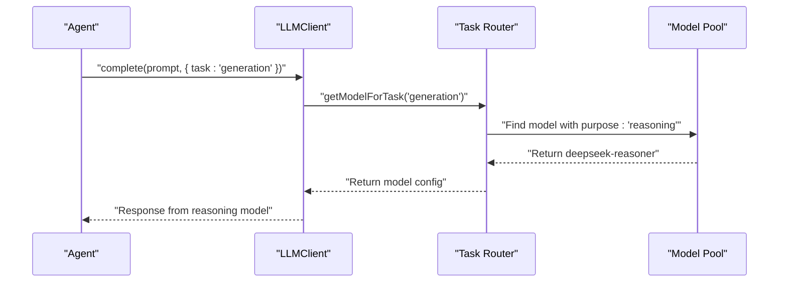
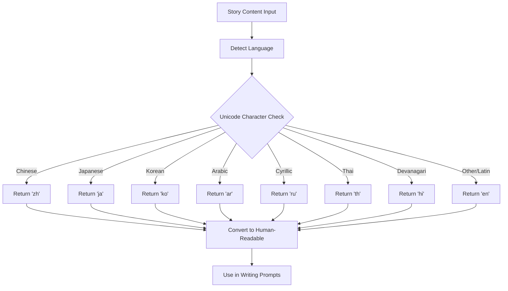
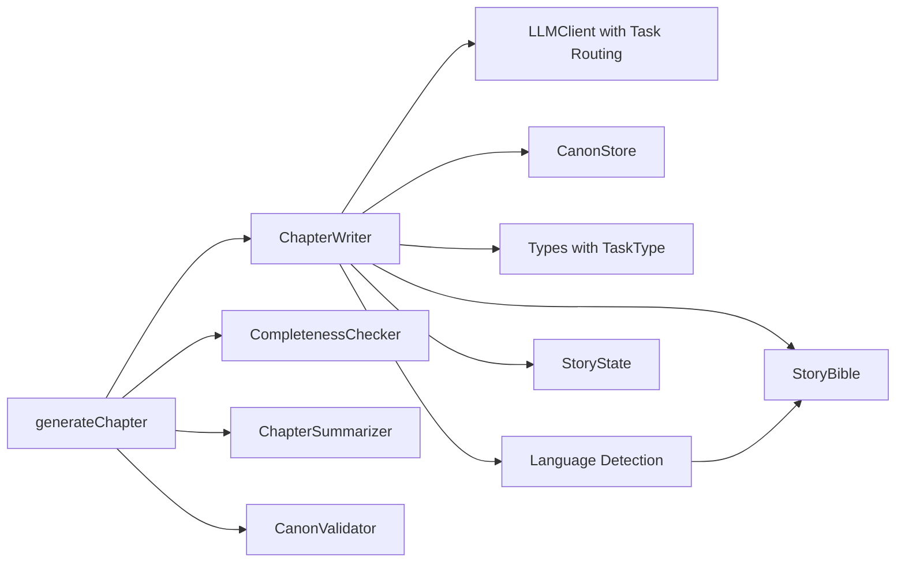

# Writer Agent

<cite>
**Referenced Files in This Document**
- [writer.ts](file://packages/engine/src/agents/writer.ts)
- [client.ts](file://packages/engine/src/llm/client.ts)
- [types/index.ts](file://packages/engine/src/types/index.ts)
- [generateChapter.ts](file://packages/engine/src/pipeline/generateChapter.ts)
- [bible.ts](file://packages/engine/src/story/bible.ts)
- [state.ts](file://packages/engine/src/story/state.ts)
- [summarizer.ts](file://packages/engine/src/agents/summarizer.ts)
- [canonValidator.ts](file://packages/engine/src/agents/canonValidator.ts)
- [memoryExtractor.ts](file://packages/engine/src/agents/memoryExtractor.ts)
- [scenePlanner.ts](file://packages/engine/src/agents/scenePlanner.ts)
- [completeness.ts](file://packages/engine/src/agents/completeness.ts)
- [sceneWriter.ts](file://packages/engine/src/agents/sceneWriter.ts)
- [scenePlanner.ts](file://packages/engine/src/agents/scenePlanner.ts)
- [generate.ts](file://apps/cli/src/commands/generate.ts)
- [continue.ts](file://apps/cli/src/commands/continue.ts)
- [simple.test.ts](file://packages/engine/src/test/simple.test.ts)
</cite>

## Update Summary
**Changes Made**
- Enhanced LLM integration with task-specific model selection for optimal performance
- Added comprehensive task type system with dedicated model purposes
- Updated Writer Agent to use reasoning models for complex narrative construction
- Integrated multi-model configuration supporting different task categories
- Improved model routing based on task requirements and complexity
- **Added language-specific writing instructions**: ChapterWriter now includes language requirements in writing prompts, ensuring generated content maintains consistency with detected language

## Table of Contents
1. [Introduction](#introduction)
2. [Project Structure](#project-structure)
3. [Core Components](#core-components)
4. [Architecture Overview](#architecture-overview)
5. [Detailed Component Analysis](#detailed-component-analysis)
6. [Task-Specific Model Selection](#task-specific-model-selection)
7. [Language-Specific Writing Instructions](#language-specific-writing-instructions)
8. [Dependency Analysis](#dependency-analysis)
9. [Performance Considerations](#performance-considerations)
10. [Troubleshooting Guide](#troubleshooting-guide)
11. [Conclusion](#conclusion)
12. [Appendices](#appendices)

## Introduction
This document provides comprehensive documentation for the Writer Agent responsible for chapter creation and narrative prose generation. It details the ChapterWriter class implementation, including prompt construction, context processing, and LLM integration patterns with enhanced task-specific model selection. It explains the writing workflow from story bible processing to chapter completion, including character integration, tone maintenance, and goal-oriented writing. It also covers the chapter continuation mechanism, title extraction logic, and word count management. Practical examples of prompt template usage, parameter configuration, and output formatting are included, along with guidelines for enforcing writing standards, maintaining narrative consistency, and optimizing performance through intelligent model selection.

**Updated** Enhanced with language-specific writing instructions that ensure generated content maintains consistency with detected language requirements.

## Project Structure
The Writer Agent resides in the engine package and integrates with supporting modules for story management, memory, LLM providers, and quality checks. The CLI commands orchestrate chapter generation and continuation. The enhanced architecture now includes task-specific model routing for optimal performance across different operations and automatic language detection for multilingual support.



**Diagram sources**
- [writer.ts:1-176](file://packages/engine/src/agents/writer.ts#L1-L176)
- [generateChapter.ts:1-290](file://packages/engine/src/pipeline/generateChapter.ts#L1-L290)
- [client.ts:1-200](file://packages/engine/src/llm/client.ts#L1-L200)
- [types/index.ts:1-152](file://packages/engine/src/types/index.ts#L1-L152)

**Section sources**
- [writer.ts:1-176](file://packages/engine/src/agents/writer.ts#L1-L176)
- [generateChapter.ts:1-290](file://packages/engine/src/pipeline/generateChapter.ts#L1-L290)
- [client.ts:1-200](file://packages/engine/src/llm/client.ts#L1-L200)
- [types/index.ts:1-152](file://packages/engine/src/types/index.ts#L1-L152)

## Core Components
- ChapterWriter: Orchestrates prompt construction, LLM invocation with task-specific models, continuation logic, title extraction, and word count computation with language-specific writing instructions.
- LLMClient: Provides unified access to multiple LLM providers with configurable defaults and runtime overrides, featuring intelligent task-specific model routing.
- Generation Pipeline: Coordinates chapter generation, completeness checks, canonical validation, and summarization with optimized model selection.
- Story Management: StoryBible and StoryState define the narrative context and progression state with automatic language detection.
- Memory: CanonStore maintains canonical facts for consistency checks.
- Quality Agents: CompletenessChecker, CanonValidator, ChapterSummarizer, and MemoryExtractor enforce quality and coherence using appropriate model types.
- Task Type System: Comprehensive task classification system enabling optimal model selection for different operations.
- Language Detection: Automatic language detection and conversion to human-readable names for multilingual support.

**Updated** Added language detection and automatic language name conversion for multilingual story support.

**Section sources**
- [writer.ts:54-176](file://packages/engine/src/agents/writer.ts#L54-L176)
- [client.ts:49-200](file://packages/engine/src/llm/client.ts#L49-L200)
- [generateChapter.ts:33-290](file://packages/engine/src/pipeline/generateChapter.ts#L33-L290)
- [types/index.ts:107-113](file://packages/engine/src/types/index.ts#L107-L113)
- [bible.ts:8-72](file://packages/engine/src/story/bible.ts#L8-L72)

## Architecture Overview
The Writer Agent follows a modular architecture with enhanced task-specific model selection and language-specific writing instructions:
- Input: GenerationContext (bible, state, chapterNumber, targetWordCount)
- Prompt Construction: Uses a structured template with placeholders for story elements, characters, recent summaries, chapter goal, writing guidelines, and language requirements
- Task-Specific LLM Integration: Delegates to LLMClient with automatic model selection based on task requirements
- Language Processing: Automatically detects language from story content and converts to human-readable names for prompts
- Output Processing: Extracts title, computes word count, and returns WriterOutput
- Continuation Loop: Repeatedly checks completeness and continues until satisfied or attempts exhausted
- Quality Assurance: Validates against canonical facts and summarizes chapter content using appropriate model types

```mermaid
sequenceDiagram
participant CLI as "CLI Commands"
participant Gen as "generateChapter"
participant Writer as "ChapterWriter"
participant Lang as "Language Detection"
participant LLM as "LLMClient"
participant Router as "Task Router"
participant Check as "CompletenessChecker"
participant Sum as "ChapterSummarizer"
participant Can as "CanonValidator"
CLI->>Gen : "generateChapter(context, options)"
Gen->>Writer : "write(context, canon)"
Writer->>Lang : "detect language from story content"
Lang-->>Writer : "language code (e.g., 'zh', 'en', 'ja')"
Writer->>Writer : "convert to human-readable name"
Writer->>Writer : "build prompt with language requirements"
Writer->>LLM : "complete(prompt, config with task : 'generation')"
LLM->>Router : "getModelForTask('generation')"
Router-->>LLM : "return reasoning model"
LLM-->>Writer : "chapter content in detected language"
Writer->>Writer : "extractTitle(content)"
Writer->>Writer : "compute wordCount"
Writer-->>Gen : "WriterOutput"
loop "until complete or attempts exhausted"
Gen->>Check : "check(content)"
alt "incomplete"
Gen->>Writer : "continue(existingContent, context)"
Writer->>LLM : "complete(continuation prompt, task : 'generation')"
LLM->>Router : "getModelForTask('generation')"
Router-->>LLM : "return reasoning model"
LLM-->>Writer : "additional content"
Writer-->>Gen : "merged content"
else "complete"
break
end
end
alt "validateCanon"
Gen->>Can : "validate(content, canon)"
Can->>LLM : "complete(prompt, task : 'validation')"
LLM->>Router : "getModelForTask('validation')"
Router-->>LLM : "return chat model"
Can-->>Gen : "violations"
end
Gen->>Sum : "summarize(content, chapterNumber)"
Sum->>LLM : "complete(prompt, task : 'summarization')"
LLM->>Router : "getModelForTask('summarization')"
Router-->>LLM : "return fast model"
Sum-->>Gen : "summary"
Gen-->>CLI : "GenerateChapterResult"
```

**Diagram sources**
- [generateChapter.ts:224-284](file://packages/engine/src/pipeline/generateChapter.ts#L224-L284)
- [writer.ts:103-136](file://packages/engine/src/agents/writer.ts#L103-L136)
- [client.ts:113-147](file://packages/engine/src/llm/client.ts#L113-L147)
- [completeness.ts:37-52](file://packages/engine/src/agents/completeness.ts#L37-L52)
- [summarizer.ts:24-39](file://packages/engine/src/agents/summarizer.ts#L24-L39)
- [canonValidator.ts:44-48](file://packages/engine/src/agents/canonValidator.ts#L44-L48)
- [bible.ts:8-72](file://packages/engine/src/story/bible.ts#L8-L72)

## Detailed Component Analysis

### ChapterWriter Implementation
The ChapterWriter class encapsulates the entire writing workflow with enhanced task-specific model selection and language-specific writing instructions:
- Prompt Template: A structured template defines story elements, characters, recent summaries, chapter goal, writing guidelines, and language requirements
- Context Processing: Builds prompt sections from StoryBible, StoryState, and optional CanonStore with automatic language detection
- Language Integration: Converts language codes to human-readable names (e.g., 'zh' → 'Chinese', 'ja' → 'Japanese')
- Task-Specific LLM Integration: Invokes getLLM().complete with task: 'generation' parameter for optimal reasoning model selection
- Continuation Mechanism: Generates a continuation prompt to extend existing content without repetition using the same task-specific approach
- Title Extraction: Heuristically extracts title from the first few lines
- Word Count Management: Computes word count from the generated content



**Diagram sources**
- [writer.ts:54-176](file://packages/engine/src/agents/writer.ts#L54-L176)
- [client.ts:113-125](file://packages/engine/src/llm/client.ts#L113-L125)
- [bible.ts:8-72](file://packages/engine/src/story/bible.ts#L8-L72)

**Section sources**
- [writer.ts:54-176](file://packages/engine/src/agents/writer.ts#L54-L176)
- [client.ts:113-125](file://packages/engine/src/llm/client.ts#L113-L125)
- [bible.ts:8-72](file://packages/engine/src/story/bible.ts#L8-L72)

### Prompt Construction and Context Processing
- Story Bible Elements: Title, theme, genre, setting, tone, language, premise
- Characters: Name, role, personality traits, goals
- Recent Chapter Summaries: Last three summaries formatted as chapter-numbered entries
- Chapter Goal: Inferred based on story progress (establishment, development, escalation, resolution)
- Writing Guidelines: Perspective, style, voice consistency, goal alignment, stopping point, target word count, language requirements
- Canonical Facts: Formatted sections for characters, world, and plot
- Language Requirements: Automatic conversion of language codes to human-readable names for consistent writing



**Diagram sources**
- [writer.ts:61-111](file://packages/engine/src/agents/writer.ts#L61-L111)
- [client.ts:39-47](file://packages/engine/src/llm/client.ts#L39-L47)
- [bible.ts:8-72](file://packages/engine/src/story/bible.ts#L8-L72)

**Section sources**
- [writer.ts:61-111](file://packages/engine/src/agents/writer.ts#L61-L111)

### Chapter Continuation Mechanism
The continuation mechanism ensures chapters reach a natural stopping point using task-specific model selection:
- Continuation Prompt: Requests continuation without repeating existing content
- Natural Ending: Encourages continuation from the last sentence
- Task-Specific Continuation: Uses task: 'generation' for optimal reasoning model during continuation
- Iterative Completion: Repeats until completeness or max attempts reached
- Word Count Recalculation: Updates word count after each continuation

```mermaid
sequenceDiagram
participant Gen as "generateChapter"
participant Writer as "ChapterWriter"
participant LLM as "LLMClient"
participant Router as "Task Router"
participant Check as "CompletenessChecker"
Gen->>Writer : "write(context, canon)"
Writer->>LLM : "complete(full prompt, task : 'generation')"
LLM->>Router : "getModelForTask('generation')"
Router-->>LLM : "return reasoning model"
LLM-->>Writer : "initial content"
loop "while incomplete and attempts remain"
Gen->>Check : "check(content)"
alt "incomplete"
Gen->>Writer : "continue(existingContent, context)"
Writer->>LLM : "complete(continuation prompt, task : 'generation')"
LLM->>Router : "getModelForTask('generation')"
Router-->>LLM : "return reasoning model"
LLM-->>Writer : "additional content"
Writer-->>Gen : "merged content"
else "complete"
break
end
end
```

**Diagram sources**
- [generateChapter.ts:227-238](file://packages/engine/src/pipeline/generateChapter.ts#L227-L238)
- [writer.ts:125-147](file://packages/engine/src/agents/writer.ts#L125-L147)
- [client.ts:113-125](file://packages/engine/src/llm/client.ts#L113-L125)

**Section sources**
- [generateChapter.ts:227-238](file://packages/engine/src/pipeline/generateChapter.ts#L227-L238)
- [writer.ts:125-147](file://packages/engine/src/agents/writer.ts#L125-L147)

### Title Extraction Logic
Title extraction uses heuristics to detect chapter titles:
- Scans the first ten lines of content
- Recognizes markdown-style headings or lines starting with "Chapter"
- Strips formatting and trims whitespace
- Falls back to a default title if none found

**Section sources**
- [writer.ts:163-172](file://packages/engine/src/agents/writer.ts#L163-L172)

### Word Count Management
Word count computation:
- Splits content by whitespace to estimate word count
- Updated after initial generation and after each continuation
- Used for progress tracking and compliance with target word counts

**Section sources**
- [writer.ts:119-120](file://packages/engine/src/agents/writer.ts#L119-L120)
- [generateChapter.ts:236](file://packages/engine/src/pipeline/generateChapter.ts#L236)

### Writing Workflow from Story Bible to Chapter Completion
The workflow integrates story elements, character profiles, and narrative state with enhanced task-specific model selection and language-specific writing instructions:
- StoryBible: Defines core story elements and target chapters with automatic language detection
- StoryState: Tracks current chapter, total chapters, and recent summaries
- Chapter Goal Inference: Progress-based goals guide narrative direction
- Language Processing: Automatic detection and conversion ensures consistent language usage
- Canonical Integration: Optional CanonStore enforces continuity
- Quality Checks: Completeness, summarization, and canonical validation using appropriate model types
- Task Routing: Automatic model selection ensures optimal performance for each operation



**Diagram sources**
- [bible.ts:74-101](file://packages/engine/src/story/bible.ts#L74-L101)
- [state.ts:1-30](file://packages/engine/src/story/state.ts#L1-L30)
- [generateChapter.ts:224-284](file://packages/engine/src/pipeline/generateChapter.ts#L224-L284)
- [writer.ts:103-112](file://packages/engine/src/agents/writer.ts#L103-L112)
- [client.ts:39-47](file://packages/engine/src/llm/client.ts#L39-L47)

**Section sources**
- [bible.ts:74-101](file://packages/engine/src/story/bible.ts#L74-L101)
- [state.ts:1-30](file://packages/engine/src/story/state.ts#L1-L30)
- [generateChapter.ts:224-284](file://packages/engine/src/pipeline/generateChapter.ts#L224-L284)
- [writer.ts:103-112](file://packages/engine/src/agents/writer.ts#L103-L112)

### LLM Integration Patterns
- Provider Abstraction: LLMClient supports OpenAI and DeepSeek providers
- Environment Configuration: Provider, API keys, and model selection via environment variables
- Task-Specific Model Routing: Automatic model selection based on task requirements
- Default Config: Centralized defaults with per-call overrides
- JSON Mode: Specialized method for structured outputs with strict parsing
- Multi-Model Configuration: Support for different model purposes (reasoning, chat, fast)

**Section sources**
- [client.ts:49-200](file://packages/engine/src/llm/client.ts#L49-L200)
- [writer.ts:113-147](file://packages/engine/src/agents/writer.ts#L113-L147)
- [types/index.ts:91-113](file://packages/engine/src/types/index.ts#L91-L113)

## Task-Specific Model Selection

### Enhanced Task Type System
The system now includes a comprehensive task classification system that enables optimal model selection:



**Diagram sources**
- [client.ts:39-47](file://packages/engine/src/llm/client.ts#L39-L47)
- [types/index.ts:107-113](file://packages/engine/src/types/index.ts#L107-L113)

### Model Purpose Configuration
Each model is configured with a specific purpose that determines its optimal use case:

- **Reasoning Models**: DeepSeek Reasoner (`deepseek-reasoner`) - Optimized for complex narrative construction and creative writing tasks
- **Chat Models**: Standard conversational models - Optimized for validation, extraction, and general tasks
- **Fast Models**: High-throughput models - Optimized for summarization and other speed-critical operations

### Automatic Model Routing
The LLMClient automatically routes tasks to appropriate models based on the task parameter:



**Diagram sources**
- [client.ts:113-125](file://packages/engine/src/llm/client.ts#L113-L125)

**Section sources**
- [client.ts:39-47](file://packages/engine/src/llm/client.ts#L39-L47)
- [client.ts:113-125](file://packages/engine/src/llm/client.ts#L113-L125)
- [types/index.ts:91-113](file://packages/engine/src/types/index.ts#L91-L113)

### Practical Examples and Parameter Configuration
- CLI Usage: The CLI commands demonstrate how to construct GenerationContext and invoke generateChapter with task-specific model selection
- Test Usage: The test suite shows end-to-end generation with StoryBible, StoryState, and CanonStore using optimal models
- Parameter Tuning: Temperature and maxTokens are set for balanced creativity and output length, with task-specific routing

Examples:
- CLI generate command constructs a GenerationContext with targetWordCount and invokes generateChapter using reasoning models for generation tasks
- CLI continue command loops through remaining chapters, persisting progress with optimal model selection
- Test demonstrates minimal configuration for quick iteration with automatic model routing

**Section sources**
- [generate.ts:21-26](file://apps/cli/src/commands/generate.ts#L21-L26)
- [continue.ts:25-30](file://apps/cli/src/commands/continue.ts#L25-L30)
- [simple.test.ts:48-53](file://packages/engine/src/test/simple.test.ts#L48-L53)

### Output Formatting and Data Models
- WriterOutput: Standardized structure for chapter content, title, and word count
- Chapter: Final chapter entity with metadata and timestamps
- GenerationContext: Input contract for the generation pipeline
- Types: Strong typing for story elements, state, and LLM configuration including TaskType enumeration

**Section sources**
- [types/index.ts:67-71](file://packages/engine/src/types/index.ts#L67-L71)
- [types/index.ts:33-42](file://packages/engine/src/types/index.ts#L33-L42)
- [types/index.ts:60-65](file://packages/engine/src/types/index.ts#L60-L65)
- [types/index.ts:107-113](file://packages/engine/src/types/index.ts#L107-L113)

## Language-Specific Writing Instructions

### Automatic Language Detection
The system now includes comprehensive language detection and processing capabilities:

- **Language Detection**: Automatic detection from story title and premise using Unicode character ranges
- **Supported Languages**: Chinese (zh), Japanese (ja), Korean (ko), Arabic (ar), Russian (ru), Thai (th), Hindi (hi), and English (en) as primary languages
- **Fallback Handling**: Defaults to English for unknown or mixed content
- **Human-Readable Names**: Conversion from language codes to readable names for prompts



**Diagram sources**
- [bible.ts:8-50](file://packages/engine/src/story/bible.ts#L8-L50)
- [bible.ts:55-72](file://packages/engine/src/story/bible.ts#L55-L72)
- [writer.ts:104](file://packages/engine/src/agents/writer.ts#L104)

### Language Integration in Writing Prompts
The ChapterWriter now incorporates language requirements throughout the writing process:

- **Story Bible Section**: Language field displays detected language for context
- **Writing Guidelines**: Explicit instruction to write in the detected language
- **Format Requirements**: Clear indication that content should be in the specified language
- **Consistency Enforcement**: Multiple language mentions ensure consistent output

### Language Conversion Logic
The system uses sophisticated conversion logic to handle multiple language scenarios:

- **Direct Mapping**: zh → Chinese, ja → Japanese, ko → Korean, ar → Arabic, ru → Russian, es → Spanish, fr → French, de → German
- **Fallback**: Other languages default to English
- **Prompt Integration**: Human-readable names are used consistently throughout prompts

**Section sources**
- [bible.ts:8-50](file://packages/engine/src/story/bible.ts#L8-L50)
- [bible.ts:55-72](file://packages/engine/src/story/bible.ts#L55-L72)
- [writer.ts:104](file://packages/engine/src/agents/writer.ts#L104)
- [writer.ts:45](file://packages/engine/src/agents/writer.ts#L45)
- [writer.ts:18](file://packages/engine/src/agents/writer.ts#L18)

### Multilingual Support Implementation
The multilingual support extends beyond the ChapterWriter to other components:

- **Scene Planner**: Also includes language requirements in scene breakdowns
- **Scene Writer**: Ensures scene content matches detected language
- **Consistent Language Processing**: All components use the same language detection and conversion logic

**Section sources**
- [scenePlanner.ts:21](file://packages/engine/src/agents/scenePlanner.ts#L21)
- [scenePlanner.ts:33](file://packages/engine/src/agents/scenePlanner.ts#L33)
- [sceneWriter.ts:51](file://packages/engine/src/agents/sceneWriter.ts#L51)
- [sceneWriter.ts:60](file://packages/engine/src/agents/sceneWriter.ts#L60)
- [sceneWriter.ts:62](file://packages/engine/src/agents/sceneWriter.ts#L62)

## Dependency Analysis
The Writer Agent has clear, focused dependencies with enhanced task-specific model routing and language processing:
- Direct Dependencies: LLMClient with task routing, CanonStore, GenerationContext, WriterOutput, Language Detection
- Indirect Dependencies: StoryBible, StoryState, and quality agents with appropriate task types
- Coupling: Low to moderate; ChapterWriter depends on LLMClient with automatic task routing and CanonStore, but remains cohesive around writing tasks
- Language Dependencies: Automatic language detection and conversion for multilingual support

**Updated** Added language detection and conversion dependencies for multilingual support.



**Diagram sources**
- [writer.ts:1-6](file://packages/engine/src/agents/writer.ts#L1-L6)
- [generateChapter.ts:1-14](file://packages/engine/src/pipeline/generateChapter.ts#L1-L14)
- [types/index.ts:107-113](file://packages/engine/src/types/index.ts#L107-L113)
- [bible.ts:8-72](file://packages/engine/src/story/bible.ts#L8-L72)

**Section sources**
- [writer.ts:1-6](file://packages/engine/src/agents/writer.ts#L1-L6)
- [generateChapter.ts:1-14](file://packages/engine/src/pipeline/generateChapter.ts#L1-L14)

## Performance Considerations
- Token Limits: Adjust maxTokens based on chapter length targets and provider capabilities
- Temperature Tuning: Higher temperatures increase creativity but may reduce coherence; balance for narrative consistency
- Task-Specific Optimization: Use reasoning models for complex creative tasks, chat models for validation, and fast models for summarization
- Continuation Attempts: Limit maxContinuationAttempts to prevent runaway token usage
- Prompt Size Management: Trim recent summaries and limit character lists for long stories
- Provider Selection: Choose providers aligned with cost and latency requirements
- Model Routing: Automatic task-based model selection ensures optimal performance for each operation
- Language Processing: Efficient language detection and conversion minimize overhead
- Caching: Consider caching repeated canonical facts and frequently used story elements

**Updated** Added language processing considerations for efficient multilingual support.

## Troubleshooting Guide
Common issues and resolutions:
- Incomplete Chapters: Increase maxContinuationAttempts or adjust targetWordCount
- Title Extraction Failures: Ensure chapter content starts with a clear title or heading
- Canonical Violations: Review CanonStore facts and refine character/world/plot attributes
- LLM Provider Errors: Verify environment variables and model availability
- JSON Parsing Errors: Use completeJSON for structured outputs and validate provider support
- Model Selection Issues: Check task parameter values match available model purposes
- Performance Problems: Verify task-specific models are properly configured and routed
- Language Issues: Ensure language detection is working correctly and language names are properly converted
- Multilingual Content Problems: Verify that detected language matches expected output language

**Updated** Added troubleshooting guidance for language-specific issues.

**Section sources**
- [generateChapter.ts:227-238](file://packages/engine/src/pipeline/generateChapter.ts#L227-L238)
- [writer.ts:163-172](file://packages/engine/src/agents/writer.ts#L163-L172)
- [canonValidator.ts:50-56](file://packages/engine/src/agents/canonValidator.ts#L50-L56)
- [client.ts:113-125](file://packages/engine/src/llm/client.ts#L113-L125)
- [bible.ts:8-72](file://packages/engine/src/story/bible.ts#L8-L72)

## Conclusion
The Writer Agent provides a robust, extensible framework for automated chapter generation with enhanced task-specific model selection and comprehensive language-specific writing instructions. Its modular design enables clear separation of concerns, while integrated quality checks ensure narrative consistency and completeness. The addition of intelligent model routing ensures optimal performance for different operations, from complex creative writing to validation and summarization. The new language detection and conversion capabilities enable multilingual support, ensuring generated content maintains consistency with detected language requirements. By leveraging structured prompts, canonical memory, iterative continuation, task-aware model selection, and automatic language processing, it produces coherent, goal-oriented prose that aligns with story goals and maintains stylistic guidelines across multiple languages.

**Updated** Enhanced conclusion to reflect the new language-specific writing instructions and multilingual capabilities.

## Appendices
- Task Type Enumeration: The TaskType system defines the complete set of supported operations with appropriate model purposes
- Model Configuration: Multi-model setup enables different models for different task categories
- CLI Integration: Commands demonstrate practical usage patterns for single and batch generation with optimal model selection
- Testing Patterns: The test suite illustrates end-to-end generation with minimal configuration and automatic model routing
- Language Detection: Comprehensive language detection system supporting multiple scripts and character sets
- Multilingual Writing: Consistent language requirements integrated throughout the writing pipeline

**Updated** Added language detection and multilingual writing capabilities to appendices.

**Section sources**
- [types/index.ts:107-113](file://packages/engine/src/types/index.ts#L107-L113)
- [client.ts:58-111](file://packages/engine/src/llm/client.ts#L58-L111)
- [generate.ts:1-55](file://apps/cli/src/commands/generate.ts#L1-L55)
- [continue.ts:1-52](file://apps/cli/src/commands/continue.ts#L1-L52)
- [simple.test.ts:1-73](file://packages/engine/src/test/simple.test.ts#L1-L73)
- [bible.ts:8-72](file://packages/engine/src/story/bible.ts#L8-L72)
- [writer.ts:104](file://packages/engine/src/agents/writer.ts#L104)