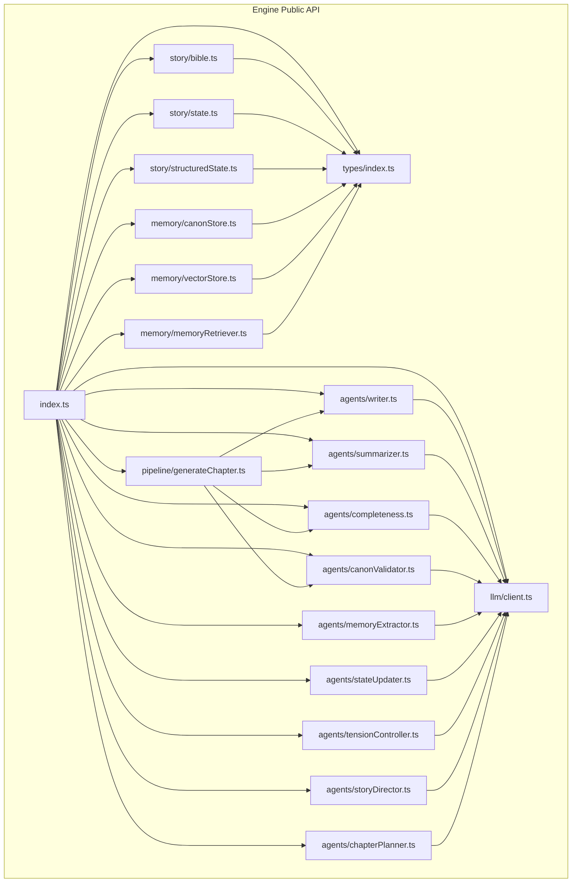
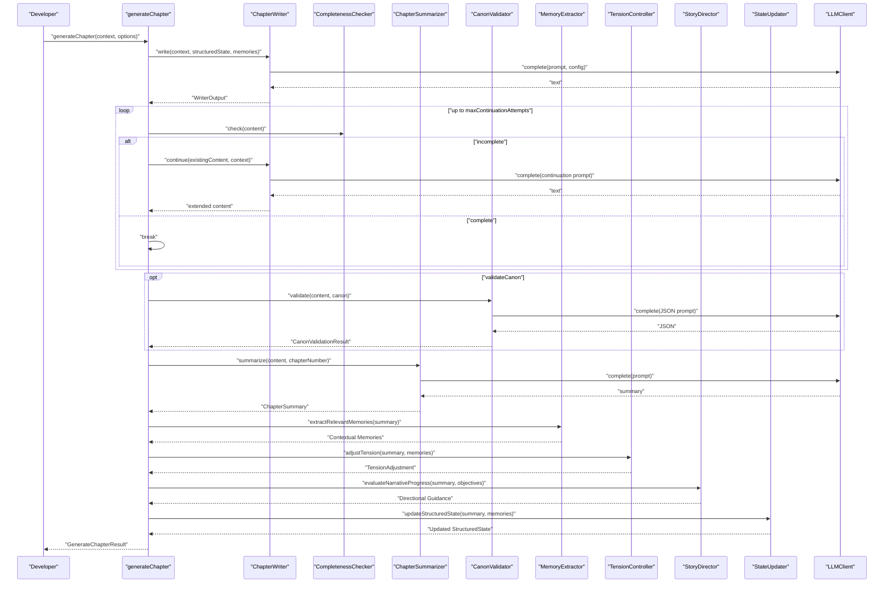
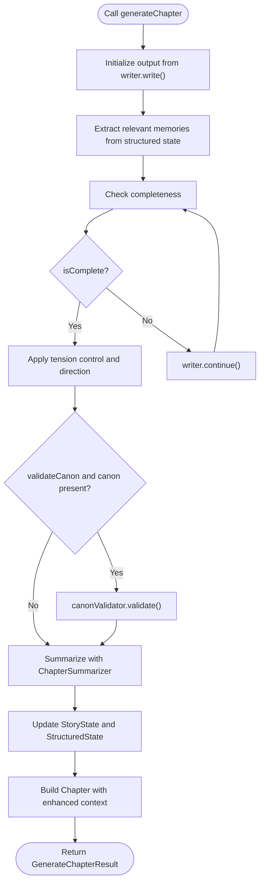
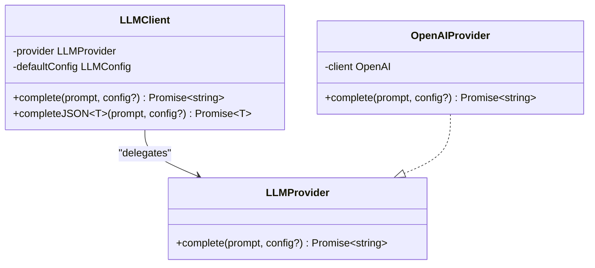
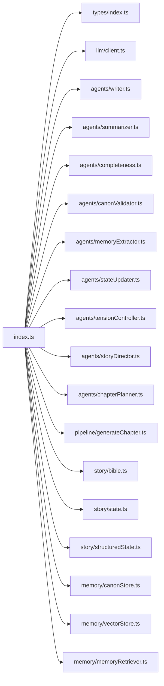

# API Reference

<cite>
**Referenced Files in This Document**
- [index.ts](file://packages/engine/src/index.ts)
- [types/index.ts](file://packages/engine/src/types/index.ts)
- [story/bible.ts](file://packages/engine/src/story/bible.ts)
- [story/state.ts](file://packages/engine/src/story/state.ts)
- [story/structuredState.ts](file://packages/engine/src/story/structuredState.ts)
- [agents/writer.ts](file://packages/engine/src/agents/writer.ts)
- [agents/completeness.ts](file://packages/engine/src/agents/completeness.ts)
- [agents/summarizer.ts](file://packages/engine/src/agents/summarizer.ts)
- [agents/canonValidator.ts](file://packages/engine/src/agents/canonValidator.ts)
- [agents/memoryExtractor.ts](file://packages/engine/src/agents/memoryExtractor.ts)
- [agents/stateUpdater.ts](file://packages/engine/src/agents/stateUpdater.ts)
- [agents/tensionController.ts](file://packages/engine/src/agents/tensionController.ts)
- [agents/storyDirector.ts](file://packages/engine/src/agents/storyDirector.ts)
- [agents/chapterPlanner.ts](file://packages/engine/src/agents/chapterPlanner.ts)
- [pipeline/generateChapter.ts](file://packages/engine/src/pipeline/generateChapter.ts)
- [llm/client.ts](file://packages/engine/src/llm/client.ts)
- [memory/canonStore.ts](file://packages/engine/src/memory/canonStore.ts)
- [memory/vectorStore.ts](file://packages/engine/src/memory/vectorStore.ts)
- [memory/memoryRetriever.ts](file://packages/engine/src/memory/memoryRetriever.ts)
- [test/simple.test.ts](file://packages/engine/src/test/simple.test.ts)
- [package.json](file://packages/engine/package.json)
</cite>

## Update Summary
**Changes Made**
- Added comprehensive documentation for new structured state system with StoryStructuredState, CharacterState, and PlotThreadState
- Documented tension controller functionality including TensionController class and tension management utilities
- Added story director functionality with StoryDirector class and ChapterObjective types
- Included chapter planner functionality with ChapterPlanner and scene planning capabilities
- Enhanced memory system with VectorStore, MemoryRetriever, and advanced memory extraction
- Updated API exposure through unified engine interface with new agent exports

## Table of Contents
1. [Introduction](#introduction)
2. [Project Structure](#project-structure)
3. [Core Components](#core-components)
4. [Architecture Overview](#architecture-overview)
5. [Detailed Component Analysis](#detailed-component-analysis)
6. [Dependency Analysis](#dependency-analysis)
7. [Performance Considerations](#performance-considerations)
8. [Troubleshooting Guide](#troubleshooting-guide)
9. [Conclusion](#conclusion)
10. [Appendices](#appendices)

## Introduction
This document provides a comprehensive API reference for the Narrative Operating System engine package. It covers exported types, interfaces, and classes that form the public surface of the engine. The focus areas include:
- StoryBible and StoryState lifecycle and management
- Structured state system for advanced narrative control
- Agent interfaces and implementations for writing, summarizing, validating, completeness checking, memory extraction, and state updating
- Tension controller for dynamic narrative pacing
- Story director for high-level narrative orchestration
- Chapter planner for scene-level planning
- Pipeline orchestration for chapter generation
- LLM client abstraction and provider configuration
- Memory/canon store and vector memory systems for maintaining story facts
- Practical usage examples and integration guidance

The documentation emphasizes type safety, generic constraints, and interface inheritance patterns, and includes guidance on versioning, backward compatibility, and migration strategies.

## Project Structure
The engine package exposes a comprehensive set of public APIs via a single barrel export. The primary exports now include:
- Types and interfaces for story modeling and structured state management
- LLM client and provider abstractions
- Advanced agents for writing, summarizing, validating, completeness checking, memory extraction, and state updating
- Tension controller for dynamic narrative pacing
- Story director for high-level narrative orchestration
- Chapter planner for scene-level planning
- Pipeline for generating chapters
- Story lifecycle helpers for creating and updating story state
- Enhanced memory systems including vector storage and retrieval
- Canon store for managing story facts

**Diagram sources**
- [index.ts](file://packages/engine/src/index.ts#L1-L68)
- [types/index.ts](file://packages/engine/src/types/index.ts#L1-L90)
- [story/bible.ts](file://packages/engine/src/story/bible.ts#L1-L73)
- [story/state.ts](file://packages/engine/src/story/state.ts#L1-L30)
- [story/structuredState.ts](file://packages/engine/src/story/structuredState.ts#L1-L200)
- [agents/writer.ts](file://packages/engine/src/agents/writer.ts#L1-L146)
- [agents/summarizer.ts](file://packages/engine/src/agents/summarizer.ts#L1-L64)
- [agents/completeness.ts](file://packages/engine/src/agents/completeness.ts#L1-L56)
- [agents/canonValidator.ts](file://packages/engine/src/agents/canonValidator.ts#L1-L59)
- [agents/memoryExtractor.ts](file://packages/engine/src/agents/memoryExtractor.ts#L1-L100)
- [agents/stateUpdater.ts](file://packages/engine/src/agents/stateUpdater.ts#L1-L120)
- [agents/tensionController.ts](file://packages/engine/src/agents/tensionController.ts#L1-L200)
- [agents/storyDirector.ts](file://packages/engine/src/agents/storyDirector.ts#L1-L150)
- [agents/chapterPlanner.ts](file://packages/engine/src/agents/chapterPlanner.ts#L1-L180)
- [pipeline/generateChapter.ts](file://packages/engine/src/pipeline/generateChapter.ts#L1-L76)
- [llm/client.ts](file://packages/engine/src/llm/client.ts#L1-L106)
- [memory/canonStore.ts](file://packages/engine/src/memory/canonStore.ts#L1-L134)
- [memory/vectorStore.ts](file://packages/engine/src/memory/vectorStore.ts#L1-L150)
- [memory/memoryRetriever.ts](file://packages/engine/src/memory/memoryRetriever.ts#L1-L120)

**Section sources**
- [index.ts](file://packages/engine/src/index.ts#L1-L68)

## Core Components
This section documents the primary exported types and functions that define the engine's public API surface, including the new structured state system and advanced agent capabilities.

### Enhanced Story Management
- StoryBible
  - Purpose: Encapsulates the foundational story blueprint including metadata, characters, and plot threads.
  - Key fields: id, title, theme, genre, setting, tone, targetChapters, premise, characters, plotThreads, createdAt, updatedAt.
  - Related functions: createStoryBible, addCharacter, addPlotThread.

- StoryStructuredState
  - Purpose: Advanced structured state management for complex narrative control.
  - Key fields: storyId, currentChapter, totalChapters, currentTension, characters, plotThreads, unresolvedQuestions, recentEvents.
  - Related functions: createStructuredState, initializeCharactersFromBible, initializePlotThreadsFromBible, updateCharacterState, updatePlotThread, addUnresolvedQuestion, resolveQuestion, addRecentEvent, updateStoryTension, formatStructuredStateForPrompt.

- CharacterState
  - Purpose: Individual character state tracking with personality, goals, relationships, and development.
  - Fields: id, name, personalityTraits, goals, relationships, arcProgression, currentConflict, emotionalState.

- PlotThreadState
  - Purpose: Track individual plot thread progression, tension, and resolution states.
  - Fields: id, name, description, status (dormant, active, escalating, resolved), currentTension, complications, resolutionProgress, thematicResonance.

- Chapter
  - Purpose: Represents a generated chapter with metadata and content.
  - Fields: id, storyId, number, title, content, summary, wordCount, generatedAt.

- StoryState
  - Purpose: Tracks runtime state during story generation.
  - Fields: storyId, currentChapter, totalChapters, currentTension, activePlotThreads, chapterSummaries.

- ChapterSummary
  - Purpose: Summarizes a chapter for downstream processing.
  - Fields: chapterNumber, summary, keyEvents, characterChanges.

- GenerationContext
  - Purpose: Supplies the context for generation (bible, state, chapter number, optional target word count).
  - Fields: bible, state, chapterNumber, targetWordCount.

- WriterOutput
  - Purpose: Normalized output from the writer agent.
  - Fields: content, title, wordCount.

- CompletenessResult
  - Purpose: Indicates whether a chapter text ends at a natural stopping point.
  - Fields: isComplete, reason.

### Advanced Agent System
- TensionController
  - Purpose: Manages dynamic tension levels throughout the narrative.
  - Methods: calculateTargetTension, calculateNextChapterTension, analyzeTension, generateTensionGuidance, formatTensionForPrompt, estimateTensionFromChapter.
  - Types: TensionAnalysis, TensionGuidance.

- StoryDirector
  - Purpose: High-level narrative orchestration and objective management.
  - Methods: directChapter, evaluateNarrativeProgress, adjustDirection.
  - Types: ChapterObjective, DirectorOutput, DirectorContext.

- ChapterPlanner
  - Purpose: Scene-level planning and narrative structure management.
  - Methods: planChapterStructure, generateSceneBreakdown, optimizePacing.
  - Types: Scene, ChapterOutline, PlannerContext.

- MemoryExtractor
  - Purpose: Advanced memory extraction and contextualization.
  - Methods: extractRelevantMemories, contextualizeFacts, formatForPrompt.

- StateUpdater
  - Purpose: Intelligent state updates based on narrative events.
  - Methods: updateFromChapter, propagateChanges, maintainConsistency.

### Enhanced Memory System
- CanonStore and CanonFact
  - Purpose: Stores canonical facts about characters, world, plot, and timeline.
  - Fields: storyId, facts; id, category (character/world/plot/timeline), subject, attribute, value, chapterEstablished.

- VectorStore and MemorySearchResult
  - Purpose: Vector-based memory storage and retrieval for semantic similarity.
  - Methods: addMemory, searchSimilar, getMemory, clearStore.
  - Types: NarrativeMemory, MemorySearchResult.

- MemoryRetriever
  - Purpose: Advanced memory retrieval with contextual weighting.
  - Methods: retrieveContextualMemories, weightByRelevance, formatRetrieval.

### Enhanced Pipeline Types
- GenerateChapterResult: chapter, summary, violations.
- GenerateChapterOptions: canon, validateCanon, maxContinuationAttempts.

**Section sources**
- [types/index.ts](file://packages/engine/src/types/index.ts#L1-L90)
- [story/bible.ts](file://packages/engine/src/story/bible.ts#L1-L73)
- [story/state.ts](file://packages/engine/src/story/state.ts#L1-L30)
- [story/structuredState.ts](file://packages/engine/src/story/structuredState.ts#L1-L200)
- [memory/canonStore.ts](file://packages/engine/src/memory/canonStore.ts#L1-L134)
- [memory/vectorStore.ts](file://packages/engine/src/memory/vectorStore.ts#L1-L150)
- [memory/memoryRetriever.ts](file://packages/engine/src/memory/memoryRetriever.ts#L1-L120)
- [pipeline/generateChapter.ts](file://packages/engine/src/pipeline/generateChapter.ts#L1-L76)

## Architecture Overview
The engine orchestrates narrative generation through an advanced pipeline that leverages specialized agents, structured state management, and dynamic tension control. The high-level flow:
- Create a StoryBible and initial StoryState or StructuredState
- Initialize structured state with characters and plot threads
- Configure tension controller and story director
- Optionally build a CanonStore and VectorStore from the Bible
- Construct a GenerationContext with structured state
- Invoke generateChapter to produce a chapter, summary, and validation violations
- Update both StoryState and StructuredState with the generated summary
- Apply tension adjustments and narrative direction

**Diagram sources**
- [pipeline/generateChapter.ts](file://packages/engine/src/pipeline/generateChapter.ts#L20-L71)
- [agents/writer.ts](file://packages/engine/src/agents/writer.ts#L55-L117)
- [agents/completeness.ts](file://packages/engine/src/agents/completeness.ts#L37-L52)
- [agents/summarizer.ts](file://packages/engine/src/agents/summarizer.ts#L24-L38)
- [agents/canonValidator.ts](file://packages/engine/src/agents/canonValidator.ts#L32-L55)
- [agents/memoryExtractor.ts](file://packages/engine/src/agents/memoryExtractor.ts#L1-L100)
- [agents/tensionController.ts](file://packages/engine/src/agents/tensionController.ts#L1-L200)
- [agents/storyDirector.ts](file://packages/engine/src/agents/storyDirector.ts#L1-L150)
- [agents/stateUpdater.ts](file://packages/engine/src/agents/stateUpdater.ts#L1-L120)

## Detailed Component Analysis

### Enhanced Story Management

#### StoryBible API
- createStoryBible(title, theme, genre, setting, tone, premise, targetChapters?)
  - Parameters:
    - title: string
    - theme: string
    - genre: string
    - setting: string
    - tone: string
    - premise: string
    - targetChapters: number (default 10)
  - Returns: StoryBible
  - Notes: Initializes empty characters and plotThreads arrays, sets createdAt and updatedAt timestamps.

- addCharacter(bible, name, role, personality[], goals[])
  - Parameters:
    - bible: StoryBible
    - name: string
    - role: CharacterProfile['role']
    - personality: string[]
    - goals: string[]
  - Returns: StoryBible (new immutable instance with appended character and updated timestamp)

- addPlotThread(bible, name, description)
  - Parameters:
    - bible: StoryBible
    - name: string
    - description: string
  - Returns: StoryBible (new immutable instance with appended plot thread and updated timestamp)

**Section sources**
- [story/bible.ts](file://packages/engine/src/story/bible.ts#L3-L68)

#### Structured State Management
- createStructuredState(storyId, totalChapters)
  - Parameters:
    - storyId: string
    - totalChapters: number
  - Returns: StoryStructuredState with empty characters, plotThreads, unresolvedQuestions, and recentEvents arrays

- initializeCharactersFromBible(bible, totalChapters)
  - Parameters:
    - bible: StoryBible
    - totalChapters: number
  - Returns: CharacterState[] with initialized character states

- initializePlotThreadsFromBible(bible, totalChapters)
  - Parameters:
    - bible: StoryBible
    - totalChapters: number
  - Returns: PlotThreadState[] with initialized plot thread states

- updateCharacterState(state, characterId, updates)
  - Parameters:
    - state: StoryStructuredState
    - characterId: string
    - updates: Partial<CharacterState>
  - Returns: Updated StoryStructuredState with character state modified

- updatePlotThread(state, threadId, updates)
  - Parameters:
    - state: StoryStructuredState
    - threadId: string
    - updates: Partial<PlotThreadState>
  - Returns: Updated StoryStructuredState with plot thread state modified

- addUnresolvedQuestion(state, question)
  - Parameters:
    - state: StoryStructuredState
    - question: string
  - Returns: Updated StoryStructuredState with new unresolved question

- resolveQuestion(state, questionId)
  - Parameters:
    - state: StoryStructuredState
    - questionId: string
  - Returns: Updated StoryStructuredState with question resolved

- addRecentEvent(state, event)
  - Parameters:
    - state: StoryStructuredState
    - event: string
  - Returns: Updated StoryStructuredState with new recent event

- updateStoryTension(state, tensionLevel)
  - Parameters:
    - state: StoryStructuredState
    - tensionLevel: number
  - Returns: Updated StoryStructuredState with new tension level

- formatStructuredStateForPrompt(state)
  - Parameters:
    - state: StoryStructuredState
  - Returns: string formatted for LLM prompts

**Section sources**
- [story/structuredState.ts](file://packages/engine/src/story/structuredState.ts#L1-L200)

#### Traditional StoryState Management
- createStoryState(storyId, totalChapters)
  - Parameters:
    - storyId: string
    - totalChapters: number
  - Returns: StoryState with currentChapter=0, currentTension initialized, empty activePlotThreads and chapterSummaries

- updateStoryState(state, summary)
  - Parameters:
    - state: StoryState
    - summary: ChapterSummary
  - Returns: Updated StoryState with currentChapter set to summary.chapterNumber, appended chapterSummaries, and recalculated currentTension

Tension calculation:
- Formula: 4 * (currentChapter/totalChapters) * (1 - currentChapter/totalChapters)

**Section sources**
- [story/state.ts](file://packages/engine/src/story/state.ts#L3-L29)

### Advanced Agent System

#### ChapterWriter
- Class methods:
  - write(context, structuredState?, memories?): Promise<WriterOutput>
    - context: GenerationContext
    - structuredState?: StoryStructuredState
    - memories?: string[]
    - Returns: { content, title, wordCount }
  - continue(existingContent, context): Promise<string>
    - Extends existing chapter content with a continuation prompt
  - Private helpers:
    - inferChapterGoal(bible, state, chapterNumber): string
    - extractTitle(content): string | null

- Type safety and constraints:
  - Uses LLMClient.complete with fixed temperature and maxTokens for stability
  - Infers chapter goal based on chapterNumber/targetChapters ratio

**Section sources**
- [agents/writer.ts](file://packages/engine/src/agents/writer.ts#L48-L146)

#### CompletenessChecker
- Class methods:
  - check(chapterText): Promise<CompletenessResult>
    - Returns isComplete boolean and optional reason

- Type safety and constraints:
  - Uses low temperature for deterministic classification
  - Normalizes response to detect explicit "COMPLETE" vs "INCOMPLETE"

**Section sources**
- [agents/completeness.ts](file://packages/engine/src/agents/completeness.ts#L30-L56)

#### ChapterSummarizer
- Class methods:
  - summarize(chapterText, chapterNumber): Promise<ChapterSummary>
    - Extracts key events heuristically from the first N sentences

- Type safety and constraints:
  - Uses moderate temperature for balanced summarization
  - Returns structured ChapterSummary with chapterNumber and extracted keyEvents

**Section sources**
- [agents/summarizer.ts](file://packages/engine/src/agents/summarizer.ts#L17-L64)

#### CanonValidator
- Class methods:
  - validate(chapterText, canon): Promise<CanonValidationResult>
    - Validates chapter against CanonStore and returns violations
    - Falls back to valid=true when JSON parsing fails

- Type safety and constraints:
  - Expects JSON response with valid and violations fields
  - Truncates chapterText to avoid excessive token usage

**Section sources**
- [agents/canonValidator.ts](file://packages/engine/src/agents/canonValidator.ts#L31-L59)

#### MemoryExtractor
- Class methods:
  - extractRelevantMemories(summary, context?): string[]
    - Extracts relevant memories from structured state based on summary content
  - contextualizeFacts(facts, weightByRelevance?): string
    - Formats facts for prompt with contextual weighting
  - formatForPrompt(memories): string
    - Converts extracted memories to human-readable format

**Section sources**
- [agents/memoryExtractor.ts](file://packages/engine/src/agents/memoryExtractor.ts#L1-L100)

#### StateUpdater
- Class methods:
  - updateFromChapter(summary, state, memories?): StoryStructuredState
    - Updates structured state based on chapter summary and memories
  - propagateChanges(newState, affectedCharacters?): StoryStructuredState
    - Propagates state changes across related entities
  - maintainConsistency(state): StoryStructuredState
    - Ensures logical consistency across state updates

**Section sources**
- [agents/stateUpdater.ts](file://packages/engine/src/agents/stateUpdater.ts#L1-L120)

#### TensionController
- Class methods:
  - calculateTargetTension(state, chapterNumber): number
    - Calculates target tension based on story progression and current state
  - calculateNextChapterTension(currentTension, targetTension): number
    - Computes next chapter's tension level
  - analyzeTension(summary, state): TensionAnalysis
    - Analyzes tension levels from chapter content
  - generateTensionGuidance(analysis): TensionGuidance
    - Generates guidance for tension adjustment
  - formatTensionForPrompt(tension): string
    - Formats tension data for LLM prompts
  - estimateTensionFromChapter(content): number
    - Estimates tension level from chapter content

- Types:
  - TensionAnalysis: { currentLevel, targetLevel, deviation, recommendedAdjustment }
  - TensionGuidance: { adjustmentType, intensity, duration, rationale }

**Section sources**
- [agents/tensionController.ts](file://packages/engine/src/agents/tensionController.ts#L1-L200)

#### StoryDirector
- Class methods:
  - directChapter(summary, objectives, state): ChapterObjective
    - Determines optimal chapter direction based on narrative objectives
  - evaluateNarrativeProgress(summary, objectives): DirectorOutput
    - Evaluates overall narrative progress and adjusts objectives
  - adjustDirection(objectives, feedback): ChapterObjective[]
    - Adjusts chapter objectives based on feedback and progress

- Types:
  - ChapterObjective: { id, priority, type, target, deadline, dependencies }
  - DirectorOutput: { evaluationScore, recommendations, timelineAdjustments }
  - DirectorContext: { currentChapter, totalChapters, storyTheme, characterArcs }

**Section sources**
- [agents/storyDirector.ts](file://packages/engine/src/agents/storyDirector.ts#L1-L150)

#### ChapterPlanner
- Class methods:
  - planChapterStructure(objectives, state): ChapterOutline
    - Plans chapter structure based on objectives and current state
  - generateSceneBreakdown(outline): Scene[]
    - Breaks down chapter outline into scenes
  - optimizePacing(scenes, targetLength): Scene[]
    - Optimizes scene pacing for desired chapter length

- Types:
  - Scene: { id, title, description, conflictLevel, duration, keyEvents }
  - ChapterOutline: { scenes, pacing, majorTurns, resolutionPoints }
  - PlannerContext: { objectives, state, targetWordCount, narrativeStyle }

**Section sources**
- [agents/chapterPlanner.ts](file://packages/engine/src/agents/chapterPlanner.ts#L1-L180)

### Enhanced Pipeline: generateChapter
- Function signature:
  - generateChapter(context, options?): Promise<GenerateChapterResult>
- Parameters:
  - context: GenerationContext with structured state support
  - options:
    - canon?: CanonStore
    - validateCanon?: boolean (default true)
    - maxContinuationAttempts?: number (default 3)
    - includeMemories?: boolean (default true)
    - includeTensionControl?: boolean (default true)
    - includeDirectorGuidance?: boolean (default true)
- Returns:
  - chapter: Chapter
  - summary: ChapterSummary
  - violations: string[]
  - memories?: string[]
  - tensionAdjustment?: number
  - directorFeedback?: string

Processing logic:
- Writes initial chapter via ChapterWriter with structured state support
- Iteratively checks completeness and continues until complete or attempts exhausted
- Optionally extracts relevant memories for context
- Applies tension control and narrative direction
- Optionally validates against CanonStore and collects violations
- Summarizes chapter content
- Updates both StoryState and StructuredState
- Constructs Chapter with generated metadata and enhanced context

**Diagram sources**
- [pipeline/generateChapter.ts](file://packages/engine/src/pipeline/generateChapter.ts#L20-L71)

**Section sources**
- [pipeline/generateChapter.ts](file://packages/engine/src/pipeline/generateChapter.ts#L20-L76)

### Enhanced LLM Client and Provider Abstraction
- LLMProvider interface
  - complete(prompt, config?): Promise<string>

- LLMClient class
  - Constructor(providerConfig?): Initializes provider based on config/env
  - Methods:
    - complete(prompt, config?): Promise<string>
    - completeJSON<T>(prompt, config?): Promise<T> (parses JSON with strict error handling)
  - Default config: model, temperature, maxTokens
  - Provider support: openai, deepseek
  - Environment-driven configuration via process.env

- Provider configuration precedence:
  - LLM_PROVIDER, OPENAI_API_KEY, DEEPSEEK_API_KEY, LLM_MODEL, DEEPSEEK_BASE_URL

**Diagram sources**
- [llm/client.ts](file://packages/engine/src/llm/client.ts#L4-L95)

**Section sources**
- [llm/client.ts](file://packages/engine/src/llm/client.ts#L31-L106)

### Enhanced Canon Store API
- Types:
  - CanonStore: { storyId, facts }
  - CanonFact: { id, category, subject, attribute, value, chapterEstablished }

- Functions:
  - createCanonStore(storyId): CanonStore
  - extractCanonFromBible(bible): CanonStore (builds facts from characters and plot threads)
  - addFact(store, fact): CanonStore (immutable append)
  - getFactsByCategory(store, category): CanonFact[]
  - getFact(store, subject, attribute): CanonFact | undefined
  - updateFact(store, subject, attribute, value, chapter): CanonStore (immutable update or append)
  - formatCanonForPrompt(store): string (human-readable grouping by category)

**Section sources**
- [memory/canonStore.ts](file://packages/engine/src/memory/canonStore.ts#L17-L129)

### Enhanced Memory System
- VectorStore
  - Purpose: Vector-based memory storage with semantic similarity
  - Methods: addMemory(text, metadata), searchSimilar(query, k?), getMemory(id), clearStore()
  - Types: NarrativeMemory, MemorySearchResult

- MemoryRetriever
  - Purpose: Advanced memory retrieval with contextual weighting
  - Methods: retrieveContextualMemories(query, contextWeight?), weightByRelevance(memoires, query), formatRetrieval(results)

- MemoryExtractor
  - Purpose: Extracts relevant memories from structured state for chapter generation
  - Methods: extractRelevantMemories(summary, context?), contextualizeFacts(facts, weight?), formatForPrompt(memories)

**Section sources**
- [memory/vectorStore.ts](file://packages/engine/src/memory/vectorStore.ts#L1-L150)
- [memory/memoryRetriever.ts](file://packages/engine/src/memory/memoryRetriever.ts#L1-L120)
- [agents/memoryExtractor.ts](file://packages/engine/src/agents/memoryExtractor.ts#L1-L100)

## Dependency Analysis
The engine's public API is now significantly more comprehensive and cohesive. The barrel export aggregates:
- Types and interfaces from types/index.ts
- LLM client and provider from llm/client.ts
- Enhanced agent system from agents/* including new tension controller, story director, chapter planner, memory extractor, and state updater
- Pipeline from pipeline/generateChapter.ts
- Story lifecycle helpers from story/* including structured state management
- Enhanced memory systems from memory/*

**Diagram sources**
- [index.ts](file://packages/engine/src/index.ts#L1-L68)

**Section sources**
- [index.ts](file://packages/engine/src/index.ts#L1-L68)

## Performance Considerations
- Token limits and chunking:
  - Agents use bounded maxTokens and moderate temperatures to balance quality and cost.
  - CanonValidator truncates chapterText to manage token usage.
  - Memory extraction uses efficient vector search with configurable k values.
- Iterative continuation:
  - The pipeline retries continuation up to a configurable limit to improve completeness, with a trade-off of additional LLM calls.
- Enhanced state management:
  - Structured state updates are optimized for minimal recomputation and efficient memory usage.
  - Tension calculations use lightweight mathematical formulas for real-time adjustments.
- Vector memory performance:
  - VectorStore operations are optimized with batch processing and caching strategies.
  - Memory retrieval uses approximate nearest neighbor search for scalability.

## Troubleshooting Guide
Common issues and resolutions:
- Unknown provider error:
  - Occurs when LLM_PROVIDER is not openai or deepseek. Ensure environment variables are set correctly.
- JSON parsing failures:
  - completeJSON throws when response is not valid JSON. Verify provider supports pure JSON output and adjust temperature.
- Empty canon violations:
  - If no facts exist, validation returns valid=true with empty violations. Populate CanonStore via extractCanonFromBible or addFact.
- Incomplete chapters:
  - Increase maxContinuationAttempts or adjust writer temperature to encourage natural endings.
- Structured state inconsistencies:
  - Use StateUpdater to maintain consistency across state modifications. Check for circular dependencies in character relationships.
- Tension control issues:
  - Verify TensionController configuration and ensure chapter progression aligns with target tension calculations.
- Memory extraction problems:
  - Ensure VectorStore contains sufficient training data and adjust similarity thresholds as needed.

**Section sources**
- [llm/client.ts](file://packages/engine/src/llm/client.ts#L63-L75)
- [agents/canonValidator.ts](file://packages/engine/src/agents/canonValidator.ts#L49-L54)
- [pipeline/generateChapter.ts](file://packages/engine/src/pipeline/generateChapter.ts#L32-L43)
- [agents/stateUpdater.ts](file://packages/engine/src/agents/stateUpdater.ts#L1-L120)
- [agents/tensionController.ts](file://packages/engine/src/agents/tensionController.ts#L1-L200)

## Conclusion
The Narrative Operating System engine now provides a highly sophisticated, modular API for building complex narratives. Its expanded public surface centers on StoryBible and StoryState, advanced structured state management, dynamic tension control, high-level narrative orchestration, and comprehensive memory systems. The enhanced agent ecosystem enables fine-grained control over narrative elements while maintaining strong type safety and configurability. By leveraging immutable updates, canonical fact stores, vector memory systems, and configurable providers, developers can integrate the engine into custom workflows, extensions, and third-party applications with unprecedented flexibility and power.

## Appendices

### API Versioning and Backward Compatibility
- Current package version: 0.1.0
- Versioning strategy:
  - MAJOR: Breaking changes to types or public functions
  - MINOR: New features or non-breaking additions
  - PATCH: Bug fixes and internal improvements
- Migration guidance:
  - Breaking changes to GenerationContext or StoryState fields require updating callers to supply new fields or adapt logic.
  - New structured state system requires updating existing workflows to utilize StoryStructuredState alongside traditional StoryState.
  - Tension controller and story director functionality requires new configuration but maintains compatibility with existing pipelines.
  - Memory extraction enhancements provide improved context but maintain backward compatibility with existing memory systems.
  - If LLMProviderConfig changes, update environment variables and provider initialization accordingly.
  - When extending agents, maintain method signatures and return types to preserve compatibility.

**Section sources**
- [package.json](file://packages/engine/package.json#L3-L3)

### Practical Usage Examples
- Creating a story with structured state and generating the first chapter:
  - Steps: createStoryBible → addCharacter → createStructuredState → initializeCharactersFromBible → initializePlotThreadsFromBible → construct GenerationContext → call generateChapter → updateStoryState → updateStoryTension
  - Example path: [test/simple.test.ts](file://packages/engine/src/test/simple.test.ts#L24-L72)

- Integrating advanced tension control:
  - Configure TensionController with calculateTargetTension and apply calculateNextChapterTension for dynamic pacing
  - Use analyzeTension and generateTensionGuidance for narrative adjustment

- Implementing story director functionality:
  - Create ChapterObjectives and use StoryDirector.evaluateNarrativeProgress for adaptive storytelling
  - Adjust objectives based on DirectorOutput recommendations

- Utilizing enhanced memory systems:
  - Set up VectorStore with memoryRetriever for semantic memory search
  - Use MemoryExtractor.extractRelevantMemories for context-aware chapter generation

- Integrating with custom LLM providers:
  - Set LLM_PROVIDER, API keys, and model via environment variables; LLMClient auto-detects configuration.

- Managing story facts:
  - Build CanonStore from StoryBible, add/update facts, and format for prompts.

**Section sources**
- [test/simple.test.ts](file://packages/engine/src/test/simple.test.ts#L24-L72)
- [agents/tensionController.ts](file://packages/engine/src/agents/tensionController.ts#L1-L200)
- [agents/storyDirector.ts](file://packages/engine/src/agents/storyDirector.ts#L1-L150)
- [agents/memoryExtractor.ts](file://packages/engine/src/agents/memoryExtractor.ts#L1-L100)
- [memory/vectorStore.ts](file://packages/engine/src/memory/vectorStore.ts#L1-L150)
- [memory/memoryRetriever.ts](file://packages/engine/src/memory/memoryRetriever.ts#L1-L120)
- [llm/client.ts](file://packages/engine/src/llm/client.ts#L46-L66)
- [memory/canonStore.ts](file://packages/engine/src/memory/canonStore.ts#L24-L129)