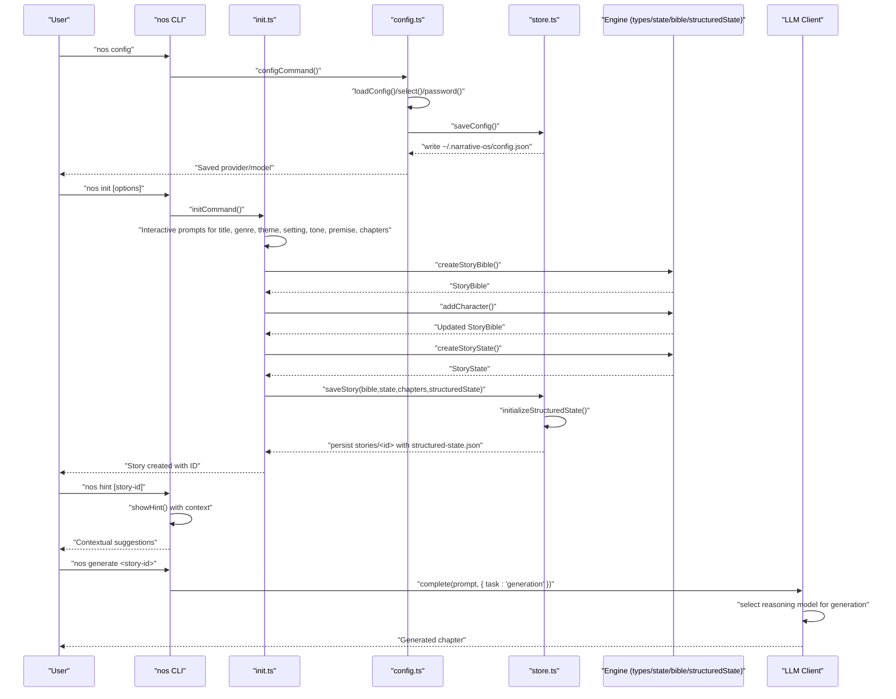
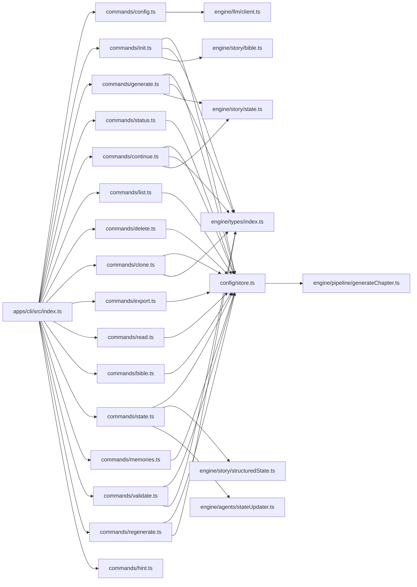
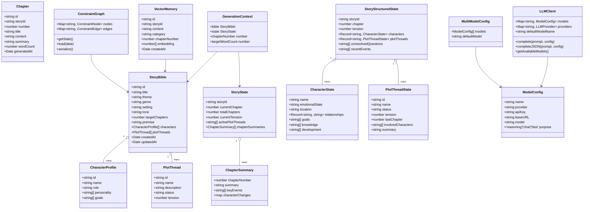

# CLI Command Reference

<cite>
**Referenced Files in This Document**
- [apps/cli/src/index.ts](file://apps/cli/src/index.ts)
- [apps/cli/src/commands/config.ts](file://apps/cli/src/commands/config.ts)
- [apps/cli/src/commands/init.ts](file://apps/cli/src/commands/init.ts)
- [apps/cli/src/commands/generate.ts](file://apps/cli/src/commands/generate.ts)
- [apps/cli/src/commands/status.ts](file://apps/cli/src/commands/status.ts)
- [apps/cli/src/commands/continue.ts](file://apps/cli/src/commands/continue.ts)
- [apps/cli/src/commands/list.ts](file://apps/cli/src/commands/list.ts)
- [apps/cli/src/commands/delete.ts](file://apps/cli/src/commands/delete.ts)
- [apps/cli/src/commands/clone.ts](file://apps/cli/src/commands/clone.ts)
- [apps/cli/src/commands/export.ts](file://apps/cli/src/commands/export.ts)
- [apps/cli/src/commands/read.ts](file://apps/cli/src/commands/read.ts)
- [apps/cli/src/commands/bible.ts](file://apps/cli/src/commands/bible.ts)
- [apps/cli/src/commands/state.ts](file://apps/cli/src/commands/state.ts)
- [apps/cli/src/commands/memories.ts](file://apps/cli/src/commands/memories.ts)
- [apps/cli/src/commands/validate.ts](file://apps/cli/src/commands/validate.ts)
- [apps/cli/src/commands/regenerate.ts](file://apps/cli/src/commands/regenerate.ts)
- [apps/cli/src/commands/hint.ts](file://apps/cli/src/commands/hint.ts)
- [apps/cli/src/config/store.ts](file://apps/cli/src/config/store.ts)
- [packages/engine/src/types/index.ts](file://packages/engine/src/types/index.ts)
- [packages/engine/src/story/state.ts](file://packages/engine/src/story/state.ts)
- [packages/engine/src/story/bible.ts](file://packages/engine/src/story/bible.ts)
- [packages/engine/src/story/structuredState.ts](file://packages/engine/src/story/structuredState.ts)
- [packages/engine/src/agents/stateUpdater.ts](file://packages/engine/src/agents/stateUpdater.ts)
- [packages/engine/src/pipeline/generateChapter.ts](file://packages/engine/src/pipeline/generateChapter.ts)
- [packages/engine/src/llm/client.ts](file://packages/engine/src/llm/client.ts)
- [apps/cli/package.json](file://apps/cli/package.json)
- [package.json](file://package.json)
- [PROGRESS.md](file://PROGRESS.md)
</cite>

## Update Summary
**Changes Made**
- Enhanced the config command section to reflect the new multi-model configuration system with reasoning and chat model support
- Added comprehensive documentation for the new multi-model setup with backward compatibility
- Updated configuration display to show model purpose indicators (reasoning, chat, fast)
- Enhanced troubleshooting section to cover multi-model configuration scenarios
- Added practical examples demonstrating both single-model and multi-model workflows

## Table of Contents
1. [Introduction](#introduction)
2. [Project Structure](#project-structure)
3. [Core Components](#core-components)
4. [Architecture Overview](#architecture-overview)
5. [Detailed Component Analysis](#detailed-component-analysis)
6. [Dependency Analysis](#dependency-analysis)
7. [Performance Considerations](#performance-considerations)
8. [Troubleshooting Guide](#troubleshooting-guide)
9. [Conclusion](#conclusion)
10. [Appendices](#appendices)

## Introduction
This document provides a comprehensive command reference for the Narrative Operating System CLI (nos). It covers command syntax, parameters, flags, usage patterns, and integration points for all nos commands including the newly added 12 commands: bible, clone, delete, export, hint, list, memories, read, regenerate, state, and validate. The system features enhanced structured state persistence, interactive hints system, comprehensive story management capabilities with automatic initialization and robust error handling for improved reliability and advanced storytelling capabilities.

## Project Structure
The CLI is implemented as a TypeScript application using Commander for command parsing and Inquirer for interactive configuration. Commands delegate to the engine package for story generation and rely on a local filesystem store under the user's home directory with enhanced structured state management and memory systems.

```mermaid
graph TB
CLI["CLI Entry<br/>apps/cli/src/index.ts"] --> CMD_CONFIG["Command: config<br/>apps/cli/src/commands/config.ts"]
CLI --> CMD_INIT["Command: init<br/>apps/cli/src/commands/init.ts"]
CLI --> CMD_GENERATE["Command: generate<br/>apps/cli/src/commands/generate.ts"]
CLI --> CMD_STATUS["Command: status<br/>apps/cli/src/commands/status.ts"]
CLI --> CMD_CONTINUE["Command: continue<br/>apps/cli/src/commands/continue.ts"]
CLI --> CMD_LIST["Command: list<br/>apps/cli/src/commands/list.ts"]
CLI --> CMD_DELETE["Command: delete<br/>apps/cli/src/commands/delete.ts"]
CLI --> CMD_CLONE["Command: clone<br/>apps/cli/src/commands/clone.ts"]
CLI --> CMD_EXPORT["Command: export<br/>apps/cli/src/commands/export.ts"]
CLI --> CMD_READ["Command: read<br/>apps/cli/src/commands/read.ts"]
CLI --> CMD_BIBLE["Command: bible<br/>apps/cli/src/commands/bible.ts"]
CLI --> CMD_STATE["Command: state<br/>apps/cli/src/commands/state.ts"]
CLI --> CMD_MEMORIES["Command: memories<br/>apps/cli/src/commands/memories.ts"]
CLI --> CMD_VALIDATE["Command: validate<br/>apps/cli/src/commands/validate.ts"]
CLI --> CMD_REGENERATE["Command: regenerate<br/>apps/cli/src/commands/regenerate.ts"]
CLI --> CMD_HINT["Command: hint<br/>apps/cli/src/commands/hint.ts"]
CMD_CONFIG --> STORE["Local Store<br/>apps/cli/src/config/store.ts"]
CMD_INIT --> STORE
CMD_GENERATE --> STORE
CMD_STATUS --> STORE
CMD_CONTINUE --> STORE
CMD_LIST --> STORE
CMD_DELETE --> STORE
CMD_CLONE --> STORE
CMD_EXPORT --> STORE
CMD_READ --> STORE
CMD_BIBLE --> STORE
CMD_STATE --> STORE
CMD_MEMORIES --> STORE
CMD_VALIDATE --> STORE
CMD_INIT --> ENGINE_TYPES["Engine Types<br/>packages/engine/src/types/index.ts"]
CMD_GENERATE --> ENGINE_TYPES
CMD_CONTINUE --> ENGINE_TYPES
CMD_CLONE --> ENGINE_TYPES
CMD_REGENERATE --> ENGINE_TYPES
CMD_VALIDATE --> ENGINE_TYPES
CMD_INIT --> STORY_BIBLE["Story Bible<br/>packages/engine/src/story/bible.ts"]
CMD_GENERATE --> STORY_STATE["Story State<br/>packages/engine/src/story/state.ts"]
CMD_CONTINUE --> STORY_STATE
CMD_STATE --> STRUCTURED_STATE["Structured State<br/>packages/engine/src/story/structuredState.ts"]
CMD_STATE --> STATE_UPDATER["State Updater<br/>packages/engine/src/agents/stateUpdater.ts"]
CMD_CONFIG --> ENGINE_CLIENT["LLM Client<br/>packages/engine/src/llm/client.ts"]
```

**Diagram sources**
- [apps/cli/src/index.ts:1-154](file://apps/cli/src/index.ts#L1-L154)
- [apps/cli/src/commands/config.ts:1-215](file://apps/cli/src/commands/config.ts#L1-L215)
- [apps/cli/src/commands/init.ts:1-90](file://apps/cli/src/commands/init.ts#L1-L90)
- [apps/cli/src/commands/generate.ts:1-70](file://apps/cli/src/commands/generate.ts#L1-L70)
- [apps/cli/src/commands/status.ts:1-55](file://apps/cli/src/commands/status.ts#L1-L55)
- [apps/cli/src/commands/continue.ts:1-63](file://apps/cli/src/commands/continue.ts#L1-L63)
- [apps/cli/src/commands/list.ts:1-23](file://apps/cli/src/commands/list.ts#L1-L23)
- [apps/cli/src/commands/delete.ts:1-36](file://apps/cli/src/commands/delete.ts#L1-L36)
- [apps/cli/src/commands/clone.ts:1-53](file://apps/cli/src/commands/clone.ts#L1-L53)
- [apps/cli/src/commands/export.ts:1-114](file://apps/cli/src/commands/export.ts#L1-L114)
- [apps/cli/src/commands/read.ts:1-48](file://apps/cli/src/commands/read.ts#L1-L48)
- [apps/cli/src/commands/bible.ts:1-54](file://apps/cli/src/commands/bible.ts#L1-L54)
- [apps/cli/src/commands/state.ts:1-83](file://apps/cli/src/commands/state.ts#L1-L83)
- [apps/cli/src/commands/memories.ts:1-66](file://apps/cli/src/commands/memories.ts#L1-L66)
- [apps/cli/src/commands/validate.ts:1-107](file://apps/cli/src/commands/validate.ts#L1-L107)
- [apps/cli/src/commands/regenerate.ts:1-68](file://apps/cli/src/commands/regenerate.ts#L1-L68)
- [apps/cli/src/commands/hint.ts:1-73](file://apps/cli/src/commands/hint.ts#L1-L73)
- [apps/cli/src/config/store.ts:1-195](file://apps/cli/src/config/store.ts#L1-L195)
- [packages/engine/src/types/index.ts:1-149](file://packages/engine/src/types/index.ts#L1-L149)
- [packages/engine/src/story/bible.ts:1-73](file://packages/engine/src/story/bible.ts#L1-L73)
- [packages/engine/src/story/state.ts:1-30](file://packages/engine/src/story/state.ts#L1-L30)
- [packages/engine/src/story/structuredState.ts:1-235](file://packages/engine/src/story/structuredState.ts#L1-L235)
- [packages/engine/src/agents/stateUpdater.ts:1-193](file://packages/engine/src/agents/stateUpdater.ts#L1-L193)
- [packages/engine/src/llm/client.ts:1-200](file://packages/engine/src/llm/client.ts#L1-L200)

**Section sources**
- [apps/cli/src/index.ts:1-154](file://apps/cli/src/index.ts#L1-L154)
- [apps/cli/package.json:1-50](file://apps/cli/package.json#L1-L50)
- [package.json:1-17](file://package.json#L1-L17)

## Core Components
- CLI entrypoint defines the nos binary, version, and registers commands with their options and actions, including the new 12 commands.
- Commands share a common configuration and storage layer for persistent story data with enhanced structured state management and memory systems.
- Engine types define the data structures used across commands (StoryBible, StoryState, Chapter, GenerationContext, StoryStructuredState).
- **New**: Structured state persistence system automatically initializes and manages character and plot thread states with comprehensive narrative tracking.
- **New**: Interactive hints system provides contextual guidance and quick tips based on story progress and user context.
- **New**: Enhanced init command with interactive prompts for story creation, replacing the previous static parameter approach.
- **New**: Multi-model configuration system supporting separate reasoning and chat models with backward compatibility for single-model setups.

Key runtime behaviors:
- Interactive configuration via inquirer prompts.
- Interactive story creation via inquirer prompts for title, genre, theme, setting, tone, premise, and target chapters.
- Local persistence under ~/.narrative-os/{config.json, stories/<id>/} with automatic structured state initialization.
- Structured state includes character emotional states, locations, relationships, plot thread tensions, and unresolved questions.
- Memory systems support vector-based narrative recall and semantic search.
- Exit codes: non-zero on errors (e.g., missing story ID, invalid chapter numbers).
- **New**: Contextual help system provides intelligent suggestions based on story state and user actions.
- **New**: Multi-model LLM client automatically selects appropriate models based on task type (reasoning for generation/planning, chat for validation/summarization).

**Section sources**
- [apps/cli/src/index.ts:11-53](file://apps/cli/src/index.ts#L11-L53)
- [apps/cli/src/commands/config.ts:38-182](file://apps/cli/src/commands/config.ts#L38-L182)
- [apps/cli/src/config/store.ts:15-49](file://apps/cli/src/config/store.ts#L15-L49)
- [packages/engine/src/types/index.ts:1-149](file://packages/engine/src/types/index.ts#L1-L149)
- [packages/engine/src/story/structuredState.ts:23-85](file://packages/engine/src/story/structuredState.ts#L23-L85)
- [apps/cli/src/commands/hint.ts:3-47](file://apps/cli/src/commands/hint.ts#L3-L47)
- [apps/cli/src/commands/init.ts:17-64](file://apps/cli/src/commands/init.ts#L17-L64)
- [packages/engine/src/llm/client.ts:39-47](file://packages/engine/src/llm/client.ts#L39-L47)

## Architecture Overview
The CLI orchestrates story lifecycle operations backed by the engine with enhanced structured state management and comprehensive story management capabilities. Configuration is applied at startup and injected into environment variables for downstream LLM clients, while structured state provides detailed narrative tracking and memory systems enable sophisticated narrative recall.

**Diagram sources**
- [apps/cli/src/index.ts:18-33](file://apps/cli/src/index.ts#L18-L33)
- [apps/cli/src/commands/config.ts:38-66](file://apps/cli/src/commands/config.ts#L38-L66)
- [apps/cli/src/config/store.ts:15-26](file://apps/cli/src/config/store.ts#L15-L26)
- [packages/engine/src/story/bible.ts:3-26](file://packages/engine/src/story/bible.ts#L3-L26)
- [packages/engine/src/story/state.ts:3-12](file://packages/engine/src/story/state.ts#L3-L12)
- [packages/engine/src/story/structuredState.ts:33-85](file://packages/engine/src/story/structuredState.ts#L33-L85)
- [apps/cli/src/config/store.ts:139-151](file://apps/cli/src/config/store.ts#L139-L151)
- [apps/cli/src/commands/hint.ts:3-47](file://apps/cli/src/commands/hint.ts#L3-L47)
- [apps/cli/src/commands/init.ts:17-79](file://apps/cli/src/commands/init.ts#L17-L79)
- [packages/engine/src/llm/client.ts:39-47](file://packages/engine/src/llm/client.ts#L39-L47)
- [packages/engine/src/llm/client.ts:113-125](file://packages/engine/src/llm/client.ts#L113-L125)

## Detailed Component Analysis

### Command: nos config
Purpose
- Interactively configure the LLM provider, model(s), and API key(s). Supports both single-model and multi-model configurations with backward compatibility. Persists configuration to ~/.narrative-os/config.json and applies environment variables for the LLM client.
- **New**: Can display current configuration without interactive setup using the `--show` flag with enhanced model purpose indicators.

Syntax
- nos config
- nos config --show

Options
- --show, -s: Show current configuration without interactive setup

Behavior
- **Interactive mode** (default): Prompts for provider selection (OpenAI or DeepSeek), model selection based on provider, and API key (masked), then writes configuration.
- **Display mode** (`--show`): Shows current configuration without prompting for interactive setup.
- **New**: Multi-model configuration: User can choose to configure separate reasoning and chat models for different tasks.
- **New**: Backward compatibility: Automatically converts legacy single-model configurations to multi-model format.
- Writes configuration and prints a confirmation summary in interactive mode.

Configuration file location
- ~/.narrative-os/config.json

Environment variables set
- **New**: LLM_MODELS_CONFIG: JSON-encoded multi-model configuration for the LLM client
- **Legacy**: LLM_PROVIDER, LLM_MODEL, OPENAI_API_KEY (when provider is OpenAI), DEEPSEEK_API_KEY (when provider is DeepSeek)
- **New**: Individual API keys are also set for backward compatibility

Exit codes
- 0 on success; non-zero on IO or prompt failures.

Common usage
- Initial setup after installing the CLI.
- **New**: Check current configuration without changing it using `nos config --show`.
- **New**: Configure multi-model setup for advanced reasoning and chat separation.

Advanced usage
- Re-run to change provider or model without manual edits.
- Combine with CI setup by exporting environment variables prior to invoking nos generate/continue.
- **New**: Use `nos config --show` in scripts to verify configuration before running story generation commands.
- **New**: Multi-model configurations automatically integrate with the LLM client's task-based model selection.

**Updated** Enhanced with multi-model configuration support and improved configuration display

**Section sources**
- [apps/cli/src/index.ts:32-39](file://apps/cli/src/index.ts#L32-L39)
- [apps/cli/src/commands/config.ts:38-182](file://apps/cli/src/commands/config.ts#L38-L182)
- [apps/cli/src/commands/config.ts:55-90](file://apps/cli/src/commands/config.ts#L55-L90)
- [apps/cli/src/commands/config.ts:100-181](file://apps/cli/src/commands/config.ts#L100-L181)
- [apps/cli/package.json:12-16](file://apps/cli/package.json#L12-L16)
- [packages/engine/src/llm/client.ts:58-78](file://packages/engine/src/llm/client.ts#L58-L78)

### Command: nos init
Purpose
- Create a new story with interactive prompts for story creation. The CLI now provides dynamic user input for title, genre, theme, setting, tone, premise, and target chapters, making the initial story setup more intuitive and user-friendly. Persists initial state and returns the story ID for subsequent operations with automatic structured state initialization.

**Updated** Enhanced with interactive prompts replacing static parameters

Syntax
- nos init [options]
- nos init (interactive mode)

Options
- --title <title>, -t <title>: Story title (interactive if omitted)
- --theme <theme>: Story theme (interactive if omitted)
- --genre <genre>, -g <genre>: Genre (interactive if omitted)
- --setting <setting>, -s <setting>: Setting (time/place) (interactive if omitted)
- --tone <tone>: Tone (interactive if omitted)
- --premise <premise>, -p <premise>: Brief premise/synopsis (interactive if omitted)
- --chapters <number>, -c <number>: Target chapter count (default: 5, interactive if omitted)

Interactive Prompts
- **Title**: Required field with validation (non-empty)
- **Genre**: Selection from predefined genres (Science Fiction, Fantasy, Mystery, Thriller, Romance, Historical Fiction, Horror, Literary Fiction, Other)
- **Theme**: Free text with default "Redemption"
- **Setting**: Free text with default "Modern day"
- **Tone**: Free text with default "Dramatic"
- **Premise**: Free text with minimum 10 characters validation
- **Target Chapters**: Number input with min 1, max 50, default 5

Output
- Prints story metadata and the next command to generate the first chapter.

Storage
- Creates ~/.narrative-os/stories/<id>/ with bible.json, state.json, chapters.json, structured-state.json, and optionally canon.json.
- **New**: Automatically creates structured-state.json with initialized character and plot thread states.

Exit codes
- 0 on success; non-zero if initialization fails.

Interactive Usage Examples
- **Full interactive mode**: `nos init` (prompts for all fields)
- **Partial interactive mode**: `nos init --title "My Story"` (prompts for remaining fields)
- **Parameter-driven mode**: `nos init --title "My Story" --genre "Fantasy" --chapters 8` (no prompts)

**Updated** Added comprehensive interactive prompts system with validation and defaults

**Section sources**
- [apps/cli/src/index.ts:41-52](file://apps/cli/src/index.ts#L41-L52)
- [apps/cli/src/commands/init.ts:4-90](file://apps/cli/src/commands/init.ts#L4-L90)
- [packages/engine/src/story/bible.ts:3-26](file://packages/engine/src/story/bible.ts#L3-L26)
- [packages/engine/src/story/state.ts:3-12](file://packages/engine/src/story/state.ts#L3-L12)
- [apps/cli/src/config/store.ts:139-151](file://apps/cli/src/config/store.ts#L139-L151)

### Command: nos generate <story-id>
Purpose
- Generate the next chapter for a given story ID with enhanced structured state tracking. Validates completion state and handles errors gracefully.

Syntax
- nos generate <story-id>

Behavior
- Loads story data from ~/.narrative-os/stories/<id>.
- Checks if the story is complete; if so, prints a completion message.
- **Enhanced**: Automatically initializes structured state if it doesn't exist.
- Builds a GenerationContext with target word count and invokes the engine pipeline.
- **New**: Integrates structured state updates through the StateUpdater agent.
- **New**: Uses multi-model LLM client with task-based model selection (reasoning model for generation).
- Saves updated state and chapters; prints chapter details and progress.
- On failure, logs an error and exits with non-zero code.

Exit codes
- 0 on success; 1 if story not found or generation fails.

Example
- nos generate abc123def

Automation tip
- Use a shell loop to iterate nos generate until completion.

**Section sources**
- [apps/cli/src/index.ts:78-83](file://apps/cli/src/index.ts#L78-L83)
- [apps/cli/src/commands/generate.ts:4-70](file://apps/cli/src/commands/generate.ts#L4-L70)
- [apps/cli/src/config/store.ts:28-49](file://apps/cli/src/config/store.ts#L28-L49)
- [packages/engine/src/types/index.ts:60-65](file://packages/engine/src/types/index.ts#L60-L65)
- [packages/engine/src/agents/stateUpdater.ts:85-193](file://packages/engine/src/agents/stateUpdater.ts#L85-L193)
- [packages/engine/src/llm/client.ts:113-125](file://packages/engine/src/llm/client.ts#L113-L125)

### Command: nos status [story-id]
Purpose
- Show detailed status for a single story or list all stories when no ID is provided. **Enhanced**: Now displays structured state information.

Syntax
- nos status [story-id]

Behavior
- Without story-id: lists all stories with progress percentage.
- With story-id: prints title, ID, theme, genre, setting, progress, current tension, recent chapter summaries, and chapter titles/word counts.
- **New**: Can display structured state information when available.

Exit codes
- 0 on success; 1 if story not found.

Example
- nos status
- nos status abc123def

**Section sources**
- [apps/cli/src/index.ts:60-63](file://apps/cli/src/index.ts#L60-L63)
- [apps/cli/src/commands/status.ts:3-54](file://apps/cli/src/commands/status.ts#L3-L54)
- [apps/cli/src/config/store.ts:51-75](file://apps/cli/src/config/store.ts#L51-L75)

### Command: nos continue <story-id>
Purpose
- Generate all remaining chapters for a story in a loop until completion with enhanced structured state management.

Syntax
- nos continue <story-id>

Behavior
- Loads story data and verifies it is not complete.
- **Enhanced**: Automatically initializes structured state if it doesn't exist.
- Iteratively generates chapters, integrating structured state updates through the StateUpdater agent.
- **New**: Uses multi-model LLM client with task-based model selection for optimal performance.
- Saving state and printing per-chapter feedback.
- On any failure, logs the error and exits with non-zero code.

Exit codes
- 0 on success; 1 if story not found or generation fails.

Example
- nos continue abc123def

Batch operations
- Combine with shell scripting to process multiple stories or retry on failure.

**Section sources**
- [apps/cli/src/index.ts:85-91](file://apps/cli/src/index.ts#L85-L91)
- [apps/cli/src/commands/continue.ts:4-63](file://apps/cli/src/commands/continue.ts#L4-L63)
- [apps/cli/src/config/store.ts:28-49](file://apps/cli/src/config/store.ts#L28-L49)
- [packages/engine/src/agents/stateUpdater.ts:85-193](file://packages/engine/src/agents/stateUpdater.ts#L85-L193)
- [packages/engine/src/llm/client.ts:113-125](file://packages/engine/src/llm/client.ts#L113-L125)

### Command: nos list
Purpose
- List all stories in the system with progress information and status indicators.

Syntax
- nos list

Behavior
- Retrieves all stories from the local store.
- Displays each story's ID, title, progress (current/total chapters), and completion status.
- Shows helpful messages when no stories exist.

Output format
- Clean tabular display with progress percentages and completion indicators.

Exit codes
- 0 on success; 1 if storage access fails.

Example
- nos list

**Section sources**
- [apps/cli/src/index.ts:54-58](file://apps/cli/src/index.ts#L54-L58)
- [apps/cli/src/commands/list.ts:1-23](file://apps/cli/src/commands/list.ts#L1-L23)

### Command: nos delete <story-id> [--force]
Purpose
- Permanently delete a story and all its associated data. Requires confirmation unless --force flag is used.

Syntax
- nos delete <story-id> [--force]

Options
- --force: Skip confirmation prompt

Behavior
- Loads the target story and displays deletion summary (title, ID, chapter count).
- Prompts for confirmation unless --force is specified.
- Removes the entire story directory from ~/.narrative-os/stories/<id>.
- Provides success confirmation upon completion.

Exit codes
- 0 on successful deletion; 1 on story not found or permission errors.

Example
- nos delete abc123def
- nos delete abc123def --force

**Section sources**
- [apps/cli/src/index.ts:65-71](file://apps/cli/src/index.ts#L65-L71)
- [apps/cli/src/commands/delete.ts:1-36](file://apps/cli/src/commands/delete.ts#L1-L36)

### Command: nos clone <story-id> <new-title>
Purpose
- Create a copy of an existing story as a template with a new title and fresh state.

Syntax
- nos clone <story-id> <new-title>

Behavior
- Loads the source story and validates its existence.
- Creates a new StoryBible with identical settings but different title and ID.
- Copies all characters and plot threads from the source story.
- Initializes fresh state and creates structured state from the new bible.
- Saves the cloned story and prints summary with new story ID.

Exit codes
- 0 on success; 1 if source story not found.

Example
- nos clone abc123def "New Adventure"

**Section sources**
- [apps/cli/src/index.ts:73-76](file://apps/cli/src/index.ts#L73-L76)
- [apps/cli/src/commands/clone.ts:1-53](file://apps/cli/src/commands/clone.ts#L1-L53)

### Command: nos export <story-id> [--format <format>] [--output <file>]
Purpose
- Export a story to external file formats with configurable output options.

Syntax
- nos export <story-id> [--format <format>] [--output <file>]

Options
- --format/-f: Output format (markdown or txt), default: markdown
- --output/-o: Custom output filename

Behavior
- Loads the target story and validates its existence.
- Supports markdown (default) and plain text formats.
- Generates formatted content with story metadata and all chapters.
- Writes output file to current directory with automatic naming if not specified.

Exit codes
- 0 on success; 1 if story not found or file write fails.

Example
- nos export abc123def
- nos export abc123def --format txt --output my_story.txt

**Section sources**
- [apps/cli/src/index.ts:110-117](file://apps/cli/src/index.ts#L110-L117)
- [apps/cli/src/commands/export.ts:1-114](file://apps/cli/src/commands/export.ts#L1-L114)

### Command: nos read <story-id> [chapter-number]
Purpose
- Read story content either as a chapter listing or specific chapter content.

Syntax
- nos read <story-id> [chapter-number]

Behavior
- Without chapter-number: lists all chapters with titles and word counts.
- With chapter-number: displays the specified chapter content with formatting.
- Handles missing chapters with helpful error messages and available chapter ranges.

Exit codes
- 0 on success; 1 if story not found or chapter not found.

Example
- nos read abc123def
- nos read abc123def 5

**Section sources**
- [apps/cli/src/index.ts:103-108](file://apps/cli/src/index.ts#L103-L108)
- [apps/cli/src/commands/read.ts:1-48](file://apps/cli/src/commands/read.ts#L1-L48)

### Command: nos bible <story-id>
Purpose
- Display comprehensive story bible containing all narrative elements and character information.

Syntax
- nos bible <story-id>

Behavior
- Loads the target story and validates its existence.
- Displays story metadata (title, theme, genre, setting, tone, premise).
- Lists all characters with roles, personalities, goals, and backgrounds.
- Shows all plot threads with statuses and descriptions.
- Provides formatted output with clear section dividers.

Exit codes
- 0 on success; 1 if story not found.

Example
- nos bible abc123def

**Section sources**
- [apps/cli/src/index.ts:120-123](file://apps/cli/src/index.ts#L120-L123)
- [apps/cli/src/commands/bible.ts:1-54](file://apps/cli/src/commands/bible.ts#L1-L54)

### Command: nos state <story-id>
Purpose
- Display detailed structured state information for narrative tracking and analysis.

Syntax
- nos state <story-id>

Behavior
- Loads both story data and structured state for the target story.
- Shows progress metrics (current chapter, total chapters, tension levels).
- Displays comprehensive character states including emotional states, locations, goals, knowledge, and relationships.
- Shows plot thread tracking with statuses, tensions, and summaries.
- Lists unresolved questions and recent narrative events.
- Provides fallback messaging when structured state is not available.

Exit codes
- 0 on success; 1 if story not found.

Example
- nos state abc123def

**Section sources**
- [apps/cli/src/index.ts:125-128](file://apps/cli/src/index.ts#L125-L128)
- [apps/cli/src/commands/state.ts:1-83](file://apps/cli/src/commands/state.ts#L1-L83)

### Command: nos memories <story-id> [query]
Purpose
- Search or browse narrative memories stored in the vector memory system.

Syntax
- nos memories <story-id> [query]

Behavior
- Loads vector store data for the target story.
- Without query: lists all memories grouped by category with sample excerpts.
- With query: searches for semantically similar memories and displays relevance scores.
- Shows memory categories, chapter numbers, and content excerpts.
- Handles cases where no memories exist for the story.

Exit codes
- 0 on success; 1 if story not found.

Example
- nos memories abc123def
- nos memories abc123def "character meeting"

**Section sources**
- [apps/cli/src/index.ts:130-136](file://apps/cli/src/index.ts#L130-L136)
- [apps/cli/src/commands/memories.ts:1-66](file://apps/cli/src/commands/memories.ts#L1-L66)

### Command: nos validate <story-id>
Purpose
- Perform comprehensive validation of story consistency and quality standards.

Syntax
- nos validate <story-id>

Behavior
- Loads story data including constraint graphs, vector stores, and structured state.
- Performs chapter-by-chapter validation against narrative constraints and canon.
- Checks for common issues like missing summaries, unusually short chapters, and orphaned facts.
- Reports violations with severity levels (errors vs warnings).
- Provides statistics on story metrics (chapters, canon facts, constraint graph size, memory count).

Exit codes
- 0 on success; 1 if story not found.

Example
- nos validate abc123def

**Section sources**
- [apps/cli/src/index.ts:138-144](file://apps/cli/src/index.ts#L138-L144)
- [apps/cli/src/commands/validate.ts:1-107](file://apps/cli/src/commands/validate.ts#L1-L107)

### Command: nos regenerate <story-id> <chapter-number>
Purpose
- Regenerate a specific chapter while preserving story continuity and narrative consistency.

Syntax
- nos regenerate <story-id> <chapter-number>

Behavior
- Loads the target story and validates chapter existence.
- Initializes or loads vector store for memory consistency.
- Creates generation context based on state before the target chapter.
- **New**: Uses multi-model LLM client with reasoning model for regeneration.
- Generates replacement chapter with canonical validation.
- Replaces the old chapter and updates story data.
- Displays regeneration results including new title, word count, and any violations.

Exit codes
- 0 on success; 1 if story not found, chapter not found, or regeneration fails.

Example
- nos regenerate abc123def 3

**Section sources**
- [apps/cli/src/index.ts:93-100](file://apps/cli/src/index.ts#L93-L100)
- [apps/cli/src/commands/regenerate.ts:1-68](file://apps/cli/src/commands/regenerate.ts#L1-L68)
- [packages/engine/src/llm/client.ts:113-125](file://packages/engine/src/llm/client.ts#L113-L125)

### Command: nos hint [story-id]
Purpose
- Provide contextual hints and suggestions based on story progress and user context.

Syntax
- nos hint [story-id]

Behavior
- Lists all stories to determine context when no story ID provided.
- Finds active story (in-progress) or uses the most recent story.
- Provides tailored suggestions based on story state:
  - First-time users: guidance for creating their first story
  - Completed stories: suggestions for export, reading, or cloning
  - Active stories: recommendations for continuing, checking status, or auto-completing
- Displays helpful command references and quick-start tips.

Exit codes
- 0 on success; 1 if no stories exist.

Example
- nos hint
- nos hint abc123def

**Section sources**
- [apps/cli/src/index.ts:146-151](file://apps/cli/src/index.ts#L146-L151)
- [apps/cli/src/commands/hint.ts:1-73](file://apps/cli/src/commands/hint.ts#L1-L73)

## Dependency Analysis
The CLI depends on the engine package for story types, generation logic, structured state management, and memory systems. It persists data locally and reads/writes JSON files including the new structured-state.json and vector-store.json. Configuration is applied at startup and influences environment variables consumed by the engine.

**Diagram sources**
- [apps/cli/src/index.ts:1-154](file://apps/cli/src/index.ts#L1-L154)
- [apps/cli/src/commands/config.ts:1-215](file://apps/cli/src/commands/config.ts#L1-L215)
- [apps/cli/src/commands/init.ts:1-90](file://apps/cli/src/commands/init.ts#L1-L90)
- [apps/cli/src/commands/generate.ts:1-70](file://apps/cli/src/commands/generate.ts#L1-L70)
- [apps/cli/src/commands/status.ts:1-55](file://apps/cli/src/commands/status.ts#L1-L55)
- [apps/cli/src/commands/continue.ts:1-63](file://apps/cli/src/commands/continue.ts#L1-L63)
- [apps/cli/src/commands/list.ts:1-23](file://apps/cli/src/commands/list.ts#L1-L23)
- [apps/cli/src/commands/delete.ts:1-36](file://apps/cli/src/commands/delete.ts#L1-L36)
- [apps/cli/src/commands/clone.ts:1-53](file://apps/cli/src/commands/clone.ts#L1-L53)
- [apps/cli/src/commands/export.ts:1-114](file://apps/cli/src/commands/export.ts#L1-L114)
- [apps/cli/src/commands/read.ts:1-48](file://apps/cli/src/commands/read.ts#L1-L48)
- [apps/cli/src/commands/bible.ts:1-54](file://apps/cli/src/commands/bible.ts#L1-L54)
- [apps/cli/src/commands/state.ts:1-83](file://apps/cli/src/commands/state.ts#L1-L83)
- [apps/cli/src/commands/memories.ts:1-66](file://apps/cli/src/commands/memories.ts#L1-L66)
- [apps/cli/src/commands/validate.ts:1-107](file://apps/cli/src/commands/validate.ts#L1-L107)
- [apps/cli/src/commands/regenerate.ts:1-68](file://apps/cli/src/commands/regenerate.ts#L1-L68)
- [apps/cli/src/commands/hint.ts:1-73](file://apps/cli/src/commands/hint.ts#L1-L73)
- [apps/cli/src/config/store.ts:1-195](file://apps/cli/src/config/store.ts#L1-L195)
- [packages/engine/src/types/index.ts:1-149](file://packages/engine/src/types/index.ts#L1-L149)
- [packages/engine/src/story/bible.ts:1-73](file://packages/engine/src/story/bible.ts#L1-L73)
- [packages/engine/src/story/state.ts:1-30](file://packages/engine/src/story/state.ts#L1-L30)
- [packages/engine/src/story/structuredState.ts:1-235](file://packages/engine/src/story/structuredState.ts#L1-L235)
- [packages/engine/src/agents/stateUpdater.ts:1-193](file://packages/engine/src/agents/stateUpdater.ts#L1-L193)
- [packages/engine/src/pipeline/generateChapter.ts:1-108](file://packages/engine/src/pipeline/generateChapter.ts#L1-L108)
- [packages/engine/src/llm/client.ts:1-200](file://packages/engine/src/llm/client.ts#L1-L200)

**Section sources**
- [apps/cli/src/index.ts:1-154](file://apps/cli/src/index.ts#L1-L154)
- [apps/cli/src/commands/config.ts:1-215](file://apps/cli/src/commands/config.ts#L1-L215)
- [apps/cli/src/config/store.ts:1-195](file://apps/cli/src/config/store.ts#L1-L195)
- [packages/engine/src/types/index.ts:1-149](file://packages/engine/src/types/index.ts#L1-L149)

## Performance Considerations
- Each nos generate invocation performs disk I/O to load/save story data; batching via nos continue reduces overhead.
- **Enhanced**: Structured state initialization adds minimal overhead but provides significant narrative tracking benefits.
- **New**: Interactive prompts via Inquirer add minimal runtime overhead but greatly improve user experience.
- **New**: Memory operations (vector store loading/searching) have minimal performance impact but can be optimized by caching frequently accessed data.
- **New**: Validation operations scale with chapter count and constraint complexity; consider running selectively during development.
- **New**: Multi-model configuration adds negligible overhead as models are cached in memory.
- **New**: Task-based model selection ensures optimal performance by using appropriate models for each operation type.
- Target word count is fixed for generation; adjust story length via --chapters during init to control total work.
- Network latency dominates LLM calls; consider rate limits and provider quotas.
- For large-scale automation, cache configuration and reuse environment variables to avoid repeated file reads.
- **New**: Structured state serialization/deserialization is lightweight JSON operations that do not significantly impact performance.
- **New**: Contextual hints system provides immediate feedback without heavy computation.
- **New**: Configuration display operation is extremely fast as it only reads from local file system without any interactive prompts.
- **New**: Interactive prompts are asynchronous and provide immediate feedback, making the CLI feel responsive even with user input.
- **New**: Multi-model LLM client caches providers and models for efficient access during story generation.

## Troubleshooting Guide
Common issues and resolutions
- Story not found
  - Cause: Invalid or missing story ID.
  - Resolution: List stories with nos status; confirm ID; re-run with correct ID.
- Configuration missing
  - Cause: No ~/.narrative-os/config.json.
  - Resolution: Run nos config to set provider, model, and API key.
- **New**: Multi-model configuration issues
  - Cause: Corrupted or incomplete multi-model configuration.
  - Resolution: Run `nos config` to reconfigure; use `nos config --show` to verify setup; check that both reasoning and chat models are properly configured.
- **New**: Interactive prompt failures
  - Cause: Terminal not supporting interactive input or interrupted prompts.
  - Resolution: Use parameter-driven mode (e.g., `nos init --title "Story" --genre "Fantasy"`) or fix terminal environment.
- **New**: Configuration display issues
  - Cause: No configuration file exists or is corrupted.
  - Resolution: Run `nos config --show` to see current configuration status; if empty, run `nos config` to set up.
- **New**: Model purpose confusion
  - Cause: Unclear which model is used for which task.
  - Resolution: Use `nos config --show` to see model purposes; reasoning models are used for generation/planning, chat models for validation/summarization.
- Generation failures
  - Cause: LLM API errors, network issues, or invalid context.
  - Resolution: Verify API credentials; retry; inspect recent summaries via nos status; reduce concurrency.
- Permission errors
  - Cause: Write permissions to ~/.narrative-os.
  - Resolution: Fix directory permissions or run as a user with appropriate access.
- **New**: Structured state corruption
  - Cause: Corrupted structured-state.json file.
  - Resolution: Delete the corrupted file; the system will automatically recreate it from the StoryBible on next generation.
- **New**: Missing structured state
  - Cause: Legacy stories created before structured state feature.
  - Resolution: Run nos generate or nos continue on the story; it will automatically initialize structured state.
- **New**: Memory system issues
  - Cause: Missing or corrupted vector-store.json.
  - Resolution: Run nos regenerate on problematic chapters to rebuild memory data; or delete vector-store.json to reset.
- **New**: Validation failures
  - Cause: Canon violations or constraint graph issues.
  - Resolution: Review validation output; fix narrative inconsistencies; run nos validate again to confirm resolution.
- **New**: Chapter not found errors
  - Cause: Invalid chapter number or story progression issues.
  - Resolution: Use nos read to check available chapters; verify chapter numbering; use nos regenerate for corrections.
- **New**: Export format issues
  - Cause: Unsupported format or file write permissions.
  - Resolution: Specify supported formats (markdown/txt); check output directory permissions; use --output option for custom filenames.

Exit codes summary
- 0: Success
- 1: Error (e.g., story not found, generation failure, validation issues)

**Section sources**
- [apps/cli/src/commands/generate.ts:7-10](file://apps/cli/src/commands/generate.ts#L7-L10)
- [apps/cli/src/commands/generate.ts:50-53](file://apps/cli/src/commands/generate.ts#L50-L53)
- [apps/cli/src/commands/status.ts:25-28](file://apps/cli/src/commands/status.ts#L25-L28)
- [apps/cli/src/commands/continue.ts:7-10](file://apps/cli/src/commands/continue.ts#L7-L10)
- [apps/cli/src/commands/continue.ts:42-45](file://apps/cli/src/commands/continue.ts#L42-L45)
- [apps/cli/src/config/store.ts:139-151](file://apps/cli/src/config/store.ts#L139-L151)
- [apps/cli/src/commands/regenerate.ts:17-21](file://apps/cli/src/commands/regenerate.ts#L17-L21)
- [apps/cli/src/commands/export.ts:7-10](file://apps/cli/src/commands/export.ts#L7-L10)

## Conclusion
The nos CLI provides a comprehensive and powerful workflow for creating, generating, managing, and validating stories powered by the Narrative Operating System engine. With the addition of 12 new commands, enhanced structured state persistence, interactive hints system, sophisticated memory management, the new interactive init command with dynamic user prompts, and the revolutionary multi-model configuration system with separate reasoning and chat models, it now offers advanced narrative tracking capabilities, comprehensive story management, intelligent assistance, multi-model performance optimization, and an intuitive user experience while maintaining both beginner-friendly workflows and advanced automation scenarios.

## Appendices

### Data Model Overview
The CLI operates on core engine types that define story structure and generation context, now enhanced with structured state management and memory systems.

**Diagram sources**
- [packages/engine/src/types/index.ts:1-149](file://packages/engine/src/types/index.ts#L1-L149)
- [packages/engine/src/story/structuredState.ts:23-235](file://packages/engine/src/story/structuredState.ts#L23-L235)
- [packages/engine/src/memory/vectorStore.ts:1-200](file://packages/engine/src/memory/vectorStore.ts#L1-L200)
- [packages/engine/src/constraints/constraintGraph.ts:1-150](file://packages/engine/src/constraints/constraintGraph.ts#L1-L150)
- [packages/engine/src/types/index.ts:92-104](file://packages/engine/src/types/index.ts#L92-L104)
- [packages/engine/src/llm/client.ts:49-190](file://packages/engine/src/llm/client.ts#L49-L190)

### Storage Layout
Stories are persisted under ~/.narrative-os/stories/<id> with the following files:
- bible.json: StoryBible
- state.json: StoryState
- chapters.json: Chapter[]
- **New**: structured-state.json: StoryStructuredState (automatically initialized)
- **New**: vector-store.json: VectorStore data (for memory)
- **New**: constraint-graph.json: ConstraintGraph data (for validation)
- canon.json: CanonStore (optional, extracted if missing)
- **New**: command-history.json: Command execution history for hints system

**Section sources**
- [apps/cli/src/config/store.ts:15-49](file://apps/cli/src/config/store.ts#L15-L49)
- [apps/cli/src/config/store.ts:117-195](file://apps/cli/src/config/store.ts#L117-L195)

### Practical Examples and Workflows

Beginner workflows
- Configure provider and model: nos config
- **New**: Check configuration: nos config --show
- **New**: Interactive story creation: nos init (prompts for all fields)
- **New**: Parameter-driven story creation: nos init --title "My Story" --genre "Fantasy" --chapters 8
- Generate chapters one-by-one: nos generate <story-id>
- Check progress: nos status <story-id>
- **New**: View story bible: nos bible <story-id>
- **New**: Get contextual help: nos hint

Power-user techniques
- Batch generation: nos continue <story-id>
- Automation script: loop nos generate until completion; handle exit code 0
- CI integration: pre-set environment variables for providers; run nos continue in a job
- **New**: Advanced narrative tracking: monitor character development and plot thread progression through structured state
- **New**: Memory management: search relevant story elements using nos memories
- **New**: Quality assurance: validate story consistency with nos validate
- **New**: Story management: clone templates with nos clone, export finished works with nos export
- **New**: Chapter correction: regenerate specific chapters with nos regenerate
- **New**: Configuration verification: use `nos config --show` in deployment scripts to verify environment setup
- **New**: Interactive workflow optimization: combine interactive prompts with parameter overrides for partial automation
- **New**: Multi-model optimization: leverage separate reasoning and chat models for best performance
- **New**: Task-based model selection: understand how different models are automatically selected for different operations

**Section sources**
- [PROGRESS.md:126-137](file://PROGRESS.md#L126-L137)
- [apps/cli/src/commands/continue.ts:22-46](file://apps/cli/src/commands/continue.ts#L22-L46)
- [packages/engine/src/story/structuredState.ts:181-235](file://packages/engine/src/story/structuredState.ts#L181-L235)
- [apps/cli/src/commands/hint.ts:25-46](file://apps/cli/src/commands/hint.ts#L25-L46)
- [apps/cli/src/commands/init.ts:17-79](file://apps/cli/src/commands/init.ts#L17-L79)
- [packages/engine/src/llm/client.ts:39-47](file://packages/engine/src/llm/client.ts#L39-L47)

### Interactive Prompts System Features
**New**: The enhanced CLI now provides a comprehensive interactive prompts system for story creation:

- **Dynamic Field Collection**: Users are prompted for title, genre, theme, setting, tone, premise, and target chapters
- **Input Validation**: Each field includes appropriate validation (required fields, minimum length, numeric ranges)
- **Default Values**: Intelligent defaults for common fields (e.g., "Redemption" for theme, "Modern day" for setting)
- **Genre Selection**: Predefined genre choices with user-friendly options
- **Flexible Input**: Supports both fully interactive mode and partial parameter overrides
- **Responsive Interface**: Asynchronous prompts provide immediate feedback and graceful cancellation

**Section sources**
- [apps/cli/src/commands/init.ts:17-79](file://apps/cli/src/commands/init.ts#L17-L79)
- [apps/cli/src/commands/init.ts:22-35](file://apps/cli/src/commands/init.ts#L22-L35)
- [apps/cli/src/commands/init.ts:57-64](file://apps/cli/src/commands/init.ts#L57-L64)

### Structured State Management Features
**New**: The enhanced CLI now provides sophisticated narrative tracking through structured state management:

- **Automatic Initialization**: Structured state is automatically created from StoryBible when a story is first generated
- **Character Tracking**: Detailed character states including emotional state, location, relationships, knowledge, and development
- **Plot Thread Management**: Dynamic tracking of plot thread status, tension levels, and involvement
- **Narrative Continuity**: Unresolved questions tracking and recent events logging
- **Integration**: Seamless integration with the StateUpdater agent for automated narrative state management

**Section sources**
- [packages/engine/src/story/structuredState.ts:23-85](file://packages/engine/src/story/structuredState.ts#L23-L85)
- [packages/engine/src/agents/stateUpdater.ts:85-193](file://packages/engine/src/agents/stateUpdater.ts#L85-L193)
- [apps/cli/src/config/store.ts:139-151](file://apps/cli/src/config/store.ts#L139-L151)

### Interactive Hints System Features
**New**: The CLI now includes an intelligent hints system that provides contextual guidance:

- **Context Detection**: Automatically identifies active stories and user context
- **Progress-Based Suggestions**: Tailors advice based on story completion status
- **Quick Command Access**: Provides direct command references for common operations
- **First-Time User Support**: Guides new users through initial setup and creation
- **Completion Recognition**: Suggests next steps when stories are finished

**Section sources**
- [apps/cli/src/commands/hint.ts:3-47](file://apps/cli/src/commands/hint.ts#L3-L47)
- [apps/cli/src/commands/hint.ts:49-73](file://apps/cli/src/commands/hint.ts#L49-L73)

### Memory System Capabilities
**New**: The CLI integrates advanced memory management for narrative recall:

- **Vector Storage**: Semantic memory storage with embeddings for relevant content
- **Search Functionality**: Query-based retrieval of narrative elements
- **Category Organization**: Automatic grouping of memories by narrative categories
- **Chapter Association**: Links memories to specific story chapters
- **Relevance Scoring**: Provides confidence ratings for memory matches

**Section sources**
- [apps/cli/src/commands/memories.ts:1-66](file://apps/cli/src/commands/memories.ts#L1-L66)
- [packages/engine/src/memory/vectorStore.ts:1-200](file://packages/engine/src/memory/vectorStore.ts#L1-L200)

### Validation and Quality Assurance
**New**: Comprehensive validation system ensures narrative consistency:

- **Constraint Checking**: Validates against established narrative constraints
- **Canon Compliance**: Ensures factual accuracy and timeline consistency
- **Quality Metrics**: Identifies issues like missing summaries or short chapters
- **Violation Reporting**: Distinguishes between errors and warnings
- **Progressive Validation**: Validates chapters as they're generated

**Section sources**
- [apps/cli/src/commands/validate.ts:1-107](file://apps/cli/src/commands/validate.ts#L1-L107)
- [packages/engine/src/constraints/constraintGraph.ts:1-150](file://packages/engine/src/constraints/constraintGraph.ts#L1-L150)
- [packages/engine/src/constraints/validator.ts:1-200](file://packages/engine/src/constraints/validator.ts#L1-L200)

### Configuration Display Features
**New**: The CLI now provides a convenient way to display current configuration without interactive setup:

- **Non-Interactive Display**: The `--show` flag allows users to quickly check their current configuration
- **Model Purpose Indicators**: Shows reasoning, chat, and fast model purposes with clear labeling
- **Multi-Model Visualization**: Displays all configured models with their purposes and providers
- **Immediate Feedback**: Shows provider, model, and API key status without any prompts
- **File Path Information**: Displays the exact location of the configuration file
- **Error Handling**: Gracefully handles cases where no configuration exists
- **Script Integration**: Ideal for use in automation scripts and CI/CD pipelines

**Section sources**
- [apps/cli/src/commands/config.ts:55-90](file://apps/cli/src/commands/config.ts#L55-L90)
- [apps/cli/src/commands/config.ts:66-89](file://apps/cli/src/commands/config.ts#L66-L89)
- [apps/cli/src/index.ts:32-39](file://apps/cli/src/index.ts#L32-L39)

### Enhanced Config Command Workflow
**New**: The enhanced config command provides multiple configuration modes:

- **Multi-Model Setup**: Interactive prompts for choosing reasoning and chat models with provider selection
- **Single-Model Compatibility**: Automatic conversion from legacy single-model configurations
- **Backward Compatibility**: Maintains support for existing LLM_PROVIDER/LLM_MODEL environment variables
- **Non-Interactive Display**: `nos config --show` provides immediate configuration overview
- **Model Purpose Management**: Clear indication of model purposes (reasoning, chat, fast)
- **Provider Integration**: Supports OpenAI and DeepSeek with appropriate model recommendations
- **Flexible Integration**: Works seamlessly with automation scripts and CI/CD pipelines

**Section sources**
- [apps/cli/src/commands/config.ts:55-182](file://apps/cli/src/commands/config.ts#L55-L182)
- [apps/cli/src/index.ts:32-39](file://apps/cli/src/index.ts#L32-L39)
- [packages/engine/src/llm/client.ts:58-111](file://packages/engine/src/llm/client.ts#L58-L111)

### Multi-Model Configuration Features
**New**: Revolutionary multi-model configuration system:

- **Separate Model Types**: Distinct reasoning models for complex creative tasks and chat models for validation
- **Task-Based Selection**: Automatic model selection based on operation type (generation/planning vs validation/summarization)
- **Backward Compatibility**: Seamless integration with existing single-model configurations
- **Environment Integration**: Multi-model configuration stored in LLM_MODELS_CONFIG environment variable
- **Provider Support**: OpenAI and DeepSeek with appropriate model recommendations
- **Purpose Indicators**: Clear model purpose labeling (reasoning, chat, fast)
- **Default Model Management**: Configurable default model for fallback operations

**Section sources**
- [apps/cli/src/commands/config.ts:8-30](file://apps/cli/src/commands/config.ts#L8-L30)
- [apps/cli/src/commands/config.ts:100-148](file://apps/cli/src/commands/config.ts#L100-L148)
- [packages/engine/src/types/index.ts:92-113](file://packages/engine/src/types/index.ts#L92-L113)
- [packages/engine/src/llm/client.ts:39-47](file://packages/engine/src/llm/client.ts#L39-L47)
- [packages/engine/src/llm/client.ts:113-125](file://packages/engine/src/llm/client.ts#L113-L125)

### Task-Based Model Selection
**New**: Intelligent model selection system:

- **Generation Tasks**: Uses reasoning models for complex creative writing and planning
- **Validation Tasks**: Uses chat models for validation and summarization
- **Extraction Tasks**: Uses chat models for memory/state extraction
- **Default Fallback**: Uses chat models when no specific task is defined
- **Fast Models**: Available for summarization and extraction tasks
- **Automatic Selection**: Transparent model switching based on operation requirements
- **Performance Optimization**: Ensures optimal performance through appropriate model matching

**Section sources**
- [packages/engine/src/llm/client.ts:39-47](file://packages/engine/src/llm/client.ts#L39-L47)
- [packages/engine/src/llm/client.ts:113-125](file://packages/engine/src/llm/client.ts#L113-L125)
- [packages/engine/src/llm/client.ts:182-189](file://packages/engine/src/llm/client.ts#L182-L189)