# Development and Contributing

<cite>
**Referenced Files in This Document**
- [.gitignore](file://.gitignore)
- [package.json](file://package.json)
- [pnpm-workspace.yaml](file://pnpm-workspace.yaml)
- [turbo.json](file://turbo.json)
- [install.ps1](file://install.ps1)
- [publish.ps1](file://publish.ps1)
- [publish.sh](file://publish.sh)
- [apps/cli/package.json](file://apps/cli/package.json)
- [packages/engine/package.json](file://packages/engine/package.json)
- [apps/cli/src/index.ts](file://apps/cli/src/index.ts)
- [apps/cli/src/commands/init.ts](file://apps/cli/src/commands/init.ts)
- [apps/cli/src/commands/generate.ts](file://apps/cli/src/commands/generate.ts)
- [apps/cli/src/commands/config.ts](file://apps/cli/src/commands/config.ts)
- [packages/engine/src/index.ts](file://packages/engine/src/index.ts)
- [packages/engine/src/types/index.ts](file://packages/engine/src/types/index.ts)
- [packages/engine/src/llm/client.ts](file://packages/engine/src/llm/client.ts)
- [packages/engine/src/memory/canonStore.ts](file://packages/engine/src/memory/canonStore.ts)
- [packages/engine/src/pipeline/generateChapter.ts](file://packages/engine/src/pipeline/generateChapter.ts)
- [packages/engine/src/test/simple.test.ts](file://packages/engine/src/test/simple.test.ts)
- [packages/engine/src/story/bible.ts](file://packages/engine/src/story/bible.ts)
- [packages/engine/src/constraints/validator.ts](file://packages/engine/src/constraints/validator.ts)
</cite>

## Update Summary
**Changes Made**
- Enhanced testing infrastructure with improved path handling for local CLI executable
- Added automatic multi-model configuration loading for LLM providers
- Improved cross-platform compatibility for configuration and testing
- Updated version management documentation for new version increments
- Added comprehensive multi-model configuration support in CLI
- **New**: Added comprehensive language detection functionality with Chinese content validation testing
- **New**: Integrated language detection into story creation and character generation workflows

## Table of Contents
1. [Introduction](#introduction)
2. [Project Structure](#project-structure)
3. [Core Components](#core-components)
4. [Architecture Overview](#architecture-overview)
5. [Detailed Component Analysis](#detailed-component-analysis)
6. [Dependency Analysis](#dependency-analysis)
7. [Development Tooling and Automation](#development-tooling-and-automation)
8. [Repository Organization and Management](#repository-organization-and-management)
9. [Cross-Platform Installation and Publishing](#cross-platform-installation-and-publishing)
10. [Performance Considerations](#performance-considerations)
11. [Troubleshooting Guide](#troubleshooting-guide)
12. [Contribution Guidelines](#contribution-guidelines)
13. [Release and Version Management](#release-and-version-management)
14. [Extensibility Guide](#extensibility-guide)
15. [Testing Strategies](#testing-strategies)
16. [Development Workflow](#development-workflow)
17. [Conclusion](#conclusion)

## Introduction
This document provides comprehensive development and contributing guidance for the Narrative Operating System (NOS) monorepo. It covers environment setup with PNPM workspaces and Turborepo orchestration, build and development workflows, testing strategies, CI considerations, contribution standards, debugging and profiling techniques, release processes, and extensibility for agents, memory strategies, and LLM providers. The project now includes comprehensive installation scripts for Windows PowerShell and cross-platform publishing workflows for both Windows and Unix-like systems, along with improved repository organization practices and enhanced multi-model LLM configuration capabilities.

**New**: The system now features comprehensive language detection functionality supporting multiple writing systems including Chinese, Japanese, Korean, Arabic, Russian, Thai, and Hindi, with integrated testing validation for international content generation.

## Project Structure
The repository is a TypeScript monorepo organized into:
- apps/cli: A CLI application that orchestrates story creation and generation via the engine package, featuring advanced multi-model configuration support.
- packages/engine: The core engine responsible for story modeling, LLM orchestration, agent pipeline, and memory management, with enhanced testing infrastructure.
- **New**: Comprehensive multi-model LLM configuration system supporting both single and multi-model setups with automatic model selection based on task purposes.
- **New**: Advanced language detection system supporting multiple writing systems for international content generation.

PNPM workspaces define the package locations, and Turborepo defines shared tasks and caching behavior across the monorepo. The repository follows standardized organization patterns to maintain cleanliness and prevent accidental commits of generated content.

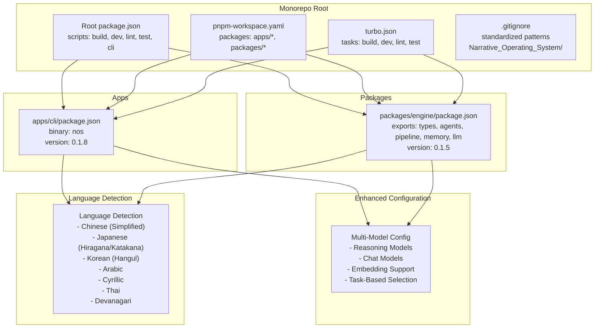

**Diagram sources**
- [package.json:1-17](file://package.json#L1-L17)
- [pnpm-workspace.yaml:1-4](file://pnpm-workspace.yaml#L1-L4)
- [turbo.json:1-19](file://turbo.json#L1-L19)
- [.gitignore:1-50](file://.gitignore#L1-L50)
- [apps/cli/package.json:1-50](file://apps/cli/package.json#L1-L50)
- [packages/engine/package.json:1-46](file://packages/engine/package.json#L1-L46)
- [packages/engine/src/story/bible.ts:8-50](file://packages/engine/src/story/bible.ts#L8-L50)

**Section sources**
- [package.json:1-17](file://package.json#L1-L17)
- [pnpm-workspace.yaml:1-4](file://pnpm-workspace.yaml#L1-L4)
- [turbo.json:1-19](file://turbo.json#L1-L19)
- [.gitignore:1-50](file://.gitignore#L1-L50)

## Core Components
- CLI Application: Provides commands to configure, initialize stories, generate chapters, show status, and continue sequences. It depends on the engine package and exposes a binary named nos. Now features advanced multi-model configuration with interactive setup.
- Engine Package: Exports types, LLM client with multi-model support, agents (writer, completeness checker, summarizer, canon validator), pipeline for chapter generation, story bible/state utilities, and memory/canon store.
- **New**: Enhanced multi-model LLM configuration system supporting reasoning, chat, and fast models with automatic task-based selection.
- **New**: Comprehensive language detection system supporting multiple writing systems for international content generation.

Key exports and entry points:
- CLI entry: [apps/cli/src/index.ts:1-154](file://apps/cli/src/index.ts#L1-L154)
- Engine entry: [packages/engine/src/index.ts:1-123](file://packages/engine/src/index.ts#L1-L123)
- Engine types: [packages/engine/src/types/index.ts:1-90](file://packages/engine/src/types/index.ts#L1-L90)
- Enhanced LLM client: [packages/engine/src/llm/client.ts:1-200](file://packages/engine/src/llm/client.ts#L1-L200)
- Canon store: [packages/engine/src/memory/canonStore.ts:1-134](file://packages/engine/src/memory/canonStore.ts#L1-L134)
- Generation pipeline: [packages/engine/src/pipeline/generateChapter.ts:1-76](file://packages/engine/src/pipeline/generateChapter.ts#L1-L76)
- **New**: Language detection: [packages/engine/src/story/bible.ts:8-50](file://packages/engine/src/story/bible.ts#L8-L50)

**Section sources**
- [apps/cli/src/index.ts:1-154](file://apps/cli/src/index.ts#L1-L154)
- [packages/engine/src/index.ts:1-123](file://packages/engine/src/index.ts#L1-L123)
- [packages/engine/src/types/index.ts:1-90](file://packages/engine/src/types/index.ts#L1-L90)
- [packages/engine/src/llm/client.ts:1-200](file://packages/engine/src/llm/client.ts#L1-L200)
- [packages/engine/src/memory/canonStore.ts:1-134](file://packages/engine/src/memory/canonStore.ts#L1-L134)
- [packages/engine/src/pipeline/generateChapter.ts:1-76](file://packages/engine/src/pipeline/generateChapter.ts#L1-L76)
- [packages/engine/src/story/bible.ts:8-50](file://packages/engine/src/story/bible.ts#L8-L50)

## Architecture Overview
The CLI drives story lifecycle commands, delegating to the engine for generation and state management. The engine coordinates agents and memory to produce coherent chapters guided by the story bible and canonical facts. The system now includes automated installation and publishing workflows for seamless development and distribution, with enhanced multi-model LLM configuration supporting both single and complex multi-model setups.

**New**: The architecture now includes intelligent language detection that automatically identifies content writing systems and applies appropriate cultural and linguistic context to story generation.

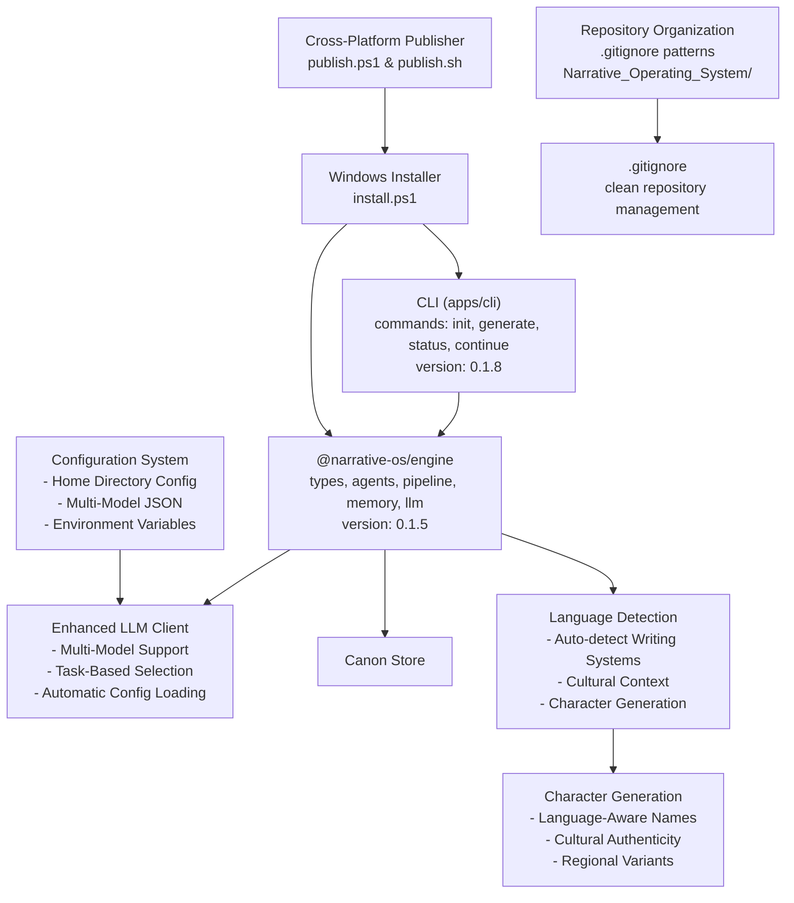

**Diagram sources**
- [apps/cli/src/index.ts:1-154](file://apps/cli/src/index.ts#L1-L154)
- [packages/engine/src/index.ts:1-123](file://packages/engine/src/index.ts#L1-L123)
- [packages/engine/src/llm/client.ts:1-200](file://packages/engine/src/llm/client.ts#L1-L200)
- [packages/engine/src/memory/canonStore.ts:1-134](file://packages/engine/src/memory/canonStore.ts#L1-L134)
- [install.ps1:1-130](file://install.ps1#L1-L130)
- [publish.ps1:1-95](file://publish.ps1#L1-L95)
- [publish.sh:1-100](file://publish.sh#L1-L100)
- [.gitignore:50-50](file://.gitignore#L50-L50)
- [packages/engine/src/story/bible.ts:8-50](file://packages/engine/src/story/bible.ts#L8-L50)
- [packages/engine/src/story/bible.ts:153-242](file://packages/engine/src/story/bible.ts#L153-L242)

## Detailed Component Analysis

### Enhanced CLI Configuration System
The CLI now features a sophisticated configuration system supporting both single and multi-model setups with interactive setup and automatic environment variable application.

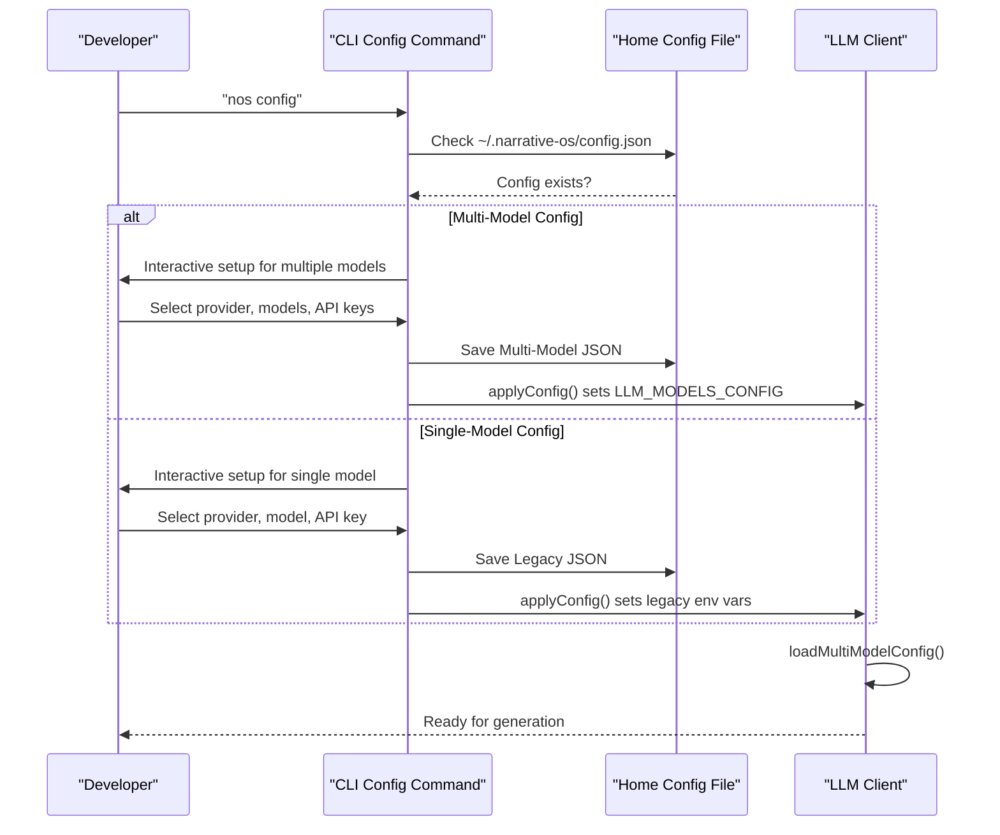

**Diagram sources**
- [apps/cli/src/commands/config.ts:55-249](file://apps/cli/src/commands/config.ts#L55-L249)
- [apps/cli/src/index.ts:17-17](file://apps/cli/src/index.ts#L17-L17)
- [packages/engine/src/llm/client.ts:58-111](file://packages/engine/src/llm/client.ts#L58-L111)

**Section sources**
- [apps/cli/src/commands/config.ts:1-249](file://apps/cli/src/commands/config.ts#L1-L249)
- [apps/cli/src/index.ts:17-17](file://apps/cli/src/index.ts#L17-L17)
- [packages/engine/src/llm/client.ts:58-111](file://packages/engine/src/llm/client.ts#L58-L111)

### Enhanced LLM Client with Multi-Model Support
The LLM client now supports both single and multi-model configurations with automatic model selection based on task purposes (reasoning, chat, fast).

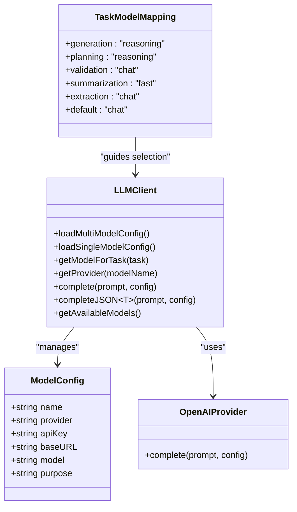

**Diagram sources**
- [packages/engine/src/llm/client.ts:49-190](file://packages/engine/src/llm/client.ts#L49-L190)

**Section sources**
- [packages/engine/src/llm/client.ts:1-200](file://packages/engine/src/llm/client.ts#L1-L200)

### Language Detection System
**New**: The system now includes comprehensive language detection functionality that automatically identifies content writing systems and applies appropriate cultural context.

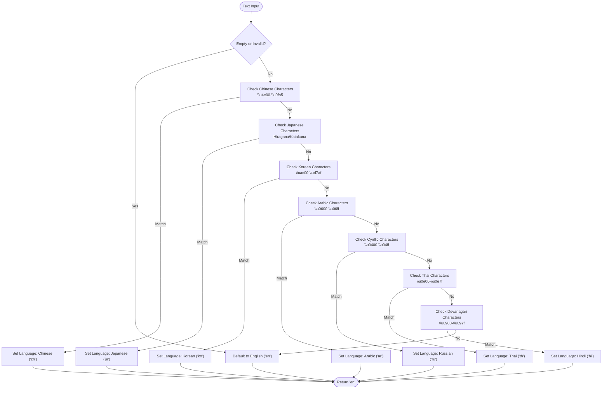

**Diagram sources**
- [packages/engine/src/story/bible.ts:8-50](file://packages/engine/src/story/bible.ts#L8-L50)

**Section sources**
- [packages/engine/src/story/bible.ts:8-50](file://packages/engine/src/story/bible.ts#L8-L50)

### Intelligent Character Generation
**New**: Character generation now uses language detection to create culturally appropriate character names and personalities.

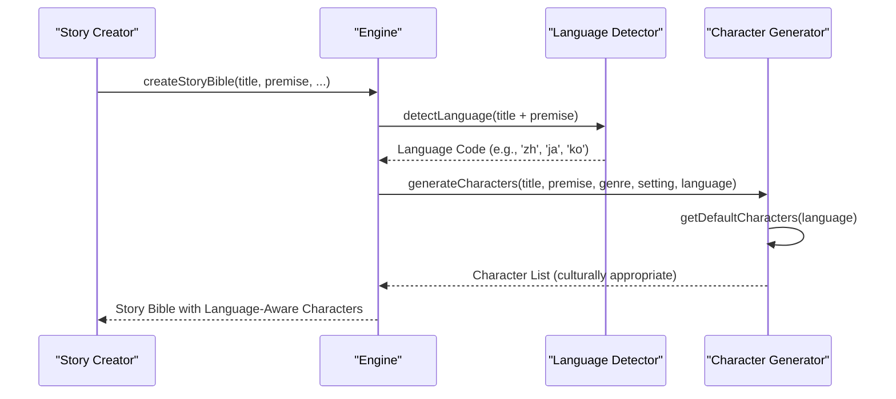

**Diagram sources**
- [packages/engine/src/story/bible.ts:153-242](file://packages/engine/src/story/bible.ts#L153-L242)
- [packages/engine/src/story/bible.ts:8-50](file://packages/engine/src/story/bible.ts#L8-L50)

**Section sources**
- [packages/engine/src/story/bible.ts:153-242](file://packages/engine/src/story/bible.ts#L153-L242)
- [packages/engine/src/story/bible.ts:8-50](file://packages/engine/src/story/bible.ts#L8-L50)

### CLI Commands
- Initialization: Creates a story bible, adds characters, initializes state, and persists the story.
- Generation: Loads a story, builds a generation context, invokes the engine pipeline, updates state, and persists results.

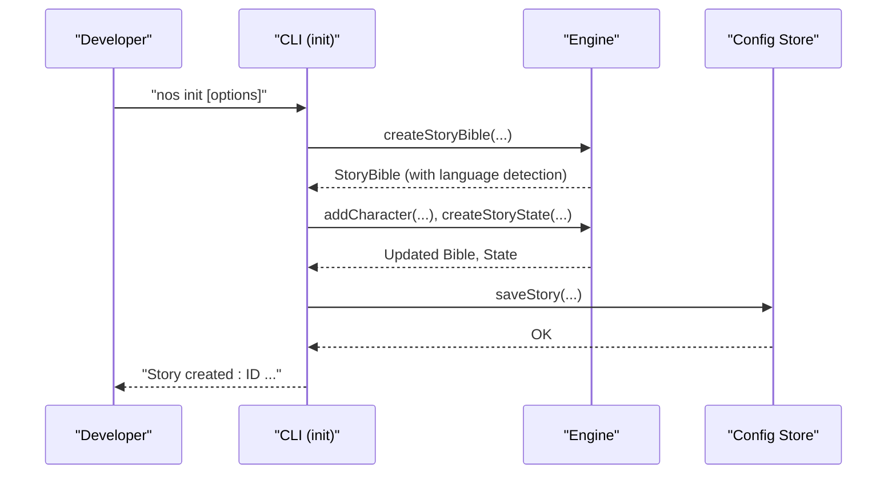

**Diagram sources**
- [apps/cli/src/commands/init.ts:1-50](file://apps/cli/src/commands/init.ts#L1-L50)
- [packages/engine/src/index.ts:1-123](file://packages/engine/src/index.ts#L1-L123)

**Section sources**
- [apps/cli/src/commands/init.ts:1-50](file://apps/cli/src/commands/init.ts#L1-L50)

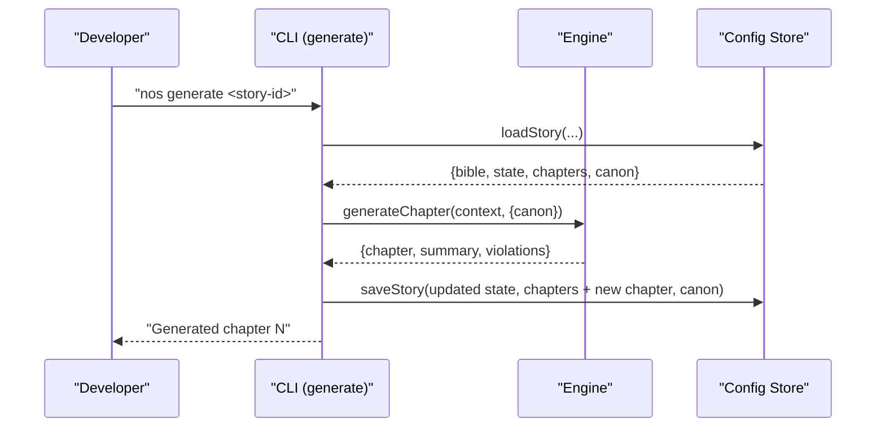

**Diagram sources**
- [apps/cli/src/commands/generate.ts:1-55](file://apps/cli/src/commands/generate.ts#L1-L55)
- [packages/engine/src/pipeline/generateChapter.ts:1-76](file://packages/engine/src/pipeline/generateChapter.ts#L1-L76)

**Section sources**
- [apps/cli/src/commands/generate.ts:1-55](file://apps/cli/src/commands/generate.ts#L1-L55)

### Engine Pipeline
The generation pipeline composes the writer agent, completeness checks, optional canon validation, and summarization, returning structured results.

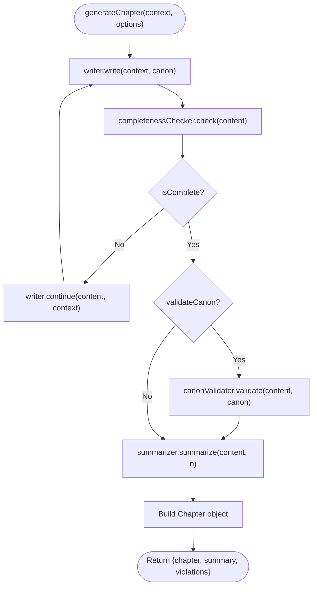

**Diagram sources**
- [packages/engine/src/pipeline/generateChapter.ts:1-76](file://packages/engine/src/pipeline/generateChapter.ts#L1-L76)
- [packages/engine/src/agents/writer.ts:1-146](file://packages/engine/src/agents/writer.ts#L1-L146)
- [packages/engine/src/agents/completeness.ts:1-200](file://packages/engine/src/agents/completeness.ts#L1-L200)
- [packages/engine/src/agents/summarizer.ts:1-200](file://packages/engine/src/agents/summarizer.ts#L1-L200)
- [packages/engine/src/agents/canonValidator.ts:1-200](file://packages/engine/src/agents/canonValidator.ts#L1-L200)

**Section sources**
- [packages/engine/src/pipeline/generateChapter.ts:1-76](file://packages/engine/src/pipeline/generateChapter.ts#L1-L76)

### Memory and Canon Store
The canon store maintains immutable facts categorized by character/world/plot/timeline, enabling validation and prompt formatting.

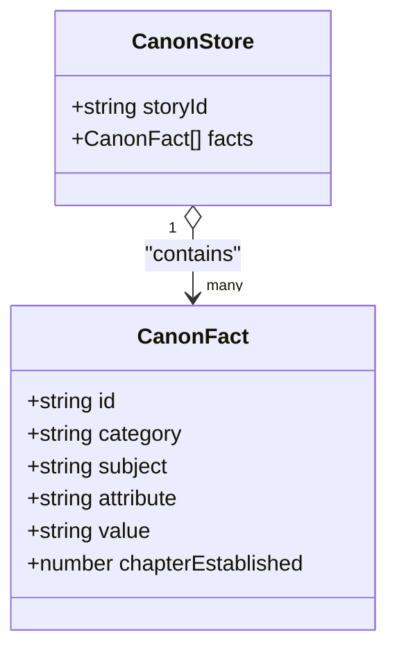

**Diagram sources**
- [packages/engine/src/memory/canonStore.ts:1-134](file://packages/engine/src/memory/canonStore.ts#L1-L134)

**Section sources**
- [packages/engine/src/memory/canonStore.ts:1-134](file://packages/engine/src/memory/canonStore.ts#L1-L134)

### Types and Contracts
Core data structures define story bibles, characters, plot threads, chapters, summaries, and generation contexts.

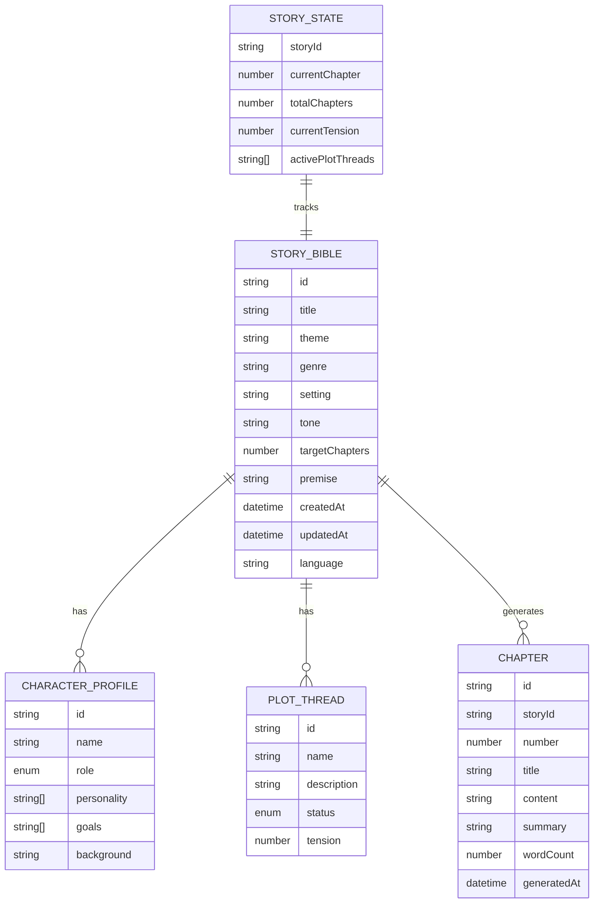

**Diagram sources**
- [packages/engine/src/types/index.ts:1-90](file://packages/engine/src/types/index.ts#L1-L90)

**Section sources**
- [packages/engine/src/types/index.ts:1-90](file://packages/engine/src/types/index.ts#L1-L90)

## Dependency Analysis
- Workspace dependencies:
  - CLI depends on the engine package via workspace protocol.
  - Engine depends on OpenAI SDK and Zod.
- Orchestration:
  - Root scripts delegate to Turborepo tasks.
  - Turborepo tasks define caching, persistent processes for dev, and task dependencies.

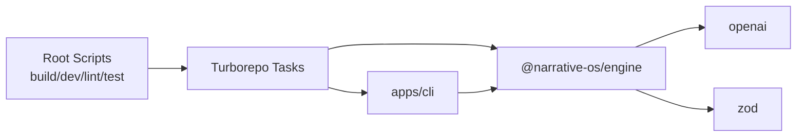

**Diagram sources**
- [package.json:5-11](file://package.json#L5-L11)
- [turbo.json:4-16](file://turbo.json#L4-L16)
- [apps/cli/package.json:40-44](file://apps/cli/package.json#L40-L44)
- [packages/engine/package.json:34-38](file://packages/engine/package.json#L34-L38)

**Section sources**
- [apps/cli/package.json:1-50](file://apps/cli/package.json#L1-L50)
- [packages/engine/package.json:1-46](file://packages/engine/package.json#L1-L46)
- [package.json:1-17](file://package.json#L1-L17)
- [turbo.json:1-19](file://turbo.json#L1-L19)

## Development Tooling and Automation

### Automated Installation Scripts
The project now includes comprehensive installation automation for streamlined development setup:

**Windows PowerShell Installation (`install.ps1`)**
- Automatic detection of package managers (pnpm preferred, npm fallback)
- Node.js version verification (Node.js 20+ required)
- Git-based cloning with fallback to ZIP download
- Automatic dependency installation and project building
- Global CLI installation for immediate use

**Installation Features:**
- Colorful progress indicators and error handling
- Interactive configuration prompts
- Automatic pnpm setup for Windows users
- Fallback mechanisms for network failures
- Comprehensive success messaging and quick start guide

**Section sources**
- [install.ps1:1-130](file://install.ps1#L1-L130)

### Development Environment Setup
- **Package Manager**: PNPM 9.0.0 with workspace support
- **Node.js**: Version 20.0.0+ required for all packages
- **TypeScript**: Version 5.4.0+ for type safety
- **Turborepo**: Version 2.0.0+ for task orchestration

**Section sources**
- [package.json:4-15](file://package.json#L4-L15)
- [apps/cli/package.json:37-39](file://apps/cli/package.json#L37-L39)
- [packages/engine/package.json:31-33](file://packages/engine/package.json#L31-L33)

## Repository Organization and Management

### Standardized .gitignore Patterns
The repository maintains clean organization through comprehensive .gitignore patterns that prevent accidental commits of generated content and temporary files. The latest update includes the `Narrative_Operating_System/` pattern to standardize project directory naming and prevent conflicts with generated content.

**Standardized Patterns Include:**
- **Dependencies**: `node_modules/`, `.pnp`, `.pnp.js`
- **Build Outputs**: `dist/`, `build/`, `*.tsbuildinfo`
- **Environment Variables**: `.env`, `.env.local`, `.env.*.local`
- **IDE Files**: `.idea/`, `.vscode/`, `*.swp`, `*.swo`, `*~`
- **Operating System**: `.DS_Store`, `Thumbs.db`
- **Logs**: `logs/`, `*.log`, `npm-debug.log*`, `yarn-debug.log*`, `yarn-error.log*`
- **Testing**: `coverage/`, `.nyc_output/`
- **Turborepo**: `.turbo/`
- **Cache**: `.cache/`, `*.cache`
- **Temporary Files**: `tmp/`, `temp/`, `*.tmp`
- **Project Organization**: `Narrative_Operating_System/` (new)

**New Pattern Explanation:**
The `Narrative_Operating_System/` pattern ensures that any directory with this name is ignored by Git, preventing accidental commits of generated content or temporary project files. This pattern helps maintain clean repository state and prevents conflicts with development workflows that might create directories with this naming convention.

**Section sources**
- [.gitignore:1-50](file://.gitignore#L1-L50)

### Repository Cleanup and Maintenance
- Regularly review .gitignore patterns to ensure they cover new build artifacts and temporary files
- Use standardized directory naming conventions to improve repository organization
- Monitor for accidental commits of generated content and update .gitignore patterns as needed
- Maintain consistent patterns across all development environments

**Section sources**
- [.gitignore:50-50](file://.gitignore#L50-L50)

## Cross-Platform Installation and Publishing

### Windows PowerShell Installation Workflow
The Windows installation script provides a complete automated setup experience:

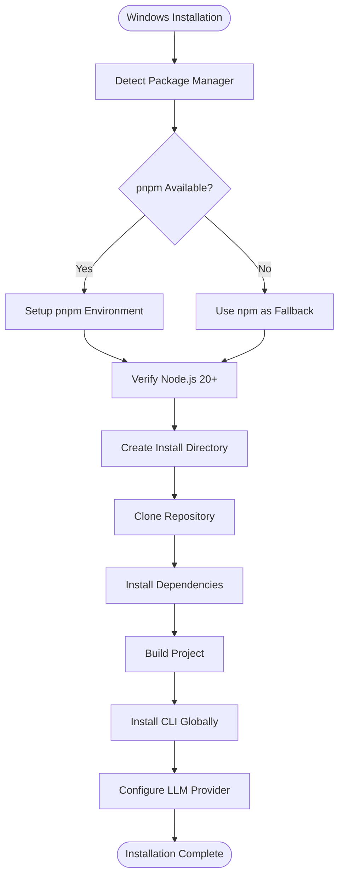

**Diagram sources**
- [install.ps1:10-130](file://install.ps1#L10-L130)

**Section sources**
- [install.ps1:1-130](file://install.ps1#L1-L130)

### Cross-Platform Publishing Workflows
The project supports publishing workflows for both Windows PowerShell and Unix-like systems:

**Windows PowerShell Publisher (`publish.ps1`)**
- Validates npm authentication before publishing
- Builds the project using PNPM
- Publishes both engine and CLI packages sequentially
- Automatically updates CLI dependencies to match engine version
- Provides detailed progress feedback and version confirmation

**Unix-like Shell Publisher (`publish.sh`)**
- Identical functionality to Windows publisher with shell scripting syntax
- Uses bash color codes for enhanced user experience
- Supports the same version bump types (patch, minor, major)
- Maintains consistent workflow across platforms

**Publishing Features:**
- Version bump type validation (patch/minor/major)
- Automatic dependency version synchronization
- npm authentication verification
- Progress tracking and success confirmation
- User confirmation prompts for safety

**Section sources**
- [publish.ps1:1-95](file://publish.ps1#L1-L95)
- [publish.sh:1-100](file://publish.sh#L1-L100)

### Platform-Specific Considerations
- **Windows Users**: PowerShell scripts provide native Windows integration with colored output and environment variable handling
- **Unix-like Systems**: Shell scripts offer POSIX-compliant functionality with color support
- **Cross-Platform Compatibility**: Both scripts maintain identical functionality while adapting to platform-specific syntax
- **Environment Requirements**: Both scripts require PNPM 9.0.0+ and Node.js 20.0.0+

**Section sources**
- [publish.ps1:1-95](file://publish.ps1#L1-L95)
- [publish.sh:1-100](file://publish.sh#L1-L100)

## Performance Considerations
- Caching and Dev Persistence:
  - Turborepo disables caching for dev tasks and marks them as persistent to keep servers warm during development.
- Task Dependencies:
  - Tests depend on build to ensure compiled artifacts are available.
- LLM Cost and Token Limits:
  - Tune temperature and max tokens per provider to balance quality and cost.
- Pipeline Iterations:
  - The generation loop continues until completeness or max attempts; adjust maxContinuationAttempts to control latency vs. quality.
- **New**: Enhanced LLM Performance:
  - Multi-model configuration allows optimal model selection per task type (reasoning for complex tasks, chat for validation, fast for summarization).
  - Automatic model switching reduces latency and improves cost efficiency.
  - Task-based model mapping optimizes resource utilization.
- **New**: Repository Organization Performance:
  - Standardized .gitignore patterns reduce repository size and improve Git operations performance.
  - Clean repository state reduces merge conflicts and improves development workflow efficiency.
  - Consistent directory naming conventions improve project discoverability and maintenance.
- **New**: Language Detection Performance:
  - Efficient regex-based character detection minimizes computational overhead.
  - Automatic language-aware character generation reduces cultural mismatch costs.
  - Multi-language support enables optimized prompt engineering for different writing systems.

## Troubleshooting Guide

### Installation Issues
- **Package Manager Detection**: Scripts automatically detect and use available package managers (pnpm preferred).
- **Node.js Requirements**: Ensure Node.js 20.0.0+ is installed; scripts verify version compatibility.
- **Git Availability**: Git is required for cloning; fallback to ZIP download if git is unavailable.
- **Network Connectivity**: Scripts include fallback mechanisms for repository access failures.

### Publishing Issues
- **npm Authentication**: Both scripts verify npm login status before proceeding with publishing.
- **Version Conflicts**: Scripts automatically synchronize CLI dependency versions with engine releases.
- **Build Failures**: Publishing scripts build projects before attempting publication to ensure clean releases.

### Environment Variables
- LLM provider selection and credentials are loaded from environment variables. Ensure provider and API keys are set before running tests or generation.
- **New**: Multi-Model Configuration: The enhanced configuration system supports both legacy single-model and new multi-model setups with automatic environment variable application.
- **New**: Configuration File Location: Configuration is stored in `~/.narrative-os/config.json` with support for both JSON formats.

### Test Setup
- The test loads a local config file from `~/.narrative-os/config.json` to inject provider and model settings prior to importing engine modules.
- **New**: Enhanced Path Handling: Tests now properly handle both single and multi-model configurations with automatic model selection.
- **New**: Language Detection Testing: Integration tests validate language detection accuracy with Chinese content and other writing systems.

### Error Handling
- CLI commands exit with non-zero status on failure; inspect logs for detailed errors.
- **New**: Installation and publishing scripts provide detailed error messages and recovery suggestions.
- **New**: Repository organization scripts help maintain clean repository state and prevent common organization issues.
- **New**: Multi-Model Configuration Errors: The system provides clear error messages for invalid configuration formats and missing API keys.
- **New**: Language Detection Errors: System validates language detection accuracy and provides fallback mechanisms for edge cases.

**Section sources**
- [install.ps1:20-51](file://install.ps1#L20-L51)
- [publish.ps1:11-19](file://publish.ps1#L11-L19)
- [publish.sh:18-27](file://publish.sh#L18-L27)
- [packages/engine/src/llm/client.ts:46-66](file://packages/engine/src/llm/client.ts#L46-L66)
- [packages/engine/src/test/simple.test.ts:5-18](file://packages/engine/src/test/simple.test.ts#L5-L18)
- [apps/cli/src/commands/generate.ts:50-53](file://apps/cli/src/commands/generate.ts#L50-L53)
- [apps/cli/src/commands/config.ts:60-78](file://apps/cli/src/commands/config.ts#L60-L78)
- [.gitignore:50-50](file://.gitignore#L50-L50)

## Contribution Guidelines
- Development Environment
  - Install PNPM and use workspaces to link packages automatically.
  - Use Turborepo scripts for building, developing, linting, and testing across the monorepo.
  - **New**: Use installation scripts for rapid environment setup on Windows or Unix-like systems.
  - **New**: Follow standardized repository organization practices using .gitignore patterns.
  - **New**: Contribute to multi-model configuration enhancements and testing infrastructure.
  - **New**: Extend language detection capabilities for additional writing systems.
- Code Style
  - Follow TypeScript strictness and formatting conventions used in the repository.
- Commit Messages and PRs
  - Keep commits focused and descriptive.
  - Reference related issues and include a summary of changes.
  - Ensure tests pass locally before opening a pull request.
  - **New**: Review .gitignore patterns when adding new build artifacts or temporary files.
  - **New**: Test multi-model configuration scenarios and cross-platform compatibility.
  - **New**: Validate language detection accuracy with international content samples.
- Review Process
  - Request reviews from maintainers; address feedback promptly.
- **New**: Publishing Contributions
  - Use appropriate publishing scripts for cross-platform compatibility.
  - Follow semantic versioning guidelines when preparing releases.
  - **New**: Ensure repository organization patterns are maintained during releases.
  - **New**: Test enhanced LLM configuration, multi-model functionality, and language detection.

## Release and Version Management

### Versioning Strategy
- **Semantic Versioning**: Follow semver (major.minor.patch) for all releases.
- **Automated Versioning**: Publishing scripts support automatic version bumping (patch, minor, major).
- **Dependency Synchronization**: CLI packages automatically update engine dependencies to match release versions.
- **New**: Version Numbers**: Current versions are 0.1.8 for CLI and 0.1.5 for engine, indicating initial release stability.

### Publishing Process
**Windows PowerShell Publishing:**
1. Run `.\publish.ps1 [patch|minor|major]`
2. Scripts automatically build, version, and publish both packages
3. Verify successful publication and update documentation

**Unix-like Publishing:**
1. Run `./publish.sh [patch|minor|major]`
2. Scripts perform identical workflow to Windows version
3. Ensure npm authentication before running scripts

### Release Automation
- **Automated Dependency Updates**: CLI scripts automatically update engine dependency versions.
- **Consistent Versioning**: Both platforms maintain identical version numbers across packages.
- **Progress Tracking**: Scripts provide detailed feedback throughout the publishing process.
- **Repository Organization**: Release process maintains standardized .gitignore patterns for clean distribution.
- **New**: Multi-Model Configuration Releases: Enhanced configuration system is included in all releases with backward compatibility.
- **New**: Language Detection Releases: Internationalization features are included in all releases with comprehensive testing.

**Section sources**
- [publish.ps1:23-48](file://publish.ps1#L23-L48)
- [publish.sh:29-54](file://publish.sh#L29-L54)
- [apps/cli/package.json:3-3](file://apps/cli/package.json#L3-L3)
- [packages/engine/package.json:3-3](file://packages/engine/package.json#L3-L3)

## Extensibility Guide

### Adding a New Agent
- Define a new agent module exporting a class or factory with a complete method.
- Integrate the agent into the pipeline by composing it with existing steps (e.g., validation, summarization).
- Export the new agent from the engine entry point so the CLI and other consumers can use it.

**Section sources**
- [packages/engine/src/pipeline/generateChapter.ts:1-76](file://packages/engine/src/pipeline/generateChapter.ts#L1-L76)
- [packages/engine/src/index.ts:8-12](file://packages/engine/src/index.ts#L8-L12)

### Extending Memory Strategies
- Extend the CanonStore API to support new categories or retrieval patterns.
- Add formatting helpers for prompts and integrate them into agent prompts.

**Section sources**
- [packages/engine/src/memory/canonStore.ts:101-129](file://packages/engine/src/memory/canonStore.ts#L101-L129)

### Supporting Additional LLM Providers
- Implement a new provider class conforming to the LLMProvider interface.
- Extend the provider selection logic to handle the new provider and its configuration.
- Add environment variables for credentials and base URLs.
- **New**: Multi-Model Support: New providers can be integrated into the multi-model configuration system with proper task-based selection.

**Section sources**
- [packages/engine/src/llm/client.ts:4-6](file://packages/engine/src/llm/client.ts#L4-L6)
- [packages/engine/src/llm/client.ts:68-76](file://packages/engine/src/llm/client.ts#L68-L76)
- [packages/engine/src/llm/client.ts:46-66](file://packages/engine/src/llm/client.ts#L46-L66)

### Enhancing Configuration System
- Extend the configuration interfaces to support new model types and provider options.
- Add validation logic for new configuration formats.
- Update the CLI configuration command to handle new options.

**Section sources**
- [apps/cli/src/commands/config.ts:8-30](file://apps/cli/src/commands/config.ts#L8-L30)
- [apps/cli/src/commands/config.ts:51-53](file://apps/cli/src/commands/config.ts#L51-L53)

### Extending Language Detection
**New**: Extend the language detection system to support additional writing systems.

- Add new character range detection in the `detectLanguage` function
- Update the `getLanguageName` function with language names
- Extend character generation logic to support new languages
- Add comprehensive testing for new writing systems

**Section sources**
- [packages/engine/src/story/bible.ts:8-50](file://packages/engine/src/story/bible.ts#L8-L50)
- [packages/engine/src/story/bible.ts:55-72](file://packages/engine/src/story/bible.ts#L55-L72)
- [packages/engine/src/story/bible.ts:222-242](file://packages/engine/src/story/bible.ts#L222-L242)

## Testing Strategies
- Unit Tests for the Engine
  - The engine includes a comprehensive test suite using Vitest with enhanced multi-model configuration support.
  - Tests load configuration from `~/.narrative-os/config.json` to inject provider and model settings prior to importing engine modules.
  - **New**: Enhanced Path Handling: Tests now properly handle both single and multi-model configurations with automatic model selection.
  - **New**: Language Detection Testing: Integration tests validate language detection accuracy with Chinese content and other writing systems.
- Integration Testing Approaches
  - Use the CLI to drive end-to-end flows: initialize a story, generate chapters iteratively, and verify persisted state and outputs.
  - Mock or stub the LLM client for deterministic tests when appropriate.
  - **New**: Multi-Model Testing: Tests can be configured to use different model types (reasoning, chat, fast) based on task requirements.
  - **New**: International Content Testing: Validate language detection accuracy with multilingual content samples.
- Continuous Integration
  - Configure CI to install PNPM, install dependencies, build, lint, and run tests using Turborepo tasks.
  - Cache node_modules and Turbo cache to speed up jobs.
  - **New**: CI should respect .gitignore patterns to prevent accidental commits of generated content.
  - **New**: CI should test both single and multi-model configuration scenarios.
  - **New**: CI should validate language detection functionality across different writing systems.
- **New**: Automated Testing with Enhanced Configuration
  - Installation scripts can be used to quickly set up test environments on different platforms.
  - Publishing scripts ensure consistent testing environments across development and production.
  - Repository organization patterns help maintain clean test environments.
  - **New**: Multi-Model Configuration Testing: CI should validate both legacy single-model and new multi-model configuration formats.
  - **New**: Language Detection Testing: CI should test language detection accuracy with comprehensive content samples.

**Section sources**
- [packages/engine/src/test/simple.test.ts:1-64](file://packages/engine/src/test/simple.test.ts#L1-L64)
- [packages/engine/src/llm/client.ts:58-111](file://packages/engine/src/llm/client.ts#L58-L111)
- [packages/engine/src/story/bible.ts:8-50](file://packages/engine/src/story/bible.ts#L8-L50)

## Development Workflow
- Local Setup
  - Install PNPM and run installation in the monorepo root.
  - Use Turborepo scripts for development and building.
  - **New**: Use installation scripts for rapid environment setup on Windows or Unix-like systems.
  - **New**: Follow standardized repository organization practices using .gitignore patterns.
  - **New**: Configure multi-model LLM setup using the enhanced CLI configuration system.
  - **New**: Test language detection functionality with international content samples.
- Running the CLI
  - Build the engine and CLI, then use the CLI binary to manage stories.
  - **New**: Use `nos config` to set up multi-model configuration with interactive prompts.
  - **New**: Test language detection by creating stories with different writing systems.
- Debugging
  - Enable verbose logging in the LLM client and pipeline steps.
  - Inspect persisted story state and chapter outputs to isolate issues.
  - **New**: Debug multi-model configuration issues using `nos config --show` to verify current setup.
  - **New**: Debug language detection issues by examining detected language codes and character patterns.
- Profiling
  - Measure generation latency per chapter and track token usage per provider.
  - Adjust model parameters and prompt sizes to optimize throughput.
  - **New**: Monitor multi-model performance differences between reasoning, chat, and fast models.
  - **New**: Track cost optimization benefits of task-based model selection.
  - **New**: Monitor repository organization impact on development workflow efficiency.
  - **New**: Profile language detection performance with various content types and writing systems.
- **New**: Cross-Platform Development
  - Use platform-appropriate installation and publishing scripts for consistent development experience.
  - Leverage automated scripts for environment setup and cleanup across different operating systems.
  - **New**: Maintain consistent repository organization patterns across all development environments.
  - **New**: Test multi-model configuration and language detection across different platforms and Node.js versions.
  - **New**: Validate international content generation across different operating systems and locales.

**Section sources**
- [package.json:5-11](file://package.json#L5-L11)
- [apps/cli/src/index.ts:1-154](file://apps/cli/src/index.ts#L1-L154)
- [packages/engine/src/llm/client.ts:18-28](file://packages/engine/src/llm/client.ts#L18-L28)
- [install.ps1:1-130](file://install.ps1#L1-L130)
- [.gitignore:50-50](file://.gitignore#L50-L50)

## Conclusion
This guide outlines how to develop, test, and contribute to the Narrative Operating System monorepo. By leveraging PNPM workspaces and Turborepo, you can efficiently manage a multi-package TypeScript codebase. The engine's modular design enables easy extension with new agents, memory strategies, and LLM providers, while the CLI provides a practical interface for iterative development and experimentation.

**New additions** to this guide include comprehensive coverage of the automated installation scripts for Windows PowerShell and cross-platform publishing workflows that streamline development and distribution processes, along with enhanced repository organization practices. The standardized .gitignore patterns, including the new `Narrative_Operating_System/` pattern, ensure clean repository management and prevent accidental commits of generated content.

**Most significantly**, the enhanced multi-model LLM configuration system provides unprecedented flexibility in model selection and task optimization. The system now supports both single and complex multi-model setups with automatic task-based model selection, enabling optimal performance and cost efficiency across different generation tasks.

**New**: The comprehensive language detection system represents a major advancement in international content generation, supporting multiple writing systems including Chinese, Japanese, Korean, Arabic, Russian, Thai, and Hindi. This system automatically detects content writing systems and applies appropriate cultural context to story generation, character creation, and narrative consistency checking.

These improvements significantly reduce the barrier to entry for contributors while maintaining reliable distribution of the Narrative Operating System across diverse development environments. The combination of automated tooling, enhanced configuration capabilities, standardized organization practices, and comprehensive internationalization features creates a robust foundation for ongoing development and contribution to the project.

The current version numbers (CLI: 0.1.8, Engine: 0.1.5) indicate a stable initial release with comprehensive multi-model support and advanced language detection capabilities, making it suitable for production use while maintaining room for future enhancements and optimizations in international content generation and cultural authenticity.