# Core Components

<cite>
**Referenced Files in This Document**
- [packages/engine/src/index.ts](file://packages/engine/src/index.ts)
- [packages/engine/src/types/index.ts](file://packages/engine/src/types/index.ts)
- [packages/engine/src/llm/client.ts](file://packages/engine/src/llm/client.ts)
- [packages/engine/src/pipeline/generateChapter.ts](file://packages/engine/src/pipeline/generateChapter.ts)
- [packages/engine/src/story/bible.ts](file://packages/engine/src/story/bible.ts)
- [packages/engine/src/story/state.ts](file://packages/engine/src/story/state.ts)
- [packages/engine/src/memory/canonStore.ts](file://packages/engine/src/memory/canonStore.ts)
- [packages/engine/src/agents/writer.ts](file://packages/engine/src/agents/writer.ts)
- [packages/engine/src/agents/completeness.ts](file://packages/engine/src/agents/completeness.ts)
- [packages/engine/src/agents/summarizer.ts](file://packages/engine/src/agents/summarizer.ts)
- [packages/engine/src/agents/canonValidator.ts](file://packages/engine/src/agents/canonValidator.ts)
- [apps/cli/src/index.ts](file://apps/cli/src/index.ts)
- [apps/cli/src/commands/generate.ts](file://apps/cli/src/commands/generate.ts)
- [apps/cli/src/commands/init.ts](file://apps/cli/src/commands/init.ts)
- [apps/cli/src/commands/continue.ts](file://apps/cli/src/commands/continue.ts)
- [packages/engine/package.json](file://packages/engine/package.json)
</cite>

## Table of Contents
1. [Introduction](#introduction)
2. [Project Structure](#project-structure)
3. [Core Components](#core-components)
4. [Architecture Overview](#architecture-overview)
5. [Detailed Component Analysis](#detailed-component-analysis)
6. [Dependency Analysis](#dependency-analysis)
7. [Performance Considerations](#performance-considerations)
8. [Troubleshooting Guide](#troubleshooting-guide)
9. [Conclusion](#conclusion)
10. [Appendices](#appendices)

## Introduction
This document describes the core engine components that power the Narrative Operating System. It explains the main export structure, the modular architecture, the type system, and how the LLM client, agents, pipeline, story management, and memory systems collaborate. It also covers initialization patterns, dependency injection approaches, and practical examples of component usage within the CLI application.

## Project Structure
The engine is organized as a TypeScript package with clear module boundaries:
- Export surface via a single index barrel that re-exports types and modules for easy consumption.
- LLM client abstraction with provider selection and configuration.
- Agent modules encapsulating specialized tasks (writing, completeness checking, summarization, canon validation).
- Pipeline orchestrating agent workflows to produce chapters.
- Story management for story metadata and runtime state.
- Memory subsystem for canonical facts and cross-checking.
- CLI application demonstrating end-to-end usage.

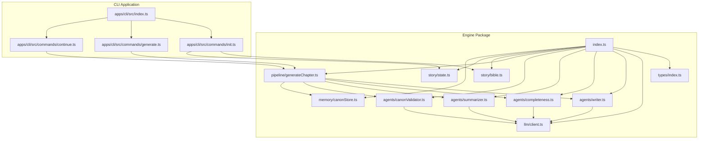

**Diagram sources**
- [packages/engine/src/index.ts](file://packages/engine/src/index.ts#L1-L23)
- [packages/engine/src/llm/client.ts](file://packages/engine/src/llm/client.ts#L1-L106)
- [packages/engine/src/pipeline/generateChapter.ts](file://packages/engine/src/pipeline/generateChapter.ts#L1-L76)
- [packages/engine/src/story/bible.ts](file://packages/engine/src/story/bible.ts#L1-L73)
- [packages/engine/src/story/state.ts](file://packages/engine/src/story/state.ts#L1-L30)
- [packages/engine/src/memory/canonStore.ts](file://packages/engine/src/memory/canonStore.ts#L1-L134)
- [packages/engine/src/agents/writer.ts](file://packages/engine/src/agents/writer.ts#L1-L146)
- [packages/engine/src/agents/completeness.ts](file://packages/engine/src/agents/completeness.ts#L1-L56)
- [packages/engine/src/agents/summarizer.ts](file://packages/engine/src/agents/summarizer.ts#L1-L64)
- [packages/engine/src/agents/canonValidator.ts](file://packages/engine/src/agents/canonValidator.ts#L1-L59)
- [apps/cli/src/index.ts](file://apps/cli/src/index.ts#L1-L54)
- [apps/cli/src/commands/generate.ts](file://apps/cli/src/commands/generate.ts#L1-L55)
- [apps/cli/src/commands/init.ts](file://apps/cli/src/commands/init.ts#L1-L50)
- [apps/cli/src/commands/continue.ts](file://apps/cli/src/commands/continue.ts#L1-L52)

**Section sources**
- [packages/engine/src/index.ts](file://packages/engine/src/index.ts#L1-L23)
- [packages/engine/src/llm/client.ts](file://packages/engine/src/llm/client.ts#L1-L106)
- [packages/engine/src/pipeline/generateChapter.ts](file://packages/engine/src/pipeline/generateChapter.ts#L1-L76)
- [packages/engine/src/story/bible.ts](file://packages/engine/src/story/bible.ts#L1-L73)
- [packages/engine/src/story/state.ts](file://packages/engine/src/story/state.ts#L1-L30)
- [packages/engine/src/memory/canonStore.ts](file://packages/engine/src/memory/canonStore.ts#L1-L134)
- [packages/engine/src/agents/writer.ts](file://packages/engine/src/agents/writer.ts#L1-L146)
- [packages/engine/src/agents/completeness.ts](file://packages/engine/src/agents/completeness.ts#L1-L56)
- [packages/engine/src/agents/summarizer.ts](file://packages/engine/src/agents/summarizer.ts#L1-L64)
- [packages/engine/src/agents/canonValidator.ts](file://packages/engine/src/agents/canonValidator.ts#L1-L59)
- [apps/cli/src/index.ts](file://apps/cli/src/index.ts#L1-L54)

## Core Components
This section outlines the primary building blocks and their responsibilities.

- LLM Client and Provider Abstraction
  - Provides a unified interface to call LLMs with configurable defaults and environment-driven provider selection.
  - Supports OpenAI and DeepSeek providers and exposes synchronous completion and JSON parsing helpers.
  - Includes a global accessor for singleton-like usage.

- Agents
  - ChapterWriter: Generates full chapters using a structured prompt with story context, recent summaries, and optional canonical facts.
  - CompletenessChecker: Validates whether a chapter ends naturally.
  - ChapterSummarizer: Produces concise chapter summaries and extracts key events.
  - CanonValidator: Cross-validates chapter content against canonical facts and reports contradictions.

- Pipeline
  - Orchestrates writing, completeness checks, optional canon validation, and summarization to produce a chapter with metadata and validation feedback.

- Story Management
  - StoryBible: Immutable story blueprint with characters and plot threads.
  - StoryState: Runtime state tracking progress, tension, and chapter summaries.

- Memory
  - CanonStore: Stores canonical facts (character, world, plot, timeline) and utilities to format them for prompts and update values.

- Types
  - Defines core domain models (StoryBible, CharacterProfile, PlotThread, Chapter, StoryState, ChapterSummary), generation context, and LLM configuration interfaces.

**Section sources**
- [packages/engine/src/llm/client.ts](file://packages/engine/src/llm/client.ts#L1-L106)
- [packages/engine/src/agents/writer.ts](file://packages/engine/src/agents/writer.ts#L1-L146)
- [packages/engine/src/agents/completeness.ts](file://packages/engine/src/agents/completeness.ts#L1-L56)
- [packages/engine/src/agents/summarizer.ts](file://packages/engine/src/agents/summarizer.ts#L1-L64)
- [packages/engine/src/agents/canonValidator.ts](file://packages/engine/src/agents/canonValidator.ts#L1-L59)
- [packages/engine/src/pipeline/generateChapter.ts](file://packages/engine/src/pipeline/generateChapter.ts#L1-L76)
- [packages/engine/src/story/bible.ts](file://packages/engine/src/story/bible.ts#L1-L73)
- [packages/engine/src/story/state.ts](file://packages/engine/src/story/state.ts#L1-L30)
- [packages/engine/src/memory/canonStore.ts](file://packages/engine/src/memory/canonStore.ts#L1-L134)
- [packages/engine/src/types/index.ts](file://packages/engine/src/types/index.ts#L1-L90)

## Architecture Overview
The engine follows a layered, modular design:
- Export layer: Centralized exports for public API.
- Domain layer: Types and core data models.
- Infrastructure layer: LLM client and provider abstraction.
- Processing layer: Agents implementing specialized tasks.
- Orchestration layer: Pipeline coordinating agents and state updates.
- Application layer: CLI commands consuming the engine.

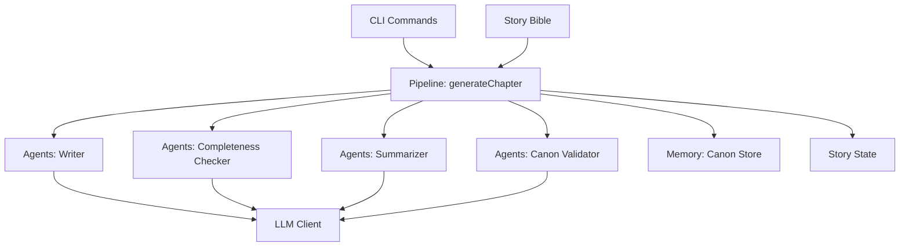

**Diagram sources**
- [packages/engine/src/pipeline/generateChapter.ts](file://packages/engine/src/pipeline/generateChapter.ts#L1-L76)
- [packages/engine/src/agents/writer.ts](file://packages/engine/src/agents/writer.ts#L1-L146)
- [packages/engine/src/agents/completeness.ts](file://packages/engine/src/agents/completeness.ts#L1-L56)
- [packages/engine/src/agents/summarizer.ts](file://packages/engine/src/agents/summarizer.ts#L1-L64)
- [packages/engine/src/agents/canonValidator.ts](file://packages/engine/src/agents/canonValidator.ts#L1-L59)
- [packages/engine/src/memory/canonStore.ts](file://packages/engine/src/memory/canonStore.ts#L1-L134)
- [packages/engine/src/story/state.ts](file://packages/engine/src/story/state.ts#L1-L30)
- [packages/engine/src/story/bible.ts](file://packages/engine/src/story/bible.ts#L1-L73)
- [packages/engine/src/llm/client.ts](file://packages/engine/src/llm/client.ts#L1-L106)

## Detailed Component Analysis

### LLM Client and Provider Abstraction
- Purpose: Encapsulate LLM interactions behind a stable interface, supporting multiple providers and environment-driven configuration.
- Initialization pattern: Constructor resolves provider from configuration or environment variables, sets default LLM configuration, and delegates completions to a provider implementation.
- Dependency injection: Providers are constructed internally based on configuration; consumers call a global accessor to obtain a configured client instance.
- Key behaviors:
  - Provider selection and instantiation.
  - Configurable model, temperature, and token limits.
  - JSON mode with strict parsing and error handling.

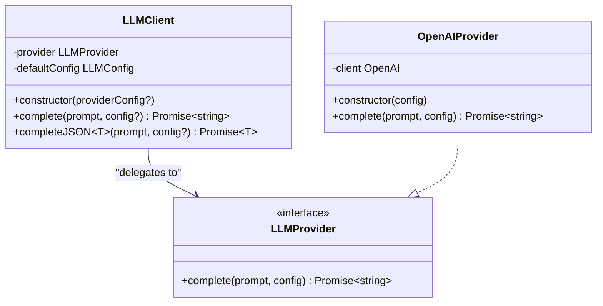

**Diagram sources**
- [packages/engine/src/llm/client.ts](file://packages/engine/src/llm/client.ts#L4-L96)

**Section sources**
- [packages/engine/src/llm/client.ts](file://packages/engine/src/llm/client.ts#L1-L106)

### Agents

#### ChapterWriter
- Purpose: Produce full chapters using a structured prompt enriched with story context, recent summaries, and optional canonical facts.
- Inputs: GenerationContext and optional CanonStore.
- Outputs: WriterOutput containing content, inferred title, and word count.
- Behavior: Builds a prompt template, fills placeholders, calls the LLM client, and optionally continues partial content.

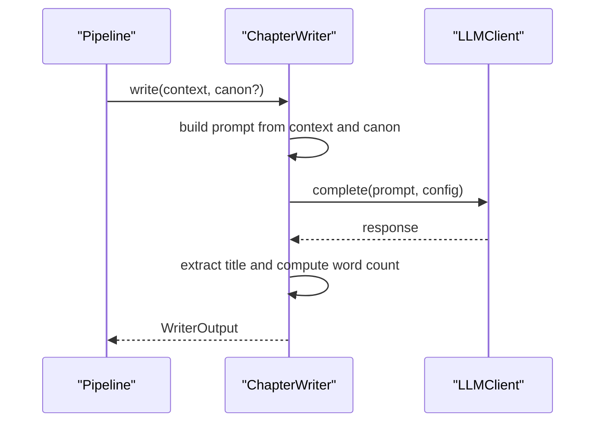

**Diagram sources**
- [packages/engine/src/agents/writer.ts](file://packages/engine/src/agents/writer.ts#L55-L94)
- [packages/engine/src/llm/client.ts](file://packages/engine/src/llm/client.ts#L78-L81)

**Section sources**
- [packages/engine/src/agents/writer.ts](file://packages/engine/src/agents/writer.ts#L1-L146)

#### CompletenessChecker
- Purpose: Determine if a chapter ends at a natural stopping point.
- Inputs: Chapter text.
- Output: CompletenessResult indicating completion status and reason.

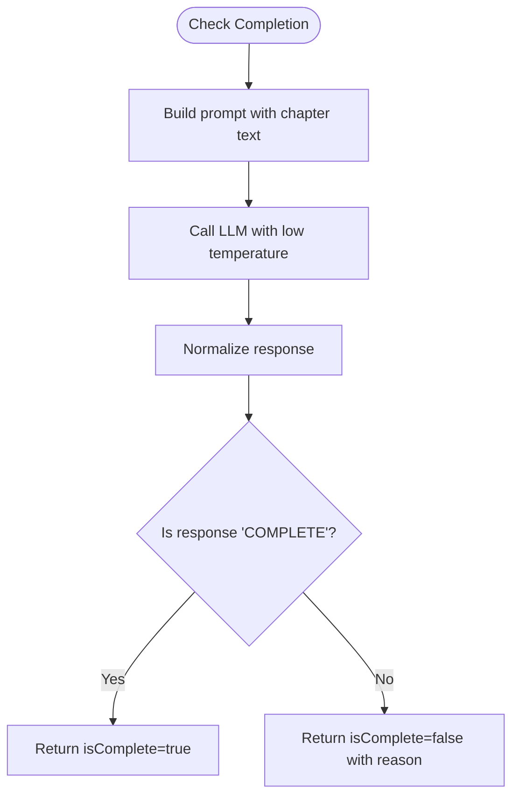

**Diagram sources**
- [packages/engine/src/agents/completeness.ts](file://packages/engine/src/agents/completeness.ts#L37-L52)

**Section sources**
- [packages/engine/src/agents/completeness.ts](file://packages/engine/src/agents/completeness.ts#L1-L56)

#### ChapterSummarizer
- Purpose: Produce a concise chapter summary and extract key events.
- Inputs: Chapter text and chapter number.
- Output: ChapterSummary with chapter number, summary, and extracted key events.

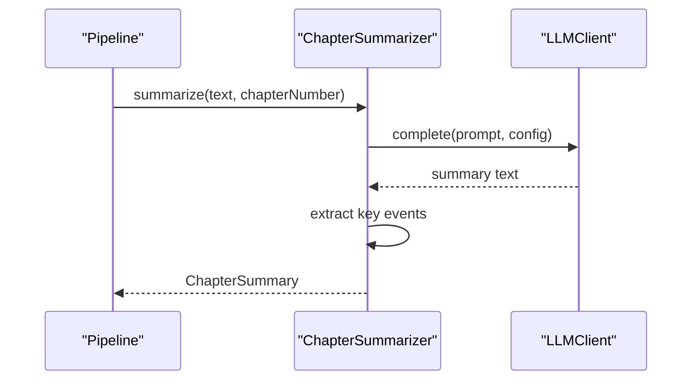

**Diagram sources**
- [packages/engine/src/agents/summarizer.ts](file://packages/engine/src/agents/summarizer.ts#L24-L38)
- [packages/engine/src/llm/client.ts](file://packages/engine/src/llm/client.ts#L78-L81)

**Section sources**
- [packages/engine/src/agents/summarizer.ts](file://packages/engine/src/agents/summarizer.ts#L1-L64)

#### CanonValidator
- Purpose: Validate chapter content against canonical facts and report contradictions.
- Inputs: Chapter text and CanonStore.
- Output: CanonValidationResult with validity and violations.

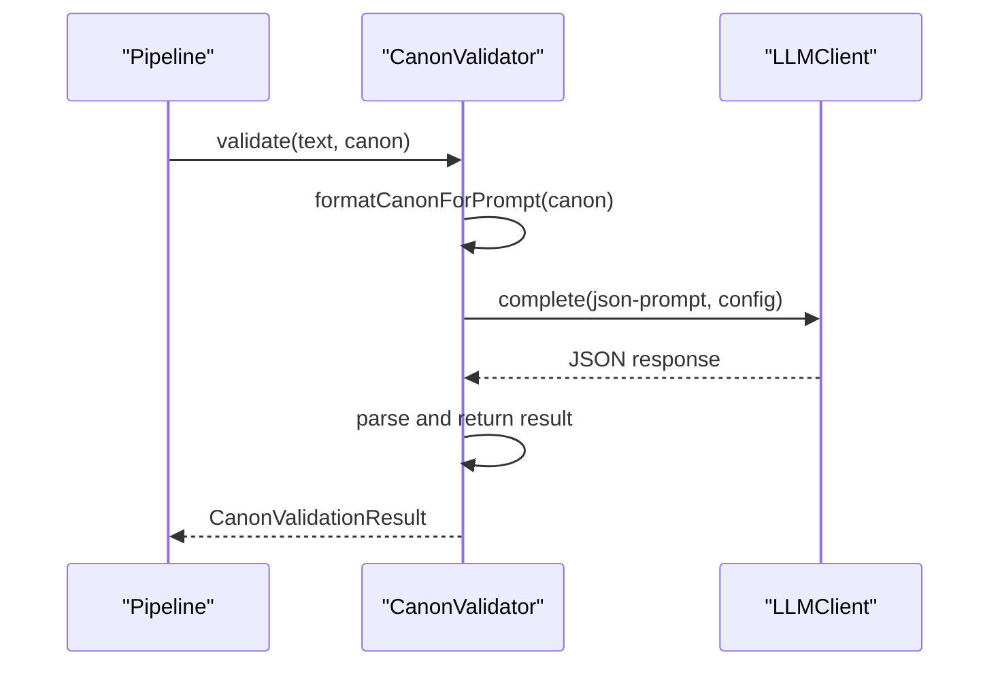

**Diagram sources**
- [packages/engine/src/agents/canonValidator.ts](file://packages/engine/src/agents/canonValidator.ts#L32-L55)
- [packages/engine/src/memory/canonStore.ts](file://packages/engine/src/memory/canonStore.ts#L101-L129)
- [packages/engine/src/llm/client.ts](file://packages/engine/src/llm/client.ts#L83-L95)

**Section sources**
- [packages/engine/src/agents/canonValidator.ts](file://packages/engine/src/agents/canonValidator.ts#L1-L59)

### Pipeline: generateChapter
- Purpose: Orchestrate the chapter generation workflow with optional validation and continuation loops.
- Inputs: GenerationContext and options controlling canon validation and continuation attempts.
- Outputs: GenerateChapterResult including the chapter, summary, and violations.
- Control flow:
  - Write initial chapter.
  - Loop to continue writing until completion criteria are met or max attempts are reached.
  - Optional canon validation and summarization.
  - Construct chapter record and return results.

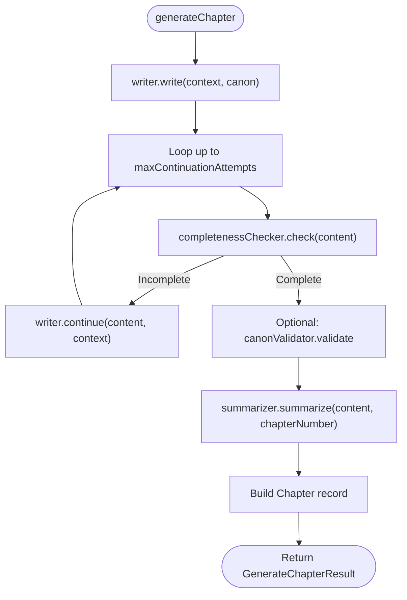

**Diagram sources**
- [packages/engine/src/pipeline/generateChapter.ts](file://packages/engine/src/pipeline/generateChapter.ts#L20-L71)

**Section sources**
- [packages/engine/src/pipeline/generateChapter.ts](file://packages/engine/src/pipeline/generateChapter.ts#L1-L76)

### Story Management
- StoryBible
  - Creation and mutation helpers for adding characters and plot threads.
  - Immutable-like updates returning new instances with updated timestamps.
- StoryState
  - Progress tracking with current chapter, total chapters, current tension, and chapter summaries.
  - State updates compute tension based on progress.

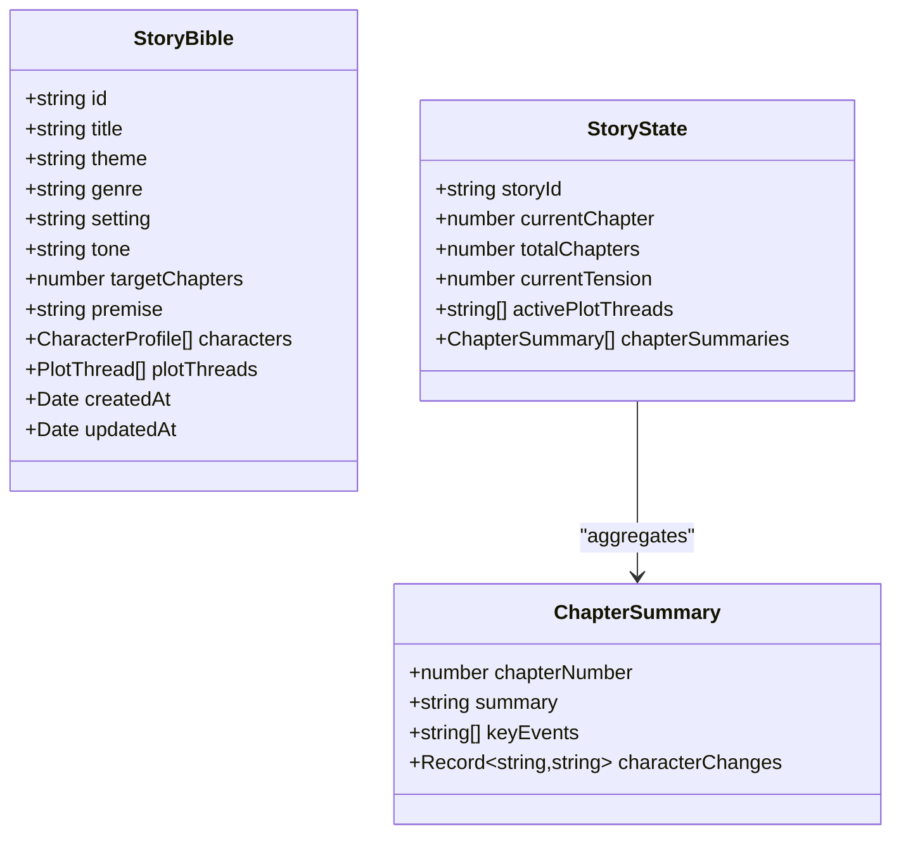

**Diagram sources**
- [packages/engine/src/types/index.ts](file://packages/engine/src/types/index.ts#L1-L58)
- [packages/engine/src/story/state.ts](file://packages/engine/src/story/state.ts#L14-L24)

**Section sources**
- [packages/engine/src/story/bible.ts](file://packages/engine/src/story/bible.ts#L1-L73)
- [packages/engine/src/story/state.ts](file://packages/engine/src/story/state.ts#L1-L30)
- [packages/engine/src/types/index.ts](file://packages/engine/src/types/index.ts#L1-L58)

### Memory: CanonStore
- Purpose: Maintain canonical facts across categories and format them for prompts.
- Operations:
  - Create store and extract from StoryBible.
  - Add/update facts and query by category or identity.
  - Format facts into a human-readable prompt section.

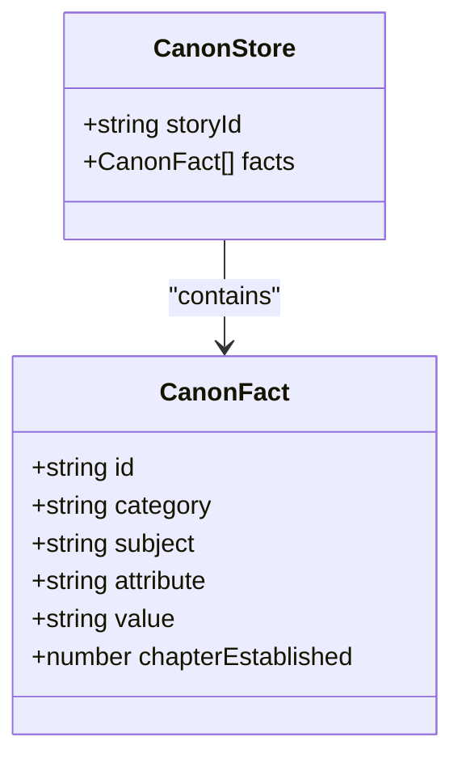

**Diagram sources**
- [packages/engine/src/memory/canonStore.ts](file://packages/engine/src/memory/canonStore.ts#L3-L15)

**Section sources**
- [packages/engine/src/memory/canonStore.ts](file://packages/engine/src/memory/canonStore.ts#L1-L134)

### Type System
- Core interfaces define the domain contracts:
  - StoryBible, CharacterProfile, PlotThread, Chapter, StoryState, ChapterSummary, GenerationContext, WriterOutput, CompletenessResult, LLMConfig, LLMProviderConfig.
- These types enable strong typing across modules and ensure consistent data shapes for orchestration.

**Section sources**
- [packages/engine/src/types/index.ts](file://packages/engine/src/types/index.ts#L1-L90)

### Examples: How Components Work Together
- CLI Init: Creates a StoryBible, adds characters, initializes StoryState, and persists the story.
- CLI Generate: Builds a GenerationContext, invokes generateChapter, updates StoryState, and persists results.
- CLI Continue: Iteratively generates remaining chapters until completion.

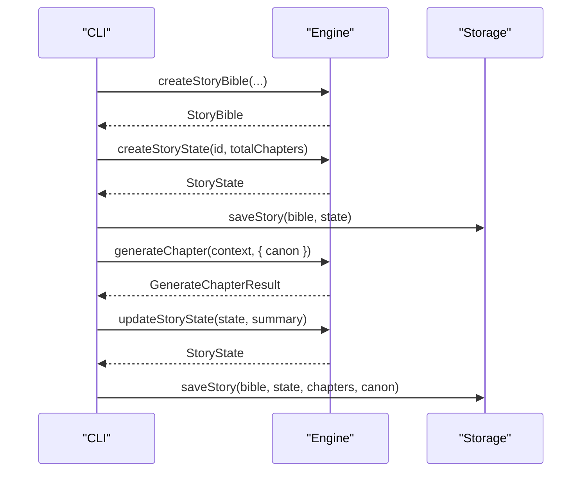

**Diagram sources**
- [apps/cli/src/commands/init.ts](file://apps/cli/src/commands/init.ts#L23-L42)
- [apps/cli/src/commands/generate.ts](file://apps/cli/src/commands/generate.ts#L21-L34)
- [packages/engine/src/pipeline/generateChapter.ts](file://packages/engine/src/pipeline/generateChapter.ts#L20-L71)
- [packages/engine/src/story/state.ts](file://packages/engine/src/story/state.ts#L14-L24)

**Section sources**
- [apps/cli/src/commands/init.ts](file://apps/cli/src/commands/init.ts#L1-L50)
- [apps/cli/src/commands/generate.ts](file://apps/cli/src/commands/generate.ts#L1-L55)
- [apps/cli/src/commands/continue.ts](file://apps/cli/src/commands/continue.ts#L1-L52)
- [packages/engine/src/pipeline/generateChapter.ts](file://packages/engine/src/pipeline/generateChapter.ts#L1-L76)

## Dependency Analysis
- Internal dependencies:
  - Pipeline depends on agents, types, and memory.
  - Agents depend on the LLM client and types.
  - Story modules depend on types.
  - Memory depends on types.
  - CLI depends on engine exports and storage utilities.
- External dependencies:
  - Engine depends on OpenAI SDK and Zod.
- Cohesion and coupling:
  - High cohesion within modules; low coupling between modules via explicit interfaces and types.
  - LLM client isolates provider concerns, enabling future extensibility.

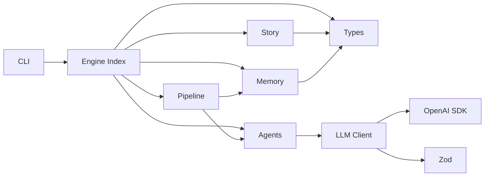

**Diagram sources**
- [packages/engine/src/index.ts](file://packages/engine/src/index.ts#L1-L23)
- [packages/engine/src/llm/client.ts](file://packages/engine/src/llm/client.ts#L1-L106)
- [packages/engine/src/pipeline/generateChapter.ts](file://packages/engine/src/pipeline/generateChapter.ts#L1-L76)
- [packages/engine/src/agents/writer.ts](file://packages/engine/src/agents/writer.ts#L1-L146)
- [packages/engine/src/agents/completeness.ts](file://packages/engine/src/agents/completeness.ts#L1-L56)
- [packages/engine/src/agents/summarizer.ts](file://packages/engine/src/agents/summarizer.ts#L1-L64)
- [packages/engine/src/agents/canonValidator.ts](file://packages/engine/src/agents/canonValidator.ts#L1-L59)
- [packages/engine/src/story/bible.ts](file://packages/engine/src/story/bible.ts#L1-L73)
- [packages/engine/src/story/state.ts](file://packages/engine/src/story/state.ts#L1-L30)
- [packages/engine/src/memory/canonStore.ts](file://packages/engine/src/memory/canonStore.ts#L1-L134)
- [packages/engine/src/types/index.ts](file://packages/engine/src/types/index.ts#L1-L90)
- [packages/engine/package.json](file://packages/engine/package.json#L11-L14)

**Section sources**
- [packages/engine/package.json](file://packages/engine/package.json#L11-L14)
- [packages/engine/src/index.ts](file://packages/engine/src/index.ts#L1-L23)

## Performance Considerations
- Token limits and temperature tuning:
  - Adjust maxTokens and temperature per agent to balance quality and cost.
  - JSON mode uses stricter parsing and lower temperature for deterministic outputs.
- Prompt construction:
  - Keep prompts concise and focused; avoid excessive context that inflates token usage.
- Iterative continuation:
  - Limit max continuation attempts to prevent runaway token usage.
- Memory formatting:
  - Canonical facts are formatted for prompts; keep them minimal and relevant.

[No sources needed since this section provides general guidance]

## Troubleshooting Guide
- LLM provider configuration:
  - Ensure environment variables for provider and API keys are set correctly.
  - Verify model availability and permissions.
- JSON parsing failures:
  - JSON mode enforces strict parsing; review prompt instructions and model behavior.
- Validation anomalies:
  - CanonValidator falls back to no violations on parse errors; inspect validator prompt and input truncation.
- Continuation loops:
  - If chapters remain incomplete, reduce max continuation attempts or adjust writing prompts.

**Section sources**
- [packages/engine/src/llm/client.ts](file://packages/engine/src/llm/client.ts#L46-L66)
- [packages/engine/src/llm/client.ts](file://packages/engine/src/llm/client.ts#L83-L95)
- [packages/engine/src/agents/canonValidator.ts](file://packages/engine/src/agents/canonValidator.ts#L49-L55)
- [packages/engine/src/pipeline/generateChapter.ts](file://packages/engine/src/pipeline/generateChapter.ts#L32-L43)

## Conclusion
The Narrative Operating System engine is designed around a clean separation of concerns: a robust LLM client abstraction, specialized agents for writing, validation, and summarization, a cohesive pipeline orchestrator, and well-defined story and memory modules. The type system ensures consistency across components, while the CLI demonstrates practical usage patterns. This architecture supports modularity, testability, and extensibility, enabling reuse and incremental enhancements.

[No sources needed since this section summarizes without analyzing specific files]

## Appendices

### Initialization Patterns and Dependency Injection
- LLMClient singleton via global accessor:
  - Lazy initialization with environment-driven provider selection.
- Agent composition:
  - Agents are instantiated as singletons and rely on the global LLM accessor.
- Pipeline orchestration:
  - Accepts optional CanonStore and configuration options, enabling flexible invocation.

**Section sources**
- [packages/engine/src/llm/client.ts](file://packages/engine/src/llm/client.ts#L98-L106)
- [packages/engine/src/agents/writer.ts](file://packages/engine/src/agents/writer.ts#L145-L146)
- [packages/engine/src/agents/completeness.ts](file://packages/engine/src/agents/completeness.ts#L55-L56)
- [packages/engine/src/agents/summarizer.ts](file://packages/engine/src/agents/summarizer.ts#L63-L64)
- [packages/engine/src/agents/canonValidator.ts](file://packages/engine/src/agents/canonValidator.ts#L58-L59)
- [packages/engine/src/pipeline/generateChapter.ts](file://packages/engine/src/pipeline/generateChapter.ts#L14-L18)