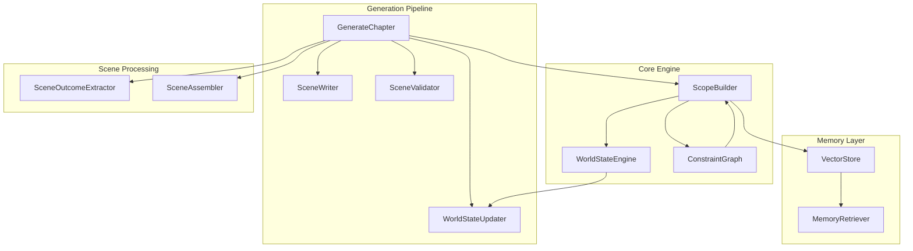
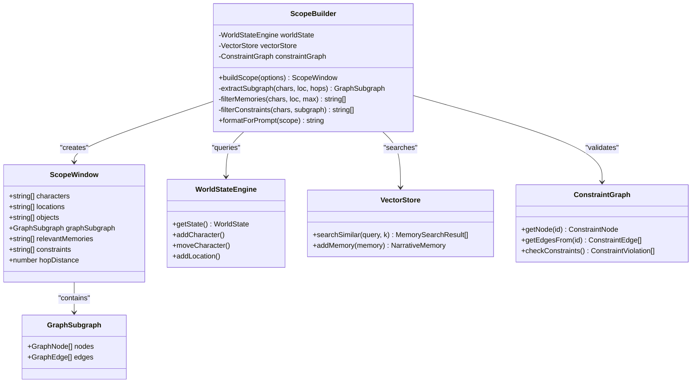
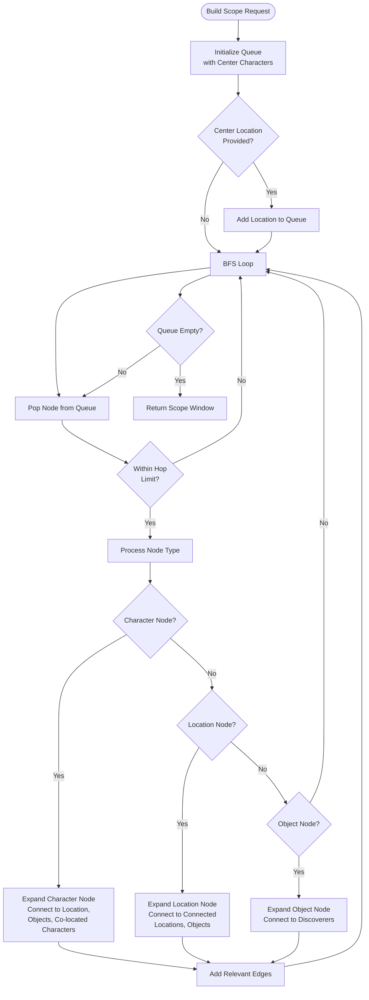
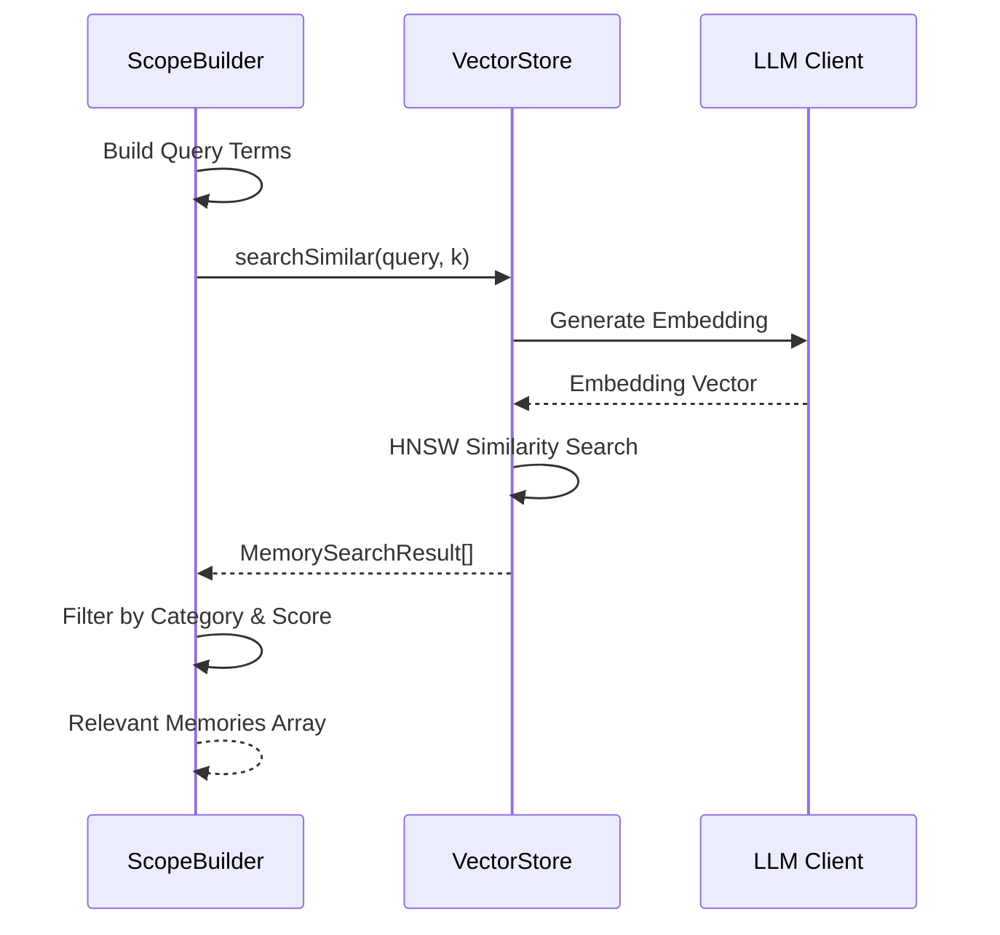
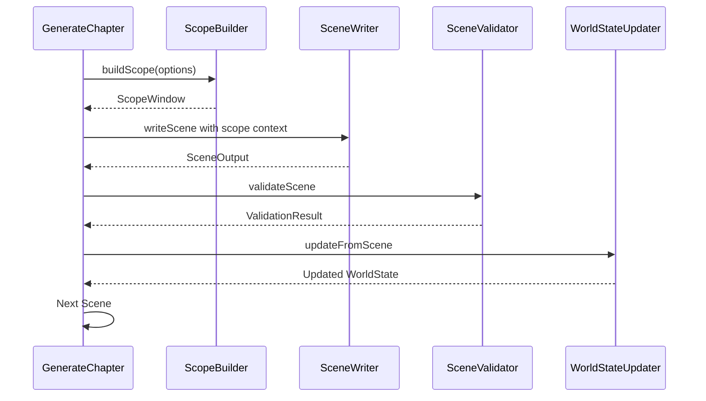
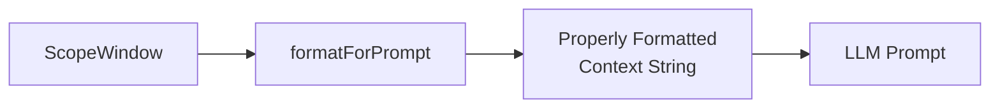

# Scope Builder System

<cite>
**Referenced Files in This Document**
- [scopeBuilder.ts](file://packages/engine/src/scope/scopeBuilder.ts)
- [generateChapter.ts](file://packages/engine/src/pipeline/generateChapter.ts)
- [worldStateEngine.ts](file://packages/engine/src/world/worldStateEngine.ts)
- [vectorStore.ts](file://packages/engine/src/memory/vectorStore.ts)
- [constraintGraph.ts](file://packages/engine/src/constraints/constraintGraph.ts)
- [sceneWriter.ts](file://packages/engine/src/agents/sceneWriter.ts)
- [sceneValidator.ts](file://packages/engine/src/agents/sceneValidator.ts)
- [worldStateUpdater.ts](file://packages/engine/src/agents/worldStateUpdater.ts)
- [sceneOutcomeExtractor.ts](file://packages/engine/src/scene/sceneOutcomeExtractor.ts)
- [index.ts](file://packages/engine/src/types/index.ts)
</cite>

## Table of Contents
1. [Introduction](#introduction)
2. [System Architecture](#system-architecture)
3. [Core Components](#core-components)
4. [Scope Window Construction](#scope-window-construction)
5. [Integration Points](#integration-points)
6. [Performance Characteristics](#performance-characteristics)
7. [Usage Patterns](#usage-patterns)
8. [Troubleshooting Guide](#troubleshooting-guide)
9. [Conclusion](#conclusion)

## Introduction

The Scope Builder System is a sophisticated narrative context management component designed to optimize Large Language Model (LLM) performance during story generation. This system implements a "Narrative Scope Windows" approach that dynamically loads only relevant context for each scene, significantly reducing token usage while maintaining narrative coherence.

The system operates on the principle that effective storytelling requires focused context rather than exhaustive world knowledge. By extracting subgraphs within N hops of active characters and filtering memories based on scene relevance, the Scope Builder ensures that LLMs receive precisely the information needed for coherent scene generation without overwhelming computational resources.

## System Architecture

The Scope Builder System integrates seamlessly with the broader narritive_os narrative engine through a well-defined architecture that separates concerns between context extraction, memory retrieval, and constraint validation.



**Diagram sources**
- [scopeBuilder.ts:49-105](file://packages/engine/src/scope/scopeBuilder.ts#L49-L105)
- [generateChapter.ts:217-232](file://packages/engine/src/pipeline/generateChapter.ts#L217-L232)
- [worldStateEngine.ts:64-79](file://packages/engine/src/world/worldStateEngine.ts#L64-L79)

## Core Components

### ScopeBuilder Class

The `ScopeBuilder` serves as the central orchestrator for context construction, implementing a breadth-first search algorithm to extract relevant narrative context within configurable distance thresholds.



**Diagram sources**
- [scopeBuilder.ts:49-480](file://packages/engine/src/scope/scopeBuilder.ts#L49-L480)
- [worldStateEngine.ts:278-284](file://packages/engine/src/world/worldStateEngine.ts#L278-L284)

### ScopeWindow Interface

The `ScopeWindow` represents the complete context bundle returned by the ScopeBuilder, containing all relevant narrative elements for scene generation:

- **Characters**: All characters within the scope window
- **Locations**: Supporting locations and their connections
- **Objects**: Relevant objects and their relationships
- **Graph Subgraph**: Extracted narrative graph with nodes and edges
- **Relevant Memories**: Filtered memories based on scene context
- **Constraints**: Identified constraint violations for validation

**Section sources**
- [scopeBuilder.ts:12-20](file://packages/engine/src/scope/scopeBuilder.ts#L12-L20)
- [scopeBuilder.ts:96-104](file://packages/engine/src/scope/scopeBuilder.ts#L96-L104)

## Scope Window Construction

The scope building process follows a systematic approach that balances computational efficiency with narrative completeness.

### Breadth-First Subgraph Extraction

The system employs a breadth-first search algorithm to construct narrative subgraphs around center characters and locations:



**Diagram sources**
- [scopeBuilder.ts:110-179](file://packages/engine/src/scope/scopeBuilder.ts#L110-L179)
- [scopeBuilder.ts:181-349](file://packages/engine/src/scope/scopeBuilder.ts#L181-L349)

### Memory Filtering Process

The memory filtering system leverages vector similarity search to identify relevant past events and character developments:



**Diagram sources**
- [scopeBuilder.ts:354-374](file://packages/engine/src/scope/scopeBuilder.ts#L354-L374)
- [vectorStore.ts:107-127](file://packages/engine/src/memory/vectorStore.ts#L107-L127)

**Section sources**
- [scopeBuilder.ts:110-179](file://packages/engine/src/scope/scopeBuilder.ts#L110-L179)
- [scopeBuilder.ts:354-403](file://packages/engine/src/scope/scopeBuilder.ts#L354-L403)

## Integration Points

### Generation Pipeline Integration

The Scope Builder integrates deeply with the chapter generation pipeline, providing context windows for each scene:



**Diagram sources**
- [generateChapter.ts:225-232](file://packages/engine/src/pipeline/generateChapter.ts#L225-L232)
- [sceneWriter.ts:20-31](file://packages/engine/src/agents/sceneWriter.ts#L20-L31)

### World State Synchronization

The system maintains synchronization with the World State Engine to ensure narrative consistency:

| Operation | Trigger | Action |
|-----------|---------|---------|
| Character Movement | Scene Outcome | Update location in WorldState |
| Object Discovery | Scene Content | Add discovery record |
| Relationship Changes | Scene Analysis | Update trust/hostility metrics |
| Event Creation | Scene Summary | Log new timeline events |

**Section sources**
- [generateChapter.ts:291-297](file://packages/engine/src/pipeline/generateChapter.ts#L291-L297)
- [worldStateUpdater.ts:130-247](file://packages/engine/src/agents/worldStateUpdater.ts#L130-L247)

## Performance Characteristics

### Computational Efficiency

The Scope Builder optimizes performance through several mechanisms:

- **Hop Distance Control**: Limits search radius to configurable distance (default: 2 hops)
- **Memory Capping**: Restricts memory retrieval to maximum specified count
- **Lazy Initialization**: Vector store embeddings generated only when needed
- **Efficient Graph Traversal**: BFS algorithm minimizes redundant processing

### Memory Management

The system implements sophisticated memory management strategies:

- **Dynamic Index Resizing**: Automatically scales HNSW index capacity
- **Dimension Detection**: Adapts to embedding model output dimensions
- **Mock Embedding Support**: Enables testing without external APIs
- **Incremental Loading**: Supports large story corpora through pagination

**Section sources**
- [scopeBuilder.ts:76-84](file://packages/engine/src/scope/scopeBuilder.ts#L76-L84)
- [vectorStore.ts:31-92](file://packages/engine/src/memory/vectorStore.ts#L31-L92)

## Usage Patterns

### Basic Scope Building

The most common usage pattern involves building scopes for scene-level generation:

```typescript
const scopeBuilder = createScopeBuilder(worldStateEngine, vectorStore);
const scopeWindow = await scopeBuilder.buildScope({
  centerCharacters: ['Alice', 'Bob'],
  centerLocation: 'Castle',
  maxHops: 2,
  maxMemories: 8,
  includeConstraints: true
});
```

### Advanced Configuration

For specialized scenarios, developers can customize the scope building process:

- **Reduced Context**: Lower hop distances for focused scenes
- **Expanded Memory**: Higher memory limits for complex narratives
- **Constraint-Free**: Disable constraint checking for debugging
- **Custom Centers**: Multiple center characters for ensemble scenes

### Prompt Formatting

The Scope Builder provides formatted context suitable for LLM prompts:



**Diagram sources**
- [scopeBuilder.ts:427-470](file://packages/engine/src/scope/scopeBuilder.ts#L427-L470)

**Section sources**
- [scopeBuilder.ts:427-470](file://packages/engine/src/scope/scopeBuilder.ts#L427-L470)
- [generateChapter.ts:225-232](file://packages/engine/src/pipeline/generateChapter.ts#L225-L232)

## Troubleshooting Guide

### Common Issues and Solutions

**Issue**: Empty scope window returned
- **Cause**: No characters found in center list
- **Solution**: Verify character names match WorldState records

**Issue**: Memory search failures
- **Cause**: Vector store not initialized or API errors
- **Solution**: Call `vectorStore.initialize()` before use

**Issue**: Performance degradation with large stories
- **Cause**: Excessive hop distances or memory limits
- **Solution**: Reduce `maxHops` or `maxMemories` parameters

**Issue**: Constraint violations flagged incorrectly
- **Cause**: Outdated constraint graph state
- **Solution**: Rebuild constraint graph from current WorldState

### Debugging Tools

The system provides several debugging capabilities:

- **Hop Distance Monitoring**: Track actual distance traversed
- **Memory Score Analysis**: Examine similarity scores
- **Graph Statistics**: Monitor node and edge counts
- **Constraint Reports**: Detailed violation analysis

**Section sources**
- [scopeBuilder.ts:370-373](file://packages/engine/src/scope/scopeBuilder.ts#L370-L373)
- [constraintGraph.ts:229-245](file://packages/engine/src/constraints/constraintGraph.ts#L229-L245)

## Conclusion

The Scope Builder System represents a sophisticated approach to narrative context management that balances computational efficiency with storytelling coherence. Through its intelligent subgraph extraction, memory filtering, and constraint validation capabilities, it enables scalable story generation while maintaining narrative integrity.

The system's modular design allows for easy integration with various narrative engines and supports extensible customization for different story genres and complexity levels. Its performance characteristics make it suitable for both interactive storytelling applications and automated narrative generation systems.

Future enhancements could include dynamic hop adjustment based on narrative complexity, advanced memory categorization, and real-time constraint monitoring for live storytelling applications.