# Engine Architecture

<cite>
**Referenced Files in This Document**
- [packages/engine/src/index.ts](file://packages/engine/src/index.ts)
- [packages/engine/src/types/index.ts](file://packages/engine/src/types/index.ts)
- [packages/engine/src/llm/client.ts](file://packages/engine/src/llm/client.ts)
- [packages/engine/src/memory/canonStore.ts](file://packages/engine/src/memory/canonStore.ts)
- [packages/engine/src/memory/vectorStore.ts](file://packages/engine/src/memory/vectorStore.ts)
- [packages/engine/src/memory/memoryRetriever.ts](file://packages/engine/src/memory/memoryRetriever.ts)
- [packages/engine/src/memory/stateUpdater.ts](file://packages/engine/src/memory/stateUpdater.ts)
- [packages/engine/src/pipeline/generateChapter.ts](file://packages/engine/src/pipeline/generateChapter.ts)
- [packages/engine/src/story/bible.ts](file://packages/engine/src/story/bible.ts)
- [packages/engine/src/story/structuredState.ts](file://packages/engine/src/story/structuredState.ts)
- [packages/engine/src/agents/writer.ts](file://packages/engine/src/agents/writer.ts)
- [packages/engine/src/agents/completeness.ts](file://packages/engine/src/agents/completeness.ts)
- [packages/engine/src/agents/summarizer.ts](file://packages/engine/src/agents/summarizer.ts)
- [packages/engine/src/agents/canonValidator.ts](file://packages/engine/src/agents/canonValidator.ts)
- [packages/engine/src/agents/memoryExtractor.ts](file://packages/engine/src/agents/memoryExtractor.ts)
- [packages/engine/src/agents/stateUpdater.ts](file://packages/engine/src/agents/stateUpdater.ts)
- [packages/engine/src/agents/chapterPlanner.ts](file://packages/engine/src/agents/chapterPlanner.ts)
- [packages/engine/src/agents/scenePlanner.ts](file://packages/engine/src/agents/scenePlanner.ts)
- [packages/engine/src/agents/sceneWriter.ts](file://packages/engine/src/agents/sceneWriter.ts)
- [packages/engine/src/agents/sceneValidator.ts](file://packages/engine/src/agents/sceneValidator.ts)
- [packages/engine/src/agents/sceneAssembler.ts](file://packages/engine/src/agents/sceneAssembler.ts)
- [packages/engine/src/agents/sceneOutcomeExtractor.ts](file://packages/engine/src/agents/sceneOutcomeExtractor.ts)
- [packages/engine/src/agents/tensionController.ts](file://packages/engine/src/agents/tensionController.ts)
- [packages/engine/src/agents/storyDirector.ts](file://packages/engine/src/agents/storyDirector.ts)
- [packages/engine/src/agents/characterStrategy.ts](file://packages/engine/src/agents/characterStrategy.ts)
- [packages/engine/src/agents/worldStateUpdater.ts](file://packages/engine/src/agents/worldStateUpdater.ts)
- [packages/engine/src/world/worldState.ts](file://packages/engine/src/world/worldState.ts)
- [packages/engine/src/world/characterAgent.ts](file://packages/engine/src/world/characterAgent.ts)
- [packages/engine/src/world/eventResolver.ts](file://packages/engine/src/world/eventResolver.ts)
- [packages/engine/src/world/worldStateEngine.ts](file://packages/engine/src/world/worldStateEngine.ts)
- [packages/engine/src/skills/loader.ts](file://packages/engine/src/skills/loader.ts)
- [packages/engine/src/scope/scopeBuilder.ts](file://packages/engine/src/scope/scopeBuilder.ts)
- [packages/engine/src/constraints/constraintGraph.ts](file://packages/engine/src/constraints/constraintGraph.ts)
- [packages/engine/src/constraints/validator.ts](file://packages/engine/src/constraints/validator.ts)
- [apps/cli/src/index.ts](file://apps/cli/src/index.ts)
- [apps/cli/src/commands/generate.ts](file://apps/cli/src/commands/generate.ts)
- [apps/cli/src/commands/validate.ts](file://apps/cli/src/commands/validate.ts)
- [apps/cli/src/commands/state.ts](file://apps/cli/src/commands/state.ts)
- [apps/cli/src/commands/memories.ts](file://apps/cli/src/commands/memories.ts)
- [apps/cli/src/config/store.ts](file://apps/cli/src/config/store.ts)
- [apps/cli/src/commands/config.ts](file://apps/cli/src/commands/config.ts)
- [turbo.json](file://turbo.json)
- [pnpm-workspace.yaml](file://pnpm-workspace.yaml)
- [packages/engine/README.md](file://packages/engine/README.md)
- [packages/engine/package.json](file://packages/engine/package.json)
</cite>

## Update Summary
**Changes Made**
- Added new CharacterStrategyAnalyzer with LLM-powered JSON parsing for character-driven narrative analysis
- Integrated skills loader system with graceful fallback for external skills package
- Enhanced chapter generation pipeline with character strategy analysis and persistence
- Updated world state engine with character strategy management and persistence
- Added WorldStateUpdater agent for extracting and applying world state changes
- Expanded character strategy analysis with conflict detection and relationship mapping

## Table of Contents
1. [Introduction](#introduction)
2. [Project Structure](#project-structure)
3. [Core Components](#core-components)
4. [Architecture Overview](#architecture-overview)
5. [Detailed Component Analysis](#detailed-component-analysis)
6. [Dependency Analysis](#dependency-analysis)
7. [Performance Considerations](#performance-considerations)
8. [Troubleshooting Guide](#troubleshooting-guide)
9. [Conclusion](#conclusion)
10. [Appendices](#appendices)

## Introduction
This document describes the architecture of the Narrative Operating System engine package, focusing on the AI-powered story generation system. The engine follows an advanced agent-based architecture with a clear separation of concerns: agents encapsulate specialized tasks (writing, completeness checking, summarization, and canon validation), a **multi-model LLM integration layer** with purpose-based routing abstracts provider details, a canonical memory system maintains story facts, a vector memory system provides semantic search capabilities, and a comprehensive generation pipeline orchestrates the workflow. The system now incorporates a **Story Director agent system** for high-level narrative coordination, **integrated Character Agents** for autonomous decision-making, an **enhanced tension control system** for dynamic narrative pacing, a **comprehensive scene-level generation pipeline** with dedicated agents for planning, writing, validation, and assembly, **character strategy analysis with LLM-powered JSON parsing**, **skills loader system with graceful fallback**, and **world state engine updates for character strategy persistence**. **The system now includes a new ScopeBuilder component that provides efficient narrative scope windows and context management, integrated with the World State Engine for optimal scene generation performance.**

**Updated** Enhanced to reflect the new CharacterStrategyAnalyzer with LLM-powered JSON parsing, skills loader system with graceful fallback, enhanced chapter generation pipeline with character strategy analysis, and world state engine updates for character strategy persistence.

## Project Structure
The repository is organized as a monorepo using pnpm workspaces and Turborepo orchestration:
- packages/engine: Core engine library exporting types, **enhanced LLM client with multi-model support and embedding capabilities**, agents, memory, pipeline, story utilities, world simulation, **scope management**, **character strategy analysis**, **skills loader system**, and constraint systems.
- apps/cli: CLI application that consumes the engine to initialize stories, generate chapters, validate consistency, inspect state, and manage persisted state with **interactive multi-model configuration including embedding providers**.
- Root configuration files define workspace layout and Turborepo task caching.

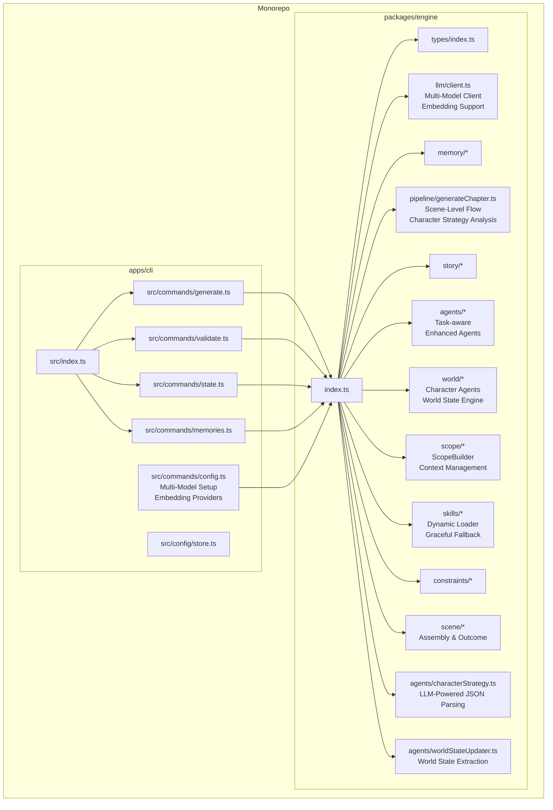

**Diagram sources**
- [packages/engine/src/index.ts:1-151](file://packages/engine/src/index.ts#L1-L151)
- [apps/cli/src/index.ts:121-150](file://apps/cli/src/index.ts#L121-L150)
- [apps/cli/src/commands/generate.ts:1-55](file://apps/cli/src/commands/generate.ts#L1-L55)
- [apps/cli/src/commands/validate.ts:1-107](file://apps/cli/src/commands/validate.ts#L1-L107)
- [apps/cli/src/commands/state.ts:1-83](file://apps/cli/src/commands/state.ts#L1-L83)
- [apps/cli/src/commands/memories.ts:1-66](file://apps/cli/src/commands/memories.ts#L1-L66)
- [apps/cli/src/config/store.ts:1-195](file://apps/cli/src/config/store.ts#L1-L195)
- [apps/cli/src/commands/config.ts:1-215](file://apps/cli/src/commands/config.ts#L1-L215)

**Section sources**
- [pnpm-workspace.yaml:1-4](file://pnpm-workspace.yaml#L1-L4)
- [turbo.json:1-19](file://turbo.json#L1-L19)

## Core Components
- Export surface: The engine's public API is exported via a single barrel file, exposing types, **enhanced LLM client with multi-model support and embedding capabilities**, agents, pipeline, story utilities, memory APIs, world simulation components, **scope management**, **character strategy analysis**, **skills loader system**, and constraint systems.
- Types: Define the canonical data models for StoryBible, StoryState, Chapter, ChapterSummary, GenerationContext, and **enhanced LLM configuration interfaces** including ModelConfig with expanded provider support and TaskType with embedding operations.
- **Multi-Model LLM Client**: Provides a provider-agnostic abstraction with **purpose-based routing**, **task-specific model mapping**, **embedding model discovery**, and **backward compatibility** with single-model configurations.
- **Story Director Agent**: High-level orchestrator that analyzes story state, generates chapter objectives, manages tension targets, and coordinates narrative direction.
- **Character Agents**: Autonomous characters with goals, agendas, knowledge, relationships, and emotional states that decide their own actions in each scene.
- **Enhanced Agents**: Specialized modules implementing writing, completeness checks, summarization, canon validation, memory extraction, and state updates with **task-aware model selection** including embedding operations.
- **Scene-Level Agents**: New dedicated agents for scene planning, writing, validation, and assembly with specialized prompts and workflows for granular narrative control.
- **Tension Controller**: Advanced system for managing narrative tension dynamics including target tension calculation, tension analysis, and guidance generation.
- **ScopeBuilder**: **New component that extracts narrative scope windows and relevant context for efficient scene generation**, integrated with World State Engine for optimal performance.
- **CharacterStrategyAnalyzer**: **New LLM-powered analyzer that performs character strategy analysis with JSON parsing**, generating character goals, motivations, and relationship mappings.
- **Skills Loader System**: **Dynamic loader that loads skills from @narrative-os/skills if available with graceful fallback**, providing skill information and validation.
- **WorldStateUpdater Agent**: **New agent that extracts world state changes from content and updates the WorldStateEngine**, handling character movements, deaths, object movements, and relationship changes.
- **Enhanced World State Engine**: **Updated with character strategy persistence, conflict detection, and comprehensive world state management**.
- World Simulation Layer: Character agents with goals, knowledge, and autonomy, event resolvers for conflict and interaction resolution, and world state management.
- Constraint Graph: Narrative consistency system enforcing logical rules for canon, location, knowledge, timeline, and logical constraints.
- Vector Memory System: HNSW-based semantic search with automatic embedding generation, supporting contextual queries and category filtering, powered by dedicated embedding models.
- Memory Retriever: Contextual memory retrieval with ranking and categorization for LLM prompts.
- State Updater Pipeline: Autonomous post-chapter state management with structured state tracking and constraint graph updates.
- Structured State Management: Comprehensive character and plot thread state tracking with tension calculation and recent event management.
- Canonical memory: A structured store for facts categorized by character/world/plot/timeline, with helpers to extract and format facts for prompts.
- Pipeline: Orchestrates the chapter generation loop, integrating agents and optional validation.
- Story utilities: Builders for StoryBible and mutation helpers for characters and plot threads.
- CLI integration: Loads persisted stories, constructs GenerationContext, invokes the pipeline, updates state, and persists results with **interactive multi-model configuration including embedding providers**.

**Section sources**
- [packages/engine/src/index.ts:1-151](file://packages/engine/src/index.ts#L1-L151)
- [packages/engine/src/types/index.ts:1-152](file://packages/engine/src/types/index.ts#L1-L152)
- [packages/engine/src/llm/client.ts:1-249](file://packages/engine/src/llm/client.ts#L1-L249)
- [packages/engine/src/memory/canonStore.ts:1-134](file://packages/engine/src/memory/canonStore.ts#L1-L134)
- [packages/engine/src/memory/vectorStore.ts:1-258](file://packages/engine/src/memory/vectorStore.ts#L1-L258)
- [packages/engine/src/memory/memoryRetriever.ts:1-174](file://packages/engine/src/memory/memoryRetriever.ts#L1-L174)
- [packages/engine/src/memory/stateUpdater.ts:1-435](file://packages/engine/src/memory/stateUpdater.ts#L1-L435)
- [packages/engine/src/story/structuredState.ts:1-235](file://packages/engine/src/story/structuredState.ts#L1-L235)
- [packages/engine/src/pipeline/generateChapter.ts:1-394](file://packages/engine/src/pipeline/generateChapter.ts#L1-L394)
- [packages/engine/src/story/bible.ts:1-73](file://packages/engine/src/story/bible.ts#L1-L73)
- [packages/engine/src/agents/writer.ts:1-166](file://packages/engine/src/agents/writer.ts#L1-L166)
- [packages/engine/src/agents/completeness.ts:1-56](file://packages/engine/src/agents/completeness.ts#L1-L56)
- [packages/engine/src/agents/summarizer.ts:1-65](file://packages/engine/src/agents/summarizer.ts#L1-L65)
- [packages/engine/src/agents/canonValidator.ts:1-60](file://packages/engine/src/agents/canonValidator.ts#L1-L60)
- [packages/engine/src/agents/memoryExtractor.ts:1-99](file://packages/engine/src/agents/memoryExtractor.ts#L1-L99)
- [packages/engine/src/agents/stateUpdater.ts:1-193](file://packages/engine/src/agents/stateUpdater.ts#L1-L193)
- [packages/engine/src/agents/chapterPlanner.ts:1-326](file://packages/engine/src/agents/chapterPlanner.ts#L1-L326)
- [packages/engine/src/agents/scenePlanner.ts:1-177](file://packages/engine/src/agents/scenePlanner.ts#L1-L177)
- [packages/engine/src/agents/sceneWriter.ts:1-145](file://packages/engine/src/agents/sceneWriter.ts#L1-L145)
- [packages/engine/src/agents/sceneValidator.ts:1-117](file://packages/engine/src/agents/sceneValidator.ts#L1-L117)
- [packages/engine/src/agents/sceneAssembler.ts:1-116](file://packages/engine/src/agents/sceneAssembler.ts#L1-L116)
- [packages/engine/src/agents/sceneOutcomeExtractor.ts:1-117](file://packages/engine/src/agents/sceneOutcomeExtractor.ts#L1-L117)
- [packages/engine/src/agents/tensionController.ts:1-252](file://packages/engine/src/agents/tensionController.ts#L1-L252)
- [packages/engine/src/agents/storyDirector.ts:1-276](file://packages/engine/src/agents/storyDirector.ts#L1-L276)
- [packages/engine/src/agents/characterStrategy.ts:1-218](file://packages/engine/src/agents/characterStrategy.ts#L1-L218)
- [packages/engine/src/agents/worldStateUpdater.ts:1-150](file://packages/engine/src/agents/worldStateUpdater.ts#L1-L150)
- [packages/engine/src/world/worldState.ts:1-321](file://packages/engine/src/world/worldState.ts#L1-L321)
- [packages/engine/src/world/characterAgent.ts:1-304](file://packages/engine/src/world/characterAgent.ts#L1-L304)
- [packages/engine/src/world/eventResolver.ts:1-272](file://packages/engine/src/world/eventResolver.ts#L1-L272)
- [packages/engine/src/world/worldStateEngine.ts:1-402](file://packages/engine/src/world/worldStateEngine.ts#L1-L402)
- [packages/engine/src/skills/loader.ts:1-108](file://packages/engine/src/skills/loader.ts#L1-L108)
- [packages/engine/src/scope/scopeBuilder.ts:1-480](file://packages/engine/src/scope/scopeBuilder.ts#L1-L480)
- [packages/engine/src/constraints/constraintGraph.ts:1-471](file://packages/engine/src/constraints/constraintGraph.ts#L1-L471)
- [packages/engine/src/constraints/validator.ts:1-286](file://packages/engine/src/constraints/validator.ts#L1-L286)
- [apps/cli/src/commands/generate.ts:1-81](file://apps/cli/src/commands/generate.ts#L1-L81)
- [apps/cli/src/commands/validate.ts:1-107](file://apps/cli/src/commands/validate.ts#L1-L107)
- [apps/cli/src/commands/state.ts:1-83](file://apps/cli/src/commands/state.ts#L1-L83)
- [apps/cli/src/commands/memories.ts:1-66](file://apps/cli/src/commands/memories.ts#L1-L66)
- [apps/cli/src/config/store.ts:1-195](file://apps/cli/src/config/store.ts#L1-L195)
- [apps/cli/src/commands/config.ts:1-318](file://apps/cli/src/commands/config.ts#L1-L318)

## Architecture Overview
The system employs:
- **Enhanced Factory pattern for LLM providers**: The LLM client factory selects and instantiates providers based on environment configuration, enabling pluggable backends with **multi-model support** and **embedding model capabilities**.
- **Purpose-based routing**: The LLM client routes tasks to appropriate models based on purpose (reasoning, chat, fast, embedding) for optimal performance.
- **Task-specific model mapping**: Different tasks use different models: generation/planning use reasoning models, validation/summarization use chat models, extraction uses chat models, embedding uses dedicated embedding models, and default uses chat models.
- **Enhanced Pipeline pattern for generation workflow**: The generateChapter function coordinates the new scene-level workflow: Story Director → Scene Planner → Character Agents → Scene Writer → Scene Validator → Scene Assembler → Chapter Validator → **Character Strategy Analysis**.
- **Enhanced Agent-based architecture**: Each agent encapsulates a distinct responsibility and interacts with the LLM client through a shared interface with **task-aware model selection** including embedding operations.
- **Story Director System**: High-level coordinator that analyzes story state, generates chapter objectives, manages tension targets, and orchestrates the overall narrative direction.
- **Character Agent System**: Autonomous characters that decide their own actions in each scene based on personality, goals, relationships, and current situation.
- **Enhanced Scene-level Generation**: Comprehensive scene-level workflow with dedicated agents for planning, writing, validating, and assembling individual scenes within chapters.
- **Advanced Tension Control System**: Dynamic narrative pacing control through tension calculation, target setting, and dynamic guidance generation.
- **ScopeBuilder System**: **New component that extracts narrative scope windows and relevant context for efficient scene generation**, integrated with World State Engine for optimal performance.
- **CharacterStrategyAnalyzer System**: **New LLM-powered analyzer that performs character strategy analysis with JSON parsing**, generating character goals, motivations, and relationship mappings for narrative coherence.
- **Skills Loader System**: **Dynamic loader that loads skills from @narrative-os/skills if available with graceful fallback**, providing skill information and validation for enhanced character development.
- **WorldStateUpdater Agent**: **New agent that extracts world state changes from content and updates the WorldStateEngine**, handling character movements, deaths, object movements, and relationship changes.
- **Enhanced World State Engine**: **Updated with character strategy persistence, conflict detection, and comprehensive world state management**.
- World Simulation Layer: Characters with goals, knowledge, and autonomy generate emergent plot through decision-making and event resolution.
- Constraint Graph: Narrative consistency system enforcing logical rules for canon, location, knowledge, timeline, and logical constraints.
- Vector Memory System: HNSW-based semantic search with automatic embedding generation for contextual memory retrieval, powered by dedicated embedding models.
- Memory Retriever: Contextual memory retrieval with ranking and categorization for LLM prompts.
- State Updater Pipeline: Autonomous post-chapter state management with structured state tracking and constraint graph updates.
- Structured State Management: Comprehensive character and plot thread state tracking with tension calculation and recent event management.
- Chapter Planner Agent: Converts high-level objectives into detailed scene-by-scene outlines with tension progression.
- Canonical memory management: A typed store maintains facts that inform writing and validation, with formatting helpers for LLM prompts.
- Modular design: Clear boundaries between story creation, state management, memory, agents, world simulation, **scope management**, **character strategy analysis**, **skills loader system**, constraint enforcement, and pipeline enable independent testing and extension.

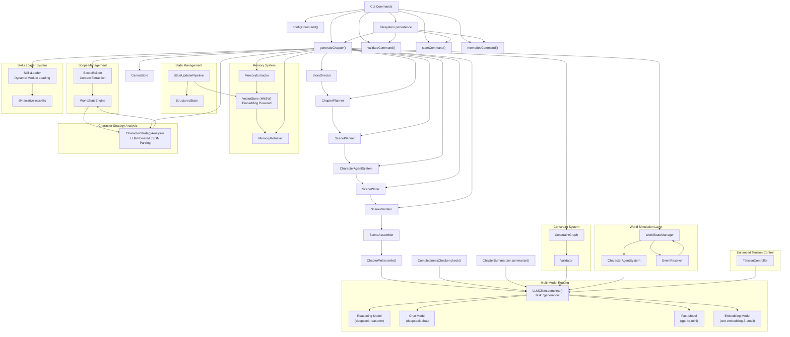

**Diagram sources**
- [packages/engine/src/pipeline/generateChapter.ts:67-309](file://packages/engine/src/pipeline/generateChapter.ts#L67-L309)
- [packages/engine/src/agents/writer.ts:103-107](file://packages/engine/src/agents/writer.ts#L103-L107)
- [packages/engine/src/agents/completeness.ts:40-43](file://packages/engine/src/agents/completeness.ts#L40-L43)
- [packages/engine/src/agents/summarizer.ts:27-31](file://packages/engine/src/agents/summarizer.ts#L27-L31)
- [packages/engine/src/agents/canonValidator.ts:44-48](file://packages/engine/src/agents/canonValidator.ts#L44-L48)
- [packages/engine/src/agents/chapterPlanner.ts:110-122](file://packages/engine/src/agents/chapterPlanner.ts#L110-L122)
- [packages/engine/src/agents/scenePlanner.ts:110-122](file://packages/engine/src/agents/scenePlanner.ts#L110-L122)
- [packages/engine/src/agents/sceneWriter.ts:110-122](file://packages/engine/src/agents/sceneWriter.ts#L110-L122)
- [packages/engine/src/agents/sceneValidator.ts:110-122](file://packages/engine/src/agents/sceneValidator.ts#L110-L122)
- [packages/engine/src/agents/sceneAssembler.ts:110-122](file://packages/engine/src/agents/sceneAssembler.ts#L110-L122)
- [packages/engine/src/llm/client.ts:40-48](file://packages/engine/src/llm/client.ts#L40-L48)
- [packages/engine/src/llm/client.ts:114-126](file://packages/engine/src/llm/client.ts#L114-L126)
- [packages/engine/src/memory/vectorStore.ts:19-258](file://packages/engine/src/memory/vectorStore.ts#L19-L258)
- [packages/engine/src/memory/memoryRetriever.ts:18-174](file://packages/engine/src/memory/memoryRetriever.ts#L18-L174)
- [packages/engine/src/memory/stateUpdater.ts:90-435](file://packages/engine/src/memory/stateUpdater.ts#L90-L435)
- [packages/engine/src/story/structuredState.ts:23-235](file://packages/engine/src/story/structuredState.ts#L23-L235)
- [packages/engine/src/world/worldState.ts:24-37](file://packages/engine/src/world/worldState.ts#L24-L37)
- [packages/engine/src/world/characterAgent.ts:91-108](file://packages/engine/src/world/characterAgent.ts#L91-L108)
- [packages/engine/src/world/eventResolver.ts:30-37](file://packages/engine/src/world/eventResolver.ts#L30-L37)
- [packages/engine/src/constraints/constraintGraph.ts:29-42](file://packages/engine/src/constraints/constraintGraph.ts#L29-L42)
- [packages/engine/src/constraints/validator.ts:73-84](file://packages/engine/src/constraints/validator.ts#L73-L84)
- [packages/engine/src/llm/client.ts:31-105](file://packages/engine/src/llm/client.ts#L31-L105)
- [packages/engine/src/memory/canonStore.ts:101-129](file://packages/engine/src/memory/canonStore.ts#L101-L129)
- [apps/cli/src/commands/generate.ts:4-81](file://apps/cli/src/commands/generate.ts#L4-L81)
- [apps/cli/src/commands/validate.ts:4-107](file://apps/cli/src/commands/validate.ts#L4-L107)
- [apps/cli/src/commands/state.ts:3-83](file://apps/cli/src/commands/state.ts#L3-L83)
- [apps/cli/src/commands/memories.ts:4-66](file://apps/cli/src/commands/memories.ts#L4-L66)
- [apps/cli/src/config/store.ts:15-49](file://apps/cli/src/config/store.ts#L15-L49)
- [apps/cli/src/commands/config.ts:192-318](file://apps/cli/src/commands/config.ts#L192-L318)

**Section sources**
- [packages/engine/README.md:36-50](file://packages/engine/README.md#L36-L50)

## Detailed Component Analysis

### Enhanced LLM Integration Layer
- **Multi-Model Client Architecture**: The LLM client now supports multiple models with purpose-based routing, task-specific model mapping, embedding model discovery, and backward compatibility.
- **Provider abstraction**: The LLMProvider interface defines a single method for completions, allowing interchangeable providers including OpenAI, DeepSeek, Alibaba Cloud, and ByteDance Ark.
- **Provider factory**: The LLM client loads configuration from environment variables and creates the appropriate provider (OpenAI, DeepSeek, Alibaba Cloud, or ByteDance Ark).
- **Purpose-based routing**: Models are categorized as 'reasoning', 'chat', 'fast', or 'embedding' and automatically selected based on task type.
- **Task-specific model mapping**: Different tasks use different models: generation/planning use reasoning models, validation/summarization use chat models, extraction uses chat models, embedding uses dedicated embedding models, and default uses chat models.
- **Embedding Model Discovery**: The LLM client can discover and route to embedding models specifically configured for vector memory operations.
- **Backward compatibility**: Single-model configuration is still supported for legacy users.
- **Singleton accessor**: A global LLM client is lazily initialized and reused across agents.
- **JSON completion helper**: A convenience method ensures strict JSON responses for validators and parsers.

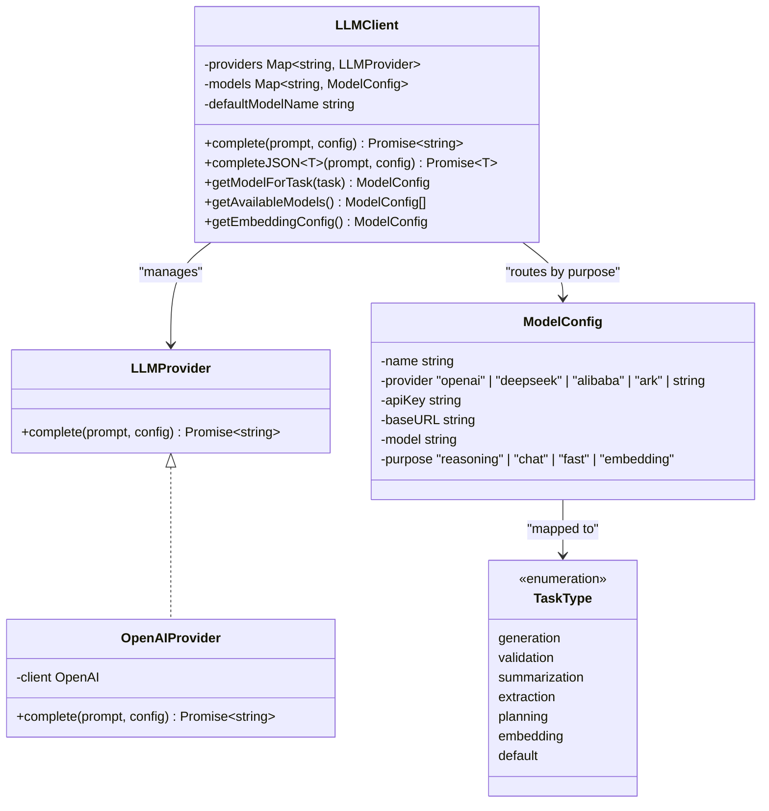

**Diagram sources**
- [packages/engine/src/llm/client.ts:4-37](file://packages/engine/src/llm/client.ts#L4-L37)
- [packages/engine/src/llm/client.ts:49-201](file://packages/engine/src/llm/client.ts#L49-L201)
- [packages/engine/src/types/index.ts:107-116](file://packages/engine/src/types/index.ts#L107-L116)

**Section sources**
- [packages/engine/src/llm/client.ts:1-249](file://packages/engine/src/llm/client.ts#L1-L249)
- [packages/engine/src/types/index.ts:107-116](file://packages/engine/src/types/index.ts#L107-L116)

### Enhanced Story Director System
- **High-Level Coordination**: The Story Director analyzes current story state, tension levels, and narrative context to generate comprehensive chapter objectives.
- **Objective Generation**: Creates detailed chapter objectives with priorities (critical, high, medium, low) and types (plot, character, world, tension, resolution).
- **Tension Guidance**: Integrates with the Tension Controller to provide dynamic tension targets and pacing recommendations.
- **Focus Character Selection**: Identifies key characters to center the chapter around based on story progression and character arcs.
- **Scene Suggestions**: Provides actionable scene ideas that align with chapter objectives and narrative goals.
- **Fallback Generation**: Offers fallback objective generation without LLM for testing and reliability.
- **Prompt Formatting**: Formats output for seamless integration with subsequent pipeline stages.

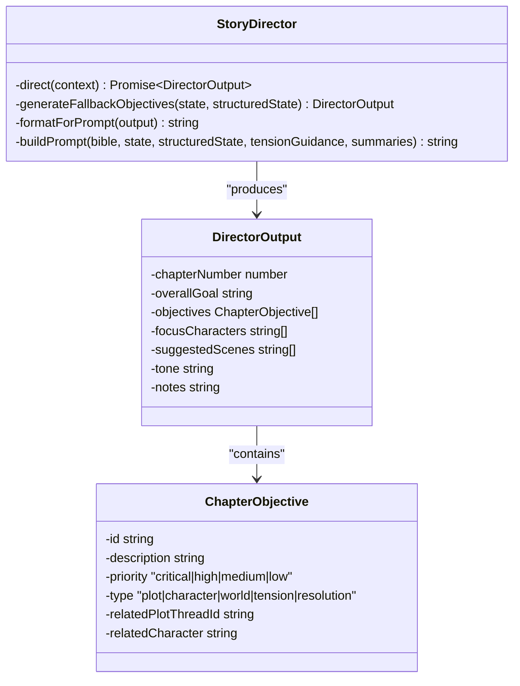

**Diagram sources**
- [packages/engine/src/agents/storyDirector.ts:100-276](file://packages/engine/src/agents/storyDirector.ts#L100-L276)

**Section sources**
- [packages/engine/src/agents/storyDirector.ts:1-276](file://packages/engine/src/agents/storyDirector.ts#L1-L276)

### Integrated Character Agent System
- **Autonomous Decision-Making**: Characters make contextually appropriate decisions based on personality, goals, relationships, and current situation using LLM-powered reasoning.
- **Agenda Management**: Dynamic agenda system with priorities, deadlines, and completion tracking for goal-oriented character behavior.
- **Knowledge and Relationships**: Characters maintain evolving knowledge bases and relationship maps that influence decision-making and interactions.
- **Multi-Character Interaction**: Simulates turn-based decision-making among multiple characters with conflict resolution and social dynamics.
- **Simple Decision Fallback**: Robust fallback mechanism for character decisions when LLM services are unavailable.
- **Character State Integration**: Seamlessly integrates with structured state management for consistent character tracking.
- **Scene-Level Decision Support**: Provides character actions and decisions for each scene in the scene-level generation workflow.

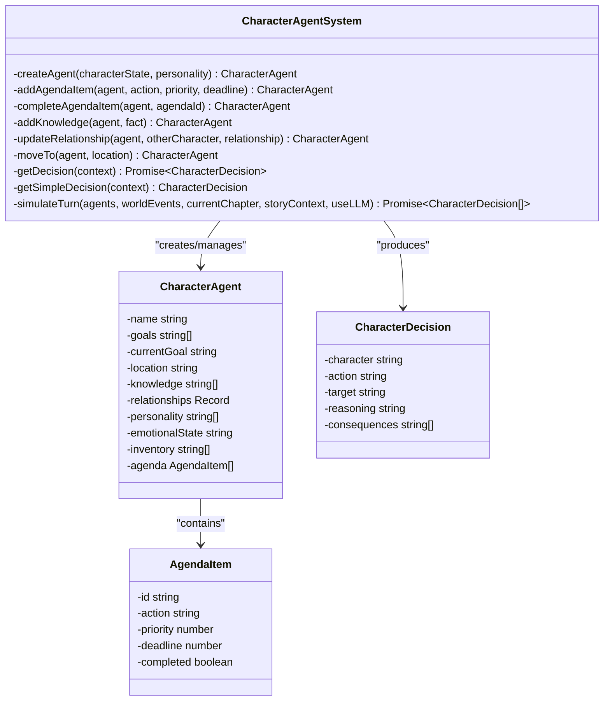

**Diagram sources**
- [packages/engine/src/world/characterAgent.ts:91-304](file://packages/engine/src/world/characterAgent.ts#L91-L304)

**Section sources**
- [packages/engine/src/world/characterAgent.ts:1-304](file://packages/engine/src/world/characterAgent.ts#L1-L304)

### Enhanced Scene-Level Generation System
- **Scene Planning**: Detailed scene breakdown with location, characters, purpose, tension levels, and conflict identification for granular narrative control.
- **Scene Writing**: Specialized prompts and templates for scene-specific content generation with proper formatting and structure.
- **Scene Validation**: Quality assurance for individual scenes including narrative logic, character consistency, and tension maintenance.
- **Scene Assembly**: Integration of validated scenes into cohesive chapter structure with proper transitions and flow.
- **Scene Outcome Extraction**: Detailed extraction of scene consequences including character changes, location shifts, and new information.
- **Dynamic Tension Control**: Scene-level tension management with target setting and progression tracking.
- **Character Integration**: Scene planning and writing incorporate character decisions and actions for authentic narrative flow.
- **Conflict Resolution**: Mechanisms for handling scene conflicts and their resolution within the narrative framework.

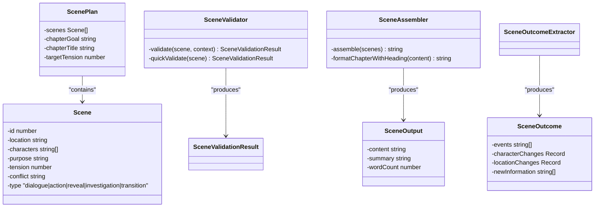

**Diagram sources**
- [packages/engine/src/types/index.ts:117-152](file://packages/engine/src/types/index.ts#L117-L152)
- [packages/engine/src/agents/scenePlanner.ts:110-122](file://packages/engine/src/agents/scenePlanner.ts#L110-L122)
- [packages/engine/src/agents/sceneWriter.ts:110-122](file://packages/engine/src/agents/sceneWriter.ts#L110-L122)
- [packages/engine/src/agents/sceneValidator.ts:110-122](file://packages/engine/src/agents/sceneValidator.ts#L110-L122)
- [packages/engine/src/agents/sceneAssembler.ts:110-122](file://packages/engine/src/agents/sceneAssembler.ts#L110-L122)
- [packages/engine/src/agents/sceneOutcomeExtractor.ts:110-122](file://packages/engine/src/agents/sceneOutcomeExtractor.ts#L110-L122)

**Section sources**
- [packages/engine/src/types/index.ts:117-152](file://packages/engine/src/types/index.ts#L117-L152)
- [packages/engine/src/agents/scenePlanner.ts:1-177](file://packages/engine/src/agents/scenePlanner.ts#L1-L177)
- [packages/engine/src/agents/sceneWriter.ts:1-145](file://packages/engine/src/agents/sceneWriter.ts#L1-L145)
- [packages/engine/src/agents/sceneValidator.ts:1-117](file://packages/engine/src/agents/sceneValidator.ts#L1-L117)
- [packages/engine/src/agents/sceneAssembler.ts:1-116](file://packages/engine/src/agents/sceneAssembler.ts#L1-L116)
- [packages/engine/src/agents/sceneOutcomeExtractor.ts:1-117](file://packages/engine/src/agents/sceneOutcomeExtractor.ts#L1-L117)

### Advanced Tension Control System
- **Target Tension Calculation**: Mathematical formulas for determining optimal tension levels based on chapter position, narrative arcs, and character development.
- **Tension Analysis**: Detailed analysis of existing tension levels with scoring mechanisms and trend identification.
- **Dynamic Guidance**: Real-time tension guidance generation for writers and planners to maintain narrative engagement.
- **Tension Progression**: Sophisticated algorithms for tension escalation, climax, and resolution throughout the story arc.
- **Integration Points**: Seamless integration with scene planning, writing, and validation processes for consistent tension management.
- **Narrative Pacing**: Controls story pacing through scene type recommendations and writing guidance.

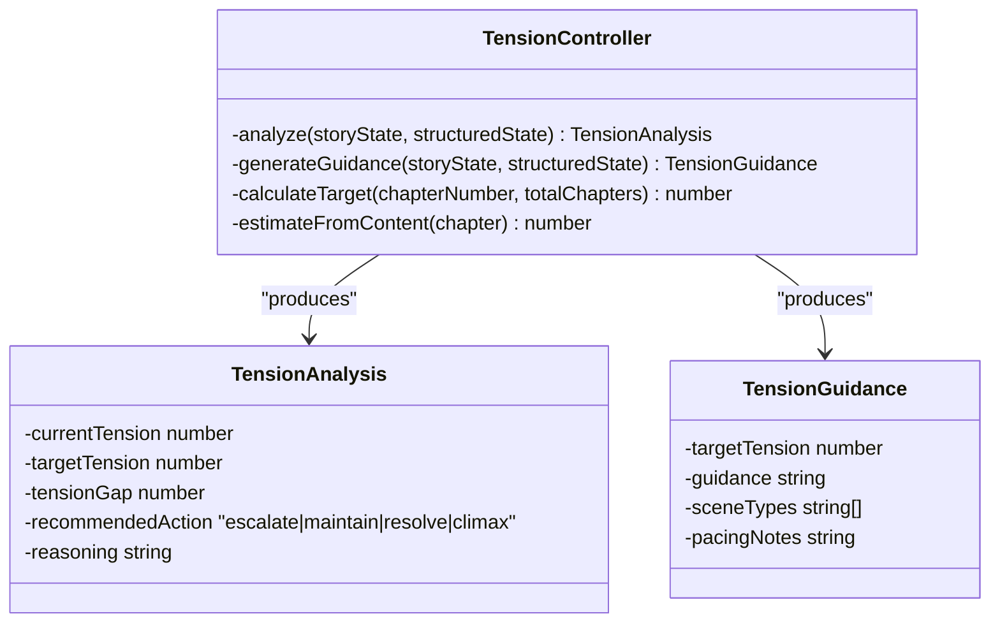

**Diagram sources**
- [packages/engine/src/agents/tensionController.ts:214-252](file://packages/engine/src/agents/tensionController.ts#L214-L252)

**Section sources**
- [packages/engine/src/agents/tensionController.ts:1-252](file://packages/engine/src/agents/tensionController.ts#L1-L252)

### Enhanced Chapter Generation Pipeline
- **Scene-Level Workflow**: The generateChapter function now orchestrates the new scene-level workflow: Story Director → Scene Planner → Character Agents → Scene Writer → Scene Validator → Scene Assembler → Chapter Validator → **Character Strategy Analysis**.
- **Story Director Integration**: Consults the Story Director for chapter objectives and tension guidance before proceeding with scene planning.
- **Character Agent Coordination**: Character Agents decide actions for each scene, providing authentic character-driven narrative flow.
- **Scene Validation**: Individual scene validation ensures quality and consistency before assembly.
- **Outcome Extraction**: Extracts scene outcomes to update world state and character development.
- **Memory Integration**: Scene-level memory extraction and vector store integration for contextual retrieval.
- **Legacy Compatibility**: Maintains backward compatibility with traditional chapter-level generation when scene-level is disabled.
- **ScopeBuilder Integration**: **Phase 18: Creates and uses ScopeBuilder to extract narrative scope windows for efficient scene generation**.
- **Character Strategy Analysis**: **Analyzes character strategies for all main characters, detects conflicts, and persists strategy data to WorldStateEngine**.

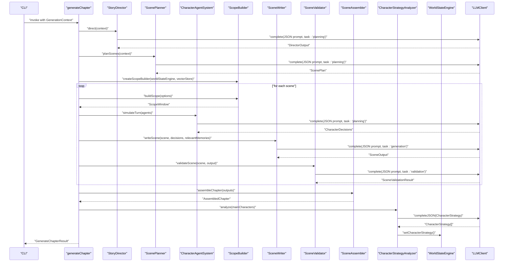

**Diagram sources**
- [packages/engine/src/pipeline/generateChapter.ts:67-309](file://packages/engine/src/pipeline/generateChapter.ts#L67-L309)

**Section sources**
- [packages/engine/src/pipeline/generateChapter.ts:1-394](file://packages/engine/src/pipeline/generateChapter.ts#L1-L394)

### Enhanced Agents
- **ChapterWriter**: Constructs a rich prompt from StoryBible, StoryState, and CanonStore, delegates to LLM with **task: 'generation'**, and extracts title and word count. Includes a continuation mode to extend partial chapters.
- **CompletenessChecker**: Evaluates whether a chapter ends naturally using a concise prompt and strict token limits.
- **ChapterSummarizer**: Produces a concise summary and identifies key events heuristically using **task: 'summarization'**.
- **CanonValidator**: Validates chapter content against the CanonStore using **task: 'validation'**, returning structured JSON with violations.
- **MemoryExtractor**: Extracts narrative memories from chapters with proper categorization for vector storage using **task: 'extraction'**.
- **StateUpdater**: Extracts and applies state changes to structured state management system.
- **ChapterPlanner**: Converts objectives into detailed scene outlines with tension progression and word count estimation.
- **ScenePlanner**: Creates detailed scene-level plans with specific tension targets and character requirements.
- **SceneWriter**: Generates individual scenes with proper formatting and narrative flow, incorporating character decisions.
- **SceneValidator**: Validates scene content for consistency and quality.
- **SceneAssembler**: Combines validated scenes into cohesive chapter structure with proper transitions.
- **SceneOutcomeExtractor**: Extracts state changes from scenes for world simulation updates.
- **TensionController**: Manages dynamic tension levels throughout the narrative.
- **StoryDirector**: Coordinates high-level narrative direction and objectives.
- **CharacterStrategyAnalyzer**: **Performs LLM-powered character strategy analysis with JSON parsing**, generating character goals, motivations, and relationship mappings.
- **WorldStateUpdater**: **Extracts world state changes from content and updates the WorldStateEngine**.
- **Task-aware Model Selection**: Each agent specifies the appropriate task type for optimal model routing, including embedding operations.

```mermaid
classDiagram
class ChapterWriter {
-promptTemplate string
+write(context, canon, memoryRetriever) WriterOutput
+continue(existing, context) string
-inferChapterGoal(...)
-extractTitle(...)
}
class CompletenessChecker {
-promptTemplate string
+check(text) CompletenessResult
}
class ChapterSummarizer {
-promptTemplate string
+summarize(text, chapterNumber) ChapterSummary
-extractKeyEvents(...)
}
class CanonValidator {
+validate(text, canon) CanonValidationResult
}
class MemoryExtractor {
-extractionPrompt string
+extract(chapter, bible) ExtractedMemory[]
+extractFromSummary(number, summary, bible) ExtractedMemory[]
}
class StateUpdater {
-updatePrompt string
+extractStateChanges(chapter, bible, state) StateUpdateOutput
+applyUpdates(state, updates, chapter) StoryStructuredState
}
class ChapterPlanner {
-plan(context) ChapterOutline
-generateFallbackOutline(directorOutput, targetWordCount) ChapterOutline
-validateOutline(outline, objectives) ValidationResult
-formatForPrompt(outline) string
}
class ScenePlanner {
-plan(context) ScenePlan
-generateFallbackPlan(directorOutput, targetWordCount) ScenePlan
-validatePlan(plan, objectives) ValidationResult
}
class SceneWriter {
-write(scene, context) SceneOutput
-formatScenePrompt(scene, context) string
}
class SceneValidator {
-validate(scene, context) SceneValidationResult
-quickValidate(scene) SceneValidationResult
}
class SceneAssembler {
-assemble(scenes) string
-formatChapterWithHeading(content) string
}
class SceneOutcomeExtractor {
-extractSceneOutcome(scene, sceneOutput, bible) SceneOutcome
-mergeSceneOutcomes(outcomes) SceneOutcome
}
class TensionController {
-analyze(storyState, structuredState) TensionAnalysis
-generateGuidance(storyState, structuredState) TensionGuidance
-calculateTarget(chapterNumber, totalChapters) number
-estimateFromContent(chapter) number
}
class StoryDirector {
-direct(context) Promise~DirectorOutput~
-generateFallbackObjectives(state, structuredState) DirectorOutput
-formatForPrompt(output) string
}
class CharacterStrategyAnalyzer {
-analyze(input) Promise~CharacterStrategy~
-detectConflicts(strategies) Conflict[]
-private buildPrompt(params) string
}
class WorldStateUpdater {
-extract(content, bible, currentState, chapterNumber, sceneNumber) Promise~WorldStateUpdate~
-applyUpdates(engine, updates) void
}
class LLMClient {
+complete(...)
+completeJSON~T~(...)
+getModelForTask(task) ModelConfig
+getEmbeddingConfig() ModelConfig
}
ChapterWriter --> LLMClient : "uses task : 'generation'"
CompletenessChecker --> LLMClient : "uses default"
ChapterSummarizer --> LLMClient : "uses task : 'summarization'"
CanonValidator --> LLMClient : "uses task : 'validation'"
MemoryExtractor --> LLMClient : "uses task : 'extraction'"
StateUpdater --> LLMClient : "uses default"
ChapterPlanner --> LLMClient : "uses task : 'planning'"
ScenePlanner --> LLMClient : "uses task : 'planning'"
SceneWriter --> LLMClient : "uses task : 'generation'"
SceneValidator --> LLMClient : "uses task : 'validation'"
SceneAssembler --> LLMClient : "uses default"
SceneOutcomeExtractor --> LLMClient : "uses task : 'extraction'"
TensionController --> LLMClient : "uses task : 'planning'"
StoryDirector --> LLMClient : "uses task : 'planning'"
CharacterStrategyAnalyzer --> LLMClient : "uses task : 'planning'"
WorldStateUpdater --> LLMClient : "uses task : 'extraction'"
```

**Diagram sources**
- [packages/engine/src/agents/writer.ts:103-107](file://packages/engine/src/agents/writer.ts#L103-L107)
- [packages/engine/src/agents/summarizer.ts:27-31](file://packages/engine/src/agents/summarizer.ts#L27-L31)
- [packages/engine/src/agents/canonValidator.ts:44-48](file://packages/engine/src/agents/canonValidator.ts#L44-L48)
- [packages/engine/src/agents/memoryExtractor.ts:62-66](file://packages/engine/src/agents/memoryExtractor.ts#L62-L66)
- [packages/engine/src/agents/stateUpdater.ts:113-116](file://packages/engine/src/agents/stateUpdater.ts#L113-L116)
- [packages/engine/src/llm/client.ts:114-126](file://packages/engine/src/llm/client.ts#L114-L126)

**Section sources**
- [packages/engine/src/agents/writer.ts:1-166](file://packages/engine/src/agents/writer.ts#L1-L166)
- [packages/engine/src/agents/completeness.ts:1-56](file://packages/engine/src/agents/completeness.ts#L1-L56)
- [packages/engine/src/agents/summarizer.ts:1-65](file://packages/engine/src/agents/summarizer.ts#L1-L65)
- [packages/engine/src/agents/canonValidator.ts:1-60](file://packages/engine/src/agents/canonValidator.ts#L1-L60)
- [packages/engine/src/agents/memoryExtractor.ts:1-99](file://packages/engine/src/agents/memoryExtractor.ts#L1-L99)
- [packages/engine/src/agents/stateUpdater.ts:1-193](file://packages/engine/src/agents/stateUpdater.ts#L1-L193)
- [packages/engine/src/agents/chapterPlanner.ts:1-326](file://packages/engine/src/agents/chapterPlanner.ts#L1-L326)
- [packages/engine/src/agents/scenePlanner.ts:1-177](file://packages/engine/src/agents/scenePlanner.ts#L1-L177)
- [packages/engine/src/agents/sceneWriter.ts:1-145](file://packages/engine/src/agents/sceneWriter.ts#L1-L145)
- [packages/engine/src/agents/sceneValidator.ts:1-117](file://packages/engine/src/agents/sceneValidator.ts#L1-L117)
- [packages/engine/src/agents/sceneAssembler.ts:1-116](file://packages/engine/src/agents/sceneAssembler.ts#L1-L116)
- [packages/engine/src/agents/sceneOutcomeExtractor.ts:1-117](file://packages/engine/src/agents/sceneOutcomeExtractor.ts#L1-L117)
- [packages/engine/src/agents/tensionController.ts:1-252](file://packages/engine/src/agents/tensionController.ts#L1-L252)
- [packages/engine/src/agents/storyDirector.ts:1-276](file://packages/engine/src/agents/storyDirector.ts#L1-L276)
- [packages/engine/src/agents/characterStrategy.ts:1-218](file://packages/engine/src/agents/characterStrategy.ts#L1-L218)
- [packages/engine/src/agents/worldStateUpdater.ts:1-150](file://packages/engine/src/agents/worldStateUpdater.ts#L1-L150)

### Character Strategy Analysis System
- **LLM-Powered JSON Parsing**: **New CharacterStrategyAnalyzer performs character strategy analysis using LLM-powered JSON parsing**, generating structured character strategy data with precise JSON formatting.
- **Character Strategy Generation**: Analyzes character current goals, long-term objectives, motivations, obstacles, relationships, emotional arcs, and next chapter targets.
- **Previous Strategy Integration**: Incorporates previous character strategy data to track character development and narrative continuity.
- **New Character Detection**: Identifies newly appearing characters and provides initial strategy establishment guidance.
- **Conflict Detection**: **Detects conflicts between character strategies including goal collisions and hostile relationships**.
- **Relationship Mapping**: Maps character relationships as ally, enemy, neutral, or suspicious for narrative coherence.
- **Integration with WorldStateEngine**: **Persists character strategies to WorldStateEngine for cross-chapter continuity and analysis**.
- **Prompt Engineering**: **Sophisticated prompt engineering with story context, character background, and chapter information**.

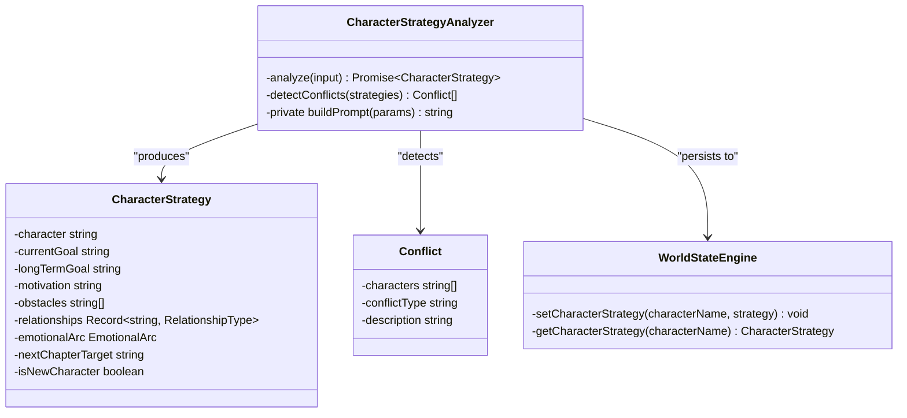

**Diagram sources**
- [packages/engine/src/agents/characterStrategy.ts:71-218](file://packages/engine/src/agents/characterStrategy.ts#L71-L218)
- [packages/engine/src/world/worldStateEngine.ts:309-338](file://packages/engine/src/world/worldStateEngine.ts#L309-L338)

**Section sources**
- [packages/engine/src/agents/characterStrategy.ts:1-218](file://packages/engine/src/agents/characterStrategy.ts#L1-L218)
- [packages/engine/src/world/worldStateEngine.ts:52-338](file://packages/engine/src/world/worldStateEngine.ts#L52-L338)

### Skills Loader System
- **Dynamic Module Loading**: **New skills loader system dynamically loads skills from @narrative-os/skills package if available**, providing graceful fallback when skills package is not installed.
- **Skill Information Retrieval**: Retrieves skill information including name, display names, descriptions, instructions, and priority levels.
- **Default Skills Management**: **Provides default skills for specific genres with genre-specific skill sets**.
- **Skill Validation**: Validates skill names against available skills registry, returning only valid skills.
- **Skill Instructions Formatting**: **Formats skill instructions for prompt inclusion with priority-based ordering**.
- **Graceful Degradation**: **Returns empty arrays or null values when skills package is not available**, ensuring engine functionality without external dependencies**.

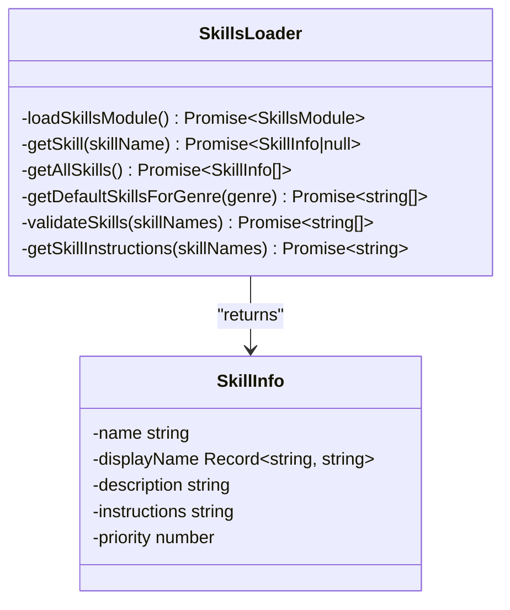

**Diagram sources**
- [packages/engine/src/skills/loader.ts:22-108](file://packages/engine/src/skills/loader.ts#L22-L108)

**Section sources**
- [packages/engine/src/skills/loader.ts:1-108](file://packages/engine/src/skills/loader.ts#L1-L108)

### Enhanced World State Engine
- **Character Strategy Persistence**: **New setCharacterStrategy and getCharacterStrategy methods persist character strategies with automatic chapter timestamping**.
- **Strategy Retrieval**: **getAllCharacterStrategies and formatCharacterStrategiesForPrompt provide comprehensive strategy access and formatting**.
- **Conflict Detection**: **Integrates with CharacterStrategyAnalyzer for conflict detection between character strategies**.
- **Enhanced Prompt Formatting**: **formatForPrompt includes character strategies for narrative coherence**.
- **World State Management**: **Comprehensive world state management including characters, locations, objects, relationships, and timeline**.

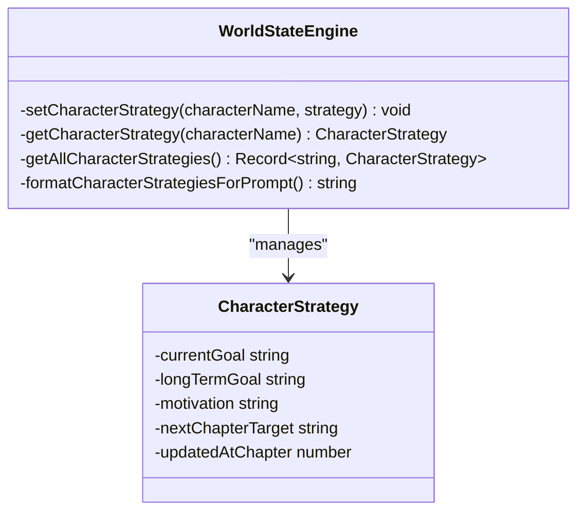

**Diagram sources**
- [packages/engine/src/world/worldStateEngine.ts:309-338](file://packages/engine/src/world/worldStateEngine.ts#L309-L338)

**Section sources**
- [packages/engine/src/world/worldStateEngine.ts:1-402](file://packages/engine/src/world/worldStateEngine.ts#L1-L402)

### Enhanced WorldStateUpdater Agent
- **World State Extraction**: **New agent extracts world state changes from scene/chapter content using LLM-powered JSON parsing**.
- **Change Tracking**: Handles character movements, deaths, object movements, discoveries, relationship changes, emotional changes, and new events.
- **JSON Parsing**: **Robust JSON parsing with error handling for world state update extraction**.
- **Update Application**: **Applies world state updates to WorldStateEngine with error handling and validation**.
- **Prompt Engineering**: **Sophisticated prompt engineering with current world state and content context**.

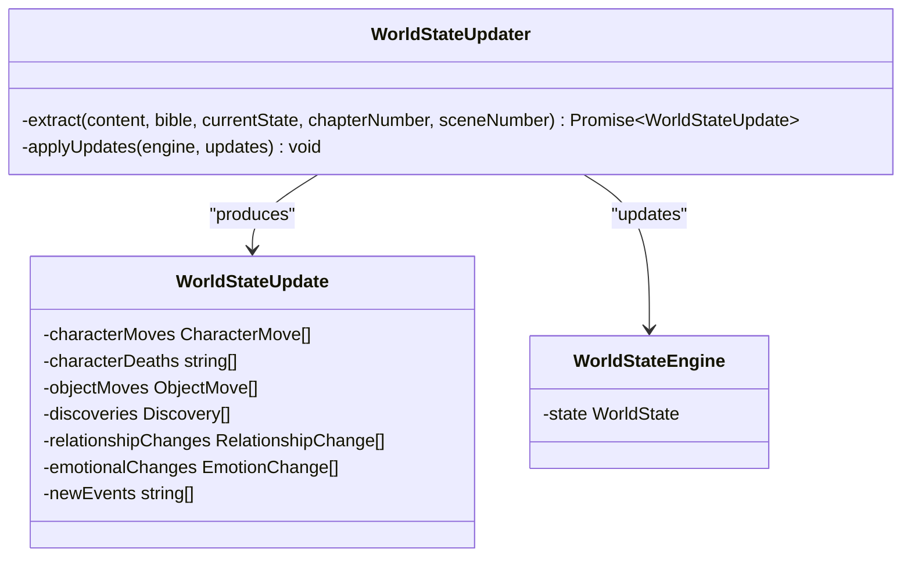

**Diagram sources**
- [packages/engine/src/agents/worldStateUpdater.ts:12-150](file://packages/engine/src/agents/worldStateUpdater.ts#L12-L150)

**Section sources**
- [packages/engine/src/agents/worldStateUpdater.ts:1-150](file://packages/engine/src/agents/worldStateUpdater.ts#L1-L150)

### Enhanced ScopeBuilder System
- **Narrative Scope Windows**: **New component that extracts relevant context for efficient scene generation by building scope windows around center characters and locations**.
- **Graph Subgraph Extraction**: Builds subgraphs within N hops of center characters, including connections to locations, objects, and other characters.
- **Context Filtering**: Filters memories and constraints based on scope entities for optimal LLM prompt construction.
- **Entity Collection**: Collects characters, locations, and objects within the extracted scope for narrative context.
- **Memory Integration**: Uses VectorStore for semantic memory filtering based on scope entities.
- **Constraint Integration**: **Optionally filters constraints based on scope entities for narrative consistency checking**.
- **Prompt Formatting**: Formats scope windows into human-readable prompts for LLM integration.
- **World State Engine Integration**: **Seamlessly integrates with WorldStateEngine for efficient state-based context extraction**.
- **External Consumption**: **Exposed through engine exports for external consumption and integration with custom workflows**.

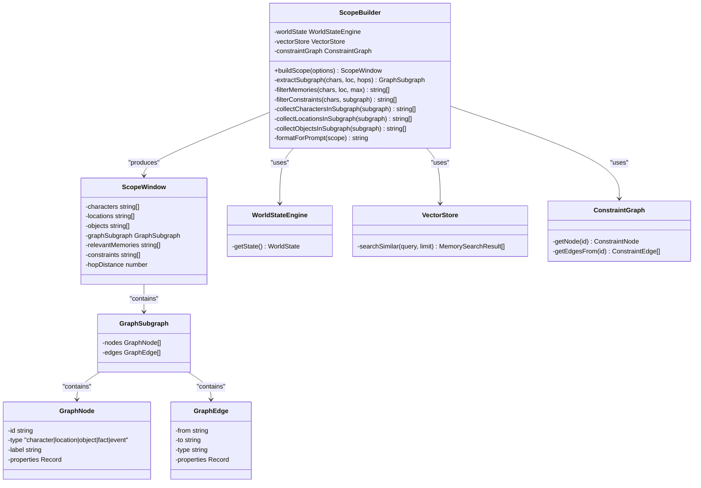

**Diagram sources**
- [packages/engine/src/scope/scopeBuilder.ts:49-480](file://packages/engine/src/scope/scopeBuilder.ts#L49-L480)
- [packages/engine/src/world/worldStateEngine.ts:64-352](file://packages/engine/src/world/worldStateEngine.ts#L64-L352)

**Section sources**
- [packages/engine/src/scope/scopeBuilder.ts:1-480](file://packages/engine/src/scope/scopeBuilder.ts#L1-L480)
- [packages/engine/src/world/worldStateEngine.ts:1-352](file://packages/engine/src/world/worldStateEngine.ts#L1-L352)

### Enhanced CLI Integration
- **Command routing**: The CLI initializes commands for config, init, generate, status, continue, validate, state inspection, and memory querying.
- **Interactive Multi-Model Configuration**: The config command provides an interactive setup for multi-model configurations with reasoning and chat models, and **embedding model configuration** including providers like Alibaba Cloud, ByteDance Ark, and OpenAI.
- **Scene-Level Generation**: The generate command now supports scene-level generation with configurable scene counts and character integration.
- **Enhanced Output**: Provides detailed progress information including scene counts, word counts, and character actions.
- **Memory Integration**: Scene-level memory extraction and vector store integration for contextual retrieval.
- **Error handling**: Catches generation failures and exits with a non-zero code.
- **Environment Configuration**: Applies multi-model configuration by setting LLM_MODELS_CONFIG environment variable with **embedding model support**.
- **ScopeBuilder Integration**: **Phase 18: Utilizes ScopeBuilder for efficient scene context extraction during generation**.
- **Character Strategy Analysis**: **Integrates CharacterStrategyAnalyzer for character-driven narrative analysis**.

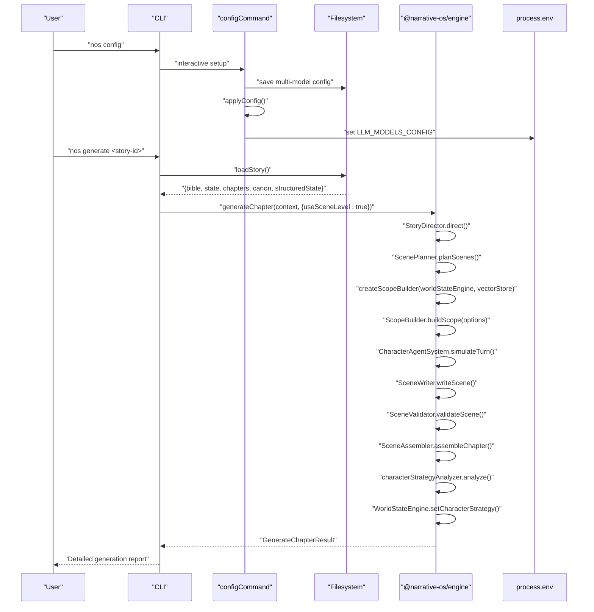

**Diagram sources**
- [apps/cli/src/index.ts:121-150](file://apps/cli/src/index.ts#L121-L150)
- [apps/cli/src/commands/validate.ts:4-107](file://apps/cli/src/commands/validate.ts#L4-L107)
- [apps/cli/src/config/store.ts:15-49](file://apps/cli/src/config/store.ts#L15-L49)
- [packages/engine/src/pipeline/generateChapter.ts:67-309](file://packages/engine/src/pipeline/generateChapter.ts#L67-L309)
- [packages/engine/src/constraints/validator.ts:73-84](file://packages/engine/src/constraints/validator.ts#L73-L84)
- [apps/cli/src/commands/config.ts:192-318](file://apps/cli/src/commands/config.ts#L192-L318)

**Section sources**
- [apps/cli/src/index.ts:1-54](file://apps/cli/src/index.ts#L1-L54)
- [apps/cli/src/commands/generate.ts:1-81](file://apps/cli/src/commands/generate.ts#L1-L81)
- [apps/cli/src/commands/validate.ts:1-107](file://apps/cli/src/commands/validate.ts#L1-L107)
- [apps/cli/src/commands/state.ts:1-83](file://apps/cli/src/commands/state.ts#L1-L83)
- [apps/cli/src/commands/memories.ts:1-66](file://apps/cli/src/commands/memories.ts#L1-L66)
- [apps/cli/src/config/store.ts:1-195](file://apps/cli/src/config/store.ts#L1-L195)
- [apps/cli/src/commands/config.ts:1-318](file://apps/cli/src/commands/config.ts#L1-L318)

## Dependency Analysis
- Cohesion: Each module focuses on a single responsibility—agents encapsulate prompting and inference with task-aware model selection, the pipeline orchestrates workflows, memory manages canonical facts and vector memories, world simulation handles character autonomy, constraints operate independently but integrate with validation systems, **scope management extracts efficient narrative context**, **character strategy analysis provides narrative coherence**, **skills loader system provides extensible character development**, and state management tracks story progression.
- Coupling: Agents depend on the LLM client abstraction with task-aware model selection; the pipeline depends on agents and memory; world simulation components interact through well-defined interfaces; constraints operate independently but integrate with validation systems; vector memory system integrates with state management and constraint graph; **ScopeBuilder integrates with WorldStateEngine, VectorStore, and ConstraintGraph**; **CharacterStrategyAnalyzer integrates with WorldStateEngine and LLM client**; **SkillsLoader provides optional external dependency injection**.
- Extensibility: New providers can be added to the LLM client factory; new agents can be integrated into the pipeline with appropriate task specification; additional categories can be added to the CanonStore; world simulation can accommodate new character types and event types; vector memory system supports new embedding models and search algorithms; **ScopeBuilder can be extended with new scope extraction strategies**; **CharacterStrategyAnalyzer can be extended with new analysis capabilities**; **SkillsLoader can accommodate new skill registries**.
- **Multi-Model Extensibility**: The system supports additional models with different purposes through the ModelConfig interface and TASK_MODEL_MAPPING, including **embedding model support**.
- **Enhanced Scene-Level Extensibility**: New scene types and validation criteria can be easily integrated into the scene generation workflow.
- **ScopeBuilder Extensibility**: **New scope extraction strategies and context filtering mechanisms can be easily integrated into the ScopeBuilder system**.
- **Character Strategy Extensibility**: **New character analysis capabilities and strategy persistence mechanisms can be integrated into the CharacterStrategyAnalyzer and WorldStateEngine**.
- **Skills Loader Extensibility**: **New skill registries and validation rules can be integrated into the SkillsLoader system**.

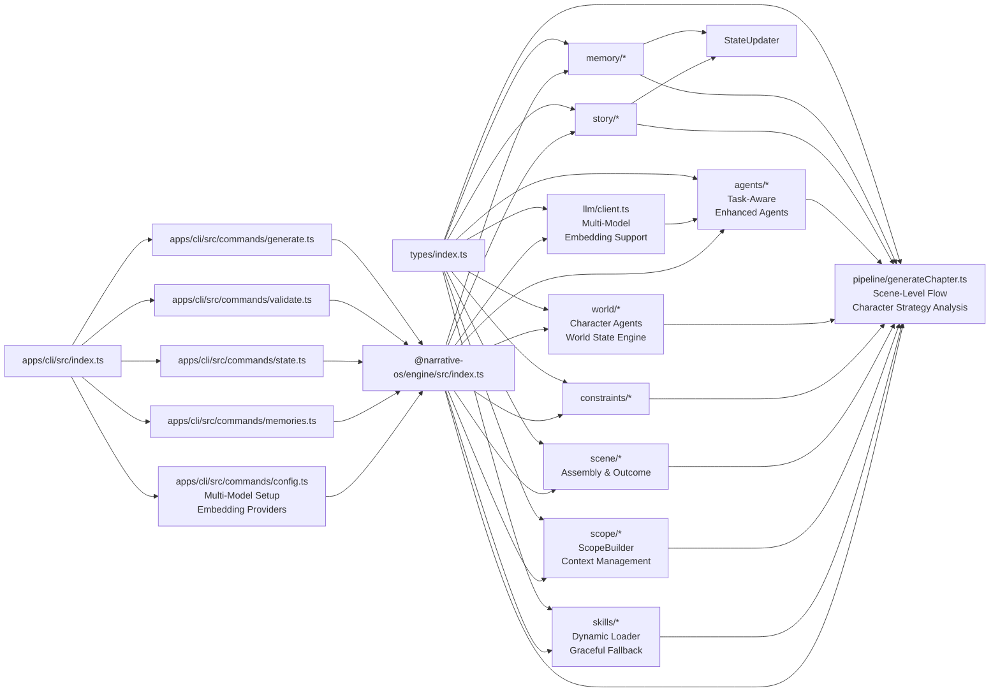

**Diagram sources**
- [packages/engine/src/types/index.ts:1-152](file://packages/engine/src/types/index.ts#L1-L152)
- [packages/engine/src/llm/client.ts:1-249](file://packages/engine/src/llm/client.ts#L1-L249)
- [packages/engine/src/memory/vectorStore.ts:1-258](file://packages/engine/src/memory/vectorStore.ts#L1-L258)
- [packages/engine/src/memory/memoryRetriever.ts:1-174](file://packages/engine/src/memory/memoryRetriever.ts#L1-L174)
- [packages/engine/src/memory/stateUpdater.ts:1-435](file://packages/engine/src/memory/stateUpdater.ts#L1-L435)
- [packages/engine/src/story/structuredState.ts:1-235](file://packages/engine/src/story/structuredState.ts#L1-L235)
- [packages/engine/src/pipeline/generateChapter.ts:1-394](file://packages/engine/src/pipeline/generateChapter.ts#L1-L394)
- [packages/engine/src/story/bible.ts:1-73](file://packages/engine/src/story/bible.ts#L1-L73)
- [packages/engine/src/agents/writer.ts:1-166](file://packages/engine/src/agents/writer.ts#L1-L166)
- [packages/engine/src/agents/completeness.ts:1-56](file://packages/engine/src/agents/completeness.ts#L1-L56)
- [packages/engine/src/agents/summarizer.ts:1-65](file://packages/engine/src/agents/summarizer.ts#L1-L65)
- [packages/engine/src/agents/canonValidator.ts:1-60](file://packages/engine/src/agents/canonValidator.ts#L1-L60)
- [packages/engine/src/agents/memoryExtractor.ts:1-99](file://packages/engine/src/agents/memoryExtractor.ts#L1-L99)
- [packages/engine/src/agents/stateUpdater.ts:1-193](file://packages/engine/src/agents/stateUpdater.ts#L1-L193)
- [packages/engine/src/agents/chapterPlanner.ts:1-326](file://packages/engine/src/agents/chapterPlanner.ts#L1-L326)
- [packages/engine/src/agents/scenePlanner.ts:1-177](file://packages/engine/src/agents/scenePlanner.ts#L1-L177)
- [packages/engine/src/agents/sceneWriter.ts:1-145](file://packages/engine/src/agents/sceneWriter.ts#L1-L145)
- [packages/engine/src/agents/sceneValidator.ts:1-117](file://packages/engine/src/agents/sceneValidator.ts#L1-L117)
- [packages/engine/src/agents/sceneAssembler.ts:1-116](file://packages/engine/src/agents/sceneAssembler.ts#L1-L116)
- [packages/engine/src/agents/sceneOutcomeExtractor.ts:1-117](file://packages/engine/src/agents/sceneOutcomeExtractor.ts#L1-L117)
- [packages/engine/src/agents/tensionController.ts:1-252](file://packages/engine/src/agents/tensionController.ts#L1-L252)
- [packages/engine/src/agents/storyDirector.ts:1-276](file://packages/engine/src/agents/storyDirector.ts#L1-L276)
- [packages/engine/src/agents/characterStrategy.ts:1-218](file://packages/engine/src/agents/characterStrategy.ts#L1-L218)
- [packages/engine/src/agents/worldStateUpdater.ts:1-150](file://packages/engine/src/agents/worldStateUpdater.ts#L1-L150)
- [packages/engine/src/world/worldState.ts:1-321](file://packages/engine/src/world/worldState.ts#L1-L321)
- [packages/engine/src/world/characterAgent.ts:1-304](file://packages/engine/src/world/characterAgent.ts#L1-L304)
- [packages/engine/src/world/eventResolver.ts:1-272](file://packages/engine/src/world/eventResolver.ts#L1-L272)
- [packages/engine/src/world/worldStateEngine.ts:1-402](file://packages/engine/src/world/worldStateEngine.ts#L1-L402)
- [packages/engine/src/skills/loader.ts:1-108](file://packages/engine/src/skills/loader.ts#L1-L108)
- [packages/engine/src/scope/scopeBuilder.ts:1-480](file://packages/engine/src/scope/scopeBuilder.ts#L1-L480)
- [packages/engine/src/constraints/constraintGraph.ts:1-471](file://packages/engine/src/constraints/constraintGraph.ts#L1-L471)
- [packages/engine/src/constraints/validator.ts:1-286](file://packages/engine/src/constraints/validator.ts#L1-L286)
- [apps/cli/src/index.ts:1-54](file://apps/cli/src/index.ts#L1-L54)
- [apps/cli/src/commands/generate.ts:1-81](file://apps/cli/src/commands/generate.ts#L1-L81)
- [apps/cli/src/commands/validate.ts:1-107](file://apps/cli/src/commands/validate.ts#L1-L107)
- [apps/cli/src/commands/state.ts:1-83](file://apps/cli/src/commands/state.ts#L1-L83)
- [apps/cli/src/commands/memories.ts:1-66](file://apps/cli/src/commands/memories.ts#L1-L66)
- [apps/cli/src/commands/config.ts:1-318](file://apps/cli/src/commands/config.ts#L1-L318)
- [packages/engine/src/index.ts:1-151](file://packages/engine/src/index.ts#L1-L151)

**Section sources**
- [packages/engine/src/index.ts:1-151](file://packages/engine/src/index.ts#L1-L151)

## Performance Considerations
- **Optimized Model Selection**: Tasks are routed to appropriate models based on purpose, improving performance and cost efficiency.
- **Token budgets**: Agents configure maxTokens per task; tune these to balance quality and cost.
- **Temperature controls**: Lower temperatures for validation and checks; higher for creative writing.
- **Continuation attempts**: Limit maxContinuationAttempts to avoid long-running loops.
- **Prompt construction**: Reuse formatted CanonStore sections and recent summaries to minimize redundant context.
- **Vector memory scaling**: HNSW algorithm provides logarithmic search complexity; monitor index size and adjust capacity management.
- **Embedding generation**: Batch embedding requests when possible; consider rate limiting for external API calls; **embedding model optimization** for vector memory operations.
- **World simulation complexity**: Character decision-making and event resolution add computational overhead; consider batching and caching strategies.
- **Constraint graph operations**: Graph traversal and validation scale with story complexity; optimize adjacency list operations.
- **State management overhead**: Structured state updates add processing time; consider lazy evaluation for non-critical calculations.
- **Persistence overhead**: Batch writes and avoid frequent disk I/O during long runs.
- **Multi-Model Overhead**: Model switching adds minimal overhead but provides significant performance benefits through purpose-based routing.
- **Embedding Model Efficiency**: Dedicated embedding models provide optimized vector generation for semantic search operations.
- **Enhanced Scene-Level Processing**: Scene planning and validation add computational overhead but enable fine-grained narrative control.
- **Tension Control Complexity**: Dynamic tension calculation requires additional processing but enhances narrative engagement.
- **Character Agent Processing**: Scene-level character decision-making adds computational overhead but creates more authentic narratives.
- **Story Director Processing**: High-level narrative coordination adds processing time but ensures coherent story structure.
- **ScopeBuilder Optimization**: **Efficient scope window extraction reduces token usage and improves generation performance by limiting context to relevant entities**.
- **Vector Store Integration**: **Semantic memory filtering based on scope reduces search space and improves retrieval accuracy**.
- **Character Strategy Analysis**: **LLM-powered JSON parsing adds computational overhead but provides precise character strategy data**.
- **Skills Loader Overhead**: **Dynamic module loading adds minimal overhead but provides extensible character development capabilities**.
- **World State Engine Persistence**: **Character strategy persistence adds processing time but enables narrative coherence across chapters**.

## Troubleshooting Guide
- **LLM provider errors**: Verify environment variables for provider selection and keys. Confirm model availability and quotas.
- **Multi-model configuration errors**: Check LLM_MODELS_CONFIG environment variable format and model availability.
- **Task routing failures**: Verify task types match expected values and model purposes are correctly configured.
- **JSON parsing failures**: The JSON completion helper throws explicit errors when responses are invalid; review prompts and constraints.
- **Missing or corrupted story data**: The CLI's loadStory function handles missing files by returning null; ensure the story directory exists and contains required JSON files.
- **Vector memory initialization**: Ensure vector store is properly initialized before use; check embedding dimensions and index capacity.
- **Memory retrieval failures**: Verify vector store contains memories and embeddings; check search parameters and category filters.
- **State update anomalies**: The StateUpdaterPipeline provides detailed change tracking; review extraction prompts and constraint graph updates.
- **Validation anomalies**: CanonValidator falls back to no violations if JSON parsing fails; inspect chapter content length and prompt truncation.
- **World simulation issues**: CharacterAgentSystem provides fallback decision-making when LLM fails; check character state consistency and agenda items.
- **Constraint violations**: ConstraintGraph validation may report logical inconsistencies; review narrative timeline and character knowledge updates.
- **Chapter planner failures**: ChapterPlanner offers fallback outline generation; verify director objectives and target word counts.
- **Scene planner failures**: ScenePlanner offers fallback plan generation; verify scene requirements and tension targets.
- **Scene writer failures**: SceneWriter may fail if scene requirements are not met; check scene plan validation and character availability.
- **Scene validator failures**: SceneValidator may reject scenes with logical inconsistencies; review scene content and character consistency.
- **Tension control issues**: TensionController may produce unexpected results if input parameters are invalid; verify chapter numbers and plot thread states.
- **Model not found errors**: Ensure model names in configuration match actual model configurations and providers are available.
- **Embedding model errors**: **Verify embedding model configuration** and API keys; check embedding dimension compatibility; ensure embedding provider supports the required model.
- **Provider compatibility issues**: **Check provider embedding support** for Alibaba Cloud, ByteDance Ark, and OpenAI; ensure proper base URLs and model names are configured.
- **Story Director failures**: StoryDirector offers fallback objective generation; verify story state and tension analysis inputs.
- **Character agent failures**: CharacterAgentSystem provides fallback decision-making; verify character data and context inputs.
- **Scene-level generation failures**: Enhanced pipeline may fail at any stage; check individual agent outputs and validation results.
- **ScopeBuilder failures**: **ScopeBuilder may fail if WorldStateEngine is not properly initialized; verify WorldStateEngine state and entity data**.
- **Memory filtering errors**: **VectorStore search may fail if embeddings are not properly generated; check embedding model configuration and API connectivity**.
- **Constraint filtering issues**: **ConstraintGraph filtering may return empty results if constraints are not properly configured; verify constraint graph structure and node relationships**.
- **CharacterStrategyAnalyzer failures**: **CharacterStrategyAnalyzer may fail if LLM returns invalid JSON; verify prompt formatting and model configuration**.
- **Skills loader failures**: **Skills loader gracefully handles missing skills package; verify skills package installation and registry configuration**.
- **WorldStateEngine failures**: **WorldStateEngine may fail if character strategies are not properly formatted; verify strategy data structure and persistence**.
- **WorldStateUpdater failures**: **WorldStateUpdater may fail if content parsing fails; verify content length limits and JSON formatting**.

**Section sources**
- [packages/engine/src/llm/client.ts:128-134](file://packages/engine/src/llm/client.ts#L128-L134)
- [packages/engine/src/llm/client.ts:72-78](file://packages/engine/src/llm/client.ts#L72-L78)
- [apps/cli/src/config/store.ts:39-67](file://apps/cli/src/config/store.ts#L39-L67)
- [packages/engine/src/memory/vectorStore.ts:30-75](file://packages/engine/src/memory/vectorStore.ts#L30-L75)
- [packages/engine/src/memory/stateUpdater.ts:94-248](file://packages/engine/src/memory/stateUpdater.ts#L94-L248)
- [packages/engine/src/agents/canonValidator.ts:49-55](file://packages/engine/src/agents/canonValidator.ts#L49-L55)
- [packages/engine/src/world/characterAgent.ts:288-296](file://packages/engine/src/world/characterAgent.ts#L288-L296)
- [packages/engine/src/constraints/constraintGraph.ts:229-244](file://packages/engine/src/constraints/constraintGraph.ts#L229-L244)
- [packages/engine/src/agents/storyDirector.ts:218-272](file://packages/engine/src/agents/storyDirector.ts#L218-L272)
- [packages/engine/src/scope/scopeBuilder.ts:367-374](file://packages/engine/src/scope/scopeBuilder.ts#L367-L374)
- [packages/engine/src/agents/characterStrategy.ts:76-84](file://packages/engine/src/agents/characterStrategy.ts#L76-L84)
- [packages/engine/src/skills/loader.ts:22-32](file://packages/engine/src/skills/loader.ts#L22-L32)
- [packages/engine/src/world/worldStateEngine.ts:309-316](file://packages/engine/src/world/worldStateEngine.ts#L309-L316)
- [packages/engine/src/agents/worldStateUpdater.ts:113-128](file://packages/engine/src/agents/worldStateUpdater.ts#L113-L128)

## Conclusion
The Narrative Operating System engine package implements a comprehensive, extensible architecture for AI-powered story generation with **advanced multi-model support and embedding capabilities**. The system now features a sophisticated hybrid approach combining autonomous world simulation with narrative direction, supported by intelligent planning, strict consistency enforcement, and advanced memory management with **dedicated embedding models**. The **enhanced LLM client with multi-model architecture** provides purpose-based routing, task-specific model mapping, **embedding model discovery**, and backward compatibility, enabling optimal performance across different use cases including **semantic search operations**. The addition of vector memory system with semantic search, structured state management with comprehensive character and plot tracking, enhanced constraint validation with dual-mode approaches, and autonomous state updater pipeline enables emergent storytelling with logical coherence, narrative consistency, and rich contextual awareness powered by **optimized embedding models**. The **comprehensive scene-level generation system** with dedicated agents for planning, writing, validation, and assembly provides fine-grained control over narrative structure and pacing. The **advanced character simulation system** with autonomous decision-making and agenda management creates rich, believable worlds with emergent plot development. The **dynamic tension control system** ensures optimal narrative engagement throughout the story arc. The **enhanced Story Director system** provides high-level narrative coordination and objective generation. **The new ScopeBuilder system provides efficient narrative scope windows and context management, extracting relevant entities and memories for optimal scene generation performance.** **The new CharacterStrategyAnalyzer system provides LLM-powered character strategy analysis with JSON parsing, enabling precise character development and narrative coherence.** **The skills loader system provides graceful fallback for external skills packages, enabling extensible character development capabilities.** **The enhanced WorldStateEngine provides comprehensive character strategy persistence and conflict detection for cross-chapter narrative continuity.** **The new WorldStateUpdater agent provides automated world state extraction and application for dynamic story evolution.** By separating concerns into agents with task-aware model selection, a provider-agnostic LLM client with multi-model support and **embedding capabilities**, canonical and vector memory systems, structured state management, world simulation, **scope management**, **character strategy analysis**, **skills loader system**, **world state management**, constraint enforcement, and a pipeline orchestrator, the system supports iterative chapter generation with validation, memory extraction, and state updates. The CLI demonstrates practical usage through generation, validation, state inspection, memory querying commands, and **interactive multi-model configuration including embedding providers**, along with persistence and incremental progress tracking. The modular design and environment-driven configuration facilitate easy experimentation with providers and tuning of generation parameters, while the **purpose-based routing system** ensures optimal model selection for different tasks including **embedding operations**. **The ScopeBuilder integration with World State Engine and Vector Store provides efficient context extraction for optimal performance in scene-level generation workflows.** **The CharacterStrategyAnalyzer integration with WorldStateEngine enables persistent character development across chapters.** **The skills loader system provides extensible character development capabilities with graceful fallback.** **The WorldStateUpdater agent enables dynamic world state evolution through content analysis.**

**Updated** Enhanced conclusion to reflect the comprehensive multi-model architecture, embedding model capabilities, expanded provider support including Alibaba Cloud and ByteDance Ark, the new scene-level generation system with dedicated agents for enhanced narrative control, the Story Director system for high-level coordination, the integrated Character Agent system for autonomous character decision-making, the new ScopeBuilder functionality for efficient narrative context management, the CharacterStrategyAnalyzer with LLM-powered JSON parsing, the skills loader system with graceful fallback, the enhanced WorldStateEngine with character strategy persistence, and the WorldStateUpdater agent for dynamic world state management.

## Appendices
- **Technology stack**: TypeScript, OpenAI SDK integration, HNSW-based vector search with hnswlib-node, monorepo orchestration with Turborepo and pnpm workspaces.
- **Cross-cutting concerns**:
  - **Configuration management**: Environment variables drive provider selection, multi-model configuration, embedding model setup, and defaults.
  - **Error handling**: Centralized LLM client error reporting and fallbacks in validators, with model discovery and routing error handling.
  - **Extensibility**: Factory pattern for providers, modular agents with task-aware model selection, flexible world simulation, constraint graph system, **scope management**, **character strategy analysis**, **skills loader system**, and vector memory architecture.
  - **Narrative consistency**: Automated validation through constraint graph and LLM-based checking.
  - **Memory management**: Semantic search with automatic embedding generation and contextual retrieval, powered by dedicated embedding models.
  - **State tracking**: Comprehensive structured state management with tension calculation and recent event tracking.
  - **World simulation**: Autonomous character agents with goal-driven decision making and event resolution.
  - **Multi-model architecture**: Purpose-based routing, task-specific model mapping, embedding model discovery, and backward compatibility support.
  - **Enhanced scene-level control**: Dedicated agents for scene planning, writing, validation, and assembly with fine-grained narrative control.
  - **Advanced tension management**: Dynamic tension calculation, target setting, and guidance generation for optimal narrative engagement.
  - **Provider ecosystem**: Support for OpenAI, DeepSeek, Alibaba Cloud, and ByteDance Ark providers with **native embedding capabilities**.
  - **Story-level coordination**: High-level narrative direction and objective generation through the Story Director system.
  - **Character-driven narratives**: Autonomous character decision-making and action planning for authentic storytelling.
  - **Scope-based context management**: **Efficient narrative scope window extraction and context filtering for optimal scene generation performance**.
  - **External integration**: **ScopeBuilder exposed through engine exports for external consumption and integration with custom workflows**.
  - **Character strategy analysis**: **LLM-powered JSON parsing for precise character development and narrative coherence**.
  - **Skills system integration**: **Dynamic skills loader with graceful fallback for extensible character development**.
  - **World state persistence**: **Comprehensive character strategy persistence and conflict detection for cross-chapter narrative continuity**.
  - **Dynamic world state evolution**: **Automated world state extraction and application for dynamic story development**.

**Section sources**
- [packages/engine/src/llm/client.ts:40-48](file://packages/engine/src/llm/client.ts#L40-L48)
- [packages/engine/src/llm/client.ts:114-126](file://packages/engine/src/llm/client.ts#L114-L126)
- [packages/engine/src/memory/vectorStore.ts:125-168](file://packages/engine/src/memory/vectorStore.ts#L125-L168)
- [packages/engine/src/story/structuredState.ts:155-179](file://packages/engine/src/story/structuredState.ts#L155-L179)
- [turbo.json:1-19](file://turbo.json#L1-L19)
- [pnpm-workspace.yaml:1-4](file://pnpm-workspace.yaml#L1-L4)
- [packages/engine/README.md:1-70](file://packages/engine/README.md#L1-L70)
- [packages/engine/package.json:1-46](file://packages/engine/package.json#L1-L46)
- [apps/cli/src/commands/config.ts:192-318](file://apps/cli/src/commands/config.ts#L192-L318)
- [packages/engine/src/scope/scopeBuilder.ts:473-480](file://packages/engine/src/scope/scopeBuilder.ts#L473-L480)
- [packages/engine/src/agents/characterStrategy.ts:96-105](file://packages/engine/src/agents/characterStrategy.ts#L96-L105)
- [packages/engine/src/skills/loader.ts:22-32](file://packages/engine/src/skills/loader.ts#L22-L32)
- [packages/engine/src/world/worldStateEngine.ts:309-316](file://packages/engine/src/world/worldStateEngine.ts#L309-L316)
- [packages/engine/src/agents/worldStateUpdater.ts:113-128](file://packages/engine/src/agents/worldStateUpdater.ts#L113-L128)