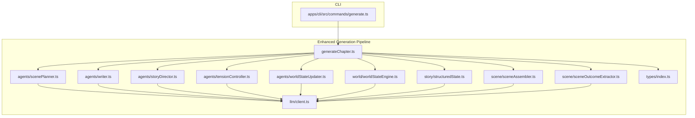
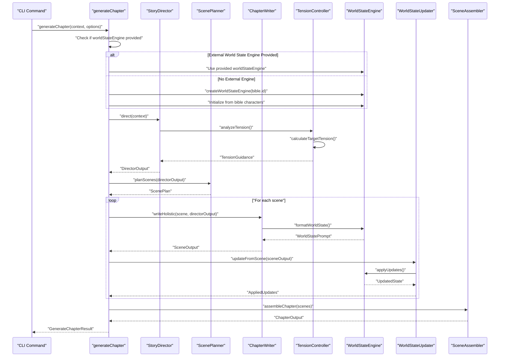
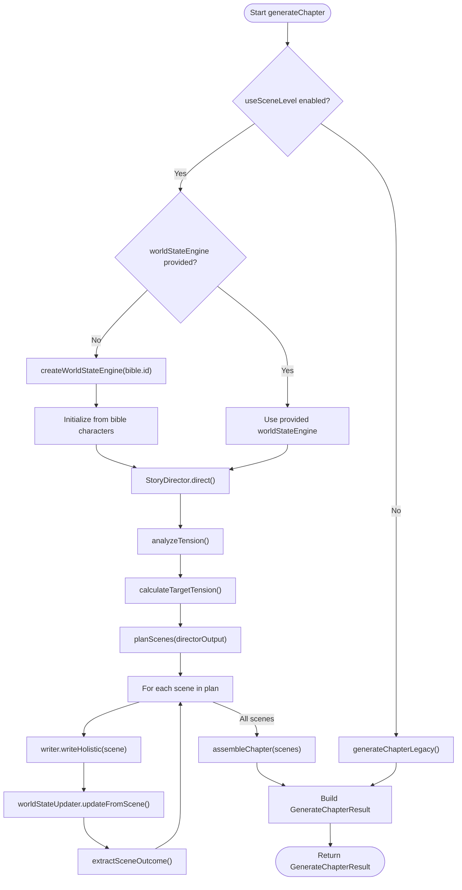
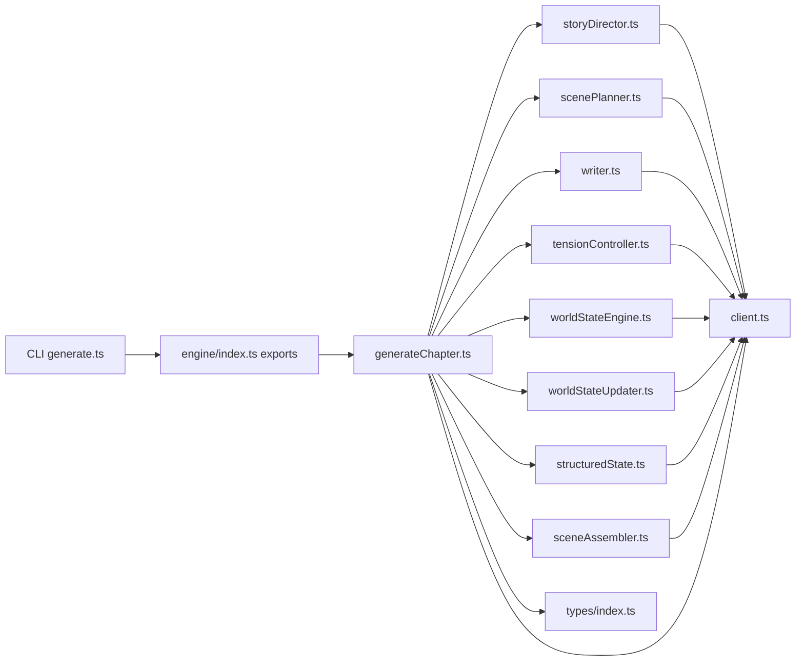

# Generation Pipeline

<cite>
**Referenced Files in This Document**
- [generateChapter.ts](file://packages/engine/src/pipeline/generateChapter.ts)
- [scenePlanner.ts](file://packages/engine/src/agents/scenePlanner.ts)
- [writer.ts](file://packages/engine/src/agents/writer.ts)
- [storyDirector.ts](file://packages/engine/src/agents/storyDirector.ts)
- [tensionController.ts](file://packages/engine/src/agents/tensionController.ts)
- [worldStateEngine.ts](file://packages/engine/src/world/worldStateEngine.ts)
- [worldStateUpdater.ts](file://packages/engine/src/agents/worldStateUpdater.ts)
- [structuredState.ts](file://packages/engine/src/story/structuredState.ts)
- [sceneAssembler.ts](file://packages/engine/src/scene/sceneAssembler.ts)
- [sceneOutcomeExtractor.ts](file://packages/engine/src/scene/sceneOutcomeExtractor.ts)
- [index.ts](file://packages/engine/src/types/index.ts)
- [client.ts](file://packages/engine/src/llm/client.ts)
- [generate.ts](file://apps/cli/src/commands/generate.ts)
- [simple.test.ts](file://packages/engine/src/test/simple.test.ts)
- [world-simulation.test.ts](file://packages/engine/src/test/world-simulation.test.ts)
</cite>

## Update Summary
**Changes Made**
- Enhanced generateChapter pipeline with conditional world state initialization using loadState() method
- Improved state loading mechanism for external World State Engine integration
- Better integration with World State Engine through conditional initialization logic
- Added support for external world state engines with proper state loading
- Enhanced world state management with conditional initialization based on provided engines

## Table of Contents
1. [Introduction](#introduction)
2. [Project Structure](#project-structure)
3. [Core Components](#core-components)
4. [Architecture Overview](#architecture-overview)
5. [Detailed Component Analysis](#detailed-component-analysis)
6. [Dependency Analysis](#dependency-analysis)
7. [Performance Considerations](#performance-considerations)
8. [Troubleshooting Guide](#troubleshooting-guide)
9. [Conclusion](#conclusion)
10. [Appendices](#appendices)

## Introduction
This document describes the enhanced generation pipeline that orchestrates AI-powered story creation with advanced world simulation capabilities for Phase 14. The pipeline now implements a sophisticated scene-level generation approach as the primary method, integrating comprehensive world state management, story direction, and tension control. The system replaces the legacy chapter-level approach with a more nuanced, scene-driven workflow that maintains logical consistency through the World State Engine while providing rich narrative complexity through the Story Director and tension management systems.

**Updated** Enhanced with conditional world state initialization and improved state loading mechanism using the loadState() method for better integration with external World State Engines.

## Project Structure
The generation pipeline now centers around a scene-level architecture with integrated world simulation and story direction capabilities. The enhanced structure includes Scene Planner, Story Director, Tension Controller, World State Engine, and comprehensive state management systems working in concert to create coherent, internally consistent narratives.

**Diagram sources**
- [generateChapter.ts:37-208](file://packages/engine/src/pipeline/generateChapter.ts#L37-L208)
- [scenePlanner.ts:18-159](file://packages/engine/src/agents/scenePlanner.ts#L18-L159)
- [writer.ts:64-298](file://packages/engine/src/agents/writer.ts#L64-L298)
- [storyDirector.ts:134-320](file://packages/engine/src/agents/storyDirector.ts#L134-L320)
- [tensionController.ts:58-167](file://packages/engine/src/agents/tensionController.ts#L58-L167)
- [worldStateEngine.ts:64-361](file://packages/engine/src/world/worldStateEngine.ts#L64-L361)
- [worldStateUpdater.ts:80-251](file://packages/engine/src/agents/worldStateUpdater.ts#L80-L251)
- [structuredState.ts:33-235](file://packages/engine/src/story/structuredState.ts#L33-L235)
- [sceneAssembler.ts:14-112](file://packages/engine/src/scene/sceneAssembler.ts#L14-L112)
- [sceneOutcomeExtractor.ts:14-117](file://packages/engine/src/scene/sceneOutcomeExtractor.ts#L14-L117)

**Section sources**
- [generateChapter.ts:37-208](file://packages/engine/src/pipeline/generateChapter.ts#L37-L208)
- [index.ts:1-152](file://packages/engine/src/types/index.ts#L1-L152)

## Core Components
The enhanced pipeline implements a sophisticated scene-level generation architecture with integrated world simulation and story direction:

### Primary Scene-Level Generation Mode with Enhanced World Simulation
- **generateChapter**: Orchestrates scene-level generation with integrated World State Engine, story direction, and tension management
- **Scene Planner**: Creates detailed scene frameworks with purpose, tension levels, and narrative function based on story progression
- **Story Director**: Provides chapter-level direction with objectives, focus characters, and narrative structure guidance
- **Tension Controller**: Analyzes current story tension and generates target tension guidance for optimal narrative arc
- **World State Engine**: Authoritative database tracking characters, locations, objects, relationships, and timeline events
- **World State Updater**: Extracts and applies world state changes from generated content to maintain logical consistency
- **Structured State Manager**: Maintains story progression tracking including tension, plot threads, and character development
- **Scene Assembler**: Combines individual scenes into cohesive chapter narratives with proper transitions
- **Scene Outcome Extractor**: Identifies key events and changes from scene content for world state updates

### Enhanced Scene-Level Generation Workflow
- **Story Direction Integration**: Consults Story Director for chapter goals, objectives, and narrative structure before scene planning
- **Dynamic Scene Planning**: Creates scene frameworks with appropriate tension levels based on story progression and target arc
- **Holistic Chapter Writing**: Writes full chapters by weaving scenes together organically without explicit scene breaks
- **World State Integration**: Updates World State Engine after each scene with character movements, discoveries, and relationship changes
- **Tension Management**: Maintains optimal tension progression throughout the chapter using calculated target values
- **Structured State Updates**: Updates story state tracking including character development and plot thread progression

### Legacy Chapter-Level Generation Mode (Fallback)
- **Writer Agent**: Generates full chapters using structured prompts with story context and target word count
- **Continuation Logic**: Repeatedly checks completeness and continues until satisfied or attempts exhausted
- **Memory Integration**: Extracts and stores memories from chapter content into vector store
- **Summary Generation**: Produces concise chapter summaries and key event extraction

### Enhanced World State Engine Integration
- **Conditional Initialization**: Initializes World State Engine conditionally based on whether an external engine is provided
- **State Loading Mechanism**: Uses loadState() method for external world state integration with proper state management
- **External Engine Support**: Supports integration with external World State Engines for persistent state management
- **State Persistence**: Enables world state serialization and deserialization for long-term story consistency

**Section sources**
- [generateChapter.ts:67-208](file://packages/engine/src/pipeline/generateChapter.ts#L67-L208)
- [scenePlanner.ts:18-159](file://packages/engine/src/agents/scenePlanner.ts#L18-L159)
- [storyDirector.ts:134-320](file://packages/engine/src/agents/storyDirector.ts#L134-L320)
- [tensionController.ts:58-167](file://packages/engine/src/agents/tensionController.ts#L58-L167)
- [worldStateEngine.ts:64-361](file://packages/engine/src/world/worldStateEngine.ts#L64-L361)
- [worldStateUpdater.ts:80-251](file://packages/engine/src/agents/worldStateUpdater.ts#L80-L251)
- [structuredState.ts:33-235](file://packages/engine/src/story/structuredState.ts#L33-L235)

## Architecture Overview
The enhanced pipeline implements a sophisticated scene-level generation architecture with integrated world simulation and story direction:

**Diagram sources**
- [generateChapter.ts:102-147](file://packages/engine/src/pipeline/generateChapter.ts#L102-L147)
- [storyDirector.ts:135-146](file://packages/engine/src/agents/storyDirector.ts#L135-L146)
- [scenePlanner.ts:18-159](file://packages/engine/src/agents/scenePlanner.ts#L18-L159)
- [writer.ts:154-269](file://packages/engine/src/agents/writer.ts#L154-L269)
- [tensionController.ts:58-167](file://packages/engine/src/agents/tensionController.ts#L58-L167)
- [worldStateEngine.ts:287-361](file://packages/engine/src/world/worldStateEngine.ts#L287-L361)
- [worldStateUpdater.ts:231-247](file://packages/engine/src/agents/worldStateUpdater.ts#L231-L247)
- [sceneAssembler.ts:14-43](file://packages/engine/src/scene/sceneAssembler.ts#L14-L43)

## Detailed Component Analysis

### Enhanced Scene-Level Generation Workflow with World Simulation
The generateChapter function now implements a sophisticated scene-level generation approach with integrated world simulation:

#### Scene-Level Generation with Enhanced World Integration (Primary Mode)
- **Story Director Integration**: Consults Story Director for chapter goals, objectives, and narrative structure before scene planning
- **Tension Analysis**: Calculates target tension using parabolic curve formula and generates appropriate guidance for scene composition
- **Dynamic Scene Planning**: Creates scene frameworks with purpose, tension levels, and narrative function based on story progression
- **Holistic Chapter Writing**: Writes full chapters by weaving scenes together organically without explicit scene breaks
- **World State Updates**: Updates World State Engine after each scene with character movements, discoveries, and relationship changes
- **Structured State Management**: Maintains story progression tracking including character development and plot thread tension
- **Outcome Extraction**: Identifies key events and changes from scene content for world state updates
- **Chapter Assembly**: Combines individual scenes into cohesive chapter narratives with proper transitions

#### Conditional World State Initialization
- **External Engine Detection**: Checks if worldStateEngine option is provided in GenerateChapterOptions
- **Conditional Creation**: Creates new World State Engine only if no external engine is provided
- **State Loading Integration**: Uses loadState() method for external world state integration
- **Bible-Based Initialization**: Initializes world state from story bible characters when creating new engines
- **Chapter Scene Tracking**: Sets chapter and scene numbers for proper world state context

#### Legacy Chapter-Level Generation (Fallback Mode)
- **Input Processing**: Extracts context and applies default chapter-level options
- **Initial Writing**: Calls the writer to produce the first draft with story context and target word count
- **Continuation Loop**: Repeatedly checks completeness and continues until satisfied or attempts exhausted
- **Memory Extraction**: Extracts and stores memories from chapter content into vector store
- **Summary Generation**: Produces concise chapter summaries and key event extraction
- **Output Synthesis**: Builds the Chapter result with metadata and timestamps

**Diagram sources**
- [generateChapter.ts:67-208](file://packages/engine/src/pipeline/generateChapter.ts#L67-L208)
- [storyDirector.ts:135-146](file://packages/engine/src/agents/storyDirector.ts#L135-L146)
- [tensionController.ts:58-97](file://packages/engine/src/agents/tensionController.ts#L58-L97)
- [scenePlanner.ts:18-159](file://packages/engine/src/agents/scenePlanner.ts#L18-L159)
- [writer.ts:154-269](file://packages/engine/src/agents/writer.ts#L154-L269)
- [worldStateUpdater.ts:231-247](file://packages/engine/src/agents/worldStateUpdater.ts#L231-L247)
- [sceneAssembler.ts:14-43](file://packages/engine/src/scene/sceneAssembler.ts#L14-L43)

**Section sources**
- [generateChapter.ts:37-208](file://packages/engine/src/pipeline/generateChapter.ts#L37-L208)

### Enhanced Scene Planner System
The Scene Planner creates sophisticated scene frameworks with narrative purpose and tension guidance:

#### Scene Framework Creation
- **Progress-Based Scene Count**: Calculates appropriate number of scenes based on story progression (setup: 4-5, rising: 6-7, middle: 7-8, pre-climax: 6-7, resolution: 4-5)
- **Director Integration**: Incorporates Story Director objectives and suggested scenes into scene framework creation
- **Tension Guidance**: Creates scenes with appropriate tension levels following calculated target arc
- **Narrative Purpose**: Defines high-level purpose for each scene including opening, rising action, climax, and resolution functions
- **Scene Type Classification**: Categorizes scenes as opening, rising, climax, falling, ending, dialogue, action, reveal, investigation, or transition

#### Scene Planning Algorithm
- **Story Progress Calculation**: Determines chapter position in story arc to set appropriate scene count and complexity
- **Director Output Integration**: Incorporates chapter goals, focus characters, and suggested scenes from Story Director
- **Fallback Mechanism**: Creates basic scene plan when LLM planning fails with appropriate scene distribution
- **Validation and Correction**: Ensures scene IDs are sequential and framework meets minimum requirements

#### Scene Framework Structure
- **Scene Purpose**: High-level narrative function (e.g., "Introduce conflict", "Reveal secret", "Build tension")
- **Tension Levels**: Target tension rating (0-10) for each scene following calculated arc
- **Scene Types**: Classification of scene function for writer guidance
- **Character Focus**: Primary characters driving each scene
- **Location Assignment**: Setting for scene action

**Section sources**
- [scenePlanner.ts:18-159](file://packages/engine/src/agents/scenePlanner.ts#L18-L159)
- [scenePlanner.ts:161-221](file://packages/engine/src/agents/scenePlanner.ts#L161-L221)

### Enhanced Story Director Integration
The Story Director provides comprehensive chapter-level direction and narrative guidance:

#### Director Output Structure
- **Chapter Number**: Target chapter for direction
- **Overall Goal**: One-sentence description of chapter achievement
- **Objectives**: Priority-ordered objectives with type categorization (plot, character, world, tension, resolution)
- **Focus Characters**: Characters that should be central to the chapter
- **Suggested Scenes**: Scene ideas with purpose, key events, and character focus
- **Chapter Structure**: Opening, rising action, climax, and resolution guidance
- **Tone**: Emotional tone for the chapter
- **Notes**: Additional guidance for writers

#### Director Context Processing
- **Story Bible Integration**: Processes title, genre, theme, premise, and character information
- **Story State Analysis**: Evaluates current chapter, total chapters, story tension, and active plot threads
- **Structured State Integration**: Incorporates character states, unresolved questions, and recent events
- **Tension Guidance**: Uses calculated target tension and pacing recommendations
- **Previous Summaries**: Considers last 3 chapter summaries for continuity

#### Fallback Mechanism
- **Automatic Objective Generation**: Creates objectives based on active plot threads and character arcs
- **Scene Suggestion Generation**: Provides appropriate scene structure based on story progression
- **Tone and Structure Guidance**: Generates chapter structure and tone recommendations

**Section sources**
- [storyDirector.ts:31-48](file://packages/engine/src/agents/storyDirector.ts#L31-L48)
- [storyDirector.ts:134-320](file://packages/engine/src/agents/storyDirector.ts#L134-L320)

### Enhanced Tension Controller System
The Tension Controller manages dynamic tension guidance throughout the story arc:

#### Tension Analysis
- **Target Calculation**: Uses parabolic formula (4 × progress × (1 - progress)) to calculate optimal tension curve
- **Current vs Target Comparison**: Analyzes gap between current story tension and target for guidance
- **Action Recommendation**: Recommends escalation, maintenance, resolution, or climax based on tension gap
- **Reasoning Documentation**: Provides clear justification for recommended action

#### Tension Guidance Generation
- **Target Tension Levels**: Calculates appropriate tension percentage for current chapter position
- **Scene Type Recommendations**: Suggests scene types appropriate for current tension phase
- **Pacing Guidance**: Provides pacing recommendations (fast, moderate, slow) based on tension requirements
- **Actionable Instructions**: Generates specific guidance for writers on how to achieve target tension

#### Tension Curve Characteristics
- **Parabolic Arc**: Low tension at beginning (setup), peak in middle (climax), resolution at end
- **Progressive Escalation**: Natural dramatic arc following story structure
- **Adaptive Targeting**: Adjusts target based on story length and current position
- **Smooth Transitions**: Blends current tension toward target with gradual adjustment

**Section sources**
- [tensionController.ts:4-17](file://packages/engine/src/agents/tensionController.ts#L4-L17)
- [tensionController.ts:28-97](file://packages/engine/src/agents/tensionController.ts#L28-L97)
- [tensionController.ts:102-167](file://packages/engine/src/agents/tensionController.ts#L102-L167)

### Enhanced World State Engine
The World State Engine provides comprehensive world simulation with authoritative consistency enforcement:

#### Core World State Tracking
- **Characters**: Track alive status, location, known information, emotional state, and goals
- **Locations**: Manage connected locations, characters present, objects present, and connections
- **Objects**: Track ownership, discovery status, and properties with automatic location updates
- **Relationships**: Maintain trust levels, hostility levels, and relationship types between characters
- **Timeline**: Record events with participants, locations, and timestamps for narrative consistency

#### World State Operations
- **Character Management**: Add characters, move between locations, kill characters, add knowledge, update emotional states
- **Location Management**: Add locations, connect locations, manage spatial relationships
- **Object Management**: Add objects, move objects, track discoveries with automatic knowledge updates
- **Relationship Management**: Set and update relationships with trust/hostility calculations
- **Event Tracking**: Add events to timeline with participant extraction and location inference

#### World State Formatting
- **Prompt Formatting**: Convert world state to narrative-friendly format for LLM consumption
- **Consistency Validation**: Provide helper methods for character knowledge validation, location checks, and relationship queries
- **State Export**: Serialize world state for persistence and debugging

#### Enhanced State Loading Mechanism
- **Conditional Initialization**: Creates new engine instance only when no external engine is provided
- **External Engine Integration**: Uses provided World State Engine for persistent state management
- **State Loading Method**: Implements loadState() method for external state integration
- **Bible-Based Setup**: Initializes world state from story bible when creating new engines
- **Chapter Scene Tracking**: Sets proper chapter and scene context for world state

**Section sources**
- [worldStateEngine.ts:52-62](file://packages/engine/src/world/worldStateEngine.ts#L52-L62)
- [worldStateEngine.ts:64-361](file://packages/engine/src/world/worldStateEngine.ts#L64-L361)

### Enhanced World State Updater
The World State Updater extracts and applies world state changes from generated content:

#### Update Extraction Process
- **Character Movement Tracking**: Identifies character movements between locations with origin/destination tracking
- **Character Death Detection**: Recognizes character death scenarios with automatic cleanup
- **Object Movement Analysis**: Tracks object relocation and ownership changes
- **Discovery Recognition**: Detects object, location, and factual discoveries by characters
- **Relationship Change Analysis**: Identifies trust and hostility modifications between characters
- **Emotional State Tracking**: Monitors character emotional state changes
- **Event Creation**: Identifies significant events that occurred during scenes

#### Update Application Mechanism
- **Safe Application**: Robust error handling for failed updates with warnings and graceful degradation
- **Relationship Calculations**: Proper trust/hostility calculations with bounds checking (-1.0 to 1.0)
- **Event Creation**: Automatic event creation with participant extraction and location inference
- **State Consistency**: Maintains logical consistency through validation and error recovery

#### Integration Points
- **Scene-Level Updates**: Applied after each scene generation for immediate world consistency
- **Chapter-Level Validation**: Used for final chapter validation against world state consistency
- **State Persistence**: Supports world state serialization and deserialization

**Section sources**
- [worldStateUpdater.ts:12-28](file://packages/engine/src/agents/worldStateUpdater.ts#L12-L28)
- [worldStateUpdater.ts:80-251](file://packages/engine/src/agents/worldStateUpdater.ts#L80-L251)

### Enhanced Structured State Management
The Structured State Manager maintains comprehensive story progression tracking:

#### Structured State Components
- **Story Tension**: Overall story tension level (0.0 to 1.0) following calculated target curve
- **Character States**: Emotional states, locations, relationships, goals, and knowledge tracking
- **Plot Thread States**: Status, tension, involvement, and summary for each active plot thread
- **Unresolved Questions**: List of story questions awaiting resolution
- **Recent Events**: Timeline of recent story events for context

#### State Management Operations
- **Character State Updates**: Update character information, relationships, and development
- **Plot Thread Management**: Update thread status, tension, and involvement tracking
- **Tension Calculation**: Calculate target tension using parabolic curve and blend with current tension
- **Event Tracking**: Add recent events and maintain recent history
- **State Formatting**: Convert structured state to prompt-friendly format for LLM consumption

#### State Evolution
- **Tension Blending**: Smooth transition from current to target tension (70% current, 30% target)
- **Progressive Updates**: Update state based on chapter progression and story events
- **Consistency Maintenance**: Ensure state remains logically consistent with world state

**Section sources**
- [structuredState.ts:23-31](file://packages/engine/src/story/structuredState.ts#L23-L31)
- [structuredState.ts:33-235](file://packages/engine/src/story/structuredState.ts#L33-L235)

### Enhanced Scene-Level Generation Components

#### Enhanced Scene Planner Integration
- **Director Output Integration**: Incorporates Story Director objectives and suggested scenes into scene planning
- **Tension Guidance**: Creates scenes with appropriate tension levels following calculated target arc
- **Dynamic Scene Count**: Adjusts scene count based on story progression and chapter position
- **Narrative Function**: Defines high-level purpose for each scene including setup, development, confrontation, and resolution

#### Holistic Chapter Writing with World Integration
- **Scene Framework Integration**: Weaves scenes together using provided framework and tension guidance
- **World State Context**: Incorporates current world state for realistic scene generation
- **Memory Integration**: Uses relevant memories for context enrichment
- **Director Vision**: Maintains Story Director objectives throughout the writing process
- **Organic Flow**: Creates seamless narrative flow without explicit scene breaks

#### Scene Outcome Extraction with World Implications
- **Event Tracking**: Identifies significant plot events and their world state implications
- **Character Development**: Tracks character changes, relationship developments, and knowledge acquisitions
- **World State Impact**: Documents changes to locations, objects, and relationships resulting from scenes
- **Outcome Synthesis**: Merges multiple scene outcomes into comprehensive chapter-level changes

**Section sources**
- [generateChapter.ts:125-147](file://packages/engine/src/pipeline/generateChapter.ts#L125-L147)
- [writer.ts:154-269](file://packages/engine/src/agents/writer.ts#L154-L269)
- [sceneAssembler.ts:14-112](file://packages/engine/src/scene/sceneAssembler.ts#L14-L112)
- [sceneOutcomeExtractor.ts:14-117](file://packages/engine/src/scene/sceneOutcomeExtractor.ts#L14-L117)

### Legacy Chapter-Level Components
The legacy components maintain backward compatibility and serve as fallback options:

#### Enhanced Writer Agent
- **Memory Integration**: Enhanced with memory retrieval for context enrichment
- **Word Count Management**: Improved target achievement and continuation logic
- **Continuation Strategy**: Robust loop control with configurable attempts and validation

#### Completeness Checker
- **Reliable Classification**: Optimized for consistent binary assessment
- **Format Normalization**: Handles varied LLM output formats effectively
- **Context-Aware Evaluation**: Considers narrative flow and structural coherence

#### Summarizer
- **Token Budget Management**: Efficient summary generation within constraints
- **Event Extraction**: Heuristic sentence boundary detection for meaningful summaries
- **Character Change Tracking**: Extracts character development for story progression

#### Memory Extractor
- **Semantic Extraction**: Advanced memory extraction with relevance scoring
- **Categorization System**: Organized memory storage for future retrieval
- **Vector Embedding**: Enhanced similarity search capabilities

**Section sources**
- [generateChapter.ts:213-288](file://packages/engine/src/pipeline/generateChapter.ts#L213-L288)

### Enhanced Types and Data Structures
The pipeline now includes comprehensive world simulation and structured state type definitions:

#### World Simulation Types
- **WorldState**: Complete world state with characters, locations, objects, relationships, timeline
- **WorldCharacter**: Character state with alive status, location, knowledge, and emotional state
- **WorldLocation**: Location state with connected locations and present characters
- **WorldObject**: Object state with ownership and discovery tracking
- **WorldRelationship**: Relationship state with trust and hostility levels
- **WorldEvent**: Timeline event with participants and location tracking

#### Story State Types
- **StoryStructuredState**: Comprehensive story state with tension, characters, plot threads, questions, events
- **CharacterState**: Character information including emotional state, relationships, goals, knowledge
- **PlotThreadState**: Plot thread information with status, tension, involvement, and summary
- **TensionAnalysis**: Tension calculation results with target, gap, and recommended action
- **TensionGuidance**: Tension guidance for writers with target levels and scene type recommendations

#### Enhanced Result Structures
- **GenerateChapterResult**: Extended with world state updates and structured state tracking
- **ScenePlan**: Scene framework with purpose, tension, type, and chapter integration
- **SceneOutput**: Scene content with summary and word count for assembly
- **SceneOutcome**: Outcome extraction with events, character changes, location changes, new information

**Section sources**
- [index.ts:117-152](file://packages/engine/src/types/index.ts#L117-L152)
- [worldStateEngine.ts:9-62](file://packages/engine/src/world/worldStateEngine.ts#L9-L62)
- [structuredState.ts:3-31](file://packages/engine/src/story/structuredState.ts#L3-L31)
- [tensionController.ts:4-17](file://packages/engine/src/agents/tensionController.ts#L4-L17)

## Dependency Analysis
The enhanced pipeline exhibits sophisticated integration of scene-level generation with world simulation and story direction:

**Diagram sources**
- [generateChapter.ts:1-395](file://packages/engine/src/pipeline/generateChapter.ts#L1-L395)
- [storyDirector.ts:1-320](file://packages/engine/src/agents/storyDirector.ts#L1-L320)
- [scenePlanner.ts:1-221](file://packages/engine/src/agents/scenePlanner.ts#L1-L221)
- [writer.ts:1-298](file://packages/engine/src/agents/writer.ts#L1-L298)
- [tensionController.ts:1-252](file://packages/engine/src/agents/tensionController.ts#L1-L252)
- [worldStateEngine.ts:1-361](file://packages/engine/src/world/worldStateEngine.ts#L1-L361)
- [worldStateUpdater.ts:1-251](file://packages/engine/src/agents/worldStateUpdater.ts#L1-L251)
- [structuredState.ts:1-235](file://packages/engine/src/story/structuredState.ts#L1-L235)
- [sceneAssembler.ts:1-112](file://packages/engine/src/scene/sceneAssembler.ts#L1-L112)
- [index.ts:1-152](file://packages/engine/src/types/index.ts#L1-L152)

**Section sources**
- [generateChapter.ts:1-395](file://packages/engine/src/pipeline/generateChapter.ts#L1-L395)

## Performance Considerations
Enhanced performance considerations for sophisticated scene-level generation with world simulation:

- **Token Budget Management**: Scene-level generation requires careful token budget allocation across multiple LLM calls including planning, writing, and world state updates
- **World State Operations**: World State Engine operations scale with number of characters, locations, and objects, requiring efficient state management
- **Tension Calculation**: Tension analysis provides optimal guidance without excessive computational cost through mathematical formulas
- **Structured State Updates**: State updates blend smoothly toward targets to avoid computational overhead
- **Memory Retrieval**: Vector store operations are optimized through selective memory retrieval rather than broad searches
- **Parallel Processing**: Scene generation can be parallelized while maintaining world state consistency
- **Logging and Monitoring**: Enhanced logging tracks scene planning, world state updates, and tension calculations with detailed timing information
- **Conditional Initialization**: Reduces unnecessary world state creation when external engines are provided
- **State Loading Efficiency**: loadState() method provides efficient state loading for external world state engines

## Troubleshooting Guide
Enhanced troubleshooting for sophisticated scene-level generation with world simulation:

### Scene-Level Generation Issues
- **Scene Planning Failures**: Verify Story Director output completeness and ensure adequate context for scene planning
- **Tension Calculation Problems**: Check story progression and total chapter count for accurate target tension calculation
- **World State Integration Errors**: Monitor world state updates for logical consistency and handle edge cases in character movements
- **Writer Output Quality**: Verify scene framework completeness and ensure adequate world state context for writing

### World State Engine Issues
- **Conditional Initialization Problems**: Verify worldStateEngine option presence and proper initialization logic
- **State Loading Failures**: Check loadState() method usage and ensure proper state format for external engines
- **Bible-Based Initialization Errors**: Verify story bible characters are properly loaded when creating new engines
- **External Engine Integration**: Ensure external World State Engine is properly configured and accessible

### Story Director Issues
- **Objective Generation Failures**: Verify story state consistency and ensure adequate context for director guidance
- **Tension Guidance Problems**: Check tension analysis inputs and handle edge cases in target tension computation
- **Fallback Mechanism**: Ensure fallback objectives are generated correctly when LLM calls fail

### Tension Controller Issues
- **Target Calculation Errors**: Verify chapter progression and total chapters for accurate parabolic curve calculation
- **Action Recommendation Problems**: Check tension gap analysis and handle edge cases in recommendation logic
- **Guidance Generation Failures**: Ensure appropriate scene type recommendations and pacing notes

### World State Engine Issues
- **State Corruption**: Check for proper serialization/deserialization and handle world state loading errors gracefully
- **Consistency Violations**: Monitor world state updates for logical consistency and handle edge cases in state operations
- **Performance Bottlenecks**: Profile world state operations and optimize for large numbers of characters and complex relationships

### World State Updater Issues
- **Update Extraction Failures**: Verify scene content quality and handle malformed JSON responses from LLM extraction
- **Application Errors**: Check world state update application with proper error handling and rollback mechanisms
- **Relationship Calculations**: Ensure proper bounds checking and handle edge cases in trust/hostility calculations

### Structured State Management Issues
- **Tension Blending Problems**: Verify smooth transition calculations and handle edge cases in tension blending
- **State Consistency**: Monitor structured state updates for logical consistency with story progression
- **Event Tracking**: Ensure proper recent event management and handle overflow scenarios

### Scene-Level Component Issues
- **Outcome Extraction Failures**: Verify scene content quality and handle fallback scenarios for outcome extraction
- **Assembly Problems**: Check scene output completeness and handle missing scene data gracefully
- **Memory Integration**: Ensure proper memory retrieval and handle vector store initialization errors

### Legacy Chapter-Level Issues
- **JSON Parsing Failures**: Legacy validators fall back to safe defaults when JSON parsing fails. Verify prompt formatting and provider response stability
- **Incomplete Chapters**: The pipeline continues until completion or attempts are exhausted. Adjust target word count or increase maxContinuationAttempts
- **Canon Violations**: Review reported violations and update canonical facts accordingly. Consider disabling validation temporarily for experimentation

### Common Dual-Mode Issues
- **Mode Selection Confusion**: Verify useSceneLevel flag and targetSceneCount settings. Scene-level mode is default but can be disabled for compatibility
- **Memory Store Configuration**: Ensure vector store is properly initialized before enabling memory retrieval features
- **Provider Misconfiguration**: Verify environment variables for provider and API keys. The LLM client handles both scene-level and chapter-level prompts
- **CLI Errors**: The CLI handles both generation modes seamlessly. Check mode-specific configuration options and logging output
- **External Engine Integration**: Verify proper world state engine setup and loadState() method usage for external state management

**Section sources**
- [generateChapter.ts:55-61](file://packages/engine/src/pipeline/generateChapter.ts#L55-L61)
- [storyDirector.ts:252-316](file://packages/engine/src/agents/storyDirector.ts#L252-L316)
- [tensionController.ts:58-97](file://packages/engine/src/agents/tensionController.ts#L58-L97)
- [worldStateEngine.ts:287-361](file://packages/engine/src/world/worldStateEngine.ts#L287-L361)
- [worldStateUpdater.ts:130-247](file://packages/engine/src/agents/worldStateUpdater.ts#L130-L247)
- [structuredState.ts:164-179](file://packages/engine/src/story/structuredState.ts#L164-L179)

## Conclusion
The enhanced generation pipeline now provides a sophisticated scene-level generation framework with comprehensive world simulation and story direction capabilities. The integration of Story Director, Tension Controller, World State Engine, and Structured State Management creates a robust narrative world management system that ensures logical consistency and rich character interactions. The new scene-level approach with holistic writing eliminates the need for explicit scene breaks while maintaining narrative coherence through integrated world state updates and tension management. Enhanced world state simulation provides authoritative consistency enforcement through character, location, object, relationship, and timeline tracking. The sophisticated tension control system ensures optimal narrative arc progression through calculated target curves and adaptive guidance. Scene-level generation serves as the primary method with intelligent story direction, dynamic tension management, world state integration, and systematic outcome extraction capabilities. 

**Updated** The enhanced conditional world state initialization and improved state loading mechanism using the loadState() method enable seamless integration with external World State Engines, providing persistent state management and better scalability for long-term story projects. The enhanced type system, memory management, and world simulation provide improved story consistency and contextual awareness. The modular design enables easy extension, testing, and debugging across both generation modes, while the CLI and tests demonstrate practical usage patterns for both approaches with comprehensive world simulation capabilities.

## Appendices

### Enhanced GenerateChapterOptions and Result Structures
- **GenerateChapterOptions** (Enhanced)
  - Fields: canon, vectorStore, validateCanon, maxContinuationAttempts, retrieveMemories, useSceneLevel, targetSceneCount, worldStateEngine
  - Defaults: validateCanon true, maxContinuationAttempts 3, useSceneLevel true, targetSceneCount undefined
  - New: worldStateEngine for external World State Engine integration
- **GenerateChapterResult** (Enhanced)
  - Fields: chapter, summary, violations, memoriesExtracted, updatedCanon, updatedWorldState
  - Additional: world state updates and structured state tracking
- **Enhanced Scene Types** (New)
  - Scene: Scene framework with purpose, tension, type, and optional conflict
  - ScenePlan: Scene framework with scenes array, chapterGoal, chapterTitle, targetTension
  - SceneOutput: Scene content with summary and word count
  - SceneOutcome: Outcome extraction with events, characterChanges, locationChanges, newInformation
- **Enhanced World State Types** (New)
  - WorldState: Complete world state with characters, locations, objects, relationships, timeline
  - WorldCharacter: Character state with alive status, location, knowledge, emotional state
  - WorldLocation: Location state with connected locations and present characters
  - WorldObject: Object state with ownership and discovery tracking
  - WorldRelationship: Relationship state with trust and hostility levels
  - WorldEvent: Timeline event with participants and location tracking
- **Enhanced Story State Types** (New)
  - StoryStructuredState: Comprehensive story state with tension, characters, plot threads, questions, events
  - CharacterState: Character information including emotional state, relationships, goals, knowledge
  - PlotThreadState: Plot thread information with status, tension, involvement, summary
  - TensionAnalysis: Tension calculation results with target, gap, recommended action
  - TensionGuidance: Tension guidance for writers with target levels and scene type recommendations

**Section sources**
- [generateChapter.ts:26-35](file://packages/engine/src/pipeline/generateChapter.ts#L26-L35)
- [generateChapter.ts:17-24](file://packages/engine/src/pipeline/generateChapter.ts#L17-L24)
- [scenePlanner.ts:118-133](file://packages/engine/src/agents/scenePlanner.ts#L118-L133)
- [worldStateEngine.ts:52-62](file://packages/engine/src/world/worldStateEngine.ts#L52-L62)
- [structuredState.ts:23-31](file://packages/engine/src/story/structuredState.ts#L23-L31)
- [tensionController.ts:4-17](file://packages/engine/src/agents/tensionController.ts#L4-L17)

### Parameter Configuration Examples
- **Scene-level configuration**: Enable scene-level generation with targetSceneCount for controlled scene count and world simulation
- **Story Director integration**: Configure Story Director with adequate context including story state, structured state, and tension guidance
- **Tension management**: Configure tension controller with appropriate story progression and target chapter count for optimal tension arc
- **World state integration**: Configure worldStateEngine for external World State Engine management and persistent world state tracking
- **Memory integration**: Configure vectorStore for contextual memory retrieval and scene memory storage with world state integration
- **Legacy configuration**: Disable scene-level mode with useSceneLevel=false for compatibility with existing workflows
- **CLI usage**: The CLI supports both modes through configuration flags and automatically selects appropriate generation approach with world simulation
- **External engine integration**: Provide worldStateEngine option for external World State Engine integration with proper state loading

**Section sources**
- [generateChapter.ts:42-50](file://packages/engine/src/pipeline/generateChapter.ts#L42-L50)
- [storyDirector.ts:42-48](file://packages/engine/src/agents/storyDirector.ts#L42-L48)
- [tensionController.ts:28-53](file://packages/engine/src/agents/tensionController.ts#L28-L53)
- [worldStateEngine.ts:64-95](file://packages/engine/src/world/worldStateEngine.ts#L64-L95)
- [generate.ts](file://apps/cli/src/commands/generate.ts)

### Extensibility and Custom Processing Steps
- **Add new scene planners**: Implement custom scene planning algorithms with specialized narrative requirements and world state integration
- **Modify tension calculation**: Update tension controller with domain-specific tension curves and guidance mechanisms
- **Extend world state validation**: Add new validation dimensions for world-specific constraints beyond canonical facts
- **Custom outcome extraction**: Develop domain-specific outcome extraction for specialized story elements and change types
- **Hybrid generation approaches**: Combine scene-level and chapter-level techniques with world simulation integration for optimal narrative structure
- **Memory enhancement**: Extend memory extraction to capture richer contextual information with world state implications
- **World state persistence**: Implement custom world state serialization and deserialization for external storage systems
- **Structured state evolution**: Add custom story progression tracking with domain-specific state metrics and update mechanisms
- **External engine integration**: Extend World State Engine integration for custom state loading and persistence mechanisms
- **Conditional initialization**: Implement custom conditional world state initialization logic for specialized use cases

**Section sources**
- [generateChapter.ts:67-208](file://packages/engine/src/pipeline/generateChapter.ts#L67-L208)
- [scenePlanner.ts:18-159](file://packages/engine/src/agents/scenePlanner.ts#L18-L159)
- [tensionController.ts:58-167](file://packages/engine/src/agents/tensionController.ts#L58-L167)
- [worldStateEngine.ts:64-361](file://packages/engine/src/world/worldStateEngine.ts#L64-L361)
- [worldStateUpdater.ts:80-251](file://packages/engine/src/agents/worldStateUpdater.ts#L80-L251)
- [structuredState.ts:33-235](file://packages/engine/src/story/structuredState.ts#L33-L235)

### Debugging Strategies for Generation Failures
- **Mode diagnostics**: Verify useSceneLevel flag and targetSceneCount settings for appropriate mode selection
- **Story Director diagnostics**: Check director output quality and handle fallback scenarios gracefully
- **Tension controller diagnostics**: Monitor tension analysis and guidance generation for calculation accuracy
- **World state diagnostics**: Monitor world state updates and handle consistency violations with detailed logging
- **Conditional initialization debugging**: Verify worldStateEngine option presence and proper initialization logic
- **State loading debugging**: Check loadState() method usage and ensure proper state format for external engines
- **Scene planning debugging**: Isolate scene planning failures and verify context completeness and LLM response quality
- **Writer debugging**: Trace scene framework integration and world state context for writing failures
- **Outcome extraction debugging**: Verify scene content quality and handle fallback scenarios for outcome extraction
- **Assembly debugging**: Check scene output completeness and handle missing scene data gracefully
- **Memory diagnostics**: Check vector store initialization and memory retrieval for contextual enhancement
- **Performance profiling**: Track token usage, world state operations, tension calculations, and generation time for both modes
- **Backward compatibility**: Test legacy mode for compatibility with existing workflows and data structures
- **Error isolation**: Use separate logging channels for scene-level, world simulation, tension management, and chapter-level operations to identify failure points
- **External engine debugging**: Verify proper world state engine setup and loadState() method usage for external state management

**Section sources**
- [generateChapter.ts:55-61](file://packages/engine/src/pipeline/generateChapter.ts#L55-L61)
- [storyDirector.ts:135-146](file://packages/engine/src/agents/storyDirector.ts#L135-L146)
- [tensionController.ts:58-97](file://packages/engine/src/agents/tensionController.ts#L58-L97)
- [worldStateEngine.ts:287-361](file://packages/engine/src/world/worldStateEngine.ts#L287-L361)
- [worldStateUpdater.ts:130-247](file://packages/engine/src/agents/worldStateUpdater.ts#L130-L247)
- [scenePlanner.ts:131-159](file://packages/engine/src/agents/scenePlanner.ts#L131-L159)
- [writer.ts:154-269](file://packages/engine/src/agents/writer.ts#L154-L269)
- [sceneOutcomeExtractor.ts:50-67](file://packages/engine/src/scene/sceneOutcomeExtractor.ts#L50-L67)
- [sceneAssembler.ts:20-43](file://packages/engine/src/scene/sceneAssembler.ts#L20-L43)