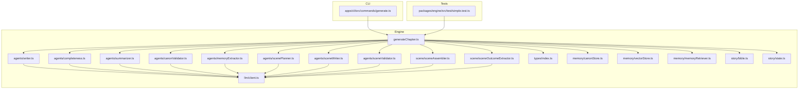
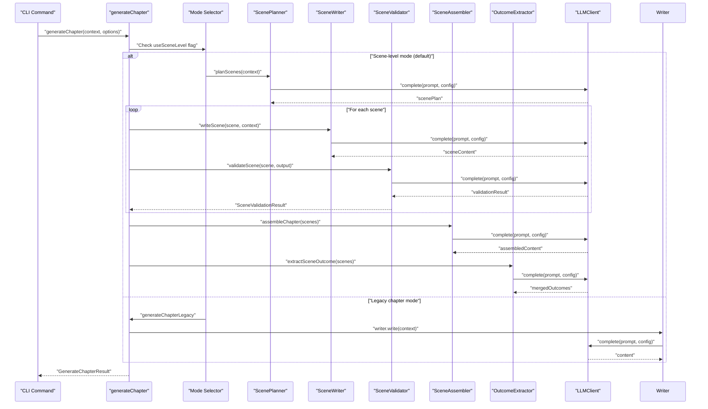
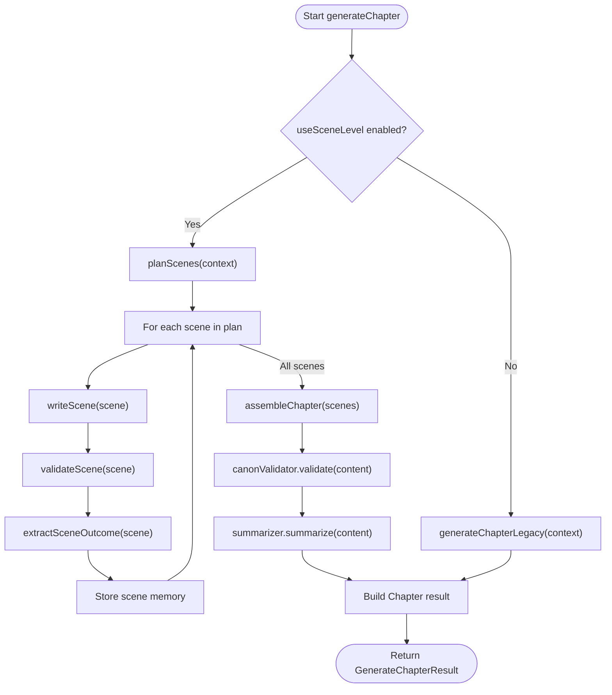
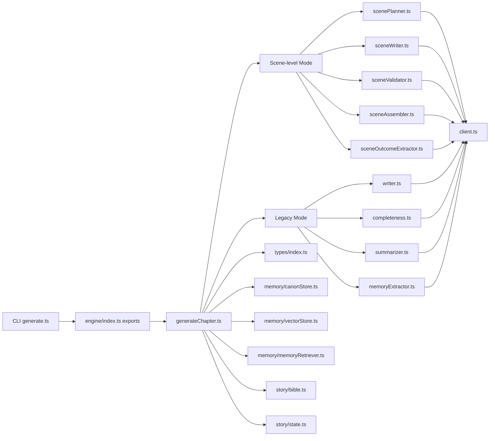

# Generation Pipeline

<cite>
**Referenced Files in This Document**
- [generateChapter.ts](file://packages/engine/src/pipeline/generateChapter.ts)
- [index.ts](file://packages/engine/src/types/index.ts)
- [sceneAssembler.ts](file://packages/engine/src/scene/sceneAssembler.ts)
- [sceneOutcomeExtractor.ts](file://packages/engine/src/scene/sceneOutcomeExtractor.ts)
- [scenePlanner.ts](file://packages/engine/src/agents/scenePlanner.ts)
- [sceneWriter.ts](file://packages/engine/src/agents/sceneWriter.ts)
- [sceneValidator.ts](file://packages/engine/src/agents/sceneValidator.ts)
- [writer.ts](file://packages/engine/src/agents/writer.ts)
- [completeness.ts](file://packages/engine/src/agents/completeness.ts)
- [summarizer.ts](file://packages/engine/src/agents/summarizer.ts)
- [canonValidator.ts](file://packages/engine/src/agents/canonValidator.ts)
- [memoryExtractor.ts](file://packages/engine/src/agents/memoryExtractor.ts)
- [client.ts](file://packages/engine/src/llm/client.ts)
- [canonStore.ts](file://packages/engine/src/memory/canonStore.ts)
- [vectorStore.ts](file://packages/engine/src/memory/vectorStore.ts)
- [memoryRetriever.ts](file://packages/engine/src/memory/memoryRetriever.ts)
- [bible.ts](file://packages/engine/src/story/bible.ts)
- [state.ts](file://packages/engine/src/story/state.ts)
- [generate.ts](file://apps/cli/src/commands/generate.ts)
- [simple.test.ts](file://packages/engine/src/test/simple.test.ts)
</cite>

## Update Summary
**Changes Made**
- Updated to reflect scene-level generation pipeline as the primary approach replacing chapter-level generation
- Enhanced generateChapter function with dual-mode support (scene-level and legacy chapter-level)
- Added comprehensive scene-related types and documentation for Scene, ScenePlan, SceneOutput, SceneValidationResult, and SceneOutcome
- Updated architecture diagrams to show scene-based workflow
- Revised core components section to include scene-level agents and processors
- Updated dependency analysis to reflect new scene-level dependencies

## Table of Contents
1. [Introduction](#introduction)
2. [Project Structure](#project-structure)
3. [Core Components](#core-components)
4. [Architecture Overview](#architecture-overview)
5. [Detailed Component Analysis](#detailed-component-analysis)
6. [Dependency Analysis](#dependency-analysis)
7. [Performance Considerations](#performance-considerations)
8. [Troubleshooting Guide](#troubleshooting-guide)
9. [Conclusion](#conclusion)
10. [Appendices](#appendices)

## Introduction
This document describes the generation pipeline that orchestrates AI-powered story creation with a focus on the scene-level generation approach as the primary method. The pipeline now supports dual-mode operation: scene-level generation (Phase 12) as the default approach and legacy chapter-level generation as a fallback option. It covers the generateChapter function workflow, step-by-step processing stages, and integration with specialized agents for both approaches. The pipeline architecture encompasses input validation, context preparation, agent coordination, and output synthesis with comprehensive scene management capabilities.

## Project Structure
The generation pipeline resides in the engine package and integrates tightly with story metadata, memory stores, scene planning, and LLM providers. The CLI demonstrates end-to-end usage, while tests provide minimal reproducible examples. The structure now includes dedicated scene-level components alongside traditional chapter-level agents.

**Diagram sources**
- [generateChapter.ts:1-290](file://packages/engine/src/pipeline/generateChapter.ts#L1-L290)
- [writer.ts](file://packages/engine/src/agents/writer.ts)
- [completeness.ts](file://packages/engine/src/agents/completeness.ts)
- [summarizer.ts](file://packages/engine/src/agents/summarizer.ts)
- [canonValidator.ts](file://packages/engine/src/agents/canonValidator.ts)
- [memoryExtractor.ts](file://packages/engine/src/agents/memoryExtractor.ts)
- [scenePlanner.ts](file://packages/engine/src/agents/scenePlanner.ts)
- [sceneWriter.ts](file://packages/engine/src/agents/sceneWriter.ts)
- [sceneValidator.ts](file://packages/engine/src/agents/sceneValidator.ts)
- [sceneAssembler.ts](file://packages/engine/src/scene/sceneAssembler.ts)
- [sceneOutcomeExtractor.ts](file://packages/engine/src/scene/sceneOutcomeExtractor.ts)
- [client.ts](file://packages/engine/src/llm/client.ts)
- [types/index.ts:1-125](file://packages/engine/src/types/index.ts#L1-L125)
- [canonStore.ts](file://packages/engine/src/memory/canonStore.ts)
- [vectorStore.ts](file://packages/engine/src/memory/vectorStore.ts)
- [memoryRetriever.ts](file://packages/engine/src/memory/memoryRetriever.ts)
- [bible.ts](file://packages/engine/src/story/bible.ts)
- [state.ts](file://packages/engine/src/story/state.ts)

**Section sources**
- [generateChapter.ts:1-290](file://packages/engine/src/pipeline/generateChapter.ts#L1-L290)
- [index.ts:1-125](file://packages/engine/src/types/index.ts#L1-L125)

## Core Components
The pipeline now operates in dual modes with comprehensive scene-level capabilities:

### Primary Scene-Level Generation Mode
- **generateChapter**: Orchestrates scene-level generation by default, coordinating scene planning, individual scene generation, validation, assembly, and outcome extraction.
- **Scene Planner**: Creates detailed scene plans with locations, characters, purposes, and tension levels for each chapter.
- **Scene Writer**: Generates individual scenes with proper context, previous scene summaries, and canonical constraints.
- **Scene Validator**: Validates each scene against canonical facts and extracts validation results.
- **Scene Assembler**: Combines individual scenes into coherent chapter content with proper transitions.
- **Scene Outcome Extractor**: Extracts key events, character changes, and plot developments from scene outputs.

### Legacy Chapter-Level Generation Mode
- **Writer Agent**: Generates or continues chapter content using structured prompts with story context and target word count.
- **Completeness Checker**: Evaluates whether the chapter ends at a natural stopping point.
- **Summarizer**: Produces concise chapter summaries and extracts key events.
- **Memory Extractor**: Extracts and stores memories from chapter content into vector store.

### Shared Infrastructure
- **LLM Client**: Provides unified access to configured LLM providers with configurable models and token limits.
- **Types**: Defines comprehensive scene-related structures including Scene, ScenePlan, SceneOutput, SceneValidationResult, and SceneOutcome.
- **Memory Management**: Enhanced with vector store integration for scene memory storage and retrieval.
- **Story Utilities**: Create and update story metadata and state with scene-level tracking.

**Section sources**
- [generateChapter.ts:33-57](file://packages/engine/src/pipeline/generateChapter.ts#L33-L57)
- [generateChapter.ts:63-205](file://packages/engine/src/pipeline/generateChapter.ts#L63-L205)
- [generateChapter.ts:210-285](file://packages/engine/src/pipeline/generateChapter.ts#L210-L285)
- [index.ts:91-125](file://packages/engine/src/types/index.ts#L91-L125)

## Architecture Overview
The pipeline now supports two distinct architectural approaches with scene-level generation as the primary method:

**Diagram sources**
- [generateChapter.ts:33-57](file://packages/engine/src/pipeline/generateChapter.ts#L33-L57)
- [generateChapter.ts:63-205](file://packages/engine/src/pipeline/generateChapter.ts#L63-L205)
- [generateChapter.ts:210-285](file://packages/engine/src/pipeline/generateChapter.ts#L210-L285)

## Detailed Component Analysis

### Dual-Mode GenerateChapter Workflow
The generateChapter function now supports two distinct generation approaches:

#### Scene-Level Generation (Primary Mode)
- **Input unpacking and defaults**: Extracts context and applies default scene-level options with useSceneLevel=true.
- **Scene planning**: Creates detailed scene plans with target scene count and chapter goals.
- **Individual scene generation**: Generates each scene with proper context, validation, and outcome extraction.
- **Assembly and validation**: Combines scenes into coherent chapter content and validates against canonical facts.
- **Outcome synthesis**: Extracts key events and character changes from scene outcomes.

#### Legacy Chapter-Level Generation (Fallback Mode)
- **Input unpacking and defaults**: Extracts context and applies default chapter-level options.
- **Initial writing**: Calls the writer to produce the first draft.
- **Continuation loop**: Repeatedly checks completeness and continues until satisfied or attempts exhausted.
- **Optional memory extraction**: Extracts and stores memories from chapter content.
- **Summary generation**: Produces concise chapter summary and key events.
- **Output synthesis**: Builds the Chapter result with metadata and timestamps.

**Diagram sources**
- [generateChapter.ts:33-57](file://packages/engine/src/pipeline/generateChapter.ts#L33-L57)
- [generateChapter.ts:63-205](file://packages/engine/src/pipeline/generateChapter.ts#L63-L205)
- [generateChapter.ts:210-285](file://packages/engine/src/pipeline/generateChapter.ts#L210-L285)

**Section sources**
- [generateChapter.ts:33-290](file://packages/engine/src/pipeline/generateChapter.ts#L33-L290)

### Scene-Level Generation Components

#### Scene Planner
Responsibilities:
- Analyze story context and chapter goals to create detailed scene plans.
- Determine scene locations, characters, purposes, and tension levels.
- Set target scene count and chapter-specific objectives.

Key behaviors:
- Integrates with story state and previous chapter summaries.
- Creates structured Scene objects with proper typing.
- Supports dynamic scene count adjustment based on complexity.

#### Scene Writer
Responsibilities:
- Generate individual scenes with proper context and constraints.
- Handle scene transitions and narrative continuity.
- Maintain appropriate word count and scene-specific goals.

Key behaviors:
- Uses scene purpose, location, and character lists for context.
- Incorporates previous scene summaries for continuity.
- Respects scene-specific constraints and canonical facts.

#### Scene Validator
Responsibilities:
- Validate each scene against canonical facts and story consistency.
- Extract validation results with detailed violation reporting.
- Maintain scene integrity while allowing creative flexibility.

Key behaviors:
- Parses validation responses with structured result objects.
- Handles validation failures gracefully with partial acceptance.
- Provides detailed violation descriptions for debugging.

#### Scene Assembler
Responsibilities:
- Combine individual scenes into coherent chapter content.
- Handle scene transitions and narrative flow.
- Maintain proper formatting and structural coherence.

Key behaviors:
- Integrates scene outputs with appropriate transitions.
- Ensures narrative continuity across scene boundaries.
- Maintains chapter-level formatting standards.

#### Scene Outcome Extractor
Responsibilities:
- Extract key events, character changes, and plot developments.
- Merge outcomes from multiple scenes into chapter-level insights.
- Provide structured outcome data for story state updates.

Key behaviors:
- Identifies significant plot points and character arcs.
- Extracts quantitative changes in story elements.
- Maintains temporal ordering of extracted outcomes.

**Section sources**
- [generateChapter.ts:84-160](file://packages/engine/src/pipeline/generateChapter.ts#L84-L160)
- [generateChapter.ts:162-184](file://packages/engine/src/pipeline/generateChapter.ts#L162-L184)

### Legacy Chapter-Level Components
The legacy components maintain backward compatibility and serve as fallback options:

#### Writer Agent
Responsibilities:
- Assemble structured prompts from StoryBible, StoryState, and optional CanonStore.
- Infer chapter goals based on story progress.
- Generate initial content and provide continuation capability.

Key behaviors:
- Enhanced with memory retrieval integration for context enrichment.
- Supports word count estimation and target achievement.
- Provides robust continuation logic for incomplete chapters.

#### Completeness Checker
Responsibilities:
- Determine natural stopping points in chapter content.
- Return binary assessment suitable for loop control.
- Maintain consistency across different writing styles.

Key behaviors:
- Minimal instruction set optimized for reliable classification.
- Normalization handling for varied LLM output formats.
- Context-aware completeness evaluation.

#### Summarizer
Responsibilities:
- Produce concise chapter summaries within token budgets.
- Extract key events using heuristic sentence boundary detection.
- Maintain fixed chapter number associations for state updates.

Key behaviors:
- Event-triggering verb detection for meaningful sentence selection.
- Character change extraction for story progression tracking.
- Structured summary format for downstream processing.

#### Memory Extractor
Responsibilities:
- Extract meaningful story elements from chapter content.
- Store memories in vector database with categorization.
- Support future retrieval and story consistency.

Key behaviors:
- Semantic memory extraction with relevance scoring.
- Category assignment for memory organization.
- Vector embedding generation for similarity search.

**Section sources**
- [generateChapter.ts:210-285](file://packages/engine/src/pipeline/generateChapter.ts#L210-L285)

### Enhanced Types and Data Structures
The pipeline now includes comprehensive scene-level type definitions:

#### Scene-Level Types
- **Scene**: Individual scene representation with location, characters, purpose, and tension.
- **ScenePlan**: Complete chapter scene plan with scenes array and chapter goals.
- **SceneOutput**: Generated scene content with summary and word count metrics.
- **SceneValidationResult**: Structured validation results with violation tracking.
- **SceneOutcome**: Extracted outcomes including events, character changes, and new information.

#### Enhanced Result Structures
- **GenerateChapterResult**: Extended with memory extraction count and scene-level metadata.
- **GenerateChapterOptions**: Enhanced with scene-level controls including targetSceneCount and useSceneLevel flags.

#### Backward Compatibility Types
- **GenerationContext**: Maintains chapter-level context structure.
- **Chapter**: Standard chapter entity with computed metadata.
- **ChapterSummary**: Summary with key events and character changes.
- **WriterOutput**: Legacy writer output structure.

**Section sources**
- [index.ts:91-125](file://packages/engine/src/types/index.ts#L91-L125)
- [generateChapter.ts:16-31](file://packages/engine/src/pipeline/generateChapter.ts#L16-L31)

### Memory and Vector Store Integration
Enhanced memory management supports both scene-level and chapter-level operations:

- **Vector Store**: Provides semantic memory storage with similarity search capabilities.
- **Memory Retriever**: Enables contextual memory retrieval for scene planning and generation.
- **Scene Memory Storage**: Stores individual scene summaries and outcomes for future reference.
- **Memory Extraction**: Extracts meaningful story elements from content for persistent storage.

**Section sources**
- [generateChapter.ts:77-82](file://packages/engine/src/pipeline/generateChapter.ts#L77-L82)
- [generateChapter.ts:147-156](file://packages/engine/src/pipeline/generateChapter.ts#L147-L156)
- [generateChapter.ts:263-280](file://packages/engine/src/pipeline/generateChapter.ts#L263-L280)

## Dependency Analysis
The pipeline now exhibits enhanced separation of concerns with dual-mode architecture:

**Diagram sources**
- [generateChapter.ts:1-290](file://packages/engine/src/pipeline/generateChapter.ts#L1-L290)
- [index.ts:1-125](file://packages/engine/src/types/index.ts#L1-L125)

**Section sources**
- [generateChapter.ts:1-290](file://packages/engine/src/pipeline/generateChapter.ts#L1-L290)

## Performance Considerations
Enhanced performance considerations for dual-mode operation:

- **Token budgets**: Both scene-level and chapter-level agents set explicit maxTokens to control cost and latency. Scene-level generation may require higher token budgets due to multiple validation steps.
- **Scene count optimization**: The targetSceneCount parameter allows tuning for complexity and desired narrative granularity.
- **Memory retrieval efficiency**: Vector store integration enables efficient contextual memory retrieval but requires proper indexing and initialization.
- **Parallel processing**: Scene-level generation can potentially parallelize independent scene generation while maintaining sequential assembly.
- **Continuation attempts**: Legacy mode maintains configurable continuation attempts, while scene-level mode uses iterative validation and correction.
- **Provider configuration**: Environment variables support multiple providers with scene-level prompt engineering optimizations.
- **Logging and monitoring**: Enhanced logging tracks both scene-level and chapter-level progress with detailed timing information.

## Troubleshooting Guide
Enhanced troubleshooting for dual-mode operation:

### Scene-Level Generation Issues
- **Scene planning failures**: Verify story state consistency and ensure adequate context for scene planning. Check vector store availability for memory-enhanced planning.
- **Scene generation problems**: Review scene-specific prompts and ensure canonical facts are properly formatted. Check memory retrieval for contextual enhancement.
- **Assembly failures**: Validate scene outputs for structural coherence and narrative flow. Ensure proper scene transition handling.
- **Outcome extraction issues**: Verify scene outcome extraction prompts and handle cases where scenes don't contain expected elements.

### Legacy Chapter-Level Issues
- **JSON parsing failures**: Legacy validators fall back to safe defaults when JSON parsing fails. Verify prompt formatting and provider response stability.
- **Incomplete chapters**: The pipeline continues until completion or attempts are exhausted. Adjust target word count or increase maxContinuationAttempts.
- **Canon violations**: Review reported violations and update canonical facts accordingly. Consider disabling validation temporarily for experimentation.

### Common Dual-Mode Issues
- **Mode selection confusion**: Verify useSceneLevel flag and targetSceneCount settings. Scene-level mode is default but can be disabled for compatibility.
- **Memory store configuration**: Ensure vector store is properly initialized before enabling memory retrieval features.
- **Provider misconfiguration**: Verify environment variables for provider and API keys. The LLM client handles both scene-level and chapter-level prompts.
- **CLI errors**: The CLI handles both generation modes seamlessly. Check mode-specific configuration options and logging output.

**Section sources**
- [generateChapter.ts:44-46](file://packages/engine/src/pipeline/generateChapter.ts#L44-L46)
- [generateChapter.ts:77-82](file://packages/engine/src/pipeline/generateChapter.ts#L77-L82)
- [generateChapter.ts:108-112](file://packages/engine/src/pipeline/generateChapter.ts#L108-L112)
- [generateChapter.ts:218-222](file://packages/engine/src/pipeline/generateChapter.ts#L218-L222)

## Conclusion
The generation pipeline now provides a robust dual-mode architecture supporting both scene-level and chapter-level generation approaches. Scene-level generation serves as the primary method with comprehensive planning, individual scene generation, validation, and outcome extraction capabilities. Legacy chapter-level generation maintains backward compatibility while the enhanced type system and memory management provide improved story consistency and contextual awareness. The modular design enables easy extension, testing, and debugging across both generation modes, while the CLI and tests demonstrate practical usage patterns for both approaches.

## Appendices

### Enhanced GenerateChapterOptions and Result Structures
- **GenerateChapterOptions** (Enhanced)
  - Fields: canon, vectorStore, validateCanon, maxContinuationAttempts, retrieveMemories, useSceneLevel, targetSceneCount
  - Defaults: validateCanon true, maxContinuationAttempts 3, useSceneLevel true, targetSceneCount 4
- **GenerateChapterResult** (Enhanced)
  - Fields: chapter, summary, violations, memoriesExtracted
  - Additional: memoriesExtracted count for scene-level memory storage
- **Scene Types** (New)
  - Scene: id, location, characters, purpose, tension, conflict, type
  - ScenePlan: scenes array, chapterGoal, targetTension
  - SceneOutput: content, summary, wordCount
  - SceneValidationResult: isValid, violations array
  - SceneOutcome: events, characterChanges, locationChanges, newInformation

**Section sources**
- [generateChapter.ts:23-31](file://packages/engine/src/pipeline/generateChapter.ts#L23-L31)
- [generateChapter.ts:16-21](file://packages/engine/src/pipeline/generateChapter.ts#L16-L21)
- [index.ts:91-125](file://packages/engine/src/types/index.ts#L91-L125)

### Parameter Configuration Examples
- **Scene-level configuration**: Enable scene-level generation with targetSceneCount=6 for complex chapters requiring more detailed breakdown.
- **Legacy configuration**: Disable scene-level mode with useSceneLevel=false for compatibility with existing workflows.
- **Memory integration**: Configure vectorStore for contextual memory retrieval and scene memory storage.
- **CLI usage**: The CLI supports both modes through configuration flags and automatically selects appropriate generation approach.

**Section sources**
- [generateChapter.ts:44-46](file://packages/engine/src/pipeline/generateChapter.ts#L44-L46)
- [generateChapter.ts:77-82](file://packages/engine/src/pipeline/generateChapter.ts#L77-L82)
- [generate.ts](file://apps/cli/src/commands/generate.ts)

### Extensibility and Custom Processing Steps
- **Add new scene-level agents**: Implement new scene-focused agents with writeScene, validateScene, and extractSceneOutcome methods.
- **Modify scene planning**: Update scene planner logic to handle new scene types or complexity requirements.
- **Extend validation**: Add new validation dimensions for scene-specific constraints beyond canonical facts.
- **Custom outcome extraction**: Develop domain-specific outcome extraction for specialized story elements.
- **Hybrid approaches**: Combine scene-level and chapter-level techniques for optimal narrative structure.
- **Memory enhancement**: Extend memory extraction to capture richer contextual information for scene planning.

**Section sources**
- [generateChapter.ts:63-205](file://packages/engine/src/pipeline/generateChapter.ts#L63-L205)
- [index.ts:91-125](file://packages/engine/src/types/index.ts#L91-L125)

### Debugging Strategies for Generation Failures
- **Mode diagnostics**: Verify useSceneLevel flag and targetSceneCount settings for appropriate mode selection.
- **Scene-level debugging**: Monitor individual scene generation, validation, and outcome extraction processes separately.
- **Memory diagnostics**: Check vector store initialization and memory retrieval for contextual enhancement.
- **Performance profiling**: Track token usage and generation time for both scene-level and chapter-level approaches.
- **Backward compatibility**: Test legacy mode for compatibility with existing workflows and data structures.
- **Error isolation**: Use separate logging channels for scene-level and chapter-level operations to identify failure points.

**Section sources**
- [generateChapter.ts:48-53](file://packages/engine/src/pipeline/generateChapter.ts#L48-L53)
- [generateChapter.ts:217-222](file://packages/engine/src/pipeline/generateChapter.ts#L217-L222)
- [generateChapter.ts:101-102](file://packages/engine/src/pipeline/generateChapter.ts#L101-L102)