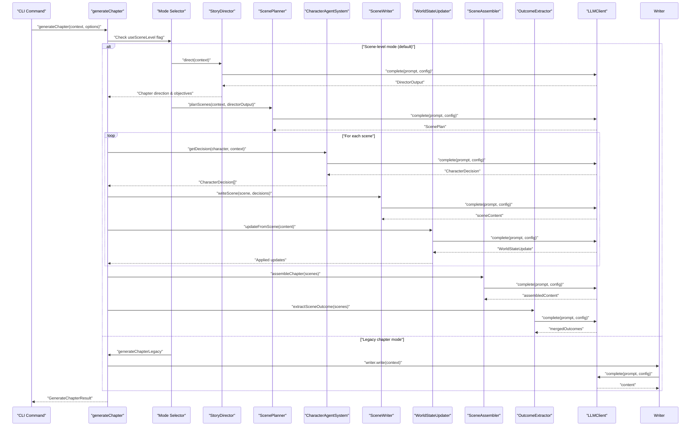
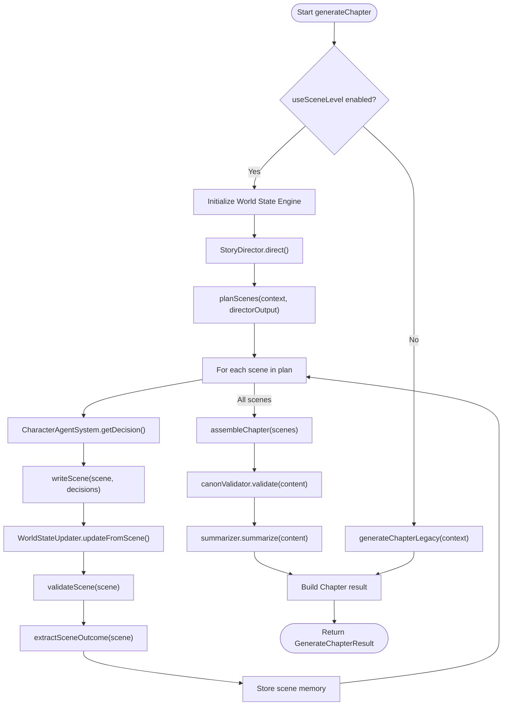
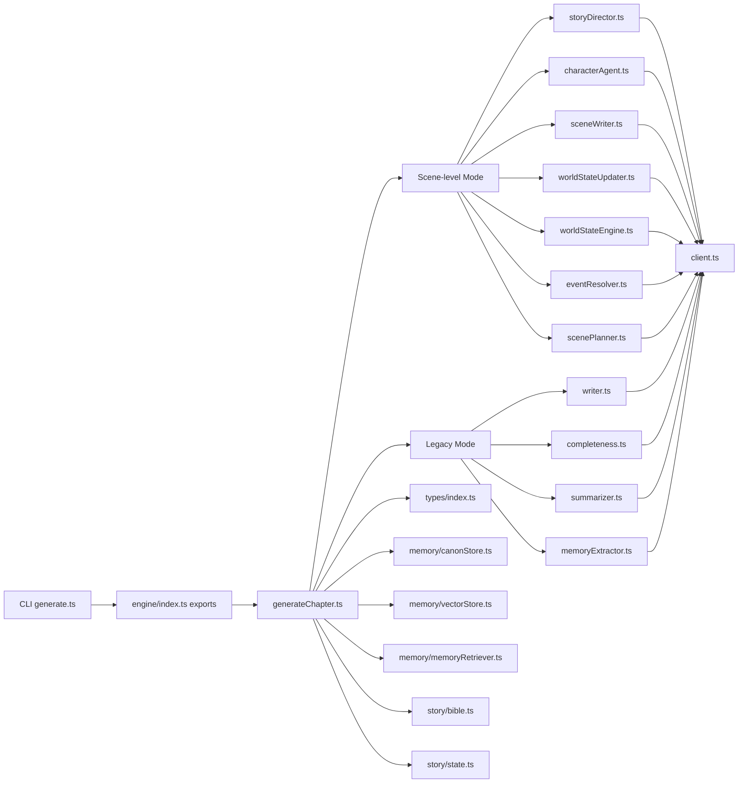

# Generation Pipeline

<cite>
**Referenced Files in This Document**
- [generateChapter.ts](file://packages/engine/src/pipeline/generateChapter.ts)
- [index.ts](file://packages/engine/src/types/index.ts)
- [sceneAssembler.ts](file://packages/engine/src/scene/sceneAssembler.ts)
- [sceneOutcomeExtractor.ts](file://packages/engine/src/scene/sceneOutcomeExtractor.ts)
- [scenePlanner.ts](file://packages/engine/src/agents/scenePlanner.ts)
- [sceneWriter.ts](file://packages/engine/src/agents/sceneWriter.ts)
- [sceneValidator.ts](file://packages/engine/src/agents/sceneValidator.ts)
- [writer.ts](file://packages/engine/src/agents/writer.ts)
- [completeness.ts](file://packages/engine/src/agents/completeness.ts)
- [summarizer.ts](file://packages/engine/src/agents/summarizer.ts)
- [canonValidator.ts](file://packages/engine/src/agents/canonValidator.ts)
- [memoryExtractor.ts](file://packages/engine/src/agents/memoryExtractor.ts)
- [client.ts](file://packages/engine/src/llm/client.ts)
- [canonStore.ts](file://packages/engine/src/memory/canonStore.ts)
- [vectorStore.ts](file://packages/engine/src/memory/vectorStore.ts)
- [memoryRetriever.ts](file://packages/engine/src/memory/memoryRetriever.ts)
- [bible.ts](file://packages/engine/src/story/bible.ts)
- [state.ts](file://packages/engine/src/story/state.ts)
- [generate.ts](file://apps/cli/src/commands/generate.ts)
- [simple.test.ts](file://packages/engine/src/test/simple.test.ts)
- [worldStateEngine.ts](file://packages/engine/src/world/worldStateEngine.ts)
- [characterAgent.ts](file://packages/engine/src/world/characterAgent.ts)
- [worldStateUpdater.ts](file://packages/engine/src/agents/worldStateUpdater.ts)
- [storyDirector.ts](file://packages/engine/src/agents/storyDirector.ts)
- [eventResolver.ts](file://packages/engine/src/world/eventResolver.ts)
- [worldState.ts](file://packages/engine/src/world/worldState.ts)
- [world-simulation.test.ts](file://packages/engine/src/test/world-simulation.test.ts)
</cite>

## Update Summary
**Changes Made**
- Enhanced Generation Pipeline with World State Engine integration for Phase 14 world simulation
- Added character decisions passing mechanism between scene-level generation and world state updates
- Integrated Story Director for chapter-level direction and tension management
- Added comprehensive world state tracking with character movements, object discoveries, and relationship changes
- Implemented event resolution system for character interactions and conflicts
- Enhanced scene-level generation with world state awareness and character decision integration

## Table of Contents
1. [Introduction](#introduction)
2. [Project Structure](#project-structure)
3. [Core Components](#core-components)
4. [Architecture Overview](#architecture-overview)
5. [Detailed Component Analysis](#detailed-component-analysis)
6. [Dependency Analysis](#dependency-analysis)
7. [Performance Considerations](#performance-considerations)
8. [Troubleshooting Guide](#troubleshooting-guide)
9. [Conclusion](#conclusion)
10. [Appendices](#appendices)

## Introduction
This document describes the enhanced generation pipeline that orchestrates AI-powered story creation with advanced world simulation capabilities for Phase 14. The pipeline now integrates a comprehensive World State Engine that tracks character movements, object discoveries, relationship changes, and timeline events. It coordinates scene-level generation with intelligent character decision-making, world state updates, and event resolution to create coherent, internally consistent narratives. The system supports both scene-level generation (Phase 12) as the primary approach and legacy chapter-level generation as a fallback option, with enhanced world simulation capabilities.

## Project Structure
The generation pipeline now includes sophisticated world simulation infrastructure alongside traditional story generation components. The enhanced structure integrates World State Engine, Character Agent System, Story Director, and Event Resolver to create a comprehensive narrative world management system.

```mermaid
graph TB
subgraph "Enhanced Engine"
A["generateChapter.ts"]
B["agents/writer.ts"]
C["agents/completeness.ts"]
D["agents/summarizer.ts"]
E["agents/canonValidator.ts"]
F["agents/memoryExtractor.ts"]
G["agents/scenePlanner.ts"]
H["agents/sceneWriter.ts"]
I["agents/sceneValidator.ts"]
J["scene/sceneAssembler.ts"]
K["scene/sceneOutcomeExtractor.ts"]
L["llm/client.ts"]
M["types/index.ts"]
N["memory/canonStore.ts"]
O["memory/vectorStore.ts"]
P["memory/memoryRetriever.ts"]
Q["story/bible.ts"]
R["story/state.ts"]
S["agents/storyDirector.ts"]
T["agents/worldStateUpdater.ts"]
U["world/worldStateEngine.ts"]
V["world/characterAgent.ts"]
W["world/eventResolver.ts"]
X["world/worldState.ts"]
end
subgraph "CLI"
Y["apps/cli/src/commands/generate.ts"]
end
subgraph "Tests"
Z["packages/engine/src/test/world-simulation.test.ts"]
end
Y --> A
A --> B
A --> C
A --> D
A --> E
A --> F
A --> G
A --> H
A --> I
A --> J
A --> K
A --> S
A --> T
A --> U
A --> V
A --> W
A --> X
B --> L
C --> L
D --> L
E --> L
F --> L
G --> L
H --> L
I --> L
J --> L
K --> L
S --> L
T --> L
U --> L
V --> L
W --> L
X --> L
A --> M
A --> N
A --> O
A --> P
A --> Q
A --> R
Z --> A
```

**Diagram sources**
- [generateChapter.ts:1-420](file://packages/engine/src/pipeline/generateChapter.ts#L1-L420)
- [writer.ts](file://packages/engine/src/agents/writer.ts)
- [completeness.ts](file://packages/engine/src/agents/completeness.ts)
- [summarizer.ts](file://packages/engine/src/agents/summarizer.ts)
- [canonValidator.ts](file://packages/engine/src/agents/canonValidator.ts)
- [memoryExtractor.ts](file://packages/engine/src/agents/memoryExtractor.ts)
- [scenePlanner.ts](file://packages/engine/src/agents/scenePlanner.ts)
- [sceneWriter.ts](file://packages/engine/src/agents/sceneWriter.ts)
- [sceneValidator.ts](file://packages/engine/src/agents/sceneValidator.ts)
- [sceneAssembler.ts](file://packages/engine/src/scene/sceneAssembler.ts)
- [sceneOutcomeExtractor.ts](file://packages/engine/src/scene/sceneOutcomeExtractor.ts)
- [client.ts](file://packages/engine/src/llm/client.ts)
- [types/index.ts:1-152](file://packages/engine/src/types/index.ts#L1-L152)
- [canonStore.ts](file://packages/engine/src/memory/canonStore.ts)
- [vectorStore.ts](file://packages/engine/src/memory/vectorStore.ts)
- [memoryRetriever.ts](file://packages/engine/src/memory/memoryRetriever.ts)
- [bible.ts](file://packages/engine/src/story/bible.ts)
- [state.ts](file://packages/engine/src/story/state.ts)
- [storyDirector.ts](file://packages/engine/src/agents/storyDirector.ts)
- [worldStateUpdater.ts](file://packages/engine/src/agents/worldStateUpdater.ts)
- [worldStateEngine.ts](file://packages/engine/src/world/worldStateEngine.ts)
- [characterAgent.ts](file://packages/engine/src/world/characterAgent.ts)
- [eventResolver.ts](file://packages/engine/src/world/eventResolver.ts)
- [worldState.ts](file://packages/engine/src/world/worldState.ts)

**Section sources**
- [generateChapter.ts:1-420](file://packages/engine/src/pipeline/generateChapter.ts#L1-L420)
- [index.ts:1-152](file://packages/engine/src/types/index.ts#L1-L152)

## Core Components
The enhanced pipeline now operates with sophisticated world simulation capabilities:

### Primary Scene-Level Generation Mode with World Simulation
- **generateChapter**: Orchestrates scene-level generation with integrated World State Engine, character decision passing, and world state updates.
- **Story Director**: Provides chapter-level direction with tension management and objective generation for coherent narrative progression.
- **Character Agent System**: Manages character decisions, agendas, knowledge, and relationships with both LLM-powered and fallback decision-making.
- **World State Engine**: Comprehensive world state tracking including characters, locations, objects, relationships, and timeline events.
- **World State Updater**: Extracts and applies world state changes from scene content to maintain narrative consistency.
- **Event Resolver**: Processes character decisions into world events and resolves conflicts and interactions systematically.
- **Enhanced Scene Planner**: Creates detailed scene plans with director guidance and world state awareness.
- **Scene Writer**: Generates scenes with character decision integration and world state context.
- **Scene Validator**: Validates scenes against canonical facts and world state consistency.
- **Scene Assembler**: Combines scenes with world state transitions and narrative flow.
- **Scene Outcome Extractor**: Extracts key events and character changes with world state implications.

### Legacy Chapter-Level Generation Mode
- **Writer Agent**: Generates or continues chapter content using structured prompts with story context and target word count.
- **Completeness Checker**: Evaluates whether the chapter ends at a natural stopping point.
- **Summarizer**: Produces concise chapter summaries and extracts key events.
- **Memory Extractor**: Extracts and stores memories from chapter content into vector store.

### Enhanced World Simulation Infrastructure
- **World State Engine**: Authoritative database tracking characters, locations, objects, relationships, and timeline for logical consistency.
- **Character Agent System**: Intelligent character decision-making with personality, goals, agendas, and relationship dynamics.
- **Event Resolution System**: Systematic processing of character interactions, conflicts, and environmental events.
- **Story Director**: Chapter-level narrative guidance with tension management and objective prioritization.
- **World State Updater**: Automatic extraction and application of world state changes from generated content.

**Section sources**
- [generateChapter.ts:70-335](file://packages/engine/src/pipeline/generateChapter.ts#L70-L335)
- [worldStateEngine.ts:64-352](file://packages/engine/src/world/worldStateEngine.ts#L64-L352)
- [characterAgent.ts:91-304](file://packages/engine/src/world/characterAgent.ts#L91-L304)
- [storyDirector.ts:100-276](file://packages/engine/src/agents/storyDirector.ts#L100-L276)
- [worldStateUpdater.ts:80-251](file://packages/engine/src/agents/worldStateUpdater.ts#L80-L251)
- [eventResolver.ts:30-272](file://packages/engine/src/world/eventResolver.ts#L30-L272)

## Architecture Overview
The enhanced pipeline now supports sophisticated world simulation with integrated character decision-making and world state management:

**Diagram sources**
- [generateChapter.ts:70-335](file://packages/engine/src/pipeline/generateChapter.ts#L70-L335)
- [storyDirector.ts:100-112](file://packages/engine/src/agents/storyDirector.ts#L100-L112)
- [characterAgent.ts:187-210](file://packages/engine/src/world/characterAgent.ts#L187-L210)
- [worldStateUpdater.ts:231-247](file://packages/engine/src/agents/worldStateUpdater.ts#L231-L247)

## Detailed Component Analysis

### Enhanced Dual-Mode GenerateChapter Workflow
The generateChapter function now supports sophisticated world simulation with integrated character decision-making:

#### Scene-Level Generation with World Simulation (Primary Mode)
- **Input unpacking and defaults**: Extracts context and applies default scene-level options with useSceneLevel=true and world state engine initialization.
- **Story Director integration**: Consults Story Director for chapter direction, objectives, and tension guidance before scene planning.
- **Character decision orchestration**: Coordinates character decision-making for each scene with personality, goals, and relationship context.
- **World state integration**: Updates World State Engine after each scene with character movements, discoveries, relationship changes, and new events.
- **Event resolution**: Processes character decisions into world events and resolves conflicts systematically.
- **Enhanced scene generation**: Generates scenes with character decision integration and world state awareness.
- **Assembly and validation**: Combines scenes with world state transitions and validates against canonical facts and world consistency.

#### Legacy Chapter-Level Generation (Fallback Mode)
- **Input unpacking and defaults**: Extracts context and applies default chapter-level options.
- **Initial writing**: Calls the writer to produce the first draft.
- **Continuation loop**: Repeatedly checks completeness and continues until satisfied or attempts exhausted.
- **Optional memory extraction**: Extracts and stores memories from chapter content.
- **Summary generation**: Produces concise chapter summary and key events.
- **Output synthesis**: Builds the Chapter result with metadata and timestamps.

**Diagram sources**
- [generateChapter.ts:70-335](file://packages/engine/src/pipeline/generateChapter.ts#L70-L335)
- [characterAgent.ts:187-210](file://packages/engine/src/world/characterAgent.ts#L187-L210)
- [worldStateUpdater.ts:231-247](file://packages/engine/src/agents/worldStateUpdater.ts#L231-L247)

**Section sources**
- [generateChapter.ts:40-420](file://packages/engine/src/pipeline/generateChapter.ts#L40-L420)

### Enhanced World State Engine
The World State Engine provides comprehensive world simulation capabilities:

#### Core World State Tracking
- **Characters**: Track alive status, location, known information, emotional state, and goals with automatic location management.
- **Locations**: Manage connected locations, characters present, objects present, and connections for spatial reasoning.
- **Objects**: Track ownership, discovery status, and properties with automatic location updates.
- **Relationships**: Maintain trust levels, hostility levels, and relationship types between characters.
- **Timeline**: Record events with participants, locations, and timestamps for narrative consistency.

#### World State Operations
- **Character Management**: Add characters, move between locations, kill characters, add knowledge, and update emotional states.
- **Location Management**: Add locations, connect locations, and manage spatial relationships.
- **Object Management**: Add objects, move objects, and track discoveries with automatic knowledge updates.
- **Relationship Management**: Set and update relationships with trust/hostility calculations.
- **Event Tracking**: Add events to timeline with participant extraction and location inference.

#### World State Formatting
- **Prompt Formatting**: Convert world state to narrative-friendly format for LLM consumption.
- **Consistency Validation**: Provide helper methods for character knowledge validation, location checks, and relationship queries.

**Section sources**
- [worldStateEngine.ts:64-352](file://packages/engine/src/world/worldStateEngine.ts#L64-L352)

### Character Decision System
The Character Agent System manages intelligent character behavior with both LLM-powered and fallback decision-making:

#### Character Agent Structure
- **Character State**: Name, goals, current goal, location, knowledge, relationships, personality traits, emotional state, inventory, and agenda.
- **Agenda Management**: Priority-based action planning with deadlines and completion tracking.
- **Knowledge and Relationships**: Dynamic updates to character knowledge and relationship states.

#### Decision-Making Capabilities
- **LLM-Powered Decisions**: Sophisticated decision-making considering personality, goals, agenda, knowledge, relationships, and current situation.
- **Fallback Decisions**: Simple decision-making for testing and error scenarios based on agenda items and basic relationship dynamics.
- **Multi-Agent Coordination**: Simultaneous decision-making for multiple characters with context sharing.

#### Decision Context
- **Character Context**: Current character state, other characters present, recent world events, current chapter, and story context.
- **Decision Output**: Action selection, target character/object, reasoning, and potential consequences.

**Section sources**
- [characterAgent.ts:4-304](file://packages/engine/src/world/characterAgent.ts#L4-L304)

### Story Director Integration
The Story Director provides chapter-level narrative guidance:

#### Director Output
- **Overall Goal**: One-sentence description of chapter achievement.
- **Objectives**: Priority-ordered objectives with types (plot, character, world, tension, resolution).
- **Focus Characters**: Characters that should be central to the chapter.
- **Suggested Scenes**: Scene ideas that achieve objectives.
- **Tone**: Emotional tone for the chapter.
- **Notes**: Additional guidance for writers.

#### Director Context
- **Story Bible**: Title, genre, theme, premise, characters, and plot threads.
- **Story State**: Current chapter, total chapters, current tension, active plot threads, and chapter summaries.
- **Structured State**: Organized story state with plot threads, character states, unresolved questions, and recent events.
- **Tension Guidance**: Target tension levels and pacing recommendations.
- **Previous Summaries**: Last 3 chapter summaries for continuity.

#### Fallback Mechanism
- **Automatic Objective Generation**: Fallback objectives based on current story state for testing and error scenarios.

**Section sources**
- [storyDirector.ts:15-276](file://packages/engine/src/agents/storyDirector.ts#L15-L276)

### World State Updater
The World State Updater extracts and applies world state changes from generated content:

#### Update Extraction
- **Character Moves**: Movement between locations with origin/destination tracking.
- **Character Deaths**: Character death notifications with automatic location cleanup.
- **Object Moves**: Object movement and ownership changes.
- **Discoveries**: Object discoveries, location discoveries, and factual knowledge acquisition.
- **Relationship Changes**: Trust and hostility modifications between characters.
- **Emotional Changes**: Character emotional state modifications.
- **New Events**: Significant events that occurred during scenes.

#### Update Application
- **Safe Application**: Robust error handling for failed updates with warnings and graceful degradation.
- **Relationship Calculations**: Proper trust/hostility calculations with bounds checking.
- **Event Creation**: Automatic event creation with participant extraction and location inference.

#### Integration Points
- **Scene-Level Updates**: Applied after each scene generation for immediate world consistency.
- **Chapter-Level Validation**: Used for final chapter validation against world state consistency.

**Section sources**
- [worldStateUpdater.ts:80-251](file://packages/engine/src/agents/worldStateUpdater.ts#L80-L251)

### Event Resolution System
The Event Resolver processes character decisions into systematic world events:

#### Event Categorization
- **Interaction Events**: Character-to-character interactions and conversations.
- **Conflict Events**: Physical or verbal confrontations between characters.
- **Discovery Events**: Object, location, or factual discoveries.
- **Movement Events**: Character location changes.
- **Environmental Events**: Weather, time, or setting changes affecting the scene.

#### Conflict Resolution
- **Capability Scoring**: Based on emotional state and personality traits.
- **Outcome Determination**: Clear winners, compromises, or mixed results.
- **Consequence Tracking**: Damage, advantages, and long-term effects.

#### Resolution Processing
- **Event Processing**: Converts raw character decisions into structured world events.
- **Resolution Application**: Applies event outcomes to world state and character development.
- **Narrative Integration**: Generates narrative descriptions of event resolutions.

**Section sources**
- [eventResolver.ts:30-272](file://packages/engine/src/world/eventResolver.ts#L30-L272)

### Enhanced Scene-Level Generation Components

#### Enhanced Scene Planner
- **Director Integration**: Incorporates Story Director objectives and tension guidance into scene planning.
- **Dynamic Scene Count**: Adjusts scene count based on chapter goals and complexity requirements.
- **Tension Management**: Plans scenes with appropriate tension levels for narrative progression.

#### Scene Writer with Character Decisions
- **Decision Integration**: Incorporates character decisions into scene generation prompts.
- **Context Enhancement**: Uses character knowledge, relationships, and emotional states for context.
- **World State Awareness**: Considers current world state for realistic scene generation.

#### Scene Validator with World Consistency
- **Canon Validation**: Validates against established story facts and canonical constraints.
- **World State Validation**: Checks for logical consistency with current world state.
- **Character Consistency**: Ensures character actions align with their established knowledge and relationships.

#### Scene Outcome Extraction with World Implications
- **Event Tracking**: Identifies significant plot events and their world state implications.
- **Character Development**: Tracks character changes, relationship developments, and knowledge acquisitions.
- **World State Impact**: Documents changes to locations, objects, and relationships resulting from scenes.

**Section sources**
- [generateChapter.ts:125-290](file://packages/engine/src/pipeline/generateChapter.ts#L125-L290)

### Legacy Chapter-Level Components
The legacy components maintain backward compatibility and serve as fallback options:

#### Enhanced Writer Agent
- **Memory Integration**: Enhanced with memory retrieval for context enrichment.
- **Word Count Management**: Improved target achievement and continuation logic.
- **Continuation Strategy**: Robust loop control with configurable attempts and validation.

#### Completeness Checker
- **Reliable Classification**: Optimized for consistent binary assessment.
- **Format Normalization**: Handles varied LLM output formats effectively.
- **Context-Aware Evaluation**: Considers narrative flow and structural coherence.

#### Summarizer
- **Token Budget Management**: Efficient summary generation within constraints.
- **Event Extraction**: Heuristic sentence boundary detection for meaningful summaries.
- **Character Change Tracking**: Extracts character development for story progression.

#### Memory Extractor
- **Semantic Extraction**: Advanced memory extraction with relevance scoring.
- **Categorization System**: Organized memory storage for future retrieval.
- **Vector Embedding**: Enhanced similarity search capabilities.

**Section sources**
- [generateChapter.ts:340-415](file://packages/engine/src/pipeline/generateChapter.ts#L340-L415)

### Enhanced Types and Data Structures
The pipeline now includes comprehensive world simulation type definitions:

#### World Simulation Types
- **WorldState**: Complete world state with characters, locations, objects, relationships, and timeline.
- **WorldCharacter**: Character state with alive status, location, knowledge, and emotional state.
- **WorldLocation**: Location state with connected locations and present characters.
- **WorldObject**: Object state with ownership and discovery tracking.
- **WorldRelationship**: Relationship state with trust and hostility levels.
- **WorldEvent**: Timeline event with participants and location tracking.

#### Character Decision Types
- **CharacterDecision**: Decision structure with action, target, reasoning, and consequences.
- **CharacterAgentContext**: Complete context for character decision-making.
- **AgendaItem**: Priority-based action planning with deadlines.

#### Story Director Types
- **DirectorOutput**: Chapter direction with objectives and suggestions.
- **ChapterObjective**: Structured objectives with priority and type categorization.
- **TensionGuidance**: Target tension levels and pacing recommendations.

#### Enhanced Result Structures
- **GenerateChapterResult**: Extended with world state updates and character decision tracking.
- **WorldStateUpdate**: Structured world state change extraction with validation.

**Section sources**
- [index.ts:117-152](file://packages/engine/src/types/index.ts#L117-L152)
- [worldStateEngine.ts:9-62](file://packages/engine/src/world/worldStateEngine.ts#L9-L62)
- [characterAgent.ts:25-39](file://packages/engine/src/world/characterAgent.ts#L25-L39)
- [storyDirector.ts:6-23](file://packages/engine/src/agents/storyDirector.ts#L6-L23)
- [worldStateUpdater.ts:12-28](file://packages/engine/src/agents/worldStateUpdater.ts#L12-L28)

### Enhanced Memory and Vector Store Integration
Enhanced memory management supports both scene-level and chapter-level operations with world state integration:

- **Vector Store**: Provides semantic memory storage with similarity search capabilities.
- **Memory Retriever**: Enables contextual memory retrieval for scene planning and generation.
- **Scene Memory Storage**: Stores individual scene summaries and outcomes with world state context.
- **World State Memory**: Integrates world state changes into memory system for consistency tracking.
- **Memory Extraction**: Extracts meaningful story elements with world state implications for persistent storage.

**Section sources**
- [generateChapter.ts:267-276](file://packages/engine/src/pipeline/generateChapter.ts#L267-L276)
- [worldStateUpdater.ts:231-247](file://packages/engine/src/agents/worldStateUpdater.ts#L231-L247)

## Dependency Analysis
The enhanced pipeline exhibits sophisticated integration of world simulation components with dual-mode architecture:

**Diagram sources**
- [generateChapter.ts:1-420](file://packages/engine/src/pipeline/generateChapter.ts#L1-L420)
- [index.ts:1-140](file://packages/engine/src/index.ts#L1-L140)

**Section sources**
- [generateChapter.ts:1-420](file://packages/engine/src/pipeline/generateChapter.ts#L1-L420)

## Performance Considerations
Enhanced performance considerations for sophisticated world simulation:

- **Token budgets**: Scene-level generation with world state updates may require higher token budgets due to multiple validation steps and world state formatting.
- **World state complexity**: World State Engine operations scale with number of characters, locations, and objects, requiring efficient data structures.
- **Character decision parallelization**: Character decision-making can be parallelized while maintaining world state consistency.
- **Event resolution optimization**: Event resolution can be batched and processed efficiently for multiple characters.
- **Memory retrieval efficiency**: Vector store integration enables efficient contextual memory retrieval but requires proper indexing and initialization.
- **World state caching**: World State Engine can cache frequently accessed data to reduce computational overhead.
- **Tension calculation**: Story Director tension analysis provides efficient guidance without excessive computational cost.
- **Logging and monitoring**: Enhanced logging tracks world state updates, character decisions, and event resolutions with detailed timing information.

## Troubleshooting Guide
Enhanced troubleshooting for sophisticated world simulation:

### World State Engine Issues
- **Initialization failures**: Verify story ID consistency and ensure proper World State Engine initialization before scene generation.
- **State corruption**: Check for proper serialization/deserialization and handle world state loading errors gracefully.
- **Inconsistent state**: Monitor world state updates for logical consistency and handle edge cases in character movements and object ownership.
- **Performance bottlenecks**: Profile world state operations and optimize for large numbers of characters and complex relationships.

### Character Decision System Issues
- **Decision failures**: Verify character context completeness and ensure adequate personality and relationship data for decision-making.
- **LLM integration problems**: Check LLM provider configuration and handle decision fallback scenarios gracefully.
- **Multi-agent coordination**: Ensure proper context sharing between characters and handle decision conflicts appropriately.

### Story Director Issues
- **Objective generation failures**: Verify story state consistency and ensure adequate context for director guidance.
- **Tension calculation problems**: Check tension analysis inputs and handle edge cases in target tension computation.
- **Fallback mechanism**: Ensure fallback objectives are generated correctly when LLM calls fail.

### World State Updater Issues
- **Update extraction failures**: Verify scene content quality and handle malformed JSON responses from LLM extraction.
- **Application errors**: Check world state update application with proper error handling and rollback mechanisms.
- **Consistency validation**: Monitor world state consistency and handle violations appropriately.

### Event Resolution Issues
- **Event categorization problems**: Verify event type classification and handle ambiguous action descriptions.
- **Conflict resolution failures**: Check conflict resolution logic and handle edge cases in character capability scoring.
- **Resolution processing errors**: Ensure proper event resolution application and handle partial resolution scenarios.

### Legacy Chapter-Level Issues
- **JSON parsing failures**: Legacy validators fall back to safe defaults when JSON parsing fails. Verify prompt formatting and provider response stability.
- **Incomplete chapters**: The pipeline continues until completion or attempts are exhausted. Adjust target word count or increase maxContinuationAttempts.
- **Canon violations**: Review reported violations and update canonical facts accordingly. Consider disabling validation temporarily for experimentation.

### Common Dual-Mode Issues
- **Mode selection confusion**: Verify useSceneLevel flag and targetSceneCount settings. Scene-level mode is default but can be disabled for compatibility.
- **Memory store configuration**: Ensure vector store is properly initialized before enabling memory retrieval features.
- **Provider misconfiguration**: Verify environment variables for provider and API keys. The LLM client handles both scene-level and chapter-level prompts.
- **CLI errors**: The CLI handles both generation modes seamlessly. Check mode-specific configuration options and logging output.

**Section sources**
- [generateChapter.ts:92-102](file://packages/engine/src/pipeline/generateChapter.ts#L92-L102)
- [characterAgent.ts:288-297](file://packages/engine/src/world/characterAgent.ts#L288-L297)
- [worldStateUpdater.ts:113-128](file://packages/engine/src/agents/worldStateUpdater.ts#L113-L128)
- [eventResolver.ts:237-249](file://packages/engine/src/world/eventResolver.ts#L237-L249)

## Conclusion
The enhanced generation pipeline now provides a sophisticated world simulation framework supporting both scene-level and chapter-level generation approaches. The integration of World State Engine, Character Agent System, Story Director, and Event Resolver creates a comprehensive narrative world management system that ensures logical consistency and rich character interactions. Scene-level generation serves as the primary method with intelligent character decision-making, world state updates, and systematic event resolution capabilities. Legacy chapter-level generation maintains backward compatibility while the enhanced type system, memory management, and world simulation provide improved story consistency and contextual awareness. The modular design enables easy extension, testing, and debugging across both generation modes, while the CLI and tests demonstrate practical usage patterns for both approaches with sophisticated world simulation capabilities.

## Appendices

### Enhanced GenerateChapterOptions and Result Structures
- **GenerateChapterOptions** (Enhanced)
  - Fields: canon, vectorStore, validateCanon, maxContinuationAttempts, retrieveMemories, useSceneLevel, targetSceneCount, worldStateEngine
  - Defaults: validateCanon true, maxContinuationAttempts 3, useSceneLevel true, targetSceneCount 4
  - New: worldStateEngine for external World State Engine integration
- **GenerateChapterResult** (Enhanced)
  - Fields: chapter, summary, violations, memoriesExtracted
  - Additional: world state updates and character decision tracking
- **World Simulation Types** (New)
  - WorldState: Complete world state with characters, locations, objects, relationships, timeline
  - CharacterDecision: Decision structure with action, target, reasoning, consequences
  - WorldStateUpdate: Structured world state change extraction
  - EventResolution: Event outcome with consequences and new events

**Section sources**
- [generateChapter.ts:29-38](file://packages/engine/src/pipeline/generateChapter.ts#L29-L38)
- [generateChapter.ts:22-27](file://packages/engine/src/pipeline/generateChapter.ts#L22-L27)
- [worldStateEngine.ts:52-62](file://packages/engine/src/world/worldStateEngine.ts#L52-L62)
- [characterAgent.ts:25-31](file://packages/engine/src/world/characterAgent.ts#L25-L31)
- [worldStateUpdater.ts:12-20](file://packages/engine/src/agents/worldStateUpdater.ts#L12-L20)

### Parameter Configuration Examples
- **Scene-level configuration**: Enable scene-level generation with targetSceneCount=6 for complex chapters requiring detailed breakdown and world simulation.
- **World state integration**: Configure worldStateEngine for external World State Engine management and persistent world state tracking.
- **Character decision configuration**: Enable character decision passing with personality and relationship integration for rich narrative interactions.
- **Legacy configuration**: Disable scene-level mode with useSceneLevel=false for compatibility with existing workflows.
- **Memory integration**: Configure vectorStore for contextual memory retrieval and scene memory storage with world state context.
- **CLI usage**: The CLI supports both modes through configuration flags and automatically selects appropriate generation approach with world simulation capabilities.

**Section sources**
- [generateChapter.ts:92-102](file://packages/engine/src/pipeline/generateChapter.ts#L92-L102)
- [generateChapter.ts:29-38](file://packages/engine/src/pipeline/generateChapter.ts#L29-L38)
- [generate.ts](file://apps/cli/src/commands/generate.ts)

### Extensibility and Custom Processing Steps
- **Add new world state agents**: Implement new world state tracking agents with updateFromScene and extractUpdates methods.
- **Modify character decision logic**: Update character agent system to handle new decision-making patterns and personality traits.
- **Extend world state validation**: Add new validation dimensions for world-specific constraints beyond canonical facts.
- **Custom event resolution**: Develop domain-specific event resolution for specialized story elements and conflict types.
- **Hybrid generation approaches**: Combine scene-level and chapter-level techniques with world simulation for optimal narrative structure.
- **Memory enhancement**: Extend memory extraction to capture richer contextual information with world state implications.
- **World state persistence**: Implement custom world state serialization and deserialization for external storage systems.

**Section sources**
- [generateChapter.ts:70-335](file://packages/engine/src/pipeline/generateChapter.ts#L70-L335)
- [worldStateEngine.ts:64-352](file://packages/engine/src/world/worldStateEngine.ts#L64-L352)
- [characterAgent.ts:91-304](file://packages/engine/src/world/characterAgent.ts#L91-L304)
- [worldStateUpdater.ts:80-251](file://packages/engine/src/agents/worldStateUpdater.ts#L80-L251)

### Debugging Strategies for Generation Failures
- **Mode diagnostics**: Verify useSceneLevel flag and targetSceneCount settings for appropriate mode selection.
- **World state diagnostics**: Monitor world state updates and handle consistency violations with detailed logging.
- **Character decision debugging**: Isolate character decision failures and verify context completeness.
- **Story director diagnostics**: Check director output quality and handle fallback scenarios gracefully.
- **Event resolution debugging**: Trace event categorization and resolution processes for systematic troubleshooting.
- **Memory diagnostics**: Check vector store initialization and memory retrieval for contextual enhancement.
- **Performance profiling**: Track token usage, world state operations, and generation time for both scene-level and chapter-level approaches.
- **Backward compatibility**: Test legacy mode for compatibility with existing workflows and data structures.
- **Error isolation**: Use separate logging channels for scene-level, world state, and chapter-level operations to identify failure points.

**Section sources**
- [generateChapter.ts:92-102](file://packages/engine/src/pipeline/generateChapter.ts#L92-L102)
- [characterAgent.ts:288-297](file://packages/engine/src/world/characterAgent.ts#L288-L297)
- [worldStateUpdater.ts:113-128](file://packages/engine/src/agents/worldStateUpdater.ts#L113-L128)
- [eventResolver.ts:237-249](file://packages/engine/src/world/eventResolver.ts#L237-L249)