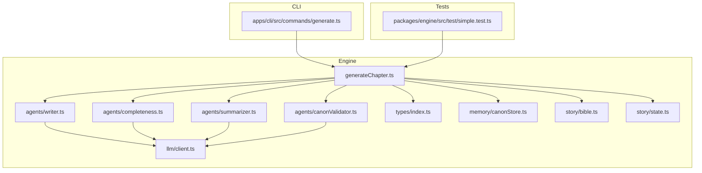
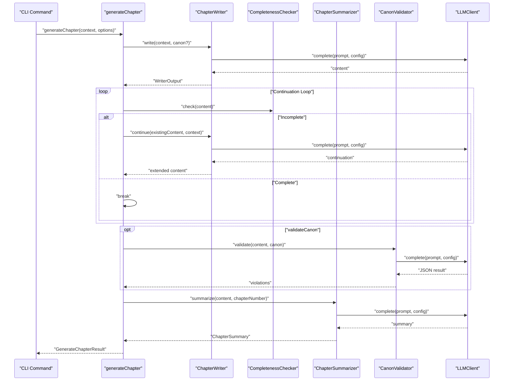
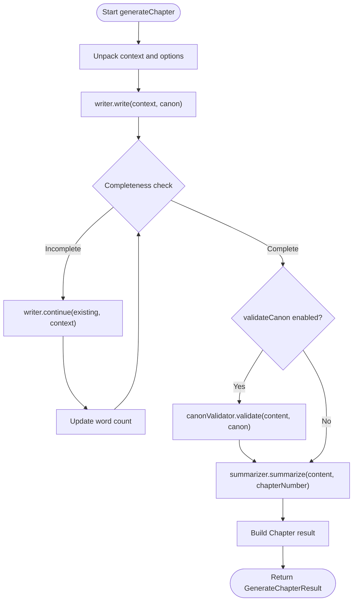
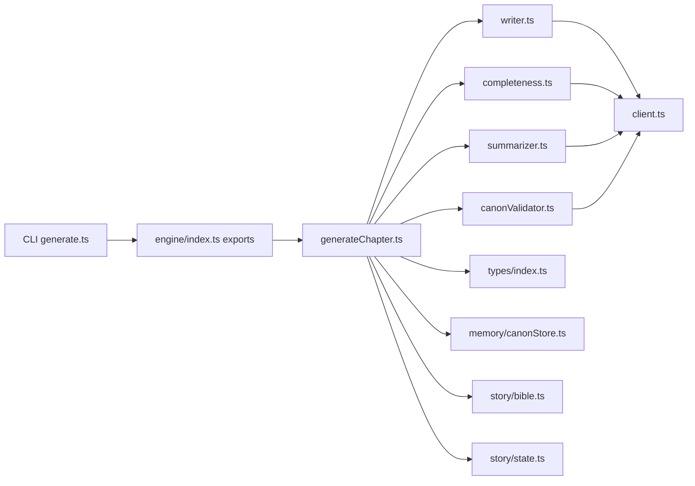

# Generation Pipeline

<cite>
**Referenced Files in This Document**
- [generateChapter.ts](file://packages/engine/src/pipeline/generateChapter.ts)
- [writer.ts](file://packages/engine/src/agents/writer.ts)
- [completeness.ts](file://packages/engine/src/agents/completeness.ts)
- [summarizer.ts](file://packages/engine/src/agents/summarizer.ts)
- [canonValidator.ts](file://packages/engine/src/agents/canonValidator.ts)
- [client.ts](file://packages/engine/src/llm/client.ts)
- [index.ts](file://packages/engine/src/index.ts)
- [types/index.ts](file://packages/engine/src/types/index.ts)
- [canonStore.ts](file://packages/engine/src/memory/canonStore.ts)
- [bible.ts](file://packages/engine/src/story/bible.ts)
- [state.ts](file://packages/engine/src/story/state.ts)
- [generate.ts](file://apps/cli/src/commands/generate.ts)
- [simple.test.ts](file://packages/engine/src/test/simple.test.ts)
</cite>

## Table of Contents
1. [Introduction](#introduction)
2. [Project Structure](#project-structure)
3. [Core Components](#core-components)
4. [Architecture Overview](#architecture-overview)
5. [Detailed Component Analysis](#detailed-component-analysis)
6. [Dependency Analysis](#dependency-analysis)
7. [Performance Considerations](#performance-considerations)
8. [Troubleshooting Guide](#troubleshooting-guide)
9. [Conclusion](#conclusion)
10. [Appendices](#appendices)

## Introduction
This document describes the chapter generation pipeline that orchestrates AI-powered story creation. It focuses on the generateChapter function workflow, step-by-step processing stages, and integration with specialized agents. The pipeline architecture covers input validation, context preparation, agent coordination, and output synthesis. It also documents the GenerateChapterOptions interface, result structures, error handling mechanisms, and practical guidance for configuration, performance monitoring, extensibility, and debugging.

## Project Structure
The generation pipeline resides in the engine package and integrates tightly with story metadata, memory stores, and LLM providers. The CLI demonstrates end-to-end usage, while tests provide minimal reproducible examples.

**Diagram sources**
- [generateChapter.ts](file://packages/engine/src/pipeline/generateChapter.ts#L1-L76)
- [writer.ts](file://packages/engine/src/agents/writer.ts#L1-L146)
- [completeness.ts](file://packages/engine/src/agents/completeness.ts#L1-L56)
- [summarizer.ts](file://packages/engine/src/agents/summarizer.ts#L1-L64)
- [canonValidator.ts](file://packages/engine/src/agents/canonValidator.ts#L1-L59)
- [client.ts](file://packages/engine/src/llm/client.ts#L1-L106)
- [types/index.ts](file://packages/engine/src/types/index.ts#L1-L90)
- [canonStore.ts](file://packages/engine/src/memory/canonStore.ts#L1-L134)
- [bible.ts](file://packages/engine/src/story/bible.ts#L1-L73)
- [state.ts](file://packages/engine/src/story/state.ts#L1-L30)
- [generate.ts](file://apps/cli/src/commands/generate.ts#L1-L55)
- [simple.test.ts](file://packages/engine/src/test/simple.test.ts#L1-L73)

**Section sources**
- [index.ts](file://packages/engine/src/index.ts#L1-L23)
- [generate.ts](file://apps/cli/src/commands/generate.ts#L1-L55)
- [simple.test.ts](file://packages/engine/src/test/simple.test.ts#L1-L73)

## Core Components
- generateChapter: Orchestrates the end-to-end generation loop, coordinating writer, completeness checker, optional canon validation, and summarizer.
- Writer agent: Generates or continues chapter content using a structured prompt with story context and target word count.
- Completeness checker: Evaluates whether the chapter ends at a natural stopping point.
- Summarizer: Produces a concise chapter summary and extracts key events.
- Canon validator: Validates chapter content against stored canonical facts and reports violations.
- LLM client: Provides unified access to configured LLM providers (OpenAI, DeepSeek) with configurable models and token limits.
- Types: Defines GenerationContext, Chapter, ChapterSummary, and related structures used across the pipeline.
- Memory: CanonStore manages canonical facts and formats them for prompts.
- Story utilities: Create and update story metadata and state.

**Section sources**
- [generateChapter.ts](file://packages/engine/src/pipeline/generateChapter.ts#L8-L76)
- [writer.ts](file://packages/engine/src/agents/writer.ts#L48-L146)
- [completeness.ts](file://packages/engine/src/agents/completeness.ts#L30-L56)
- [summarizer.ts](file://packages/engine/src/agents/summarizer.ts#L17-L64)
- [canonValidator.ts](file://packages/engine/src/agents/canonValidator.ts#L31-L59)
- [client.ts](file://packages/engine/src/llm/client.ts#L31-L106)
- [types/index.ts](file://packages/engine/src/types/index.ts#L60-L90)
- [canonStore.ts](file://packages/engine/src/memory/canonStore.ts#L12-L134)
- [bible.ts](file://packages/engine/src/story/bible.ts#L3-L73)
- [state.ts](file://packages/engine/src/story/state.ts#L3-L30)

## Architecture Overview
The pipeline is a staged workflow that iteratively improves content quality and ensures adherence to story constraints.

**Diagram sources**
- [generateChapter.ts](file://packages/engine/src/pipeline/generateChapter.ts#L20-L71)
- [writer.ts](file://packages/engine/src/agents/writer.ts#L55-L117)
- [completeness.ts](file://packages/engine/src/agents/completeness.ts#L37-L52)
- [summarizer.ts](file://packages/engine/src/agents/summarizer.ts#L24-L38)
- [canonValidator.ts](file://packages/engine/src/agents/canonValidator.ts#L32-L55)
- [client.ts](file://packages/engine/src/llm/client.ts#L78-L95)

## Detailed Component Analysis

### GenerateChapter Workflow
The generateChapter function coordinates the following stages:
- Input unpacking and defaults: Extracts context and applies default options.
- Initial writing: Calls the writer to produce the first draft.
- Continuation loop: Repeatedly checks completeness and continues until satisfied or attempts exhausted.
- Optional canon validation: Validates against canonical facts and collects violations.
- Summary generation: Produces a concise chapter summary and key events.
- Output synthesis: Builds the Chapter result with metadata and timestamps.

**Diagram sources**
- [generateChapter.ts](file://packages/engine/src/pipeline/generateChapter.ts#L20-L71)

**Section sources**
- [generateChapter.ts](file://packages/engine/src/pipeline/generateChapter.ts#L20-L76)

### Writer Agent
Responsibilities:
- Assemble a structured prompt from StoryBible, StoryState, and optional CanonStore.
- Infer chapter goal based on story progress.
- Call LLM to generate initial content and compute word count.
- Provide continuation capability to extend existing content.

Key behaviors:
- Prompt templating with placeholders for story metadata, recent summaries, and chapter goal.
- Extraction of title from content header lines.
- Temperature and token limits tuned for creative writing.

**Section sources**
- [writer.ts](file://packages/engine/src/agents/writer.ts#L48-L146)

### Completeness Checker
Responsibilities:
- Determine whether the chapter ends at a natural stopping point.
- Return a binary assessment suitable for loop control.

Key behaviors:
- Minimal instruction set to return a single classification token.
- Normalization to handle minor variations in LLM output.

**Section sources**
- [completeness.ts](file://packages/engine/src/agents/completeness.ts#L30-L56)

### Summarizer
Responsibilities:
- Produce a concise chapter summary under a token budget.
- Extract key events by scanning sentence boundaries and heuristics.

Key behaviors:
- Heuristic detection of event-triggering verbs to select representative sentences.
- Fixed chapter number association for downstream state updates.

**Section sources**
- [summarizer.ts](file://packages/engine/src/agents/summarizer.ts#L17-L64)

### Canon Validator
Responsibilities:
- Validate chapter content against canonical facts.
- Report violations as a list of descriptions.

Key behaviors:
- JSON parsing with fallback to safe defaults when parsing fails.
- Truncation of long content to limit prompt size.

**Section sources**
- [canonValidator.ts](file://packages/engine/src/agents/canonValidator.ts#L31-L59)

### LLM Client
Responsibilities:
- Provide a unified interface to configured LLM providers.
- Support multiple providers with environment-driven configuration.
- Offer JSON parsing helper with strict validation.

Key behaviors:
- Provider selection via environment variables.
- Default configuration with overrides per call.
- Strict JSON parsing with helpful error messages.

**Section sources**
- [client.ts](file://packages/engine/src/llm/client.ts#L31-L106)

### Types and Data Structures
Core types used by the pipeline:
- GenerationContext: Story metadata, state, chapter number, and optional target word count.
- Chapter: Final chapter entity with computed metadata.
- ChapterSummary: Summary plus key events extracted from content.
- WriterOutput: Intermediate output from writer with content, title, and word count.
- GenerateChapterResult: Aggregated result including chapter, summary, and violations.
- GenerateChapterOptions: Controls optional canon validation and continuation attempts.

**Section sources**
- [types/index.ts](file://packages/engine/src/types/index.ts#L33-L90)

### Memory and Story Utilities
- CanonStore: Manages canonical facts and formats them for prompts.
- StoryBible: Creates and enriches story metadata.
- StoryState: Tracks progress and updates state after each chapter.

**Section sources**
- [canonStore.ts](file://packages/engine/src/memory/canonStore.ts#L12-L134)
- [bible.ts](file://packages/engine/src/story/bible.ts#L3-L73)
- [state.ts](file://packages/engine/src/story/state.ts#L3-L30)

### CLI Integration and Example Execution
The CLI demonstrates end-to-end usage:
- Loads story data and validates progress.
- Constructs GenerationContext with target word count.
- Invokes generateChapter, updates state, and persists results.
- Prints progress and next steps.

**Section sources**
- [generate.ts](file://apps/cli/src/commands/generate.ts#L4-L54)

### Test Execution Pattern
The test script demonstrates minimal configuration and execution:
- Sets environment variables for provider and model.
- Creates a small story, state, and canonical store.
- Calls generateChapter and logs results.

**Section sources**
- [simple.test.ts](file://packages/engine/src/test/simple.test.ts#L5-L73)

## Dependency Analysis
The pipeline exhibits clear separation of concerns:
- generateChapter depends on agents and types.
- Agents depend on LLM client and shared types.
- CLI and tests depend on exported APIs from the engine index.

**Diagram sources**
- [index.ts](file://packages/engine/src/index.ts#L1-L23)
- [generateChapter.ts](file://packages/engine/src/pipeline/generateChapter.ts#L1-L7)
- [writer.ts](file://packages/engine/src/agents/writer.ts#L1-L4)
- [completeness.ts](file://packages/engine/src/agents/completeness.ts#L1-L2)
- [summarizer.ts](file://packages/engine/src/agents/summarizer.ts#L1-L2)
- [canonValidator.ts](file://packages/engine/src/agents/canonValidator.ts#L1-L2)
- [client.ts](file://packages/engine/src/llm/client.ts#L1-L2)
- [types/index.ts](file://packages/engine/src/types/index.ts#L1-L90)
- [canonStore.ts](file://packages/engine/src/memory/canonStore.ts#L1-L2)
- [bible.ts](file://packages/engine/src/story/bible.ts#L1-L2)
- [state.ts](file://packages/engine/src/story/state.ts#L1-L2)
- [generate.ts](file://apps/cli/src/commands/generate.ts#L1-L2)

**Section sources**
- [index.ts](file://packages/engine/src/index.ts#L1-L23)

## Performance Considerations
- Token budgets: Each agent sets explicit maxTokens to control cost and latency. Tune these per model and use case.
- Continuation attempts: The loop retries continuation up to a configurable limit. Increase cautiously to avoid excessive LLM calls.
- Word count estimation: Uses a simple split-and-count heuristic; consider more robust tokenization for precise control.
- Provider configuration: Environment variables allow switching providers and models. Ensure adequate quotas and network connectivity.
- Logging: Console logs provide visibility into progress and decisions; consider structured logging for production deployments.

[No sources needed since this section provides general guidance]

## Troubleshooting Guide
Common issues and remedies:
- JSON parsing failures in validators: The validator falls back to safe defaults when JSON parsing fails. Verify prompt formatting and provider response stability.
- Incomplete chapters: The pipeline continues until completion or attempts are exhausted. Adjust target word count or increase maxContinuationAttempts.
- Canon violations: Review reported violations and update canonical facts accordingly. Consider disabling validation temporarily for experimentation.
- Provider misconfiguration: Ensure environment variables for provider and API keys are set correctly. The LLM client throws on unknown providers.
- CLI errors: The CLI exits on failure; inspect logs and environment configuration.

**Section sources**
- [canonValidator.ts](file://packages/engine/src/agents/canonValidator.ts#L49-L55)
- [generateChapter.ts](file://packages/engine/src/pipeline/generateChapter.ts#L32-L43)
- [client.ts](file://packages/engine/src/llm/client.ts#L63-L75)
- [generate.ts](file://apps/cli/src/commands/generate.ts#L50-L53)

## Conclusion
The generation pipeline composes focused agents around a robust orchestration function. It balances creativity with structure by validating content completeness, optionally enforcing canonical consistency, and synthesizing summaries. The modular design enables easy extension, testing, and debugging, while the CLI and tests demonstrate practical usage patterns.

[No sources needed since this section summarizes without analyzing specific files]

## Appendices

### GenerateChapterOptions and Result Structures
- GenerateChapterOptions
  - Fields: canon, validateCanon, maxContinuationAttempts
  - Defaults: validateCanon true, maxContinuationAttempts 3
- GenerateChapterResult
  - Fields: chapter, summary, violations
- GenerationContext
  - Fields: bible, state, chapterNumber, targetWordCount
- Chapter, ChapterSummary
  - Fields: id, storyId, number, title, content, summary, wordCount, generatedAt

**Section sources**
- [generateChapter.ts](file://packages/engine/src/pipeline/generateChapter.ts#L14-L18)
- [generateChapter.ts](file://packages/engine/src/pipeline/generateChapter.ts#L8-L12)
- [types/index.ts](file://packages/engine/src/types/index.ts#L60-L90)

### Parameter Configuration Examples
- CLI usage: The CLI constructs GenerationContext with a target word count and passes the loaded CanonStore via options.
- Test usage: The test script creates a minimal story, state, and canonical store, then invokes generateChapter with options.

**Section sources**
- [generate.ts](file://apps/cli/src/commands/generate.ts#L21-L26)
- [simple.test.ts](file://packages/engine/src/test/simple.test.ts#L48-L53)

### Extensibility and Custom Processing Steps
- Add new agents: Implement a new agent class with a complete() method and export it from the engine index. Integrate into generateChapter similarly to existing agents.
- Modify prompts: Update templates in agent files to refine behavior. Ensure JSON expectations are handled consistently.
- Extend validation: Add new validators by returning structured results compatible with the pipeline’s expectations.
- State updates: Use updateStoryState to incorporate new metadata derived from summaries or validations.

**Section sources**
- [index.ts](file://packages/engine/src/index.ts#L8-L22)
- [state.ts](file://packages/engine/src/story/state.ts#L14-L24)

### Debugging Strategies for Generation Failures
- Enable verbose logging: Inspect console logs emitted during generation and validation.
- Validate environment: Confirm provider configuration and API keys.
- Reduce scope: Use smaller target word counts and fewer continuation attempts to isolate issues.
- Inspect intermediate outputs: Capture WriterOutput and summary results to identify problematic segments.
- Fallback parsing: For JSON-dependent agents, rely on safe fallbacks and review raw LLM responses.

**Section sources**
- [generateChapter.ts](file://packages/engine/src/pipeline/generateChapter.ts#L27-L28)
- [client.ts](file://packages/engine/src/llm/client.ts#L90-L95)