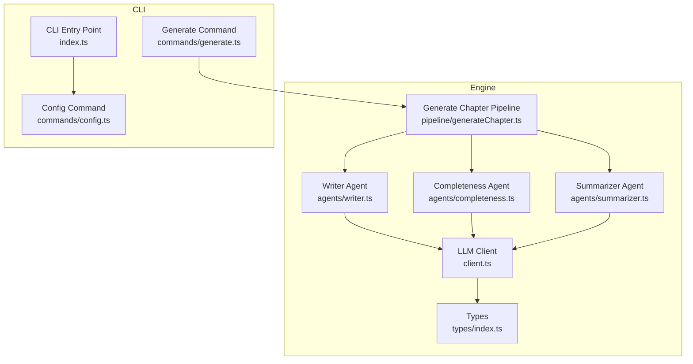
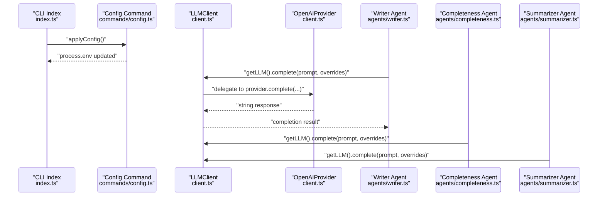
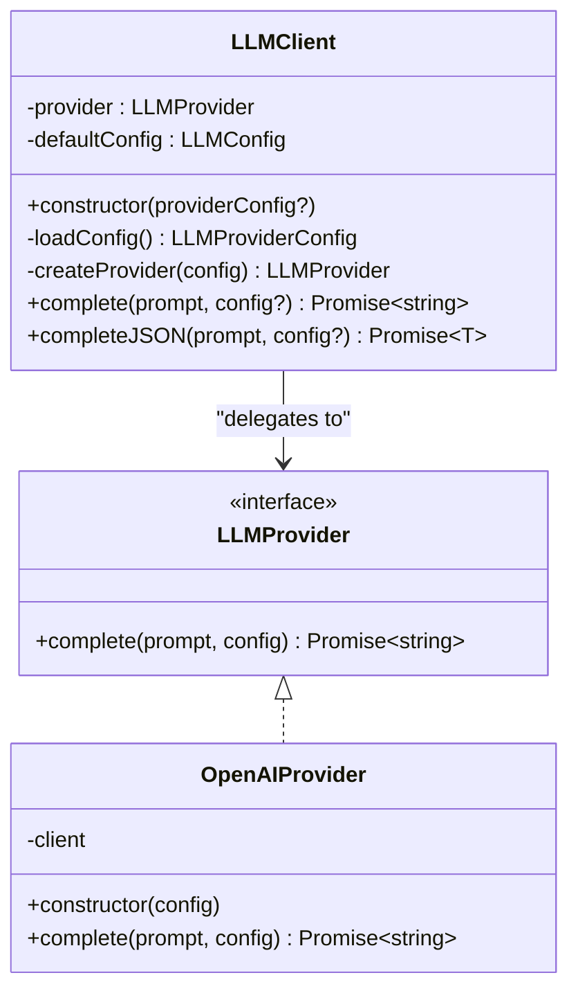
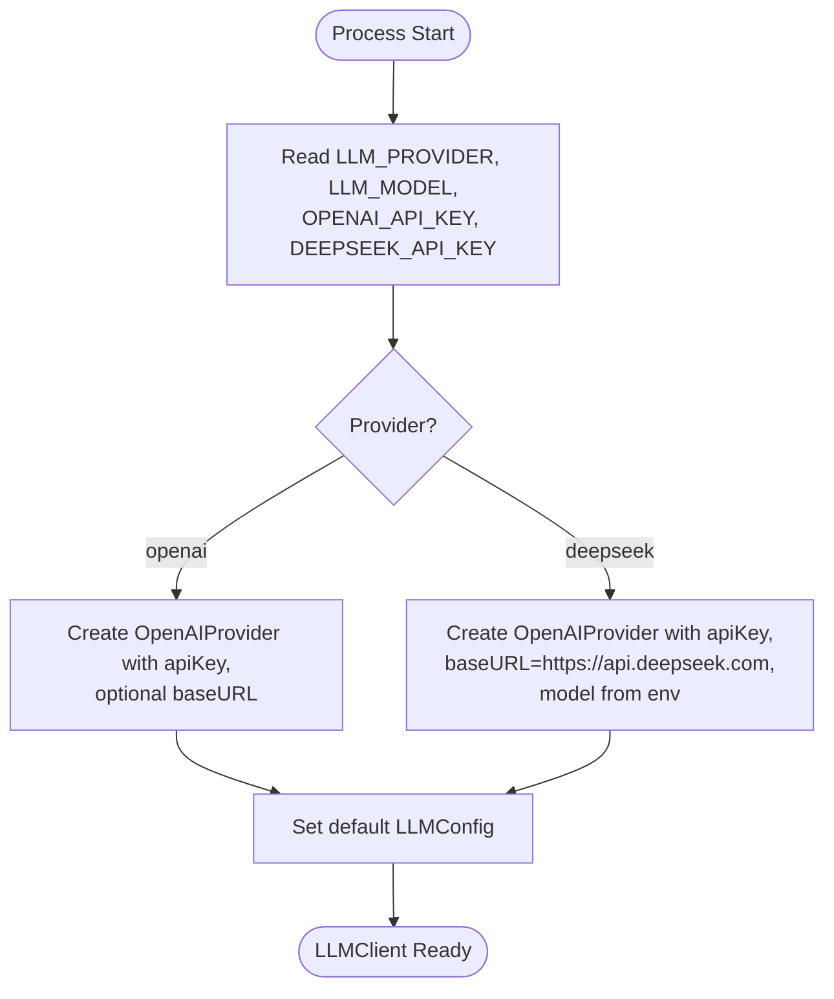
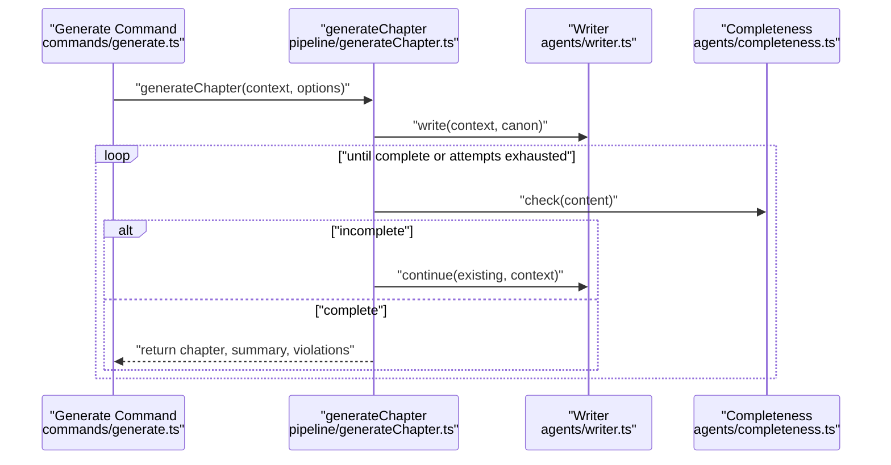
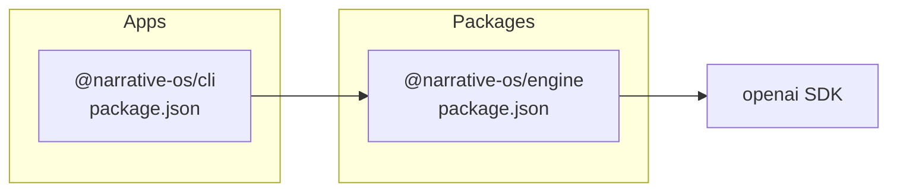

# LLM Integration Layer

<cite>
**Referenced Files in This Document**
- [client.ts](file://packages/engine/src/llm/client.ts)
- [types/index.ts](file://packages/engine/src/types/index.ts)
- [writer.ts](file://packages/engine/src/agents/writer.ts)
- [completeness.ts](file://packages/engine/src/agents/completeness.ts)
- [summarizer.ts](file://packages/engine/src/agents/summarizer.ts)
- [generateChapter.ts](file://packages/engine/src/pipeline/generateChapter.ts)
- [config.ts](file://apps/cli/src/commands/config.ts)
- [index.ts](file://apps/cli/src/index.ts)
- [generate.ts](file://apps/cli/src/commands/generate.ts)
- [package.json (engine)](file://packages/engine/package.json)
- [package.json (cli)](file://apps/cli/package.json)
</cite>

## Table of Contents
1. [Introduction](#introduction)
2. [Project Structure](#project-structure)
3. [Core Components](#core-components)
4. [Architecture Overview](#architecture-overview)
5. [Detailed Component Analysis](#detailed-component-analysis)
6. [Dependency Analysis](#dependency-analysis)
7. [Performance Considerations](#performance-considerations)
8. [Troubleshooting Guide](#troubleshooting-guide)
9. [Conclusion](#conclusion)
10. [Appendices](#appendices)

## Introduction
This document describes the LLM integration layer that abstracts Large Language Model providers within the Narrative OS engine. It explains the provider abstraction pattern, the factory-style configuration-driven instantiation, and the client interface used by agents and pipelines. It also documents configuration management via environment variables and CLI configuration, error handling strategies, and practical guidance for performance, rate limiting, and cost optimization.

## Project Structure
The LLM integration spans three primary areas:
- Engine LLM client and provider abstraction
- Agent modules that consume the LLM client
- CLI configuration and runtime wiring

**Diagram sources**
- [client.ts](file://packages/engine/src/llm/client.ts#L1-L106)
- [types/index.ts](file://packages/engine/src/types/index.ts#L78-L89)
- [writer.ts](file://packages/engine/src/agents/writer.ts#L1-L146)
- [completeness.ts](file://packages/engine/src/agents/completeness.ts#L1-L56)
- [summarizer.ts](file://packages/engine/src/agents/summarizer.ts#L1-L64)
- [generateChapter.ts](file://packages/engine/src/pipeline/generateChapter.ts#L1-L76)
- [config.ts](file://apps/cli/src/commands/config.ts#L1-L84)
- [index.ts](file://apps/cli/src/index.ts#L1-L54)
- [generate.ts](file://apps/cli/src/commands/generate.ts#L1-L55)

**Section sources**
- [client.ts](file://packages/engine/src/llm/client.ts#L1-L106)
- [types/index.ts](file://packages/engine/src/types/index.ts#L78-L89)
- [writer.ts](file://packages/engine/src/agents/writer.ts#L1-L146)
- [completeness.ts](file://packages/engine/src/agents/completeness.ts#L1-L56)
- [summarizer.ts](file://packages/engine/src/agents/summarizer.ts#L1-L64)
- [generateChapter.ts](file://packages/engine/src/pipeline/generateChapter.ts#L1-L76)
- [config.ts](file://apps/cli/src/commands/config.ts#L1-L84)
- [index.ts](file://apps/cli/src/index.ts#L1-L54)
- [generate.ts](file://apps/cli/src/commands/generate.ts#L1-L55)

## Core Components
- LLMProvider interface: Defines the contract for completion requests.
- OpenAIProvider: Implements LLMProvider using the official OpenAI SDK, supporting optional base URL for compatible APIs (e.g., DeepSeek).
- LLMClient: Central facade that loads configuration, selects a provider, merges defaults, and exposes completion methods including a JSON parsing helper.
- Global accessor: Lazy singleton retrieval of the LLM client.

Key responsibilities:
- Provider selection based on environment variables
- Default configuration merging
- JSON response parsing with structured error reporting
- Minimal coupling between agents and providers

**Section sources**
- [client.ts](file://packages/engine/src/llm/client.ts#L4-L29)
- [client.ts](file://packages/engine/src/llm/client.ts#L31-L96)
- [types/index.ts](file://packages/engine/src/types/index.ts#L78-L89)

## Architecture Overview
The LLM integration follows a layered architecture:
- CLI applies configuration to environment variables
- Engine’s LLMClient reads environment variables and instantiates the appropriate provider
- Agents call the LLMClient for completions
- Pipeline orchestrates agent workflows around chapter generation

**Diagram sources**
- [index.ts](file://apps/cli/src/index.ts#L9-L9)
- [config.ts](file://apps/cli/src/commands/config.ts#L72-L82)
- [client.ts](file://packages/engine/src/llm/client.ts#L31-L96)
- [writer.ts](file://packages/engine/src/agents/writer.ts#L85-L88)
- [completeness.ts](file://packages/engine/src/agents/completeness.ts#L40-L43)
- [summarizer.ts](file://packages/engine/src/agents/summarizer.ts#L27-L30)

## Detailed Component Analysis

### LLMClient and Provider Abstraction
- LLMProvider defines a single method for generating text from a prompt with optional configuration.
- OpenAIProvider encapsulates the OpenAI SDK client, supports a configurable base URL for compatible providers, and forwards model, temperature, and max tokens.
- LLMClient:
  - Loads configuration from environment variables
  - Creates provider instances based on provider name
  - Merges default configuration with per-call overrides
  - Exposes complete and completeJSON helpers
- Singleton accessor ensures a single shared client instance.

**Diagram sources**
- [client.ts](file://packages/engine/src/llm/client.ts#L4-L29)
- [client.ts](file://packages/engine/src/llm/client.ts#L31-L96)
- [types/index.ts](file://packages/engine/src/types/index.ts#L78-L89)

**Section sources**
- [client.ts](file://packages/engine/src/llm/client.ts#L4-L29)
- [client.ts](file://packages/engine/src/llm/client.ts#L31-L96)
- [types/index.ts](file://packages/engine/src/types/index.ts#L78-L89)

### Configuration Management and Factory Pattern
- Environment-driven configuration:
  - LLM_PROVIDER selects provider ("openai" or "deepseek")
  - OPENAI_API_KEY and DEEPSEEK_API_KEY supply credentials
  - LLM_MODEL sets the default model
  - Optional baseURL for providers like DeepSeek
- Factory-style creation:
  - LLMClient.loadConfig chooses provider and constructs a provider-specific config
  - LLMClient.createProvider maps provider name to implementation
- CLI configuration:
  - Interactive config saves provider, model, and API key to a local JSON file
  - applyConfig injects environment variables before CLI starts

**Diagram sources**
- [client.ts](file://packages/engine/src/llm/client.ts#L46-L76)
- [config.ts](file://apps/cli/src/commands/config.ts#L72-L82)

**Section sources**
- [client.ts](file://packages/engine/src/llm/client.ts#L46-L76)
- [config.ts](file://apps/cli/src/commands/config.ts#L24-L82)

### Client Interface, Method Signatures, and Usage
- LLMClient.complete(prompt, config?): Returns raw text completion.
- LLMClient.completeJSON<T>(prompt, config?): Returns parsed JSON with robust error reporting on parse failure.
- Agents call getLLM() to obtain the singleton client and pass provider-specific overrides (e.g., temperature, maxTokens).

Example usage locations:
- Writer agent: requests a full chapter and continuation
- Completeness agent: checks if a chapter ends naturally
- Summarizer agent: produces concise summaries

**Section sources**
- [client.ts](file://packages/engine/src/llm/client.ts#L78-L95)
- [writer.ts](file://packages/engine/src/agents/writer.ts#L85-L114)
- [completeness.ts](file://packages/engine/src/agents/completeness.ts#L40-L43)
- [summarizer.ts](file://packages/engine/src/agents/summarizer.ts#L27-L30)

### Pipeline Orchestration and Fallback Mechanisms
- The generateChapter pipeline:
  - Writes initial content with the writer agent
  - Iteratively continues until completeness criteria are met (with a bounded retry limit)
  - Optionally validates against canon and summarizes the chapter
- No explicit fallback provider is implemented in code; failures surface as thrown errors.

**Diagram sources**
- [generate.ts](file://apps/cli/src/commands/generate.ts#L28-L53)
- [generateChapter.ts](file://packages/engine/src/pipeline/generateChapter.ts#L20-L71)
- [writer.ts](file://packages/engine/src/agents/writer.ts#L55-L117)
- [completeness.ts](file://packages/engine/src/agents/completeness.ts#L37-L52)

**Section sources**
- [generateChapter.ts](file://packages/engine/src/pipeline/generateChapter.ts#L1-L76)
- [generate.ts](file://apps/cli/src/commands/generate.ts#L1-L55)

## Dependency Analysis
- Runtime dependencies:
  - Engine depends on the OpenAI SDK for chat completions
  - CLI depends on the Engine package and inquirer for interactive configuration
- Internal dependencies:
  - Agents depend on the LLM client via the global accessor
  - Pipeline composes agents and orchestrates their calls

**Diagram sources**
- [package.json (cli)](file://apps/cli/package.json#L12-L16)
- [package.json (engine)](file://packages/engine/package.json#L11-L14)

**Section sources**
- [package.json (cli)](file://apps/cli/package.json#L12-L16)
- [package.json (engine)](file://packages/engine/package.json#L11-L14)

## Performance Considerations
- Token limits and cost control:
  - Use smaller maxTokens for tasks that require concise outputs (e.g., summarization)
  - Lower temperature reduces randomness and can improve consistency
- Throughput and batching:
  - Current implementation performs synchronous calls; consider introducing concurrency limits and backoff for rate-limited providers
- Model selection:
  - Prefer cheaper or faster models for intermediate steps (e.g., summarization) and reserve higher-capability models for creative writing
- Caching:
  - Cache repeated prompts or canonical segments to reduce token usage
- Logging and monitoring:
  - Track token usage per request and aggregate costs per story or session

[No sources needed since this section provides general guidance]

## Troubleshooting Guide
Common issues and resolutions:
- Unknown provider error:
  - Occurs when LLM_PROVIDER is not set to supported values; ensure environment variable is configured or CLI config is applied
- Missing API key:
  - OPENAI_API_KEY or DEEPSEEK_API_KEY must be present; verify environment variables after applying CLI config
- JSON parsing failures:
  - completeJSON throws when the response is not valid JSON; ensure prompts explicitly request JSON-only responses
- Rate limiting and quota exhaustion:
  - Implement retries with exponential backoff and consider switching to a lower-cost model for heavy workloads
- Incorrect model or base URL:
  - Verify LLM_MODEL and provider-specific base URL; DeepSeek requires a specific base URL

Operational hooks:
- CLI config command writes provider, model, and API key to a local JSON file and applies environment variables at startup
- Pipeline retries until content is marked complete, preventing partial chapters from being saved

**Section sources**
- [client.ts](file://packages/engine/src/llm/client.ts#L63-L65)
- [client.ts](file://packages/engine/src/llm/client.ts#L92-L94)
- [config.ts](file://apps/cli/src/commands/config.ts#L72-L82)
- [generateChapter.ts](file://packages/engine/src/pipeline/generateChapter.ts#L32-L43)

## Conclusion
The LLM integration layer cleanly separates provider concerns behind a simple interface and a factory-style configuration loader. The LLMClient offers a unified API for text and structured JSON responses, while agents and pipelines remain provider-agnostic. The CLI enables easy configuration and environment propagation. Extending support to additional providers involves adding a new provider class and updating the factory, preserving the existing interface and configuration patterns.

[No sources needed since this section summarizes without analyzing specific files]

## Appendices

### Provider Setup Examples
- OpenAI setup:
  - Set provider to openai
  - Provide OPENAI_API_KEY
  - Optionally set LLM_MODEL to a supported OpenAI model
- DeepSeek setup:
  - Set provider to deepseek
  - Provide DEEPSEEK_API_KEY
  - LLM_MODEL defaults to a compatible DeepSeek model; baseURL is set automatically

**Section sources**
- [client.ts](file://packages/engine/src/llm/client.ts#L49-L65)
- [config.ts](file://apps/cli/src/commands/config.ts#L72-L82)

### API Key Management Best Practices
- Store keys securely in environment variables or secret managers
- Scope keys to least privilege and monitor usage
- Rotate keys regularly and invalidate old ones

[No sources needed since this section provides general guidance]

### Error Handling Strategies
- Centralized JSON parsing error reporting with truncated response previews
- Explicit unknown provider detection during client initialization
- Pipeline-level retry loops for content completeness

**Section sources**
- [client.ts](file://packages/engine/src/llm/client.ts#L92-L94)
- [client.ts](file://packages/engine/src/llm/client.ts#L63-L65)
- [generateChapter.ts](file://packages/engine/src/pipeline/generateChapter.ts#L32-L43)