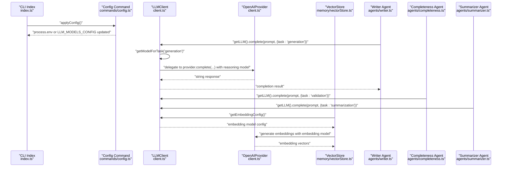
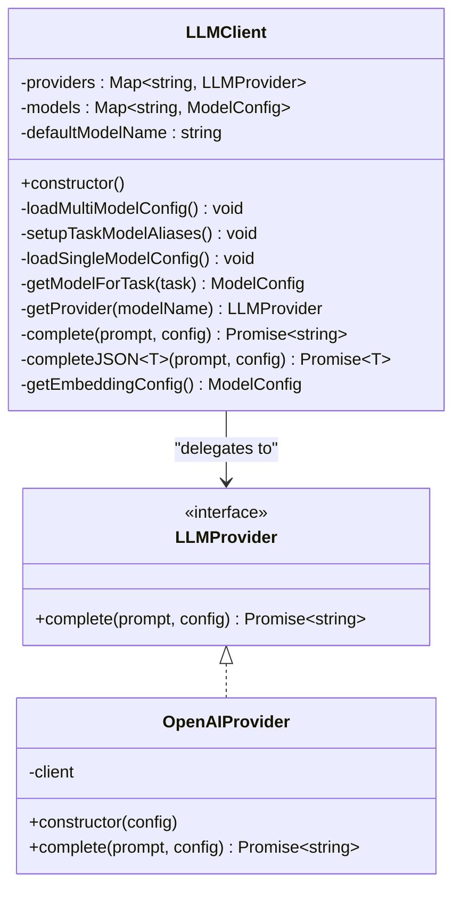
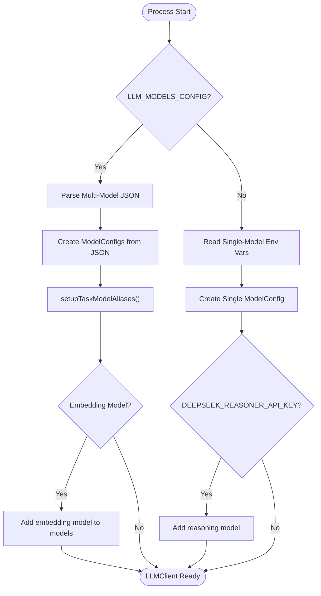
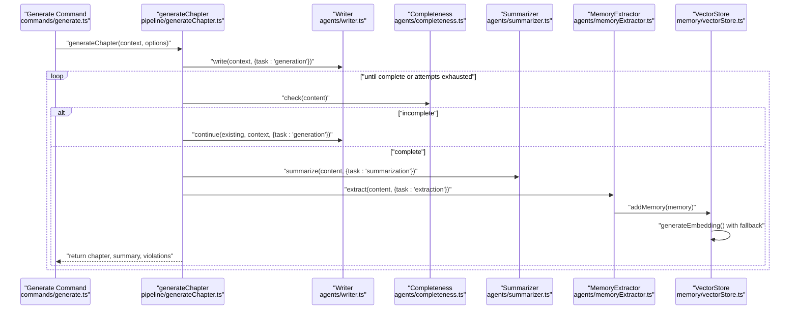
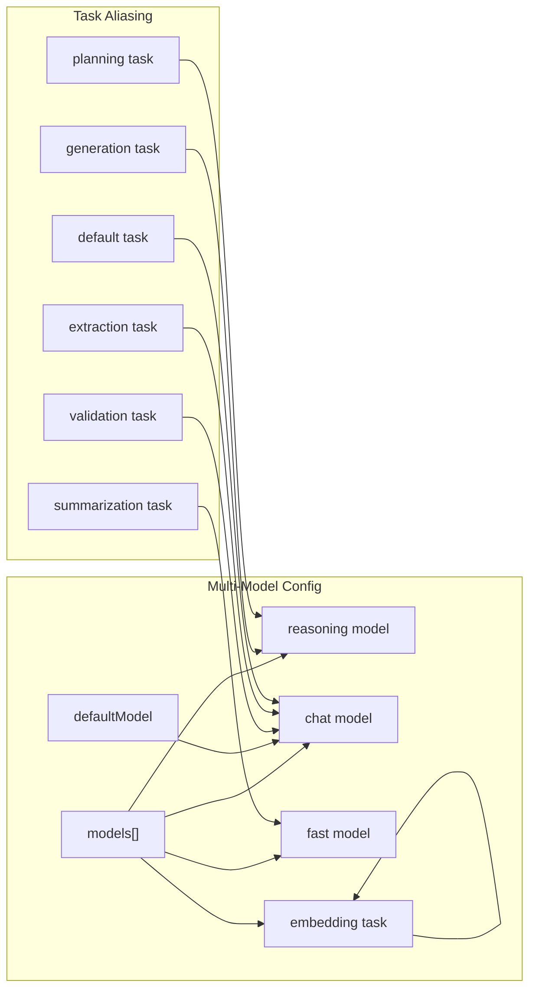
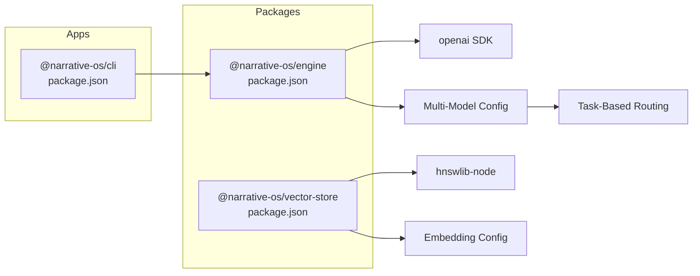

# LLM Integration Layer

<cite>
**Referenced Files in This Document**
- [client.ts](file://packages/engine/src/llm/client.ts)
- [types/index.ts](file://packages/engine/src/types/index.ts)
- [writer.ts](file://packages/engine/src/agents/writer.ts)
- [completeness.ts](file://packages/engine/src/agents/completeness.ts)
- [summarizer.ts](file://packages/engine/src/agents/summarizer.ts)
- [memoryExtractor.ts](file://packages/engine/src/agents/memoryExtractor.ts)
- [vectorStore.ts](file://packages/engine/src/memory/vectorStore.ts)
- [generateChapter.ts](file://packages/engine/src/pipeline/generateChapter.ts)
- [config.ts](file://apps/cli/src/commands/config.ts)
- [index.ts](file://apps/cli/src/index.ts)
- [generate.ts](file://apps/cli/src/commands/generate.ts)
- [package.json (engine)](file://packages/engine/package.json)
- [package.json (cli)](file://apps/cli/package.json)
</cite>

## Update Summary
**Changes Made**
- Enhanced LLM client with JSON truncation detection in completeJSON method
- Added comprehensive error handling for JSON parsing failures with truncated response previews
- Implemented dual-provider embedding support with dedicated embedding model configuration
- Expanded task-based model routing system with embedding task type
- Improved model aliasing system for seamless task-based routing across all provider types
- Added getEmbeddingConfig method for vector store integration
- Enhanced CLI configuration with embedding task support

## Table of Contents
1. [Introduction](#introduction)
2. [Project Structure](#project-structure)
3. [Core Components](#core-components)
4. [Architecture Overview](#architecture-overview)
5. [Detailed Component Analysis](#detailed-component-analysis)
6. [Multi-Model Configuration](#multi-model-configuration)
7. [Task-Based Model Routing](#task-based-model-routing)
8. [Enhanced JSON Processing and Error Handling](#enhanced-json-processing-and-error-handling)
9. [Dual-Provider Embedding Support](#dual-provider-embedding-support)
10. [Dependency Analysis](#dependency-analysis)
11. [Performance Considerations](#performance-considerations)
12. [Troubleshooting Guide](#troubleshooting-guide)
13. [Conclusion](#conclusion)
14. [Appendices](#appendices)

## Introduction
This document describes the LLM integration layer that abstracts Large Language Model providers within the Narrative OS engine. The system has been significantly enhanced with multi-model configuration support, task-based model routing capabilities, JSON truncation detection, and dual-provider embedding support. The enhanced system now provides intelligent model selection based on task requirements, robust error handling for JSON parsing, and comprehensive embedding support for vector memory storage.

## Project Structure
The LLM integration spans three primary areas:
- Engine LLM client and provider abstraction with multi-model support and enhanced JSON processing
- Agent modules that consume the LLM client with task-based model routing including embedding tasks
- CLI configuration and runtime wiring for both single-model and multi-model setups with embedding support
- Vector store integration with dual-provider embedding capabilities

```mermaid
graph TB
subgraph "Engine"
C["LLM Client<br/>client.ts"]
T["Types<br/>types/index.ts"]
W["Writer Agent<br/>agents/writer.ts"]
CC["Completeness Agent<br/>agents/completeness.ts"]
S["Summarizer Agent<br/>agents/summarizer.ts"]
ME["Memory Extractor<br/>agents/memoryExtractor.ts"]
VS["Vector Store<br/>memory/vectorStore.ts"]
GC["Generate Chapter Pipeline<br/>pipeline/generateChapter.ts"]
END
subgraph "CLI"
CFG["Config Command<br/>commands/config.ts"]
IDX["CLI Entry Point<br/>index.ts"]
GEN["Generate Command<br/>commands/generate.ts"]
END
IDX --> CFG
GEN --> GC
GC --> W
GC --> CC
GC --> S
GC --> ME
W --> C
CC --> C
S --> C
ME --> C
VS --> C
C --> T
```

**Diagram sources**
- [client.ts:1-257](file://packages/engine/src/llm/client.ts#L1-L257)
- [types/index.ts:79-152](file://packages/engine/src/types/index.ts#L79-L152)
- [writer.ts:1-176](file://packages/engine/src/agents/writer.ts#L1-L176)
- [completeness.ts:1-56](file://packages/engine/src/agents/completeness.ts#L1-L56)
- [summarizer.ts:1-65](file://packages/engine/src/agents/summarizer.ts#L1-L65)
- [memoryExtractor.ts:1-99](file://packages/engine/src/agents/memoryExtractor.ts#L1-L99)
- [vectorStore.ts:1-262](file://packages/engine/src/memory/vectorStore.ts#L1-L262)
- [generateChapter.ts:1-290](file://packages/engine/src/pipeline/generateChapter.ts#L1-L290)
- [config.ts:1-377](file://apps/cli/src/commands/config.ts#L1-L377)
- [index.ts:1-54](file://apps/cli/src/index.ts#L1-L54)
- [generate.ts:1-55](file://apps/cli/src/commands/generate.ts#L1-L55)

**Section sources**
- [client.ts:1-257](file://packages/engine/src/llm/client.ts#L1-L257)
- [types/index.ts:79-152](file://packages/engine/src/types/index.ts#L79-L152)
- [writer.ts:1-176](file://packages/engine/src/agents/writer.ts#L1-L176)
- [completeness.ts:1-56](file://packages/engine/src/agents/completeness.ts#L1-L56)
- [summarizer.ts:1-65](file://packages/engine/src/agents/summarizer.ts#L1-L65)
- [memoryExtractor.ts:1-99](file://packages/engine/src/agents/memoryExtractor.ts#L1-L99)
- [vectorStore.ts:1-262](file://packages/engine/src/memory/vectorStore.ts#L1-L262)
- [generateChapter.ts:1-290](file://packages/engine/src/pipeline/generateChapter.ts#L1-L290)
- [config.ts:1-377](file://apps/cli/src/commands/config.ts#L1-L377)
- [index.ts:1-54](file://apps/cli/src/index.ts#L1-L54)
- [generate.ts:1-55](file://apps/cli/src/commands/generate.ts#L1-L55)

## Core Components
- LLMProvider interface: Defines the contract for completion requests.
- OpenAIProvider: Implements LLMProvider using the official OpenAI SDK, supporting optional base URL for compatible APIs (e.g., DeepSeek).
- LLMClient: Central facade that loads configuration (single or multi-model), selects appropriate models based on task types, merges defaults, and exposes completion methods including enhanced JSON parsing with truncation detection.
- Global accessor: Lazy singleton retrieval of the LLM client.
- VectorStore: Integrates with LLM client to provide dual-provider embedding support with fallback mechanisms.

Key responsibilities:
- Provider selection based on environment variables or multi-model configuration
- Automatic model aliasing for task-based routing (generation, validation, summarization, extraction, embedding)
- Default configuration merging
- Enhanced JSON response parsing with structured error reporting and truncation detection
- Support for multiple model purposes: reasoning, chat, fast, and embedding
- Dual-provider embedding support with fallback to mock embeddings
- Minimal coupling between agents and providers

**Section sources**
- [client.ts:4-6](file://packages/engine/src/llm/client.ts#L4-L6)
- [client.ts:8-37](file://packages/engine/src/llm/client.ts#L8-L37)
- [client.ts:50-247](file://packages/engine/src/llm/client.ts#L50-L247)
- [types/index.ts:93-116](file://packages/engine/src/types/index.ts#L93-L116)
- [vectorStore.ts:145-198](file://packages/engine/src/memory/vectorStore.ts#L145-L198)

## Architecture Overview
The LLM integration follows a layered architecture with enhanced multi-model support and dual-provider embedding capabilities:
- CLI applies configuration to environment variables or JSON configuration including embedding tasks
- Engine's LLMClient reads configuration and instantiates appropriate providers with embedding model support
- Agents call the LLMClient with task types for automatic model selection including embedding tasks
- VectorStore integrates with LLM client to provide dual-provider embedding support
- Pipeline orchestrates agent workflows around chapter generation with task-based routing and embedding integration



**Diagram sources**
- [index.ts:9-9](file://apps/cli/src/index.ts#L9-L9)
- [config.ts:274-284](file://apps/cli/src/commands/config.ts#L274-L284)
- [client.ts:59-82](file://packages/engine/src/llm/client.ts#L59-L82)
- [client.ts:152-164](file://packages/engine/src/llm/client.ts#L152-L164)
- [client.ts:238-246](file://packages/engine/src/llm/client.ts#L238-L246)
- [writer.ts:113-117](file://packages/engine/src/agents/writer.ts#L113-L117)
- [completeness.ts:40-43](file://packages/engine/src/agents/completeness.ts#L40-L43)
- [summarizer.ts:27-31](file://packages/engine/src/agents/summarizer.ts#L27-L31)
- [vectorStore.ts:151-175](file://packages/engine/src/memory/vectorStore.ts#L151-L175)

## Detailed Component Analysis

### LLMClient and Provider Abstraction
- LLMProvider defines a single method for generating text from a prompt with optional configuration.
- OpenAIProvider encapsulates the OpenAI SDK client, supports a configurable base URL for compatible providers, and forwards model, temperature, and max tokens.
- LLMClient:
  - Loads configuration from environment variables or multi-model JSON configuration
  - Creates provider instances based on provider name
  - Supports both single-model and multi-model configurations
  - Merges default configuration with per-call overrides
  - Exposes complete and enhanced completeJSON helpers with task-based model routing and truncation detection
  - Provides getEmbeddingConfig method for vector store integration
- Singleton accessor ensures a single shared client instance.



**Diagram sources**
- [client.ts:4-6](file://packages/engine/src/llm/client.ts#L4-L6)
- [client.ts:8-37](file://packages/engine/src/llm/client.ts#L8-L37)
- [client.ts:50-247](file://packages/engine/src/llm/client.ts#L50-L247)
- [types/index.ts:93-116](file://packages/engine/src/types/index.ts#L93-L116)

**Section sources**
- [client.ts:4-6](file://packages/engine/src/llm/client.ts#L4-L6)
- [client.ts:8-37](file://packages/engine/src/llm/client.ts#L8-L37)
- [client.ts:50-247](file://packages/engine/src/llm/client.ts#L50-L247)
- [types/index.ts:93-116](file://packages/engine/src/types/index.ts#L93-L116)

### Configuration Management and Factory Pattern
- Environment-driven configuration:
  - Single model: LLM_PROVIDER, LLM_MODEL, OPENAI_API_KEY, DEEPSEEK_API_KEY
  - Multi-model: LLM_MODELS_CONFIG JSON containing models array and defaultModel
  - Optional baseURL for providers like DeepSeek
  - Embedding task configuration for dual-provider support
- Factory-style creation:
  - LLMClient.loadMultiModelConfig chooses between single and multi-model configuration
  - LLMClient.createProvider maps provider name to implementation
  - setupTaskModelAliases creates model aliases for task-based routing including embedding
- CLI configuration:
  - Interactive config saves provider, models, and API keys to a local JSON file
  - applyConfig injects environment variables or multi-model JSON before CLI starts
  - Supports embedding task configuration with provider-specific models



**Diagram sources**
- [client.ts:59-82](file://packages/engine/src/llm/client.ts#L59-L82)
- [client.ts:84-150](file://packages/engine/src/llm/client.ts#L84-L150)
- [config.ts:274-284](file://apps/cli/src/commands/config.ts#L274-L284)

**Section sources**
- [client.ts:59-82](file://packages/engine/src/llm/client.ts#L59-L82)
- [client.ts:84-150](file://packages/engine/src/llm/client.ts#L84-L150)
- [config.ts:274-284](file://apps/cli/src/commands/config.ts#L274-L284)

### Client Interface, Method Signatures, and Usage
- LLMClient.complete(prompt, config?): Returns raw text completion with optional task parameter.
- LLMClient.completeJSON<T>(prompt, config?): Returns parsed JSON with robust error reporting on parse failure, including truncation detection.
- LLMClient.getEmbeddingConfig(): Returns embedding model configuration for vector store integration.
- Agents call getLLM() to obtain the singleton client and pass task types for automatic model selection.
- Task types include: generation, validation, summarization, extraction, planning, embedding, and default.

Example usage locations:
- Writer agent: requests a full chapter with task: 'generation'
- Completeness agent: checks if a chapter ends naturally
- Summarizer agent: produces concise summaries with task: 'summarization'
- Memory extractor: extracts narrative facts with task: 'extraction'
- Vector store: generates embeddings using embedding model with fallback to mock embeddings

**Section sources**
- [client.ts:174-186](file://packages/engine/src/llm/client.ts#L174-L186)
- [client.ts:188-227](file://packages/engine/src/llm/client.ts#L188-L227)
- [client.ts:238-246](file://packages/engine/src/llm/client.ts#L238-L246)
- [writer.ts:113-117](file://packages/engine/src/agents/writer.ts#L113-L117)
- [summarizer.ts:27-31](file://packages/engine/src/agents/summarizer.ts#L27-L31)
- [memoryExtractor.ts:62-66](file://packages/engine/src/agents/memoryExtractor.ts#L62-L66)
- [vectorStore.ts:151-175](file://packages/engine/src/memory/vectorStore.ts#L151-L175)

### Pipeline Orchestration and Fallback Mechanisms
- The generateChapter pipeline:
  - Uses scene-level generation by default with automatic model selection
  - Writes initial content with the writer agent using generation task
  - Iteratively continues until completeness criteria are met (with a bounded retry limit)
  - Validates against canon using validation task and summarizes the chapter using summarization task
  - Integrates memory extraction with embedding model for vector store population
- Enhanced error handling with fallback mechanisms for JSON parsing and embedding generation
- No explicit fallback provider is implemented in code; failures surface as thrown errors with detailed information



**Diagram sources**
- [generate.ts:28-53](file://apps/cli/src/commands/generate.ts#L28-L53)
- [generateChapter.ts:63-205](file://packages/engine/src/pipeline/generateChapter.ts#L63-L205)
- [writer.ts:70-147](file://packages/engine/src/agents/writer.ts#L70-L147)
- [completeness.ts:37-52](file://packages/engine/src/agents/completeness.ts#L37-L52)
- [summarizer.ts:24-39](file://packages/engine/src/agents/summarizer.ts#L24-L39)
- [memoryExtractor.ts:52-99](file://packages/engine/src/agents/memoryExtractor.ts#L52-L99)
- [vectorStore.ts:77-105](file://packages/engine/src/memory/vectorStore.ts#L77-L105)

**Section sources**
- [generateChapter.ts:1-290](file://packages/engine/src/pipeline/generateChapter.ts#L1-L290)
- [generate.ts:1-55](file://apps/cli/src/commands/generate.ts#L1-L55)

## Multi-Model Configuration
The LLM integration now supports both single-model and multi-model configurations with enhanced embedding support:

### Single-Model Configuration
- Legacy configuration using environment variables
- Supports OpenAI, DeepSeek, Alibaba Cloud, and ByteDance Ark providers
- Automatically creates reasoning model for DeepSeek when DEEPSEEK_REASONER_API_KEY is set

### Multi-Model Configuration
- Modern configuration using LLM_MODELS_CONFIG JSON environment variable
- Supports multiple models with different purposes: reasoning, chat, fast, embedding
- Automatic model aliasing for seamless task-based routing including embedding tasks
- Separate API keys for different providers and purposes
- Embedding model configuration for vector store integration



**Diagram sources**
- [client.ts:59-82](file://packages/engine/src/llm/client.ts#L59-L82)
- [client.ts:84-150](file://packages/engine/src/llm/client.ts#L84-L150)
- [client.ts:84-106](file://packages/engine/src/llm/client.ts#L84-L106)
- [client.ts:152-164](file://packages/engine/src/llm/client.ts#L152-L164)

**Section sources**
- [client.ts:108-150](file://packages/engine/src/llm/client.ts#L108-L150)
- [client.ts:59-82](file://packages/engine/src/llm/client.ts#L59-L82)
- [config.ts:274-284](file://apps/cli/src/commands/config.ts#L274-L284)

## Task-Based Model Routing
The system now supports intelligent model selection based on task requirements with enhanced embedding support:

### Task Type Mapping
- generation: Maps to reasoning model (for complex creative tasks)
- planning: Maps to reasoning model (for planning tasks)
- validation: Maps to chat model (for validation tasks)
- summarization: Maps to fast model (for summarization tasks)
- extraction: Maps to chat model (for extraction tasks)
- embedding: Maps to embedding model (for vector embeddings)
- default: Maps to chat model (fallback)

### Model Purpose Categories
- reasoning: High-complexity reasoning tasks (DeepSeek Reasoner, GPT-4)
- chat: General conversation and writing tasks
- fast: Cost-effective, fast inference for simple tasks
- embedding: Text embedding generation for vector storage

### Implementation Details
- setupTaskModelAliases creates model aliases for each task type
- getModelForTask determines appropriate model based on task mapping
- Automatic fallback to default model if specific purpose not found
- Embedding task routing to dedicated embedding model

**Section sources**
- [client.ts:39-48](file://packages/engine/src/llm/client.ts#L39-L48)
- [client.ts:84-150](file://packages/engine/src/llm/client.ts#L84-L150)
- [client.ts:152-164](file://packages/engine/src/llm/client.ts#L152-L164)
- [types/index.ts:107-116](file://packages/engine/src/types/index.ts#L107-L116)

## Enhanced JSON Processing and Error Handling
The LLM client now includes comprehensive JSON processing with truncation detection and improved error handling:

### JSON Truncation Detection
- The completeJSON method now detects truncated JSON responses by checking if they start with { or [ but don't end properly
- Throws descriptive errors suggesting to increase maxTokens when truncation is detected
- Provides truncated response previews in error messages for debugging

### Enhanced Error Handling
- Robust JSON parsing with structured error reporting
- Support for JSON in markdown code blocks and bare JSON objects/arrays
- Detailed error messages with response previews for debugging
- Temperature reduction to 0.3 for JSON requests to improve parsing reliability

### Implementation Details
- JSON extraction logic handles various response formats
- Truncation detection prevents incomplete JSON parsing
- Comprehensive error reporting with context information
- Fallback mechanisms for malformed responses

**Section sources**
- [client.ts:188-227](file://packages/engine/src/llm/client.ts#L188-L227)
- [client.ts:213-220](file://packages/engine/src/llm/client.ts#L213-L220)

## Dual-Provider Embedding Support
The system now provides comprehensive embedding support with dual-provider capabilities:

### Embedding Model Configuration
- Dedicated embedding model purpose for vector memory storage
- Support for multiple embedding providers (OpenAI text-embedding, Qwen, etc.)
- Automatic detection and configuration of embedding dimensions
- Fallback to mock embeddings when API is unavailable

### Vector Store Integration
- getEmbeddingConfig method provides embedding model configuration
- Dual-provider embedding support with provider-specific models
- Automatic fallback to mock embeddings for testing and offline scenarios
- Dimension-aware embedding generation with HNSW index integration

### Implementation Details
- Embedding model detection and configuration
- Provider-specific embedding model selection
- Mock embedding generation for development environments
- Automatic dimension detection and index initialization

**Section sources**
- [client.ts:238-246](file://packages/engine/src/llm/client.ts#L238-L246)
- [vectorStore.ts:145-198](file://packages/engine/src/memory/vectorStore.ts#L145-L198)
- [vectorStore.ts:200-218](file://packages/engine/src/memory/vectorStore.ts#L200-L218)

## Dependency Analysis
- Runtime dependencies:
  - Engine depends on the OpenAI SDK for chat completions and embeddings
  - CLI depends on the Engine package and inquirer for interactive configuration
  - Vector store depends on hnswlib-node for efficient similarity search
- Internal dependencies:
  - Agents depend on the LLM client via the global accessor
  - Pipeline composes agents and orchestrates their calls with task-based routing
  - Vector store integrates with LLM client for embedding generation



**Diagram sources**
- [package.json (cli):12-16](file://apps/cli/package.json#L12-L16)
- [package.json (engine):11-14](file://packages/engine/package.json#L11-L14)

**Section sources**
- [package.json (cli):12-16](file://apps/cli/package.json#L12-L16)
- [package.json (engine):11-14](file://packages/engine/package.json#L11-L14)

## Performance Considerations
- Token limits and cost control:
  - Use smaller maxTokens for tasks that require concise outputs (e.g., summarization)
  - Lower temperature reduces randomness and can improve consistency
  - Fast models provide cost-effective solutions for simple tasks
  - Embedding models should use appropriate dimensions for vector storage
- Throughput and batching:
  - Current implementation performs synchronous calls; consider introducing concurrency limits and backoff for rate-limited providers
  - Embedding generation can be batched for better performance
- Model selection:
  - Prefer cheaper or faster models for intermediate steps (e.g., summarization) and reserve higher-capability models for creative writing
  - Use reasoning models only when complex reasoning is required
  - Embedding models should be selected based on provider capabilities and cost
- Caching:
  - Cache repeated prompts or canonical segments to reduce token usage
  - Cache embedding results to avoid redundant API calls
- Logging and monitoring:
  - Track token usage per request and aggregate costs per story or session
  - Monitor embedding generation performance and costs
- Task-based optimization:
  - Automatic model selection ensures optimal performance for each task type
  - Embedding model selection optimizes for vector storage efficiency

## Troubleshooting Guide
Common issues and resolutions:
- Unknown provider error:
  - Occurs when LLM_PROVIDER is not set to supported values; ensure environment variable is configured or CLI config is applied
- Missing API key:
  - OPENAI_API_KEY, DEEPSEEK_API_KEY, ALIBABA_API_KEY, or ARK_API_KEY must be present; verify environment variables after applying CLI config
- JSON parsing failures:
  - completeJSON throws when the response is not valid JSON; ensure prompts explicitly request JSON-only responses
  - JSON truncation detection provides specific error messages when responses are incomplete
- Rate limiting and quota exhaustion:
  - Implement retries with exponential backoff and consider switching to a lower-cost model for heavy workloads
  - Monitor embedding API usage separately from chat completions
- Incorrect model or base URL:
  - Verify LLM_MODEL and provider-specific base URL; DeepSeek requires a specific base URL
- Multi-model configuration issues:
  - Ensure LLM_MODELS_CONFIG JSON is properly formatted and contains valid model configurations
  - Verify that defaultModel references an existing model name
- Embedding generation failures:
  - Vector store falls back to mock embeddings when API is unavailable
  - Check embedding model configuration and provider availability
- Truncated JSON responses:
  - Increase maxTokens in completeJSON calls when responses appear truncated
  - Ensure prompts explicitly request JSON-only responses

Operational hooks:
- CLI config command writes provider, models, and API key to a local JSON file and applies environment variables at startup
- Pipeline retries until content is marked complete, preventing partial chapters from being saved
- Task-based model routing automatically selects appropriate models for each operation
- Embedding fallback mechanism ensures system continues even when embedding API fails
- Enhanced error reporting provides detailed context for debugging

**Section sources**
- [client.ts:166-172](file://packages/engine/src/llm/client.ts#L166-L172)
- [client.ts:214-227](file://packages/engine/src/llm/client.ts#L214-L227)
- [client.ts:238-246](file://packages/engine/src/llm/client.ts#L238-L246)
- [config.ts:274-284](file://apps/cli/src/commands/config.ts#L274-L284)
- [generateChapter.ts:227-238](file://packages/engine/src/pipeline/generateChapter.ts#L227-L238)
- [vectorStore.ts:170-175](file://packages/engine/src/memory/vectorStore.ts#L170-L175)

## Conclusion
The LLM integration layer has been significantly enhanced with multi-model support, task-based model routing, JSON truncation detection, and dual-provider embedding capabilities. The system now provides intelligent model selection based on task requirements, robust error handling for JSON parsing, comprehensive embedding support for vector memory storage, and seamless configuration management for both single-model and multi-model setups. The LLMClient offers a unified API for text and structured JSON responses with automatic task-based routing, enhanced error reporting, and embedding integration, while agents and pipelines remain provider-agnostic. The CLI enables easy configuration and environment propagation with support for modern multi-model setups including embedding tasks. Extending support to additional providers involves adding new provider classes and updating the factory, preserving the existing interface and configuration patterns.

## Appendices

### Provider Setup Examples
- OpenAI setup:
  - Set provider to openai
  - Provide OPENAI_API_KEY
  - Optionally set LLM_MODEL to a supported OpenAI model
  - Use text-embedding-3-small for embedding tasks
- DeepSeek setup:
  - Set provider to deepseek
  - Provide DEEPSEEK_API_KEY
  - LLM_MODEL defaults to a compatible DeepSeek model; baseURL is set automatically
  - Use deepseek-reasoner for reasoning tasks and deepseek-chat for general tasks
- Multi-model setup:
  - Configure LLM_MODELS_CONFIG JSON with reasoning, chat, fast, and embedding models
  - Supports separate API keys for different providers and purposes
  - Embedding model can use different provider than chat models

**Section sources**
- [client.ts:108-150](file://packages/engine/src/llm/client.ts#L108-L150)
- [config.ts:274-284](file://apps/cli/src/commands/config.ts#L274-L284)

### API Key Management Best Practices
- Store keys securely in environment variables or secret managers
- Scope keys to least privilege and monitor usage
- Rotate keys regularly and invalidate old ones
- Use separate API keys for different providers in multi-model setups
- Consider embedding-specific API keys for vector store operations

### Error Handling Strategies
- Centralized JSON parsing error reporting with truncated response previews
- Explicit unknown provider detection during client initialization
- Model aliasing fallback to default model when specific purpose not found
- Pipeline-level retry loops for content completeness
- Multi-model configuration parsing error handling with fallback to single model
- Embedding fallback to mock embeddings when API is unavailable
- Comprehensive error reporting with context information for debugging

**Section sources**
- [client.ts:214-227](file://packages/engine/src/llm/client.ts#L214-L227)
- [client.ts:166-172](file://packages/engine/src/llm/client.ts#L166-L172)
- [client.ts:75-78](file://packages/engine/src/llm/client.ts#L75-L78)
- [generateChapter.ts:227-238](file://packages/engine/src/pipeline/generateChapter.ts#L227-L238)
- [vectorStore.ts:170-175](file://packages/engine/src/memory/vectorStore.ts#L170-L175)

### Task-Based Model Routing Examples
- Generation tasks: Automatically routed to reasoning model for complex creative writing
- Validation tasks: Automatically routed to chat model for fact-checking
- Summarization tasks: Automatically routed to fast model for cost-effective summarization
- Extraction tasks: Automatically routed to chat model for narrative memory extraction
- Planning tasks: Automatically routed to reasoning model for scene and chapter planning
- Embedding tasks: Automatically routed to embedding model for vector memory storage

**Section sources**
- [client.ts:39-48](file://packages/engine/src/llm/client.ts#L39-L48)
- [client.ts:84-150](file://packages/engine/src/llm/client.ts#L84-L150)
- [writer.ts:113-117](file://packages/engine/src/agents/writer.ts#L113-L117)
- [summarizer.ts:27-31](file://packages/engine/src/agents/summarizer.ts#L27-L31)
- [memoryExtractor.ts:62-66](file://packages/engine/src/agents/memoryExtractor.ts#L62-L66)

### Enhanced JSON Processing Examples
- JSON-only responses: Prompts explicitly request JSON-only responses
- Truncated response detection: Automatic detection and error reporting
- Error recovery: Suggestions to increase maxTokens for incomplete responses
- Structured error reporting: Detailed error messages with response previews

**Section sources**
- [client.ts:188-227](file://packages/engine/src/llm/client.ts#L188-L227)
- [client.ts:213-220](file://packages/engine/src/llm/client.ts#L213-L220)

### Dual-Provider Embedding Examples
- Provider-specific embedding models: Different providers offer different embedding capabilities
- Mock embedding fallback: Ensures system continues during development or API outages
- Dimension-aware processing: Automatic detection and handling of embedding dimensions
- Vector store integration: Seamless integration with HNSW index for similarity search

**Section sources**
- [client.ts:238-246](file://packages/engine/src/llm/client.ts#L238-L246)
- [vectorStore.ts:145-198](file://packages/engine/src/memory/vectorStore.ts#L145-L198)
- [vectorStore.ts:200-218](file://packages/engine/src/memory/vectorStore.ts#L200-L218)