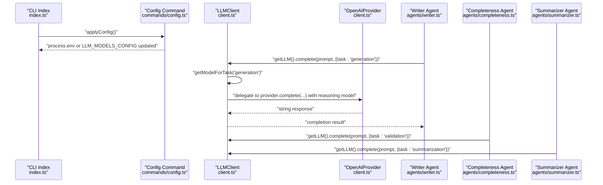
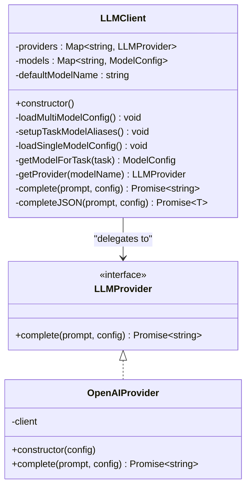
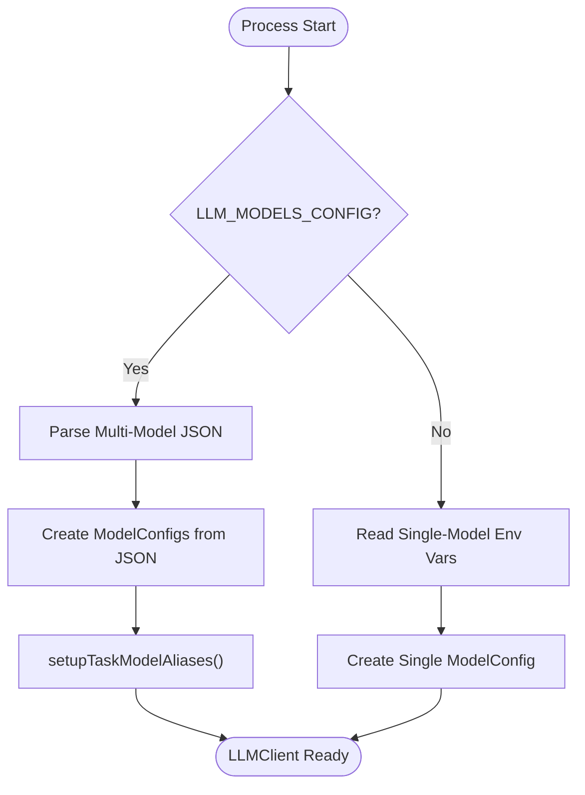
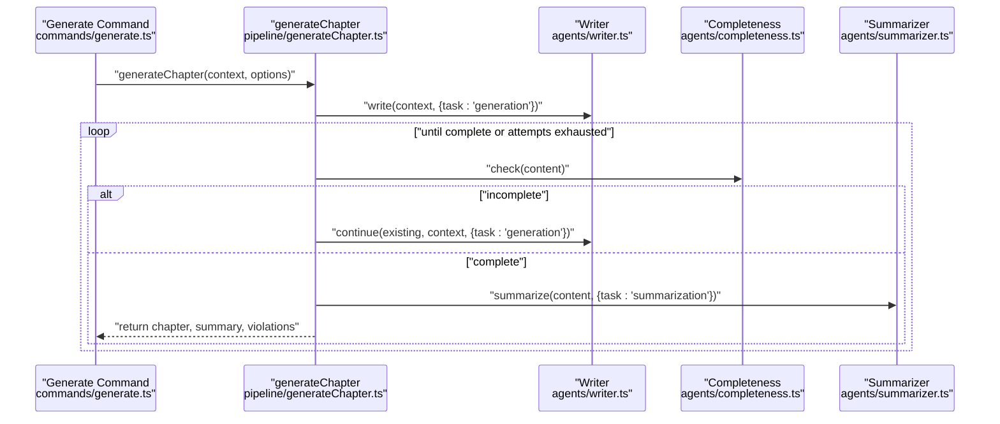
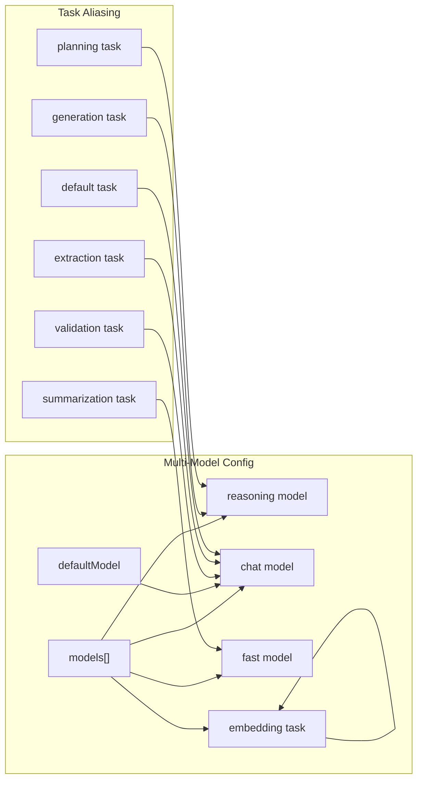
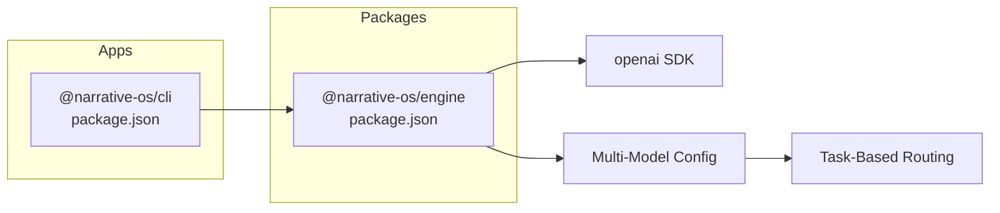

# LLM Integration Layer

<cite>
**Referenced Files in This Document**
- [client.ts](file://packages/engine/src/llm/client.ts)
- [types/index.ts](file://packages/engine/src/types/index.ts)
- [writer.ts](file://packages/engine/src/agents/writer.ts)
- [completeness.ts](file://packages/engine/src/agents/completeness.ts)
- [summarizer.ts](file://packages/engine/src/agents/summarizer.ts)
- [generateChapter.ts](file://packages/engine/src/pipeline/generateChapter.ts)
- [config.ts](file://apps/cli/src/commands/config.ts)
- [index.ts](file://apps/cli/src/index.ts)
- [generate.ts](file://apps/cli/src/commands/generate.ts)
- [package.json (engine)](file://packages/engine/package.json)
- [package.json (cli)](file://apps/cli/package.json)
</cite>

## Update Summary
**Changes Made**
- Enhanced LLM client with multi-model configuration support
- Added `setupTaskModelAliases` method for task-based model routing
- Introduced task types: generation, validation, summarization, extraction, planning, embedding, and default
- Added support for reasoning, chat, fast, and embedding model purposes
- Updated configuration management to support both single-model and multi-model setups
- Enhanced model aliasing system for seamless task-based routing

## Table of Contents
1. [Introduction](#introduction)
2. [Project Structure](#project-structure)
3. [Core Components](#core-components)
4. [Architecture Overview](#architecture-overview)
5. [Detailed Component Analysis](#detailed-component-analysis)
6. [Multi-Model Configuration](#multi-model-configuration)
7. [Task-Based Model Routing](#task-based-model-routing)
8. [Dependency Analysis](#dependency-analysis)
9. [Performance Considerations](#performance-considerations)
10. [Troubleshooting Guide](#troubleshooting-guide)
11. [Conclusion](#conclusion)
12. [Appendices](#appendices)

## Introduction
This document describes the LLM integration layer that abstracts Large Language Model providers within the Narrative OS engine. The system has been enhanced with multi-model configuration support and task-based model routing capabilities. It explains the provider abstraction pattern, the factory-style configuration-driven instantiation, and the client interface used by agents and pipelines. The enhanced system now supports different model purposes (reasoning, chat, fast, embedding) and automatic model selection based on task requirements.

## Project Structure
The LLM integration spans three primary areas:
- Engine LLM client and provider abstraction with multi-model support
- Agent modules that consume the LLM client with task-based model routing
- CLI configuration and runtime wiring for both single-model and multi-model setups

```mermaid
graph TB
subgraph "Engine"
C["LLM Client<br/>client.ts"]
T["Types<br/>types/index.ts"]
W["Writer Agent<br/>agents/writer.ts"]
CC["Completeness Agent<br/>agents/completeness.ts"]
S["Summarizer Agent<br/>agents/summarizer.ts"]
GC["Generate Chapter Pipeline<br/>pipeline/generateChapter.ts"]
ME["Memory Extractor<br/>agents/memoryExtractor.ts"]
CV["Canon Validator<br/>agents/canonValidator.ts"]
END
subgraph "CLI"
CFG["Config Command<br/>commands/config.ts"]
IDX["CLI Entry Point<br/>index.ts"]
GEN["Generate Command<br/>commands/generate.ts"]
END
IDX --> CFG
GEN --> GC
GC --> W
GC --> CC
GC --> S
GC --> ME
GC --> CV
W --> C
CC --> C
S --> C
ME --> C
CV --> C
C --> T
```

**Diagram sources**
- [client.ts:1-249](file://packages/engine/src/llm/client.ts#L1-L249)
- [types/index.ts:78-116](file://packages/engine/src/types/index.ts#L78-L116)
- [writer.ts:1-176](file://packages/engine/src/agents/writer.ts#L1-L176)
- [completeness.ts:1-56](file://packages/engine/src/agents/completeness.ts#L1-L56)
- [summarizer.ts:1-65](file://packages/engine/src/agents/summarizer.ts#L1-L65)
- [generateChapter.ts:1-290](file://packages/engine/src/pipeline/generateChapter.ts#L1-L290)
- [config.ts:1-318](file://apps/cli/src/commands/config.ts#L1-L318)
- [index.ts:1-54](file://apps/cli/src/index.ts#L1-L54)
- [generate.ts:1-55](file://apps/cli/src/commands/generate.ts#L1-L55)

**Section sources**
- [client.ts:1-249](file://packages/engine/src/llm/client.ts#L1-L249)
- [types/index.ts:78-116](file://packages/engine/src/types/index.ts#L78-L116)
- [writer.ts:1-176](file://packages/engine/src/agents/writer.ts#L1-L176)
- [completeness.ts:1-56](file://packages/engine/src/agents/completeness.ts#L1-L56)
- [summarizer.ts:1-65](file://packages/engine/src/agents/summarizer.ts#L1-L65)
- [generateChapter.ts:1-290](file://packages/engine/src/pipeline/generateChapter.ts#L1-L290)
- [config.ts:1-318](file://apps/cli/src/commands/config.ts#L1-L318)
- [index.ts:1-54](file://apps/cli/src/index.ts#L1-L54)
- [generate.ts:1-55](file://apps/cli/src/commands/generate.ts#L1-L55)

## Core Components
- LLMProvider interface: Defines the contract for completion requests.
- OpenAIProvider: Implements LLMProvider using the official OpenAI SDK, supporting optional base URL for compatible APIs (e.g., DeepSeek).
- LLMClient: Central facade that loads configuration (single or multi-model), selects appropriate models based on task types, merges defaults, and exposes completion methods including a JSON parsing helper.
- Global accessor: Lazy singleton retrieval of the LLM client.

Key responsibilities:
- Provider selection based on environment variables or multi-model configuration
- Automatic model aliasing for task-based routing (generation, validation, summarization, extraction)
- Default configuration merging
- JSON response parsing with structured error reporting
- Support for multiple model purposes: reasoning, chat, fast, and embedding
- Minimal coupling between agents and providers

**Section sources**
- [client.ts:4-6](file://packages/engine/src/llm/client.ts#L4-L6)
- [client.ts:8-37](file://packages/engine/src/llm/client.ts#L8-L37)
- [client.ts:50-239](file://packages/engine/src/llm/client.ts#L50-L239)
- [types/index.ts:78-116](file://packages/engine/src/types/index.ts#L78-L116)

## Architecture Overview
The LLM integration follows a layered architecture with enhanced multi-model support:
- CLI applies configuration to environment variables or JSON configuration
- Engine's LLMClient reads configuration and instantiates appropriate providers
- Agents call the LLMClient with task types for automatic model selection
- Pipeline orchestrates agent workflows around chapter generation with task-based routing



**Diagram sources**
- [index.ts:9-9](file://apps/cli/src/index.ts#L9-L9)
- [config.ts:283-317](file://apps/cli/src/commands/config.ts#L283-L317)
- [client.ts:59-82](file://packages/engine/src/llm/client.ts#L59-L82)
- [client.ts:152-186](file://packages/engine/src/llm/client.ts#L152-L186)
- [writer.ts:113-117](file://packages/engine/src/agents/writer.ts#L113-L117)
- [completeness.ts:40-43](file://packages/engine/src/agents/completeness.ts#L40-L43)
- [summarizer.ts:27-31](file://packages/engine/src/agents/summarizer.ts#L27-L31)

## Detailed Component Analysis

### LLMClient and Provider Abstraction
- LLMProvider defines a single method for generating text from a prompt with optional configuration.
- OpenAIProvider encapsulates the OpenAI SDK client, supports a configurable base URL for compatible providers, and forwards model, temperature, and max tokens.
- LLMClient:
  - Loads configuration from environment variables or multi-model JSON configuration
  - Creates provider instances based on provider name
  - Supports both single-model and multi-model configurations
  - Merges default configuration with per-call overrides
  - Exposes complete and completeJSON helpers with task-based model routing
- Singleton accessor ensures a single shared client instance.



**Diagram sources**
- [client.ts:4-6](file://packages/engine/src/llm/client.ts#L4-L6)
- [client.ts:8-37](file://packages/engine/src/llm/client.ts#L8-L37)
- [client.ts:50-239](file://packages/engine/src/llm/client.ts#L50-L239)
- [types/index.ts:92-116](file://packages/engine/src/types/index.ts#L92-L116)

**Section sources**
- [client.ts:4-6](file://packages/engine/src/llm/client.ts#L4-L6)
- [client.ts:8-37](file://packages/engine/src/llm/client.ts#L8-L37)
- [client.ts:50-239](file://packages/engine/src/llm/client.ts#L50-L239)
- [types/index.ts:92-116](file://packages/engine/src/types/index.ts#L92-L116)

### Configuration Management and Factory Pattern
- Environment-driven configuration:
  - Single model: LLM_PROVIDER, LLM_MODEL, OPENAI_API_KEY, DEEPSEEK_API_KEY
  - Multi-model: LLM_MODELS_CONFIG JSON containing models array and defaultModel
  - Optional baseURL for providers like DeepSeek
- Factory-style creation:
  - LLMClient.loadMultiModelConfig chooses between single and multi-model configuration
  - LLMClient.createProvider maps provider name to implementation
  - setupTaskModelAliases creates model aliases for task-based routing
- CLI configuration:
  - Interactive config saves provider, models, and API keys to a local JSON file
  - applyConfig injects environment variables or multi-model JSON before CLI starts



**Diagram sources**
- [client.ts:59-82](file://packages/engine/src/llm/client.ts#L59-L82)
- [client.ts:84-106](file://packages/engine/src/llm/client.ts#L84-L106)
- [config.ts:283-317](file://apps/cli/src/commands/config.ts#L283-L317)

**Section sources**
- [client.ts:59-82](file://packages/engine/src/llm/client.ts#L59-L82)
- [client.ts:84-106](file://packages/engine/src/llm/client.ts#L84-L106)
- [config.ts:283-317](file://apps/cli/src/commands/config.ts#L283-L317)

### Client Interface, Method Signatures, and Usage
- LLMClient.complete(prompt, config?): Returns raw text completion with optional task parameter.
- LLMClient.completeJSON<T>(prompt, config?): Returns parsed JSON with robust error reporting on parse failure.
- Agents call getLLM() to obtain the singleton client and pass task types for automatic model selection.
- Task types include: generation, validation, summarization, extraction, planning, embedding, and default.

Example usage locations:
- Writer agent: requests a full chapter with task: 'generation'
- Completeness agent: checks if a chapter ends naturally
- Summarizer agent: produces concise summaries with task: 'summarization'
- Memory extractor: extracts narrative facts with task: 'extraction'

**Section sources**
- [client.ts:174-186](file://packages/engine/src/llm/client.ts#L174-L186)
- [client.ts:188-219](file://packages/engine/src/llm/client.ts#L188-L219)
- [writer.ts:113-117](file://packages/engine/src/agents/writer.ts#L113-L117)
- [summarizer.ts:27-31](file://packages/engine/src/agents/summarizer.ts#L27-L31)
- [memoryExtractor.ts:62-66](file://packages/engine/src/agents/memoryExtractor.ts#L62-L66)

### Pipeline Orchestration and Fallback Mechanisms
- The generateChapter pipeline:
  - Uses scene-level generation by default with automatic model selection
  - Writes initial content with the writer agent using generation task
  - Iteratively continues until completeness criteria are met (with a bounded retry limit)
  - Validates against canon using validation task and summarizes the chapter using summarization task
- No explicit fallback provider is implemented in code; failures surface as thrown errors.



**Diagram sources**
- [generate.ts:28-53](file://apps/cli/src/commands/generate.ts#L28-L53)
- [generateChapter.ts:63-205](file://packages/engine/src/pipeline/generateChapter.ts#L63-L205)
- [writer.ts:70-147](file://packages/engine/src/agents/writer.ts#L70-L147)
- [completeness.ts:37-52](file://packages/engine/src/agents/completeness.ts#L37-L52)
- [summarizer.ts:24-39](file://packages/engine/src/agents/summarizer.ts#L24-L39)

**Section sources**
- [generateChapter.ts:1-290](file://packages/engine/src/pipeline/generateChapter.ts#L1-L290)
- [generate.ts:1-55](file://apps/cli/src/commands/generate.ts#L1-L55)

## Multi-Model Configuration
The LLM integration now supports both single-model and multi-model configurations:

### Single-Model Configuration
- Legacy configuration using environment variables
- Supports OpenAI, DeepSeek, Alibaba Cloud, and ByteDance Ark providers
- Automatically creates reasoning model for DeepSeek when DEEPSEEK_REASONER_API_KEY is set

### Multi-Model Configuration
- Modern configuration using LLM_MODELS_CONFIG JSON environment variable
- Supports multiple models with different purposes: reasoning, chat, fast, embedding
- Automatic model aliasing for seamless task-based routing
- Separate API keys for different providers and purposes



**Diagram sources**
- [client.ts:59-82](file://packages/engine/src/llm/client.ts#L59-L82)
- [client.ts:84-106](file://packages/engine/src/llm/client.ts#L84-L106)
- [client.ts:152-164](file://packages/engine/src/llm/client.ts#L152-L164)

**Section sources**
- [client.ts:108-150](file://packages/engine/src/llm/client.ts#L108-L150)
- [client.ts:59-82](file://packages/engine/src/llm/client.ts#L59-L82)
- [config.ts:8-31](file://apps/cli/src/commands/config.ts#L8-L31)

## Task-Based Model Routing
The system now supports intelligent model selection based on task requirements:

### Task Type Mapping
- generation: Maps to reasoning model (for complex creative tasks)
- planning: Maps to reasoning model (for planning tasks)
- validation: Maps to chat model (for validation tasks)
- summarization: Maps to fast model (for summarization tasks)
- extraction: Maps to chat model (for extraction tasks)
- embedding: Maps to embedding model (for vector embeddings)
- default: Maps to chat model (fallback)

### Model Purpose Categories
- reasoning: High-complexity reasoning tasks (DeepSeek Reasoner, GPT-4)
- chat: General conversation and writing tasks
- fast: Cost-effective, fast inference for simple tasks
- embedding: Text embedding generation for vector storage

### Implementation Details
- setupTaskModelAliases creates model aliases for each task type
- getModelForTask determines appropriate model based on task mapping
- Automatic fallback to default model if specific purpose not found

**Section sources**
- [client.ts:39-48](file://packages/engine/src/llm/client.ts#L39-L48)
- [client.ts:84-106](file://packages/engine/src/llm/client.ts#L84-L106)
- [client.ts:152-164](file://packages/engine/src/llm/client.ts#L152-L164)
- [types/index.ts:107-116](file://packages/engine/src/types/index.ts#L107-L116)

## Dependency Analysis
- Runtime dependencies:
  - Engine depends on the OpenAI SDK for chat completions
  - CLI depends on the Engine package and inquirer for interactive configuration
- Internal dependencies:
  - Agents depend on the LLM client via the global accessor
  - Pipeline composes agents and orchestrates their calls with task-based routing



**Diagram sources**
- [package.json (cli):12-16](file://apps/cli/package.json#L12-L16)
- [package.json (engine):11-14](file://packages/engine/package.json#L11-L14)

**Section sources**
- [package.json (cli):12-16](file://apps/cli/package.json#L12-L16)
- [package.json (engine):11-14](file://packages/engine/package.json#L11-L14)

## Performance Considerations
- Token limits and cost control:
  - Use smaller maxTokens for tasks that require concise outputs (e.g., summarization)
  - Lower temperature reduces randomness and can improve consistency
  - Fast models provide cost-effective solutions for simple tasks
- Throughput and batching:
  - Current implementation performs synchronous calls; consider introducing concurrency limits and backoff for rate-limited providers
- Model selection:
  - Prefer cheaper or faster models for intermediate steps (e.g., summarization) and reserve higher-capability models for creative writing
  - Use reasoning models only when complex reasoning is required
- Caching:
  - Cache repeated prompts or canonical segments to reduce token usage
- Logging and monitoring:
  - Track token usage per request and aggregate costs per story or session
- Task-based optimization:
  - Automatic model selection ensures optimal performance for each task type

[No sources needed since this section provides general guidance]

## Troubleshooting Guide
Common issues and resolutions:
- Unknown provider error:
  - Occurs when LLM_PROVIDER is not set to supported values; ensure environment variable is configured or CLI config is applied
- Missing API key:
  - OPENAI_API_KEY, DEEPSEEK_API_KEY, ALIBABA_API_KEY, or ARK_API_KEY must be present; verify environment variables after applying CLI config
- JSON parsing failures:
  - completeJSON throws when the response is not valid JSON; ensure prompts explicitly request JSON-only responses
- Rate limiting and quota exhaustion:
  - Implement retries with exponential backoff and consider switching to a lower-cost model for heavy workloads
- Incorrect model or base URL:
  - Verify LLM_MODEL and provider-specific base URL; DeepSeek requires a specific base URL
- Multi-model configuration issues:
  - Ensure LLM_MODELS_CONFIG JSON is properly formatted and contains valid model configurations
  - Verify that defaultModel references an existing model name

Operational hooks:
- CLI config command writes provider, models, and API key to a local JSON file and applies environment variables at startup
- Pipeline retries until content is marked complete, preventing partial chapters from being saved
- Task-based model routing automatically selects appropriate models for each operation

**Section sources**
- [client.ts:166-172](file://packages/engine/src/llm/client.ts#L166-L172)
- [client.ts:214-219](file://packages/engine/src/llm/client.ts#L214-L219)
- [config.ts:283-317](file://apps/cli/src/commands/config.ts#L283-L317)
- [generateChapter.ts:227-238](file://packages/engine/src/pipeline/generateChapter.ts#L227-L238)

## Conclusion
The LLM integration layer has been significantly enhanced with multi-model support and task-based model routing. The system now provides intelligent model selection based on task requirements, supporting different model purposes (reasoning, chat, fast, embedding) and seamless configuration management for both single-model and multi-model setups. The LLMClient offers a unified API for text and structured JSON responses with automatic task-based routing, while agents and pipelines remain provider-agnostic. The CLI enables easy configuration and environment propagation with support for modern multi-model setups. Extending support to additional providers involves adding new provider classes and updating the factory, preserving the existing interface and configuration patterns.

[No sources needed since this section summarizes without analyzing specific files]

## Appendices

### Provider Setup Examples
- OpenAI setup:
  - Set provider to openai
  - Provide OPENAI_API_KEY
  - Optionally set LLM_MODEL to a supported OpenAI model
- DeepSeek setup:
  - Set provider to deepseek
  - Provide DEEPSEEK_API_KEY
  - LLM_MODEL defaults to a compatible DeepSeek model; baseURL is set automatically
- Multi-model setup:
  - Configure LLM_MODELS_CONFIG JSON with reasoning, chat, fast, and embedding models
  - Supports separate API keys for different providers and purposes

**Section sources**
- [client.ts:108-150](file://packages/engine/src/llm/client.ts#L108-L150)
- [config.ts:283-317](file://apps/cli/src/commands/config.ts#L283-L317)

### API Key Management Best Practices
- Store keys securely in environment variables or secret managers
- Scope keys to least privilege and monitor usage
- Rotate keys regularly and invalidate old ones
- Use separate API keys for different providers in multi-model setups

[No sources needed since this section provides general guidance]

### Error Handling Strategies
- Centralized JSON parsing error reporting with truncated response previews
- Explicit unknown provider detection during client initialization
- Model aliasing fallback to default model when specific purpose not found
- Pipeline-level retry loops for content completeness
- Multi-model configuration parsing error handling with fallback to single model

**Section sources**
- [client.ts:214-219](file://packages/engine/src/llm/client.ts#L214-L219)
- [client.ts:166-172](file://packages/engine/src/llm/client.ts#L166-L172)
- [client.ts:75-78](file://packages/engine/src/llm/client.ts#L75-L78)
- [generateChapter.ts:227-238](file://packages/engine/src/pipeline/generateChapter.ts#L227-L238)

### Task-Based Model Routing Examples
- Generation tasks: Automatically routed to reasoning model for complex creative writing
- Validation tasks: Automatically routed to chat model for fact-checking
- Summarization tasks: Automatically routed to fast model for cost-effective summarization
- Extraction tasks: Automatically routed to chat model for narrative memory extraction
- Planning tasks: Automatically routed to reasoning model for scene and chapter planning

**Section sources**
- [client.ts:39-48](file://packages/engine/src/llm/client.ts#L39-L48)
- [client.ts:84-106](file://packages/engine/src/llm/client.ts#L84-L106)
- [writer.ts:113-117](file://packages/engine/src/agents/writer.ts#L113-L117)
- [summarizer.ts:27-31](file://packages/engine/src/agents/summarizer.ts#L27-L31)
- [memoryExtractor.ts:62-66](file://packages/engine/src/agents/memoryExtractor.ts#L62-L66)