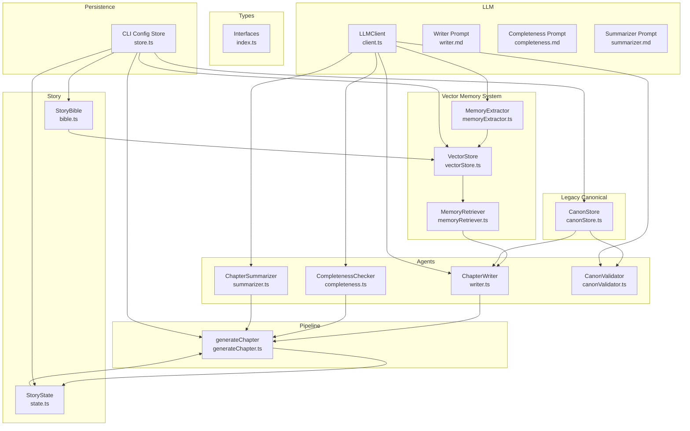
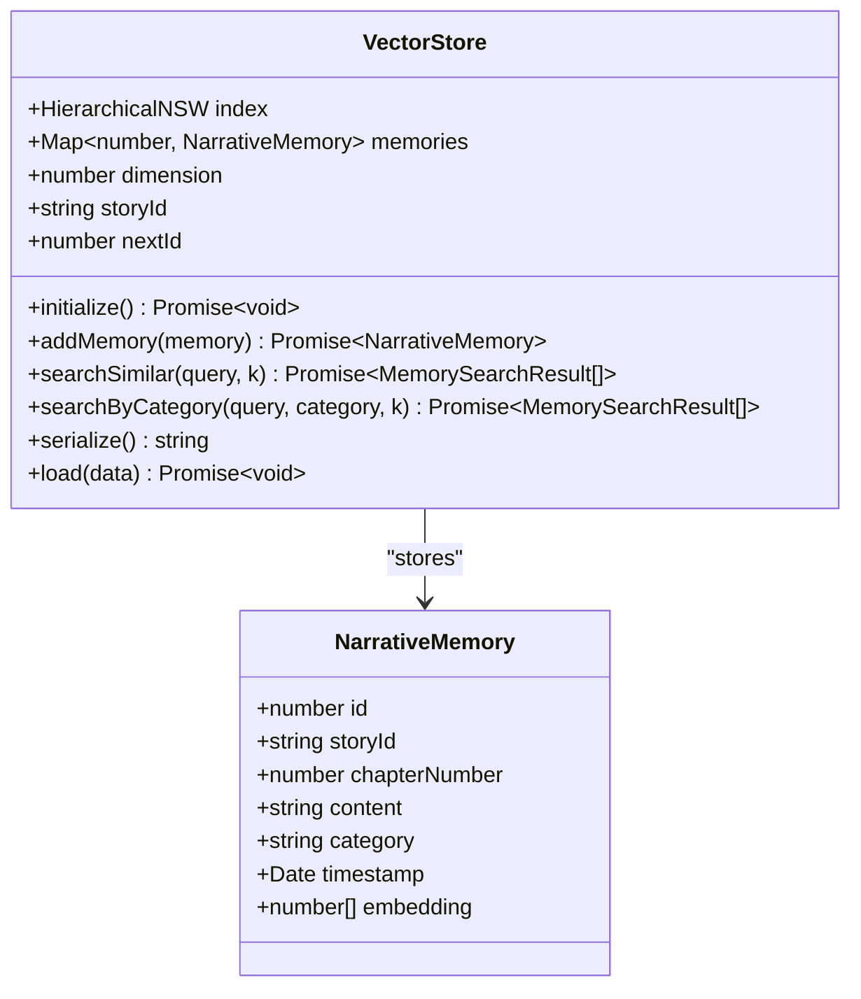
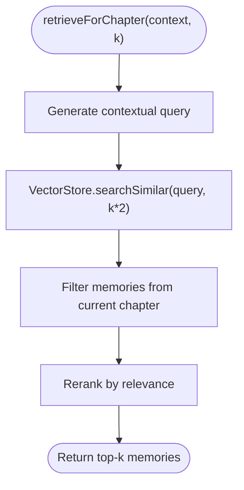
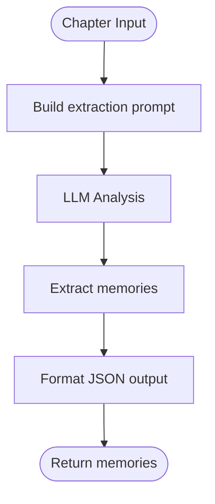
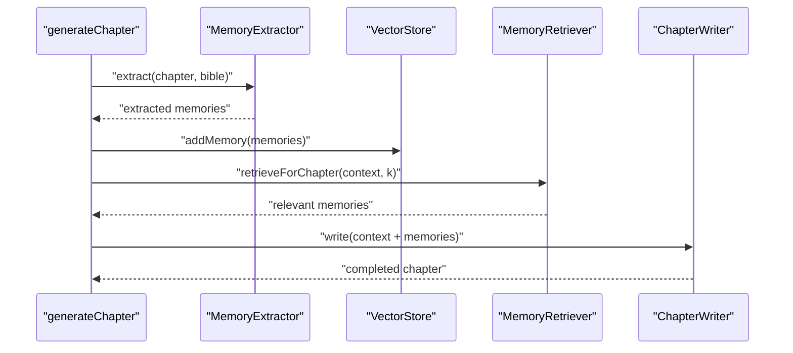
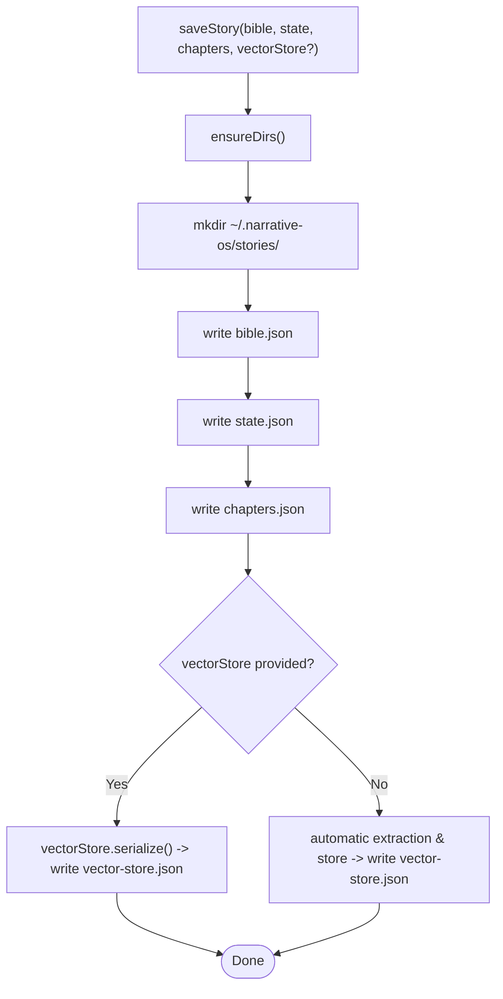
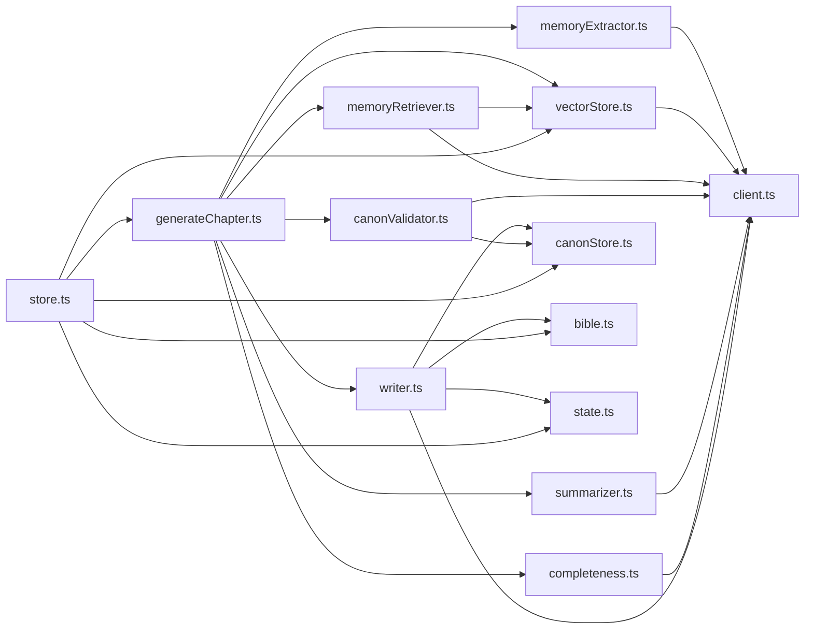
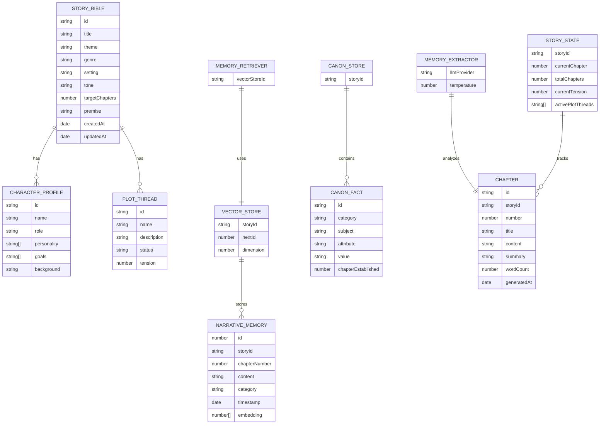

# Memory Management System

<cite>
**Referenced Files in This Document**
- [vectorStore.ts](file://packages/engine/src/memory/vectorStore.ts)
- [memoryRetriever.ts](file://packages/engine/src/memory/memoryRetriever.ts)
- [memoryExtractor.ts](file://packages/engine/src/agents/memoryExtractor.ts)
- [canonStore.ts](file://packages/engine/src/memory/canonStore.ts)
- [bible.ts](file://packages/engine/src/story/bible.ts)
- [canonValidator.ts](file://packages/engine/src/agents/canonValidator.ts)
- [index.ts](file://packages/engine/src/types/index.ts)
- [generateChapter.ts](file://packages/engine/src/pipeline/generateChapter.ts)
- [state.ts](file://packages/engine/src/story/state.ts)
- [writer.ts](file://packages/engine/src/agents/writer.ts)
- [completeness.ts](file://packages/engine/src/agents/completeness.ts)
- [summarizer.ts](file://packages/engine/src/agents/summarizer.ts)
- [client.ts](file://packages/engine/src/llm/client.ts)
- [writer.md](file://packages/engine/src/llm/prompts/writer.md)
- [completeness.md](file://packages/engine/src/llm/prompts/completeness.md)
- [summarizer.md](file://packages/engine/src/llm/prompts/summarizer.md)
- [store.ts](file://apps/cli/src/config/store.ts)
- [vector-memory.test.ts](file://packages/engine/src/test/vector-memory.test.ts)
</cite>

## Update Summary
**Changes Made**
- Added comprehensive vector-based narrative memory system replacing Phase 2 canonical memory
- Introduced VectorStore with HNSW semantic search capabilities
- Added MemoryRetriever for intelligent memory retrieval and categorization
- Integrated MemoryExtractor agent for automatic memory extraction from chapters
- Enhanced memory persistence with embedding storage and serialization
- Updated architecture to support semantic memory retrieval for story continuity

## Table of Contents
1. [Introduction](#introduction)
2. [Project Structure](#project-structure)
3. [Core Components](#core-components)
4. [Architecture Overview](#architecture-overview)
5. [Detailed Component Analysis](#detailed-component-analysis)
6. [Dependency Analysis](#dependency-analysis)
7. [Performance Considerations](#performance-considerations)
8. [Troubleshooting Guide](#troubleshooting-guide)
9. [Conclusion](#conclusion)
10. [Appendices](#appendices)

## Introduction
This document describes the Phase 3 vector-based narrative memory management system that ensures narrative consistency across generated chapters through semantic memory retrieval. The system has evolved from a simple canonical fact store to a sophisticated vector-based memory system supporting intelligent memory extraction, storage, and retrieval with HNSW semantic search capabilities. It covers the VectorStore architecture, automatic memory extraction from chapters, semantic memory retrieval processes, and integration with the generation pipeline. The system maintains story continuity across chapters by leveraging embeddings and hierarchical navigable small world graphs for efficient similarity search.

## Project Structure
The memory management system now encompasses both legacy canonical memory and the new vector-based system:
- Vector Memory: VectorStore, MemoryRetriever, and MemoryExtractor for semantic memory management
- Legacy Canonical: CanonStore and canonical fact management for backward compatibility
- Story: StoryBible creation and updates
- Agents: Writer, Completeness Checker, Summarizer, Canon Validator, and MemoryExtractor
- Pipeline: Chapter generation workflow with memory integration
- Types: Shared interfaces and enums
- LLM: Provider abstraction and prompt templates
- CLI Config Store: Persistence and backup of stories, states, chapters, and memory stores



**Diagram sources**
- [vectorStore.ts](file://packages/engine/src/memory/vectorStore.ts#L1-L173)
- [memoryRetriever.ts](file://packages/engine/src/memory/memoryRetriever.ts#L1-L174)
- [memoryExtractor.ts](file://packages/engine/src/agents/memoryExtractor.ts#L1-L97)
- [canonStore.ts](file://packages/engine/src/memory/canonStore.ts#L1-L134)
- [bible.ts](file://packages/engine/src/story/bible.ts#L1-L73)
- [state.ts](file://packages/engine/src/story/state.ts#L1-L30)
- [writer.ts](file://packages/engine/src/agents/writer.ts#L1-L146)
- [completeness.ts](file://packages/engine/src/agents/completeness.ts#L1-L56)
- [summarizer.ts](file://packages/engine/src/agents/summarizer.ts#L1-L64)
- [canonValidator.ts](file://packages/engine/src/agents/canonValidator.ts#L1-L59)
- [generateChapter.ts](file://packages/engine/src/pipeline/generateChapter.ts#L1-L76)
- [index.ts](file://packages/engine/src/types/index.ts#L1-L90)
- [client.ts](file://packages/engine/src/llm/client.ts#L1-L106)
- [writer.md](file://packages/engine/src/llm/prompts/writer.md#L1-L38)
- [completeness.md](file://packages/engine/src/llm/prompts/completeness.md#L1-L26)
- [summarizer.md](file://packages/engine/src/llm/prompts/summarizer.md#L1-L13)
- [store.ts](file://apps/cli/src/config/store.ts#L1-L78)

**Section sources**
- [vectorStore.ts](file://packages/engine/src/memory/vectorStore.ts#L1-L173)
- [memoryRetriever.ts](file://packages/engine/src/memory/memoryRetriever.ts#L1-L174)
- [memoryExtractor.ts](file://packages/engine/src/agents/memoryExtractor.ts#L1-L97)
- [canonStore.ts](file://packages/engine/src/memory/canonStore.ts#L1-L134)
- [bible.ts](file://packages/engine/src/story/bible.ts#L1-L73)
- [state.ts](file://packages/engine/src/story/state.ts#L1-L30)
- [writer.ts](file://packages/engine/src/agents/writer.ts#L1-L146)
- [completeness.ts](file://packages/engine/src/agents/completeness.ts#L1-L56)
- [summarizer.ts](file://packages/engine/src/agents/summarizer.ts#L1-L64)
- [canonValidator.ts](file://packages/engine/src/agents/canonValidator.ts#L1-L59)
- [generateChapter.ts](file://packages/engine/src/pipeline/generateChapter.ts#L1-L76)
- [index.ts](file://packages/engine/src/types/index.ts#L1-L90)
- [client.ts](file://packages/engine/src/llm/client.ts#L1-L106)
- [writer.md](file://packages/engine/src/llm/prompts/writer.md#L1-L38)
- [completeness.md](file://packages/engine/src/llm/prompts/completeness.md#L1-L26)
- [summarizer.md](file://packages/engine/src/llm/prompts/summarizer.md#L1-L13)
- [store.ts](file://apps/cli/src/config/store.ts#L1-L78)

## Core Components
- **VectorStore**: HNSW-based vector database storing NarrativeMemory with embeddings, supporting semantic similarity search and persistence
- **MemoryRetriever**: Intelligent memory retrieval system that generates contextual queries, performs semantic search, and ranks memories by relevance
- **MemoryExtractor**: Automated memory extraction agent that analyzes chapters and summaries to identify important narrative facts for future reference
- **NarrativeMemory**: Vector-based memory record with content, category, chapter number, timestamp, and embedding vectors
- **CanonStore**: Legacy canonical fact store for backward compatibility with existing pipeline components
- **CanonFact**: Canonical fact record for traditional memory management
- **StoryBible**: Immutable story blueprint with characters and plot threads
- **StoryState**: Runtime state tracking current chapter, total chapters, current tension, and chapter summaries
- **Agents**: Enhanced with MemoryExtractor integration alongside existing ChapterWriter, CompletenessChecker, Summarizer, and CanonValidator
- **Pipeline**: generateChapter now integrates memory extraction and retrieval for improved narrative continuity
- **Persistence**: Enhanced CLI store supporting both vector memory serialization and traditional artifact storage

**Section sources**
- [vectorStore.ts](file://packages/engine/src/memory/vectorStore.ts#L4-L173)
- [memoryRetriever.ts](file://packages/engine/src/memory/memoryRetriever.ts#L5-L174)
- [memoryExtractor.ts](file://packages/engine/src/agents/memoryExtractor.ts#L5-L97)
- [canonStore.ts](file://packages/engine/src/memory/canonStore.ts#L3-L134)
- [bible.ts](file://packages/engine/src/story/bible.ts#L1-L73)
- [state.ts](file://packages/engine/src/story/state.ts#L1-L30)
- [writer.ts](file://packages/engine/src/agents/writer.ts#L48-L146)
- [completeness.ts](file://packages/engine/src/agents/completeness.ts#L30-L56)
- [summarizer.ts](file://packages/engine/src/agents/summarizer.ts#L17-L64)
- [canonValidator.ts](file://packages/engine/src/agents/canonValidator.ts#L31-L59)
- [generateChapter.ts](file://packages/engine/src/pipeline/generateChapter.ts#L20-L76)
- [store.ts](file://apps/cli/src/config/store.ts#L15-L49)

## Architecture Overview
The Phase 3 memory system integrates vector-based semantic memory with the existing canonical memory system:
- MemoryExtractor automatically analyzes chapters and summaries to extract NarrativeMemory
- VectorStore stores memories with embeddings and provides HNSW semantic search
- MemoryRetriever generates contextual queries and retrieves relevant memories for chapter writing
- Legacy CanonStore maintains traditional canonical facts for validation and consistency checking
- The pipeline coordinates both memory systems for optimal narrative continuity

```mermaid
sequenceDiagram
participant User as "User"
participant CLI as "CLI Config Store"
participant Gen as "generateChapter"
participant ME as "MemoryExtractor"
participant VS as "VectorStore"
participan MR as "MemoryRetriever"
participant Writer as "ChapterWriter"
participant LLM as "LLMClient"
participant Canon as "CanonStore"
participant Val as "CanonValidator"
participant Sum as "ChapterSummarizer"
User->>CLI : "saveStory(bible, state, chapters, vectorStore?)"
CLI-->>User : "OK"
User->>Gen : "generateChapter(context, options)"
Gen->>ME : "extract(chapter, bible)"
ME->>LLM : "complete(extraction prompt)"
LLM-->>ME : "extracted memories"
ME->>VS : "addMemory(memory)"
VS->>VS : "generate embedding & add to HNSW"
Gen->>MR : "retrieveForChapter(context, k)"
MR->>VS : "searchSimilar(contextual query)"
VS-->>MR : "semantic search results"
MR-->>Gen : "retrieved memories"
Gen->>Writer : "write(context + memories)"
Writer->>Canon : "formatCanonForPrompt()"
Writer->>LLM : "complete(writer prompt)"
LLM-->>Writer : "chapter content"
Writer-->>Gen : "WriterOutput"
loop "continuation attempts"
Gen->>Writer : "continue(existingContent, context)"
Writer->>LLM : "complete(continuation prompt)"
LLM-->>Writer : "continued content"
Writer-->>Gen : "extended content"
end
alt "validateCanon"
Gen->>Val : "validate(chapterText, canon)"
Val->>Canon : "formatCanonForPrompt()"
Val->>LLM : "complete(validation prompt)"
LLM-->>Val : "JSON result"
Val-->>Gen : "validation result"
end
Gen->>Sum : "summarize(content, chapterNumber)"
Sum->>LLM : "complete(summarizer prompt)"
LLM-->>Sum : "summary"
Sum-->>Gen : "ChapterSummary"
Gen-->>CLI : "persist story artifacts + vector store"
```

**Diagram sources**
- [generateChapter.ts](file://packages/engine/src/pipeline/generateChapter.ts#L20-L76)
- [memoryExtractor.ts](file://packages/engine/src/agents/memoryExtractor.ts#L52-L97)
- [vectorStore.ts](file://packages/engine/src/memory/vectorStore.ts#L37-L88)
- [memoryRetriever.ts](file://packages/engine/src/memory/memoryRetriever.ts#L25-L83)
- [writer.ts](file://packages/engine/src/agents/writer.ts#L55-L94)
- [canonValidator.ts](file://packages/engine/src/agents/canonValidator.ts#L32-L55)
- [summarizer.ts](file://packages/engine/src/agents/summarizer.ts#L24-L38)
- [canonStore.ts](file://packages/engine/src/memory/canonStore.ts#L101-L129)
- [client.ts](file://packages/engine/src/llm/client.ts#L78-L105)
- [store.ts](file://apps/cli/src/config/store.ts#L15-L49)

## Detailed Component Analysis

### VectorStore and NarrativeMemory
- **Data structures**:
  - NarrativeMemory: id, storyId, chapterNumber, content, category ('event' | 'character' | 'world' | 'plot'), timestamp, embedding
  - VectorStore: HNSW index, memory map, dimension (1536 for text-embedding-3-small), storyId, nextId
- **Initialization and embedding generation**:
  - initialize() sets up HNSW index with cosine distance metric and specified dimensions
  - generateEmbedding() uses OpenAI embeddings with fallback to mock embeddings for testing
- **Memory operations**:
  - addMemory() generates embeddings, assigns unique IDs, and adds to both HNSW index and memory map
  - searchSimilar() performs semantic similarity search with configurable k-nearest neighbors
  - searchByCategory() filters results by category for targeted retrieval
- **Persistence**:
  - serialize() converts memory store to JSON for disk storage
  - load() reconstructs store from serialized data and rebuilds HNSW index



**Diagram sources**
- [vectorStore.ts](file://packages/engine/src/memory/vectorStore.ts#L4-L88)

**Section sources**
- [vectorStore.ts](file://packages/engine/src/memory/vectorStore.ts#L4-L173)
- [index.ts](file://packages/engine/src/types/index.ts#L1-L90)

### MemoryRetriever and Semantic Search
- **Contextual query generation**:
  - generateContextualQuery() creates rich contextual queries based on story progress, active plot threads, and story elements
  - Supports character-specific and plot-thread-specific retrieval modes
- **Intelligent retrieval**:
  - retrieveForChapter() generates contextual queries, performs semantic search, filters future memories, and re-ranks results
  - retrieveForCharacter() and retrieveForPlotThread() provide specialized retrieval for story elements
- **Memory formatting**:
  - formatMemoriesForPrompt() groups memories by category and formats them for inclusion in writer prompts
  - groupByCategory() organizes memories for structured presentation



**Diagram sources**
- [memoryRetriever.ts](file://packages/engine/src/memory/memoryRetriever.ts#L25-L41)
- [vectorStore.ts](file://packages/engine/src/memory/vectorStore.ts#L60-L72)

**Section sources**
- [memoryRetriever.ts](file://packages/engine/src/memory/memoryRetriever.ts#L18-L174)

### MemoryExtractor and Automatic Memory Extraction
- **Extraction process**:
  - extract() analyzes full chapter content to identify important narrative facts across four categories
  - extractFromSummary() processes chapter summaries for efficient memory extraction
- **Structured extraction**:
  - Uses templated prompts with Story Bible context and chapter details
  - Returns JSON-formatted memories with content and category fields
- **Integration patterns**:
  - Limits chapter content to prevent token overflow
  - Maintains appropriate temperature and token limits for consistent extraction



**Diagram sources**
- [memoryExtractor.ts](file://packages/engine/src/agents/memoryExtractor.ts#L52-L97)

**Section sources**
- [memoryExtractor.ts](file://packages/engine/src/agents/memoryExtractor.ts#L1-L97)

### Enhanced Integration with Generation Pipeline
- **Memory-aware chapter generation**:
  - MemoryExtractor automatically processes completed chapters to build vector memory store
  - MemoryRetriever provides contextual memories to writers for improved continuity
  - Vector store persists memories between generations for long-term story consistency
- **Dual memory system coordination**:
  - Legacy CanonStore maintains canonical facts for validation
  - Vector memory provides semantic context for creative writing
  - Both systems contribute to narrative coherence through different mechanisms
- **Enhanced prompt construction**:
  - Writers receive both canonical facts and semantic memories
  - Memory formatting ensures relevant context without overwhelming prompts



**Diagram sources**
- [generateChapter.ts](file://packages/engine/src/pipeline/generateChapter.ts#L20-L76)
- [memoryExtractor.ts](file://packages/engine/src/agents/memoryExtractor.ts#L52-L97)
- [vectorStore.ts](file://packages/engine/src/memory/vectorStore.ts#L37-L58)
- [memoryRetriever.ts](file://packages/engine/src/memory/memoryRetriever.ts#L25-L41)
- [writer.ts](file://packages/engine/src/agents/writer.ts#L55-L94)

**Section sources**
- [generateChapter.ts](file://packages/engine/src/pipeline/generateChapter.ts#L1-L76)
- [memoryExtractor.ts](file://packages/engine/src/agents/memoryExtractor.ts#L1-L97)
- [vectorStore.ts](file://packages/engine/src/memory/vectorStore.ts#L1-L173)
- [memoryRetriever.ts](file://packages/engine/src/memory/memoryRetriever.ts#L1-L174)
- [writer.ts](file://packages/engine/src/agents/writer.ts#L1-L146)

### Legacy CanonStore Integration
- **Backward compatibility**:
  - CanonStore maintains traditional canonical fact management for validation workflows
  - formatCanonForPrompt() provides familiar interface for legacy components
  - Integration allows both memory systems to coexist during transition period
- **Coordinated validation**:
  - CanonValidator continues to validate against canonical facts
  - Memory-based retrieval enhances but doesn't replace canonical validation
  - Both systems contribute to overall narrative consistency

**Section sources**
- [canonStore.ts](file://packages/engine/src/memory/canonStore.ts#L1-L134)
- [canonValidator.ts](file://packages/engine/src/agents/canonValidator.ts#L1-L59)

### Enhanced Memory Operations Examples
- **Vector memory operations**:
  - Initialize vector store: `getVectorStore(storyId).initialize()`
  - Add memories: `vectorStore.addMemory({content, category, chapterNumber})`
  - Semantic search: `vectorStore.searchSimilar("query", k)`
  - Category filtering: `vectorStore.searchByCategory("query", "character", k)`
- **Memory retrieval**:
  - Contextual retrieval: `memoryRetriever.retrieveForChapter(context, k)`
  - Character-specific: `memoryRetriever.retrieveForCharacter(name, context, k)`
  - Plot-thread focused: `memoryRetriever.retrieveForPlotThread(threadId, bible, k)`
- **Automatic extraction**:
  - From chapters: `memoryExtractor.extract(chapter, bible)`
  - From summaries: `memoryExtractor.extractFromSummary(chapterNumber, summary, bible)`
- **Persistence**:
  - Serialize: `vectorStore.serialize()` for disk storage
  - Load: `vectorStore.load(serializedData)` for restoration
  - Clear: `clearVectorStore(storyId)` for cleanup

**Section sources**
- [vectorStore.ts](file://packages/engine/src/memory/vectorStore.ts#L26-L173)
- [memoryRetriever.ts](file://packages/engine/src/memory/memoryRetriever.ts#L18-L174)
- [memoryExtractor.ts](file://packages/engine/src/agents/memoryExtractor.ts#L52-L97)
- [vector-memory.test.ts](file://packages/engine/src/test/vector-memory.test.ts#L31-L185)

### Enhanced Memory Persistence and Backup Strategies
- **Vector store persistence**:
  - JSON serialization captures all memories with embeddings and metadata
  - Supports incremental updates and partial recovery scenarios
  - Enables cross-session memory continuity for long-running projects
- **Hybrid persistence approach**:
  - VectorStore serialization complements traditional artifact storage
  - Memory extraction and retrieval work independently of canonical store
  - CLI store handles both vector memory and legacy artifacts
- **Backup and recovery**:
  - Separate JSON files for vector memory and story artifacts
  - Mock embedding support enables testing without external APIs
  - Factory pattern ensures proper memory store initialization



**Diagram sources**
- [store.ts](file://apps/cli/src/config/store.ts#L15-L26)
- [store.ts](file://apps/cli/src/config/store.ts#L28-L49)
- [vectorStore.ts](file://packages/engine/src/memory/vectorStore.ts#L135-L157)
- [memoryExtractor.ts](file://packages/engine/src/agents/memoryExtractor.ts#L52-L97)

**Section sources**
- [store.ts](file://apps/cli/src/config/store.ts#L1-L78)
- [vectorStore.ts](file://packages/engine/src/memory/vectorStore.ts#L135-L157)
- [memoryExtractor.ts](file://packages/engine/src/agents/memoryExtractor.ts#L52-L97)

## Dependency Analysis
- **Internal dependencies**:
  - generateChapter coordinates MemoryExtractor, VectorStore, and MemoryRetriever
  - MemoryRetriever depends on VectorStore for semantic search operations
  - MemoryExtractor uses LLMClient for automated memory extraction
  - Legacy components maintain backward compatibility with CanonStore
- **External dependencies**:
  - VectorStore requires hnswlib-node for HNSW implementation
  - Embedding generation depends on LLM provider configuration
  - Mock embedding support enables testing without external APIs
  - CLI store maintains compatibility with existing persistence layer



**Diagram sources**
- [generateChapter.ts](file://packages/engine/src/pipeline/generateChapter.ts#L1-L76)
- [memoryExtractor.ts](file://packages/engine/src/agents/memoryExtractor.ts#L1-L97)
- [vectorStore.ts](file://packages/engine/src/memory/vectorStore.ts#L1-L173)
- [memoryRetriever.ts](file://packages/engine/src/memory/memoryRetriever.ts#L1-L174)
- [writer.ts](file://packages/engine/src/agents/writer.ts#L1-L146)
- [completeness.ts](file://packages/engine/src/agents/completeness.ts#L1-L56)
- [summarizer.ts](file://packages/engine/src/agents/summarizer.ts#L1-L64)
- [canonValidator.ts](file://packages/engine/src/agents/canonValidator.ts#L1-L59)
- [canonStore.ts](file://packages/engine/src/memory/canonStore.ts#L1-L134)
- [bible.ts](file://packages/engine/src/story/bible.ts#L1-L73)
- [state.ts](file://packages/engine/src/story/state.ts#L1-L30)
- [client.ts](file://packages/engine/src/llm/client.ts#L1-L106)
- [store.ts](file://apps/cli/src/config/store.ts#L1-L78)

**Section sources**
- [generateChapter.ts](file://packages/engine/src/pipeline/generateChapter.ts#L1-L76)
- [memoryExtractor.ts](file://packages/engine/src/agents/memoryExtractor.ts#L1-L97)
- [vectorStore.ts](file://packages/engine/src/memory/vectorStore.ts#L1-L173)
- [memoryRetriever.ts](file://packages/engine/src/memory/memoryRetriever.ts#L1-L174)
- [writer.ts](file://packages/engine/src/agents/writer.ts#L1-L146)
- [canonValidator.ts](file://packages/engine/src/agents/canonValidator.ts#L1-L59)
- [client.ts](file://packages/engine/src/llm/client.ts#L1-L106)
- [store.ts](file://apps/cli/src/config/store.ts#L1-L78)

## Performance Considerations
- **Vector search optimization**:
  - HNSW index provides efficient approximate nearest neighbor search with configurable parameters
  - Dimension reduction to 1536 for text-embedding-3-small balances quality and performance
  - Batch embedding generation reduces API call overhead for large memory sets
- **Memory management**:
  - Mock embeddings enable testing without external API dependencies
  - Serialization supports incremental updates and memory store sharing
  - Memory deduplication prevents redundant embeddings in vector store
- **Pipeline integration**:
  - Memory extraction occurs asynchronously to avoid blocking chapter generation
  - Contextual query generation optimizes search performance by focusing on relevant memory subsets
  - KNN search parameter tuning balances recall and performance
- **Scalability considerations**:
  - Vector store factory pattern supports multiple story memory isolation
  - Memory pagination prevents excessive memory usage in large projects
  - Embedding caching reduces computational overhead for repeated searches

## Troubleshooting Guide
- **Vector store initialization failures**:
  - Ensure HNSW library is properly installed and configured
  - Verify embedding dimension matches the selected model (1536 for text-embedding-3-small)
  - Check memory allocation for large story projects
- **Embedding generation issues**:
  - MemoryExtractor falls back to mock embeddings when API is unavailable
  - Verify LLM provider configuration supports embeddings
  - Monitor API rate limits and quota restrictions
- **Semantic search performance**:
  - Adjust HNSW parameters (efConstruction, M) for optimal recall vs. performance
  - Tune k-nearest neighbors based on memory store size and query complexity
  - Consider memory filtering by chapter or category for targeted searches
- **Memory extraction failures**:
  - MemoryExtractor handles extraction errors gracefully with fallback behavior
  - Verify chapter content length doesn't exceed extraction limits
  - Check LLM response formatting for JSON compliance
- **Persistence and recovery**:
  - Vector store serialization handles memory reconstruction after restart
  - CLI store maintains compatibility with legacy artifact persistence
  - Backup strategies support both vector memory and traditional story artifacts

**Section sources**
- [vectorStore.ts](file://packages/engine/src/memory/vectorStore.ts#L90-L133)
- [memoryExtractor.ts](file://packages/engine/src/agents/memoryExtractor.ts#L62-L68)
- [memoryRetriever.ts](file://packages/engine/src/memory/memoryRetriever.ts#L117-L132)
- [store.ts](file://apps/cli/src/config/store.ts#L46-L48)

## Conclusion
The Phase 3 vector-based narrative memory system represents a significant advancement in automated story continuity management. By combining semantic memory retrieval with automatic memory extraction, the system provides intelligent context preservation across chapters while maintaining backward compatibility with existing canonical memory workflows. The HNSW-based vector store enables efficient similarity search, while the MemoryRetriever ensures relevant context is always available to writers. This dual-memory approach—combining structured canonical facts with semantic vector memories—creates a robust foundation for maintaining narrative consistency at scale while supporting creative flexibility.

## Appendices

### Enhanced Data Model Diagram


**Diagram sources**
- [index.ts](file://packages/engine/src/types/index.ts#L1-L90)
- [vectorStore.ts](file://packages/engine/src/memory/vectorStore.ts#L4-L28)
- [memoryRetriever.ts](file://packages/engine/src/memory/memoryRetriever.ts#L18-L23)
- [memoryExtractor.ts](file://packages/engine/src/agents/memoryExtractor.ts#L52-L97)
- [canonStore.ts](file://packages/engine/src/memory/canonStore.ts#L3-L15)