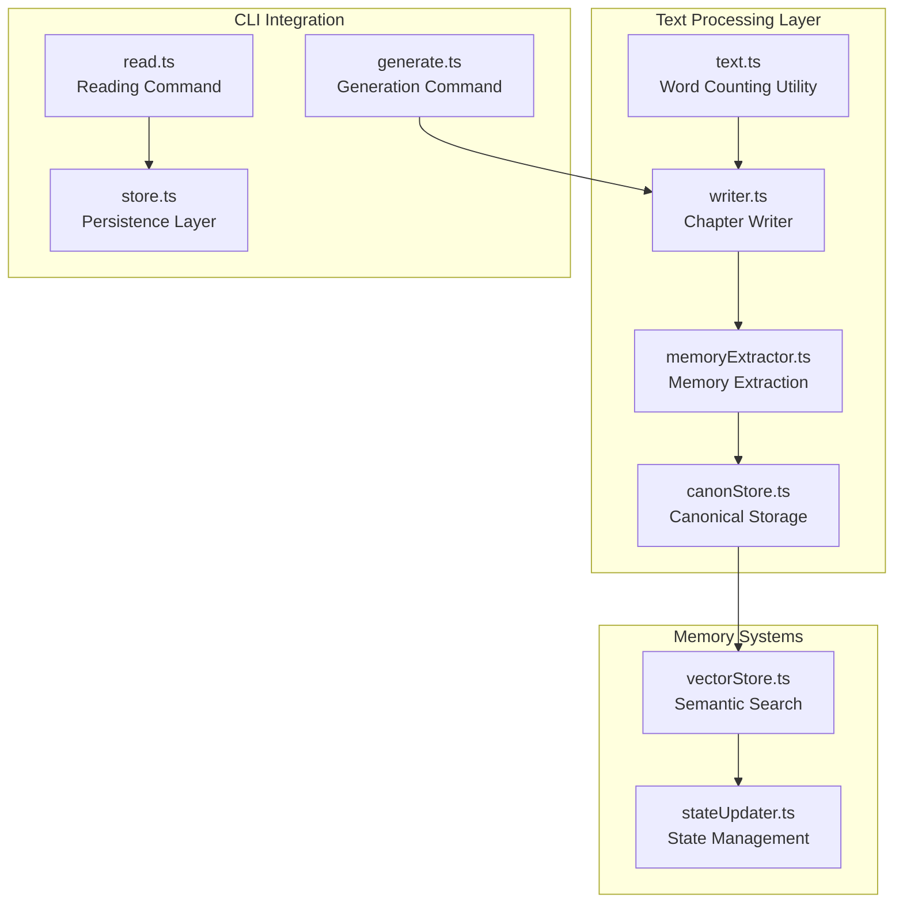
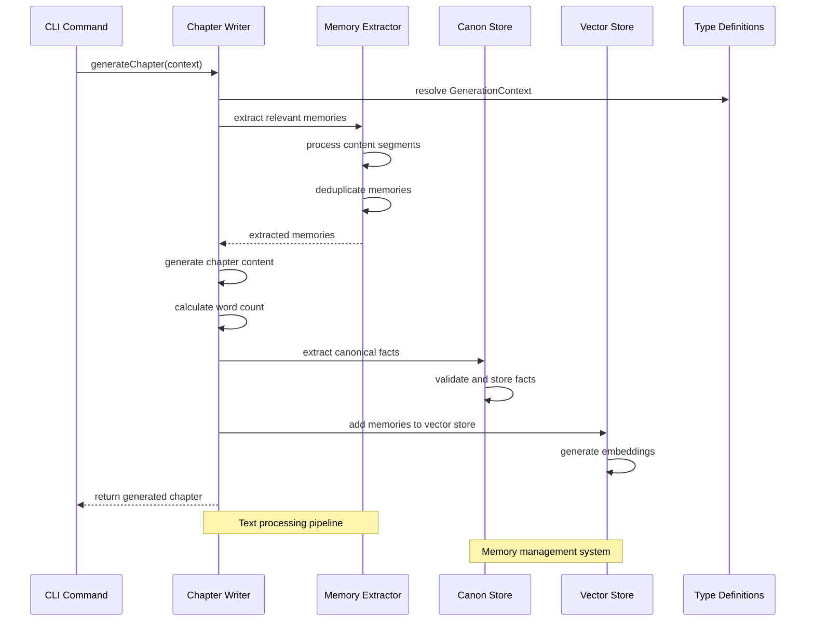
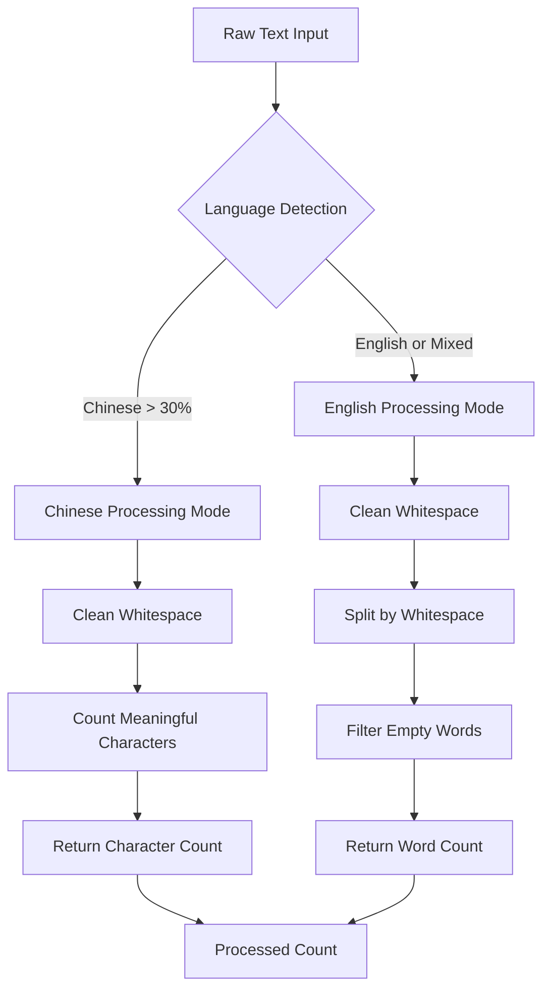
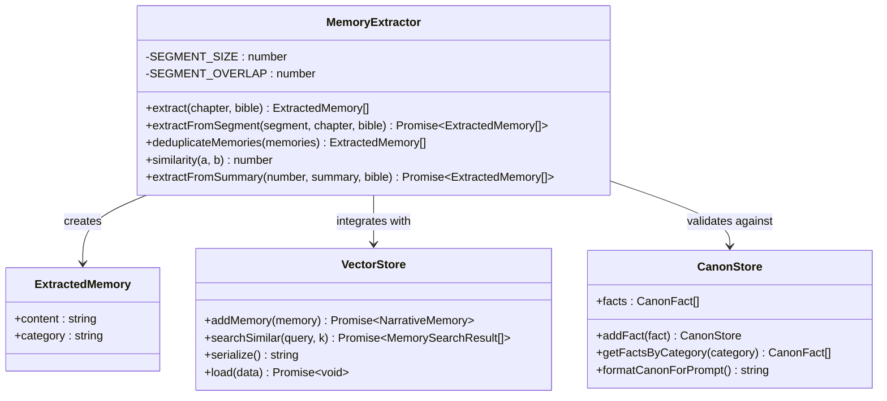
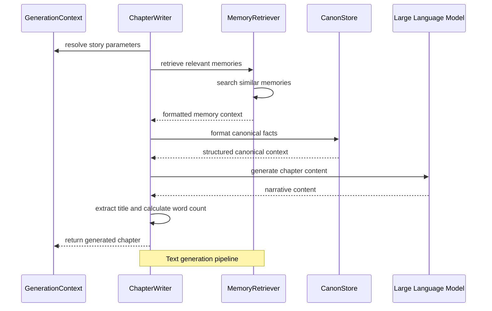
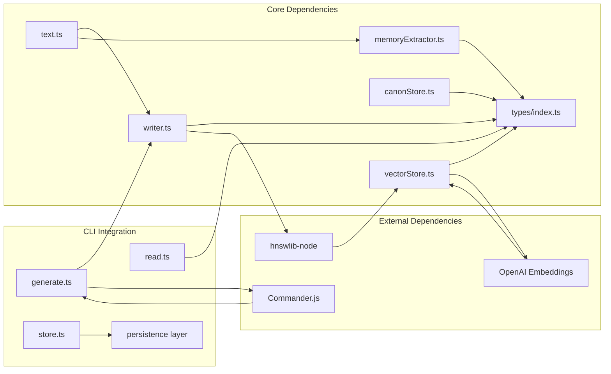

# Text Processing Utilities

<cite>
**Referenced Files in This Document**
- [text.ts](file://packages/engine/src/utils/text.ts)
- [writer.ts](file://packages/engine/src/agents/writer.ts)
- [memoryExtractor.ts](file://packages/engine/src/agents/memoryExtractor.ts)
- [canonStore.ts](file://packages/engine/src/memory/canonStore.ts)
- [vectorStore.ts](file://packages/engine/src/memory/vectorStore.ts)
- [generate.ts](file://apps/cli/src/commands/generate.ts)
- [read.ts](file://apps/cli/src/commands/read.ts)
- [store.ts](file://apps/cli/src/config/store.ts)
- [index.ts](file://packages/engine/src/types/index.ts)
- [implementation-plan-phase2.md](file://implementation-plan-phase2.md)
</cite>

## Table of Contents
1. [Introduction](#introduction)
2. [Project Structure](#project-structure)
3. [Core Components](#core-components)
4. [Architecture Overview](#architecture-overview)
5. [Detailed Component Analysis](#detailed-component-analysis)
6. [Dependency Analysis](#dependency-analysis)
7. [Performance Considerations](#performance-considerations)
8. [Troubleshooting Guide](#troubleshooting-guide)
9. [Conclusion](#conclusion)

## Introduction
This document provides comprehensive documentation for the Text Processing Utilities within the Narrative OS ecosystem. These utilities form the foundation for intelligent text generation, analysis, and management capabilities that power the AI-native narrative engine. The system supports sophisticated text processing workflows including multilingual word counting, chapter generation, memory extraction, canonical fact preservation, and vector-based semantic search.

The text processing utilities are designed to handle both English and Chinese text seamlessly, with specialized algorithms for word counting, content segmentation, and memory extraction. These components work together to create a robust pipeline for generating coherent, consistent, and narratively rich content while maintaining persistent memory across story generations.

## Project Structure
The text processing utilities are organized across several key modules within the Narrative OS architecture:

**Diagram sources**
- [text.ts:1-28](file://packages/engine/src/utils/text.ts#L1-L28)
- [writer.ts:1-306](file://packages/engine/src/agents/writer.ts#L1-L306)
- [memoryExtractor.ts:1-221](file://packages/engine/src/agents/memoryExtractor.ts#L1-L221)
- [canonStore.ts:1-309](file://packages/engine/src/memory/canonStore.ts#L1-L309)

**Section sources**
- [text.ts:1-28](file://packages/engine/src/utils/text.ts#L1-L28)
- [writer.ts:1-306](file://packages/engine/src/agents/writer.ts#L1-L306)
- [memoryExtractor.ts:1-221](file://packages/engine/src/agents/memoryExtractor.ts#L1-L221)
- [canonStore.ts:1-309](file://packages/engine/src/memory/canonStore.ts#L1-L309)

## Core Components

### Multilingual Word Counting System
The word counting utility provides intelligent text analysis that adapts to different languages and writing systems. This system automatically detects content language and applies appropriate counting algorithms.

**Key Features:**
- **Chinese Character Detection**: Identifies Chinese content by analyzing Unicode character ranges
- **Mixed Language Support**: Handles text containing both English and Chinese characters
- **Accurate Counting**: Uses character-based counting for Chinese and word-based for English
- **Punctuation Handling**: Includes Chinese punctuation in character counts

**Algorithm Complexity:**
- Time Complexity: O(n) where n is the length of the input string
- Space Complexity: O(k) where k is the number of matched characters

**Section sources**
- [text.ts:6-27](file://packages/engine/src/utils/text.ts#L6-L27)

### Chapter Generation Engine
The Chapter Writer serves as the primary text generation component, orchestrating the creation of narrative content through sophisticated prompting and content analysis.

**Core Capabilities:**
- **Dynamic Prompt Engineering**: Adapts prompts based on story context and chapter progression
- **Multi-language Support**: Automatically detects and formats language specifications
- **Content Analysis**: Integrates with word counting utilities for quality control
- **Title Extraction**: Automatically extracts chapter titles from generated content

**Generation Pipeline:**
1. Context Analysis: Evaluates story bible, current state, and chapter objectives
2. Memory Retrieval: Fetches relevant narrative memories for contextual grounding
3. Content Generation: Creates chapter content using optimized prompts
4. Quality Assurance: Validates word count and content structure

**Section sources**
- [writer.ts:65-306](file://packages/engine/src/agents/writer.ts#L65-L306)

### Memory Extraction System
The Memory Extractor performs sophisticated content analysis to identify and extract narrative elements that should be preserved in the story's memory systems.

**Extraction Categories:**
- **Events**: Significant plot developments and actions
- **Character**: Character development and relationship changes
- **World**: World-building details and environmental information
- **Plot**: Plot thread developments and narrative progression

**Advanced Features:**
- **Content Segmentation**: Processes long chapters in manageable segments
- **Duplicate Detection**: Identifies and removes redundant memory entries
- **Similarity Analysis**: Uses Jaccard similarity for content comparison
- **Streaming Processing**: Handles large volumes of text efficiently

**Section sources**
- [memoryExtractor.ts:52-221](file://packages/engine/src/agents/memoryExtractor.ts#L52-L221)

### Canonical Fact Management
The Canon Store maintains immutable facts that form the foundation of narrative consistency throughout the story generation process.

**Fact Categories:**
- **Character**: Character identities, relationships, and permanent traits
- **World**: World rules, locations, and environmental constants
- **Plot**: Plot developments and story-establishing events
- **Timeline**: Temporal information and chronological markers

**Storage Architecture:**
- **Immutable Design**: Once established, facts cannot be altered
- **Chapter Tracking**: Records when facts were established
- **Category Organization**: Structured storage for efficient retrieval
- **Duplicate Prevention**: Automatic detection and prevention of redundant entries

**Section sources**
- [canonStore.ts:4-130](file://packages/engine/src/memory/canonStore.ts#L4-L130)

## Architecture Overview

The text processing utilities follow a modular architecture that enables seamless integration between different components while maintaining clear separation of concerns:

**Diagram sources**
- [generate.ts:48-75](file://apps/cli/src/commands/generate.ts#L48-L75)
- [writer.ts:72-125](file://packages/engine/src/agents/writer.ts#L72-L125)
- [memoryExtractor.ts:58-95](file://packages/engine/src/agents/memoryExtractor.ts#L58-L95)
- [canonStore.ts:146-182](file://packages/engine/src/memory/canonStore.ts#L146-L182)

The architecture ensures that text processing operations are performed efficiently while maintaining narrative consistency and memory integrity throughout the generation process.

**Section sources**
- [generate.ts:1-91](file://apps/cli/src/commands/generate.ts#L1-L91)
- [writer.ts:1-306](file://packages/engine/src/agents/writer.ts#L1-L306)

## Detailed Component Analysis

### Text Processing Pipeline

The text processing pipeline demonstrates sophisticated handling of multilingual content with specialized algorithms for different writing systems:

**Diagram sources**
- [text.ts:6-27](file://packages/engine/src/utils/text.ts#L6-L27)

**Section sources**
- [text.ts:1-28](file://packages/engine/src/utils/text.ts#L1-L28)

### Memory Extraction Workflow

The memory extraction system implements a sophisticated content analysis pipeline that processes narrative text to identify important story elements:

**Diagram sources**
- [memoryExtractor.ts:52-221](file://packages/engine/src/agents/memoryExtractor.ts#L52-L221)
- [vectorStore.ts:19-271](file://packages/engine/src/memory/vectorStore.ts#L19-L271)
- [canonStore.ts:13-130](file://packages/engine/src/memory/canonStore.ts#L13-L130)

**Section sources**
- [memoryExtractor.ts:1-221](file://packages/engine/src/agents/memoryExtractor.ts#L1-L221)
- [vectorStore.ts:1-271](file://packages/engine/src/memory/vectorStore.ts#L1-L271)
- [canonStore.ts:1-309](file://packages/engine/src/memory/canonStore.ts#L1-L309)

### Chapter Generation Process

The chapter generation process combines multiple text processing utilities to create cohesive narrative content:

**Diagram sources**
- [writer.ts:72-125](file://packages/engine/src/agents/writer.ts#L72-L125)
- [memoryExtractor.ts:126-156](file://packages/engine/src/agents/memoryExtractor.ts#L126-L156)
- [canonStore.ts:102-130](file://packages/engine/src/memory/canonStore.ts#L102-L130)

**Section sources**
- [writer.ts:1-306](file://packages/engine/src/agents/writer.ts#L1-L306)

## Dependency Analysis

The text processing utilities maintain well-defined dependencies that enable modularity and maintainability:

**Diagram sources**
- [text.ts:1-28](file://packages/engine/src/utils/text.ts#L1-L28)
- [writer.ts:1-8](file://packages/engine/src/agents/writer.ts#L1-L8)
- [memoryExtractor.ts:1-4](file://packages/engine/src/agents/memoryExtractor.ts#L1-L4)
- [canonStore.ts:1-3](file://packages/engine/src/memory/canonStore.ts#L1-L3)
- [vectorStore.ts:1-3](file://packages/engine/src/memory/vectorStore.ts#L1-L3)

**Section sources**
- [index.ts:1-152](file://packages/engine/src/types/index.ts#L1-L152)
- [store.ts:1-249](file://apps/cli/src/config/store.ts#L1-L249)

## Performance Considerations

The text processing utilities are designed with performance optimization in mind, implementing several strategies for efficient text handling:

### Memory Management
- **Streaming Processing**: Long chapters are processed in segments to minimize memory usage
- **Garbage Collection Hints**: Strategic GC hints help manage memory pressure during large operations
- **Efficient Data Structures**: Use of Sets and Maps for fast duplicate detection and lookup

### Algorithmic Optimizations
- **Early Termination**: Language detection stops processing once sufficient confidence is achieved
- **Lazy Initialization**: Vector stores initialize only when needed, reducing startup overhead
- **Batch Operations**: Memory operations are batched to minimize I/O overhead

### Scalability Features
- **Configurable Segment Sizes**: Adjustable processing window sizes for different content volumes
- **Overlap Management**: Strategic overlap prevents content loss while enabling streaming
- **Dimension Detection**: Automatic embedding dimension detection optimizes vector operations

## Troubleshooting Guide

Common issues and their solutions when working with text processing utilities:

### Language Detection Issues
**Problem**: Incorrect language classification affecting word counting accuracy
**Solution**: Verify Unicode character ranges and adjust detection thresholds in the language detection algorithm

### Memory Extraction Failures
**Problem**: Memory extraction failing for long chapters
**Solution**: Check segment size configuration and ensure adequate overlap for proper content boundaries

### Vector Store Performance Issues
**Problem**: Slow semantic search performance
**Solution**: Monitor index capacity and consider increasing initial capacity for large memory stores

### Word Count Inaccuracies
**Problem**: Discrepancies in word count calculations
**Solution**: Validate input cleaning and ensure proper handling of special characters and whitespace

**Section sources**
- [text.ts:6-27](file://packages/engine/src/utils/text.ts#L6-L27)
- [memoryExtractor.ts:58-95](file://packages/engine/src/agents/memoryExtractor.ts#L58-L95)
- [vectorStore.ts:31-92](file://packages/engine/src/memory/vectorStore.ts#L31-L92)

## Conclusion

The Text Processing Utilities in Narrative OS represent a sophisticated system for intelligent text generation and management. Through careful design and implementation, these utilities provide robust support for multilingual content processing, advanced memory extraction, and persistent narrative consistency.

The modular architecture enables easy extension and customization while maintaining performance and reliability. The integration of language-aware algorithms, semantic memory systems, and canonical fact management creates a comprehensive foundation for AI-native narrative generation.

Future enhancements may include expanded language support, improved memory extraction algorithms, and enhanced integration with external text processing services. The current implementation provides a solid foundation for building sophisticated narrative generation systems capable of handling complex storytelling requirements across multiple languages and cultural contexts.