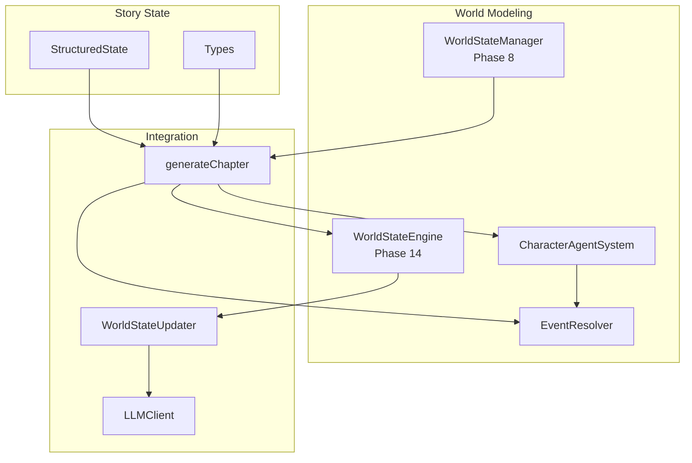
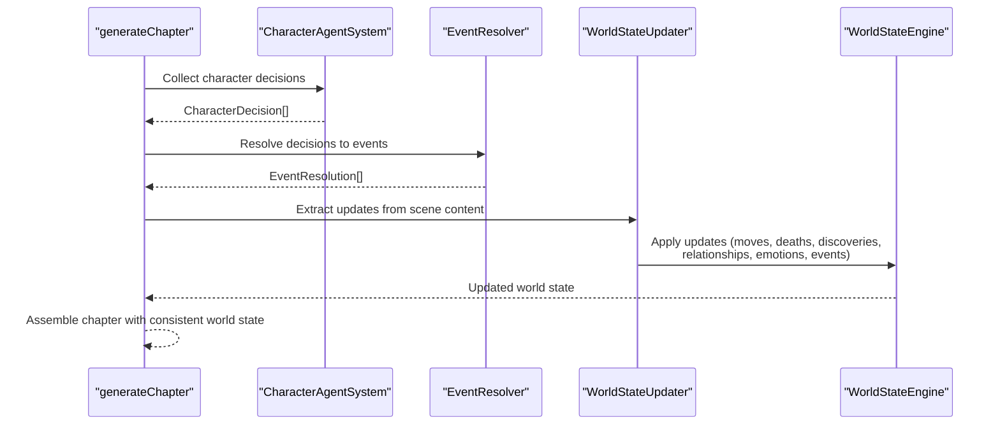
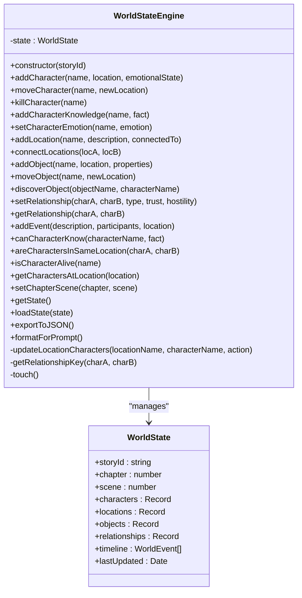
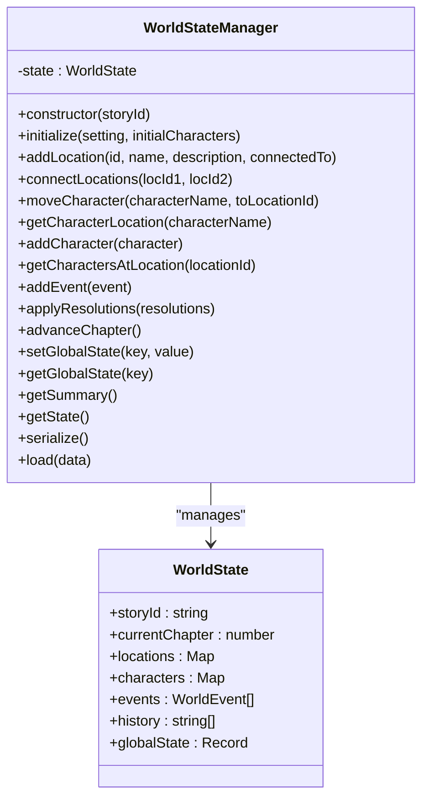
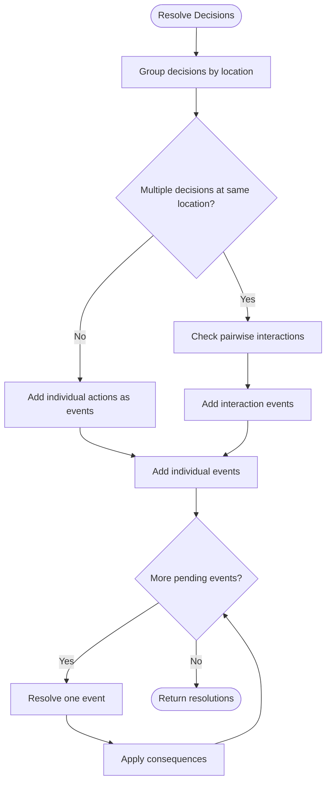
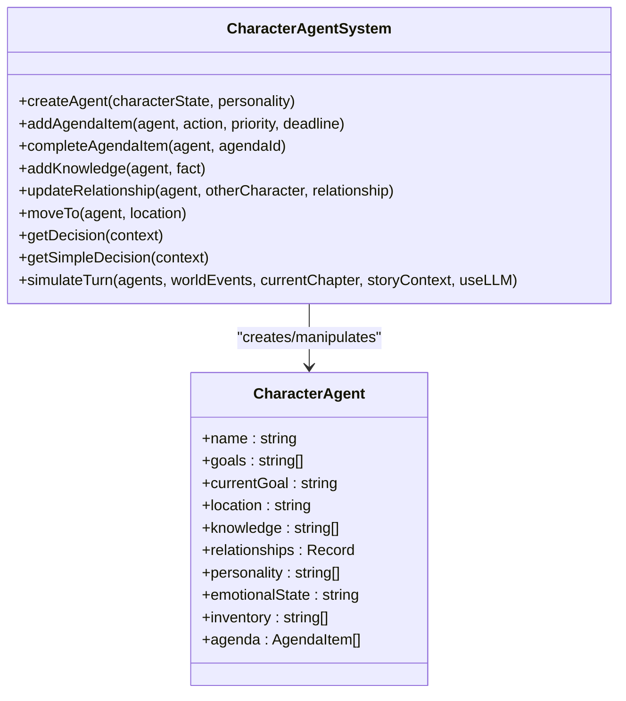
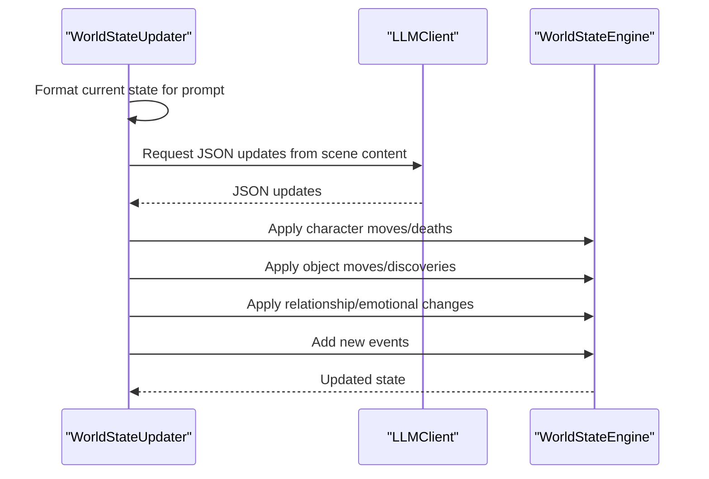
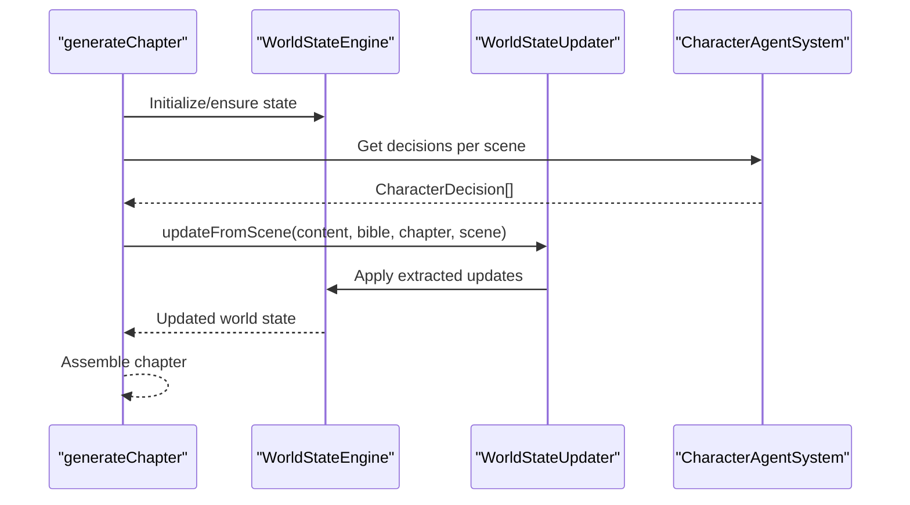
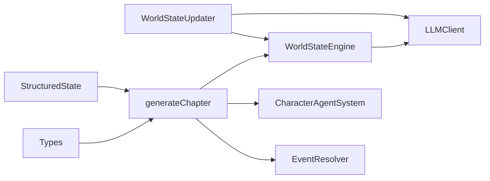

# World State Engine

<cite>
**Referenced Files in This Document**
- [worldStateEngine.ts](file://packages/engine/src/world/worldStateEngine.ts)
- [worldState.ts](file://packages/engine/src/world/worldState.ts)
- [eventResolver.ts](file://packages/engine/src/world/eventResolver.ts)
- [characterAgent.ts](file://packages/engine/src/world/characterAgent.ts)
- [worldStateUpdater.ts](file://packages/engine/src/agents/worldStateUpdater.ts)
- [generateChapter.ts](file://packages/engine/src/pipeline/generateChapter.ts)
- [structuredState.ts](file://packages/engine/src/story/structuredState.ts)
- [client.ts](file://packages/engine/src/llm/client.ts)
- [index.ts](file://packages/engine/src/index.ts)
- [types/index.ts](file://packages/engine/src/types/index.ts)
- [README.md](file://packages/engine/README.md)
- [world-simulation.test.ts](file://packages/engine/src/test/world-simulation.test.ts)
</cite>

## Table of Contents
1. [Introduction](#introduction)
2. [Project Structure](#project-structure)
3. [Core Components](#core-components)
4. [Architecture Overview](#architecture-overview)
5. [Detailed Component Analysis](#detailed-component-analysis)
6. [Dependency Analysis](#dependency-analysis)
7. [Performance Considerations](#performance-considerations)
8. [Troubleshooting Guide](#troubleshooting-guide)
9. [Conclusion](#conclusion)

## Introduction
The World State Engine is a core subsystem responsible for maintaining and evolving the persistent, logically consistent state of a story's world. It tracks characters, locations, objects, relationships, and timeline events, ensuring narrative coherence across generated chapters and scenes. The engine integrates with autonomous character agents, event resolution mechanics, and the broader narrative generation pipeline to produce coherent, causally consistent stories.

## Project Structure
The World State Engine spans several modules within the engine package:
- World modeling: character, location, object, relationship, and event abstractions
- State management: in-memory world state with persistence and serialization
- Event system: decision-to-event conversion and resolution with consequences
- Integration: world state updates extracted from generated content
- Pipeline integration: orchestration within the chapter generation workflow

**Diagram sources**
- [worldStateEngine.ts:64-352](file://packages/engine/src/world/worldStateEngine.ts#L64-L352)
- [worldState.ts:24-321](file://packages/engine/src/world/worldState.ts#L24-L321)
- [characterAgent.ts:91-304](file://packages/engine/src/world/characterAgent.ts#L91-L304)
- [eventResolver.ts:30-272](file://packages/engine/src/world/eventResolver.ts#L30-L272)
- [worldStateUpdater.ts:80-251](file://packages/engine/src/agents/worldStateUpdater.ts#L80-L251)
- [generateChapter.ts:40-420](file://packages/engine/src/pipeline/generateChapter.ts#L40-L420)
- [structuredState.ts:33-235](file://packages/engine/src/story/structuredState.ts#L33-L235)
- [types/index.ts:1-152](file://packages/engine/src/types/index.ts#L1-L152)

**Section sources**
- [README.md:197-212](file://packages/engine/README.md#L197-L212)
- [index.ts:45-84](file://packages/engine/src/index.ts#L45-L84)

## Core Components
- WorldStateEngine (Phase 14): Authoritative in-memory database of story reality with CRUD operations for characters, locations, objects, relationships, and timeline events. Provides validation helpers and prompt formatting for downstream agents.
- WorldStateManager (Phase 8): Alternative world state manager using Maps and character agents, focused on initialization, movement, and event tracking.
- EventResolver: Converts character decisions into world events and resolves them into outcomes with consequences.
- CharacterAgentSystem: Creates agents from structured state, manages agendas, and generates decisions via LLM or fallback logic.
- WorldStateUpdater: Extracts world state changes from scene content and applies them to the authoritative engine.
- Integration pipeline: generateChapter orchestrates story direction, scene planning, character decisions, scene generation, and world state updates.

**Section sources**
- [worldStateEngine.ts:64-352](file://packages/engine/src/world/worldStateEngine.ts#L64-L352)
- [worldState.ts:24-321](file://packages/engine/src/world/worldState.ts#L24-L321)
- [eventResolver.ts:30-272](file://packages/engine/src/world/eventResolver.ts#L30-L272)
- [characterAgent.ts:91-304](file://packages/engine/src/world/characterAgent.ts#L91-L304)
- [worldStateUpdater.ts:80-251](file://packages/engine/src/agents/worldStateUpdater.ts#L80-L251)
- [generateChapter.ts:40-420](file://packages/engine/src/pipeline/generateChapter.ts#L40-L420)

## Architecture Overview
The World State Engine operates as a persistent, authoritative layer integrated into the narrative generation pipeline. It receives updates from generated scenes, validates logical consistency, and informs subsequent generation steps.

**Diagram sources**
- [generateChapter.ts:138-335](file://packages/engine/src/pipeline/generateChapter.ts#L138-L335)
- [characterAgent.ts:270-304](file://packages/engine/src/world/characterAgent.ts#L270-L304)
- [eventResolver.ts:231-272](file://packages/engine/src/world/eventResolver.ts#L231-L272)
- [worldStateUpdater.ts:80-251](file://packages/engine/src/agents/worldStateUpdater.ts#L80-L251)
- [worldStateEngine.ts:64-352](file://packages/engine/src/world/worldStateEngine.ts#L64-L352)

## Detailed Component Analysis

### WorldStateEngine (Phase 14)
The authoritative world state database tracks:
- Characters: name, alive status, location, known information, emotional state, goals
- Locations: name, description, connected locations, present characters, present objects
- Objects: name, location/holder, owner, discoveredBy, properties
- Relationships: bidirectional trust/hostility with normalized keys
- Timeline: ordered events with chapter/scene, timestamp, participants, location

Key operations include adding/modifying characters and locations, moving characters and objects, discovering objects, setting relationships, adding events, and validation helpers for knowledge checks, co-location, and life status. The engine also formats its state for prompts and serializes to JSON.

**Diagram sources**
- [worldStateEngine.ts:52-352](file://packages/engine/src/world/worldStateEngine.ts#L52-L352)

**Section sources**
- [worldStateEngine.ts:64-352](file://packages/engine/src/world/worldStateEngine.ts#L64-L352)

### WorldStateManager (Phase 8)
Provides an alternative world state representation using Maps and character agents:
- Initializes world from story setting and characters
- Adds and connects locations
- Moves characters between locations
- Tracks events and maintains history
- Serializes/deserializes state and provides summaries

**Diagram sources**
- [worldState.ts:14-321](file://packages/engine/src/world/worldState.ts#L14-L321)

**Section sources**
- [worldState.ts:24-321](file://packages/engine/src/world/worldState.ts#L24-L321)

### EventResolver
Converts character decisions into world events and resolves them:
- Decision grouping by location
- Interaction detection between characters
- Event categorization (conflict, discovery, interaction, movement, environmental)
- Conflict resolution based on emotional state and personality traits
- Outcome generation with consequences and affected characters

**Diagram sources**
- [eventResolver.ts:34-272](file://packages/engine/src/world/eventResolver.ts#L34-L272)

**Section sources**
- [eventResolver.ts:30-272](file://packages/engine/src/world/eventResolver.ts#L30-L272)

### CharacterAgentSystem
Creates agents from structured state and generates decisions:
- Agent creation with goals, location, knowledge, relationships, personality, emotional state
- Agenda management with priorities and deadlines
- Knowledge and relationship updates
- Decision generation via LLM with fallback to simple logic
- Turn simulation across multiple agents

**Diagram sources**
- [characterAgent.ts:91-304](file://packages/engine/src/world/characterAgent.ts#L91-L304)

**Section sources**
- [characterAgent.ts:91-304](file://packages/engine/src/world/characterAgent.ts#L91-L304)

### WorldStateUpdater
Extracts world state changes from scene content and applies them:
- Uses LLM to parse scene content against current world state
- Extracts character/object movements, deaths, discoveries, relationship/emotional changes, and new events
- Applies updates to the authoritative engine with safe error handling

**Diagram sources**
- [worldStateUpdater.ts:80-251](file://packages/engine/src/agents/worldStateUpdater.ts#L80-L251)
- [client.ts:174-249](file://packages/engine/src/llm/client.ts#L174-L249)
- [worldStateEngine.ts:64-352](file://packages/engine/src/world/worldStateEngine.ts#L64-L352)

**Section sources**
- [worldStateUpdater.ts:80-251](file://packages/engine/src/agents/worldStateUpdater.ts#L80-L251)

### Integration in generateChapter
The pipeline coordinates world state updates during scene-level generation:
- Initializes WorldStateEngine if not provided
- Creates agents per scene and collects decisions
- Generates scenes with character guidance
- Updates world state after each scene
- Assembles chapter with consistent world state

**Diagram sources**
- [generateChapter.ts:92-335](file://packages/engine/src/pipeline/generateChapter.ts#L92-L335)
- [worldStateUpdater.ts:231-251](file://packages/engine/src/agents/worldStateUpdater.ts#L231-L251)
- [worldStateEngine.ts:64-352](file://packages/engine/src/world/worldStateEngine.ts#L64-L352)

**Section sources**
- [generateChapter.ts:40-420](file://packages/engine/src/pipeline/generateChapter.ts#L40-L420)

## Dependency Analysis
The World State Engine integrates with:
- LLMClient for JSON parsing and extraction
- StructuredState for story-level context
- Types for shared interfaces
- Test suite validating simulation behaviors

**Diagram sources**
- [client.ts:174-249](file://packages/engine/src/llm/client.ts#L174-L249)
- [worldStateEngine.ts:64-352](file://packages/engine/src/world/worldStateEngine.ts#L64-L352)
- [worldStateUpdater.ts:80-251](file://packages/engine/src/agents/worldStateUpdater.ts#L80-L251)
- [generateChapter.ts:40-420](file://packages/engine/src/pipeline/generateChapter.ts#L40-L420)
- [structuredState.ts:33-235](file://packages/engine/src/story/structuredState.ts#L33-L235)
- [types/index.ts:1-152](file://packages/engine/src/types/index.ts#L1-L152)

**Section sources**
- [index.ts:45-84](file://packages/engine/src/index.ts#L45-L84)

## Performance Considerations
- WorldStateEngine operations are O(1) for most map-based lookups and O(n) for timeline scanning; consider indexing frequently accessed subsets if scale demands.
- Event resolution loops iterate over pending events; batch processing and early termination can reduce overhead.
- LLM calls in WorldStateUpdater and CharacterAgentSystem should be rate-limited and cached where appropriate.
- Serialization/deserialization costs can be minimized by incremental updates and selective state exports.

## Troubleshooting Guide
Common issues and remedies:
- Character/location not found: Ensure proper initialization and lifecycle management before invoking move/kill operations.
- Relationship normalization: Keys are normalized; always use the same ordering for character pairs to avoid duplicates.
- LLM JSON parsing failures: Validate prompt formatting and consider fallback strategies when JSON extraction fails.
- Event resolution inconsistencies: Verify that participants exist in the agent map and that event types are categorized correctly.

**Section sources**
- [worldStateEngine.ts:97-119](file://packages/engine/src/world/worldStateEngine.ts#L97-L119)
- [worldStateUpdater.ts:113-128](file://packages/engine/src/agents/worldStateUpdater.ts#L113-L128)
- [eventResolver.ts:231-272](file://packages/engine/src/world/eventResolver.ts#L231-L272)

## Conclusion
The World State Engine provides a robust, authoritative foundation for narrative consistency in AI-generated stories. By integrating autonomous character agents, event resolution, and LLM-driven state updates, it ensures coherent evolution of story worlds across chapters and scenes. Its modular design enables seamless integration with the broader narrative generation pipeline while maintaining logical consistency and persistent memory.