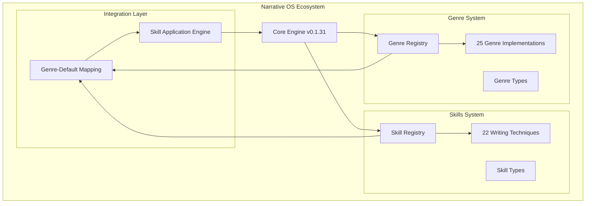
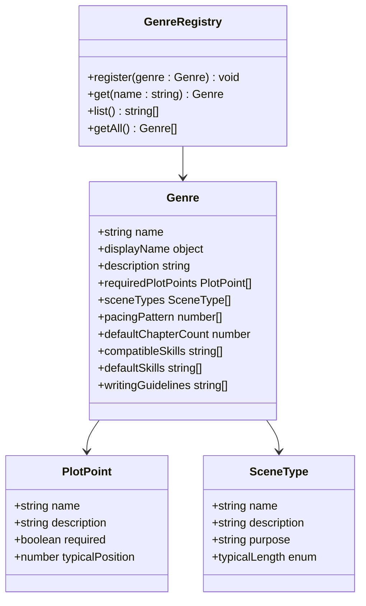
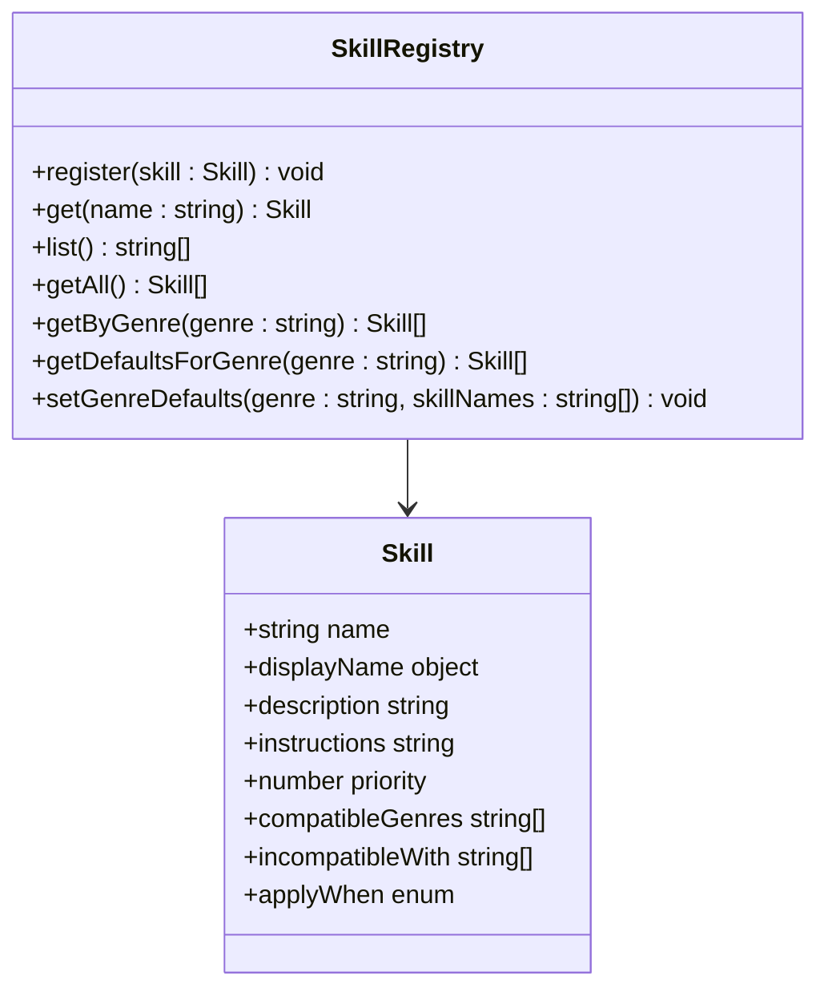
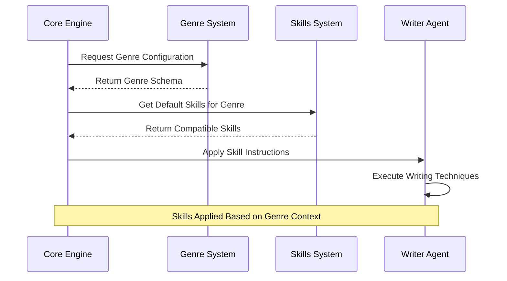

# Genre and Skills Systems

<cite>
**Referenced Files in This Document**
- [README.md](file://README.md)
- [package.json](file://packages/genres/package.json)
- [package.json](file://packages/skills/package.json)
- [package.json](file://packages/engine/package.json)
- [registry.ts](file://packages/genres/src/registry.ts)
- [types.ts](file://packages/genres/src/types.ts)
- [index.ts](file://packages/genres/src/index.ts)
- [mystery.ts](file://packages/genres/src/genres/mystery.ts)
- [thriller.ts](file://packages/genres/src/genres/thriller.ts)
- [registry.ts](file://packages/skills/src/registry.ts)
- [types.ts](file://packages/skills/src/types.ts)
- [index.ts](file://packages/skills/src/index.ts)
- [suspense.ts](file://packages/skills/src/skills/suspense.ts)
- [dialogue.ts](file://packages/skills/src/skills/dialogue.ts)
</cite>

## Update Summary
**Changes Made**
- Added comprehensive documentation for 25 genre implementations with detailed schemas
- Documented 22 writing techniques with registry patterns and genre-default combinations
- Updated system architecture to reflect actual implementation with genre and skills registries
- Enhanced integration patterns showing how genre-default skills are applied
- Added detailed type definitions and interface specifications

## Table of Contents
1. [Introduction](#introduction)
2. [System Architecture](#system-architecture)
3. [Genre System Overview](#genre-system-overview)
4. [Skills System Overview](#skills-system-overview)
5. [Registry Patterns and Implementation](#registry-patterns-and-implementation)
6. [Comprehensive Genre Catalog](#comprehensive-genre-catalog)
7. [Writing Techniques and Skills](#writing-techniques-and-skills)
8. [Integration Architecture](#integration-architecture)
9. [Package Structure Analysis](#package-structure-analysis)
10. [Implementation Details](#implementation-details)
11. [Usage Patterns](#usage-patterns)
12. [Development Guidelines](#development-guidelines)
13. [Conclusion](#conclusion)

## Introduction

The Genre and Skills systems represent a comprehensive narrative enhancement framework for the Narrative OS ecosystem. These systems provide specialized knowledge bases and writing techniques that significantly expand the AI's storytelling capabilities through structured genre conventions and writing skill applications.

The systems are built around sophisticated registry patterns that enable dynamic loading, genre-specific skill combinations, and intelligent narrative guidance. With 25 fully implemented genres and 22 advanced writing techniques, the system provides extensive coverage across literary traditions, cultural contexts, and narrative approaches.

## System Architecture

The Genre and Skills systems operate as sophisticated plugin architectures integrated with the core Narrative OS engine through well-defined registry patterns and optional dependency management.

**Diagram sources**
- [package.json:40-43](file://packages/engine/package.json#L40-L43)
- [registry.ts:1-24](file://packages/genres/src/registry.ts#L1-24)
- [registry.ts:1-40](file://packages/skills/src/registry.ts#L1-40)

## Genre System Overview

The Genre system provides a comprehensive catalog of 25 literary genres, each with detailed schemas defining narrative conventions, structural requirements, and writing guidelines. The system supports both Western literary traditions and international narrative forms.

### Core Genre Architecture

Each genre implements a standardized interface with the following key components:

- **Required Plot Points**: Essential narrative elements with typical placement positions
- **Scene Types**: Genre-specific scene classifications with purposes and typical durations
- **Pacing Patterns**: Tension level distributions across story chapters
- **Writing Guidelines**: Specific narrative advice tailored to each genre

### Genre Registration and Management

The system uses a centralized registry pattern that enables dynamic genre loading and management:

**Diagram sources**
- [types.ts:24-57](file://packages/genres/src/types.ts#L24-L57)
- [registry.ts:3-21](file://packages/genres/src/registry.ts#L3-L21)

**Section sources**
- [types.ts:1-74](file://packages/genres/src/types.ts#L1-L74)
- [registry.ts:1-24](file://packages/genres/src/registry.ts#L1-L24)

## Skills System Overview

The Skills system implements 22 advanced writing techniques as modular plugins, each designed to enhance specific aspects of narrative construction. The system provides sophisticated compatibility management and genre-specific skill recommendations.

### Writing Technique Categories

The skills are organized into several categories covering fundamental narrative elements:

- **Tension and Pacing**: Suspense building, pacing control, cliffhanger creation
- **Character Development**: Voice building, emotional depth, perspective techniques
- **World Building**: Atmosphere creation, setting description, cultural authenticity
- **Narrative Structure**: Foreshadowing, plot devices, temporal manipulation
- **Style and Technique**: Symbolism, subtext, literary devices, comedic timing

### Skill Registry Pattern

The skills system implements a comprehensive registry with advanced filtering and compatibility features:

**Diagram sources**
- [types.ts:36-57](file://packages/skills/src/types.ts#L36-L57)
- [registry.ts:3-38](file://packages/skills/src/registry.ts#L3-L38)

**Section sources**
- [types.ts:1-58](file://packages/skills/src/types.ts#L1-L58)
- [registry.ts:1-40](file://packages/skills/src/registry.ts#L1-L40)

## Registry Patterns and Implementation

Both systems implement sophisticated registry patterns that enable dynamic loading, filtering, and management of their respective components.

### Genre Registry Implementation

The genre registry provides centralized management with the following capabilities:

- **Dynamic Registration**: Genres can be registered at runtime
- **Type Safety**: Full TypeScript interface compliance
- **Lookup Operations**: Efficient retrieval by genre name
- **Enumeration Support**: Listing all available genres

### Skill Registry Implementation

The skill registry offers advanced filtering and compatibility management:

- **Genre Filtering**: Skills compatible with specific genres
- **Default Management**: Genre-specific default skill combinations
- **Compatibility Checking**: Incompatibility detection between skills
- **Priority Management**: Skill application ordering based on priority levels

**Section sources**
- [registry.ts:1-24](file://packages/genres/src/registry.ts#L1-L24)
- [registry.ts:1-40](file://packages/skills/src/registry.ts#L1-L40)

## Comprehensive Genre Catalog

The system now includes 25 fully implemented genres, spanning from traditional Western literature to international narrative forms and contemporary subgenres.

### Traditional Literary Genres

- **Mystery**: Detective solving crimes through clues and deduction
- **Thriller**: High-stakes, fast-paced narratives with constant tension
- **Romance**: Love stories with emotional depth and relationship development
- **Sci-Fi**: Science fiction exploring futuristic concepts and technology
- **Fantasy**: Imaginative worlds with magic and mythical elements
- **Horror**: Fear-inducing narratives with supernatural or psychological elements
- **Historical**: Stories set in past time periods with historical accuracy
- **Literary**: Artistic prose focusing on character and theme exploration

### International and Cultural Genres

- **Wuxia**: Chinese martial arts chivalric tales
- **Xianxia**: Chinese immortal cultivation fantasy
- **Modern Chinese**: Contemporary Chinese narrative styles
- **Gothic**: Dark romantic literature with supernatural elements
- **Cyberpunk**: Futuristic dystopian societies with high tech-low life
- **Steampunk**: Victorian-era technology and steam-powered machinery
- **Space Opera**: Grand scale science fiction adventures
- **Urban Fantasy**: Fantasy elements in modern urban settings

### Subgenres and Specialized Forms

- **Cozy Mystery**: Murder solved by amateur sleuths
- **Noir**: Film noir style detective stories
- **Post-Apocalyptic**: Stories set in post-collapse world
- **Western**: Frontier adventures and cowboy tales
- **Young Adult**: Coming-of-age stories for teenage audiences
- **Adventure**: Heroic quests and exploration narratives
- **Comedy**: Humorous narratives with comedic timing
- **Drama**: Serious character-driven stories

**Section sources**
- [index.ts:4-56](file://packages/genres/src/index.ts#L4-L56)
- [mystery.ts:1-44](file://packages/genres/src/genres/mystery.ts#L1-L44)
- [thriller.ts:1-44](file://packages/genres/src/genres/thriller.ts#L1-L44)

## Writing Techniques and Skills

The skills system implements 22 advanced writing techniques, each with detailed instructions, compatibility specifications, and genre applicability.

### Tension and Suspense Techniques

- **Suspense**: Build anticipation and keep readers on edge
- **Cliffhanger**: End scenes with unresolved questions or threats
- **Foreshadowing**: Plant subtle hints about future events
- **Red Herring**: Misleading clues that distract from the truth
- **Unreliable Narrator**: Tell stories from biased or deceptive perspectives
- **Pacing Control**: Manage story rhythm and tension building

### Character and Dialogue Techniques

- **Natural Dialogue**: Create realistic, character-revealing conversations
- **Character Voice**: Develop distinct voices for different characters
- **Emotional Depth**: Create three-dimensional characters with complex motivations
- **Inner Monologue**: Reveal character thoughts and psychological states
- **Subtext**: Communicate underlying meanings beneath surface dialogue

### World Building and Style Techniques

- **Worldbuilding**: Construct detailed, believable fictional worlds
- **Atmosphere**: Create mood and environmental storytelling
- **Sensory Detail**: Engage multiple senses in descriptive writing
- **Symbolism**: Use objects and images to represent deeper meanings
- **Juxtaposition**: Place contrasting elements side by side for emphasis

### Structural and Literary Techniques

- **Show Don't Tell**: Demonstrate rather than explain character traits
- **Theme Exploration**: Develop central ideas and messages
- **Irony**: Create contrast between expectation and reality
- **Flashback**: Use temporal shifts to reveal backstory
- **Comic Timing**: Control humor through timing and delivery
- **Restraint**: Use understatement and implication effectively
- **Callback**: Reference earlier elements later in the story

**Section sources**
- [index.ts:4-69](file://packages/skills/src/index.ts#L4-L69)
- [suspense.ts:1-24](file://packages/skills/src/skills/suspense.ts#L1-L24)
- [dialogue.ts:1-25](file://packages/skills/src/skills/dialogue.ts#L1-L25)

## Integration Architecture

The Genre and Skills systems integrate seamlessly with the core Narrative OS engine through sophisticated registry-based architecture and optional dependency management.

### Dynamic Skill Application

The system applies genre-default skills based on selected narrative type:

**Diagram sources**
- [index.ts:57-69](file://packages/skills/src/index.ts#L57-L69)
- [registry.ts:30-37](file://packages/skills/src/registry.ts#L30-L37)

### Configuration and Activation

The integration supports dynamic configuration through:

- **Genre Selection**: User-specified narrative type
- **Skill Override**: Manual skill selection and modification
- **Context Awareness**: Automatic adaptation based on story context
- **Performance Optimization**: Efficient loading and application of relevant skills

**Section sources**
- [package.json:40-43](file://packages/engine/package.json#L40-L43)
- [index.ts:57-69](file://packages/skills/src/index.ts#L57-L69)

## Package Structure Analysis

Both the Genre and Skills systems follow standardized npm package structures optimized for TypeScript development and distribution within the Narrative OS ecosystem.

### Package Metadata and Dependencies

The packages are configured with comprehensive metadata and strategic dependencies:

| Package | Version | Main Entry | Keywords | Dependencies |
|---------|---------|------------|----------|--------------|
| @narrative-os/genres | 0.0.1 | dist/index.js | narrative, genre, plugins, story | None (pure TypeScript) |
| @narrative-os/skills | 0.0.1 | dist/index.js | narrative, writing, skills, plugins | None (pure TypeScript) |
| @narrative-os/engine | 0.1.31 | dist/index.js | ai, story, narrative, writing | hnswlib-node, openai, zod |

### Build and Distribution Configuration

Both packages utilize sophisticated TypeScript compilation with:

- **TypeScript Compilation**: Modern TypeScript features with strict typing
- **ES Module Support**: Native ES6 module exports for optimal tree-shaking
- **Type Definition Generation**: Comprehensive TypeScript declaration files
- **Source Map Generation**: Debugging support for production environments

**Section sources**
- [package.json:1-29](file://packages/genres/package.json#L1-L29)
- [package.json:1-27](file://packages/skills/package.json#L1-L27)
- [package.json:1-50](file://packages/engine/package.json#L1-L50)

## Implementation Details

The Genre and Skills systems represent sophisticated architectural implementations that demonstrate advanced patterns for narrative enhancement systems.

### Development Architecture

Both systems follow established patterns for extensible plugin architectures:

- **Interface-Driven Design**: Clear contracts for extensibility
- **Registry Pattern**: Centralized component management
- **Type Safety**: Comprehensive TypeScript integration
- **Modular Structure**: Independent, reusable components

### Performance Considerations

The systems are optimized for:

- **Lazy Loading**: Components loaded only when needed
- **Memory Efficiency**: Minimal footprint in production environments
- **TypeScript Optimization**: Tree-shaking support for reduced bundle sizes
- **Runtime Performance**: Efficient lookup and filtering operations

### Extensibility Framework

The architecture supports:

- **Custom Genre Addition**: Easy registration of new genre schemas
- **Skill Extension**: Simple addition of new writing techniques
- **Configuration Override**: Flexible customization of default behaviors
- **Plugin Development**: Standardized interface for third-party extensions

**Section sources**
- [types.ts:1-74](file://packages/genres/src/types.ts#L1-L74)
- [types.ts:1-58](file://packages/skills/src/types.ts#L1-L58)
- [registry.ts:1-24](file://packages/genres/src/registry.ts#L1-L24)
- [registry.ts:1-40](file://packages/skills/src/registry.ts#L1-L40)

## Usage Patterns

The Genre and Skills systems support multiple usage patterns designed for flexibility and ease of integration.

### Automated Application Pattern

The core engine can automatically apply appropriate genre conventions and writing skills based on:

- **Genre Selection**: Automatic skill application based on chosen narrative type
- **Context Analysis**: Intelligent adaptation based on story progression
- **Configuration Settings**: User preferences and narrative constraints
- **Performance Metrics**: Quality assessment and optimization suggestions

### Manual Selection Pattern

Users can manually specify:

- **Genre Selection**: Direct choice of target narrative type
- **Skill Override**: Custom selection of writing techniques
- **Priority Adjustment**: Modification of skill application order
- **Context Modification**: Adaptation for specific narrative situations

### Contextual Adaptation Pattern

The systems adapt through:

- **Story Progression**: Skills applied based on narrative stage
- **Character Development**: Technique selection based on character arcs
- **Plot Complexity**: Dynamic adjustment based on story complexity
- **Reader Engagement**: Optimization based on engagement metrics

## Development Guidelines

For developers extending the Genre and Skills systems, the following guidelines ensure compatibility and maintain system integrity.

### Genre Development Guidelines

- **Schema Compliance**: Follow the Genre interface specification exactly
- **Cultural Sensitivity**: Respect cultural contexts and avoid stereotypes
- **Narrative Consistency**: Maintain internal consistency within genre definitions
- **Extensibility**: Design genres to work with existing skill systems
- **Documentation**: Provide clear descriptions and examples for each genre

### Skill Development Guidelines

- **Interface Implementation**: Complete all required Skill interface properties
- **Instruction Clarity**: Write clear, actionable writing instructions
- **Compatibility Planning**: Specify compatible genres and incompatibilities
- **Priority Reasoning**: Justify skill priority levels based on narrative impact
- **Testing Coverage**: Validate skills across multiple genre contexts

### Integration Best Practices

- **Registry Management**: Use provided registry patterns for component registration
- **Type Safety**: Maintain full TypeScript type checking and inference
- **Performance Monitoring**: Monitor performance impact of new components
- **Backward Compatibility**: Ensure new additions don't break existing functionality
- **Error Handling**: Implement robust error handling and graceful degradation

## Conclusion

The Genre and Skills systems represent a sophisticated, production-ready framework for narrative enhancement in the Narrative OS ecosystem. With 25 comprehensive genres and 22 advanced writing techniques, the system provides extensive coverage of literary traditions and narrative approaches.

The implementation demonstrates best practices in plugin architecture, registry patterns, and TypeScript integration. The systems are designed for extensibility, allowing for continued growth and customization while maintaining system stability and performance.

The registry-based architecture enables dynamic loading and application of genre conventions and writing skills, supporting both automated and manual narrative enhancement approaches. The genre-default skill combinations provide intelligent, context-aware guidance for AI-powered story generation.

As the Narrative OS continues to evolve, these systems will serve as foundational components for creating sophisticated, genre-appropriate narratives through AI assistance, with clear pathways for future expansion and enhancement.