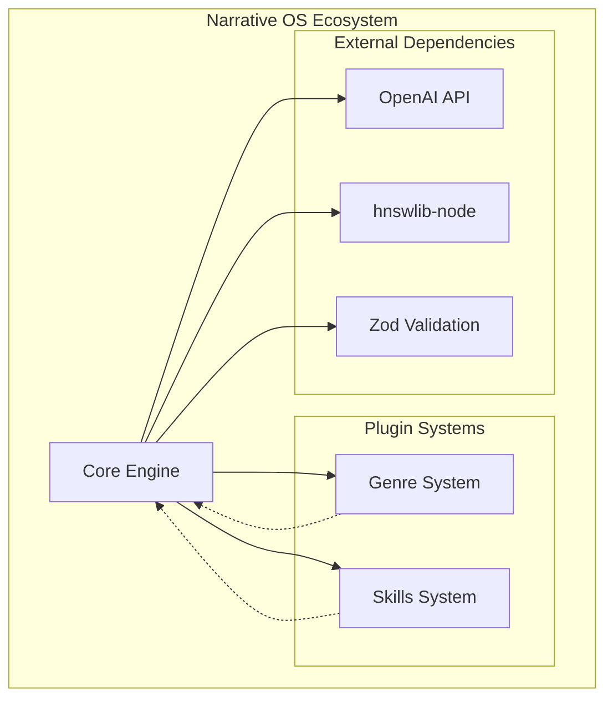
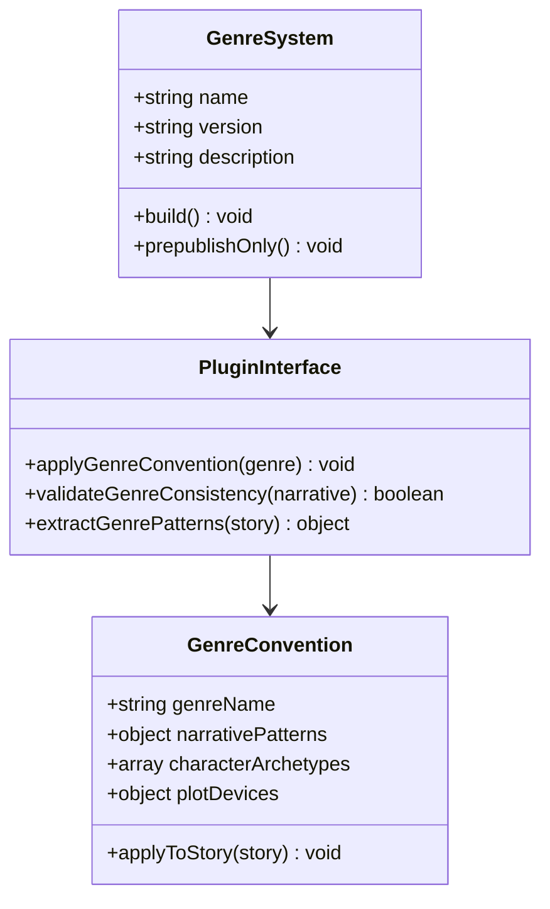
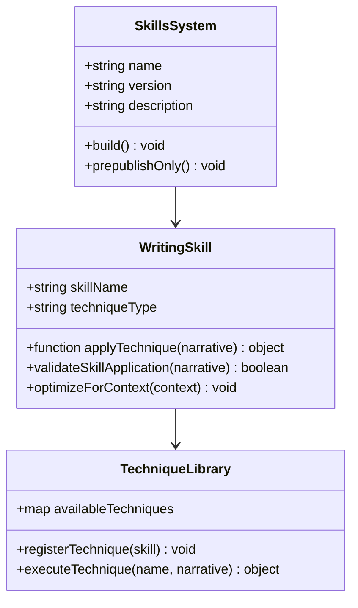
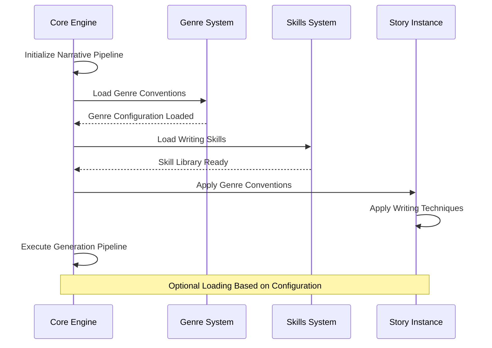

# Genre and Skills Systems

<cite>
**Referenced Files in This Document**
- [README.md](file://README.md)
- [package.json](file://packages/genres/package.json)
- [package.json](file://packages/skills/package.json)
- [package.json](file://packages/engine/package.json)
</cite>

## Table of Contents
1. [Introduction](#introduction)
2. [System Architecture](#system-architecture)
3. [Genre System Overview](#genre-system-overview)
4. [Skills System Overview](#skills-system-overview)
5. [Integration Architecture](#integration-architecture)
6. [Package Structure Analysis](#package-structure-analysis)
7. [Implementation Details](#implementation-details)
8. [Usage Patterns](#usage-patterns)
9. [Development Guidelines](#development-guidelines)
10. [Conclusion](#conclusion)

## Introduction

The Genre and Skills systems are fundamental components of the Narrative OS ecosystem that provide specialized knowledge and writing techniques for AI-powered story generation. These systems work together to enhance the narrative intelligence of the core engine by offering genre-specific conventions and writing skill plugins.

Narrative OS is designed as an AI-native narrative engine that maintains persistent memory, autonomous world simulation, and logical consistency enforcement for long-form story generation. The Genre and Skills systems serve as plugin architectures that extend the core capabilities of the narrative engine.

## System Architecture

The Genre and Skills systems operate as optional plugin packages that integrate seamlessly with the core Narrative OS engine. Both systems follow a modular architecture pattern that allows for easy extension and customization of narrative capabilities.

**Diagram sources**
- [package.json:35-43](file://packages/engine/package.json#L35-L43)

## Genre System Overview

The Genre system serves as a convention pack that provides genre-specific knowledge bases and narrative frameworks for the AI story generation process. While the current implementation appears to be in early development stages, the system is designed to support various literary genres including mystery, romance, thriller, and other narrative forms.

### Core Functionality

The Genre system operates as a plugin architecture that extends the core engine's capabilities by providing:

- Genre-specific narrative conventions and patterns
- Story structure templates tailored to specific genres
- Character archetype guidelines appropriate for different narrative types
- Setting and atmosphere descriptors aligned with genre expectations
- Plot device and conflict resolution patterns

### Package Structure

The Genre system is packaged as a separate npm module with the following characteristics:

**Diagram sources**
- [package.json:1-29](file://packages/genres/package.json#L1-L29)

**Section sources**
- [package.json:1-29](file://packages/genres/package.json#L1-L29)

## Skills System Overview

The Skills system provides writing technique plugins that enhance the AI's narrative capabilities through specialized writing approaches and methodologies. This system focuses on teaching the AI various writing skills such as dialogue crafting, scene construction, character development, and narrative pacing.

### Writing Techniques

The Skills system encompasses various writing methodologies that can be applied to improve story quality:

- **Dialogue Mastery**: Advanced techniques for natural and compelling conversations
- **Scene Construction**: Methods for building immersive and engaging scenes
- **Character Development**: Approaches for creating three-dimensional characters
- **Narrative Pacing**: Control over story rhythm and tension building
- **Descriptive Writing**: Techniques for vivid world-building and atmosphere
- **Plot Device Usage**: Strategic deployment of narrative elements

### Plugin Architecture

The Skills system follows a modular plugin pattern that allows for individual skill components to be loaded and applied independently:

**Diagram sources**
- [package.json:1-27](file://packages/skills/package.json#L1-L27)

**Section sources**
- [package.json:1-27](file://packages/skills/package.json#L1-L27)

## Integration Architecture

The Genre and Skills systems integrate with the core Narrative OS engine through a well-defined plugin architecture. The integration leverages the engine's optional dependency system to load and apply genre conventions and writing skills during the story generation process.

### Dependency Integration

Both systems are declared as optional dependencies in the core engine, allowing for flexible loading and application:

**Diagram sources**
- [package.json:40-43](file://packages/engine/package.json#L40-L43)

### Configuration Management

The integration supports dynamic configuration through the engine's settings system, allowing users to specify which genre conventions and writing skills to apply during story generation.

**Section sources**
- [package.json:40-43](file://packages/engine/package.json#L40-L43)

## Package Structure Analysis

Both the Genre and Skills systems follow standardized npm package structures optimized for TypeScript development and distribution. The packages are configured for seamless integration within the broader Narrative OS ecosystem.

### Package Metadata

The package configurations reveal important information about the systems' intended functionality and integration points:

| Package | Version | Main Entry | Keywords |
|---------|---------|------------|----------|
| @narrative-os/genres | 0.0.1 | dist/index.js | narrative, genre, plugins, story |
| @narrative-os/skills | 0.0.1 | dist/index.js | narrative, writing, skills, plugins |

### Build Configuration

Both packages utilize TypeScript compilation with standardized build scripts:

- **Build Command**: `tsc` - TypeScript compiler
- **Pre-publish Hook**: Runs build before package publishing
- **Type Definitions**: Generated for proper TypeScript support

**Section sources**
- [package.json:10-13](file://packages/genres/package.json#L10-L13)
- [package.json:10-13](file://packages/skills/package.json#L10-L13)

## Implementation Details

The Genre and Skills systems represent foundational components that extend the core Narrative OS capabilities. While the current implementation appears to be in early development stages, the architectural patterns indicate a sophisticated approach to narrative enhancement.

### Development Status

Based on the package configurations, both systems are currently at version 0.0.1, indicating early development phases. The packages are configured for TypeScript compilation and include standard npm scripts for build and publication processes.

### Integration Points

The systems are designed to integrate with the core engine through:

- **Optional Dependencies**: Declared in engine's package.json
- **Plugin Architecture**: Modular loading and application
- **Configuration System**: Dynamic activation based on user preferences
- **Pipeline Integration**: Seamless incorporation into generation workflow

**Section sources**
- [package.json:1-29](file://packages/genres/package.json#L1-L29)
- [package.json:1-27](file://packages/skills/package.json#L1-L27)
- [package.json:40-43](file://packages/engine/package.json#L40-L43)

## Usage Patterns

The Genre and Skills systems are designed to be used dynamically based on user requirements and story context. The systems support both automatic application and manual selection of narrative techniques.

### Automatic Application

The core engine can automatically apply appropriate genre conventions and writing skills based on story metadata and configuration settings.

### Manual Selection

Users can manually specify which genre conventions and writing skills to apply, allowing for fine-tuned control over the narrative generation process.

### Contextual Adaptation

The systems adapt their application based on story context, character development, plot progression, and other narrative factors to maintain consistency and effectiveness.

## Development Guidelines

For developers working with or extending the Genre and Skills systems, the following guidelines ensure compatibility and effective integration:

### Package Development

- Follow the existing package structure and naming conventions
- Maintain TypeScript type definitions for proper integration
- Use the standard build scripts for consistent compilation
- Keep versioning synchronized with the core engine when appropriate

### Plugin Design

- Design plugins to be stateless and idempotent
- Ensure backward compatibility with core engine APIs
- Provide clear error handling and validation
- Document plugin interfaces and usage patterns

### Testing and Quality

- Include comprehensive test coverage for plugin functionality
- Validate integration with the core engine pipeline
- Test performance impact of plugin applications
- Ensure proper error handling and graceful degradation

## Conclusion

The Genre and Skills systems represent essential components of the Narrative OS ecosystem that provide specialized knowledge and writing techniques for AI-powered story generation. While currently in early development stages, these systems demonstrate sophisticated architectural patterns that support the core narrative engine's capabilities.

The modular design allows for flexible integration and extension, supporting both automated and manual application of genre conventions and writing skills. As the Narrative OS continues to evolve, these systems will likely become increasingly important for creating high-quality, genre-appropriate narratives through AI assistance.

The current implementation establishes a solid foundation for future enhancements, with clear pathways for expanding genre support, adding new writing techniques, and improving the integration with the core narrative generation pipeline.