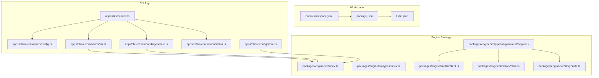
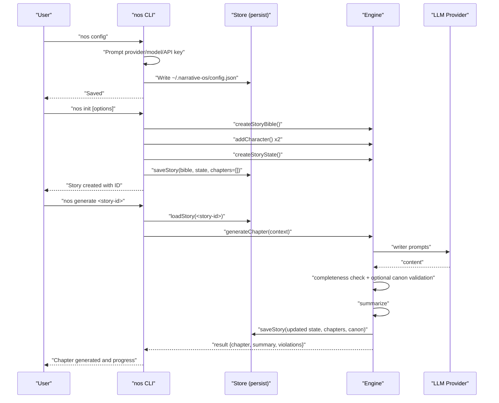
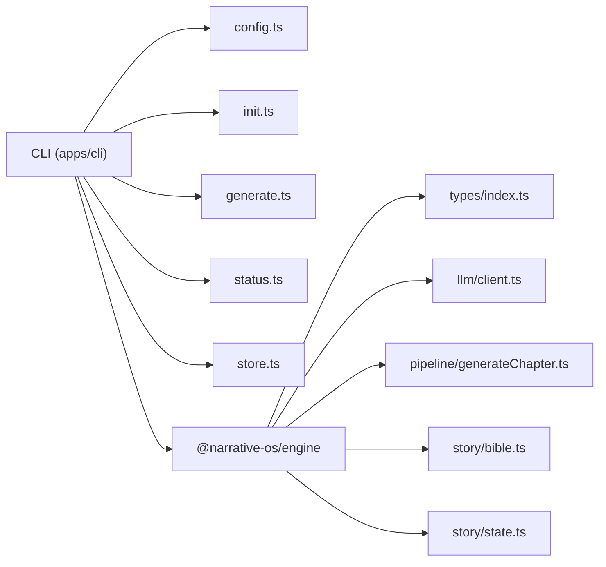

# Getting Started

<cite>
**Referenced Files in This Document**
- [README.md](file://README.md)
- [apps/cli/src/index.ts](file://apps/cli/src/index.ts)
- [apps/cli/package.json](file://apps/cli/package.json)
- [apps/cli/src/commands/config.ts](file://apps/cli/src/commands/config.ts)
- [apps/cli/src/commands/init.ts](file://apps/cli/src/commands/init.ts)
- [apps/cli/src/commands/generate.ts](file://apps/cli/src/commands/generate.ts)
- [apps/cli/src/commands/status.ts](file://apps/cli/src/commands/status.ts)
- [apps/cli/src/config/store.ts](file://apps/cli/src/config/store.ts)
- [packages/engine/src/index.ts](file://packages/engine/src/index.ts)
- [packages/engine/src/llm/client.ts](file://packages/engine/src/llm/client.ts)
- [packages/engine/src/pipeline/generateChapter.ts](file://packages/engine/src/pipeline/generateChapter.ts)
- [packages/engine/src/story/bible.ts](file://packages/engine/src/story/bible.ts)
- [packages/engine/src/story/state.ts](file://packages/engine/src/story/state.ts)
- [packages/engine/src/types/index.ts](file://packages/engine/src/types/index.ts)
- [package.json](file://package.json)
- [pnpm-workspace.yaml](file://pnpm-workspace.yaml)
- [turbo.json](file://turbo.json)
- [install.ps1](file://install.ps1)
- [publish.ps1](file://publish.ps1)
- [publish.sh](file://publish.sh)
</cite>

## Update Summary
**Changes Made**
- Updated Installation section to reflect simplified and improved installation process from README.md
- Added clear distinction between npm installation and build-from-source options
- Enhanced first-time setup instructions with clearer prerequisites
- Updated troubleshooting section with new installation-related guidance

## Table of Contents
1. [Introduction](#introduction)
2. [Installation Options](#installation-options)
3. [First-Time Setup](#first-time-setup)
4. [Project Structure](#project-structure)
5. [Core Components](#core-components)
6. [Architecture Overview](#architecture-overview)
7. [Detailed Component Analysis](#detailed-component-analysis)
8. [Dependency Analysis](#dependency-analysis)
9. [Performance Considerations](#performance-considerations)
10. [Troubleshooting Guide](#troubleshooting-guide)
11. [Conclusion](#conclusion)
12. [Appendices](#appendices)

## Introduction
This guide helps you install and use the Narrative Operating System CLI tool ("nos") to create and grow stories powered by AI. You will configure your LLM provider, initialize a story with rich metadata and characters, and generate chapters iteratively. We also cover environment setup, workspace installation via PNPM, and troubleshooting common issues.

Prerequisites:
- Basic command-line familiarity
- Understanding of TypeScript fundamentals (classes, interfaces, modules)
- Access to an OpenAI or DeepSeek API key

## Installation Options

**Option 1: Install from npm (Recommended - Easiest)**

This is the fastest way to get started with Narrative OS. Requires Node.js 20+ and installs the CLI globally.

```bash
# Install globally from npm
npm install -g @narrative-os/cli

# Configure your LLM provider
nos config

# Start creating stories!
nos init --title "My Adventure" --chapters 10
```

That's it! The `nos` command is now available everywhere.

**Option 2: Build from Source**

If you want to contribute or modify the code, follow these steps:

**With npm:**
```bash
# Clone the repository
git clone https://github.com/liwonder/NARRITIVE_OS.git
cd narrative_os

# Install and build
npm install
npm run build

# Install CLI globally from local source
npm install -g ./apps/cli

# Use it!
nos --help
```

**With pnpm:**
```bash
# Clone and install
git clone https://github.com/liwonder/NARRITIVE_OS.git
cd narrative_os
pnpm install
pnpm build

# Install CLI globally
pnpm add -g ./apps/cli

# Use it!
nos --help
```

**Requirements:**
- Node.js 20+
- pnpm 9.0+ (optional but recommended)
- DeepSeek API key (or OpenAI)
- Visual Studio 2022 with C++ build tools (for hnswlib-node)

**Section sources**
- [README.md:47-117](file://README.md#L47-L117)
- [apps/cli/package.json:37-39](file://apps/cli/package.json#L37-L39)
- [install.ps1:10-51](file://install.ps1#L10-L51)

## First-Time Setup

After installation, configure your LLM provider and test the installation:

```bash
# Configure your LLM provider (DeepSeek recommended)
nos config

# Test the installation
nos
```

**Section sources**
- [README.md:102-110](file://README.md#L102-L110)
- [apps/cli/src/index.ts:17-30](file://apps/cli/src/index.ts#L17-L30)

## Project Structure
The project is a PNPM workspace with two main areas:
- apps/cli: The nos CLI application
- packages/engine: The narrative engine that powers story creation, chapter generation, and LLM orchestration



**Diagram sources**
- [pnpm-workspace.yaml:1-4](file://pnpm-workspace.yaml#L1-L4)
- [package.json:1-17](file://package.json#L1-L17)
- [turbo.json:1-19](file://turbo.json#L1-L19)
- [apps/cli/src/index.ts:1-54](file://apps/cli/src/index.ts#L1-L54)
- [apps/cli/src/commands/config.ts:1-84](file://apps/cli/src/commands/config.ts#L1-L84)
- [apps/cli/src/commands/init.ts:1-50](file://apps/cli/src/commands/init.ts#L1-L50)
- [apps/cli/src/commands/generate.ts:1-55](file://apps/cli/src/commands/generate.ts#L1-L55)
- [apps/cli/src/commands/status.ts:1-55](file://apps/cli/src/commands/status.ts#L1-L55)
- [apps/cli/src/config/store.ts:1-78](file://apps/cli/src/config/store.ts#L1-L78)
- [packages/engine/src/index.ts:1-23](file://packages/engine/src/index.ts#L1-L23)
- [packages/engine/src/llm/client.ts:1-106](file://packages/engine/src/llm/client.ts#L1-L106)
- [packages/engine/src/pipeline/generateChapter.ts:1-76](file://packages/engine/src/pipeline/generateChapter.ts#L1-L76)
- [packages/engine/src/story/bible.ts:1-73](file://packages/engine/src/story/bible.ts#L1-L73)
- [packages/engine/src/story/state.ts:1-30](file://packages/engine/src/story/state.ts#L1-L30)
- [packages/engine/src/types/index.ts:1-90](file://packages/engine/src/types/index.ts#L1-L90)

**Section sources**
- [pnpm-workspace.yaml:1-4](file://pnpm-workspace.yaml#L1-L4)
- [package.json:1-17](file://package.json#L1-L17)
- [turbo.json:1-19](file://turbo.json#L1-L19)
- [apps/cli/src/index.ts:1-54](file://apps/cli/src/index.ts#L1-L54)

## Core Components
- CLI entrypoint defines the nos commands and wires configuration application.
- Configuration command stores provider, model, and API keys in a user-local config file.
- Init command creates a story bible, adds characters, initializes state, and persists the story.
- Generate command produces the next chapter, validates against canon, updates state, and persists results.
- Status command lists or prints details for a given story.
- Store module manages per-story directories and JSON persistence.
- Engine exports story creation, state management, LLM client, and the chapter generation pipeline.

**Section sources**
- [apps/cli/src/index.ts:1-54](file://apps/cli/src/index.ts#L1-L54)
- [apps/cli/src/commands/config.ts:1-84](file://apps/cli/src/commands/config.ts#L1-L84)
- [apps/cli/src/commands/init.ts:1-50](file://apps/cli/src/commands/init.ts#L1-L50)
- [apps/cli/src/commands/generate.ts:1-55](file://apps/cli/src/commands/generate.ts#L1-L55)
- [apps/cli/src/commands/status.ts:1-55](file://apps/cli/src/commands/status.ts#L1-L55)
- [apps/cli/src/config/store.ts:1-78](file://apps/cli/src/config/store.ts#L1-L78)
- [packages/engine/src/index.ts:1-23](file://packages/engine/src/index.ts#L1-L23)

## Architecture Overview
The CLI orchestrates user actions and delegates to the engine for story and chapter lifecycle management. The engine encapsulates LLM interactions, story metadata, and the generation pipeline.



**Diagram sources**
- [apps/cli/src/commands/config.ts:38-66](file://apps/cli/src/commands/config.ts#L38-L66)
- [apps/cli/src/commands/init.ts:23-48](file://apps/cli/src/commands/init.ts#L23-L48)
- [apps/cli/src/commands/generate.ts:4-53](file://apps/cli/src/commands/generate.ts#L4-L53)
- [apps/cli/src/config/store.ts:15-26](file://apps/cli/src/config/store.ts#L15-L26)
- [packages/engine/src/pipeline/generateChapter.ts:20-71](file://packages/engine/src/pipeline/generateChapter.ts#L20-L71)
- [packages/engine/src/llm/client.ts:31-81](file://packages/engine/src/llm/client.ts#L31-L81)

## Detailed Component Analysis

### Initial Configuration (LLM Providers)
- The CLI writes a user-local configuration file containing provider, model, and API key.
- On startup, the CLI reads the config and sets environment variables consumed by the engine's LLM client.

Supported providers and models:
- OpenAI: gpt-4o, gpt-4o-mini, gpt-4-turbo
- DeepSeek: deepseek-chat, deepseek-reasoner

Environment variables set:
- LLM_PROVIDER, LLM_MODEL
- OPENAI_API_KEY for OpenAI
- DEEPSEEK_API_KEY for DeepSeek

Verification:
- After running the configuration command, confirm the config file exists and contains the selected provider and model.
- Confirm environment variables are applied by running the CLI again.

**Section sources**
- [apps/cli/src/commands/config.ts:14-22](file://apps/cli/src/commands/config.ts#L14-L22)
- [apps/cli/src/commands/config.ts:72-83](file://apps/cli/src/commands/config.ts#L72-L83)
- [packages/engine/src/llm/client.ts:46-65](file://packages/engine/src/llm/client.ts#L46-L65)

### First Story Creation Workflow
- Initialize a story with metadata (title, theme, genre, setting, tone, premise) and target chapter count.
- Add characters (e.g., protagonist and antagonist) with roles, personality traits, and goals.
- Persist the story and receive a story ID for subsequent generation.

Practical example parameters:
- Title: "The Memory Cartographer"
- Theme: "Identity and legacy"
- Genre: "Speculative Fiction"
- Setting: "Neo-Athens, 2157"
- Tone: "Melancholic, hopeful"
- Premise: "A memory architect discovers a hidden archive that rewrites the past."
- Target chapters: 5–10

Next step:
- Use the story ID to generate the first chapter.

**Section sources**
- [apps/cli/src/commands/init.ts:15-21](file://apps/cli/src/commands/init.ts#L15-L21)
- [apps/cli/src/commands/init.ts:23-48](file://apps/cli/src/commands/init.ts#L23-L48)
- [packages/engine/src/story/bible.ts:3-26](file://packages/engine/src/story/bible.ts#L3-L26)
- [packages/engine/src/story/bible.ts:28-48](file://packages/engine/src/story/bible.ts#L28-L48)

### Generating Chapters
- The CLI loads the story, checks if the story is complete, and prepares a generation context.
- The engine generates content, validates completeness, optionally validates against canon, summarizes, and persists results.
- Progress is printed, including chapter title, word count, and summary.

Typical flow:
- Run "nos generate <story-id>" to produce the next chapter.
- Repeat until the story reaches the target chapter count.

**Section sources**
- [apps/cli/src/commands/generate.ts:4-53](file://apps/cli/src/commands/generate.ts#L4-L53)
- [packages/engine/src/pipeline/generateChapter.ts:20-71](file://packages/engine/src/pipeline/generateChapter.ts#L20-L71)
- [packages/engine/src/llm/client.ts:78-95](file://packages/engine/src/llm/client.ts#L78-L95)

### Managing Stories (List and Inspect)
- List all stories or inspect a specific story's details, progress, and recent summaries.
- Useful for verifying persistence and tracking completion.

**Section sources**
- [apps/cli/src/commands/status.ts:3-54](file://apps/cli/src/commands/status.ts#L3-L54)
- [apps/cli/src/config/store.ts:51-75](file://apps/cli/src/config/store.ts#L51-L75)

### Persistence and Data Model
- Stories are stored under a user-local directory with per-story JSON files for bible, state, chapters, and optional canon.
- The engine can also extract a default canon from the story bible.

**Section sources**
- [apps/cli/src/config/store.ts:15-26](file://apps/cli/src/config/store.ts#L15-L26)
- [apps/cli/src/config/store.ts:28-49](file://apps/cli/src/config/store.ts#L28-L49)
- [packages/engine/src/index.ts:21-22](file://packages/engine/src/index.ts#L21-L22)

## Dependency Analysis
The CLI depends on the engine package and uses the commander library for CLI parsing. The engine encapsulates LLM configuration, story modeling, and the generation pipeline.



**Diagram sources**
- [apps/cli/src/index.ts:3-7](file://apps/cli/src/index.ts#L3-L7)
- [apps/cli/src/commands/config.ts:1-3](file://apps/cli/src/commands/config.ts#L1-L3)
- [apps/cli/src/commands/init.ts:1-2](file://apps/cli/src/commands/init.ts#L1-L2)
- [apps/cli/src/commands/generate.ts:1-2](file://apps/cli/src/commands/generate.ts#L1-L2)
- [apps/cli/src/commands/status.ts:1-1](file://apps/cli/src/commands/status.ts#L1-L1)
- [apps/cli/src/config/store.ts:1-5](file://apps/cli/src/config/store.ts#L1-L5)
- [packages/engine/src/index.ts:1-23](file://packages/engine/src/index.ts#L1-L23)

**Section sources**
- [apps/cli/package.json:12-16](file://apps/cli/package.json#L12-L16)
- [packages/engine/src/index.ts:1-23](file://packages/engine/src/index.ts#L1-L23)

## Performance Considerations
- Generation cost and latency depend on the selected model and prompt length. Larger models may increase token usage.
- The generator retries to ensure completeness up to a configured limit; this increases runtime but improves quality.
- Persisting frequently after each chapter keeps data safe but adds disk I/O overhead.

## Troubleshooting Guide

### Installation Issues

**npm install fails with permission errors:**
- Try using sudo (macOS/Linux) or run as administrator (Windows)
- Consider using a Node.js version manager like nvm
- Clear npm cache: `npm cache clean --force`

**pnpm not found error:**
- Install pnpm globally: `npm install -g pnpm@9.0+`
- Restart your terminal after installation
- Check that pnpm is in your PATH

**Node.js version compatibility:**
- Ensure Node.js 20+ is installed: `node --version`
- If using nvm: `nvm install 20 && nvm use 20`
- Some native dependencies require newer Node.js versions

**Visual Studio build tools missing:**
- Install Visual Studio 2022 with C++ build tools
- Or install Windows Build Tools: `npm install -g windows-build-tools`
- For Linux: `sudo apt-get install build-essential`

### Workspace Build Issues
- Ensure PNPM is installed and the workspace is linked
- Rebuild the engine and CLI packages if changes are not reflected
- Clear node_modules and reinstall: `rm -rf node_modules && pnpm install`

### Configuration Errors
- Re-run the configuration command to set provider, model, and API key
- Confirm environment variables are set by the CLI's applyConfig routine

### LLM Provider Failures
- Check that the API key is valid and the model is supported by the provider
- Confirm network connectivity and rate limits

### Story Not Found When Generating
- Verify the story ID exists by listing stories or checking the local storage directory
- Ensure the story was created with the init command and persisted successfully

### Verification Steps
- Use the status command to list stories and confirm progress
- Confirm the presence of story JSON files in the local stories directory

**Section sources**
- [README.md:47-117](file://README.md#L47-L117)
- [apps/cli/src/commands/generate.ts:7-10](file://apps/cli/src/commands/generate.ts#L7-L10)
- [apps/cli/src/commands/status.ts:4-21](file://apps/cli/src/commands/status.ts#L4-L21)
- [apps/cli/src/commands/config.ts:72-83](file://apps/cli/src/commands/config.ts#L72-L83)
- [packages/engine/src/llm/client.ts:46-65](file://packages/engine/src/llm/client.ts#L46-L65)

## Conclusion
You now have the essentials to install the CLI using either the recommended npm installation or build from source, configure an LLM provider, initialize a story, and generate chapters iteratively. Use the status command to track progress and rely on the engine's built-in validation and summarization to maintain narrative coherence. As you become more comfortable, explore advanced options in the init command and experiment with different models and prompts.

## Appendices

### Quick Start Checklist
- Choose installation method (npm recommended)
- Install PNPM and workspace dependencies (if building from source)
- Configure provider and API key via the CLI
- Initialize a story with desired metadata and characters
- Generate the first chapter and iterate until completion
- Use status to monitor progress

**Section sources**
- [README.md:47-117](file://README.md#L47-L117)
- [apps/cli/src/index.ts:18-43](file://apps/cli/src/index.ts#L18-L43)
- [apps/cli/src/commands/config.ts:38-66](file://apps/cli/src/commands/config.ts#L38-L66)
- [apps/cli/src/commands/init.ts:15-48](file://apps/cli/src/commands/init.ts#L15-L48)
- [apps/cli/src/commands/generate.ts:4-53](file://apps/cli/src/commands/generate.ts#L4-L53)
- [apps/cli/src/commands/status.ts:3-54](file://apps/cli/src/commands/status.ts#L3-L54)