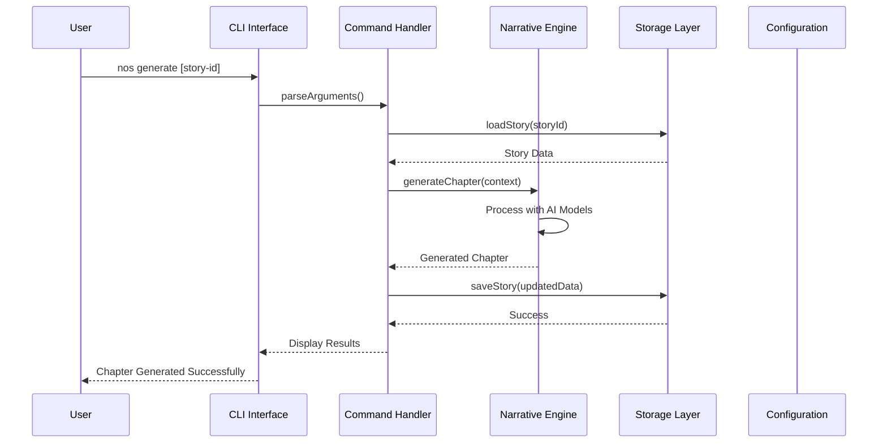
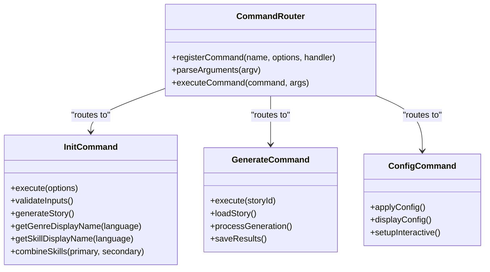
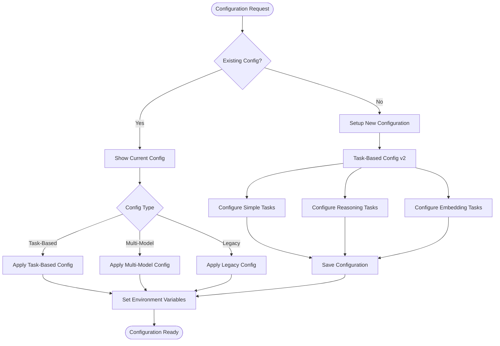
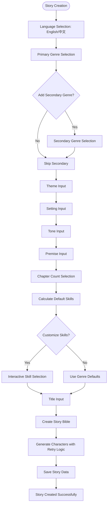
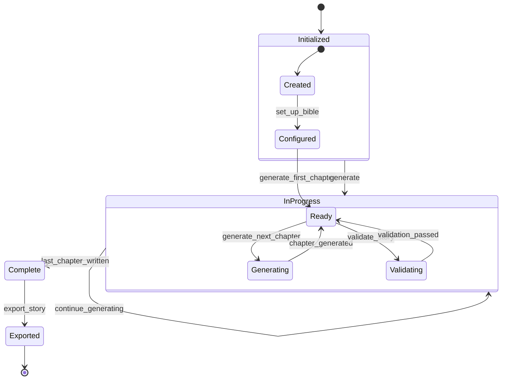
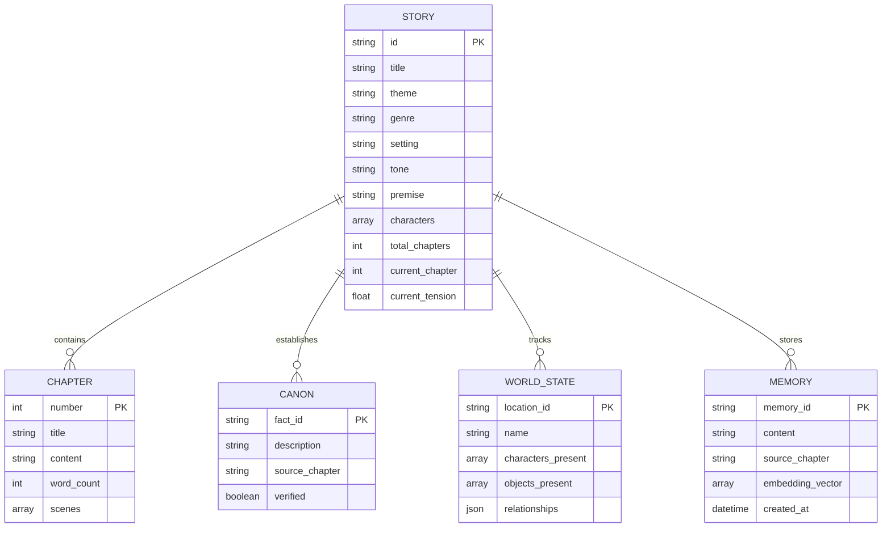

# CLI Documentation

<cite>
**Referenced Files in This Document**
- [package.json](file://apps/cli/package.json)
- [README.md](file://apps/cli/README.md)
- [tsconfig.json](file://apps/cli/tsconfig.json)
- [index.ts](file://apps/cli/src/index.ts)
- [store.ts](file://apps/cli/src/config/store.ts)
- [init.ts](file://apps/cli/src/commands/init.ts)
- [generate.ts](file://apps/cli/src/commands/generate.ts)
- [config.ts](file://apps/cli/src/commands/config.ts)
- [list.ts](file://apps/cli/src/commands/list.ts)
- [use.ts](file://apps/cli/src/commands/use.ts)
- [read.ts](file://apps/cli/src/commands/read.ts)
- [export.ts](file://apps/cli/src/commands/export.ts)
- [hint.ts](file://apps/cli/src/commands/hint.ts)
- [version.ts](file://apps/cli/src/commands/version.ts)
- [status.ts](file://apps/cli/src/commands/status.ts)
</cite>

## Update Summary
**Changes Made**
- Updated Interactive Initialization System section to reflect new multilingual CLI with language selection
- Enhanced Skills Selection section with customizable skill selection and intelligent defaults
- Updated Configuration System section to reflect task-based configuration improvements
- Updated Storage and Persistence section to reflect unlimited chapter support
- Enhanced Troubleshooting Guide with multilingual support considerations
- Updated Feature List to reflect new capabilities

## Table of Contents
1. [Introduction](#introduction)
2. [Project Structure](#project-structure)
3. [Core Components](#core-components)
4. [Architecture Overview](#architecture-overview)
5. [Detailed Component Analysis](#detailed-component-analysis)
6. [Dependency Analysis](#dependency-analysis)
7. [Performance Considerations](#performance-considerations)
8. [Troubleshooting Guide](#troubleshooting-guide)
9. [Conclusion](#conclusion)

## Introduction
The Narrative OS CLI is an AI-native command-line interface designed for long-form story generation. It provides a complete workflow for creating, managing, and exporting narratives with advanced features like multi-model AI support, persistent memory, and structured storytelling state management. The CLI integrates with the Narrative OS engine to deliver sophisticated narrative generation capabilities while maintaining a simple and intuitive command structure.

**Updated** The CLI now features a comprehensive multilingual initialization system supporting both English and Chinese languages, with intelligent genre selection, optional secondary genres, and customizable skill selection for enhanced creative control. The system supports unlimited chapter generation without the previous 200-chapter limitation.

## Project Structure
The CLI follows a modular architecture with clear separation between command handlers, configuration management, and storage persistence:

```mermaid
graph TB
subgraph "CLI Application"
Index[index.ts - Main Entry Point]
subgraph "Command Handlers"
Init[init.ts - Multilingual Initialization]
Generate[generate.ts]
Config[config.ts - Task-Based Config]
List[list.ts]
Use[use.ts]
Read[read.ts]
Export[export.ts]
Hint[hint.ts]
Version[version.ts]
Status[status.ts]
end
subgraph "Configuration"
Store[store.ts - Persistence Layer]
ConfigFile[config.json - User Settings]
end
subgraph "External Dependencies"
Engine[@narrative-os/engine]
Prompts[@inquirer/prompts]
Commander[commander]
Genres[@narrative-os/genres]
Skills[@narrative-os/skills]
end
end
Index --> Init
Index --> Generate
Index --> Config
Index --> List
Index --> Use
Index --> Read
Index --> Export
Index --> Hint
Index --> Version
Index --> Status
Init --> Store
Generate --> Store
Config --> ConfigFile
List --> Store
Use --> Store
Read --> Store
Export --> Store
Status --> Store
Init --> Engine
Generate --> Engine
Config --> Engine
Read --> Engine
Export --> Engine
Status --> Engine
Init --> Genres
Init --> Skills
Index --> Prompts
Index --> Commander
```

**Diagram sources**
- [index.ts:1-177](file://apps/cli/src/index.ts#L1-L177)
- [store.ts:1-249](file://apps/cli/src/config/store.ts#L1-L249)
- [init.ts:1-228](file://apps/cli/src/commands/init.ts#L1-L228)

**Section sources**
- [package.json:1-54](file://apps/cli/package.json#L1-L54)
- [tsconfig.json:1-15](file://apps/cli/tsconfig.json#L1-L15)

## Core Components

### Command Registration System
The CLI uses the Commander library to define and manage all available commands. Each command is registered with specific options, descriptions, and action handlers.

### Configuration Management
The CLI supports multiple configuration modes including legacy single-model, multi-model, and modern task-based configurations with provider-specific routing.

### Storage Persistence
All story data is persisted in the user's home directory under `.narrative-os/stories/<story-id>/` with separate files for different data types.

**Updated** Enhanced with multilingual support for Chinese and English interfaces throughout the initialization and configuration processes. Storage now supports unlimited chapter files with per-chapter JSON organization for scalability.

**Section sources**
- [index.ts:21-177](file://apps/cli/src/index.ts#L21-L177)
- [config.ts:1-377](file://apps/cli/src/commands/config.ts#L1-L377)
- [store.ts:1-249](file://apps/cli/src/config/store.ts#L1-L249)

## Architecture Overview



**Diagram sources**
- [index.ts:90-104](file://apps/cli/src/index.ts#L90-L104)
- [generate.ts:1-91](file://apps/cli/src/commands/generate.ts#L1-L91)
- [store.ts:45-80](file://apps/cli/src/config/store.ts#L45-L80)

The architecture follows a clean separation of concerns with clear data flow between components:

1. **Input Layer**: Commander parses CLI arguments and routes to appropriate handlers
2. **Command Layer**: Individual command handlers orchestrate the workflow
3. **Engine Layer**: Narrative OS engine performs AI-powered generation
4. **Persistence Layer**: File-based storage manages story data
5. **Configuration Layer**: Environment and user settings management

## Detailed Component Analysis

### Command Registration and Routing
The main entry point registers all available commands with their respective options and descriptions. The system supports both synchronous and asynchronous command execution.



**Diagram sources**
- [index.ts:34-177](file://apps/cli/src/index.ts#L34-L177)

**Section sources**
- [index.ts:34-177](file://apps/cli/src/index.ts#L34-L177)

### Configuration System
The CLI supports three configuration modes with backward compatibility:



**Diagram sources**
- [config.ts:91-377](file://apps/cli/src/commands/config.ts#L91-L377)

**Section sources**
- [config.ts:1-377](file://apps/cli/src/commands/config.ts#L1-L377)

### Interactive Initialization System
**Updated** The CLI now features a comprehensive multilingual initialization system with intelligent defaults and genre-based skill selection:



**Diagram sources**
- [init.ts:47-228](file://apps/cli/src/commands/init.ts#L47-L228)

The initialization process now includes:

1. **Multilingual Support**: Users can choose between English and Chinese interfaces
2. **Genre Intelligence**: Primary and optional secondary genre selection with automatic skill recommendations
3. **Intelligent Defaults**: Automatic calculation of target chapter counts and skill sets based on genre combinations
4. **Customizable Skills**: Interactive skill selection with genre-based defaults
5. **Enhanced Validation**: Comprehensive input validation with language-specific messages
6. **Retry Logic**: Automatic retry mechanism for character generation failures with user control
7. **Unlimited Chapters**: Removed 200-chapter limitation for long-form storytelling

**Section sources**
- [init.ts:1-228](file://apps/cli/src/commands/init.ts#L1-L228)

### Story Management Commands
The CLI provides comprehensive story lifecycle management:



**Diagram sources**
- [init.ts:47-228](file://apps/cli/src/commands/init.ts#L47-L228)
- [generate.ts:4-91](file://apps/cli/src/commands/generate.ts#L4-L91)

**Section sources**
- [init.ts:1-228](file://apps/cli/src/commands/init.ts#L1-L228)
- [generate.ts:1-91](file://apps/cli/src/commands/generate.ts#L1-L91)

### Storage and Persistence
**Updated** The storage system maintains multiple data structures for different aspects of story management with unlimited chapter support:



**Diagram sources**
- [store.ts:15-80](file://apps/cli/src/config/store.ts#L15-L80)
- [store.ts:108-249](file://apps/cli/src/config/store.ts#L108-L249)

**Section sources**
- [store.ts:1-249](file://apps/cli/src/config/store.ts#L1-L249)

### Interactive Prompt System
**Updated** The CLI now features a sophisticated multilingual prompt system with genre-aware intelligence:

```mermaid
flowchart LR
Start([Command Execution]) --> Language[Language Selection: English/中文]
Language --> Genre[Genre Selection with Descriptions]
Genre --> Theme[Theme Input with Defaults]
Theme --> Setting[Setting Input with Defaults]
Setting --> Tone[Tone Input with Defaults]
Tone --> Premise[Premise Input with Validation]
Premise --> Chapters[Chapter Count Selection (Unlimited)]
Chapters --> Skills[Skills Selection with Genre Defaults]
Skills --> Title[Title Input with Validation]
Title --> Generate[Generate Story]
Generate --> Success[Story Created]
Success --> NextSteps[Display Next Steps in Selected Language]
NextSteps --> End([End])
```

**Diagram sources**
- [init.ts:47-228](file://apps/cli/src/commands/init.ts#L47-L228)

**Section sources**
- [init.ts:47-228](file://apps/cli/src/commands/init.ts#L47-L228)

## Dependency Analysis

```mermaid
graph TB
subgraph "CLI Package"
CLI_Pkg[apps/cli/package.json]
CLI_Index[src/index.ts]
end
subgraph "Engine Dependencies"
Engine[@narrative-os/engine]
Genres[@narrative-os/genres]
Skills[@narrative-os/skills]
end
subgraph "CLI Libraries"
Commander[commander]
Inquirer[@inquirer/prompts]
NodeTypes[@types/node]
TypeScript[typescript]
end
CLI_Pkg --> Engine
CLI_Pkg --> Genres
CLI_Pkg --> Skills
CLI_Pkg --> Commander
CLI_Pkg --> Inquirer
CLI_Pkg --> NodeTypes
CLI_Pkg --> TypeScript
CLI_Index --> Engine
CLI_Index --> Genres
CLI_Index --> Skills
CLI_Index --> Commander
CLI_Index --> Inquirer
```

**Diagram sources**
- [package.json:42-52](file://apps/cli/package.json#L42-L52)
- [index.ts:3-17](file://apps/cli/src/index.ts#L3-L17)

**Section sources**
- [package.json:1-54](file://apps/cli/package.json#L1-L54)
- [index.ts:1-177](file://apps/cli/src/index.ts#L1-L177)

## Performance Considerations
The CLI is optimized for efficient story generation and management:

- **Lazy Loading**: Commands are dynamically imported to reduce startup time
- **Memory Management**: Vector stores are loaded on-demand for memory operations
- **Batch Operations**: Multiple stories can be processed efficiently
- **Streaming Responses**: Large outputs are handled progressively
- **Caching**: Frequently accessed story data is cached in memory
- **Language Optimization**: Multilingual prompts are cached for improved response times
- **Scalable Storage**: Per-chapter JSON files support unlimited chapter generation without performance degradation

## Troubleshooting Guide

### Common Issues and Solutions

**Configuration Problems**
- Verify API keys are properly set in configuration
- Check provider availability and rate limits
- Ensure correct model selection for task type

**Story Management Issues**
- Use `nos list` to verify story existence
- Check story ID format and case sensitivity
- Validate story completion status

**Generation Failures**
- Monitor API quota limits
- Verify story prerequisites are met
- Check for conflicting story modifications
- **Updated** Character generation failures now include retry logic with user control

**Storage Issues**
- Verify sufficient disk space
- Check file permissions for storage directory
- Ensure proper cleanup of temporary files
- **Updated** Unlimited chapter storage automatically handles large numbers of chapter files

**Multilingual Issues**
- Ensure terminal supports UTF-8 encoding for Chinese characters
- Verify locale settings for proper language detection
- Check font support for extended character sets
- **Updated** Language selection is preserved throughout the initialization process

**Section sources**
- [config.ts:118-159](file://apps/cli/src/commands/config.ts#L118-L159)
- [generate.ts:7-14](file://apps/cli/src/commands/generate.ts#L7-L14)
- [store.ts:45-80](file://apps/cli/src/config/store.ts#L45-L80)

## Conclusion
The Narrative OS CLI provides a comprehensive solution for AI-powered story generation with a clean architecture, robust configuration management, and extensive feature set. Its modular design enables easy extensibility while maintaining simplicity for end users. The CLI successfully bridges the gap between powerful AI capabilities and accessible authoring tools, making sophisticated narrative generation available to writers of all technical levels.

**Updated** The recent enhancements to the multilingual initialization system, genre-based skill selection, intelligent defaults, retry logic for character generation, and unlimited chapter support significantly improve the user experience for both English and Chinese-speaking authors. The system's strength lies in its thoughtful separation of concerns, comprehensive error handling, user-friendly command structure, and intelligent automation that makes complex AI workflows accessible through simple, intuitive commands while respecting cultural and linguistic preferences.

The system's multilingual capabilities, combined with its genre-aware intelligence, customizable skill selection, and scalable storage architecture, represent a significant advancement in making AI-powered narrative generation truly accessible to a global audience while maintaining the sophisticated creative control that experienced authors require. The removal of chapter limitations and enhanced retry mechanisms ensures that writers can pursue ambitious long-form projects with confidence and reliability.