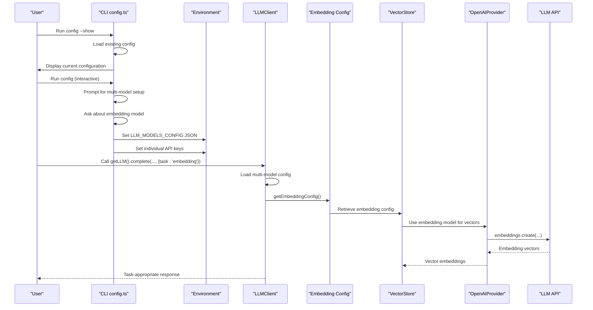
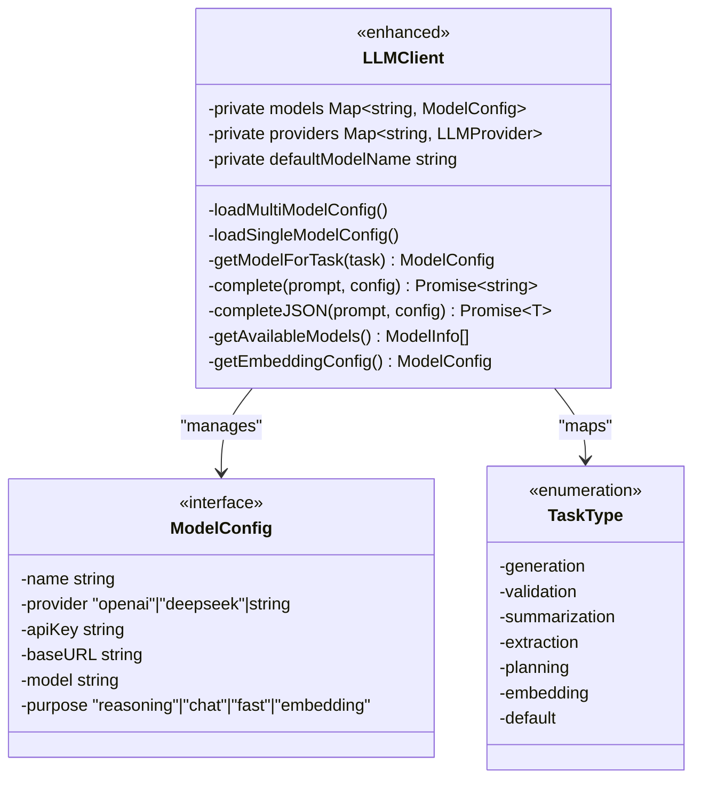
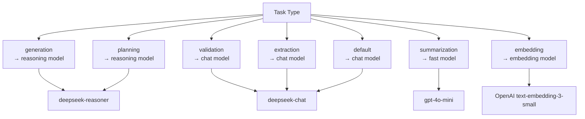
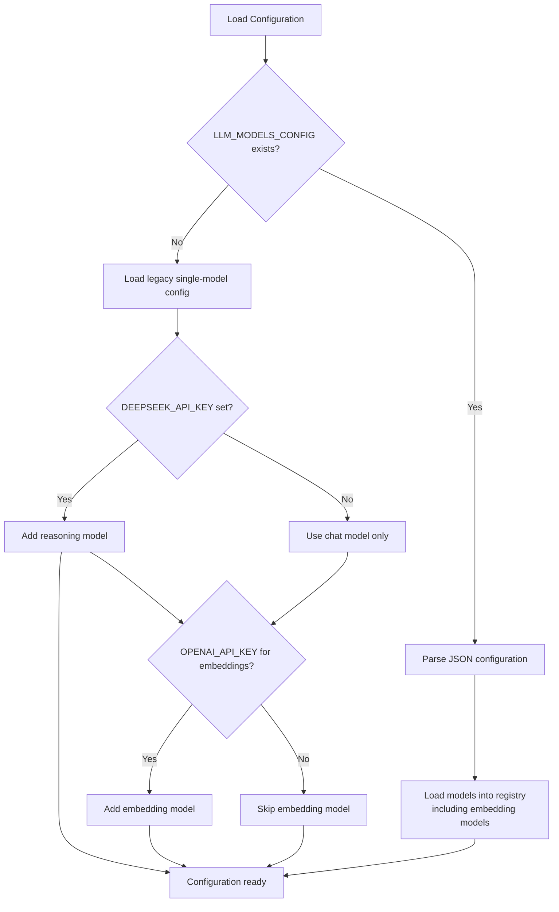
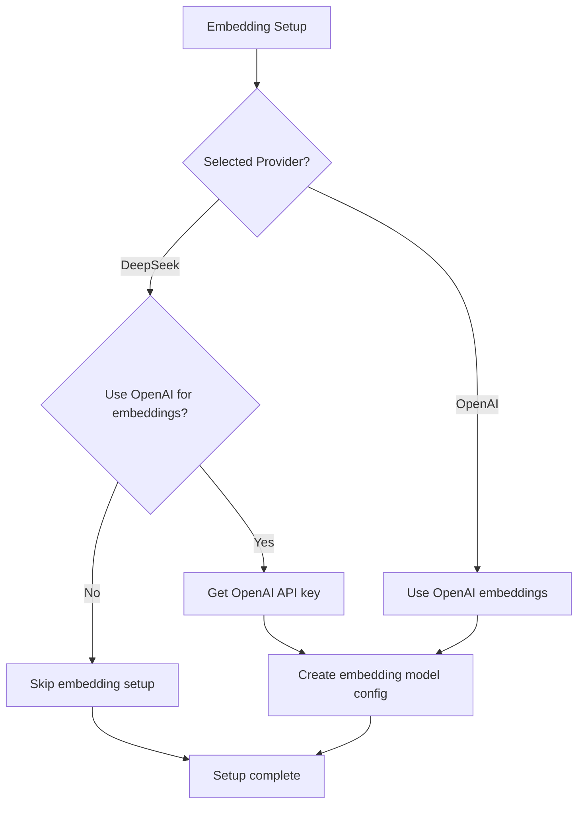
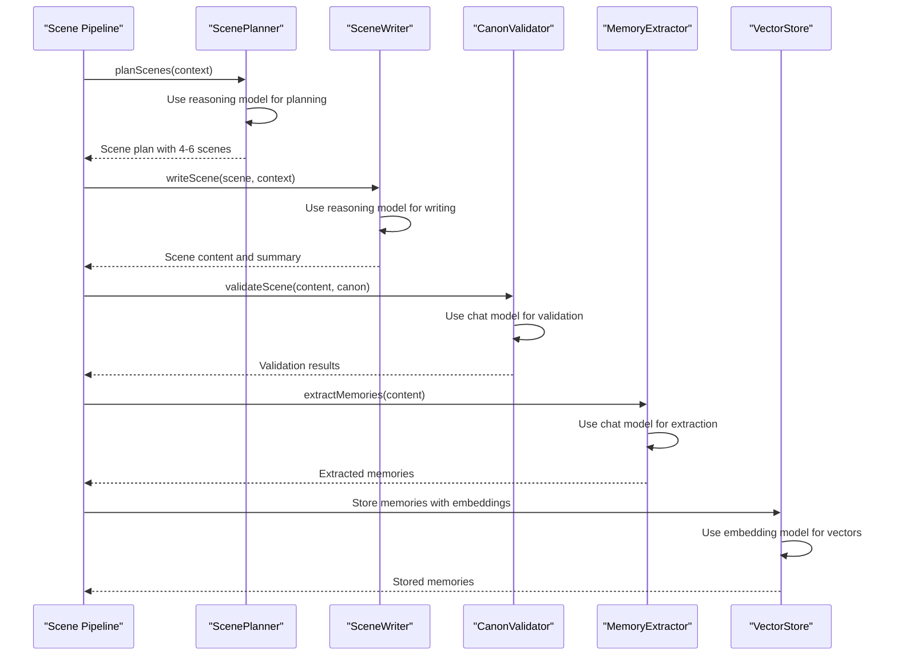
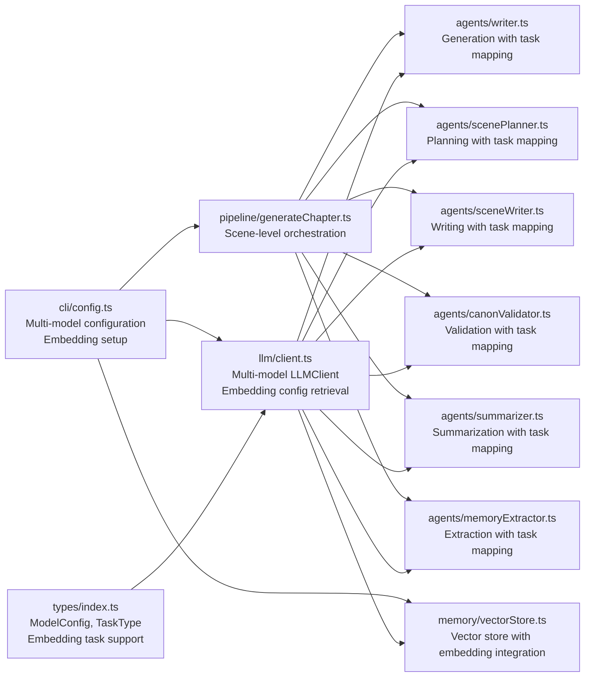

# LLM Integration and Configuration

<cite>
**Referenced Files in This Document**
- [client.ts](file://packages/engine/src/llm/client.ts)
- [types/index.ts](file://packages/engine/src/types/index.ts)
- [vectorStore.ts](file://packages/engine/src/memory/vectorStore.ts)
- [writer.ts](file://packages/engine/src/agents/writer.ts)
- [completeness.ts](file://packages/engine/src/agents/completeness.ts)
- [summarizer.ts](file://packages/engine/src/agents/summarizer.ts)
- [canonValidator.ts](file://packages/engine/src/agents/canonValidator.ts)
- [memoryExtractor.ts](file://packages/engine/src/agents/memoryExtractor.ts)
- [scenePlanner.ts](file://packages/engine/src/agents/scenePlanner.ts)
- [sceneWriter.ts](file://packages/engine/src/agents/sceneWriter.ts)
- [generateChapter.ts](file://packages/engine/src/pipeline/generateChapter.ts)
- [config.ts](file://apps/cli/src/commands/config.ts)
- [index.ts](file://apps/cli/src/index.ts)
</cite>

## Update Summary
**Changes Made**
- Enhanced LLM client with comprehensive multi-model configuration system supporting reasoning, chat, fast, and embedding models
- Added embedding task type to TaskType enumeration with dedicated embedding model routing
- Implemented embedding configuration retrieval through getEmbeddingConfig() method
- Enhanced CLI configuration with embedding model setup wizard and OpenAI embedding support
- Integrated vector store with embedding model configuration for memory management
- Improved task-specific model mapping with embedding support for vector operations
- Added embedding model purpose classification and backward compatibility

## Table of Contents
1. [Introduction](#introduction)
2. [Project Structure](#project-structure)
3. [Core Components](#core-components)
4. [Architecture Overview](#architecture-overview)
5. [Detailed Component Analysis](#detailed-component-analysis)
6. [Multi-Model Configuration System](#multi-model-configuration-system)
7. [Task-Specific Model Mapping](#task-specific-model-mapping)
8. [Enhanced Configuration System](#enhanced-configuration-system)
9. [Embedding Model Integration](#embedding-model-integration)
10. [Scene-Level Generation Pipeline](#scene-level-generation-pipeline)
11. [Dependency Analysis](#dependency-analysis)
12. [Performance Considerations](#performance-considerations)
13. [Troubleshooting Guide](#troubleshooting-guide)
14. [Conclusion](#conclusion)
15. [Appendices](#appendices)

## Introduction
This document explains the enhanced LLM integration and configuration within the Narrative Operating System. The system now features a comprehensive multi-model architecture supporting reasoning, chat, fast, and embedding models with task-specific mapping, while maintaining backward compatibility with legacy single-model configurations. It covers provider abstraction supporting OpenAI and DeepSeek, advanced configuration management for API keys and model parameters, and sophisticated prompt engineering strategies optimized for different task types.

The enhanced system introduces intelligent model selection based on task requirements, embedding model routing for vector operations, improved JSON content extraction from markdown code blocks, and a robust scene-level generation pipeline that leverages specialized models for different narrative components. The CLI configuration system now supports both single-model and multi-model setups with interactive wizards, embedding model configuration, and comprehensive show configuration capabilities.

## Project Structure
The enhanced LLM integration spans five primary areas:
- Engine LLM client and types define the provider abstraction, multi-model configuration, task-specific model mapping, and embedding model support.
- Agents consume the LLM client with automatic model selection based on task requirements including embedding tasks.
- CLI configuration manages both legacy single-model and modern multi-model setups with interactive wizards and embedding model configuration.
- Vector store integrates embedding model configuration for memory management and semantic search.
- Scene-level pipeline orchestrates generation with integrated multi-model support for planning, writing, and validation.

```mermaid
graph TB
subgraph "CLI"
IDX["index.ts<br/>Application entry point<br/>Auto-apply configuration"]
CFG["config.ts<br/>Multi-model config wizard<br/>Embedding setup<br/>Show configuration feature"]
end
subgraph "Engine"
TYPES["types/index.ts<br/>ModelConfig, MultiModelConfig<br/>TaskType enumeration<br/>Embedding task support"]
CLIENT["llm/client.ts<br/>LLMClient with multi-model support<br/>Embedding config retrieval<br/>Task mapping & model selection"]
PIPE["pipeline/generateChapter.ts<br/>Scene-level generation<br/>Multi-model orchestration"]
end
subgraph "Memory"
VECTOR["memory/vectorStore.ts<br/>Vector store with embedding integration<br/>Embedding model configuration"]
end
subgraph "Agents"
WR["agents/writer.ts<br/>Generation task (reasoning model)"]
SUM["agents/summarizer.ts<br/>Summarization task (fast model)"]
VAL["agents/canonValidator.ts<br/>Validation task (chat model)"]
MEM["agents/memoryExtractor.ts<br/>Extraction task (chat model)"]
PLAN["agents/scenePlanner.ts<br/>Planning task (reasoning model)"]
WRITE["agents/sceneWriter.ts<br/>Writing task (reasoning model)"]
end
subgraph "Configuration"
MODELS["Multi-Model Config<br/>reasoning: deepseek-reasoner<br/>chat: deepseek-chat<br/>fast: gpt-4o-mini<br/>embedding: OpenAI text-embedding-3-small"]
LEGACY["Legacy Config<br/>Single model fallback"]
END
IDX --> CFG
CFG --> CLIENT
PIPE --> WR
PIPE --> PLAN
PIPE --> WRITE
PIPE --> VAL
PIPE --> SUM
PIPE --> MEM
WR --> CLIENT
PLAN --> CLIENT
WRITE --> CLIENT
VAL --> CLIENT
SUM --> CLIENT
MEM --> CLIENT
VECTOR --> CLIENT
CLIENT --> MODELS
CLIENT --> LEGACY
```

**Diagram sources**
- [index.ts:17-17](file://apps/cli/src/index.ts#L17-L17)
- [config.ts:55-182](file://apps/cli/src/commands/config.ts#L55-L182)
- [client.ts:49-210](file://packages/engine/src/llm/client.ts#L49-L210)
- [generateChapter.ts:63-205](file://packages/engine/src/pipeline/generateChapter.ts#L63-L205)
- [vectorStore.ts:125-202](file://packages/engine/src/memory/vectorStore.ts#L125-L202)
- [writer.ts:103-107](file://packages/engine/src/agents/writer.ts#L103-L107)
- [summarizer.ts:27-31](file://packages/engine/src/agents/summarizer.ts#L27-L31)
- [canonValidator.ts:44-48](file://packages/engine/src/agents/canonValidator.ts#L44-L48)
- [memoryExtractor.ts:62-66](file://packages/engine/src/agents/memoryExtractor.ts#L62-L66)
- [scenePlanner.ts:82-85](file://packages/engine/src/agents/scenePlanner.ts#L82-L85)
- [sceneWriter.ts:85-88](file://packages/engine/src/agents/sceneWriter.ts#L85-L88)

**Section sources**
- [client.ts:49-210](file://packages/engine/src/llm/client.ts#L49-L210)
- [types/index.ts:91-115](file://packages/engine/src/types/index.ts#L91-L115)
- [config.ts:55-182](file://apps/cli/src/commands/config.ts#L55-L182)
- [index.ts:17-17](file://apps/cli/src/index.ts#L17-L17)
- [vectorStore.ts:125-202](file://packages/engine/src/memory/vectorStore.ts#L125-L202)

## Core Components
- **Multi-Model Provider Abstraction**: Enhanced LLMProvider interface with LLMClient supporting multiple models with different purposes (reasoning, chat, fast, embedding).
- **Task-Specific Model Mapping**: Intelligent model selection based on task types (generation, validation, summarization, extraction, planning, embedding).
- **Enhanced LLMClient**: Centralizes provider creation, multi-model configuration loading, completion helpers, and embedding configuration retrieval with robust JSON parsing.
- **Advanced Types**: ModelConfig and MultiModelConfig define comprehensive runtime configuration with purpose-based model categorization including embedding support.
- **Intelligent Agents**: All agents now support task parameter for automatic model selection based on their requirements, including embedding tasks.
- **Dual Configuration System**: Backward compatibility with legacy single-model configs while supporting modern multi-model setups with embedding model configuration.
- **Vector Store Integration**: Memory management system with embedding model configuration for semantic search and vector operations.

Key responsibilities:
- Dynamic model loading from environment variables or persisted CLI config with JSON configuration support including embedding models.
- Task-aware model selection using predefined mapping rules for optimal performance and cost, including embedding model routing.
- Provider selection and instantiation based on model configuration with support for multiple providers including OpenAI embedding support.
- Intelligent JSON parsing with extraction from markdown code blocks and robust error handling.
- Comprehensive backward compatibility with legacy single-model configurations.
- Scene-level generation pipeline integration with specialized model assignment for different phases.
- Embedding model configuration retrieval and integration with vector store operations.

**Section sources**
- [client.ts:49-210](file://packages/engine/src/llm/client.ts#L49-L210)
- [types/index.ts:91-115](file://packages/engine/src/types/index.ts#L91-L115)
- [writer.ts:103-107](file://packages/engine/src/agents/writer.ts#L103-L107)
- [summarizer.ts:27-31](file://packages/engine/src/agents/summarizer.ts#L27-L31)
- [canonValidator.ts:44-48](file://packages/engine/src/agents/canonValidator.ts#L44-L48)
- [memoryExtractor.ts:62-66](file://packages/engine/src/agents/memoryExtractor.ts#L62-L66)
- [scenePlanner.ts:82-85](file://packages/engine/src/agents/scenePlanner.ts#L82-L85)
- [sceneWriter.ts:85-88](file://packages/engine/src/agents/sceneWriter.ts#L85-L88)
- [vectorStore.ts:125-202](file://packages/engine/src/memory/vectorStore.ts#L125-L202)

## Architecture Overview
The enhanced system follows a sophisticated layered design with intelligent model selection and embedding integration:
- CLI layer provides dual configuration modes (single-model legacy and multi-model modern) with interactive wizards including embedding model setup.
- Engine layer dynamically loads multi-model configuration from environment variables or JSON config, with automatic fallback to legacy single-model setup and embedding model configuration retrieval.
- Agent layer automatically selects appropriate models based on task requirements using predefined mapping rules including embedding tasks.
- Vector store integrates embedding model configuration for memory management and semantic search operations.
- Pipeline orchestrates scene-level generation with specialized models for planning, writing, and validation phases.



**Diagram sources**
- [index.ts:17-17](file://apps/cli/src/index.ts#L17-L17)
- [config.ts:55-182](file://apps/cli/src/commands/config.ts#L55-L182)
- [client.ts:58-125](file://packages/engine/src/llm/client.ts#L58-L125)
- [client.ts:135-147](file://packages/engine/src/llm/client.ts#L135-L147)
- [client.ts:192-200](file://packages/engine/src/llm/client.ts#L192-L200)
- [vectorStore.ts:131-154](file://packages/engine/src/memory/vectorStore.ts#L131-154)

## Detailed Component Analysis

### Enhanced LLM Client with Multi-Model Support
The LLMClient now features comprehensive multi-model architecture with embedding model integration:
- **Multi-Model Configuration**: Loads models from JSON environment variable or falls back to legacy single-model setup including embedding models.
- **Model Registry**: Maintains separate registry for models with different purposes (reasoning, chat, fast, embedding).
- **Task-Aware Selection**: Automatically selects appropriate model based on task type using predefined mapping rules including embedding tasks.
- **Enhanced JSON Parsing**: Robust extraction from markdown code blocks with fallback to direct JSON parsing.
- **Provider Management**: Manages multiple providers with different API keys and base URLs.
- **Embedding Configuration Retrieval**: Provides getEmbeddingConfig() method for accessing embedding model configuration.



**Diagram sources**
- [client.ts:49-210](file://packages/engine/src/llm/client.ts#L49-L210)
- [types/index.ts:92-115](file://packages/engine/src/types/index.ts#L92-L115)

**Section sources**
- [client.ts:49-210](file://packages/engine/src/llm/client.ts#L49-L210)
- [types/index.ts:91-115](file://packages/engine/src/types/index.ts#L91-L115)

### Advanced Task-Specific Model Mapping
The system implements intelligent model selection based on task requirements including embedding tasks:
- **Generation Tasks**: Use reasoning models (deepseek-reasoner) for complex creative writing and planning.
- **Validation Tasks**: Use chat models (deepseek-chat) for structured validation and JSON parsing.
- **Summarization Tasks**: Use fast models (gpt-4o-mini) for efficient content summarization.
- **Extraction Tasks**: Use chat models for memory and narrative extraction.
- **Planning Tasks**: Use reasoning models for scene and chapter planning.
- **Embedding Tasks**: Use embedding models (OpenAI text-embedding-3-small) for vector operations and semantic search.



**Diagram sources**
- [client.ts:40-48](file://packages/engine/src/llm/client.ts#L40-L48)
- [writer.ts:103-107](file://packages/engine/src/agents/writer.ts#L103-L107)
- [summarizer.ts:27-31](file://packages/engine/src/agents/summarizer.ts#L27-L31)
- [canonValidator.ts:44-48](file://packages/engine/src/agents/canonValidator.ts#L44-L48)
- [memoryExtractor.ts:62-66](file://packages/engine/src/agents/memoryExtractor.ts#L62-L66)

**Section sources**
- [client.ts:40-48](file://packages/engine/src/llm/client.ts#L40-L48)
- [writer.ts:103-107](file://packages/engine/src/agents/writer.ts#L103-L107)
- [summarizer.ts:27-31](file://packages/engine/src/agents/summarizer.ts#L27-L31)
- [canonValidator.ts:44-48](file://packages/engine/src/agents/canonValidator.ts#L44-L48)
- [memoryExtractor.ts:62-66](file://packages/engine/src/agents/memoryExtractor.ts#L62-L66)

### Enhanced Configuration Management
The CLI configuration system now supports both single-model and multi-model setups with embedding model configuration:
- **Multi-Model Wizard**: Interactive setup for configuring reasoning, chat, fast, and embedding models with provider selection.
- **Embedding Model Setup**: Dedicated embedding configuration wizard for OpenAI embedding models with API key management.
- **Backward Compatibility**: Automatic detection and migration from legacy single-model configurations.
- **Show Configuration**: Comprehensive display of current configuration status including embedding model setup.
- **Environment Integration**: Automatic application of configuration to environment variables at startup.

**Section sources**
- [config.ts:55-182](file://apps/cli/src/commands/config.ts#L55-L182)
- [index.ts:17-17](file://apps/cli/src/index.ts#L17-L17)
- [client.ts:58-111](file://packages/engine/src/llm/client.ts#L58-L111)

## Multi-Model Configuration System

### Comprehensive Multi-Model Architecture
The enhanced system supports four distinct model purposes with intelligent assignment:

**Reasoning Models**: Optimized for complex creative tasks and planning
- Primary: deepseek-reasoner (DeepSeek reasoning model)
- Secondary: gpt-4o for OpenAI users
- Use cases: Creative writing, scene planning, complex analysis

**Chat Models**: Balanced for validation and extraction tasks  
- Primary: deepseek-chat (DeepSeek chat model)
- Secondary: gpt-4o-mini for OpenAI users
- Use cases: Validation, extraction, structured responses

**Fast Models**: Optimized for summarization and quick tasks
- Primary: gpt-4o-mini (OpenAI fast model)
- Secondary: equivalent DeepSeek models
- Use cases: Summarization, quick analysis, cost optimization

**Embedding Models**: Specialized for vector operations and semantic search
- Primary: OpenAI text-embedding-3-small (for vector operations)
- Use cases: Memory storage, semantic search, vector operations

### Model Configuration Loading
The system implements hierarchical configuration loading with embedding model support:



**Diagram sources**
- [client.ts:58-111](file://packages/engine/src/llm/client.ts#L58-L111)
- [config.ts:192-214](file://apps/cli/src/commands/config.ts#L192-L214)

**Section sources**
- [client.ts:58-111](file://packages/engine/src/llm/client.ts#L58-L111)
- [config.ts:192-214](file://apps/cli/src/commands/config.ts#L192-L214)

## Task-Specific Model Mapping

### Intelligent Model Selection Algorithm
The system uses a sophisticated mapping algorithm to select appropriate models based on task requirements including embedding tasks:

**Generation Phase**: Uses reasoning models for complex creative writing
- High cognitive load tasks requiring step-by-step reasoning
- Creative narrative generation with character development
- Complex plot advancement and world-building

**Planning Phase**: Uses reasoning models for structural planning
- Scene breakdown and narrative structure
- Character interaction pattern recognition
- Plot thread integration and advancement

**Validation Phase**: Uses chat models for structured validation
- JSON parsing and structured output validation
- Fact-checking against canonical database
- Quality assurance and consistency checks

**Summarization Phase**: Uses fast models for efficient processing
- Rapid content analysis and summarization
- Memory extraction and key event identification
- Cost-effective processing for large volumes

**Extraction Phase**: Uses chat models for contextual extraction
- Narrative memory identification
- Character development tracking
- Plot thread monitoring

**Embedding Phase**: Uses embedding models for vector operations
- Semantic search and memory retrieval
- Vector space operations for memory management
- Contextual similarity analysis

**Section sources**
- [client.ts:40-48](file://packages/engine/src/llm/client.ts#L40-L48)
- [writer.ts:103-107](file://packages/engine/src/agents/writer.ts#L103-L107)
- [summarizer.ts:27-31](file://packages/engine/src/agents/summarizer.ts#L27-L31)
- [canonValidator.ts:44-48](file://packages/engine/src/agents/canonValidator.ts#L44-L48)
- [memoryExtractor.ts:62-66](file://packages/engine/src/agents/memoryExtractor.ts#L62-L66)

## Enhanced Configuration System

### Multi-Model Configuration Wizard
The CLI now provides an interactive wizard for comprehensive multi-model setup including embedding configuration:

**Provider Selection**: Choose between OpenAI and DeepSeek with model recommendations
**API Key Management**: Secure input with masking and validation
**Model Assignment**: Configure reasoning, chat, fast, and embedding models separately
**Purpose-Based Configuration**: Explicit model purpose assignment for optimal performance
**Embedding Setup**: Dedicated embedding configuration wizard for OpenAI embedding models

### Show Configuration Feature
Comprehensive configuration display with multi-model support including embedding models:

**Multi-Model View**: Shows all configured models with purpose and provider
**Embedding Status**: Clear indication of embedding model configuration and availability
**Status Indicators**: Clear indication of API key status and model availability
**Configuration Location**: Displays path to configuration file for transparency
**Migration Assistance**: Guidance for upgrading from legacy single-model setup

**Section sources**
- [config.ts:55-182](file://apps/cli/src/commands/config.ts#L55-L182)
- [index.ts:32-39](file://apps/cli/src/index.ts#L32-L39)

## Embedding Model Integration

### Embedding Model Configuration
The system now supports dedicated embedding models for vector operations:

**Embedding Model Purpose**: Specialized for vector operations and semantic search
- Primary: OpenAI text-embedding-3-small (for vector operations)
- Provider: OpenAI only (DeepSeek does not support embeddings)
- Use cases: Memory storage, semantic search, vector operations

**Embedding Configuration Retrieval**: LLMClient provides getEmbeddingConfig() method
- Centralized embedding model configuration access
- Automatic embedding model discovery from multi-model setup
- Fallback to environment variables if embedding model not configured

**Vector Store Integration**: Memory management system with embedding model support
- Automatic embedding model configuration retrieval
- Fallback to mock embeddings for testing without OpenAI API
- Robust error handling for embedding API failures

### Embedding Model Setup Process
The CLI wizard guides users through embedding model configuration:



**Diagram sources**
- [config.ts:126-147](file://apps/cli/src/commands/config.ts#L126-L147)
- [client.ts:192-200](file://packages/engine/src/llm/client.ts#L192-L200)
- [vectorStore.ts:131-154](file://packages/engine/src/memory/vectorStore.ts#L131-L154)

**Section sources**
- [config.ts:126-147](file://apps/cli/src/commands/config.ts#L126-L147)
- [client.ts:192-200](file://packages/engine/src/llm/client.ts#L192-L200)
- [vectorStore.ts:131-154](file://packages/engine/src/memory/vectorStore.ts#L131-L154)

## Scene-Level Generation Pipeline

### Integrated Multi-Model Support
The enhanced pipeline leverages specialized models for different generation phases including embedding operations:

**Scene Planning Phase**: Uses reasoning models for intelligent scene breakdown
- Complex narrative structure analysis
- Character interaction pattern recognition
- Plot thread integration and advancement

**Scene Writing Phase**: Uses reasoning models for immersive narrative generation
- Detailed character development within scenes
- Complex dialogue and interaction writing
- Rich descriptive prose with proper scene boundaries

**Validation Phase**: Uses chat models for structured validation
- Canonical consistency checking
- Narrative logic validation
- Character and plot thread adherence verification

**Memory Extraction Phase**: Uses chat models for contextual memory identification
- Important event identification
- Character development tracking
- Plot thread advancement documentation

**Vector Operations Phase**: Uses embedding models for memory management
- Semantic search and memory retrieval
- Vector space operations for memory organization
- Contextual similarity analysis for memory association



**Diagram sources**
- [generateChapter.ts:63-205](file://packages/engine/src/pipeline/generateChapter.ts#L63-L205)
- [scenePlanner.ts:82-85](file://packages/engine/src/agents/scenePlanner.ts#L82-L85)
- [sceneWriter.ts:85-88](file://packages/engine/src/agents/sceneWriter.ts#L85-L88)
- [canonValidator.ts:44-48](file://packages/engine/src/agents/canonValidator.ts#L44-L48)
- [memoryExtractor.ts:62-66](file://packages/engine/src/agents/memoryExtractor.ts#L62-L66)
- [vectorStore.ts:125-202](file://packages/engine/src/memory/vectorStore.ts#L125-L202)

**Section sources**
- [generateChapter.ts:63-205](file://packages/engine/src/pipeline/generateChapter.ts#L63-L205)
- [scenePlanner.ts:82-85](file://packages/engine/src/agents/scenePlanner.ts#L82-L85)
- [sceneWriter.ts:85-88](file://packages/engine/src/agents/sceneWriter.ts#L85-L88)
- [canonValidator.ts:44-48](file://packages/engine/src/agents/canonValidator.ts#L44-L48)
- [memoryExtractor.ts:62-66](file://packages/engine/src/agents/memoryExtractor.ts#L62-L66)
- [vectorStore.ts:125-202](file://packages/engine/src/memory/vectorStore.ts#L125-L202)

## Dependency Analysis
The enhanced system maintains clean dependency relationships with embedding model integration:
- LLM client depends on types for configuration interfaces and model definitions including embedding support.
- Agents depend on LLM client with automatic task-based model selection including embedding tasks.
- Vector store integrates with LLM client for embedding model configuration retrieval.
- Pipeline orchestrates agents with integrated multi-model support including embedding operations.
- CLI configuration manages both legacy and multi-model setups with environment variable application and embedding model configuration.



**Diagram sources**
- [types/index.ts:91-115](file://packages/engine/src/types/index.ts#L91-L115)
- [client.ts:49-210](file://packages/engine/src/llm/client.ts#L49-L210)
- [writer.ts:103-107](file://packages/engine/src/agents/writer.ts#L103-L107)
- [scenePlanner.ts:82-85](file://packages/engine/src/agents/scenePlanner.ts#L82-L85)
- [sceneWriter.ts:85-88](file://packages/engine/src/agents/sceneWriter.ts#L85-L88)
- [canonValidator.ts:44-48](file://packages/engine/src/agents/canonValidator.ts#L44-L48)
- [summarizer.ts:27-31](file://packages/engine/src/agents/summarizer.ts#L27-L31)
- [memoryExtractor.ts:62-66](file://packages/engine/src/agents/memoryExtractor.ts#L62-L66)
- [vectorStore.ts:125-202](file://packages/engine/src/memory/vectorStore.ts#L125-L202)
- [generateChapter.ts:63-205](file://packages/engine/src/pipeline/generateChapter.ts#L63-L205)
- [config.ts:192-214](file://apps/cli/src/commands/config.ts#L192-L214)

**Section sources**
- [client.ts:49-210](file://packages/engine/src/llm/client.ts#L49-L210)
- [writer.ts:103-107](file://packages/engine/src/agents/writer.ts#L103-L107)
- [scenePlanner.ts:82-85](file://packages/engine/src/agents/scenePlanner.ts#L82-L85)
- [sceneWriter.ts:85-88](file://packages/engine/src/agents/sceneWriter.ts#L85-L88)
- [canonValidator.ts:44-48](file://packages/engine/src/agents/canonValidator.ts#L44-L48)
- [summarizer.ts:27-31](file://packages/engine/src/agents/summarizer.ts#L27-L31)
- [memoryExtractor.ts:62-66](file://packages/engine/src/agents/memoryExtractor.ts#L62-L66)
- [vectorStore.ts:125-202](file://packages/engine/src/memory/vectorStore.ts#L125-L202)
- [generateChapter.ts:63-205](file://packages/engine/src/pipeline/generateChapter.ts#L63-L205)
- [config.ts:192-214](file://apps/cli/src/commands/config.ts#L192-L214)

## Performance Considerations
- **Model Selection Optimization**: Intelligent task-based model selection reduces latency and improves cost efficiency, including embedding model routing.
- **Connection Pooling**: OpenAI SDK manages HTTP connections internally; no manual pooling required.
- **Rate Limiting**: Handled by provider SDKs with exponential backoff; no custom implementation needed.
- **Cost Optimization**: 
  - Use fast models for summarization and extraction tasks.
  - Apply reasoning models only for complex creative tasks.
  - Use embedding models only when vector operations are required.
  - Leverage multi-model setup for optimal performance-cost balance.
- **Throughput**: Scene-level generation with integrated model selection maximizes efficiency.
- **Memory Management**: Automatic model cleanup and provider reuse through singleton pattern.
- **Embedding Performance**: Vector store uses optimized embedding models for semantic search operations.
- **Backward Compatibility**: Legacy single-model configurations continue to work without performance impact.

## Troubleshooting Guide
Common issues and resolutions:
- **Model Not Found Errors**: Verify LLM_MODELS_CONFIG JSON syntax and model names.
- **Task Mapping Issues**: Ensure task parameter is correctly specified in agent calls including embedding tasks.
- **Multi-Model Configuration Conflicts**: Check environment variable precedence and JSON configuration validity.
- **Legacy Configuration Migration**: Use show configuration feature to verify migration success.
- **Provider Authentication**: Verify API keys match selected provider and model combinations.
- **Embedding Model Issues**: Check embedding API key configuration and OpenAI embedding model availability.
- **Vector Store Problems**: Verify embedding model configuration and handle mock embedding fallback gracefully.
- **JSON Parsing Failures**: Enhanced extraction handles markdown code blocks automatically.
- **Performance Issues**: Monitor model selection and adjust task mapping if needed.
- **Configuration Loading Failures**: System automatically falls back to legacy single-model setup.

**Section sources**
- [client.ts:127-133](file://packages/engine/src/llm/client.ts#L127-L133)
- [client.ts:175-180](file://packages/engine/src/llm/client.ts#L175-L180)
- [config.ts:70-90](file://apps/cli/src/commands/config.ts#L70-L90)
- [client.ts:71-77](file://packages/engine/src/llm/client.ts#L71-L77)
- [vectorStore.ts:150-176](file://packages/engine/src/memory/vectorStore.ts#L150-L176)

## Conclusion
The enhanced Narrative Operating System provides a sophisticated multi-model LLM integration with intelligent task-based model selection, comprehensive backward compatibility, and robust configuration management including embedding model support. The system now supports reasoning, chat, fast, and embedding models with automatic assignment based on task requirements, while maintaining seamless integration with existing single-model configurations.

The addition of embedding model routing enables sophisticated memory management and semantic search capabilities through vector operations. The scene-level generation pipeline demonstrates the power of specialized model assignment, with reasoning models handling complex creative tasks, chat models managing validation and extraction, fast models optimizing summarization workflows, and embedding models enabling vector-based memory operations.

The enhanced CLI configuration system provides both interactive setup wizards and comprehensive show configuration capabilities, including dedicated embedding model setup for OpenAI embeddings. The vector store integration ensures seamless embedding model configuration retrieval and robust error handling for embedding operations.

By leveraging task-specific model mapping, intelligent configuration loading, and embedding model integration, teams can achieve optimal balance between narrative quality, cost efficiency, and performance while maintaining full backward compatibility with existing implementations.

## Appendices

### Multi-Model Configuration Reference
- **Environment Variables**:
  - LLM_MODELS_CONFIG: JSON-encoded multi-model configuration including embedding models
  - LLM_PROVIDER: Legacy single-model provider (fallback)
  - OPENAI_API_KEY: API key for OpenAI models and embeddings
  - DEEPSEEK_API_KEY: API key for DeepSeek models
  - LLM_MODEL: Legacy single-model identifier
  - USE_MOCK_EMBEDDINGS: Enable mock embeddings for testing
- **Configuration File**: ~/.narrative-os/config.json supports both legacy and multi-model formats including embedding model configuration
- **Task Types**: generation, validation, summarization, extraction, planning, embedding, default
- **Model Purposes**: reasoning (complex tasks), chat (structured tasks), fast (efficiency), embedding (vector operations)

**Section sources**
- [client.ts:58-111](file://packages/engine/src/llm/client.ts#L58-L111)
- [types/index.ts:107-115](file://packages/engine/src/types/index.ts#L107-L115)
- [config.ts:192-214](file://apps/cli/src/commands/config.ts#L192-L214)

### Enhanced Configuration Commands
- **Interactive Setup**: `nos config` - Multi-model wizard with provider selection, model assignment, and embedding model setup
- **Show Configuration**: `nos config --show` - Comprehensive display of current multi-model setup including embedding configuration
- **Automatic Application**: Configuration applied to environment variables at startup
- **Migration Support**: Seamless upgrade from legacy single-model configurations with embedding model support

**Section sources**
- [index.ts:32-39](file://apps/cli/src/index.ts#L32-L39)
- [config.ts:55-182](file://apps/cli/src/commands/config.ts#L55-L182)
- [index.ts:17-17](file://apps/cli/src/index.ts#L17-L17)

### Task-Specific Model Recommendations
- **Generation Tasks**: deepseek-reasoner or gpt-4o for complex creative writing
- **Planning Tasks**: deepseek-reasoner for scene and chapter planning
- **Validation Tasks**: deepseek-chat for structured validation and JSON parsing
- **Summarization Tasks**: gpt-4o-mini for efficient content summarization
- **Extraction Tasks**: deepseek-chat for memory and narrative extraction
- **Embedding Tasks**: OpenAI text-embedding-3-small for vector operations and semantic search
- **Default Tasks**: deepseek-chat for general-purpose operations

**Section sources**
- [client.ts:40-48](file://packages/engine/src/llm/client.ts#L40-L48)
- [writer.ts:103-107](file://packages/engine/src/agents/writer.ts#L103-L107)
- [summarizer.ts:27-31](file://packages/engine/src/agents/summarizer.ts#L27-L31)
- [canonValidator.ts:44-48](file://packages/engine/src/agents/canonValidator.ts#L44-L48)
- [memoryExtractor.ts:62-66](file://packages/engine/src/agents/memoryExtractor.ts#L62-L66)

### Embedding Model Configuration
- **Provider**: OpenAI only (DeepSeek does not support embeddings)
- **Model**: text-embedding-3-small (1536 dimensions)
- **API Key**: Separate from chat/completion API keys
- **Configuration**: Through CLI wizard or LLM_MODELS_CONFIG JSON
- **Fallback**: Mock embeddings for testing without OpenAI API
- **Integration**: Automatic retrieval through getEmbeddingConfig() method

**Section sources**
- [config.ts:126-147](file://apps/cli/src/commands/config.ts#L126-L147)
- [client.ts:192-200](file://packages/engine/src/llm/client.ts#L192-L200)
- [vectorStore.ts:131-154](file://packages/engine/src/memory/vectorStore.ts#L131-L154)