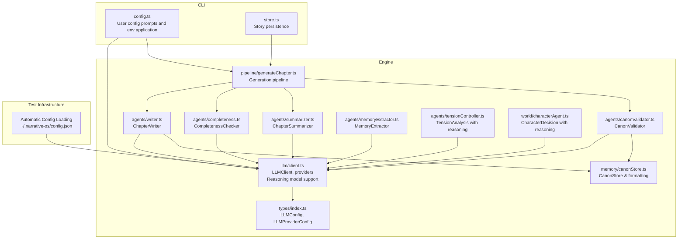
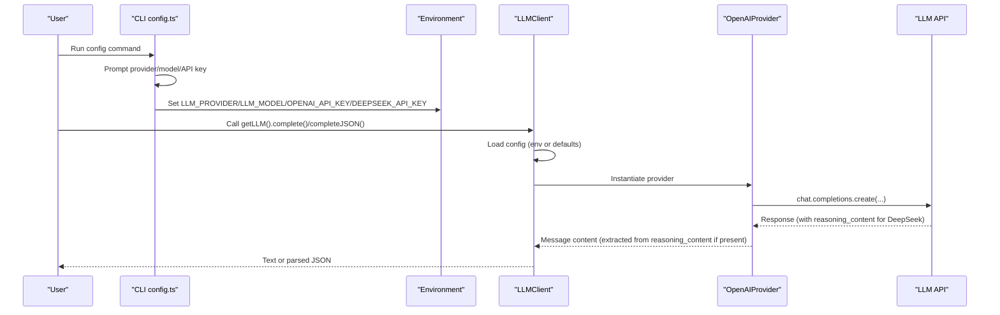
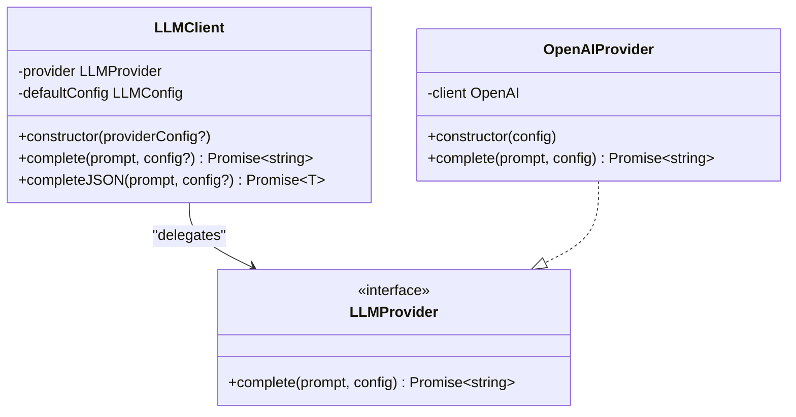
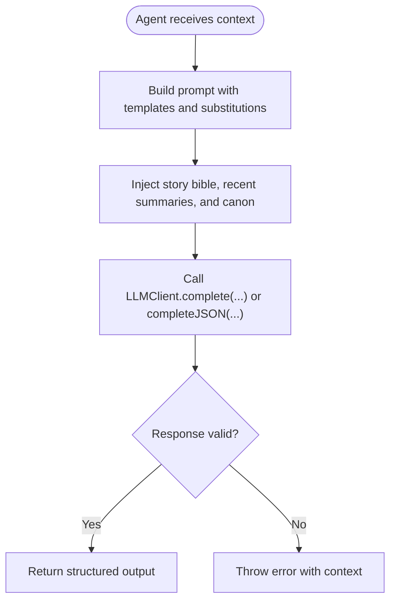
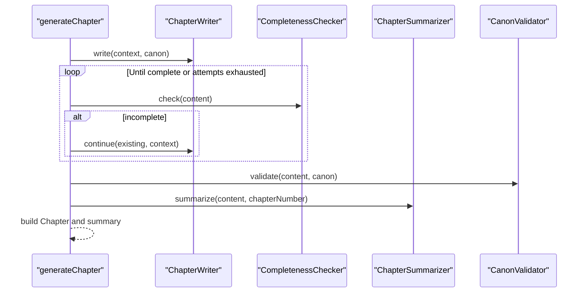
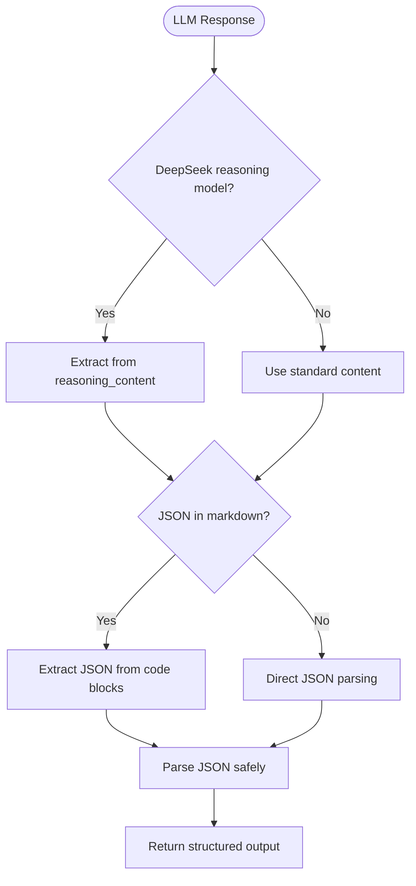
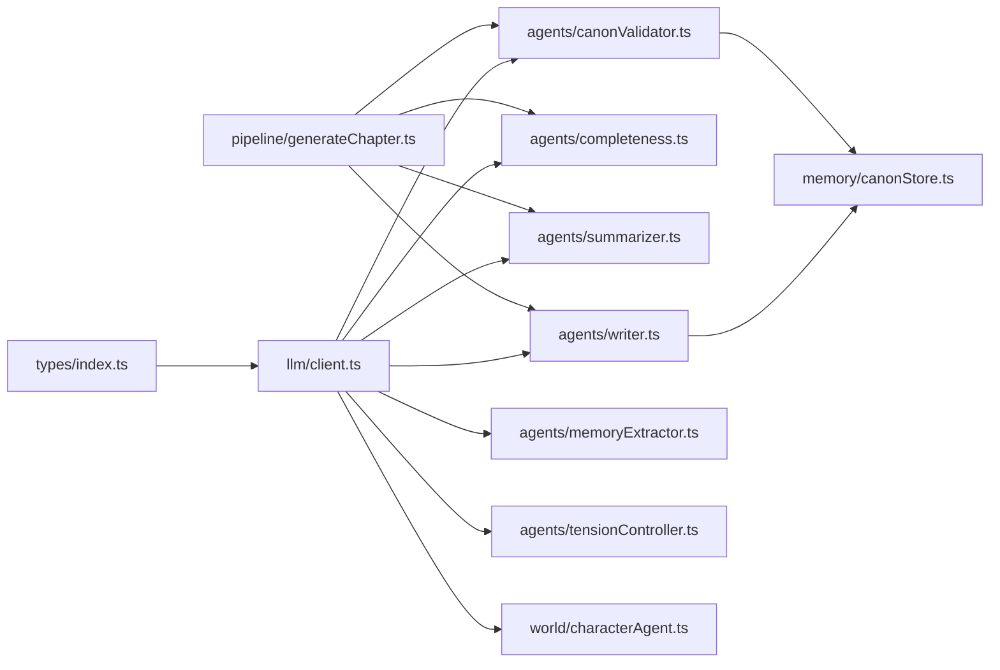

# LLM Integration and Configuration

<cite>
**Referenced Files in This Document**
- [client.ts](file://packages/engine/src/llm/client.ts)
- [types/index.ts](file://packages/engine/src/types/index.ts)
- [writer.ts](file://packages/engine/src/agents/writer.ts)
- [completeness.ts](file://packages/engine/src/agents/completeness.ts)
- [summarizer.ts](file://packages/engine/src/agents/summarizer.ts)
- [canonValidator.ts](file://packages/engine/src/agents/canonValidator.ts)
- [memoryExtractor.ts](file://packages/engine/src/agents/memoryExtractor.ts)
- [tensionController.ts](file://packages/engine/src/agents/tensionController.ts)
- [characterAgent.ts](file://packages/engine/src/world/characterAgent.ts)
- [canonStore.ts](file://packages/engine/src/memory/canonStore.ts)
- [generateChapter.ts](file://packages/engine/src/pipeline/generateChapter.ts)
- [config.ts](file://apps/cli/src/commands/config.ts)
- [store.ts](file://apps/cli/src/config/store.ts)
- [writer.md](file://packages/engine/src/llm/prompts/writer.md)
- [completeness.md](file://packages/engine/src/llm/prompts/completeness.md)
- [summarizer.md](file://packages/engine/src/llm/prompts/summarizer.md)
- [structured-state.test.ts](file://packages/engine/src/test/structured-state.test.ts)
- [simple.test.ts](file://packages/engine/src/test/simple.test.ts)
- [canon.test.ts](file://packages/engine/src/test/canon.test.ts)
- [chapter-planner.test.ts](file://packages/engine/src/test/chapter-planner.test.ts)
- [constraints.test.ts](file://packages/engine/src/test/constraints.test.ts)
- [state-updater.test.ts](file://packages/engine/src/test/state-updater.test.ts)
</cite>

## Update Summary
**Changes Made**
- Enhanced LLM client with reasoning model support for DeepSeek models
- Improved JSON content extraction from markdown code blocks
- Added specialized response handling for reasoning models
- Updated agent integration examples with reasoning field usage
- Revised configuration examples for reasoning model optimization
- **Enhanced Test Infrastructure**: Added automatic configuration loading from ~/.narrative-os/config.json for seamless testing without manual setup requirements

## Table of Contents
1. [Introduction](#introduction)
2. [Project Structure](#project-structure)
3. [Core Components](#core-components)
4. [Architecture Overview](#architecture-overview)
5. [Detailed Component Analysis](#detailed-component-analysis)
6. [Reasoning Model Integration](#reasoning-model-integration)
7. [Test Infrastructure Enhancement](#test-infrastructure-enhancement)
8. [Dependency Analysis](#dependency-analysis)
9. [Performance Considerations](#performance-considerations)
10. [Troubleshooting Guide](#troubleshooting-guide)
11. [Conclusion](#conclusion)
12. [Appendices](#appendices)

## Introduction
This document explains the LLM integration and configuration within the Narrative Operating System. It covers the provider abstraction supporting OpenAI and DeepSeek, configuration management for API keys and model parameters, and prompt engineering strategies. The system now includes enhanced support for reasoning models with specialized response handling and improved JSON content extraction from markdown code blocks. It documents the client architecture, environment variable management, error handling, and the relationship between LLM configuration and agent performance. Practical examples demonstrate provider switching, model selection criteria, and cost optimization strategies.

**Enhanced**: The test infrastructure now features automatic configuration loading from ~/.narrative-os/config.json, enabling seamless testing with configured LLM providers without manual setup requirements.

## Project Structure
The LLM integration spans three primary areas:
- Engine LLM client and types define the provider abstraction and configuration contracts.
- Agents consume the LLM client to perform narrative tasks (writing, summarizing, completeness checks, and canon validation).
- CLI configuration manages persistent user preferences and applies them to environment variables consumed by the engine.



**Diagram sources**
- [client.ts](file://packages/engine/src/llm/client.ts#L1-L120)
- [types/index.ts](file://packages/engine/src/types/index.ts#L78-L89)
- [writer.ts](file://packages/engine/src/agents/writer.ts#L1-L146)
- [completeness.ts](file://packages/engine/src/agents/completeness.ts#L1-L56)
- [summarizer.ts](file://packages/engine/src/agents/summarizer.ts#L1-L64)
- [canonValidator.ts](file://packages/engine/src/agents/canonValidator.ts#L1-L59)
- [memoryExtractor.ts](file://packages/engine/src/agents/memoryExtractor.ts#L1-L97)
- [tensionController.ts](file://packages/engine/src/agents/tensionController.ts#L1-L252)
- [characterAgent.ts](file://packages/engine/src/world/characterAgent.ts#L1-L304)
- [canonStore.ts](file://packages/engine/src/memory/canonStore.ts#L1-L134)
- [generateChapter.ts](file://packages/engine/src/pipeline/generateChapter.ts#L1-L76)
- [config.ts](file://apps/cli/src/commands/config.ts#L1-L84)
- [store.ts](file://apps/cli/src/config/store.ts#L1-L78)
- [structured-state.test.ts](file://packages/engine/src/test/structured-state.test.ts#L1-L203)

**Section sources**
- [client.ts](file://packages/engine/src/llm/client.ts#L1-L120)
- [types/index.ts](file://packages/engine/src/types/index.ts#L78-L89)
- [config.ts](file://apps/cli/src/commands/config.ts#L1-L84)

## Core Components
- Provider abstraction: An LLMProvider interface and provider implementations encapsulate model calls behind a unified contract.
- LLMClient: Centralizes provider creation, default configuration, and completion helpers including JSON parsing with strict constraints and reasoning model support.
- Types: LLMConfig and LLMProviderConfig define the shape of runtime configuration and provider settings.
- Agents: ChapterWriter, CompletenessChecker, ChapterSummarizer, CanonValidator, MemoryExtractor, TensionController, and CharacterAgent orchestrate narrative tasks via the LLM client.
- CLI configuration: Interactive prompts capture provider, model, and API key; writes to a local config file and exports environment variables for the engine.

Key responsibilities:
- Provider selection and instantiation based on environment variables or persisted CLI config.
- Default parameterization (model, temperature, maxTokens) with overrides per call.
- Prompt construction and injection of story context, recent summaries, and canon facts.
- JSON mode enforcement for structured outputs with robust error handling.
- Specialized response handling for reasoning models with content extraction from reasoning_content fields.

**Section sources**
- [client.ts](file://packages/engine/src/llm/client.ts#L4-L120)
- [types/index.ts](file://packages/engine/src/types/index.ts#L78-L89)
- [writer.ts](file://packages/engine/src/agents/writer.ts#L48-L94)
- [completeness.ts](file://packages/engine/src/agents/completeness.ts#L30-L52)
- [summarizer.ts](file://packages/engine/src/agents/summarizer.ts#L17-L38)
- [canonValidator.ts](file://packages/engine/src/agents/canonValidator.ts#L31-L55)
- [memoryExtractor.ts](file://packages/engine/src/agents/memoryExtractor.ts#L52-L68)
- [tensionController.ts](file://packages/engine/src/agents/tensionController.ts#L4-L10)
- [characterAgent.ts](file://packages/engine/src/world/characterAgent.ts#L25-L31)
- [config.ts](file://apps/cli/src/commands/config.ts#L24-L83)

## Architecture Overview
The system follows a layered design:
- CLI layer persists user preferences and sets environment variables.
- Engine layer loads configuration from environment or defaults, selects a provider, and exposes a single LLMClient API with reasoning model support.
- Agent layer composes prompts and invokes LLMClient with tuned parameters.
- Pipeline orchestrates generation steps, optional continuation loops, validation, and summarization.



**Diagram sources**
- [config.ts](file://apps/cli/src/commands/config.ts#L38-L83)
- [client.ts](file://packages/engine/src/llm/client.ts#L32-L35)

## Detailed Component Analysis

### LLM Client and Provider Abstraction
- LLMProvider defines a single method to produce text completions given a prompt and optional config override.
- OpenAIProvider wraps the official SDK client, constructing chat completions with model, temperature, and maxTokens.
- LLMClient:
  - Loads configuration from environment variables or defaults.
  - Supports providers "openai" and "deepseek".
  - Provides a convenience completeJSON method that enforces JSON-only responses and parses them safely.
  - **Enhanced**: Handles reasoning models by extracting content from reasoning_content field for DeepSeek models.
  - Exposes a global accessor to reuse a singleton client instance.



**Diagram sources**
- [client.ts](file://packages/engine/src/llm/client.ts#L4-L120)

**Section sources**
- [client.ts](file://packages/engine/src/llm/client.ts#L4-L120)
- [types/index.ts](file://packages/engine/src/types/index.ts#L78-L89)

### Configuration Management and Environment Variables
- CLI configuration:
  - Prompts user for provider, model, and API key.
  - Writes a local JSON config file under the user's home directory.
  - Applies environment variables for provider, model, and the appropriate API key.
- Engine configuration:
  - Reads LLM_PROVIDER, OPENAI_API_KEY, DEEPSEEK_API_KEY, LLM_MODEL, and optional LLM_BASE_URL.
  - Defaults to OpenAI with gpt-4o-mini if unspecified.
  - Supports DeepSeek with a dedicated base URL and model defaults.

Practical examples:
- Switching providers: Change LLM_PROVIDER to "deepseek" and set DEEPSEEK_API_KEY; optionally set LLM_MODEL to a DeepSeek model.
- Model selection: Choose among supported models exposed by each provider; engine defaults to a sensible model if none is set.
- Cost optimization: Lower maxTokens and temperature for simpler tasks; prefer smaller models when output quality allows.

Security considerations:
- Store API keys securely; avoid committing secrets to source control.
- Prefer environment variables over hardcoded values.
- Limit stored CLI config to local machine and review permissions.

**Section sources**
- [config.ts](file://apps/cli/src/commands/config.ts#L14-L83)
- [client.ts](file://packages/engine/src/llm/client.ts#L53-L73)

### Prompt Engineering Strategies
Prompts are designed to be explicit, constrained, and context-rich:
- Writer prompt emphasizes narrative craft, story context, recent summaries, and chapter goals, with a target word count.
- Completeness prompt instructs the model to return a single classification word and constrains reasoning.
- Summarizer prompt focuses on major events, plot progression, and character changes, with a token limit.
- Canon validator prompt requires structured JSON output and enumerates violation categories.
- **Enhanced**: Memory extractor and character decision prompts now include reasoning fields for better traceability.

Agents tune parameters per task:
- Temperature lowered for deterministic tasks (completeness, summarization, validation).
- JSON mode enforced for structured outputs (validation).
- MaxTokens adjusted to balance cost and coverage.



**Diagram sources**
- [writer.ts](file://packages/engine/src/agents/writer.ts#L71-L88)
- [completeness.ts](file://packages/engine/src/agents/completeness.ts#L37-L43)
- [summarizer.ts](file://packages/engine/src/agents/summarizer.ts#L24-L30)
- [canonValidator.ts](file://packages/engine/src/agents/canonValidator.ts#L40-L47)
- [memoryExtractor.ts](file://packages/engine/src/agents/memoryExtractor.ts#L52-L68)
- [characterAgent.ts](file://packages/engine/src/world/characterAgent.ts#L187-L210)

**Section sources**
- [writer.md](file://packages/engine/src/llm/prompts/writer.md#L1-L38)
- [completeness.md](file://packages/engine/src/llm/prompts/completeness.md#L1-L26)
- [summarizer.md](file://packages/engine/src/llm/prompts/summarizer.md#L1-L13)
- [writer.ts](file://packages/engine/src/agents/writer.ts#L48-L94)
- [completeness.ts](file://packages/engine/src/agents/completeness.ts#L30-L52)
- [summarizer.ts](file://packages/engine/src/agents/summarizer.ts#L17-L38)
- [canonValidator.ts](file://packages/engine/src/agents/canonValidator.ts#L31-L55)
- [memoryExtractor.ts](file://packages/engine/src/agents/memoryExtractor.ts#L14-L50)
- [characterAgent.ts](file://packages/engine/src/world/characterAgent.ts#L41-L89)

### Agent Layer and Pipeline Orchestration
- ChapterWriter composes the narrative prompt and produces chapter content with inferred goals and target word counts.
- CompletenessChecker validates whether a chapter ends naturally; if not, the pipeline continues writing iteratively.
- ChapterSummarizer generates concise summaries and extracts key events.
- CanonValidator compares chapter content against established facts and reports violations.
- MemoryExtractor extracts narrative memories with reasoning traces for better explainability.
- TensionController analyzes story tension and provides reasoning for tension guidance.
- CharacterAgent generates character decisions with detailed reasoning explanations.
- Pipeline integrates these steps, tracks attempts, and aggregates results.



**Diagram sources**
- [generateChapter.ts](file://packages/engine/src/pipeline/generateChapter.ts#L20-L71)
- [writer.ts](file://packages/engine/src/agents/writer.ts#L96-L117)
- [completeness.ts](file://packages/engine/src/agents/completeness.ts#L37-L52)
- [summarizer.ts](file://packages/engine/src/agents/summarizer.ts#L24-L38)
- [canonValidator.ts](file://packages/engine/src/agents/canonValidator.ts#L32-L55)

**Section sources**
- [generateChapter.ts](file://packages/engine/src/pipeline/generateChapter.ts#L1-L76)
- [writer.ts](file://packages/engine/src/agents/writer.ts#L48-L146)
- [completeness.ts](file://packages/engine/src/agents/completeness.ts#L30-L56)
- [summarizer.ts](file://packages/engine/src/agents/summarizer.ts#L17-L64)
- [canonValidator.ts](file://packages/engine/src/agents/canonValidator.ts#L31-L59)
- [memoryExtractor.ts](file://packages/engine/src/agents/memoryExtractor.ts#L52-L97)
- [tensionController.ts](file://packages/engine/src/agents/tensionController.ts#L58-L97)
- [characterAgent.ts](file://packages/engine/src/world/characterAgent.ts#L187-L301)

### Relationship Between LLM Configuration and Agent Performance
- Model selection impacts quality and cost; choose larger models for creative writing and smaller ones for validation tasks.
- Temperature controls creativity vs. determinism; lower values improve consistency for classification and summarization.
- MaxTokens balances output richness and cost; reduce for faster, cheaper iterations.
- JSON mode improves reliability for structured outputs; enforce strict constraints and handle parsing errors gracefully.
- **Enhanced**: Reasoning model support enables better traceability and explainability for complex narrative decisions.

Parameter tuning examples:
- Writing: moderate temperature and higher maxTokens for richer content.
- Validation: low temperature and JSON mode for reliable structured output.
- Summarization: low temperature and token limits for concise summaries.
- **Enhanced**: Reasoning tasks: use appropriate reasoning models with higher temperature for creative tasks, lower temperature for analytical tasks.

**Section sources**
- [writer.ts](file://packages/engine/src/agents/writer.ts#L85-L88)
- [completeness.ts](file://packages/engine/src/agents/completeness.ts#L40-L43)
- [summarizer.ts](file://packages/engine/src/agents/summarizer.ts#L27-L30)
- [canonValidator.ts](file://packages/engine/src/agents/canonValidator.ts#L44-L47)
- [memoryExtractor.ts](file://packages/engine/src/agents/memoryExtractor.ts#L62-L65)
- [characterAgent.ts](file://packages/engine/src/world/characterAgent.ts#L204-L207)

## Reasoning Model Integration

### Enhanced Response Handling for DeepSeek Reasoning Models
The LLM client now includes specialized support for DeepSeek reasoning models with improved content extraction:

- **Reasoning Content Extraction**: The client automatically detects and extracts content from the `reasoning_content` field for DeepSeek reasoning models.
- **Fallback Mechanism**: If `reasoning_content` is not available, it falls back to the standard `content` field.
- **Transparent Integration**: This enhancement is transparent to downstream agents and maintains backward compatibility.

### Improved JSON Content Extraction from Markdown Code Blocks
The `completeJSON` method now includes enhanced JSON extraction capabilities:

- **Markdown Code Block Detection**: Automatically detects JSON wrapped in triple backticks with optional language specification.
- **Robust Parsing**: Extracts JSON content even when wrapped in markdown code blocks.
- **Error Handling**: Provides detailed error messages with context for debugging parsing failures.

### Agent Integration with Reasoning Fields
Several agents now utilize reasoning fields for better traceability:

- **TensionController**: Provides detailed reasoning for tension analysis and recommendations.
- **CharacterAgent**: Generates character decisions with comprehensive reasoning explanations.
- **MemoryExtractor**: Produces structured memory extractions with reasoning traces.



**Diagram sources**
- [client.ts](file://packages/engine/src/llm/client.ts#L28-L35)
- [client.ts](file://packages/engine/src/llm/client.ts#L97-L102)

**Section sources**
- [client.ts](file://packages/engine/src/llm/client.ts#L28-L35)
- [client.ts](file://packages/engine/src/llm/client.ts#L97-L102)
- [tensionController.ts](file://packages/engine/src/agents/tensionController.ts#L70-L96)
- [characterAgent.ts](file://packages/engine/src/world/characterAgent.ts#L25-L31)
- [memoryExtractor.ts](file://packages/engine/src/agents/memoryExtractor.ts#L52-L68)

## Test Infrastructure Enhancement

### Automatic Configuration Loading from ~/.narrative-os/config.json

**Enhanced**: The test infrastructure now features automatic configuration loading from ~/.narrative-os/config.json, eliminating the need for manual setup during testing.

#### Configuration Loading Mechanism
All test files now include a standardized configuration loading mechanism that automatically detects and applies user-configured LLM settings:

```javascript
// Load config BEFORE importing engine
const configPath = join(homedir(), '.narrative-os', 'config.json');
if (existsSync(configPath)) {
  const config = JSON.parse(readFileSync(configPath, 'utf-8'));
  process.env.LLM_PROVIDER = config.provider;
  process.env.LLM_MODEL = 'deepseek-chat'; // Use chat model for JSON tasks
  if (config.provider === 'openai') {
    process.env.OPENAI_API_KEY = config.apiKey;
  } else if (config.provider === 'deepseek') {
    process.env.DEEPSEEK_API_KEY = config.apiKey;
  }
  console.log(`Loaded config: ${config.provider} / ${config.model}`);
}
```

#### Benefits of Automatic Configuration Loading
- **Seamless Testing**: Tests automatically use the user's configured LLM provider without manual intervention
- **Consistent Environment**: All tests run with the same LLM configuration as the CLI
- **Reduced Setup Complexity**: Eliminates the need to manually export environment variables for each test run
- **Cross-Platform Compatibility**: Works consistently across different development environments

#### Configuration File Structure
The configuration file follows this structure:
```json
{
  "provider": "openai",
  "apiKey": "sk-...your-api-key...",
  "model": "gpt-4o-mini"
}
```

#### Provider-Specific Considerations
- **OpenAI**: Uses OPENAI_API_KEY environment variable
- **DeepSeek**: Uses DEEPSEEK_API_KEY environment variable with automatic model selection
- **Model Selection**: Tests automatically use 'deepseek-chat' for JSON extraction tasks due to output format differences

#### Test File Implementation Patterns
The enhanced test files demonstrate several implementation patterns:

1. **Early Configuration Loading**: Configuration is loaded before any engine imports
2. **Environment Variable Application**: Automatically sets LLM_PROVIDER, LLM_MODEL, and API key variables
3. **Console Logging**: Provides feedback about loaded configuration
4. **Error Handling**: Graceful handling of missing configuration files

**Section sources**
- [structured-state.test.ts](file://packages/engine/src/test/structured-state.test.ts#L1-L203)
- [simple.test.ts](file://packages/engine/src/test/simple.test.ts#L1-L73)
- [canon.test.ts](file://packages/engine/src/test/canon.test.ts#L1-L151)
- [chapter-planner.test.ts](file://packages/engine/src/test/chapter-planner.test.ts#L1-L216)
- [constraints.test.ts](file://packages/engine/src/test/constraints.test.ts#L1-L264)
- [state-updater.test.ts](file://packages/engine/src/test/state-updater.test.ts#L1-L251)

## Dependency Analysis
The engine depends on:
- LLM client for provider abstraction and configuration.
- Types for shared configuration interfaces.
- Memory module for canonical facts formatting.
- Agents depend on the LLM client and memory utilities.
- Pipeline orchestrates agents and coordinates results.



**Diagram sources**
- [types/index.ts](file://packages/engine/src/types/index.ts#L78-L89)
- [client.ts](file://packages/engine/src/llm/client.ts#L38-L120)
- [writer.ts](file://packages/engine/src/agents/writer.ts#L1-L4)
- [completeness.ts](file://packages/engine/src/agents/completeness.ts#L1-L2)
- [summarizer.ts](file://packages/engine/src/agents/summarizer.ts#L1-L2)
- [canonValidator.ts](file://packages/engine/src/agents/canonValidator.ts#L1-L2)
- [memoryExtractor.ts](file://packages/engine/src/agents/memoryExtractor.ts#L1-L2)
- [tensionController.ts](file://packages/engine/src/agents/tensionController.ts#L1-L2)
- [characterAgent.ts](file://packages/engine/src/world/characterAgent.ts#L1-L2)
- [canonStore.ts](file://packages/engine/src/memory/canonStore.ts#L101-L129)
- [generateChapter.ts](file://packages/engine/src/pipeline/generateChapter.ts#L1-L7)

**Section sources**
- [client.ts](file://packages/engine/src/llm/client.ts#L38-L120)
- [writer.ts](file://packages/engine/src/agents/writer.ts#L1-L4)
- [completeness.ts](file://packages/engine/src/agents/completeness.ts#L1-L2)
- [summarizer.ts](file://packages/engine/src/agents/summarizer.ts#L1-L2)
- [canonValidator.ts](file://packages/engine/src/agents/canonValidator.ts#L1-L2)
- [memoryExtractor.ts](file://packages/engine/src/agents/memoryExtractor.ts#L1-L2)
- [tensionController.ts](file://packages/engine/src/agents/tensionController.ts#L1-L2)
- [characterAgent.ts](file://packages/engine/src/world/characterAgent.ts#L1-L2)
- [generateChapter.ts](file://packages/engine/src/pipeline/generateChapter.ts#L1-L7)

## Performance Considerations
- Connection pooling: The OpenAI SDK manages HTTP connections internally; no manual pooling is implemented in the client.
- Rate limiting: Not handled in code; rely on provider-side throttling and exponential backoff at the SDK level.
- Cost optimization:
  - Reduce maxTokens for classification and summarization tasks.
  - Use smaller, cheaper models when acceptable.
  - Prefer JSON mode for validation to minimize retries.
  - Cache repeated prompts and canonical facts where feasible.
  - **Enhanced**: Use reasoning models judiciously for complex tasks that benefit from step-by-step reasoning.
- Throughput: Batch operations at the pipeline level (e.g., process multiple chapters sequentially) and avoid unnecessary re-runs.
- **Enhanced**: Reasoning model performance: Monitor token usage and costs for reasoning models separately from standard chat models.
- **Enhanced**: Test infrastructure efficiency: Automatic configuration loading reduces test setup overhead and ensures consistent environment across test runs.

## Troubleshooting Guide
Common issues and resolutions:
- Unknown provider error: Ensure LLM_PROVIDER is set to "openai" or "deepseek".
- Missing API key: Set OPENAI_API_KEY or DEEPSEEK_API_KEY depending on provider.
- JSON parsing failures: The client throws a descriptive error when JSON mode fails; verify the prompt explicitly requests JSON-only output.
- Incomplete chapters: The pipeline continues writing until completion or max attempts; adjust maxContinuationAttempts or model parameters.
- Validation false positives/negatives: Tune temperature and refine the validator prompt; ensure sufficient context is included.
- **Enhanced**: Reasoning model issues: For DeepSeek reasoning models, ensure the correct model is selected; the client automatically handles content extraction from reasoning_content fields.
- **Enhanced**: JSON extraction problems: The client now handles markdown code blocks automatically; if JSON parsing still fails, check that the prompt explicitly requests JSON format.
- **Enhanced**: Test configuration issues: If tests fail to load configuration, ensure ~/.narrative-os/config.json exists and contains valid JSON with provider, apiKey, and model fields.
- **Enhanced**: Automatic loading failures: Tests automatically handle missing configuration files; they will run without LLM integration if no config is found.

**Section sources**
- [client.ts](file://packages/engine/src/llm/client.ts#L70-L72)
- [client.ts](file://packages/engine/src/llm/client.ts#L104-L108)
- [generateChapter.ts](file://packages/engine/src/pipeline/generateChapter.ts#L32-L43)
- [canonValidator.ts](file://packages/engine/src/agents/canonValidator.ts#L49-L54)
- [client.ts](file://packages/engine/src/llm/client.ts#L28-L35)
- [client.ts](file://packages/engine/src/llm/client.ts#L97-L102)
- [structured-state.test.ts](file://packages/engine/src/test/structured-state.test.ts#L5-L18)

## Conclusion
The Narrative Operating System provides a clean provider abstraction over OpenAI and DeepSeek, with environment-driven configuration and robust prompt engineering. The enhanced LLM client now supports reasoning models with specialized response handling and improved JSON content extraction from markdown code blocks. Agents leverage the LLM client to deliver narrative generation, validation, summarization, and reasoning tasks, while the pipeline coordinates iterative refinement and canonical consistency. 

**Enhanced**: The test infrastructure now features automatic configuration loading from ~/.narrative-os/config.json, enabling seamless testing with configured LLM providers without manual setup requirements. This enhancement significantly improves the developer experience by ensuring consistent environment setup across all test scenarios while maintaining backward compatibility for manual configuration approaches.

By tuning parameters, selecting appropriate models, and utilizing reasoning capabilities thoughtfully, teams can optimize for quality, cost, and performance.

## Appendices

### Configuration Reference
- Environment variables:
  - LLM_PROVIDER: "openai" or "deepseek"
  - OPENAI_API_KEY: API key for OpenAI
  - DEEPSEEK_API_KEY: API key for DeepSeek
  - LLM_MODEL: Model identifier (defaults applied if unset)
  - LLM_BASE_URL: Optional base URL override (DeepSeek default provided)
- CLI config file location: User home directory under a hidden folder; stores provider, model, and API key.
- **Enhanced**: Test configuration file location: ~/.narrative-os/config.json for automatic test setup.

**Section sources**
- [client.ts](file://packages/engine/src/llm/client.ts#L53-L73)
- [config.ts](file://apps/cli/src/commands/config.ts#L5-L83)
- [structured-state.test.ts](file://packages/engine/src/test/structured-state.test.ts#L5-L18)

### Reasoning Model Configuration Examples
- **DeepSeek Reasoning Models**: Use `deepseek-chat` or other DeepSeek reasoning models for tasks requiring step-by-step reasoning.
- **JSON Task Optimization**: For JSON extraction tasks, consider using `deepseek-chat` model as demonstrated in test configurations.
- **Temperature Tuning**: Adjust temperature based on task complexity; higher for creative tasks, lower for analytical tasks.

**Section sources**
- [structured-state.test.ts](file://packages/engine/src/test/structured-state.test.ts#L10-L11)
- [client.ts](file://packages/engine/src/llm/client.ts#L63-L69)

### Test Infrastructure Usage Examples
- **Automatic Configuration Loading**: All test files automatically detect and apply ~/.narrative-os/config.json settings.
- **Provider Flexibility**: Tests work with either OpenAI or DeepSeek configurations without modification.
- **Environment Consistency**: Ensures tests run with the same LLM configuration as the CLI interface.
- **Graceful Degradation**: Tests continue running even if no configuration file is found.

**Section sources**
- [simple.test.ts](file://packages/engine/src/test/simple.test.ts#L5-L18)
- [canon.test.ts](file://packages/engine/src/test/canon.test.ts#L5-L17)
- [chapter-planner.test.ts](file://packages/engine/src/test/chapter-planner.test.ts#L5-L17)
- [constraints.test.ts](file://packages/engine/src/test/constraints.test.ts#L5-L18)
- [state-updater.test.ts](file://packages/engine/src/test/state-updater.test.ts#L5-L18)