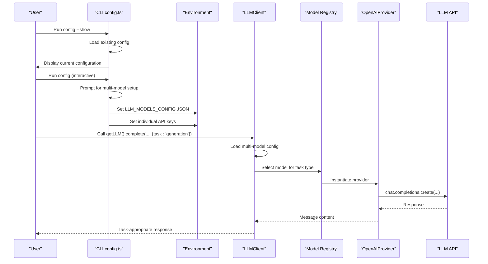
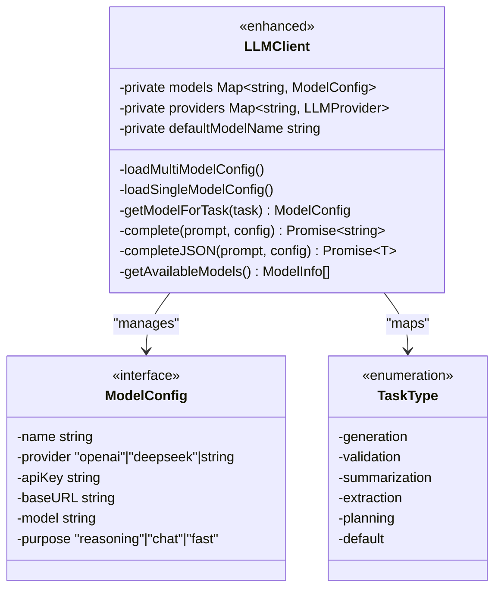
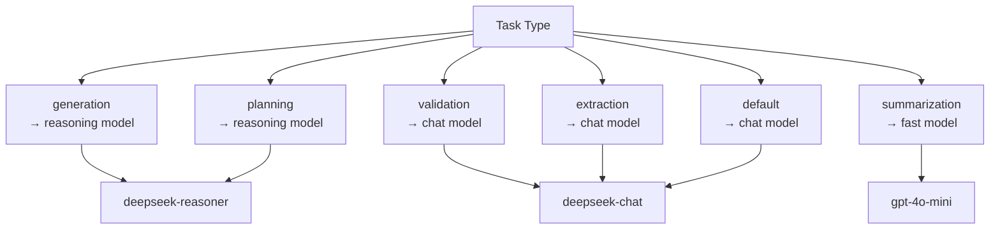
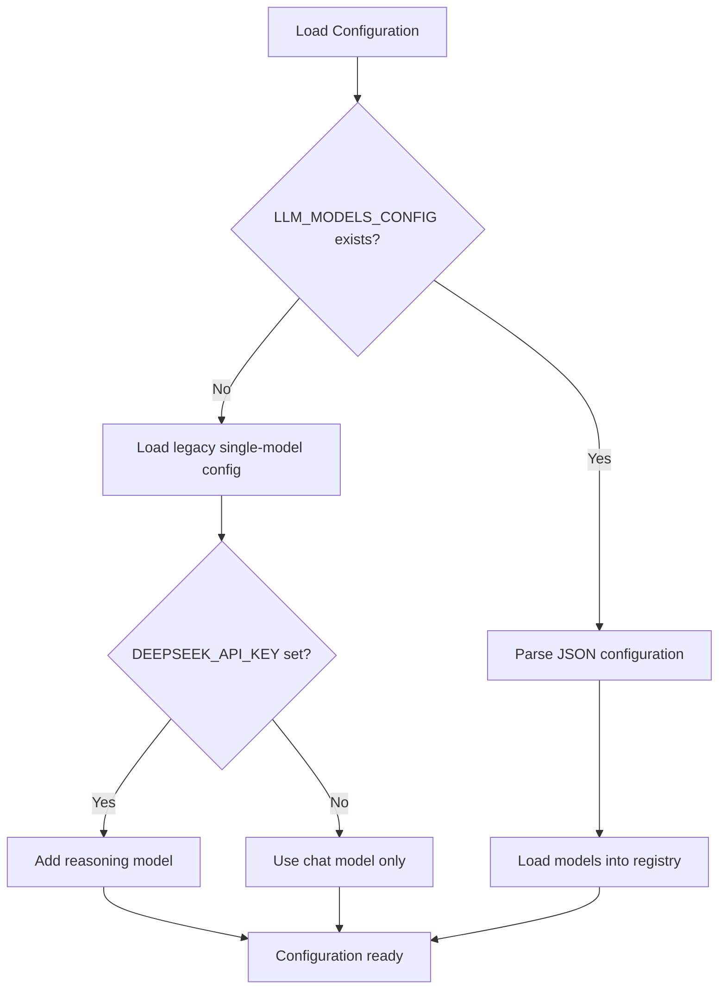
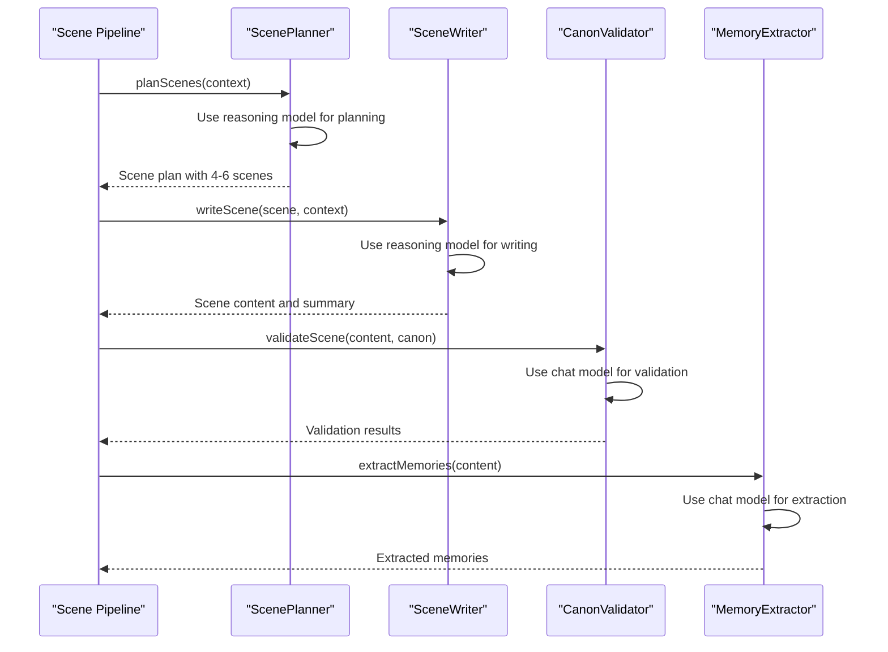
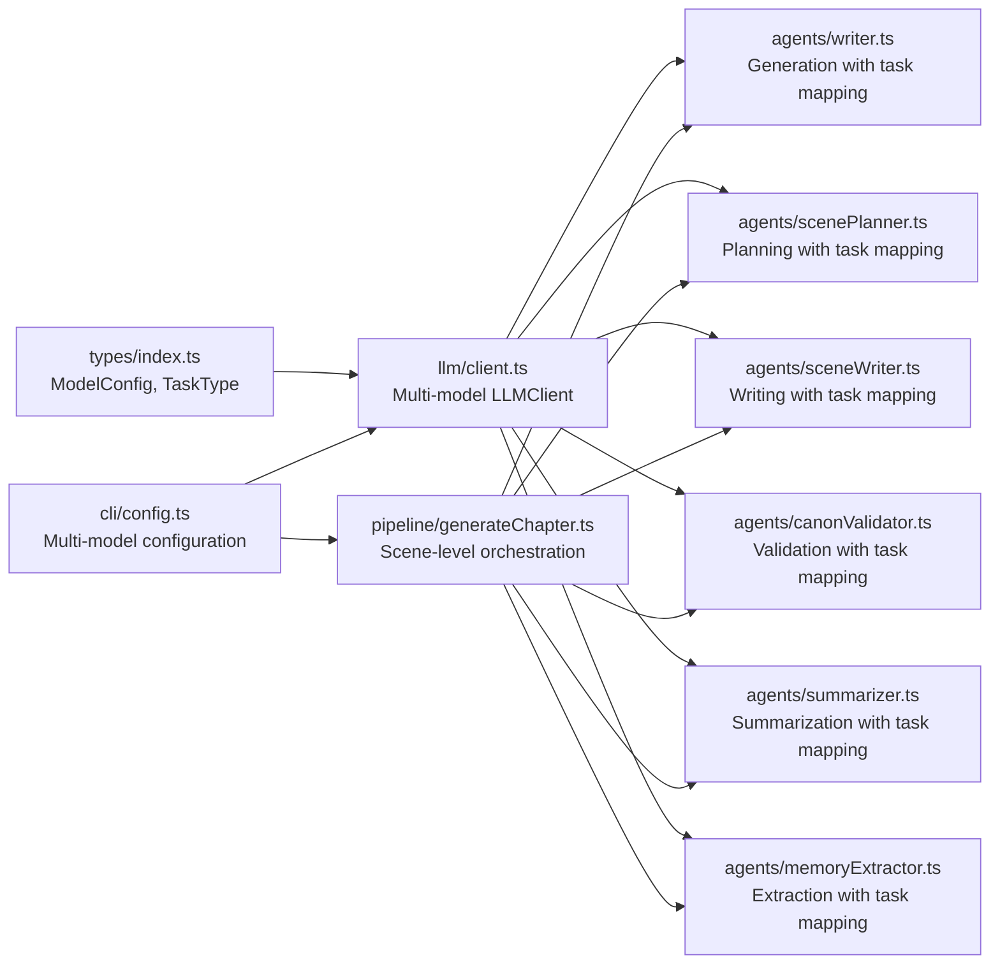

# LLM Integration and Configuration

<cite>
**Referenced Files in This Document**
- [client.ts](file://packages/engine/src/llm/client.ts)
- [types/index.ts](file://packages/engine/src/types/index.ts)
- [writer.ts](file://packages/engine/src/agents/writer.ts)
- [completeness.ts](file://packages/engine/src/agents/completeness.ts)
- [summarizer.ts](file://packages/engine/src/agents/summarizer.ts)
- [canonValidator.ts](file://packages/engine/src/agents/canonValidator.ts)
- [memoryExtractor.ts](file://packages/engine/src/agents/memoryExtractor.ts)
- [scenePlanner.ts](file://packages/engine/src/agents/scenePlanner.ts)
- [sceneWriter.ts](file://packages/engine/src/agents/sceneWriter.ts)
- [generateChapter.ts](file://packages/engine/src/pipeline/generateChapter.ts)
- [config.ts](file://apps/cli/src/commands/config.ts)
- [index.ts](file://apps/cli/src/index.ts)
</cite>

## Update Summary
**Changes Made**
- Enhanced LLM client with comprehensive multi-model configuration system supporting reasoning, chat, and fast models
- Added task-specific model mapping with automatic model selection based on task type
- Implemented backward compatibility with legacy single-model configurations
- Enhanced CLI configuration with multi-model setup wizard and show configuration feature
- Improved JSON parsing capabilities with robust extraction from markdown code blocks
- Added scene-level generation pipeline with integrated multi-model support

## Table of Contents
1. [Introduction](#introduction)
2. [Project Structure](#project-structure)
3. [Core Components](#core-components)
4. [Architecture Overview](#architecture-overview)
5. [Detailed Component Analysis](#detailed-component-analysis)
6. [Multi-Model Configuration System](#multi-model-configuration-system)
7. [Task-Specific Model Mapping](#task-specific-model-mapping)
8. [Enhanced Configuration System](#enhanced-configuration-system)
9. [Scene-Level Generation Pipeline](#scene-level-generation-pipeline)
10. [Dependency Analysis](#dependency-analysis)
11. [Performance Considerations](#performance-considerations)
12. [Troubleshooting Guide](#troubleshooting-guide)
13. [Conclusion](#conclusion)
14. [Appendices](#appendices)

## Introduction
This document explains the enhanced LLM integration and configuration within the Narrative Operating System. The system now features a comprehensive multi-model architecture supporting reasoning, chat, and fast models with task-specific mapping, while maintaining backward compatibility with legacy single-model configurations. It covers provider abstraction supporting OpenAI and DeepSeek, advanced configuration management for API keys and model parameters, and sophisticated prompt engineering strategies optimized for different task types.

The enhanced system introduces intelligent model selection based on task requirements, improved JSON content extraction from markdown code blocks, and a robust scene-level generation pipeline that leverages specialized models for different narrative components. The CLI configuration system now supports both single-model and multi-model setups with interactive wizards and comprehensive show configuration capabilities.

## Project Structure
The enhanced LLM integration spans four primary areas:
- Engine LLM client and types define the provider abstraction, multi-model configuration, and task-specific model mapping.
- Agents consume the LLM client with automatic model selection based on task requirements.
- CLI configuration manages both legacy single-model and modern multi-model setups with interactive wizards.
- Scene-level pipeline orchestrates generation with integrated multi-model support for planning, writing, and validation.

```mermaid
graph TB
subgraph "CLI"
IDX["index.ts<br/>Application entry point<br/>Auto-apply configuration"]
CFG["config.ts<br/>Multi-model config wizard<br/>Show configuration feature"]
end
subgraph "Engine"
TYPES["types/index.ts<br/>ModelConfig, MultiModelConfig<br/>TaskType enumeration"]
CLIENT["llm/client.ts<br/>LLMClient with multi-model support<br/>Task mapping & model selection"]
PIPE["pipeline/generateChapter.ts<br/>Scene-level generation<br/>Multi-model orchestration"]
end
subgraph "Agents"
WR["agents/writer.ts<br/>Generation task (reasoning model)"]
SUM["agents/summarizer.ts<br/>Summarization task (fast model)"]
VAL["agents/canonValidator.ts<br/>Validation task (chat model)"]
MEM["agents/memoryExtractor.ts<br/>Extraction task (chat model)"]
PLAN["agents/scenePlanner.ts<br/>Planning task (reasoning model)"]
WRITE["agents/sceneWriter.ts<br/>Writing task (reasoning model)"]
end
subgraph "Configuration"
MODELS["Multi-Model Config<br/>reasoning: deepseek-reasoner<br/>chat: deepseek-chat<br/>fast: gpt-4o-mini"]
LEGACY["Legacy Config<br/>Single model fallback"]
END
IDX --> CFG
CFG --> CLIENT
PIPE --> WR
PIPE --> PLAN
PIPE --> WRITE
PIPE --> VAL
PIPE --> SUM
PIPE --> MEM
WR --> CLIENT
PLAN --> CLIENT
WRITE --> CLIENT
VAL --> CLIENT
SUM --> CLIENT
MEM --> CLIENT
CLIENT --> MODELS
CLIENT --> LEGACY
```

**Diagram sources**
- [index.ts:17-17](file://apps/cli/src/index.ts#L17-L17)
- [config.ts:55-182](file://apps/cli/src/commands/config.ts#L55-L182)
- [client.ts:49-190](file://packages/engine/src/llm/client.ts#L49-L190)
- [generateChapter.ts:63-205](file://packages/engine/src/pipeline/generateChapter.ts#L63-L205)
- [writer.ts:103-107](file://packages/engine/src/agents/writer.ts#L103-L107)
- [summarizer.ts:27-31](file://packages/engine/src/agents/summarizer.ts#L27-L31)
- [canonValidator.ts:44-48](file://packages/engine/src/agents/canonValidator.ts#L44-L48)
- [memoryExtractor.ts:62-66](file://packages/engine/src/agents/memoryExtractor.ts#L62-L66)
- [scenePlanner.ts:82-85](file://packages/engine/src/agents/scenePlanner.ts#L82-L85)
- [sceneWriter.ts:85-88](file://packages/engine/src/agents/sceneWriter.ts#L85-L88)

**Section sources**
- [client.ts:49-190](file://packages/engine/src/llm/client.ts#L49-L190)
- [types/index.ts:91-114](file://packages/engine/src/types/index.ts#L91-L114)
- [config.ts:55-182](file://apps/cli/src/commands/config.ts#L55-L182)
- [index.ts:17-17](file://apps/cli/src/index.ts#L17-L17)

## Core Components
- **Multi-Model Provider Abstraction**: Enhanced LLMProvider interface with LLMClient supporting multiple models with different purposes (reasoning, chat, fast).
- **Task-Specific Model Mapping**: Intelligent model selection based on task types (generation, validation, summarization, extraction, planning).
- **Enhanced LLMClient**: Centralizes provider creation, multi-model configuration loading, and completion helpers with robust JSON parsing.
- **Advanced Types**: ModelConfig and MultiModelConfig define comprehensive runtime configuration with purpose-based model categorization.
- **Intelligent Agents**: All agents now support task parameter for automatic model selection based on their requirements.
- **Dual Configuration System**: Backward compatibility with legacy single-model configs while supporting modern multi-model setups.

Key responsibilities:
- Dynamic model loading from environment variables or persisted CLI config with JSON configuration support.
- Task-aware model selection using predefined mapping rules for optimal performance and cost.
- Provider selection and instantiation based on model configuration with support for multiple providers.
- Intelligent JSON parsing with extraction from markdown code blocks and robust error handling.
- Comprehensive backward compatibility with legacy single-model configurations.
- Scene-level generation pipeline integration with specialized model assignment for different phases.

**Section sources**
- [client.ts:49-190](file://packages/engine/src/llm/client.ts#L49-L190)
- [types/index.ts:91-114](file://packages/engine/src/types/index.ts#L91-L114)
- [writer.ts:103-107](file://packages/engine/src/agents/writer.ts#L103-L107)
- [summarizer.ts:27-31](file://packages/engine/src/agents/summarizer.ts#L27-L31)
- [canonValidator.ts:44-48](file://packages/engine/src/agents/canonValidator.ts#L44-L48)
- [memoryExtractor.ts:62-66](file://packages/engine/src/agents/memoryExtractor.ts#L62-L66)
- [scenePlanner.ts:82-85](file://packages/engine/src/agents/scenePlanner.ts#L82-L85)
- [sceneWriter.ts:85-88](file://packages/engine/src/agents/sceneWriter.ts#L85-L88)

## Architecture Overview
The enhanced system follows a sophisticated layered design with intelligent model selection:
- CLI layer provides dual configuration modes (single-model legacy and multi-model modern) with interactive wizards.
- Engine layer dynamically loads multi-model configuration from environment variables or JSON config, with automatic fallback to legacy single-model setup.
- Agent layer automatically selects appropriate models based on task requirements using predefined mapping rules.
- Pipeline orchestrates scene-level generation with specialized models for planning, writing, and validation phases.



**Diagram sources**
- [index.ts:17-17](file://apps/cli/src/index.ts#L17-L17)
- [config.ts:55-182](file://apps/cli/src/commands/config.ts#L55-L182)
- [client.ts:58-125](file://packages/engine/src/llm/client.ts#L58-L125)
- [client.ts:135-147](file://packages/engine/src/llm/client.ts#L135-L147)

## Detailed Component Analysis

### Enhanced LLM Client with Multi-Model Support
The LLMClient now features comprehensive multi-model architecture:
- **Multi-Model Configuration**: Loads models from JSON environment variable or falls back to legacy single-model setup.
- **Model Registry**: Maintains separate registry for models with different purposes (reasoning, chat, fast).
- **Task-Aware Selection**: Automatically selects appropriate model based on task type using predefined mapping rules.
- **Enhanced JSON Parsing**: Robust extraction from markdown code blocks with fallback to direct JSON parsing.
- **Provider Management**: Manages multiple providers with different API keys and base URLs.



**Diagram sources**
- [client.ts:49-190](file://packages/engine/src/llm/client.ts#L49-L190)
- [types/index.ts:92-114](file://packages/engine/src/types/index.ts#L92-L114)

**Section sources**
- [client.ts:49-190](file://packages/engine/src/llm/client.ts#L49-L190)
- [types/index.ts:91-114](file://packages/engine/src/types/index.ts#L91-L114)

### Advanced Task-Specific Model Mapping
The system implements intelligent model selection based on task requirements:
- **Generation Tasks**: Use reasoning models (deepseek-reasoner) for complex creative writing and planning.
- **Validation Tasks**: Use chat models (deepseek-chat) for structured validation and JSON parsing.
- **Summarization Tasks**: Use fast models (gpt-4o-mini) for efficient content summarization.
- **Extraction Tasks**: Use chat models for memory and narrative extraction.
- **Planning Tasks**: Use reasoning models for scene and chapter planning.



**Diagram sources**
- [client.ts:40-47](file://packages/engine/src/llm/client.ts#L40-L47)
- [writer.ts:103-107](file://packages/engine/src/agents/writer.ts#L103-L107)
- [summarizer.ts:27-31](file://packages/engine/src/agents/summarizer.ts#L27-L31)
- [canonValidator.ts:44-48](file://packages/engine/src/agents/canonValidator.ts#L44-L48)
- [memoryExtractor.ts:62-66](file://packages/engine/src/agents/memoryExtractor.ts#L62-L66)

**Section sources**
- [client.ts:40-47](file://packages/engine/src/llm/client.ts#L40-L47)
- [writer.ts:103-107](file://packages/engine/src/agents/writer.ts#L103-L107)
- [summarizer.ts:27-31](file://packages/engine/src/agents/summarizer.ts#L27-L31)
- [canonValidator.ts:44-48](file://packages/engine/src/agents/canonValidator.ts#L44-L48)
- [memoryExtractor.ts:62-66](file://packages/engine/src/agents/memoryExtractor.ts#L62-L66)

### Enhanced Configuration Management
The CLI configuration system now supports both single-model and multi-model setups:
- **Multi-Model Wizard**: Interactive setup for configuring reasoning, chat, and fast models with provider selection.
- **Backward Compatibility**: Automatic detection and migration from legacy single-model configurations.
- **Show Configuration**: Comprehensive display of current configuration status without interactive setup.
- **Environment Integration**: Automatic application of configuration to environment variables at startup.

**Section sources**
- [config.ts:55-182](file://apps/cli/src/commands/config.ts#L55-L182)
- [index.ts:17-17](file://apps/cli/src/index.ts#L17-L17)
- [client.ts:58-111](file://packages/engine/src/llm/client.ts#L58-L111)

## Multi-Model Configuration System

### Comprehensive Multi-Model Architecture
The enhanced system supports three distinct model purposes with intelligent assignment:

**Reasoning Models**: Optimized for complex creative tasks and planning
- Primary: deepseek-reasoner (DeepSeek reasoning model)
- Secondary: gpt-4o for OpenAI users
- Use cases: Creative writing, scene planning, complex analysis

**Chat Models**: Balanced for validation and extraction tasks  
- Primary: deepseek-chat (DeepSeek chat model)
- Secondary: gpt-4o-mini for OpenAI users
- Use cases: Validation, extraction, structured responses

**Fast Models**: Optimized for summarization and quick tasks
- Primary: gpt-4o-mini (OpenAI fast model)
- Secondary: equivalent DeepSeek models
- Use cases: Summarization, quick analysis, cost optimization

### Model Configuration Loading
The system implements hierarchical configuration loading:



**Diagram sources**
- [client.ts:58-111](file://packages/engine/src/llm/client.ts#L58-L111)
- [config.ts:192-214](file://apps/cli/src/commands/config.ts#L192-L214)

**Section sources**
- [client.ts:58-111](file://packages/engine/src/llm/client.ts#L58-L111)
- [config.ts:192-214](file://apps/cli/src/commands/config.ts#L192-L214)

## Task-Specific Model Mapping

### Intelligent Model Selection Algorithm
The system uses a sophisticated mapping algorithm to select appropriate models based on task requirements:

**Generation Phase**: Uses reasoning models for complex creative writing
- High cognitive load tasks requiring step-by-step reasoning
- Creative narrative generation with character development
- Complex plot advancement and world-building

**Planning Phase**: Uses reasoning models for structural planning
- Scene breakdown and narrative structure
- Character interaction planning
- Plot thread management

**Validation Phase**: Uses chat models for structured validation
- JSON parsing and structured output validation
- Fact-checking against canonical database
- Quality assurance and consistency checks

**Summarization Phase**: Uses fast models for efficient processing
- Rapid content analysis and summarization
- Memory extraction and key event identification
- Cost-effective processing for large volumes

**Extraction Phase**: Uses chat models for contextual extraction
- Narrative memory identification
- Character development tracking
- Plot thread monitoring

**Section sources**
- [client.ts:40-47](file://packages/engine/src/llm/client.ts#L40-L47)
- [writer.ts:103-107](file://packages/engine/src/agents/writer.ts#L103-L107)
- [summarizer.ts:27-31](file://packages/engine/src/agents/summarizer.ts#L27-L31)
- [canonValidator.ts:44-48](file://packages/engine/src/agents/canonValidator.ts#L44-L48)
- [memoryExtractor.ts:62-66](file://packages/engine/src/agents/memoryExtractor.ts#L62-L66)

## Enhanced Configuration System

### Multi-Model Configuration Wizard
The CLI now provides an interactive wizard for comprehensive multi-model setup:

**Provider Selection**: Choose between OpenAI and DeepSeek with model recommendations
**API Key Management**: Secure input with masking and validation
**Model Assignment**: Configure reasoning, chat, and fast models separately
**Purpose-Based Configuration**: Explicit model purpose assignment for optimal performance

### Show Configuration Feature
Comprehensive configuration display with multi-model support:

**Multi-Model View**: Shows all configured models with purpose and provider
**Status Indicators**: Clear indication of API key status and model availability
**Configuration Location**: Displays path to configuration file for transparency
**Migration Assistance**: Guidance for upgrading from legacy single-model setup

**Section sources**
- [config.ts:55-182](file://apps/cli/src/commands/config.ts#L55-L182)
- [index.ts:32-39](file://apps/cli/src/index.ts#L32-L39)

## Scene-Level Generation Pipeline

### Integrated Multi-Model Support
The enhanced pipeline leverages specialized models for different generation phases:

**Scene Planning Phase**: Uses reasoning models for intelligent scene breakdown
- Complex narrative structure analysis
- Character interaction pattern recognition
- Plot thread integration and advancement

**Scene Writing Phase**: Uses reasoning models for immersive narrative generation
- Detailed character development within scenes
- Complex dialogue and interaction writing
- Rich descriptive prose with proper scene boundaries

**Validation Phase**: Uses chat models for structured validation
- Canonical consistency checking
- Narrative logic validation
- Character and plot thread adherence verification

**Memory Extraction Phase**: Uses chat models for contextual memory identification
- Important event identification
- Character development tracking
- Plot thread advancement documentation



**Diagram sources**
- [generateChapter.ts:63-205](file://packages/engine/src/pipeline/generateChapter.ts#L63-L205)
- [scenePlanner.ts:82-85](file://packages/engine/src/agents/scenePlanner.ts#L82-L85)
- [sceneWriter.ts:85-88](file://packages/engine/src/agents/sceneWriter.ts#L85-L88)
- [canonValidator.ts:44-48](file://packages/engine/src/agents/canonValidator.ts#L44-L48)
- [memoryExtractor.ts:62-66](file://packages/engine/src/agents/memoryExtractor.ts#L62-L66)

**Section sources**
- [generateChapter.ts:63-205](file://packages/engine/src/pipeline/generateChapter.ts#L63-L205)
- [scenePlanner.ts:82-85](file://packages/engine/src/agents/scenePlanner.ts#L82-L85)
- [sceneWriter.ts:85-88](file://packages/engine/src/agents/sceneWriter.ts#L85-L88)
- [canonValidator.ts:44-48](file://packages/engine/src/agents/canonValidator.ts#L44-L48)
- [memoryExtractor.ts:62-66](file://packages/engine/src/agents/memoryExtractor.ts#L62-L66)

## Dependency Analysis
The enhanced system maintains clean dependency relationships:
- LLM client depends on types for configuration interfaces and model definitions.
- Agents depend on LLM client with automatic task-based model selection.
- Pipeline orchestrates agents with integrated multi-model support.
- CLI configuration manages both legacy and multi-model setups with environment variable application.



**Diagram sources**
- [types/index.ts:91-114](file://packages/engine/src/types/index.ts#L91-L114)
- [client.ts:49-190](file://packages/engine/src/llm/client.ts#L49-L190)
- [writer.ts:103-107](file://packages/engine/src/agents/writer.ts#L103-L107)
- [scenePlanner.ts:82-85](file://packages/engine/src/agents/scenePlanner.ts#L82-L85)
- [sceneWriter.ts:85-88](file://packages/engine/src/agents/sceneWriter.ts#L85-L88)
- [canonValidator.ts:44-48](file://packages/engine/src/agents/canonValidator.ts#L44-L48)
- [summarizer.ts:27-31](file://packages/engine/src/agents/summarizer.ts#L27-L31)
- [memoryExtractor.ts:62-66](file://packages/engine/src/agents/memoryExtractor.ts#L62-L66)
- [generateChapter.ts:63-205](file://packages/engine/src/pipeline/generateChapter.ts#L63-L205)
- [config.ts:192-214](file://apps/cli/src/commands/config.ts#L192-L214)

**Section sources**
- [client.ts:49-190](file://packages/engine/src/llm/client.ts#L49-L190)
- [writer.ts:103-107](file://packages/engine/src/agents/writer.ts#L103-L107)
- [scenePlanner.ts:82-85](file://packages/engine/src/agents/scenePlanner.ts#L82-L85)
- [sceneWriter.ts:85-88](file://packages/engine/src/agents/sceneWriter.ts#L85-L88)
- [canonValidator.ts:44-48](file://packages/engine/src/agents/canonValidator.ts#L44-L48)
- [summarizer.ts:27-31](file://packages/engine/src/agents/summarizer.ts#L27-L31)
- [memoryExtractor.ts:62-66](file://packages/engine/src/agents/memoryExtractor.ts#L62-L66)
- [generateChapter.ts:63-205](file://packages/engine/src/pipeline/generateChapter.ts#L63-L205)
- [config.ts:192-214](file://apps/cli/src/commands/config.ts#L192-L214)

## Performance Considerations
- **Model Selection Optimization**: Intelligent task-based model selection reduces latency and improves cost efficiency.
- **Connection Pooling**: OpenAI SDK manages HTTP connections internally; no manual pooling required.
- **Rate Limiting**: Handled by provider SDKs with exponential backoff; no custom implementation needed.
- **Cost Optimization**: 
  - Use fast models for summarization and extraction tasks.
  - Apply reasoning models only for complex creative tasks.
  - Leverage multi-model setup for optimal performance-cost balance.
- **Throughput**: Scene-level generation with integrated model selection maximizes efficiency.
- **Memory Management**: Automatic model cleanup and provider reuse through singleton pattern.
- **Backward Compatibility**: Legacy single-model configurations continue to work without performance impact.

## Troubleshooting Guide
Common issues and resolutions:
- **Model Not Found Errors**: Verify LLM_MODELS_CONFIG JSON syntax and model names.
- **Task Mapping Issues**: Ensure task parameter is correctly specified in agent calls.
- **Multi-Model Configuration Conflicts**: Check environment variable precedence and JSON configuration validity.
- **Legacy Configuration Migration**: Use show configuration feature to verify migration success.
- **Provider Authentication**: Verify API keys match selected provider and model combinations.
- **JSON Parsing Failures**: Enhanced extraction handles markdown code blocks automatically.
- **Performance Issues**: Monitor model selection and adjust task mapping if needed.
- **Configuration Loading Failures**: System automatically falls back to legacy single-model setup.

**Section sources**
- [client.ts:127-133](file://packages/engine/src/llm/client.ts#L127-L133)
- [client.ts:175-180](file://packages/engine/src/llm/client.ts#L175-L180)
- [config.ts:70-90](file://apps/cli/src/commands/config.ts#L70-L90)
- [client.ts:71-77](file://packages/engine/src/llm/client.ts#L71-L77)

## Conclusion
The enhanced Narrative Operating System provides a sophisticated multi-model LLM integration with intelligent task-based model selection, comprehensive backward compatibility, and robust configuration management. The system now supports reasoning, chat, and fast models with automatic assignment based on task requirements, while maintaining seamless integration with existing single-model configurations.

The scene-level generation pipeline demonstrates the power of specialized model assignment, with reasoning models handling complex creative tasks, chat models managing validation and extraction, and fast models optimizing summarization workflows. The enhanced CLI configuration system provides both interactive setup wizards and comprehensive show configuration capabilities, ensuring developers can easily manage and monitor their LLM configurations.

By leveraging task-specific model mapping and intelligent configuration loading, teams can achieve optimal balance between narrative quality, cost efficiency, and performance while maintaining full backward compatibility with existing implementations.

## Appendices

### Multi-Model Configuration Reference
- **Environment Variables**:
  - LLM_MODELS_CONFIG: JSON-encoded multi-model configuration
  - LLM_PROVIDER: Legacy single-model provider (fallback)
  - OPENAI_API_KEY: API key for OpenAI models
  - DEEPSEEK_API_KEY: API key for DeepSeek models
  - LLM_MODEL: Legacy single-model identifier
- **Configuration File**: ~/.narrative-os/config.json supports both legacy and multi-model formats
- **Task Types**: generation, validation, summarization, extraction, planning, default
- **Model Purposes**: reasoning (complex tasks), chat (structured tasks), fast (efficiency)

**Section sources**
- [client.ts:58-111](file://packages/engine/src/llm/client.ts#L58-L111)
- [types/index.ts:107-114](file://packages/engine/src/types/index.ts#L107-L114)
- [config.ts:192-214](file://apps/cli/src/commands/config.ts#L192-L214)

### Enhanced Configuration Commands
- **Interactive Setup**: `nos config` - Multi-model wizard with provider selection and model assignment
- **Show Configuration**: `nos config --show` - Comprehensive display of current multi-model setup
- **Automatic Application**: Configuration applied to environment variables at startup
- **Migration Support**: Seamless upgrade from legacy single-model configurations

**Section sources**
- [index.ts:32-39](file://apps/cli/src/index.ts#L32-L39)
- [config.ts:55-182](file://apps/cli/src/commands/config.ts#L55-L182)
- [index.ts:17-17](file://apps/cli/src/index.ts#L17-L17)

### Task-Specific Model Recommendations
- **Generation Tasks**: deepseek-reasoner or gpt-4o for complex creative writing
- **Planning Tasks**: deepseek-reasoner for scene and chapter planning
- **Validation Tasks**: deepseek-chat for structured validation and JSON parsing
- **Summarization Tasks**: gpt-4o-mini for efficient content summarization
- **Extraction Tasks**: deepseek-chat for memory and narrative extraction
- **Default Tasks**: deepseek-chat for general-purpose operations

**Section sources**
- [client.ts:40-47](file://packages/engine/src/llm/client.ts#L40-L47)
- [writer.ts:103-107](file://packages/engine/src/agents/writer.ts#L103-L107)
- [summarizer.ts:27-31](file://packages/engine/src/agents/summarizer.ts#L27-L31)
- [canonValidator.ts:44-48](file://packages/engine/src/agents/canonValidator.ts#L44-L48)
- [memoryExtractor.ts:62-66](file://packages/engine/src/agents/memoryExtractor.ts#L62-L66)