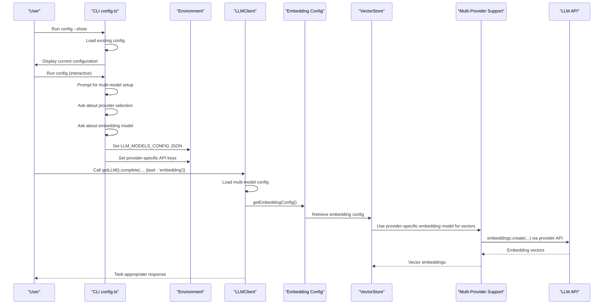
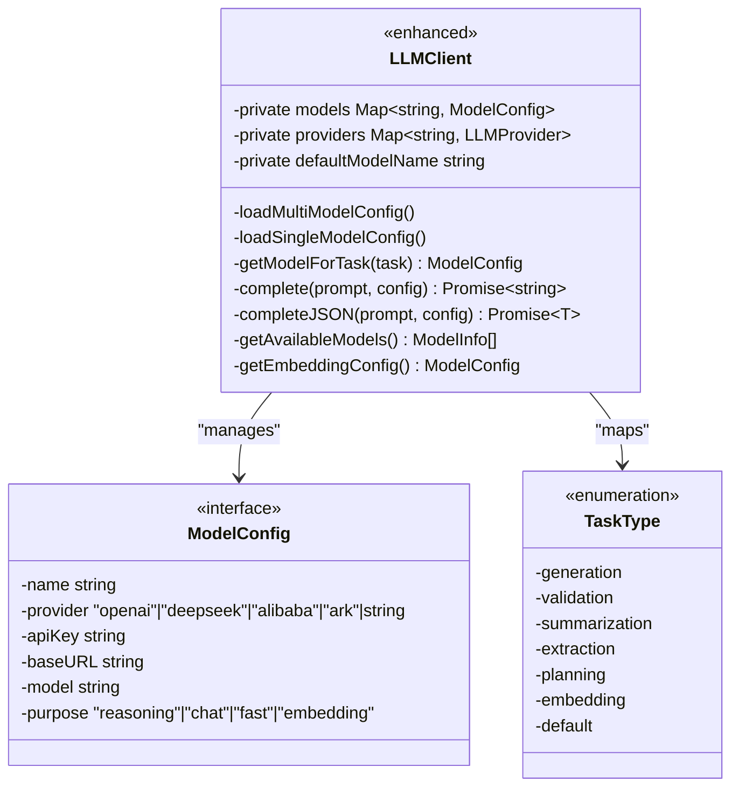
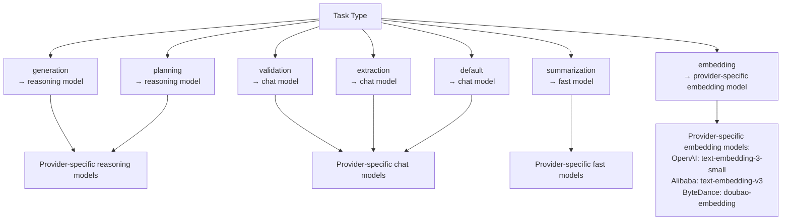
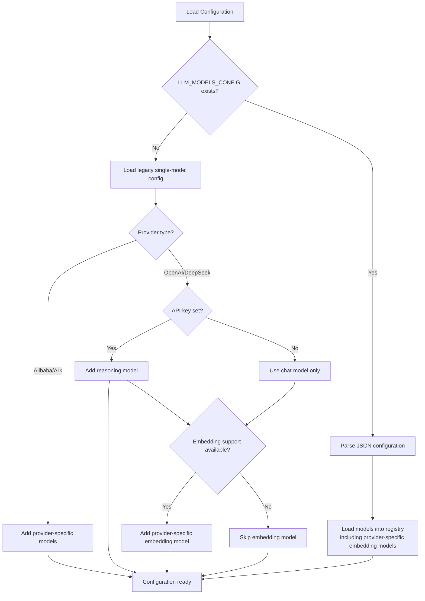
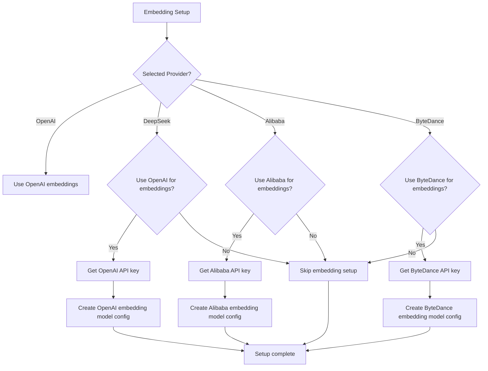
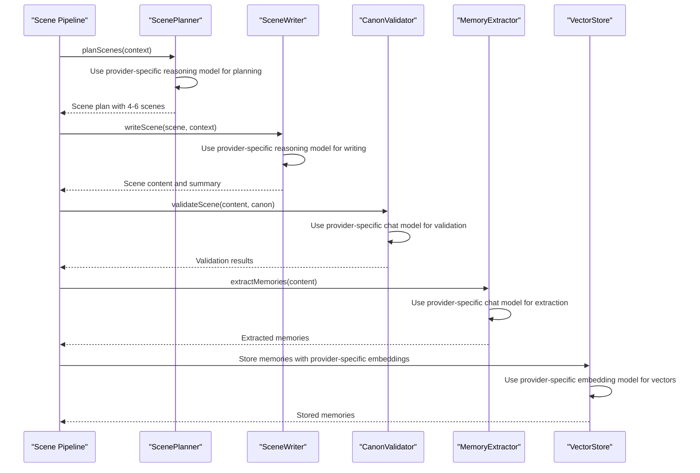
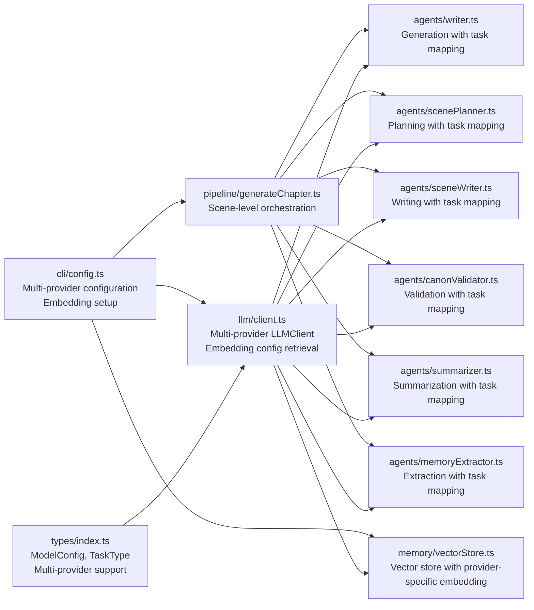

# LLM Integration and Configuration

<cite>
**Referenced Files in This Document**
- [client.ts](file://packages/engine/src/llm/client.ts)
- [types/index.ts](file://packages/engine/src/types/index.ts)
- [vectorStore.ts](file://packages/engine/src/memory/vectorStore.ts)
- [writer.ts](file://packages/engine/src/agents/writer.ts)
- [completeness.ts](file://packages/engine/src/agents/completeness.ts)
- [summarizer.ts](file://packages/engine/src/agents/summarizer.ts)
- [canonValidator.ts](file://packages/engine/src/agents/canonValidator.ts)
- [memoryExtractor.ts](file://packages/engine/src/agents/memoryExtractor.ts)
- [scenePlanner.ts](file://packages/engine/src/agents/scenePlanner.ts)
- [sceneWriter.ts](file://packages/engine/src/agents/sceneWriter.ts)
- [generateChapter.ts](file://packages/engine/src/pipeline/generateChapter.ts)
- [config.ts](file://apps/cli/src/commands/config.ts)
- [index.ts](file://apps/cli/src/index.ts)
- [vector-memory.test.ts](file://packages/engine/src/test/vector-memory.test.ts)
</cite>

## Update Summary
**Changes Made**
- Enhanced LLM client with comprehensive multi-model configuration system supporting reasoning, chat, fast, and embedding models across multiple providers
- Added Alibaba Cloud (Qwen) and ByteDance Ark providers with dedicated embedding support
- Expanded configuration system with provider-specific base URLs and model recommendations
- Enhanced CLI configuration with multi-provider setup wizard including Alibaba Cloud and ByteDance Ark
- Integrated vector store with provider-specific embedding model configuration for memory management
- Improved task-specific model mapping with embedding support for vector operations
- Added environment variable support for new providers (ALIBABA_API_KEY, ARK_API_KEY)
- Enhanced embedding model routing for provider-specific embedding models

## Table of Contents
1. [Introduction](#introduction)
2. [Project Structure](#project-structure)
3. [Core Components](#core-components)
4. [Architecture Overview](#architecture-overview)
5. [Detailed Component Analysis](#detailed-component-analysis)
6. [Multi-Model Configuration System](#multi-model-configuration-system)
7. [Task-Specific Model Mapping](#task-specific-model-mapping)
8. [Enhanced Configuration System](#enhanced-configuration-system)
9. [Multi-Provider Support](#multi-provider-support)
10. [Embedding Model Integration](#embedding-model-integration)
11. [Scene-Level Generation Pipeline](#scene-level-generation-pipeline)
12. [Dependency Analysis](#dependency-analysis)
13. [Performance Considerations](#performance-considerations)
14. [Troubleshooting Guide](#troubleshooting-guide)
15. [Conclusion](#conclusion)
16. [Appendices](#appendices)

## Introduction
This document explains the enhanced LLM integration and configuration within the Narrative Operating System. The system now features a comprehensive multi-model architecture supporting reasoning, chat, fast, and embedding models across multiple providers including OpenAI, DeepSeek, Alibaba Cloud (Qwen), and ByteDance Ark. The enhanced system provides intelligent model selection based on task requirements, sophisticated embedding model routing for vector operations, and robust configuration management with provider-specific settings.

The enhanced system introduces intelligent model selection based on task requirements, embedding model routing for vector operations, improved JSON content extraction from markdown code blocks, and a robust scene-level generation pipeline that leverages specialized models for different narrative components. The CLI configuration system now supports both single-model and multi-model setups with interactive wizards, embedding model configuration, and comprehensive show configuration capabilities across all supported providers.

## Project Structure
The enhanced LLM integration spans five primary areas:
- Engine LLM client and types define the provider abstraction, multi-model configuration, task-specific model mapping, and embedding model support across multiple providers.
- Agents consume the LLM client with automatic model selection based on task requirements including embedding tasks.
- CLI configuration manages both legacy single-model and modern multi-model setups with interactive wizards and embedding model configuration across all providers.
- Vector store integrates embedding model configuration for memory management and semantic search.
- Scene-level pipeline orchestrates generation with integrated multi-model support for planning, writing, and validation.

```mermaid
graph TB
subgraph "CLI"
IDX["index.ts<br/>Application entry point<br/>Auto-apply configuration"]
CFG["config.ts<br/>Multi-model config wizard<br/>Multi-provider setup<br/>Embedding setup<br/>Show configuration feature"]
end
subgraph "Engine"
TYPES["types/index.ts<br/>ModelConfig, MultiModelConfig<br/>TaskType enumeration<br/>Multi-provider support"]
CLIENT["llm/client.ts<br/>LLMClient with multi-model support<br/>Provider-specific models<br/>Embedding config retrieval<br/>Task mapping & model selection"]
PIPE["pipeline/generateChapter.ts<br/>Scene-level generation<br/>Multi-model orchestration"]
end
subgraph "Memory"
VECTOR["memory/vectorStore.ts<br/>Vector store with embedding integration<br/>Provider-specific embedding<br/>Embedding model configuration"]
end
subgraph "Agents"
WR["agents/writer.ts<br/>Generation task (reasoning model)"]
SUM["agents/summarizer.ts<br/>Summarization task (fast model)"]
VAL["agents/canonValidator.ts<br/>Validation task (chat model)"]
MEM["agents/memoryExtractor.ts<br/>Extraction task (chat model)"]
PLAN["agents/scenePlanner.ts<br/>Planning task (reasoning model)"]
WRITE["agents/sceneWriter.ts<br/>Writing task (reasoning model)"]
end
subgraph "Configuration"
MODELS["Multi-Model Config<br/>Providers: OpenAI, DeepSeek, Alibaba Cloud, ByteDance Ark<br/>reasoning: provider-specific models<br/>chat: provider-specific models<br/>fast: provider-specific models<br/>embedding: provider-specific embedding models"]
LEGACY["Legacy Config<br/>Single model fallback"]
END
IDX --> CFG
CFG --> CLIENT
PIPE --> WR
PIPE --> PLAN
PIPE --> WRITE
PIPE --> VAL
PIPE --> SUM
PIPE --> MEM
WR --> CLIENT
PLAN --> CLIENT
WRITE --> CLIENT
VAL --> CLIENT
SUM --> CLIENT
MEM --> CLIENT
VECTOR --> CLIENT
CLIENT --> MODELS
CLIENT --> LEGACY
```

**Diagram sources**
- [index.ts:17-17](file://apps/cli/src/index.ts#L17-L17)
- [config.ts:32-37](file://apps/cli/src/commands/config.ts#L32-L37)
- [client.ts:49-210](file://packages/engine/src/llm/client.ts#L49-L210)
- [generateChapter.ts:63-205](file://packages/engine/src/pipeline/generateChapter.ts#L63-L205)
- [vectorStore.ts:125-202](file://packages/engine/src/memory/vectorStore.ts#L125-L202)
- [writer.ts:103-107](file://packages/engine/src/agents/writer.ts#L103-L107)
- [summarizer.ts:27-31](file://packages/engine/src/agents/summarizer.ts#L27-L31)
- [canonValidator.ts:44-48](file://packages/engine/src/agents/canonValidator.ts#L44-L48)
- [memoryExtractor.ts:62-66](file://packages/engine/src/agents/memoryExtractor.ts#L62-L66)
- [scenePlanner.ts:82-85](file://packages/engine/src/agents/scenePlanner.ts#L82-L85)
- [sceneWriter.ts:85-88](file://packages/engine/src/agents/sceneWriter.ts#L85-L88)

**Section sources**
- [client.ts:49-210](file://packages/engine/src/llm/client.ts#L49-L210)
- [types/index.ts:91-115](file://packages/engine/src/types/index.ts#L91-L115)
- [config.ts:32-37](file://apps/cli/src/commands/config.ts#L32-L37)
- [index.ts:17-17](file://apps/cli/src/index.ts#L17-L17)
- [vectorStore.ts:125-202](file://packages/engine/src/memory/vectorStore.ts#L125-L202)

## Core Components
- **Multi-Provider LLM Client**: Enhanced LLMClient supporting multiple providers (OpenAI, DeepSeek, Alibaba Cloud, ByteDance Ark) with provider-specific model configurations and embedding support.
- **Task-Specific Model Mapping**: Intelligent model selection based on task types (generation, validation, summarization, extraction, planning, embedding) with provider-aware routing.
- **Enhanced LLMClient**: Centralizes provider creation, multi-model configuration loading, completion helpers, and embedding configuration retrieval with robust JSON parsing.
- **Advanced Types**: ModelConfig and MultiModelConfig define comprehensive runtime configuration with purpose-based model categorization including multi-provider support.
- **Intelligent Agents**: All agents now support task parameter for automatic model selection based on their requirements, including embedding tasks.
- **Dual Configuration System**: Backward compatibility with legacy single-model configs while supporting modern multi-model setups with provider-specific embedding model configuration.
- **Vector Store Integration**: Memory management system with provider-specific embedding model configuration for semantic search and vector operations.
- **Provider-Specific Base URLs**: Support for provider-specific API endpoints including Alibaba Cloud and ByteDance Ark base URLs.

Key responsibilities:
- Dynamic model loading from environment variables or persisted CLI config with JSON configuration support including provider-specific embedding models.
- Task-aware model selection using predefined mapping rules for optimal performance and cost, including embedding model routing across providers.
- Provider selection and instantiation based on model configuration with support for multiple providers including OpenAI, DeepSeek, Alibaba Cloud, and ByteDance Ark.
- Intelligent JSON parsing with extraction from markdown code blocks and robust error handling.
- Comprehensive backward compatibility with legacy single-model configurations.
- Scene-level generation pipeline integration with specialized model assignment for different phases.
- Provider-specific embedding model configuration retrieval and integration with vector store operations.

**Section sources**
- [client.ts:49-210](file://packages/engine/src/llm/client.ts#L49-L210)
- [types/index.ts:91-115](file://packages/engine/src/types/index.ts#L91-L115)
- [writer.ts:103-107](file://packages/engine/src/agents/writer.ts#L103-L107)
- [summarizer.ts:27-31](file://packages/engine/src/agents/summarizer.ts#L27-L31)
- [canonValidator.ts:44-48](file://packages/engine/src/agents/canonValidator.ts#L44-L48)
- [memoryExtractor.ts:62-66](file://packages/engine/src/agents/memoryExtractor.ts#L62-L66)
- [scenePlanner.ts:82-85](file://packages/engine/src/agents/scenePlanner.ts#L82-L85)
- [sceneWriter.ts:85-88](file://packages/engine/src/agents/sceneWriter.ts#L85-L88)
- [vectorStore.ts:125-202](file://packages/engine/src/memory/vectorStore.ts#L125-L202)

## Architecture Overview
The enhanced system follows a sophisticated layered design with intelligent model selection and multi-provider embedding integration:
- CLI layer provides dual configuration modes (single-model legacy and multi-model modern) with interactive wizards including multi-provider setup and embedding model configuration.
- Engine layer dynamically loads multi-model configuration from environment variables or JSON config, with automatic fallback to legacy single-model setup and provider-specific embedding model configuration retrieval.
- Agent layer automatically selects appropriate models based on task requirements using predefined mapping rules including embedding tasks across all providers.
- Vector store integrates provider-specific embedding model configuration for memory management and semantic search operations.
- Pipeline orchestrates scene-level generation with specialized models for planning, writing, and validation phases.



**Diagram sources**
- [index.ts:17-17](file://apps/cli/src/index.ts#L17-L17)
- [config.ts:57-277](file://apps/cli/src/commands/config.ts#L57-L277)
- [client.ts:58-125](file://packages/engine/src/llm/client.ts#L58-L125)
- [client.ts:135-147](file://packages/engine/src/llm/client.ts#L135-L147)
- [client.ts:192-200](file://packages/engine/src/llm/client.ts#L192-L200)
- [vectorStore.ts:131-154](file://packages/engine/src/memory/vectorStore.ts#L131-L154)

## Detailed Component Analysis

### Enhanced LLM Client with Multi-Provider Support
The LLMClient now features comprehensive multi-provider architecture with embedding model integration:
- **Multi-Provider Configuration**: Loads models from JSON environment variable or falls back to legacy single-model setup including provider-specific embedding models.
- **Provider Registry**: Maintains separate registry for models with different providers (OpenAI, DeepSeek, Alibaba Cloud, ByteDance Ark).
- **Task-Aware Selection**: Automatically selects appropriate model based on task type using predefined mapping rules including embedding tasks.
- **Enhanced JSON Parsing**: Robust extraction from markdown code blocks with fallback to direct JSON parsing.
- **Provider Management**: Manages multiple providers with different API keys, base URLs, and model configurations.
- **Embedding Configuration Retrieval**: Provides getEmbeddingConfig() method for accessing provider-specific embedding model configuration.



**Diagram sources**
- [client.ts:49-210](file://packages/engine/src/llm/client.ts#L49-L210)
- [types/index.ts:92-115](file://packages/engine/src/types/index.ts#L92-L115)

**Section sources**
- [client.ts:49-210](file://packages/engine/src/llm/client.ts#L49-L210)
- [types/index.ts:91-115](file://packages/engine/src/types/index.ts#L91-L115)

### Advanced Task-Specific Model Mapping
The system implements intelligent model selection based on task requirements including embedding tasks across all providers:
- **Generation Tasks**: Use reasoning models (provider-specific reasoning models) for complex creative writing and planning.
- **Validation Tasks**: Use chat models (provider-specific chat models) for structured validation and JSON parsing.
- **Summarization Tasks**: Use fast models (provider-specific fast models) for efficient content summarization.
- **Extraction Tasks**: Use chat models for memory and narrative extraction.
- **Planning Tasks**: Use reasoning models for scene and chapter planning.
- **Embedding Tasks**: Use provider-specific embedding models (OpenAI text-embedding-3-small, Alibaba text-embedding-v3, ByteDance doubao-embedding) for vector operations and semantic search.



**Diagram sources**
- [client.ts:40-48](file://packages/engine/src/llm/client.ts#L40-L48)
- [writer.ts:103-107](file://packages/engine/src/agents/writer.ts#L103-L107)
- [summarizer.ts:27-31](file://packages/engine/src/agents/summarizer.ts#L27-L31)
- [canonValidator.ts:44-48](file://packages/engine/src/agents/canonValidator.ts#L44-L48)
- [memoryExtractor.ts:62-66](file://packages/engine/src/agents/memoryExtractor.ts#L62-L66)

**Section sources**
- [client.ts:40-48](file://packages/engine/src/llm/client.ts#L40-L48)
- [writer.ts:103-107](file://packages/engine/src/agents/writer.ts#L103-L107)
- [summarizer.ts:27-31](file://packages/engine/src/agents/summarizer.ts#L27-L31)
- [canonValidator.ts:44-48](file://packages/engine/src/agents/canonValidator.ts#L44-L48)
- [memoryExtractor.ts:62-66](file://packages/engine/src/agents/memoryExtractor.ts#L62-L66)

### Enhanced Configuration Management
The CLI configuration system now supports both single-model and multi-model setups with comprehensive provider support:
- **Multi-Provider Wizard**: Interactive setup for configuring reasoning, chat, fast, and embedding models with provider selection including Alibaba Cloud and ByteDance Ark.
- **Provider-Specific Embedding Setup**: Dedicated embedding configuration wizard for provider-specific embedding models with API key management.
- **Backward Compatibility**: Automatic detection and migration from legacy single-model configurations.
- **Show Configuration**: Comprehensive display of current configuration status including provider-specific embedding model setup.
- **Environment Integration**: Automatic application of configuration to environment variables at startup including provider-specific API keys.

**Section sources**
- [config.ts:57-277](file://apps/cli/src/commands/config.ts#L57-L277)
- [index.ts:17-17](file://apps/cli/src/index.ts#L17-L17)
- [client.ts:58-111](file://packages/engine/src/llm/client.ts#L58-L111)

## Multi-Model Configuration System

### Comprehensive Multi-Provider Architecture
The enhanced system supports four distinct model purposes with intelligent assignment across multiple providers:

**Reasoning Models**: Optimized for complex creative tasks and planning
- OpenAI: gpt-4o, gpt-4o-mini, gpt-4-turbo
- DeepSeek: deepseek-reasoner
- Alibaba Cloud: qwen-max, qwen-plus, qwen-turbo
- ByteDance Ark: doubao-pro-128k, doubao-lite-128k

**Chat Models**: Balanced for validation and extraction tasks  
- OpenAI: gpt-4o, gpt-4o-mini, gpt-4-turbo
- DeepSeek: deepseek-chat
- Alibaba Cloud: qwen-max, qwen-plus, qwen-turbo
- ByteDance Ark: doubao-pro-128k, doubao-lite-128k

**Fast Models**: Optimized for summarization and quick tasks
- OpenAI: gpt-4o-mini
- DeepSeek: deepseek-chat
- Alibaba Cloud: qwen-turbo
- ByteDance Ark: doubao-lite-128k

**Embedding Models**: Specialized for vector operations and semantic search
- OpenAI: text-embedding-3-small (1536 dimensions)
- Alibaba Cloud: text-embedding-v3 (1024 dimensions)
- ByteDance Ark: doubao-embedding (1024 dimensions)

### Provider-Specific Configuration Loading
The system implements hierarchical configuration loading with provider-specific embedding model support:



**Diagram sources**
- [client.ts:58-111](file://packages/engine/src/llm/client.ts#L58-L111)
- [config.ts:192-214](file://apps/cli/src/commands/config.ts#L192-L214)

**Section sources**
- [client.ts:58-111](file://packages/engine/src/llm/client.ts#L58-L111)
- [config.ts:192-214](file://apps/cli/src/commands/config.ts#L192-L214)

## Task-Specific Model Mapping

### Intelligent Model Selection Algorithm
The system uses a sophisticated mapping algorithm to select appropriate models based on task requirements including embedding tasks across all providers:

**Generation Phase**: Uses reasoning models for complex creative writing
- High cognitive load tasks requiring step-by-step reasoning
- Creative narrative generation with character development
- Complex plot advancement and world-building using provider-specific reasoning models

**Planning Phase**: Uses reasoning models for structural planning
- Scene breakdown and narrative structure
- Character interaction pattern recognition
- Plot thread integration and advancement using provider-specific reasoning models

**Validation Phase**: Uses chat models for structured validation
- JSON parsing and structured output validation
- Fact-checking against canonical database
- Quality assurance and consistency checks using provider-specific chat models

**Summarization Phase**: Uses fast models for efficient processing
- Rapid content analysis and summarization
- Memory extraction and key event identification
- Cost-effective processing for large volumes using provider-specific fast models

**Extraction Phase**: Uses chat models for contextual extraction
- Narrative memory identification
- Character development tracking
- Plot thread monitoring using provider-specific chat models

**Embedding Phase**: Uses provider-specific embedding models for vector operations
- Semantic search and memory retrieval
- Vector space operations for memory management
- Contextual similarity analysis using provider-specific embedding models

**Section sources**
- [client.ts:40-48](file://packages/engine/src/llm/client.ts#L40-L48)
- [writer.ts:103-107](file://packages/engine/src/agents/writer.ts#L103-L107)
- [summarizer.ts:27-31](file://packages/engine/src/agents/summarizer.ts#L27-L31)
- [canonValidator.ts:44-48](file://packages/engine/src/agents/canonValidator.ts#L44-L48)
- [memoryExtractor.ts:62-66](file://packages/engine/src/agents/memoryExtractor.ts#L62-L66)

## Enhanced Configuration System

### Multi-Provider Configuration Wizard
The CLI now provides an interactive wizard for comprehensive multi-model setup including provider-specific embedding configuration:

**Provider Selection**: Choose between OpenAI, DeepSeek, Alibaba Cloud, and ByteDance Ark with model recommendations
**API Key Management**: Secure input with masking and validation for provider-specific API keys
**Model Assignment**: Configure reasoning, chat, fast, and embedding models separately with provider-specific model recommendations
**Purpose-Based Configuration**: Explicit model purpose assignment for optimal performance across all providers
**Provider-Specific Embedding Setup**: Dedicated embedding configuration wizard for provider-specific embedding models

### Show Configuration Feature
Comprehensive configuration display with multi-provider support including provider-specific embedding models:

**Multi-Provider View**: Shows all configured models with purpose, provider, and model details
**Provider-Specific Status**: Clear indication of provider-specific embedding model configuration and availability
**Status Indicators**: Clear indication of API key status and model availability for each provider
**Configuration Location**: Displays path to configuration file for transparency
**Migration Assistance**: Guidance for upgrading from legacy single-model setup with provider-specific models

**Section sources**
- [config.ts:57-277](file://apps/cli/src/commands/config.ts#L57-L277)
- [index.ts:32-39](file://apps/cli/src/index.ts#L32-L39)

## Multi-Provider Support

### Provider Configuration and Base URLs
The system now supports four major LLM providers with provider-specific configurations:

**OpenAI Provider**
- Models: gpt-4o, gpt-4o-mini, gpt-4-turbo, text-embedding-3-small
- Base URL: Standard OpenAI endpoint
- Embedding: Native OpenAI embedding support

**DeepSeek Provider**
- Models: deepseek-chat, deepseek-reasoner
- Base URL: https://api.deepseek.com
- Embedding: Requires OpenAI embedding fallback

**Alibaba Cloud (Qwen) Provider**
- Models: qwen-max, qwen-plus, qwen-turbo, text-embedding-v3
- Base URL: https://dashscope.aliyuncs.com/compatible-mode/v1
- Embedding: Native Alibaba Cloud embedding support

**ByteDance Ark Provider**
- Models: doubao-pro-128k, doubao-lite-128k, doubao-embedding
- Base URL: https://ark.cn-beijing.volces.com/api/v3
- Embedding: Native ByteDance Ark embedding support

### Environment Variable Support
The system supports provider-specific environment variables for seamless integration:

**Provider-Specific API Keys**:
- OPENAI_API_KEY: OpenAI API key
- DEEPSEEK_API_KEY: DeepSeek API key
- ALIBABA_API_KEY: Alibaba Cloud API key
- ARK_API_KEY: ByteDance Ark API key

**Legacy Support**:
- LLM_PROVIDER: Legacy single-model provider
- LLM_MODEL: Legacy single-model identifier
- LLM_MODELS_CONFIG: Multi-model configuration JSON

**Section sources**
- [config.ts:32-37](file://apps/cli/src/commands/config.ts#L32-L37)
- [config.ts:283-317](file://apps/cli/src/commands/config.ts#L283-L317)
- [vector-memory.test.ts:16-26](file://packages/engine/src/test/vector-memory.test.ts#L16-L26)

## Embedding Model Integration

### Provider-Specific Embedding Model Configuration
The system now supports dedicated embedding models for vector operations across all providers:

**OpenAI Embedding Models**: 
- Primary: text-embedding-3-small (1536 dimensions)
- Provider: OpenAI native support
- Use cases: Memory storage, semantic search, vector operations

**Alibaba Cloud Embedding Models**:
- Primary: text-embedding-v3 (1024 dimensions)
- Provider: Alibaba Cloud native support
- Base URL: https://dashscope.aliyuncs.com/compatible-mode/v1
- Use cases: Memory storage, semantic search, vector operations

**ByteDance Ark Embedding Models**:
- Primary: doubao-embedding (1024 dimensions)
- Provider: ByteDance Ark native support
- Base URL: https://ark.cn-beijing.volces.com/api/v3
- Use cases: Memory storage, semantic search, vector operations

**DeepSeek Embedding Models**: 
- Primary: OpenAI text-embedding-3-small (requires OpenAI API key)
- Provider: DeepSeek does not support embeddings natively
- Use cases: Memory storage, semantic search, vector operations
- Fallback: OpenAI embedding model configuration

**Embedding Configuration Retrieval**: LLMClient provides getEmbeddingConfig() method
- Centralized embedding model configuration access across all providers
- Automatic embedding model discovery from multi-model setup
- Fallback to environment variables if embedding model not configured

**Vector Store Integration**: Memory management system with provider-specific embedding model support
- Automatic embedding model configuration retrieval from LLM client
- Fallback to mock embeddings for testing without provider API
- Robust error handling for provider embedding API failures

### Provider-Specific Embedding Setup Process
The CLI wizard guides users through provider-specific embedding model configuration:



**Diagram sources**
- [config.ts:126-191](file://apps/cli/src/commands/config.ts#L126-L191)
- [client.ts:192-200](file://packages/engine/src/llm/client.ts#L192-L200)
- [vectorStore.ts:131-154](file://packages/engine/src/memory/vectorStore.ts#L131-L154)

**Section sources**
- [config.ts:126-191](file://apps/cli/src/commands/config.ts#L126-L191)
- [client.ts:192-200](file://packages/engine/src/llm/client.ts#L192-L200)
- [vectorStore.ts:131-154](file://packages/engine/src/memory/vectorStore.ts#L131-L154)

## Scene-Level Generation Pipeline

### Integrated Multi-Provider Support
The enhanced pipeline leverages specialized models for different generation phases including provider-specific embedding operations:

**Scene Planning Phase**: Uses reasoning models for intelligent scene breakdown
- Complex narrative structure analysis using provider-specific reasoning models
- Character interaction pattern recognition
- Plot thread integration and advancement using provider-specific reasoning models

**Scene Writing Phase**: Uses reasoning models for immersive narrative generation
- Detailed character development within scenes using provider-specific reasoning models
- Complex dialogue and interaction writing
- Rich descriptive prose with proper scene boundaries using provider-specific reasoning models

**Validation Phase**: Uses chat models for structured validation
- Canonical consistency checking using provider-specific chat models
- Narrative logic validation
- Character and plot thread adherence verification using provider-specific chat models

**Memory Extraction Phase**: Uses chat models for contextual memory identification
- Important event identification using provider-specific chat models
- Character development tracking
- Plot thread advancement documentation using provider-specific chat models

**Vector Operations Phase**: Uses provider-specific embedding models for memory management
- Semantic search and memory retrieval using provider-specific embedding models
- Vector space operations for memory organization
- Contextual similarity analysis for memory association using provider-specific embedding models



**Diagram sources**
- [generateChapter.ts:63-205](file://packages/engine/src/pipeline/generateChapter.ts#L63-L205)
- [scenePlanner.ts:82-85](file://packages/engine/src/agents/scenePlanner.ts#L82-L85)
- [sceneWriter.ts:85-88](file://packages/engine/src/agents/sceneWriter.ts#L85-L88)
- [canonValidator.ts:44-48](file://packages/engine/src/agents/canonValidator.ts#L44-L48)
- [memoryExtractor.ts:62-66](file://packages/engine/src/agents/memoryExtractor.ts#L62-L66)
- [vectorStore.ts:125-202](file://packages/engine/src/memory/vectorStore.ts#L125-L202)

**Section sources**
- [generateChapter.ts:63-205](file://packages/engine/src/pipeline/generateChapter.ts#L63-L205)
- [scenePlanner.ts:82-85](file://packages/engine/src/agents/scenePlanner.ts#L82-L85)
- [sceneWriter.ts:85-88](file://packages/engine/src/agents/sceneWriter.ts#L85-L88)
- [canonValidator.ts:44-48](file://packages/engine/src/agents/canonValidator.ts#L44-L48)
- [memoryExtractor.ts:62-66](file://packages/engine/src/agents/memoryExtractor.ts#L62-L66)
- [vectorStore.ts:125-202](file://packages/engine/src/memory/vectorStore.ts#L125-L202)

## Dependency Analysis
The enhanced system maintains clean dependency relationships with multi-provider embedding model integration:
- LLM client depends on types for configuration interfaces and model definitions including multi-provider support.
- Agents depend on LLM client with automatic task-based model selection including embedding tasks across all providers.
- Vector store integrates with LLM client for provider-specific embedding model configuration retrieval.
- Pipeline orchestrates agents with integrated multi-model support including provider-specific embedding operations.
- CLI configuration manages both legacy and multi-model setups with environment variable application and provider-specific embedding model configuration.



**Diagram sources**
- [types/index.ts:91-115](file://packages/engine/src/types/index.ts#L91-L115)
- [client.ts:49-210](file://packages/engine/src/llm/client.ts#L49-L210)
- [writer.ts:103-107](file://packages/engine/src/agents/writer.ts#L103-L107)
- [scenePlanner.ts:82-85](file://packages/engine/src/agents/scenePlanner.ts#L82-L85)
- [sceneWriter.ts:85-88](file://packages/engine/src/agents/sceneWriter.ts#L85-L88)
- [canonValidator.ts:44-48](file://packages/engine/src/agents/canonValidator.ts#L44-L48)
- [summarizer.ts:27-31](file://packages/engine/src/agents/summarizer.ts#L27-L31)
- [memoryExtractor.ts:62-66](file://packages/engine/src/agents/memoryExtractor.ts#L62-L66)
- [vectorStore.ts:125-202](file://packages/engine/src/memory/vectorStore.ts#L125-L202)
- [generateChapter.ts:63-205](file://packages/engine/src/pipeline/generateChapter.ts#L63-L205)
- [config.ts:192-214](file://apps/cli/src/commands/config.ts#L192-L214)

**Section sources**
- [client.ts:49-210](file://packages/engine/src/llm/client.ts#L49-L210)
- [writer.ts:103-107](file://packages/engine/src/agents/writer.ts#L103-L107)
- [scenePlanner.ts:82-85](file://packages/engine/src/agents/scenePlanner.ts#L82-L85)
- [sceneWriter.ts:85-88](file://packages/engine/src/agents/sceneWriter.ts#L85-L88)
- [canonValidator.ts:44-48](file://packages/engine/src/agents/canonValidator.ts#L44-L48)
- [summarizer.ts:27-31](file://packages/engine/src/agents/summarizer.ts#L27-L31)
- [memoryExtractor.ts:62-66](file://packages/engine/src/agents/memoryExtractor.ts#L62-L66)
- [vectorStore.ts:125-202](file://packages/engine/src/memory/vectorStore.ts#L125-L202)
- [generateChapter.ts:63-205](file://packages/engine/src/pipeline/generateChapter.ts#L63-L205)
- [config.ts:192-214](file://apps/cli/src/commands/config.ts#L192-L214)

## Performance Considerations
- **Model Selection Optimization**: Intelligent task-based model selection reduces latency and improves cost efficiency, including provider-specific embedding model routing.
- **Connection Pooling**: OpenAI SDK manages HTTP connections internally; no manual pooling required.
- **Rate Limiting**: Handled by provider SDKs with exponential backoff; no custom implementation needed.
- **Cost Optimization**: 
  - Use fast models for summarization and extraction tasks across all providers.
  - Apply reasoning models only for complex creative tasks.
  - Use provider-specific embedding models only when vector operations are required.
  - Leverage multi-provider setup for optimal performance-cost balance.
- **Throughput**: Scene-level generation with integrated model selection maximizes efficiency.
- **Memory Management**: Automatic model cleanup and provider reuse through singleton pattern.
- **Provider-Specific Performance**: Vector store uses optimized embedding models for semantic search operations across all providers.
- **Backward Compatibility**: Legacy single-model configurations continue to work without performance impact.
- **Provider Latency**: Consider provider-specific API latency and choose providers based on geographic location and performance requirements.

## Troubleshooting Guide
Common issues and resolutions:
- **Model Not Found Errors**: Verify LLM_MODELS_CONFIG JSON syntax and model names for the selected provider.
- **Task Mapping Issues**: Ensure task parameter is correctly specified in agent calls including embedding tasks.
- **Multi-Provider Configuration Conflicts**: Check environment variable precedence and JSON configuration validity for provider-specific settings.
- **Legacy Configuration Migration**: Use show configuration feature to verify migration success with provider-specific models.
- **Provider Authentication**: Verify API keys match selected provider and model combinations including provider-specific API keys.
- **Embedding Model Issues**: Check provider-specific API key configuration and embedding model availability for the selected provider.
- **Vector Store Problems**: Verify provider-specific embedding model configuration and handle mock embedding fallback gracefully.
- **JSON Parsing Failures**: Enhanced extraction handles markdown code blocks automatically.
- **Performance Issues**: Monitor model selection and adjust task mapping if needed across all providers.
- **Configuration Loading Failures**: System automatically falls back to legacy single-model setup with provider-specific support.
- **Provider-Specific Issues**: Check provider-specific base URLs and model availability for the selected provider.

**Section sources**
- [client.ts:127-133](file://packages/engine/src/llm/client.ts#L127-L133)
- [client.ts:175-180](file://packages/engine/src/llm/client.ts#L175-L180)
- [config.ts:70-90](file://apps/cli/src/commands/config.ts#L70-L90)
- [client.ts:71-77](file://packages/engine/src/llm/client.ts#L71-L77)
- [vectorStore.ts:150-176](file://packages/engine/src/memory/vectorStore.ts#L150-L176)

## Conclusion
The enhanced Narrative Operating System provides a sophisticated multi-provider LLM integration with intelligent task-based model selection, comprehensive backward compatibility, and robust configuration management including provider-specific embedding model support. The system now supports OpenAI, DeepSeek, Alibaba Cloud (Qwen), and ByteDance Ark providers with automatic assignment based on task requirements, while maintaining seamless integration with existing single-model configurations.

The addition of provider-specific embedding model routing enables sophisticated memory management and semantic search capabilities through vector operations across all supported providers. The scene-level generation pipeline demonstrates the power of specialized model assignment, with reasoning models handling complex creative tasks, chat models managing validation and extraction, fast models optimizing summarization workflows, and provider-specific embedding models enabling vector-based memory operations.

The enhanced CLI configuration system provides both interactive setup wizards and comprehensive show configuration capabilities, including dedicated provider-specific embedding model setup for all supported providers. The vector store integration ensures seamless provider-specific embedding model configuration retrieval and robust error handling for embedding operations across all providers.

By leveraging task-specific model mapping, intelligent configuration loading, and provider-specific embedding model integration, teams can achieve optimal balance between narrative quality, cost efficiency, and performance while maintaining full backward compatibility with existing implementations and supporting multiple global providers.

## Appendices

### Multi-Provider Configuration Reference
- **Environment Variables**:
  - LLM_MODELS_CONFIG: JSON-encoded multi-model configuration including provider-specific embedding models
  - LLM_PROVIDER: Legacy single-model provider (fallback)
  - LLM_MODEL: Legacy single-model identifier
  - OPENAI_API_KEY: API key for OpenAI models and embeddings
  - DEEPSEEK_API_KEY: API key for DeepSeek models
  - ALIBABA_API_KEY: API key for Alibaba Cloud models and embeddings
  - ARK_API_KEY: API key for ByteDance Ark models and embeddings
  - USE_MOCK_EMBEDDINGS: Enable mock embeddings for testing
- **Configuration File**: ~/.narrative-os/config.json supports both legacy and multi-model formats including provider-specific embedding model configuration
- **Task Types**: generation, validation, summarization, extraction, planning, embedding, default
- **Model Purposes**: reasoning (complex tasks), chat (structured tasks), fast (efficiency), embedding (vector operations)
- **Supported Providers**: openai, deepseek, alibaba, ark

**Section sources**
- [client.ts:58-111](file://packages/engine/src/llm/client.ts#L58-L111)
- [types/index.ts:107-115](file://packages/engine/src/types/index.ts#L107-L115)
- [config.ts:192-214](file://apps/cli/src/commands/config.ts#L192-L214)

### Enhanced Configuration Commands
- **Interactive Setup**: `nos config` - Multi-provider wizard with provider selection, model assignment, and provider-specific embedding model setup
- **Show Configuration**: `nos config --show` - Comprehensive display of current multi-provider setup including provider-specific embedding configuration
- **Automatic Application**: Configuration applied to environment variables at startup including provider-specific API keys
- **Migration Support**: Seamless upgrade from legacy single-model configurations with provider-specific model support

**Section sources**
- [index.ts:32-39](file://apps/cli/src/index.ts#L32-L39)
- [config.ts:57-277](file://apps/cli/src/commands/config.ts#L57-L277)
- [index.ts:17-17](file://apps/cli/src/index.ts#L17-L17)

### Multi-Provider Model Recommendations
- **Generation Tasks**: Provider-specific reasoning models (OpenAI: gpt-4o, DeepSeek: deepseek-reasoner, Alibaba: qwen-max, ByteDance: doubao-pro-128k)
- **Planning Tasks**: Provider-specific reasoning models for scene and chapter planning
- **Validation Tasks**: Provider-specific chat models (OpenAI: gpt-4o-mini, DeepSeek: deepseek-chat, Alibaba: qwen-plus, ByteDance: doubao-lite-128k)
- **Summarization Tasks**: Provider-specific fast models for efficient content summarization
- **Extraction Tasks**: Provider-specific chat models for memory and narrative extraction
- **Embedding Tasks**: Provider-specific embedding models (OpenAI: text-embedding-3-small, Alibaba: text-embedding-v3, ByteDance: doubao-embedding, DeepSeek: OpenAI fallback)
- **Default Tasks**: Provider-specific chat models for general-purpose operations

**Section sources**
- [client.ts:40-48](file://packages/engine/src/llm/client.ts#L40-L48)
- [writer.ts:103-107](file://packages/engine/src/agents/writer.ts#L103-L107)
- [summarizer.ts:27-31](file://packages/engine/src/agents/summarizer.ts#L27-L31)
- [canonValidator.ts:44-48](file://packages/engine/src/agents/canonValidator.ts#L44-L48)
- [memoryExtractor.ts:62-66](file://packages/engine/src/agents/memoryExtractor.ts#L62-L66)

### Provider-Specific Embedding Model Configuration
- **OpenAI Provider**: Native embedding support with text-embedding-3-small (1536 dimensions)
- **Alibaba Cloud Provider**: Native embedding support with text-embedding-v3 (1024 dimensions) and base URL https://dashscope.aliyuncs.com/compatible-mode/v1
- **ByteDance Ark Provider**: Native embedding support with doubao-embedding (1024 dimensions) and base URL https://ark.cn-beijing.volces.com/api/v3
- **DeepSeek Provider**: Requires OpenAI embedding fallback with text-embedding-3-small (1536 dimensions)
- **Configuration**: Through CLI wizard or LLM_MODELS_CONFIG JSON with provider-specific settings
- **Fallback**: Mock embeddings for testing without provider API
- **Integration**: Automatic retrieval through getEmbeddingConfig() method with provider-specific model selection

**Section sources**
- [config.ts:126-191](file://apps/cli/src/commands/config.ts#L126-L191)
- [client.ts:192-200](file://packages/engine/src/llm/client.ts#L192-L200)
- [vectorStore.ts:131-154](file://packages/engine/src/memory/vectorStore.ts#L131-L154)