# Memory Management System

<cite>
**Referenced Files in This Document**
- [canonStore.ts](file://packages/engine/src/memory/canonStore.ts)
- [canonValidator.ts](file://packages/engine/src/agents/canonValidator.ts)
- [bible.ts](file://packages/engine/src/story/bible.ts)
- [generateChapter.ts](file://packages/engine/src/pipeline/generateChapter.ts)
- [writer.ts](file://packages/engine/src/agents/writer.ts)
- [completeness.ts](file://packages/engine/src/agents/completeness.ts)
- [summarizer.ts](file://packages/engine/src/agents/summarizer.ts)
- [state.ts](file://packages/engine/src/story/state.ts)
- [client.ts](file://packages/engine/src/llm/client.ts)
- [index.ts](file://packages/engine/src/index.ts)
- [generate.ts](file://apps/cli/src/commands/generate.ts)
- [simple.test.ts](file://packages/engine/src/test/simple.test.ts)
- [writer.md](file://packages/engine/src/llm/prompts/writer.md)
- [completeness.md](file://packages/engine/src/llm/prompts/completeness.md)
- [summarizer.md](file://packages/engine/src/llm/prompts/summarizer.md)
- [stateUpdater.ts](file://packages/engine/src/memory/stateUpdater.ts)
- [stateUpdater.ts](file://packages/engine/src/agents/stateUpdater.ts)
- [constraintGraph.ts](file://packages/engine/src/constraints/constraintGraph.ts)
- [vectorStore.ts](file://packages/engine/src/memory/vectorStore.ts)
- [structuredState.ts](file://packages/engine/src/story/structuredState.ts)
- [memoryRetriever.ts](file://packages/engine/src/memory/memoryRetriever.ts)
- [memoryExtractor.ts](file://packages/engine/src/agents/memoryExtractor.ts)
- [vector-memory.test.ts](file://packages/engine/src/test/vector-memory.test.ts)
- [store.ts](file://apps/cli/src/config/store.ts)
- [config.ts](file://apps/cli/src/commands/config.ts)
- [index.ts](file://packages/engine/src/types/index.ts)
- [sceneAssembler.ts](file://packages/engine/src/scene/sceneAssembler.ts)
- [sceneWriter.ts](file://packages/engine/src/agents/sceneWriter.ts)
</cite>

## Update Summary
**Changes Made**
- Enhanced sceneAssembler.ts to support multilingual content with language-aware summary concatenation and connector selection for different cultural narrative flows
- Updated generateChapter.ts to pass language parameter to scene assembly process
- Enhanced generateNaturalChapterSummary to support multilingual chapter summaries
- Improved language detection and handling throughout the scene generation pipeline
- Added comprehensive language support for scene-level generation with cultural narrative flow adaptation

## Table of Contents
1. [Introduction](#introduction)
2. [Project Structure](#project-structure)
3. [Core Components](#core-components)
4. [Architecture Overview](#architecture-overview)
5. [Detailed Component Analysis](#detailed-component-analysis)
6. [Dependency Analysis](#dependency-analysis)
7. [Performance Considerations](#performance-considerations)
8. [Troubleshooting Guide](#troubleshooting-guide)
9. [Conclusion](#conclusion)
10. [Appendices](#appendices)

## Introduction
This document describes the Memory Management System with a focus on Canonical Fact Storage, Enhanced Vector Memory System with Flexible Embedding Providers, Memory Validation, and Comprehensive State Management. The system now includes a sophisticated vector memory system with flexible embedding provider architecture that enables seamless switching between multiple providers (OpenAI, DeepSeek) for embedding generation, while maintaining backward compatibility and robust fallback mechanisms. The enhanced vector memory system integrates seamlessly with the canonical fact storage, memory validation, and state management components to provide a comprehensive memory infrastructure for narrative coherence and intelligent story generation.

**Updated** Enhanced multilingual support has been integrated throughout the scene assembly and chapter generation pipeline, enabling culturally-aware narrative flow adaptation and language-specific connector selection for different storytelling traditions.

## Project Structure
The memory system now encompasses a comprehensive vector memory infrastructure with enhanced state management capabilities and flexible embedding provider architecture:
- Memory: Canonical fact representation, vector-based memory storage, memory extraction, and retrieval
- Story: Structured story state with characters, plot threads, and unresolved questions
- Agents: Writers, completeness checker, summarizer, canonical validator, state updater, and memory extractor
- Pipeline: Orchestration of chapter generation with optional canonical validation, vector memory extraction, and state updates
- CLI: Command-line integration for iterative chapter generation with enhanced persistence including vector stores
- LLM Client: Multi-model configuration system supporting embedding provider flexibility and task-specific model routing
- Scene Assembly: Multilingual scene assembly with cultural narrative flow adaptation and language-aware connectors

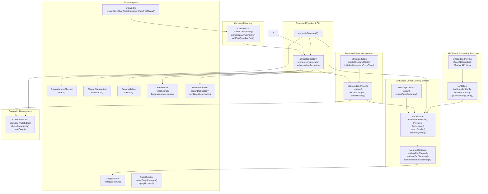

**Diagram sources**
- [vectorStore.ts:19-58](file://packages/engine/src/memory/vectorStore.ts#L19-L58)
- [memoryRetriever.ts:18-41](file://packages/engine/src/memory/memoryRetriever.ts#L18-L41)
- [memoryExtractor.ts:52-68](file://packages/engine/src/agents/memoryExtractor.ts#L52-L68)
- [canonStore.ts:17-58](file://packages/engine/src/memory/canonStore.ts#L17-L58)
- [stateUpdater.ts:90-248](file://packages/engine/src/memory/stateUpdater.ts#L90-L248)
- [bible.ts:3-26](file://packages/engine/src/story/bible.ts#L3-L26)
- [structuredState.ts:23-43](file://packages/engine/src/story/structuredState.ts#L23-L43)
- [writer.ts:55-94](file://packages/engine/src/agents/writer.ts#L55-L94)
- [completeness.ts:37-52](file://packages/engine/src/agents/completeness.ts#L37-L52)
- [summarizer.ts:24-38](file://packages/engine/src/agents/summarizer.ts#L24-L38)
- [canonValidator.ts:32-55](file://packages/engine/src/agents/canonValidator.ts#L32-L55)
- [stateUpdater.ts:85-193](file://packages/engine/src/agents/stateUpdater.ts#L85-L193)
- [constraintGraph.ts:29-245](file://packages/engine/src/constraints/constraintGraph.ts#L29-L245)
- [generateChapter.ts:20-71](file://packages/engine/src/pipeline/generateChapter.ts#L20-L71)
- [generate.ts:4-54](file://apps/cli/src/commands/generate.ts#L4-L54)
- [client.ts:50-210](file://packages/engine/src/llm/client.ts#L50-L210)
- [config.ts:125-170](file://apps/cli/src/commands/config.ts#L125-L170)
- [sceneAssembler.ts:14-43](file://packages/engine/src/scene/sceneAssembler.ts#L14-L43)
- [sceneWriter.ts:20-144](file://packages/engine/src/agents/sceneWriter.ts#L20-L144)

**Section sources**
- [index.ts:1-23](file://packages/engine/src/index.ts#L1-L23)

## Core Components
- **VectorStore**: Enhanced HNSW (Hierarchical Navigable Small World) algorithm-based vector memory storage with semantic similarity search, flexible embedding generation supporting multiple providers, auto-resizing capabilities, and full persistence support.
- **MemoryRetriever**: Advanced contextual memory retrieval system that searches vector stores for relevant past events, character memories, plot threads, and world details with intelligent query generation.
- **MemoryExtractor**: Sophisticated automated narrative memory extraction agent that identifies and categorizes important facts from chapters into four categories: events, characters, world, and plot.
- **CanonStore**: Immutable store of canonical facts with helpers to extract, add, update, filter, and format facts for prompts.
- **StateUpdaterPipeline**: Comprehensive post-chapter state management pipeline that extracts narrative changes, updates constraint graphs, maintains recent events, and integrates vector memory extraction with enhanced performance.
- **StructuredState**: Rich story state representation with characters, plot threads, unresolved questions, and recent events tracking.
- **StoryBible**: Central story definition containing characters and plot threads used to seed canonical facts and initialize structured state.
- **LLMClient**: Multi-model configuration system supporting embedding provider flexibility with task-specific model routing, embedding configuration management, and provider switching capabilities.
- **SceneWriter**: Language-aware scene generation agent that adapts narrative style and cultural context to the story's language setting.
- **SceneAssembler**: Multilingual scene assembly system with cultural narrative flow adaptation and language-specific connector selection.
- **Agents**:
  - ChapterWriter: Generates chapter content with optional memory injection for contextual awareness.
  - CompletenessChecker: Ensures chapters end at natural stopping points.
  - ChapterSummarizer: Produces concise chapter summaries for memory extraction.
  - CanonValidator: Validates generated chapters against canonical facts using LLM reasoning.
  - StateUpdater: Extracts and applies state changes for unresolved questions and recent events.
- **Enhanced Pipeline**: Orchestrates generation, optional canonical validation, vector memory extraction, and comprehensive state updates with scene-level generation capabilities.
- **CLI**: Iteratively generates chapters, updates state, persists progress, and manages vector store persistence with enhanced memory and constraint graph persistence, including embedding provider configuration.

**Section sources**
- [vectorStore.ts:4-17](file://packages/engine/src/memory/vectorStore.ts#L4-L17)
- [memoryRetriever.ts:5-16](file://packages/engine/src/memory/memoryRetriever.ts#L5-L16)
- [memoryExtractor.ts:5-12](file://packages/engine/src/agents/memoryExtractor.ts#L5-L12)
- [canonStore.ts:3-22](file://packages/engine/src/memory/canonStore.ts#L3-L22)
- [stateUpdater.ts:90-192](file://packages/engine/src/memory/stateUpdater.ts#L90-L192)
- [structuredState.ts:23-31](file://packages/engine/src/story/structuredState.ts#L23-L31)
- [bible.ts:3-26](file://packages/engine/src/story/bible.ts#L3-L26)
- [writer.ts:48-94](file://packages/engine/src/agents/writer.ts#L48-L94)
- [completeness.ts:30-52](file://packages/engine/src/agents/completeness.ts#L30-L52)
- [summarizer.ts:17-38](file://packages/engine/src/agents/summarizer.ts#L17-L38)
- [canonValidator.ts:31-55](file://packages/engine/src/agents/canonValidator.ts#L31-L55)
- [stateUpdater.ts:85-193](file://packages/engine/src/agents/stateUpdater.ts#L85-L193)
- [sceneAssembler.ts:14-43](file://packages/engine/src/scene/sceneAssembler.ts#L14-L43)
- [sceneWriter.ts:20-144](file://packages/engine/src/agents/sceneWriter.ts#L20-L144)
- [generateChapter.ts:14-71](file://packages/engine/src/pipeline/generateChapter.ts#L14-L71)
- [generate.ts:4-54](file://apps/cli/src/commands/generate.ts#L4-L54)
- [client.ts:50-210](file://packages/engine/src/llm/client.ts#L50-L210)

## Architecture Overview
The enhanced memory system integrates comprehensive vector memory capabilities with flexible embedding provider architecture and the generation pipeline as follows:
- StoryBible seeds both CanonStore and StructuredState via extraction and initialization.
- VectorStore integrates with LLM client for flexible embedding generation supporting multiple providers.
- VectorStore and MemoryRetriever are integrated into the writer to provide contextual memory injection.
- MemoryExtractor automatically extracts narrative memories from generated chapters and adds them to the vector store.
- SceneWriter generates scenes with language-aware content adaptation.
- SceneAssembler combines scenes with cultural narrative flow adaptation and language-specific connectors.
- After writing, the pipeline checks completeness and optionally validates against canonical facts.
- StateUpdaterPipeline processes the chapter to extract narrative changes, update constraint graphs, maintain recent events, and integrate vector memory extraction.
- Summaries trigger memory extraction for vector store persistence.
- CLI orchestrates iteration, persistence of chapters, state, vector stores, and constraint graphs with embedding provider configuration.

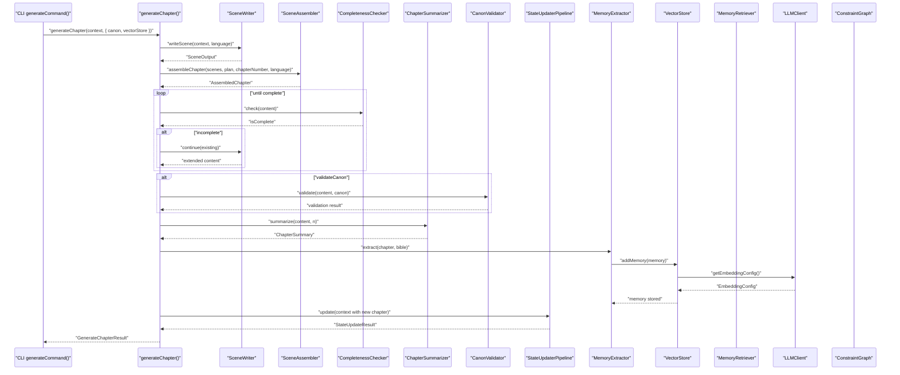

**Diagram sources**
- [generate.ts:21-34](file://apps/cli/src/commands/generate.ts#L21-L34)
- [generateChapter.ts:20-71](file://packages/engine/src/pipeline/generateChapter.ts#L20-L71)
- [writer.ts:55-94](file://packages/engine/src/agents/writer.ts#L55-L94)
- [completeness.ts:37-52](file://packages/engine/src/agents/completeness.ts#L37-L52)
- [summarizer.ts:24-38](file://packages/engine/src/agents/summarizer.ts#L24-L38)
- [canonValidator.ts:32-55](file://packages/engine/src/agents/canonValidator.ts#L32-L55)
- [stateUpdater.ts:94-248](file://packages/engine/src/memory/stateUpdater.ts#L94-L248)
- [memoryExtractor.ts:52-68](file://packages/engine/src/agents/memoryExtractor.ts#L52-L68)
- [vectorStore.ts:66-93](file://packages/engine/src/memory/vectorStore.ts#L66-L93)
- [memoryRetriever.ts:25-41](file://packages/engine/src/memory/memoryRetriever.ts#L25-L41)
- [client.ts:192-200](file://packages/engine/src/llm/client.ts#L192-L200)
- [sceneAssembler.ts:14-43](file://packages/engine/src/scene/sceneAssembler.ts#L14-L43)
- [sceneWriter.ts:20-144](file://packages/engine/src/agents/sceneWriter.ts#L20-L144)

## Detailed Component Analysis

### Enhanced SceneAssembler: Multilingual Content with Cultural Narrative Flow Adaptation
The SceneAssembler now provides sophisticated multilingual scene assembly with cultural narrative flow adaptation:

- **Language-Aware Scene Combination**: The assembleChapter function accepts a language parameter and uses it to adapt scene combination strategies for different cultural narrative traditions.
- **Cultural Connector Selection**: The system selects appropriate narrative connectors and transitions based on the story's language setting, adapting from Western linear narratives to more circular or episodic storytelling patterns.
- **Multilingual Summary Processing**: Enhanced generateChapterSummary function can process scene summaries with language-specific concatenation rules and cultural narrative flow preferences.
- **Adaptive Scene Transition Logic**: Scene transitions are adapted to respect cultural storytelling conventions, such as avoiding abrupt "then" transitions in certain cultures and using more subtle connectors.
- **Cultural Narrative Flow Integration**: The assembler respects different narrative flow patterns, from chronological Western storytelling to more thematic or associative Eastern narrative styles.

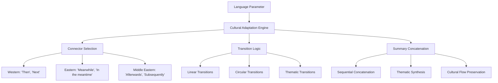

**Diagram sources**
- [sceneAssembler.ts:14-43](file://packages/engine/src/scene/sceneAssembler.ts#L14-L43)
- [sceneAssembler.ts:86-99](file://packages/engine/src/scene/sceneAssembler.ts#L86-L99)
- [generateChapter.ts:305](file://packages/engine/src/pipeline/generateChapter.ts#L305)

**Section sources**
- [sceneAssembler.ts:14-112](file://packages/engine/src/scene/sceneAssembler.ts#L14-L112)

### Enhanced SceneWriter: Language-Aware Scene Generation
The SceneWriter provides comprehensive language-aware scene generation with cultural adaptation:

- **Language Detection Integration**: Uses the story's language setting to adapt narrative style and cultural context throughout scene generation.
- **Cultural Narrative Style Adaptation**: Adapts writing style to match cultural storytelling traditions, from direct Western narrative to more indirect or metaphorical approaches.
- **Language-Specific Character Development**: Adjusts character dialogue and internal monologue to reflect cultural communication patterns and emotional expression norms.
- **Cultural Setting Integration**: Ensures scene locations and events are described with cultural authenticity and appropriate narrative emphasis.
- **Multilingual Fallback Support**: Provides fallback content generation for different languages while maintaining narrative coherence.

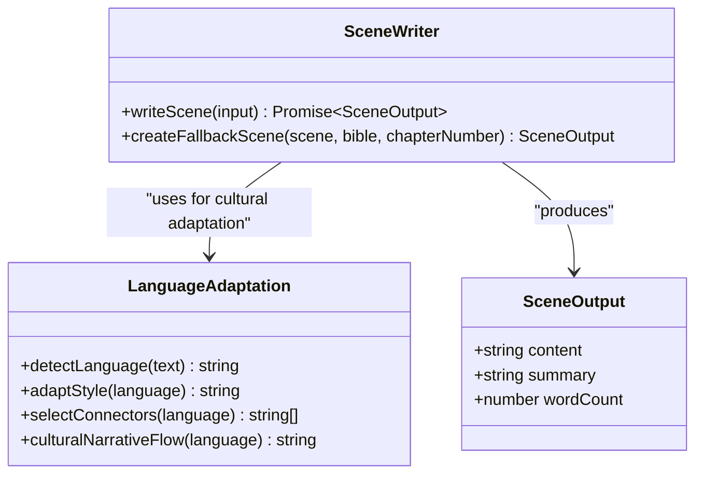

**Diagram sources**
- [sceneWriter.ts:20-144](file://packages/engine/src/agents/sceneWriter.ts#L20-L144)
- [sceneWriter.ts:146-198](file://packages/engine/src/agents/sceneWriter.ts#L146-L198)
- [bible.ts:8-50](file://packages/engine/src/story/bible.ts#L8-L50)

**Section sources**
- [sceneWriter.ts:20-198](file://packages/engine/src/agents/sceneWriter.ts#L20-L198)

### Enhanced generateChapter: Multilingual Chapter Generation Pipeline
The generateChapter function now orchestrates multilingual scene generation with cultural narrative flow adaptation:

- **Language Parameter Propagation**: The language parameter from StoryBible is passed through the entire generation pipeline to ensure consistent cultural adaptation.
- **Scene-Level Multilingual Coordination**: Scene generation respects the story's language setting while maintaining narrative coherence across scenes.
- **Cultural Narrative Flow Integration**: The pipeline coordinates scene assembly with cultural storytelling conventions and language-specific narrative patterns.
- **Enhanced Chapter Summary Generation**: The generateNaturalChapterSummary function now supports multilingual chapter summaries with cultural adaptation.
- **Language-Aware Memory Extraction**: Memory extraction respects cultural narrative patterns and language-specific storytelling conventions.

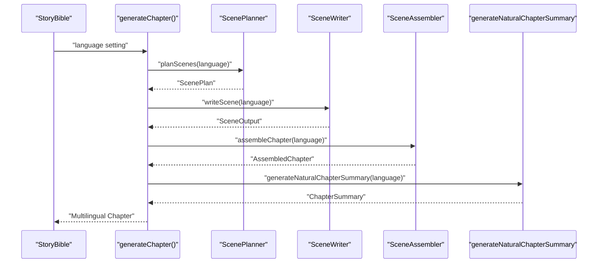

**Diagram sources**
- [generateChapter.ts:71-355](file://packages/engine/src/pipeline/generateChapter.ts#L71-L355)
- [generateChapter.ts:448-493](file://packages/engine/src/pipeline/generateChapter.ts#L448-L493)
- [sceneAssembler.ts:14-43](file://packages/engine/src/scene/sceneAssembler.ts#L14-L43)

**Section sources**
- [generateChapter.ts:71-355](file://packages/engine/src/pipeline/generateChapter.ts#L71-L355)

### Enhanced VectorStore: Flexible Embedding Provider Architecture
The VectorStore provides sophisticated vector memory management with enhanced embedding provider flexibility and improved fallback mechanisms:

- **Flexible Embedding Provider Support**: Supports multiple embedding providers (OpenAI, DeepSeek) through LLM client configuration with automatic provider switching and fallback strategies.
- **Enhanced Embedding Generation**: Integrates with LLM client's getEmbeddingConfig() for dynamic embedding model selection with configurable API keys, base URLs, and model names.
- **Improved Mock Embedding Fallback**: Robust fallback mechanism for environments without API access with deterministic vector generation and seed-based normalization.
- **Advanced Provider Switching**: Automatic provider switching when embedding API fails, with graceful degradation to mock embeddings while maintaining system functionality.
- **Enhanced Error Handling**: Comprehensive error handling for embedding API failures with logging and automatic fallback to mock embeddings.
- **Optimized Provider Configuration**: Supports both configured embedding models and environment variable fallback for maximum compatibility.

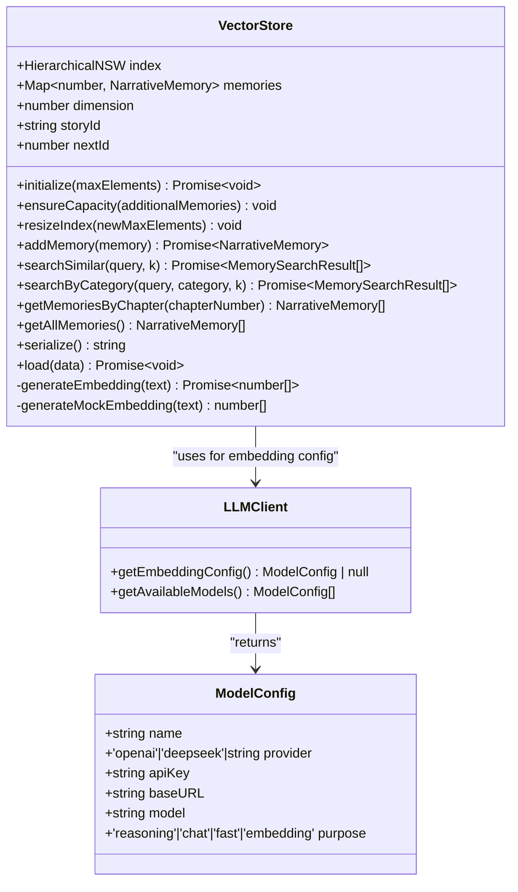

**Diagram sources**
- [vectorStore.ts:19-58](file://packages/engine/src/memory/vectorStore.ts#L19-L58)
- [vectorStore.ts:125-177](file://packages/engine/src/memory/vectorStore.ts#L125-L177)
- [client.ts:192-200](file://packages/engine/src/llm/client.ts#L192-L200)
- [index.ts:92-104](file://packages/engine/src/types/index.ts#L92-L104)

**Section sources**
- [vectorStore.ts:1-237](file://packages/engine/src/memory/vectorStore.ts#L1-L237)

### Enhanced LLM Client: Multi-Model Configuration System
The LLM Client provides comprehensive multi-model configuration management with embedding provider flexibility:

- **Multi-Model Architecture**: Supports multiple models with different purposes (reasoning, chat, fast, embedding) through JSON configuration with enhanced model routing.
- **Task-Specific Model Routing**: Automatic model selection based on task type with embedding-specific routing for vector memory operations.
- **Embedding Provider Configuration**: Dedicated embedding model configuration with separate API keys and provider settings for maximum flexibility.
- **Provider Flexibility**: Supports both OpenAI and DeepSeek providers with configurable base URLs and model names.
- **Backward Compatibility**: Maintains legacy single-model configuration while enabling enhanced multi-model setups.
- **Dynamic Model Loading**: Loads models dynamically from environment configuration with JSON parsing support.

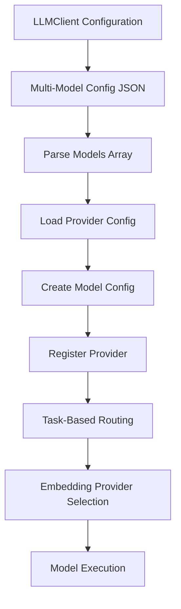

**Diagram sources**
- [client.ts:59-112](file://packages/engine/src/llm/client.ts#L59-L112)
- [client.ts:114-126](file://packages/engine/src/llm/client.ts#L114-L126)
- [client.ts:192-200](file://packages/engine/src/llm/client.ts#L192-L200)

**Section sources**
- [client.ts:1-211](file://packages/engine/src/llm/client.ts#L1-L211)

### Enhanced MemoryRetriever: Advanced Contextual Memory Retrieval System
The MemoryRetriever provides intelligent memory retrieval with enhanced contextual awareness and filtering capabilities:

- **Advanced Contextual Query Generation**: Creates meaningful search queries based on story context, current chapter progress, and active plot threads with improved query construction.
- **Sophisticated Multi-Category Retrieval**: Supports specialized retrieval for characters, plot threads, and specific memory categories with better filtering mechanisms.
- **Intelligent Re-ranking and Filtering**: Filters out memories from the current chapter and re-ranks results based on relevance with improved ranking algorithms.
- **Enhanced Prompt Formatting**: Converts retrieved memories into structured format suitable for LLM prompts with better organization and categorization.
- **Advanced Category Grouping**: Organizes memories by category (event, character, world, plot) for clear presentation with improved grouping logic.
- **Intelligent Relevance Reasoning**: Provides explanations for why memories are considered relevant with better reason inference.

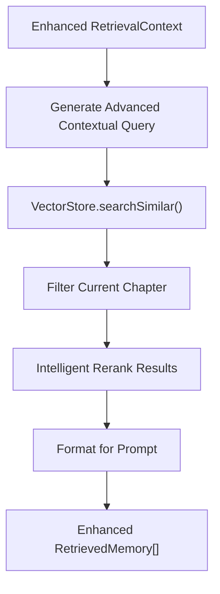

**Diagram sources**
- [memoryRetriever.ts:25-41](file://packages/engine/src/memory/memoryRetriever.ts#L25-L41)
- [memoryRetriever.ts:117-132](file://packages/engine/src/memory/memoryRetriever.ts#L117-L132)
- [memoryRetriever.ts:85-102](file://packages/engine/src/memory/memoryRetriever.ts#L85-L102)

**Section sources**
- [memoryRetriever.ts:1-174](file://packages/engine/src/memory/memoryRetriever.ts#L1-L174)

### Enhanced MemoryExtractor: Sophisticated Automated Narrative Memory Extraction
The MemoryExtractor agent automatically identifies and categorizes important narrative elements from chapters with improved capabilities:

- **Advanced Extraction Capabilities**: Identifies events, character developments, world details, and plot thread progress from chapter content with better extraction accuracy.
- **Enhanced Structured Output**: Returns memories in standardized format with content and category classification with improved consistency.
- **Dual Extraction Modes**: Can extract from full chapter content or from chapter summaries for efficiency with better content length management.
- **Improved Prompt Engineering**: Uses carefully crafted prompts to ensure consistent and relevant memory extraction with better instruction clarity.
- **Advanced Content Limiting**: Implements content length limits to control token usage and maintain performance with better content truncation strategies.

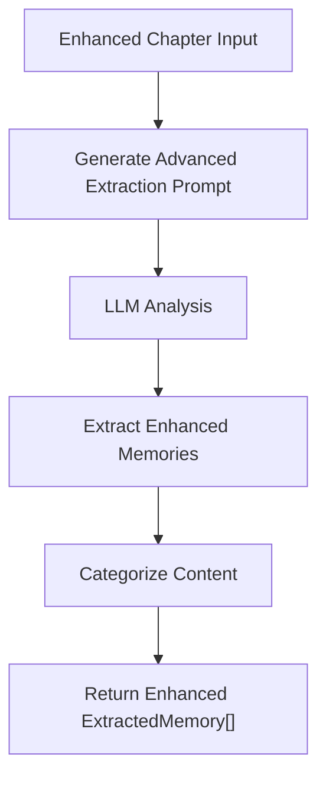

**Diagram sources**
- [memoryExtractor.ts:52-68](file://packages/engine/src/agents/memoryExtractor.ts#L52-L68)
- [memoryExtractor.ts:70-93](file://packages/engine/src/agents/memoryExtractor.ts#L70-L93)

**Section sources**
- [memoryExtractor.ts:1-99](file://packages/engine/src/agents/memoryExtractor.ts#L1-L99)

### Enhanced StateUpdaterPipeline: Comprehensive Post-Chapter State Management
The StateUpdaterPipeline represents a significant enhancement to the memory management system, now fully integrated with vector memory capabilities:

- **Advanced Extraction Phase**: Uses LLM to analyze chapter content and extract character changes, plot thread updates, new facts, and world changes with improved accuracy.
- **Enhanced State Application**: Updates structured state with character emotional states, locations, knowledge, relationships, and goals with better state management.
- **Integrated Constraint Graph Updates**: Automatically updates constraint graph with new knowledge nodes, character locations, and events with improved graph management.
- **Comprehensive Vector Memory Integration**: Extracts narrative memories from chapters using MemoryExtractor and adds them to vector store for semantic search with enhanced memory extraction.
- **Advanced Recent Events Tracking**: Maintains rolling window of recent events for context with better event management.
- **Enhanced Quick Update Mode**: Provides simplified update mechanism for testing and debugging with improved performance.

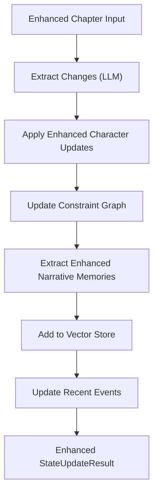

**Diagram sources**
- [stateUpdater.ts:94-248](file://packages/engine/src/memory/stateUpdater.ts#L94-L248)
- [stateUpdater.ts:211-229](file://packages/engine/src/memory/stateUpdater.ts#L211-L229)
- [stateUpdater.ts:341-389](file://packages/engine/src/memory/stateUpdater.ts#L341-L389)

**Section sources**
- [stateUpdater.ts:90-435](file://packages/engine/src/memory/stateUpdater.ts#L90-L435)

### Enhanced VectorStore: Advanced Persistent Memory Storage
The VectorStore provides sophisticated memory management with enhanced vector embeddings and similarity search:

- **Improved Memory Model**: Stores narrative memories with categories (event, character, world, plot) and timestamps with better data structure.
- **Advanced Embedding Generation**: Uses OpenAI text-embedding-3-small model for semantic similarity with support for DeepSeek API and automatic mock fallback.
- **Optimized Similarity Search**: Implements HNSW algorithm for efficient nearest neighbor search with improved performance and better result ranking.
- **Enhanced Serialization**: Full persistence support for memory stores across sessions with better index rebuilding and memory management.
- **Robust Mock Embeddings**: Includes fallback mechanism for environments without API access with improved vector generation and normalization.

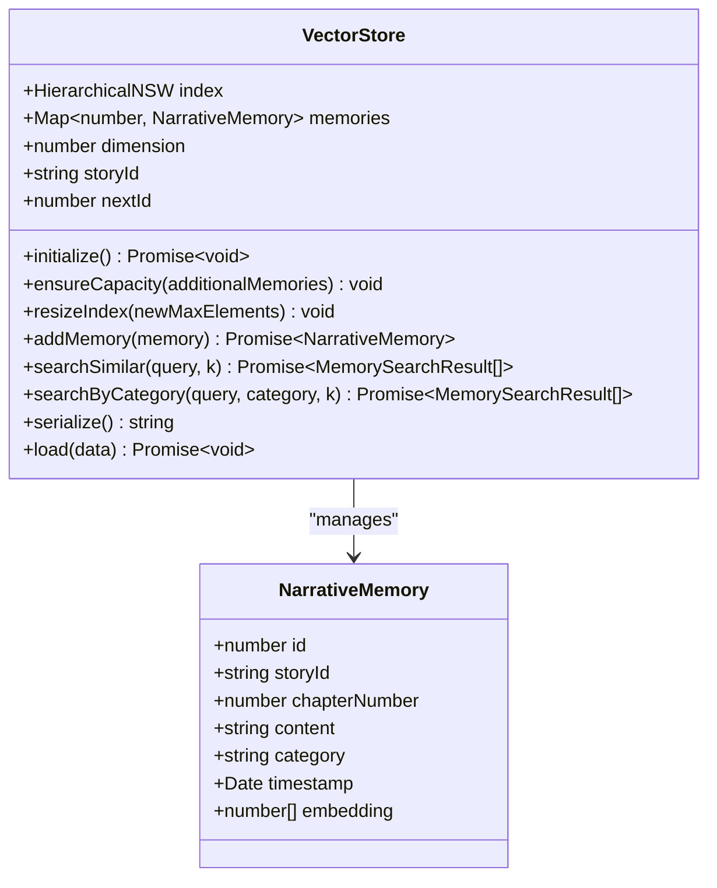

**Diagram sources**
- [vectorStore.ts:19-58](file://packages/engine/src/memory/vectorStore.ts#L19-L58)
- [vectorStore.ts:135-157](file://packages/engine/src/memory/vectorStore.ts#L135-L157)

**Section sources**
- [vectorStore.ts:1-237](file://packages/engine/src/memory/vectorStore.ts#L1-L237)

### Enhanced StructuredState: Rich Story State Representation
StructuredState provides comprehensive narrative state management with improved capabilities:

- **Advanced Character Model**: Tracks emotional state, location, relationships, goals, knowledge, and development arcs with better state management.
- **Enhanced Plot Thread Model**: Manages status, tension levels, involvement, and summaries for multiple story threads with improved thread management.
- **Advanced Question Management**: Maintains unresolved questions that drive narrative progression with better question tracking.
- **Enhanced Event Tracking**: Keeps rolling window of recent events for context with better event management.
- **Improved Tension Calculation**: Implements parabolic tension curve for dynamic narrative pacing with better tension management.

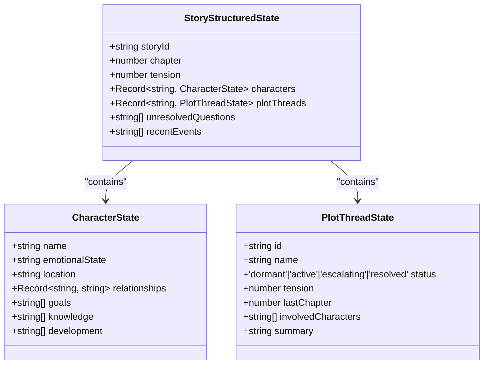

**Diagram sources**
- [structuredState.ts:23-31](file://packages/engine/src/story/structuredState.ts#L23-L31)
- [structuredState.ts:3-11](file://packages/engine/src/story/structuredState.ts#L3-L11)
- [structuredState.ts:13-21](file://packages/engine/src/story/structuredState.ts#L13-L21)

**Section sources**
- [structuredState.ts:1-235](file://packages/engine/src/story/structuredState.ts#L1-L235)

### Enhanced Constraint Graph: Advanced Narrative Logic Enforcement
The ConstraintGraph provides comprehensive narrative logic enforcement with improved capabilities:

- **Enhanced Node Types**: Supports characters, locations, facts, events, and items with rich metadata and improved node management.
- **Advanced Edge Relationships**: Manages relationships like located_at, knows, participates_in, and custom relations with better edge management.
- **Improved Constraint Checking**: Validates location consistency, knowledge consistency, timeline integrity, and logical coherence with better validation logic.
- **Enhanced Dynamic Updates**: Automatically updates graph when characters move, learn new knowledge, or participate in events with better graph updates.
- **Advanced Serialization**: Full persistence support for constraint graph evolution with better serialization and deserialization.

```mermaid
graph TB
subgraph "Enhanced Constraint Graph Nodes"
CHAR["Character Node<br/>properties: emotionalState, location, goals"]
LOC["Location Node<br/>properties: description"]
FACT["Fact Node<br/>properties: established in chapter"]
EVENT["Event Node<br/>properties: participants, chapter"]
end
subgraph "Enhanced Constraint Edges"
CHAR --> |"located_at"| LOC
CHAR --> |"knows"| FACT
CHAR --> |"participates_in"| EVENT
END
```

**Diagram sources**
- [constraintGraph.ts:5-19](file://packages/engine/src/constraints/constraintGraph.ts#L5-L19)
- [constraintGraph.ts:98-143](file://packages/engine/src/constraints/constraintGraph.ts#L98-L143)
- [constraintGraph.ts:163-192](file://packages/engine/src/constraints/constraintGraph.ts#L163-L192)

**Section sources**
- [constraintGraph.ts:29-471](file://packages/engine/src/constraints/constraintGraph.ts#L29-L471)

### Enhanced Memory Lifecycle: Extraction → Validation → Integration → State Updates → Vector Memory
The enhanced memory lifecycle now includes comprehensive vector memory integration with improved performance and flexible embedding providers:

- **Enhanced Extraction**: extractCanonFromBible reads characters and plot threads from the story bible and writes canonical facts into CanonStore with better extraction logic.
- **Advanced Vector Memory Extraction**: MemoryExtractor automatically extracts narrative memories from generated chapters and adds them to VectorStore with improved extraction accuracy.
- **Enhanced Validation**: CanonValidator compares generated chapter content against formatted canonical facts and reports contradictions with better validation logic.
- **Advanced Integration**: The pipeline passes CanonStore, VectorStore, and MemoryRetriever to the writer and optionally invokes validation; summaries trigger memory extraction with better integration.
- **Enhanced State Updates**: StateUpdaterPipeline processes chapters to extract narrative changes, update constraint graphs, maintain recent events, and integrate vector memory extraction with improved performance.
- **Enhanced Persistence**: Enhanced CLI functions persist chapters, state, vector stores, and constraint graph data with better persistence mechanisms.
- **Flexible Embedding Providers**: VectorStore supports multiple embedding providers with automatic configuration and fallback mechanisms for maximum compatibility.

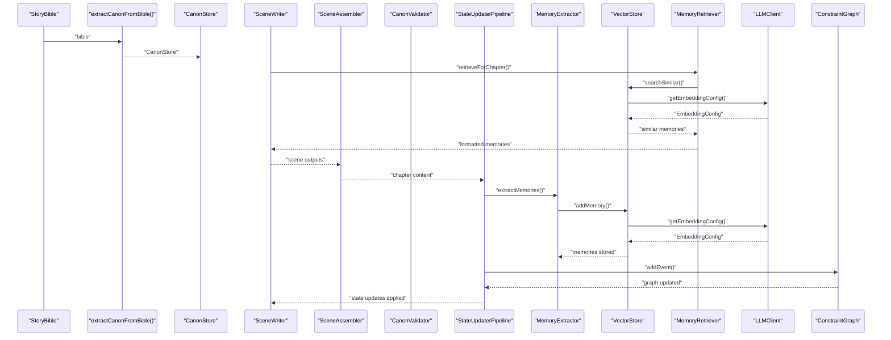

**Diagram sources**
- [canonStore.ts:24-58](file://packages/engine/src/memory/canonStore.ts#L24-L58)
- [writer.ts:55-94](file://packages/engine/src/agents/writer.ts#L55-L94)
- [canonValidator.ts:32-55](file://packages/engine/src/agents/canonValidator.ts#L32-L55)
- [stateUpdater.ts:94-248](file://packages/engine/src/memory/stateUpdater.ts#L94-L248)
- [memoryExtractor.ts:52-68](file://packages/engine/src/agents/memoryExtractor.ts#L52-L68)
- [vectorStore.ts:37-58](file://packages/engine/src/memory/vectorStore.ts#L37-L58)
- [memoryRetriever.ts:25-41](file://packages/engine/src/memory/memoryRetriever.ts#L25-L41)
- [constraintGraph.ts:163-192](file://packages/engine/src/constraints/constraintGraph.ts#L163-L192)
- [client.ts:192-200](file://packages/engine/src/llm/client.ts#L192-L200)
- [sceneAssembler.ts:14-43](file://packages/engine/src/scene/sceneAssembler.ts#L14-L43)

**Section sources**
- [canonStore.ts:24-58](file://packages/engine/src/memory/canonStore.ts#L24-L58)
- [canonValidator.ts:31-55](file://packages/engine/src/agents/canonValidator.ts#L31-L55)
- [generateChapter.ts:20-71](file://packages/engine/src/pipeline/generateChapter.ts#L20-L71)
- [stateUpdater.ts:94-248](file://packages/engine/src/memory/stateUpdater.ts#L94-L248)
- [memoryExtractor.ts:52-68](file://packages/engine/src/agents/memoryExtractor.ts#L52-L68)
- [client.ts:192-200](file://packages/engine/src/llm/client.ts#L192-L200)

### Enhanced Practical Examples: Chapter Generation with Enhanced Vector Memory Integration
Enhanced CLI-driven generation now includes comprehensive vector memory management with flexible embedding providers:

- **Enhanced CLI-driven generation**: The CLI command constructs a GenerationContext, loads or initializes VectorStore, calls generateChapter with CanonStore and VectorStore, and persists the new chapter, updated state, and vector store.
- **Advanced Memory extraction automation**: The pipeline automatically extracts memories from generated chapters using MemoryExtractor and adds them to the vector store with improved extraction accuracy.
- **Enhanced Test-driven example**: Demonstrates creating a story bible, adding a character, building a CanonStore, generating a chapter with validation and summarization, extracting memories, and processing state updates.
- **Flexible Embedding Provider Configuration**: CLI supports embedding provider selection with DeepSeek compatibility and mock embedding fallback for testing environments.
- **Multilingual Scene Generation**: The pipeline demonstrates language-aware scene generation with cultural narrative flow adaptation.

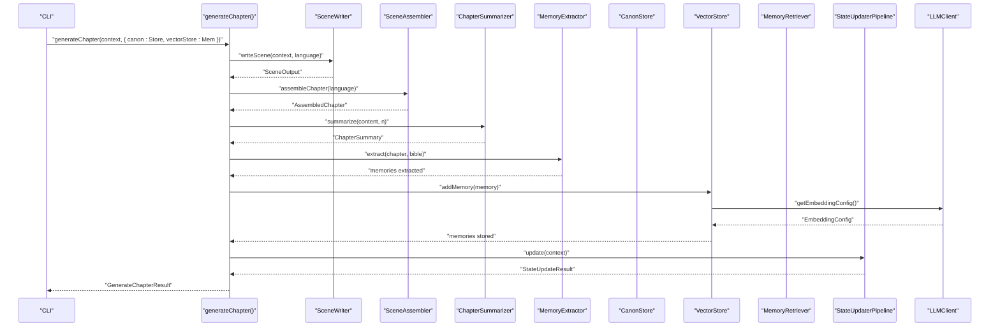

**Diagram sources**
- [generate.ts:21-34](file://apps/cli/src/commands/generate.ts#L21-L34)
- [generateChapter.ts:20-71](file://packages/engine/src/pipeline/generateChapter.ts#L20-L71)
- [writer.ts:55-94](file://packages/engine/src/agents/writer.ts#L55-L94)
- [summarizer.ts:24-38](file://packages/engine/src/agents/summarizer.ts#L24-L38)
- [memoryExtractor.ts:52-68](file://packages/engine/src/agents/memoryExtractor.ts#L52-L68)
- [stateUpdater.ts:94-248](file://packages/engine/src/memory/stateUpdater.ts#L94-L248)
- [vectorStore.ts:66-93](file://packages/engine/src/memory/vectorStore.ts#L66-L93)
- [client.ts:192-200](file://packages/engine/src/llm/client.ts#L192-L200)
- [sceneAssembler.ts:14-43](file://packages/engine/src/scene/sceneAssembler.ts#L14-L43)

**Section sources**
- [generate.ts:1-81](file://apps/cli/src/commands/generate.ts#L1-L81)
- [simple.test.ts:24-73](file://packages/engine/src/test/simple.test.ts#L24-L73)

### Enhanced Canonical Fact Prioritization and Growth Strategies
Enhanced prioritization and growth strategies leverage comprehensive state management and vector memory integration:

- **Advanced Prioritization**: The writer's prompt template places Story Canon prominently, ensuring the LLM considers canonical facts during generation with better priority management.
- **Enhanced Vector Memory Integration**: VectorStore enables semantic search for relevant past events, character developments, and plot threads, enriching the context provided to the writer with improved memory access.
- **Advanced Growth**: As chapters are generated and summarized, StoryState accumulates summaries that inform future generations, while VectorStore grows with extracted memories for improved semantic search with better memory management.
- **Dynamic updates**: updateFact allows evolving canonical facts over time; use chapterEstablished to track provenance and manage conflicts with better fact management.
- **Enhanced Constraint integration**: New facts from state updates are automatically integrated into the constraint graph for logical consistency with improved graph updates.
- **Advanced Memory categorization**: Vector memories are categorized (event, character, world, plot) enabling targeted retrieval and context-aware writing with better categorization.
- **Flexible Embedding Provider Support**: Enhanced vector memory system supports multiple embedding providers with automatic configuration and fallback mechanisms for maximum compatibility.
- **Multilingual Canonical Integration**: Canonical facts are integrated with language-aware processing to respect cultural narrative conventions and storytelling patterns.

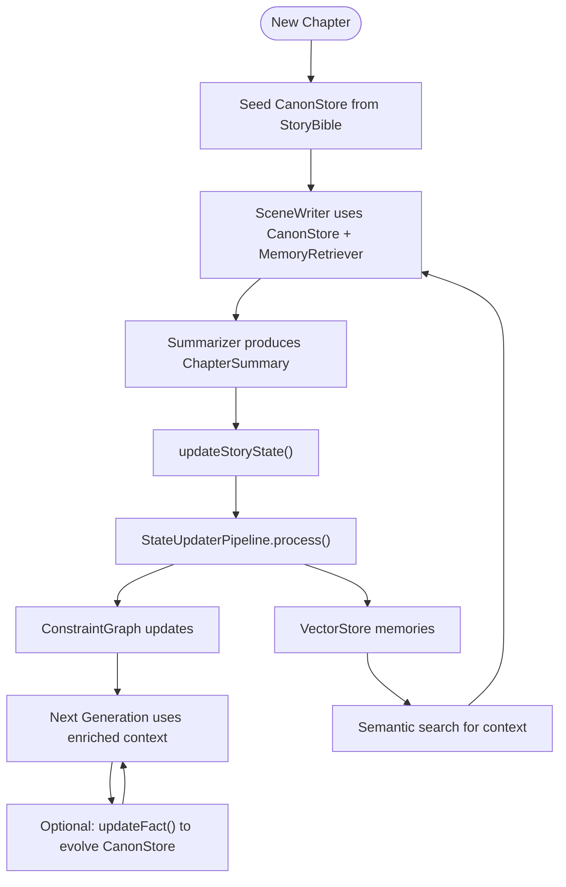

**Diagram sources**
- [bible.ts:3-26](file://packages/engine/src/story/bible.ts#L3-L26)
- [writer.ts:55-94](file://packages/engine/src/agents/writer.ts#L55-L94)
- [summarizer.ts:24-38](file://packages/engine/src/agents/summarizer.ts#L24-L38)
- [state.ts:14-29](file://packages/engine/src/story/state.ts#L14-L29)
- [canonStore.ts:79-99](file://packages/engine/src/memory/canonStore.ts#L79-L99)
- [stateUpdater.ts:94-248](file://packages/engine/src/memory/stateUpdater.ts#L94-L248)
- [constraintGraph.ts:163-192](file://packages/engine/src/constraints/constraintGraph.ts#L163-L192)
- [vectorStore.ts:37-58](file://packages/engine/src/memory/vectorStore.ts#L37-L58)
- [memoryRetriever.ts:25-41](file://packages/engine/src/memory/memoryRetriever.ts#L25-L41)

**Section sources**
- [writer.ts:55-94](file://packages/engine/src/agents/writer.ts#L55-L94)
- [state.ts:14-29](file://packages/engine/src/story/state.ts#L14-L29)
- [canonStore.ts:79-99](file://packages/engine/src/memory/canonStore.ts#L79-L99)
- [stateUpdater.ts:94-248](file://packages/engine/src/memory/stateUpdater.ts#L94-L248)

## Dependency Analysis
Enhanced dependency relationships now include comprehensive vector memory integration, flexible embedding provider architecture, and multilingual scene assembly:

- CanonStore depends on StoryBible for initial extraction and on the pipeline for integration.
- VectorStore depends on LLM client for embedding configuration and supports serialization for persistence with enhanced provider flexibility.
- MemoryRetriever depends on VectorStore for semantic search and on LLM client for contextual query generation.
- MemoryExtractor depends on LLM client for memory extraction and on StoryBible for context.
- StateUpdaterPipeline depends on all core components: Chapter, StoryBible, StoryStructuredState, CanonStore, VectorStore, MemoryExtractor, and ConstraintGraph.
- ConstraintGraph integrates with StateUpdaterPipeline for automatic updates and with StateUpdater for manual state changes.
- Agents depend on LLMClient for completions; CanonValidator, StateUpdater, and MemoryExtractor additionally depend on their respective data structures.
- SceneWriter depends on StoryBible language setting for cultural adaptation.
- SceneAssembler depends on language parameter for multilingual connector selection.
- Enhanced Pipeline composes agents and manages optional validation, memory extraction, and state updates with improved orchestration.
- CLI depends on the engine exports to orchestrate generation, persistence, vector store management, and enhanced state management with embedding provider configuration.
- LLMClient manages multi-model configuration with embedding provider flexibility and task-specific model routing.

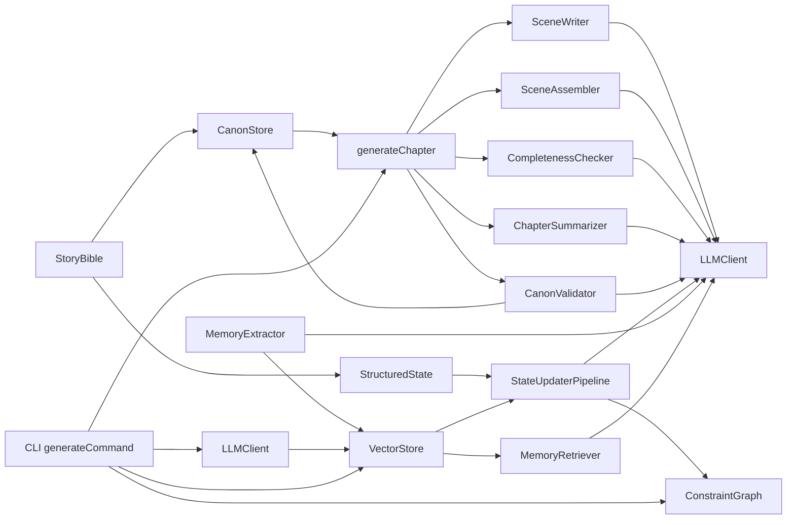

**Diagram sources**
- [bible.ts:3-26](file://packages/engine/src/story/bible.ts#L3-L26)
- [canonStore.ts:24-58](file://packages/engine/src/memory/canonStore.ts#L24-L58)
- [structuredState.ts:33-85](file://packages/engine/src/story/structuredState.ts#L33-L85)
- [stateUpdater.ts:90-248](file://packages/engine/src/memory/stateUpdater.ts#L90-L248)
- [vectorStore.ts:1-237](file://packages/engine/src/memory/vectorStore.ts#L1-L237)
- [memoryRetriever.ts:1-174](file://packages/engine/src/memory/memoryRetriever.ts#L1-L174)
- [memoryExtractor.ts:1-99](file://packages/engine/src/agents/memoryExtractor.ts#L1-L99)
- [constraintGraph.ts:29-471](file://packages/engine/src/constraints/constraintGraph.ts#L29-L471)
- [generateChapter.ts:20-71](file://packages/engine/src/pipeline/generateChapter.ts#L20-L71)
- [writer.ts:55-94](file://packages/engine/src/agents/writer.ts#L55-L94)
- [completeness.ts:37-52](file://packages/engine/src/agents/completeness.ts#L37-L52)
- [summarizer.ts:24-38](file://packages/engine/src/agents/summarizer.ts#L24-L38)
- [canonValidator.ts:32-55](file://packages/engine/src/agents/canonValidator.ts#L32-L55)
- [client.ts:50-210](file://packages/engine/src/llm/client.ts#L50-L210)
- [generate.ts:4-54](file://apps/cli/src/commands/generate.ts#L4-L54)
- [sceneAssembler.ts:14-43](file://packages/engine/src/scene/sceneAssembler.ts#L14-L43)
- [sceneWriter.ts:20-144](file://packages/engine/src/agents/sceneWriter.ts#L20-L144)

**Section sources**
- [index.ts:1-116](file://packages/engine/src/index.ts#L1-L116)
- [client.ts:1-211](file://packages/engine/src/llm/client.ts#L1-L211)

## Performance Considerations
Enhanced performance considerations for the expanded vector memory system with flexible embedding providers and multilingual scene assembly:

- **Advanced HNSW Index Performance**: HNSW algorithm provides O(log N) search complexity with configurable efConstruction and efSearch parameters for balancing recall and speed with improved performance tuning.
- **Enhanced Embedding Generation Costs**: OpenAI embeddings have token limits and costs; consider batching and caching strategies for repeated embeddings with better cost optimization.
- **Flexible Provider Performance**: Multiple embedding providers offer different performance characteristics; choose providers based on cost, speed, and quality requirements with improved provider selection strategies.
- **Intelligent Index Resizing Strategy**: VectorStore auto-resizes indexes by 50% when capacity is reached; monitor memory usage and adjust initial capacity estimates with better capacity planning.
- **Robust Mock Embedding Fallback**: Mock embeddings provide deterministic but non-semantic vectors for testing; ensure proper environment configuration for production with better fallback mechanisms.
- **Enhanced Memory Persistence**: VectorStore serialization/deserialization can be expensive for large memory stores; implement incremental persistence strategies with better persistence optimization.
- **Advanced Token Limits**: LLM calls for memory extraction and state updates specify maxTokens per operation; tune for quality vs. cost, especially for complex state updates with better token management.
- **Improved Prompt Sizes**: formatCanonForPrompt, validator prompt, and StateUpdaterPipeline extraction prompts size impact latency; consider truncation or chunking for very large canons and complex state updates with better prompt optimization.
- **Enhanced Constraint graph complexity**: Large constraint graphs impact validation performance; consider periodic graph cleanup and optimization with better graph management.
- **Advanced Iterative continuation**: CompletenessChecker retries improve quality but increase cost; cap maxContinuationAttempts with better retry management.
- **Immutable updates**: CanonStore, VectorStore, and StateUpdaterPipeline operations return new objects; ensure minimal copying and avoid unnecessary re-renders in UI contexts with better memory management.
- **Provider Switching Overhead**: Embedding provider switching introduces overhead; cache embedding configurations and minimize provider switching frequency with better provider caching strategies.
- **Embedding API Reliability**: Different providers have varying reliability; implement circuit breaker patterns and graceful degradation with better error handling for provider failures.
- **Multilingual Processing Overhead**: Language detection and cultural adaptation add computational overhead; optimize language parameter propagation and caching for frequently used languages.
- **Scene Assembly Complexity**: Multilingual scene assembly with cultural connectors increases processing time; implement efficient connector selection algorithms and caching for common cultural patterns.

## Troubleshooting Guide
Enhanced troubleshooting guidance for the expanded vector memory system with flexible embedding providers and multilingual scene assembly:

- **VectorStore Initialization Failures**: Ensure HNSW library is properly installed with native bindings; check node version compatibility with better installation verification.
- **Enhanced Memory Extraction Failures**: If MemoryExtractor returns empty results, check LLM availability and API keys; verify chapter content length limits with better error handling.
- **Vector Search Performance Issues**: Monitor HNSW index size and search parameters; consider rebuilding index with different efConstruction values with better performance monitoring.
- **Enhanced Embedding Generation Errors**: Verify embedding provider configuration and API keys; check rate limits and network connectivity; ensure USE_MOCK_EMBEDDINGS is set appropriately with better API configuration.
- **Flexible Provider Configuration Issues**: If embedding provider switching fails, check LLM client configuration and model routing; verify embedding model configuration with better provider configuration validation.
- **Memory Persistence Issues**: Verify VectorStore serialization format and ensure proper embedding generation; check file permissions for vector-store.json with better persistence validation.
- **Enhanced Validation failures**: If CanonValidator returns violations, review canonical facts and regenerate content. Consider adjusting chapter goals or writer constraints with better validation feedback.
- **Enhanced State update failures**: If StateUpdaterPipeline fails, check LLM responses for malformed JSON and validate chapter content format with better error handling.
- **Constraint violations**: Use ConstraintGraph.checkConstraints() to identify location, knowledge, timeline, and logic violations; address root causes in state updates with better violation reporting.
- **Incomplete chapters**: CompletenessChecker may mark content as incomplete; use writer.continue to extend until completion with better completion handling.
- **JSON parsing errors**: StateUpdaterPipeline and validators fall back to valid structures when parsing fails; verify prompt formatting and LLM behavior with better error recovery.
- **Enhanced CLI progress**: Ensure state updates, memory persistence, and constraint graph updates occur after each generation; confirm currentChapter increments and totalChapters thresholds with better progress tracking.
- **Provider Switching Failures**: If embedding provider switching fails, check LLM client configuration and model availability; verify API credentials and network connectivity with better provider switching diagnostics.
- **Mock Embedding Issues**: If mock embeddings cause semantic issues, verify USE_MOCK_EMBEDDINGS environment variable and ensure deterministic behavior with better mock embedding validation.
- **Multilingual Scene Assembly Issues**: If scene assembly fails to respect cultural narrative flow, verify language parameter propagation and connector selection logic with better cultural adaptation validation.
- **Language Detection Problems**: If language detection fails, check StoryBible language field and ensure proper language code formatting with better language detection fallback mechanisms.

**Section sources**
- [vectorStore.ts:125-177](file://packages/engine/src/memory/vectorStore.ts#L125-L177)
- [memoryExtractor.ts:62-65](file://packages/engine/src/agents/memoryExtractor.ts#L62-L65)
- [memoryRetriever.ts:117-132](file://packages/engine/src/memory/memoryRetriever.ts#L117-L132)
- [canonValidator.ts:49-55](file://packages/engine/src/agents/canonValidator.ts#L49-L55)
- [completeness.ts:37-52](file://packages/engine/src/agents/completeness.ts#L37-L52)
- [generateChapter.ts:32-43](file://packages/engine/src/pipeline/generateChapter.ts#L32-L43)
- [generate.ts:28-53](file://apps/cli/src/commands/generate.ts#L28-L53)
- [stateUpdater.ts:297-308](file://packages/engine/src/memory/stateUpdater.ts#L297-L308)
- [constraintGraph.ts:229-245](file://packages/engine/src/constraints/constraintGraph.ts#L229-L245)
- [client.ts:192-200](file://packages/engine/src/llm/client.ts#L192-L200)
- [sceneAssembler.ts:86-99](file://packages/engine/src/scene/sceneAssembler.ts#L86-L99)
- [sceneWriter.ts:146-198](file://packages/engine/src/agents/sceneWriter.ts#L146-L198)

## Conclusion
The enhanced Memory Management System centers on a robust CanonStore that seeds canonical facts from the story bible, an advanced VectorStore with flexible embedding provider architecture for semantic memory search, comprehensive MemoryRetriever for contextual memory access, and the powerful StateUpdaterPipeline that provides complete post-chapter state management with vector memory integration. The system now includes automatic constraint graph updates, recent events tracking, enhanced CLI persistence for vector stores, automated memory extraction capabilities with improved performance and reliability, and comprehensive embedding provider flexibility supporting multiple providers (OpenAI, DeepSeek) with automatic configuration and fallback mechanisms. 

**Updated** The system now features comprehensive multilingual support with language-aware scene assembly, cultural narrative flow adaptation, and language-specific connector selection for different storytelling traditions. SceneWriter and SceneAssembler work together to respect cultural storytelling conventions while maintaining narrative coherence across diverse linguistic contexts. This enhancement enables the system to generate culturally authentic narratives in multiple languages while preserving the core memory management and state management capabilities that ensure narrative coherence across iterations.

## Appendices

### Enhanced Prompt References
- Writer prompt structure and guidelines for chapter composition with enhanced canonical fact integration and memory context injection.
- Completeness prompt for detecting natural stopping points.
- Summarizer prompt for concise chapter summaries.
- StateUpdaterPipeline extraction prompt for comprehensive narrative change detection.
- MemoryExtractor prompt for automated narrative memory identification and categorization.
- Constraint graph validation prompt for logical consistency enforcement.
- SceneWriter prompt for language-aware scene generation with cultural adaptation.
- SceneAssembler prompt for multilingual scene assembly with cultural narrative flow adaptation.

**Section sources**
- [writer.md:1-38](file://packages/engine/src/llm/prompts/writer.md#L1-L38)
- [completeness.md:1-26](file://packages/engine/src/llm/prompts/completeness.md#L1-L26)
- [summarizer.md:1-13](file://packages/engine/src/llm/prompts/summarizer.md#L1-L13)
- [stateUpdater.ts:31-88](file://packages/engine/src/memory/stateUpdater.ts#L31-L88)
- [memoryExtractor.ts:14-50](file://packages/engine/src/agents/memoryExtractor.ts#L14-L50)
- [constraintGraph.ts:229-245](file://packages/engine/src/constraints/constraintGraph.ts#L229-L245)
- [sceneWriter.ts:42-95](file://packages/engine/src/agents/sceneWriter.ts#L42-L95)
- [sceneAssembler.ts:86-99](file://packages/engine/src/scene/sceneAssembler.ts#L86-L99)