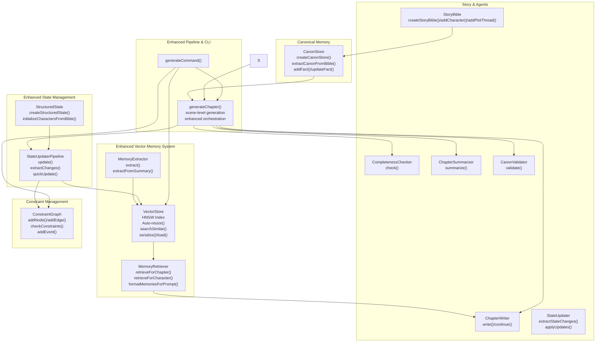
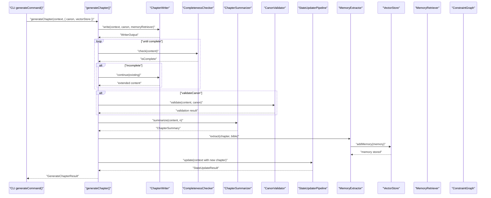
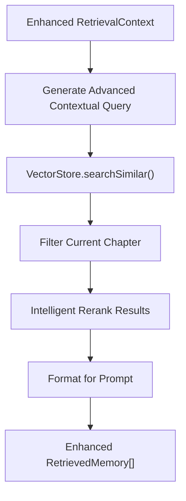
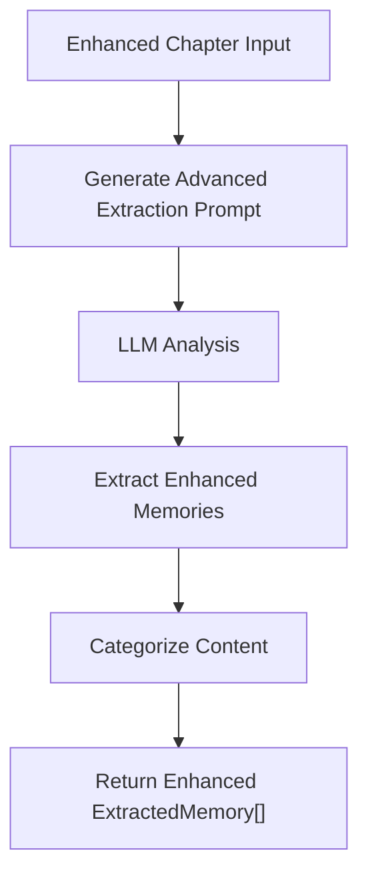
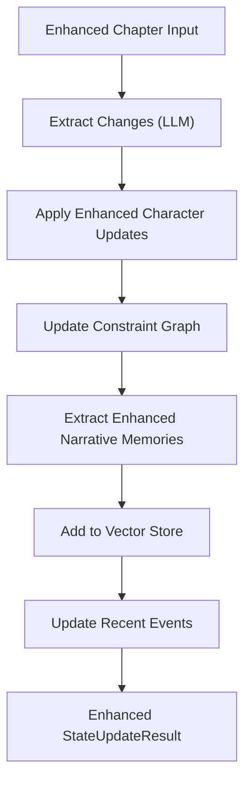
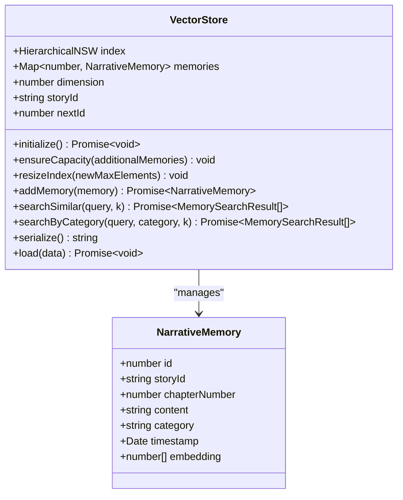
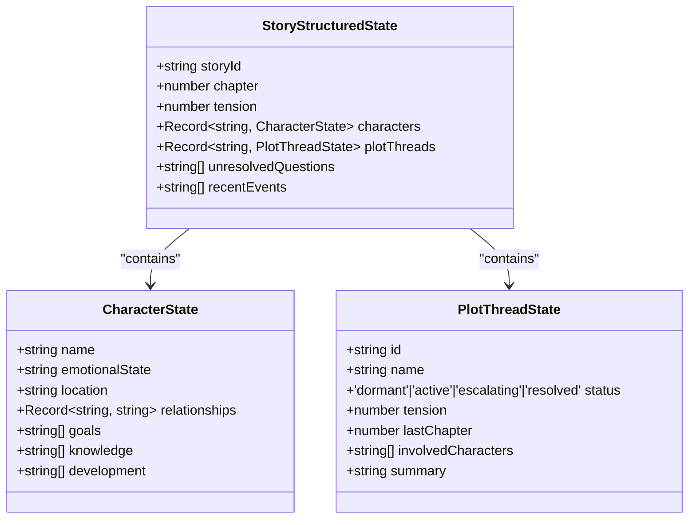
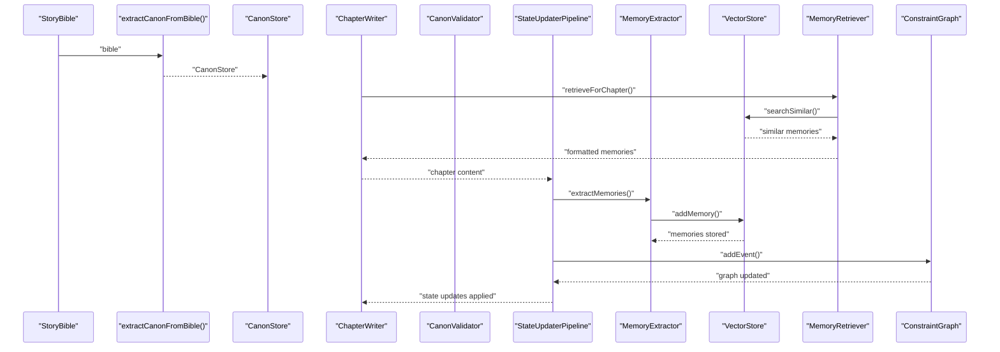
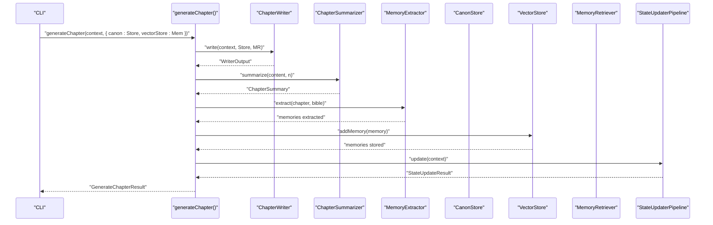
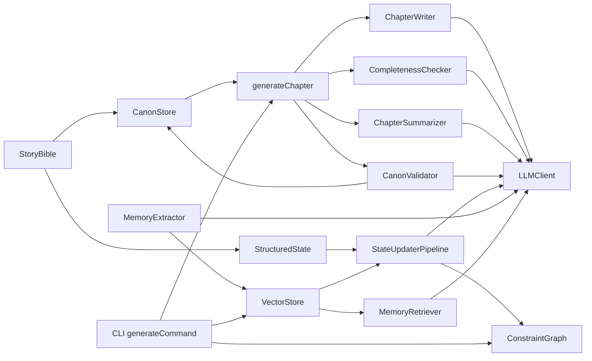

# Memory Management System

<cite>
**Referenced Files in This Document**
- [canonStore.ts](file://packages/engine/src/memory/canonStore.ts)
- [canonValidator.ts](file://packages/engine/src/agents/canonValidator.ts)
- [bible.ts](file://packages/engine/src/story/bible.ts)
- [generateChapter.ts](file://packages/engine/src/pipeline/generateChapter.ts)
- [writer.ts](file://packages/engine/src/agents/writer.ts)
- [completeness.ts](file://packages/engine/src/agents/completeness.ts)
- [summarizer.ts](file://packages/engine/src/agents/summarizer.ts)
- [state.ts](file://packages/engine/src/story/state.ts)
- [client.ts](file://packages/engine/src/llm/client.ts)
- [index.ts](file://packages/engine/src/index.ts)
- [generate.ts](file://apps/cli/src/commands/generate.ts)
- [simple.test.ts](file://packages/engine/src/test/simple.test.ts)
- [writer.md](file://packages/engine/src/llm/prompts/writer.md)
- [completeness.md](file://packages/engine/src/llm/prompts/completeness.md)
- [summarizer.md](file://packages/engine/src/llm/prompts/summarizer.md)
- [stateUpdater.ts](file://packages/engine/src/memory/stateUpdater.ts)
- [stateUpdater.ts](file://packages/engine/src/agents/stateUpdater.ts)
- [constraintGraph.ts](file://packages/engine/src/constraints/constraintGraph.ts)
- [vectorStore.ts](file://packages/engine/src/memory/vectorStore.ts)
- [structuredState.ts](file://packages/engine/src/story/structuredState.ts)
- [memoryRetriever.ts](file://packages/engine/src/memory/memoryRetriever.ts)
- [memoryExtractor.ts](file://packages/engine/src/agents/memoryExtractor.ts)
- [vector-memory.test.ts](file://packages/engine/src/test/vector-memory.test.ts)
- [store.ts](file://apps/cli/src/config/store.ts)
</cite>

## Update Summary
**Changes Made**
- Enhanced VectorStore implementation with improved HNSW algorithms, auto-resizing capabilities, and better embedding generation
- Integrated MemoryRetriever with advanced contextual query generation and category-based filtering
- Added MemoryExtractor agent with dual extraction modes (full chapter and summary-based)
- Enhanced StateUpdaterPipeline with comprehensive vector memory integration and constraint graph updates
- Improved generation pipeline with scene-level generation and enhanced memory extraction
- Added CLI persistence support with vector store serialization and deserialization
- Expanded memory lifecycle to include vector memory extraction, storage, and retrieval with improved performance

## Table of Contents
1. [Introduction](#introduction)
2. [Project Structure](#project-structure)
3. [Core Components](#core-components)
4. [Architecture Overview](#architecture-overview)
5. [Detailed Component Analysis](#detailed-component-analysis)
6. [Dependency Analysis](#dependency-analysis)
7. [Performance Considerations](#performance-considerations)
8. [Troubleshooting Guide](#troubleshooting-guide)
9. [Conclusion](#conclusion)
10. [Appendices](#appendices)

## Introduction
This document describes the Memory Management System with a focus on Canonical Fact Storage, Enhanced Vector Memory System with HNSW Algorithms, Memory Validation, and Comprehensive State Management. The system now includes a sophisticated vector memory system that enables semantic search capabilities for AI-powered narrative features, allowing the AI to retrieve relevant past events, character developments, world details, and plot information based on meaning rather than exact keywords. The enhanced vector memory system integrates seamlessly with the canonical fact storage, memory validation, and state management components to provide a comprehensive memory infrastructure for narrative coherence and intelligent story generation.

## Project Structure
The memory system now encompasses a comprehensive vector memory infrastructure with enhanced state management capabilities:
- Memory: Canonical fact representation, vector-based memory storage, memory extraction, and retrieval
- Story: Structured story state with characters, plot threads, and unresolved questions
- Agents: Writers, completeness checker, summarizer, canonical validator, state updater, and memory extractor
- Pipeline: Orchestration of chapter generation with optional canonical validation, vector memory extraction, and state updates
- CLI: Command-line integration for iterative chapter generation with enhanced persistence including vector stores



**Diagram sources**
- [vectorStore.ts:19-58](file://packages/engine/src/memory/vectorStore.ts#L19-L58)
- [memoryRetriever.ts:18-41](file://packages/engine/src/memory/memoryRetriever.ts#L18-L41)
- [memoryExtractor.ts:52-68](file://packages/engine/src/agents/memoryExtractor.ts#L52-L68)
- [canonStore.ts:17-58](file://packages/engine/src/memory/canonStore.ts#L17-L58)
- [stateUpdater.ts:90-248](file://packages/engine/src/memory/stateUpdater.ts#L90-L248)
- [bible.ts:3-26](file://packages/engine/src/story/bible.ts#L3-L26)
- [structuredState.ts:23-43](file://packages/engine/src/story/structuredState.ts#L23-L43)
- [writer.ts:55-94](file://packages/engine/src/agents/writer.ts#L55-L94)
- [completeness.ts:37-52](file://packages/engine/src/agents/completeness.ts#L37-L52)
- [summarizer.ts:24-38](file://packages/engine/src/agents/summarizer.ts#L24-L38)
- [canonValidator.ts:32-55](file://packages/engine/src/agents/canonValidator.ts#L32-L55)
- [stateUpdater.ts:85-193](file://packages/engine/src/agents/stateUpdater.ts#L85-L193)
- [constraintGraph.ts:29-245](file://packages/engine/src/constraints/constraintGraph.ts#L29-L245)
- [generateChapter.ts:20-71](file://packages/engine/src/pipeline/generateChapter.ts#L20-L71)
- [generate.ts:4-54](file://apps/cli/src/commands/generate.ts#L4-L54)

**Section sources**
- [index.ts:1-23](file://packages/engine/src/index.ts#L1-L23)

## Core Components
- **VectorStore**: Enhanced HNSW (Hierarchical Navigable Small World) algorithm-based vector memory storage with semantic similarity search, embedding generation, auto-resizing capabilities, and full persistence support.
- **MemoryRetriever**: Advanced contextual memory retrieval system that searches vector stores for relevant past events, character memories, plot threads, and world details with intelligent query generation.
- **MemoryExtractor**: Sophisticated automated narrative memory extraction agent that identifies and categorizes important facts from chapters into four categories: events, characters, world, and plot.
- **CanonStore**: Immutable store of canonical facts with helpers to extract, add, update, filter, and format facts for prompts.
- **StateUpdaterPipeline**: Comprehensive post-chapter state management pipeline that extracts narrative changes, updates constraint graphs, maintains recent events, and integrates vector memory extraction with enhanced performance.
- **StructuredState**: Rich story state representation with characters, plot threads, unresolved questions, and recent events tracking.
- **StoryBible**: Central story definition containing characters and plot threads used to seed canonical facts and initialize structured state.
- **Agents**:
  - ChapterWriter: Generates chapter content with optional memory injection for contextual awareness.
  - CompletenessChecker: Ensures chapters end at natural stopping points.
  - ChapterSummarizer: Produces concise chapter summaries for memory extraction.
  - CanonValidator: Validates generated chapters against canonical facts using LLM reasoning.
  - StateUpdater: Extracts and applies state changes for unresolved questions and recent events.
- **Enhanced Pipeline**: Orchestrates generation, optional canonical validation, vector memory extraction, and comprehensive state updates with scene-level generation capabilities.
- **CLI**: Iteratively generates chapters, updates state, persists progress, and manages vector store persistence with enhanced memory and constraint graph persistence.

**Section sources**
- [vectorStore.ts:4-17](file://packages/engine/src/memory/vectorStore.ts#L4-L17)
- [memoryRetriever.ts:5-16](file://packages/engine/src/memory/memoryRetriever.ts#L5-L16)
- [memoryExtractor.ts:5-12](file://packages/engine/src/agents/memoryExtractor.ts#L5-L12)
- [canonStore.ts:3-22](file://packages/engine/src/memory/canonStore.ts#L3-L22)
- [stateUpdater.ts:90-192](file://packages/engine/src/memory/stateUpdater.ts#L90-L192)
- [structuredState.ts:23-31](file://packages/engine/src/story/structuredState.ts#L23-L31)
- [bible.ts:3-26](file://packages/engine/src/story/bible.ts#L3-L26)
- [writer.ts:48-94](file://packages/engine/src/agents/writer.ts#L48-L94)
- [completeness.ts:30-52](file://packages/engine/src/agents/completeness.ts#L30-L52)
- [summarizer.ts:17-38](file://packages/engine/src/agents/summarizer.ts#L17-L38)
- [canonValidator.ts:31-55](file://packages/engine/src/agents/canonValidator.ts#L31-L55)
- [stateUpdater.ts:85-193](file://packages/engine/src/agents/stateUpdater.ts#L85-L193)
- [generateChapter.ts:14-71](file://packages/engine/src/pipeline/generateChapter.ts#L14-L71)
- [generate.ts:4-54](file://apps/cli/src/commands/generate.ts#L4-L54)

## Architecture Overview
The enhanced memory system integrates comprehensive vector memory capabilities with the generation pipeline as follows:
- StoryBible seeds both CanonStore and StructuredState via extraction and initialization.
- VectorStore and MemoryRetriever are integrated into the writer to provide contextual memory injection.
- MemoryExtractor automatically extracts narrative memories from generated chapters and adds them to the vector store.
- After writing, the pipeline checks completeness and optionally validates against canonical facts.
- StateUpdaterPipeline processes the chapter to extract narrative changes, update constraint graphs, maintain recent events, and integrate vector memory extraction.
- Summaries trigger memory extraction for vector store persistence.
- CLI orchestrates iteration, persistence of chapters, state, vector stores, and constraint graphs.



**Diagram sources**
- [generate.ts:21-34](file://apps/cli/src/commands/generate.ts#L21-L34)
- [generateChapter.ts:20-71](file://packages/engine/src/pipeline/generateChapter.ts#L20-L71)
- [writer.ts:55-94](file://packages/engine/src/agents/writer.ts#L55-L94)
- [completeness.ts:37-52](file://packages/engine/src/agents/completeness.ts#L37-L52)
- [summarizer.ts:24-38](file://packages/engine/src/agents/summarizer.ts#L24-L38)
- [canonValidator.ts:32-55](file://packages/engine/src/agents/canonValidator.ts#L32-L55)
- [stateUpdater.ts:94-248](file://packages/engine/src/memory/stateUpdater.ts#L94-L248)
- [memoryExtractor.ts:52-68](file://packages/engine/src/agents/memoryExtractor.ts#L52-L68)
- [vectorStore.ts:66-93](file://packages/engine/src/memory/vectorStore.ts#L66-L93)
- [memoryRetriever.ts:25-41](file://packages/engine/src/memory/memoryRetriever.ts#L25-L41)

## Detailed Component Analysis

### Enhanced VectorStore: HNSW Algorithm-Based Vector Memory System
The VectorStore provides sophisticated vector memory management with enhanced HNSW (Hierarchical Navigable Small World) algorithms for efficient semantic search:

- **Enhanced HNSW Index Implementation**: Uses hnswlib-node with native bindings for high-performance nearest neighbor search with cosine distance metric and auto-resizing capabilities.
- **Improved Memory Model**: Stores narrative memories with categories (event, character, world, plot), chapter numbers, timestamps, and vector embeddings with better dimension handling.
- **Advanced Embedding Generation**: Integrates with OpenAI text-embedding-3-small model for semantic vector generation with automatic mock fallback for testing environments and support for DeepSeek API.
- **Optimized Similarity Search**: Implements efficient KNN search with configurable result counts, category filtering, and improved performance through better indexing strategies.
- **Intelligent Auto-Resizing**: Dynamically resizes index capacity as memory count approaches limits with 50% capacity increases to maintain optimal performance.
- **Enhanced Serialization**: Full persistence support for vector stores across sessions with index rebuilding on load and improved memory management.
- **Robust Mock Embeddings**: Includes deterministic fallback mechanism for environments without API access with better vector normalization and seed-based generation.


**Diagram sources**
- [vectorStore.ts:19-58](file://packages/engine/src/memory/vectorStore.ts#L19-L58)
- [vectorStore.ts:135-157](file://packages/engine/src/memory/vectorStore.ts#L135-L157)

**Section sources**
- [vectorStore.ts:1-221](file://packages/engine/src/memory/vectorStore.ts#L1-L221)

### Enhanced MemoryRetriever: Advanced Contextual Memory Retrieval System
The MemoryRetriever provides intelligent memory retrieval with enhanced contextual awareness and filtering capabilities:

- **Advanced Contextual Query Generation**: Creates meaningful search queries based on story context, current chapter progress, and active plot threads with improved query construction.
- **Sophisticated Multi-Category Retrieval**: Supports specialized retrieval for characters, plot threads, and specific memory categories with better filtering mechanisms.
- **Intelligent Re-ranking and Filtering**: Filters out memories from the current chapter and re-ranks results based on relevance with improved ranking algorithms.
- **Enhanced Prompt Formatting**: Converts retrieved memories into structured format suitable for LLM prompts with better organization and categorization.
- **Advanced Category Grouping**: Organizes memories by category (event, character, world, plot) for clear presentation with improved grouping logic.
- **Intelligent Relevance Reasoning**: Provides explanations for why memories are considered relevant with better reason inference.



**Diagram sources**
- [memoryRetriever.ts:25-41](file://packages/engine/src/memory/memoryRetriever.ts#L25-L41)
- [memoryRetriever.ts:117-132](file://packages/engine/src/memory/memoryRetriever.ts#L117-L132)
- [memoryRetriever.ts:85-102](file://packages/engine/src/memory/memoryRetriever.ts#L85-L102)

**Section sources**
- [memoryRetriever.ts:1-174](file://packages/engine/src/memory/memoryRetriever.ts#L1-L174)

### Enhanced MemoryExtractor: Sophisticated Automated Narrative Memory Extraction
The MemoryExtractor agent automatically identifies and categorizes important narrative elements from chapters with improved capabilities:

- **Advanced Extraction Capabilities**: Identifies events, character developments, world details, and plot thread progress from chapter content with better extraction accuracy.
- **Enhanced Structured Output**: Returns memories in standardized format with content and category classification with improved consistency.
- **Dual Extraction Modes**: Can extract from full chapter content or from chapter summaries for efficiency with better content length management.
- **Improved Prompt Engineering**: Uses carefully crafted prompts to ensure consistent and relevant memory extraction with better instruction clarity.
- **Advanced Content Limiting**: Implements content length limits to control token usage and maintain performance with better content truncation strategies.



**Diagram sources**
- [memoryExtractor.ts:52-68](file://packages/engine/src/agents/memoryExtractor.ts#L52-L68)
- [memoryExtractor.ts:70-93](file://packages/engine/src/agents/memoryExtractor.ts#L70-L93)

**Section sources**
- [memoryExtractor.ts:1-99](file://packages/engine/src/agents/memoryExtractor.ts#L1-L99)

### Enhanced StateUpdaterPipeline: Comprehensive Post-Chapter State Management
The StateUpdaterPipeline represents a significant enhancement to the memory management system, now fully integrated with vector memory capabilities:

- **Advanced Extraction Phase**: Uses LLM to analyze chapter content and extract character changes, plot thread updates, new facts, and world changes with improved accuracy.
- **Enhanced State Application**: Updates structured state with character emotional states, locations, knowledge, relationships, and goals with better state management.
- **Integrated Constraint Graph Updates**: Automatically updates constraint graph with new knowledge nodes, character locations, and events with improved graph management.
- **Comprehensive Vector Memory Integration**: Extracts narrative memories from chapters using MemoryExtractor and adds them to vector store for semantic search with enhanced memory extraction.
- **Advanced Recent Events Tracking**: Maintains rolling window of recent events for context with better event management.
- **Enhanced Quick Update Mode**: Provides simplified update mechanism for testing and debugging with improved performance.



**Diagram sources**
- [stateUpdater.ts:94-248](file://packages/engine/src/memory/stateUpdater.ts#L94-L248)
- [stateUpdater.ts:211-229](file://packages/engine/src/memory/stateUpdater.ts#L211-L229)
- [stateUpdater.ts:341-389](file://packages/engine/src/memory/stateUpdater.ts#L341-L389)

**Section sources**
- [stateUpdater.ts:90-435](file://packages/engine/src/memory/stateUpdater.ts#L90-L435)

### Enhanced VectorStore: Advanced Persistent Memory Storage
The VectorStore provides sophisticated memory management with enhanced vector embeddings and similarity search:

- **Improved Memory Model**: Stores narrative memories with categories (event, character, world, plot) and timestamps with better data structure.
- **Advanced Embedding Generation**: Uses OpenAI text-embedding-3-small model for semantic similarity with support for DeepSeek API and automatic mock fallback.
- **Optimized Similarity Search**: Implements HNSW algorithm for efficient nearest neighbor search with improved performance and better result ranking.
- **Enhanced Serialization**: Full persistence support for memory stores across sessions with better index rebuilding and memory management.
- **Robust Mock Embeddings**: Includes fallback mechanism for environments without API access with improved vector generation and normalization.



**Diagram sources**
- [vectorStore.ts:19-58](file://packages/engine/src/memory/vectorStore.ts#L19-L58)
- [vectorStore.ts:135-157](file://packages/engine/src/memory/vectorStore.ts#L135-L157)

**Section sources**
- [vectorStore.ts:1-221](file://packages/engine/src/memory/vectorStore.ts#L1-L221)

### Enhanced StructuredState: Rich Story State Representation
StructuredState provides comprehensive narrative state management with improved capabilities:

- **Advanced Character Model**: Tracks emotional state, location, relationships, goals, knowledge, and development arcs with better state management.
- **Enhanced Plot Thread Model**: Manages status, tension levels, involvement, and summaries for multiple story threads with improved thread management.
- **Advanced Question Management**: Maintains unresolved questions that drive narrative progression with better question tracking.
- **Enhanced Event Tracking**: Keeps rolling window of recent events for context with better event management.
- **Improved Tension Calculation**: Implements parabolic tension curve for dynamic narrative pacing with better tension management.



**Diagram sources**
- [structuredState.ts:23-31](file://packages/engine/src/story/structuredState.ts#L23-L31)
- [structuredState.ts:3-11](file://packages/engine/src/story/structuredState.ts#L3-L11)
- [structuredState.ts:13-21](file://packages/engine/src/story/structuredState.ts#L13-L21)

**Section sources**
- [structuredState.ts:1-235](file://packages/engine/src/story/structuredState.ts#L1-L235)

### Enhanced Constraint Graph: Advanced Narrative Logic Enforcement
The ConstraintGraph provides comprehensive narrative logic enforcement with improved capabilities:

- **Enhanced Node Types**: Supports characters, locations, facts, events, and items with rich metadata and improved node management.
- **Advanced Edge Relationships**: Manages relationships like located_at, knows, participates_in, and custom relations with better edge management.
- **Improved Constraint Checking**: Validates location consistency, knowledge consistency, timeline integrity, and logical coherence with better validation logic.
- **Enhanced Dynamic Updates**: Automatically updates graph when characters move, learn new knowledge, or participate in events with better graph updates.
- **Advanced Serialization**: Full persistence support for constraint graph evolution with better serialization and deserialization.

```mermaid
graph TB
subgraph "Enhanced Constraint Graph Nodes"
CHAR["Character Node<br/>properties: emotionalState, location, goals"]
LOC["Location Node<br/>properties: description"]
FACT["Fact Node<br/>properties: established in chapter"]
EVENT["Event Node<br/>properties: participants, chapter"]
end
subgraph "Enhanced Constraint Edges"
CHAR --> |"located_at"| LOC
CHAR --> |"knows"| FACT
CHAR --> |"participates_in"| EVENT
END
```

**Diagram sources**
- [constraintGraph.ts:5-19](file://packages/engine/src/constraints/constraintGraph.ts#L5-L19)
- [constraintGraph.ts:98-143](file://packages/engine/src/constraints/constraintGraph.ts#L98-L143)
- [constraintGraph.ts:163-192](file://packages/engine/src/constraints/constraintGraph.ts#L163-L192)

**Section sources**
- [constraintGraph.ts:29-471](file://packages/engine/src/constraints/constraintGraph.ts#L29-L471)

### Enhanced Memory Lifecycle: Extraction → Validation → Integration → State Updates → Vector Memory
The enhanced memory lifecycle now includes comprehensive vector memory integration with improved performance:

- **Enhanced Extraction**: extractCanonFromBible reads characters and plot threads from the story bible and writes canonical facts into CanonStore with better extraction logic.
- **Advanced Vector Memory Extraction**: MemoryExtractor automatically extracts narrative memories from generated chapters and adds them to VectorStore with improved extraction accuracy.
- **Enhanced Validation**: CanonValidator compares generated chapter content against formatted canonical facts and reports contradictions with better validation logic.
- **Advanced Integration**: The pipeline passes CanonStore, VectorStore, and MemoryRetriever to the writer and optionally invokes validation; summaries trigger memory extraction with better integration.
- **Enhanced State Updates**: StateUpdaterPipeline processes chapters to extract narrative changes, update constraint graphs, maintain recent events, and integrate vector memory extraction with improved performance.
- **Enhanced Persistence**: Enhanced CLI functions persist chapters, state, vector stores, and constraint graph data with better persistence mechanisms.



**Diagram sources**
- [canonStore.ts:24-58](file://packages/engine/src/memory/canonStore.ts#L24-L58)
- [writer.ts:55-94](file://packages/engine/src/agents/writer.ts#L55-L94)
- [canonValidator.ts:32-55](file://packages/engine/src/agents/canonValidator.ts#L32-L55)
- [stateUpdater.ts:94-248](file://packages/engine/src/memory/stateUpdater.ts#L94-L248)
- [memoryExtractor.ts:52-68](file://packages/engine/src/agents/memoryExtractor.ts#L52-L68)
- [vectorStore.ts:37-58](file://packages/engine/src/memory/vectorStore.ts#L37-L58)
- [memoryRetriever.ts:25-41](file://packages/engine/src/memory/memoryRetriever.ts#L25-L41)
- [constraintGraph.ts:163-192](file://packages/engine/src/constraints/constraintGraph.ts#L163-L192)

**Section sources**
- [canonStore.ts:24-58](file://packages/engine/src/memory/canonStore.ts#L24-L58)
- [canonValidator.ts:31-55](file://packages/engine/src/agents/canonValidator.ts#L31-L55)
- [generateChapter.ts:20-71](file://packages/engine/src/pipeline/generateChapter.ts#L20-L71)
- [stateUpdater.ts:94-248](file://packages/engine/src/memory/stateUpdater.ts#L94-L248)
- [memoryExtractor.ts:52-68](file://packages/engine/src/agents/memoryExtractor.ts#L52-L68)

### Enhanced Practical Examples: Chapter Generation with Enhanced Vector Memory Integration
Enhanced CLI-driven generation now includes comprehensive vector memory management:

- **Enhanced CLI-driven generation**: The CLI command constructs a GenerationContext, loads or initializes VectorStore, calls generateChapter with CanonStore and VectorStore, and persists the new chapter, updated state, and vector store.
- **Advanced Memory extraction automation**: The pipeline automatically extracts memories from generated chapters using MemoryExtractor and adds them to the vector store with improved extraction accuracy.
- **Enhanced Test-driven example**: Demonstrates creating a story bible, adding a character, building a CanonStore, generating a chapter with validation and summarization, extracting memories, and processing state updates.



**Diagram sources**
- [generate.ts:21-34](file://apps/cli/src/commands/generate.ts#L21-L34)
- [generateChapter.ts:20-71](file://packages/engine/src/pipeline/generateChapter.ts#L20-L71)
- [writer.ts:55-94](file://packages/engine/src/agents/writer.ts#L55-L94)
- [summarizer.ts:24-38](file://packages/engine/src/agents/summarizer.ts#L24-L38)
- [memoryExtractor.ts:52-68](file://packages/engine/src/agents/memoryExtractor.ts#L52-L68)
- [stateUpdater.ts:94-248](file://packages/engine/src/memory/stateUpdater.ts#L94-L248)
- [vectorStore.ts:66-93](file://packages/engine/src/memory/vectorStore.ts#L66-L93)

**Section sources**
- [generate.ts:1-81](file://apps/cli/src/commands/generate.ts#L1-L81)
- [simple.test.ts:24-73](file://packages/engine/src/test/simple.test.ts#L24-L73)

### Enhanced Canonical Fact Prioritization and Growth Strategies
Enhanced prioritization and growth strategies leverage comprehensive state management and vector memory integration:

- **Advanced Prioritization**: The writer's prompt template places Story Canon prominently, ensuring the LLM considers canonical facts during generation with better priority management.
- **Enhanced Vector Memory Integration**: VectorStore enables semantic search for relevant past events, character developments, and plot threads, enriching the context provided to the writer with improved memory access.
- **Advanced Growth**: As chapters are generated and summarized, StoryState accumulates summaries that inform future generations, while VectorStore grows with extracted memories for improved semantic search with better memory management.
- **Dynamic updates**: updateFact allows evolving canonical facts over time; use chapterEstablished to track provenance and manage conflicts with better fact management.
- **Enhanced Constraint integration**: New facts from state updates are automatically integrated into the constraint graph for logical consistency with improved graph updates.
- **Advanced Memory categorization**: Vector memories are categorized (event, character, world, plot) enabling targeted retrieval and context-aware writing with better categorization.


**Diagram sources**
- [bible.ts:3-26](file://packages/engine/src/story/bible.ts#L3-L26)
- [writer.ts:55-94](file://packages/engine/src/agents/writer.ts#L55-L94)
- [summarizer.ts:24-38](file://packages/engine/src/agents/summarizer.ts#L24-L38)
- [state.ts:14-29](file://packages/engine/src/story/state.ts#L14-L29)
- [canonStore.ts:79-99](file://packages/engine/src/memory/canonStore.ts#L79-L99)
- [stateUpdater.ts:94-248](file://packages/engine/src/memory/stateUpdater.ts#L94-L248)
- [constraintGraph.ts:163-192](file://packages/engine/src/constraints/constraintGraph.ts#L163-L192)
- [vectorStore.ts:37-58](file://packages/engine/src/memory/vectorStore.ts#L37-L58)
- [memoryRetriever.ts:25-41](file://packages/engine/src/memory/memoryRetriever.ts#L25-L41)

**Section sources**
- [writer.ts:55-94](file://packages/engine/src/agents/writer.ts#L55-L94)
- [state.ts:14-29](file://packages/engine/src/story/state.ts#L14-L29)
- [canonStore.ts:79-99](file://packages/engine/src/memory/canonStore.ts#L79-L99)
- [stateUpdater.ts:94-248](file://packages/engine/src/memory/stateUpdater.ts#L94-L248)

## Dependency Analysis
Enhanced dependency relationships now include comprehensive vector memory integration:

- CanonStore depends on StoryBible for initial extraction and on the pipeline for integration.
- VectorStore depends on LLM client for embeddings and supports serialization for persistence with enhanced capabilities.
- MemoryRetriever depends on VectorStore for semantic search and on LLM client for contextual query generation.
- MemoryExtractor depends on LLM client for memory extraction and on StoryBible for context.
- StateUpdaterPipeline depends on all core components: Chapter, StoryBible, StoryStructuredState, CanonStore, VectorStore, MemoryExtractor, and ConstraintGraph.
- ConstraintGraph integrates with StateUpdaterPipeline for automatic updates and with StateUpdater for manual state changes.
- Agents depend on LLMClient for completions; CanonValidator, StateUpdater, and MemoryExtractor additionally depend on their respective data structures.
- Enhanced Pipeline composes agents and manages optional validation, memory extraction, and state updates with improved orchestration.
- CLI depends on the engine exports to orchestrate generation, persistence, vector store management, and enhanced state management.



**Diagram sources**
- [bible.ts:3-26](file://packages/engine/src/story/bible.ts#L3-L26)
- [canonStore.ts:24-58](file://packages/engine/src/memory/canonStore.ts#L24-L58)
- [structuredState.ts:33-85](file://packages/engine/src/story/structuredState.ts#L33-L85)
- [stateUpdater.ts:90-248](file://packages/engine/src/memory/stateUpdater.ts#L90-L248)
- [vectorStore.ts:1-221](file://packages/engine/src/memory/vectorStore.ts#L1-L221)
- [memoryRetriever.ts:1-174](file://packages/engine/src/memory/memoryRetriever.ts#L1-L174)
- [memoryExtractor.ts:1-99](file://packages/engine/src/agents/memoryExtractor.ts#L1-L99)
- [constraintGraph.ts:29-471](file://packages/engine/src/constraints/constraintGraph.ts#L29-L471)
- [generateChapter.ts:20-71](file://packages/engine/src/pipeline/generateChapter.ts#L20-L71)
- [writer.ts:55-94](file://packages/engine/src/agents/writer.ts#L55-L94)
- [completeness.ts:37-52](file://packages/engine/src/agents/completeness.ts#L37-L52)
- [summarizer.ts:24-38](file://packages/engine/src/agents/summarizer.ts#L24-L38)
- [canonValidator.ts:32-55](file://packages/engine/src/agents/canonValidator.ts#L32-L55)
- [client.ts:31-105](file://packages/engine/src/llm/client.ts#L31-L105)
- [generate.ts:4-54](file://apps/cli/src/commands/generate.ts#L4-L54)

**Section sources**
- [index.ts:1-116](file://packages/engine/src/index.ts#L1-L116)
- [client.ts:1-106](file://packages/engine/src/llm/client.ts#L1-L106)

## Performance Considerations
Enhanced performance considerations for the expanded vector memory system:

- **Advanced HNSW Index Performance**: HNSW algorithm provides O(log N) search complexity with configurable efConstruction and efSearch parameters for balancing recall and speed with improved performance tuning.
- **Enhanced Embedding Generation Costs**: OpenAI embeddings have token limits and costs; consider batching and caching strategies for repeated embeddings with better cost optimization.
- **Intelligent Index Resizing Strategy**: VectorStore auto-resizes indexes by 50% when capacity is reached; monitor memory usage and adjust initial capacity estimates with better capacity planning.
- **Robust Mock Embedding Fallback**: Mock embeddings provide deterministic but non-semantic vectors for testing; ensure proper environment configuration for production with better fallback mechanisms.
- **Enhanced Memory Persistence**: VectorStore serialization/deserialization can be expensive for large memory stores; implement incremental persistence strategies with better persistence optimization.
- **Advanced Token Limits**: LLM calls for memory extraction and state updates specify maxTokens per operation; tune for quality vs. cost, especially for complex state updates with better token management.
- **Improved Prompt Sizes**: formatCanonForPrompt, validator prompt, and StateUpdaterPipeline extraction prompts size impact latency; consider truncation or chunking for very large canons and complex state updates with better prompt optimization.
- **Enhanced Constraint graph complexity**: Large constraint graphs impact validation performance; consider periodic graph cleanup and optimization with better graph management.
- **Advanced Iterative continuation**: CompletenessChecker retries improve quality but increase cost; cap maxContinuationAttempts with better retry management.
- **Immutable updates**: CanonStore, VectorStore, and StateUpdaterPipeline operations return new objects; ensure minimal copying and avoid unnecessary re-renders in UI contexts with better memory management.

## Troubleshooting Guide
Enhanced troubleshooting guidance for the expanded vector memory system:

- **VectorStore Initialization Failures**: Ensure HNSW library is properly installed with native bindings; check node version compatibility with better installation verification.
- **Enhanced Memory Extraction Failures**: If MemoryExtractor returns empty results, check LLM availability and API keys; verify chapter content length limits with better error handling.
- **Vector Search Performance Issues**: Monitor HNSW index size and search parameters; consider rebuilding index with different efConstruction values with better performance monitoring.
- **Enhanced Embedding Generation Errors**: Verify OpenAI API key configuration; check rate limits and network connectivity; ensure USE_MOCK_EMBEDDINGS is set appropriately with better API configuration.
- **Memory Persistence Issues**: Verify VectorStore serialization format and ensure proper embedding generation; check file permissions for vector-store.json with better persistence validation.
- **Enhanced Validation failures**: If CanonValidator returns violations, review canonical facts and regenerate content. Consider adjusting chapter goals or writer constraints with better validation feedback.
- **Enhanced State update failures**: If StateUpdaterPipeline fails, check LLM responses for malformed JSON and validate chapter content format with better error handling.
- **Constraint violations**: Use ConstraintGraph.checkConstraints() to identify location, knowledge, timeline, and logic violations; address root causes in state updates with better violation reporting.
- **Incomplete chapters**: CompletenessChecker may mark content as incomplete; use writer.continue to extend until completion with better completion handling.
- **JSON parsing errors**: StateUpdaterPipeline and validators fall back to valid structures when parsing fails; verify prompt formatting and LLM behavior with better error recovery.
- **Enhanced CLI progress**: Ensure state updates, memory persistence, and constraint graph updates occur after each generation; confirm currentChapter increments and totalChapters thresholds with better progress tracking.

**Section sources**
- [vectorStore.ts:125-148](file://packages/engine/src/memory/vectorStore.ts#L125-L148)
- [memoryExtractor.ts:62-65](file://packages/engine/src/agents/memoryExtractor.ts#L62-L65)
- [memoryRetriever.ts:117-132](file://packages/engine/src/memory/memoryRetriever.ts#L117-L132)
- [canonValidator.ts:49-55](file://packages/engine/src/agents/canonValidator.ts#L49-L55)
- [completeness.ts:37-52](file://packages/engine/src/agents/completeness.ts#L37-L52)
- [generateChapter.ts:32-43](file://packages/engine/src/pipeline/generateChapter.ts#L32-L43)
- [generate.ts:28-53](file://apps/cli/src/commands/generate.ts#L28-L53)
- [stateUpdater.ts:297-308](file://packages/engine/src/memory/stateUpdater.ts#L297-L308)
- [constraintGraph.ts:229-245](file://packages/engine/src/constraints/constraintGraph.ts#L229-L245)

## Conclusion
The enhanced Memory Management System centers on a robust CanonStore that seeds canonical facts from the story bible, an advanced VectorStore with enhanced HNSW algorithms for semantic memory search, comprehensive MemoryRetriever for contextual memory access, and the powerful StateUpdaterPipeline that provides complete post-chapter state management with vector memory integration. The system now includes automatic constraint graph updates, recent events tracking, enhanced CLI persistence for vector stores, and automated memory extraction capabilities with improved performance and reliability. Together, these components maintain narrative coherence across iterations, enable intelligent semantic search for relevant past events, enforce logical consistency through constraint validation, and support scalable, efficient chapter generation with comprehensive state management and vector memory capabilities.

## Appendices

### Enhanced Prompt References
- Writer prompt structure and guidelines for chapter composition with enhanced canonical fact integration and memory context injection.
- Completeness prompt for detecting natural stopping points.
- Summarizer prompt for concise chapter summaries.
- StateUpdaterPipeline extraction prompt for comprehensive narrative change detection.
- MemoryExtractor prompt for automated narrative memory identification and categorization.
- Constraint graph validation prompt for logical consistency enforcement.

**Section sources**
- [writer.md:1-38](file://packages/engine/src/llm/prompts/writer.md#L1-L38)
- [completeness.md:1-26](file://packages/engine/src/llm/prompts/completeness.md#L1-L26)
- [summarizer.md:1-13](file://packages/engine/src/llm/prompts/summarizer.md#L1-L13)
- [stateUpdater.ts:31-88](file://packages/engine/src/memory/stateUpdater.ts#L31-L88)
- [memoryExtractor.ts:14-50](file://packages/engine/src/agents/memoryExtractor.ts#L14-L50)
- [constraintGraph.ts:229-245](file://packages/engine/src/constraints/constraintGraph.ts#L229-L245)