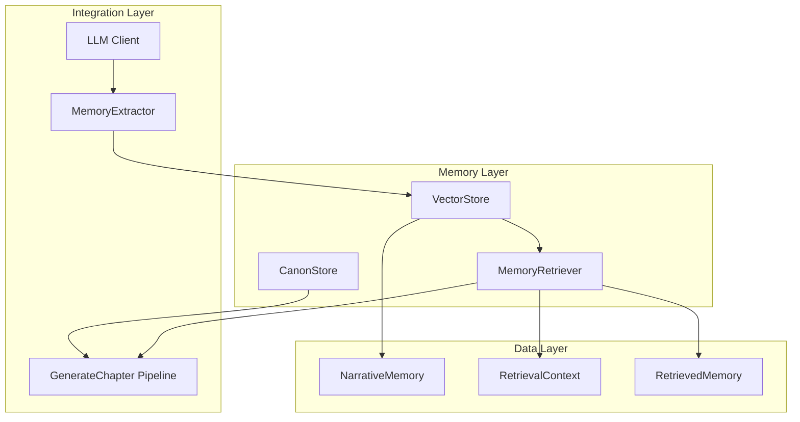
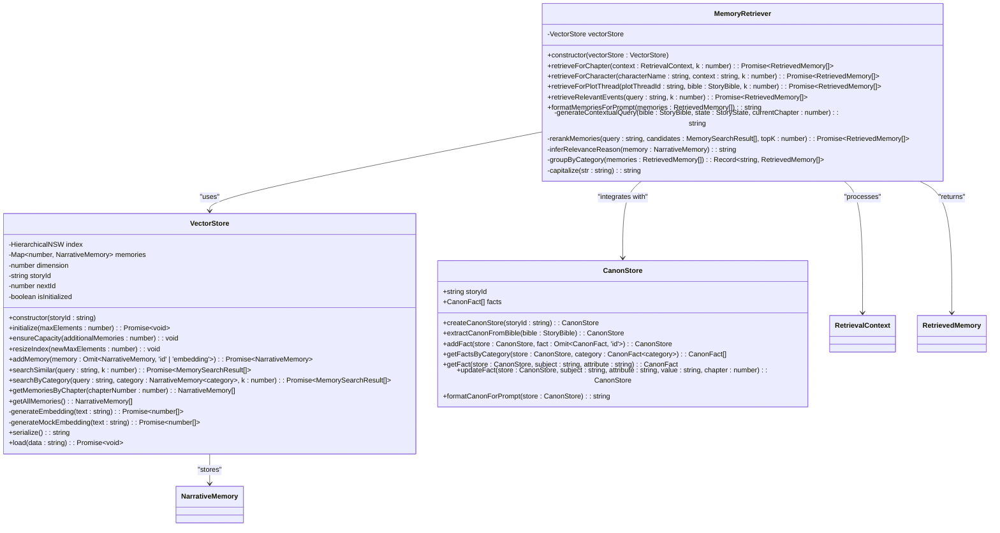
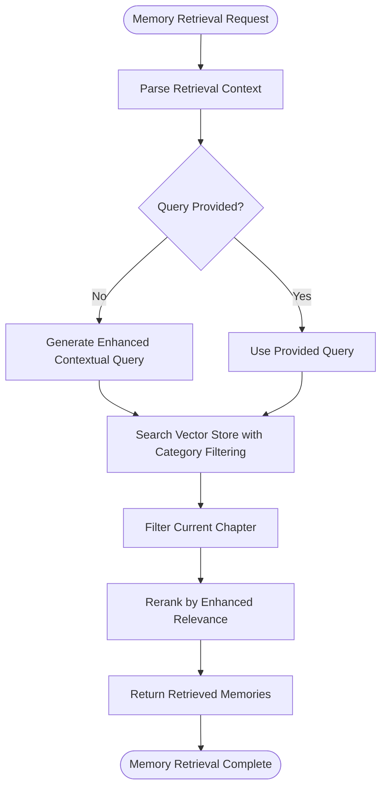
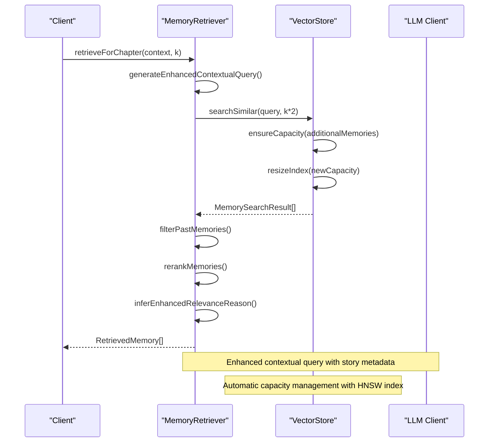
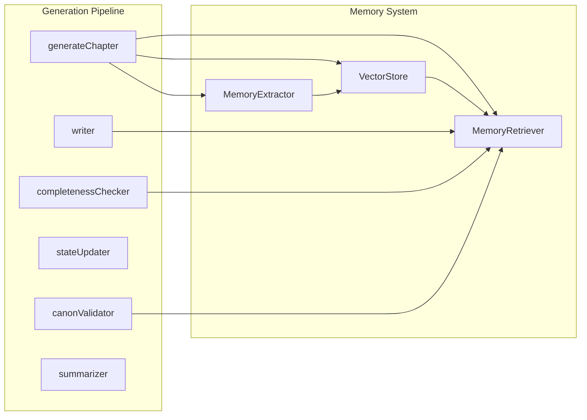

# Memory Retriever Component

<cite>
**Referenced Files in This Document**
- [memoryRetriever.ts](file://packages/engine/src/memory/memoryRetriever.ts)
- [vectorStore.ts](file://packages/engine/src/memory/vectorStore.ts)
- [canonStore.ts](file://packages/engine/src/memory/canonStore.ts)
- [index.ts](file://packages/engine/src/index.ts)
- [generateChapter.ts](file://packages/engine/src/pipeline/generateChapter.ts)
- [memoryExtractor.ts](file://packages/engine/src/agents/memoryExtractor.ts)
- [client.ts](file://packages/engine/src/llm/client.ts)
- [vector-memory.test.ts](file://packages/engine/src/test/vector-memory.test.ts)
</cite>

## Update Summary
**Changes Made**
- Enhanced contextual query generation with improved story metadata inclusion
- Improved category filtering mechanisms for character and plot thread retrieval
- Added automatic capacity management with dynamic index resizing
- Optimized search performance through better memory management
- Enhanced memory retrieval workflow with better relevance scoring

## Table of Contents
1. [Introduction](#introduction)
2. [System Architecture](#system-architecture)
3. [Core Components](#core-components)
4. [Memory Retrieval Workflow](#memory-retrieval-workflow)
5. [Data Structures](#data-structures)
6. [Integration Points](#integration-points)
7. [Performance Considerations](#performance-considerations)
8. [Usage Patterns](#usage-patterns)
9. [Testing and Validation](#testing-and-validation)
10. [Troubleshooting Guide](#troubleshooting-guide)
11. [Conclusion](#conclusion)

## Introduction

The Memory Retriever Component is a sophisticated system designed to enable narrative AI engines to access and utilize previously stored memories for coherent storytelling. This component serves as the bridge between raw narrative data and intelligent memory recall, allowing story generation systems to maintain continuity, context awareness, and narrative coherence across multiple chapters and story arcs.

The Memory Retriever operates within a broader ecosystem that includes vector-based memory storage, semantic search capabilities, and integration with the overall narrative generation pipeline. It transforms unstructured narrative content into searchable, retrievable knowledge that informs subsequent story generation decisions.

**Updated** Enhanced with improved contextual query generation, better category filtering, and optimized search performance with automatic capacity management.

## System Architecture

The Memory Retriever Component is built on a layered architecture that separates concerns between memory storage, retrieval mechanisms, and integration with the broader narrative system.



**Diagram sources**
- [memoryRetriever.ts:18-174](file://packages/engine/src/memory/memoryRetriever.ts#L18-L174)
- [vectorStore.ts:19-173](file://packages/engine/src/memory/vectorStore.ts#L19-L173)
- [generateChapter.ts:26-103](file://packages/engine/src/pipeline/generateChapter.ts#L26-L103)

The architecture follows a clear separation of concerns:
- **VectorStore**: Handles low-level memory storage and semantic search with automatic capacity management
- **MemoryRetriever**: Provides high-level retrieval interfaces and context-aware filtering with enhanced query generation
- **Integration**: Seamlessly connects with the generation pipeline and memory extraction processes

## Core Components

### MemoryRetriever Class

The MemoryRetriever class serves as the primary interface for accessing stored narrative memories. It encapsulates sophisticated retrieval logic that considers temporal context, narrative categories, and relevance scoring with improved contextual query generation.



**Diagram sources**
- [memoryRetriever.ts:18-174](file://packages/engine/src/memory/memoryRetriever.ts#L18-L174)
- [vectorStore.ts:19-173](file://packages/engine/src/memory/vectorStore.ts#L19-L173)
- [canonStore.ts:17-134](file://packages/engine/src/memory/canonStore.ts#L17-L134)

**Section sources**
- [memoryRetriever.ts:18-174](file://packages/engine/src/memory/memoryRetriever.ts#L18-L174)
- [vectorStore.ts:19-173](file://packages/engine/src/memory/vectorStore.ts#L19-L173)
- [canonStore.ts:17-134](file://packages/engine/src/memory/canonStore.ts#L17-L134)

### Retrieval Context System

The MemoryRetriever operates within a sophisticated context system that enables temporal and narrative-aware memory retrieval. The RetrievalContext interface provides essential information about the current story state, enabling the system to filter and rank memories appropriately.



**Diagram sources**
- [memoryRetriever.ts:25-41](file://packages/engine/src/memory/memoryRetriever.ts#L25-L41)
- [memoryRetriever.ts:104-132](file://packages/engine/src/memory/memoryRetriever.ts#L104-L132)

**Updated** Enhanced contextual query generation now includes story progress percentage, active plot threads, and genre information for better retrieval accuracy.

## Memory Retrieval Workflow

The Memory Retriever implements several specialized retrieval strategies tailored to different narrative contexts and requirements.

### Chapter-Based Retrieval

The primary retrieval mechanism focuses on finding memories relevant to a specific chapter, considering temporal constraints and narrative progression with improved contextual query generation.



**Diagram sources**
- [memoryRetriever.ts:25-41](file://packages/engine/src/memory/memoryRetriever.ts#L25-L41)
- [memoryRetriever.ts:104-132](file://packages/engine/src/memory/memoryRetriever.ts#L104-L132)
- [vectorStore.ts:66-92](file://packages/engine/src/memory/vectorStore.ts#L66-L92)

**Updated** Enhanced with automatic capacity management and improved contextual query generation.

### Character-Specific Retrieval

The system provides specialized retrieval for character-related memories with enhanced filtering mechanisms, enabling nuanced character development and relationship tracking.

**Updated** Improved character-specific retrieval now includes better filtering for memories that actually mention the character by name.

### Plot Thread Retrieval

Plot thread-specific retrieval ensures narrative coherence by surfacing memories relevant to ongoing story arcs and plot developments with enhanced category filtering.

**Updated** Enhanced plot thread retrieval now includes better category filtering and more specific relevance reasons.

**Section sources**
- [memoryRetriever.ts:43-83](file://packages/engine/src/memory/memoryRetriever.ts#L43-L83)

## Data Structures

The Memory Retriever Component relies on well-defined data structures that balance flexibility with performance requirements.

### NarrativeMemory Structure

The core memory representation captures essential narrative information with metadata for efficient retrieval and categorization.

| Field | Type | Description |
|-------|------|-------------|
| id | number | Unique identifier for the memory |
| storyId | string | Identifier linking memory to specific story |
| chapterNumber | number | Chapter where memory was established |
| content | string | Text content of the memory |
| category | 'event' \| 'character' \| 'world' \| 'plot' | Narrative category classification |
| timestamp | Date | Creation timestamp |
| embedding | number[] | Vector embedding for similarity search |

### Retrieval Context

The RetrievalContext provides the necessary information for context-aware memory retrieval, enabling temporal and narrative filtering with enhanced story metadata.

**Updated** Enhanced with improved contextual query generation that includes story progress, active plot threads, and genre information.

### RetrievedMemory

The RetrievedMemory structure combines stored memory data with retrieval metadata including relevance scores and enhanced reasoning with specific relevance categories.

**Updated** Enhanced with improved relevance reasoning that provides more specific information about why memories are relevant.

**Section sources**
- [vectorStore.ts:4-17](file://packages/engine/src/memory/vectorStore.ts#L4-L17)
- [memoryRetriever.ts:5-16](file://packages/engine/src/memory/memoryRetriever.ts#L5-L16)

## Integration Points

The Memory Retriever integrates seamlessly with multiple components of the narrative generation system, creating a cohesive storytelling pipeline.

### Pipeline Integration

The generateChapter pipeline orchestrates memory retrieval as part of the broader story generation process, ensuring that retrieved memories inform writing decisions while maintaining narrative coherence.



**Diagram sources**
- [generateChapter.ts:26-103](file://packages/engine/src/pipeline/generateChapter.ts#L26-L103)
- [memoryRetriever.ts:171-174](file://packages/engine/src/memory/memoryRetriever.ts#L171-L174)

**Updated** Enhanced integration with automatic capacity management and improved memory retrieval workflow.

### Agent Integration

The Memory Retriever coordinates with various agents within the system, including the MemoryExtractor for creating new memories and the writer for incorporating retrieved information into generated content.

**Section sources**
- [generateChapter.ts:26-103](file://packages/engine/src/pipeline/generateChapter.ts#L26-L103)
- [memoryExtractor.ts:52-97](file://packages/engine/src/agents/memoryExtractor.ts#L52-L97)

## Performance Considerations

The Memory Retriever is designed with performance optimization in mind, utilizing advanced indexing and caching mechanisms to ensure responsive memory retrieval.

### Vector Similarity Search

The system employs Hierarchical Navigable Small World (HNSW) indexing for efficient similarity search, providing logarithmic time complexity for nearest neighbor queries.

**Updated** Enhanced with automatic capacity management that dynamically resizes the index to accommodate growing memory collections.

### Embedding Generation

The VectorStore component handles embedding generation through the LLM client, with fallback mechanisms for environments without external API access.

### Memory Filtering

The retrieval process includes intelligent filtering to exclude irrelevant memories, particularly preventing access to future chapter content that would violate temporal consistency.

**Updated** Enhanced with improved filtering mechanisms for character-specific and plot-thread retrieval.

### Automatic Capacity Management

**New** The VectorStore now includes automatic capacity management features that dynamically resize the HNSW index as memory collections grow, ensuring optimal performance without manual intervention.

**Section sources**
- [vectorStore.ts:30-35](file://packages/engine/src/memory/vectorStore.ts#L30-L35)
- [vectorStore.ts:90-133](file://packages/engine/src/memory/vectorStore.ts#L90-L133)

## Usage Patterns

The Memory Retriever supports multiple usage patterns depending on the narrative context and requirements.

### Basic Retrieval Pattern

```typescript
// Initialize vector store and memory retriever with automatic capacity management
const vectorStore = getVectorStore(storyId);
await vectorStore.initialize();
const memoryRetriever = createMemoryRetriever(vectorStore);

// Retrieve memories for current chapter with enhanced contextual query
const context: RetrievalContext = {
  bible,
  state,
  currentChapter: chapterNumber
};

const memories = await memoryRetriever.retrieveForChapter(context, 5);
const formatted = memoryRetriever.formatMemoriesForPrompt(memories);
```

**Updated** Enhanced with automatic capacity management and improved contextual query generation.

### Character-Focused Retrieval

```typescript
// Retrieve character-specific memories with enhanced filtering
const characterMemories = await memoryRetriever.retrieveForCharacter(
  characterName, 
  characterContext, 
  3
);
```

**Updated** Enhanced with better character name filtering to ensure memories actually mention the character.

### Plot Thread Retrieval

```typescript
// Retrieve memories relevant to specific plot threads with enhanced category filtering
const plotMemories = await memoryRetriever.retrieveForPlotThread(
  plotThreadId, 
  bible, 
  3
);
```

**Updated** Enhanced with improved category filtering and more specific relevance reasons.

**Section sources**
- [memoryRetriever.ts:25-83](file://packages/engine/src/memory/memoryRetriever.ts#L25-L83)
- [vector-memory.test.ts:96-127](file://packages/engine/src/test/vector-memory.test.ts#L96-L127)

## Testing and Validation

The Memory Retriever Component includes comprehensive testing that validates both individual components and integrated workflows.

### Vector Memory Testing

The test suite demonstrates the complete memory lifecycle from storage to retrieval, validating semantic search capabilities and temporal filtering.

### Integration Testing

Tests verify the seamless integration between memory retrieval and the broader narrative generation pipeline, ensuring that retrieved memories enhance rather than disrupt story coherence.

**Updated** Enhanced testing now covers automatic capacity management and improved retrieval accuracy.

**Section sources**
- [vector-memory.test.ts:31-185](file://packages/engine/src/test/vector-memory.test.ts#L31-L185)

## Troubleshooting Guide

Common issues and their solutions when working with the Memory Retriever Component.

### Memory Retrieval Issues

**Problem**: Memory retrieval returns empty results
**Solution**: Verify vector store initialization and embedding generation. Check that memories have been properly added and that the HNSW index is functioning correctly.

**Problem**: Temporal inconsistencies in retrieved memories
**Solution**: Ensure proper filtering of current chapter memories. The system automatically excludes memories from the current chapter, but verify that chapter numbers are correctly set.

**Updated** Enhanced troubleshooting for automatic capacity management issues.

### Performance Issues

**Problem**: Slow memory retrieval performance
**Solution**: Monitor HNSW index initialization and embedding generation. Consider adjusting the search parameters and ensuring adequate system resources for vector operations.

**Problem**: Memory corruption or loss
**Solution**: Implement proper serialization and deserialization of the vector store. Regularly backup memory data and verify integrity during loading operations.

**Updated** Enhanced troubleshooting for automatic capacity management and memory growth scenarios.

### Integration Problems

**Problem**: Memory retriever not integrating with generation pipeline
**Solution**: Verify proper initialization sequence and ensure that vector store is initialized before creating the memory retriever. Check that all required dependencies are properly configured.

**Section sources**
- [vectorStore.ts:37-58](file://packages/engine/src/memory/vectorStore.ts#L37-L58)
- [memoryRetriever.ts:117-132](file://packages/engine/src/memory/memoryRetriever.ts#L117-L132)

## Conclusion

The Memory Retriever Component represents a sophisticated solution for narrative memory management in AI-powered storytelling systems. Its architecture balances performance with functionality, providing developers with flexible tools for context-aware memory retrieval while maintaining narrative coherence and temporal consistency.

**Updated** Recent enhancements include improved contextual query generation with richer story metadata, better category filtering mechanisms, and automatic capacity management for optimized search performance. These improvements ensure that the system can handle growing memory collections efficiently while maintaining high retrieval accuracy.

The component's integration with the broader narrative generation pipeline ensures that retrieved memories enhance rather than complicate the storytelling process. Through careful design of data structures, retrieval algorithms, and integration patterns, the Memory Retriever enables the creation of compelling, coherent narratives that maintain continuity across multiple chapters and story arcs.

Future enhancements could include more sophisticated relevance scoring, advanced filtering capabilities, and expanded integration with other narrative components to further improve the quality and coherence of generated stories.