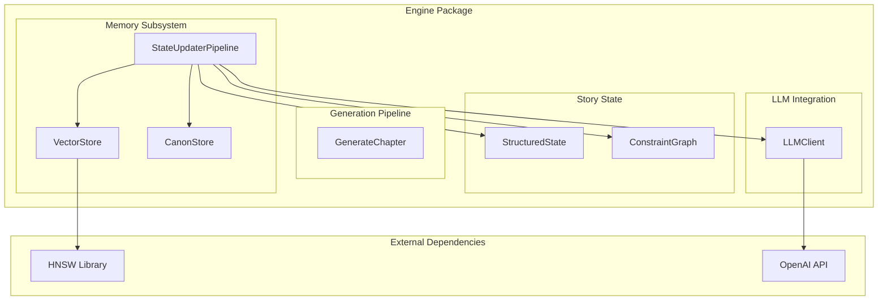
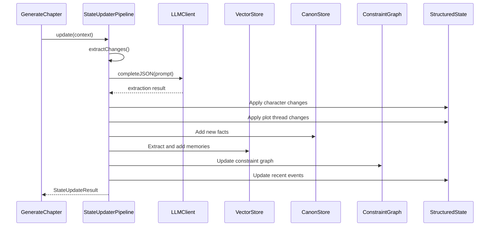
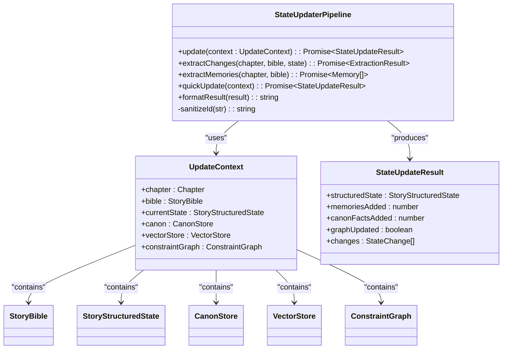
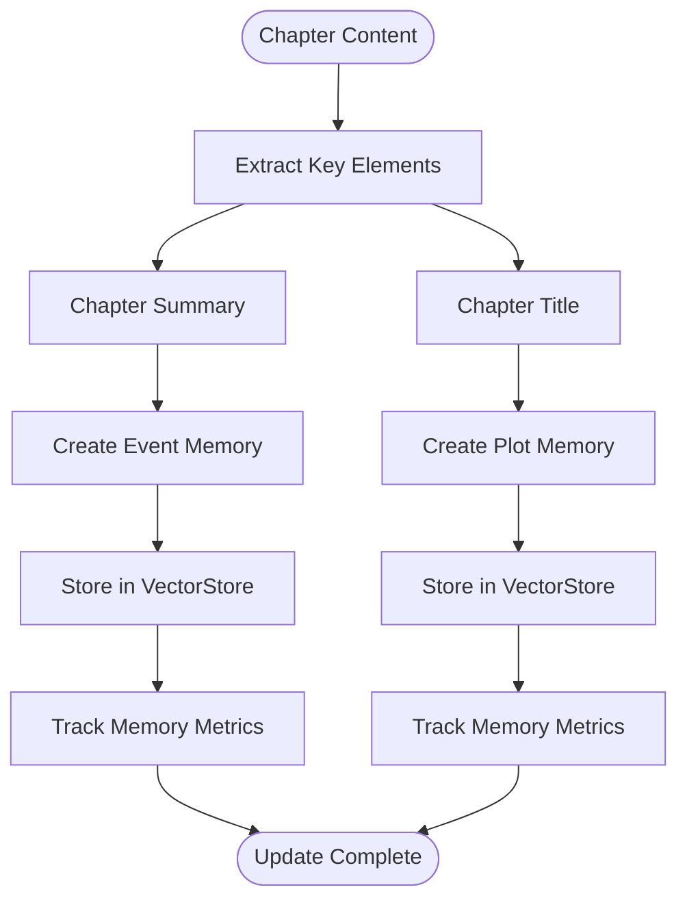
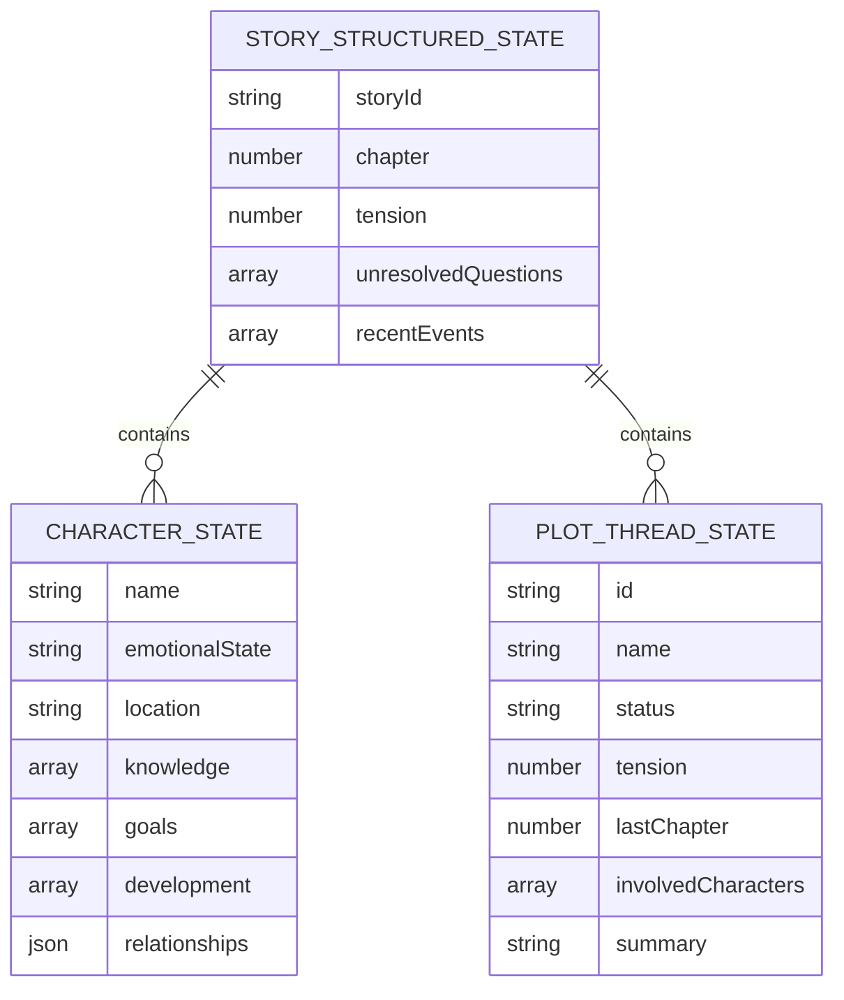
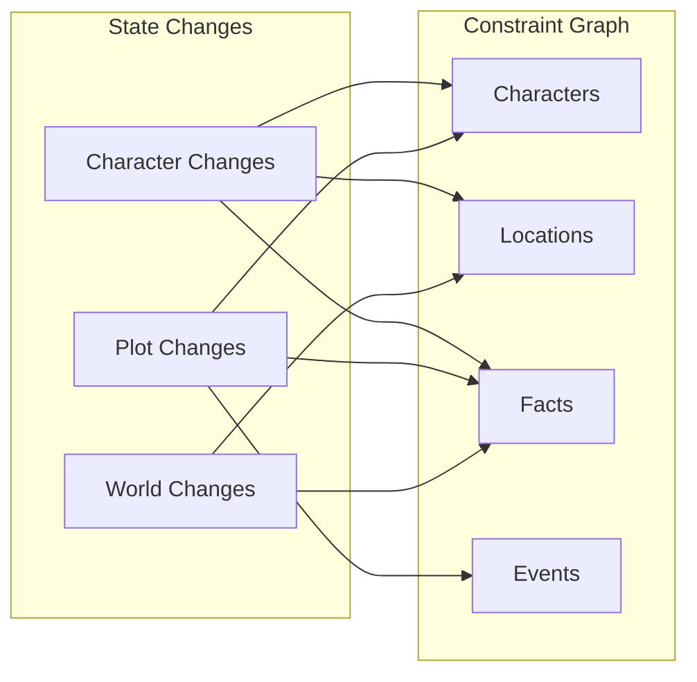
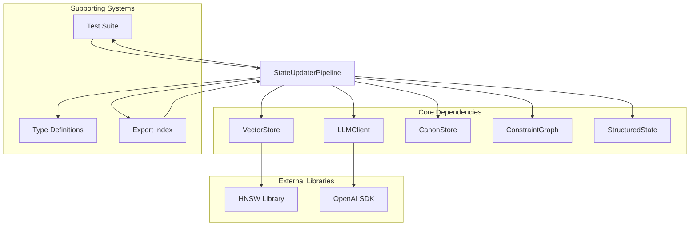
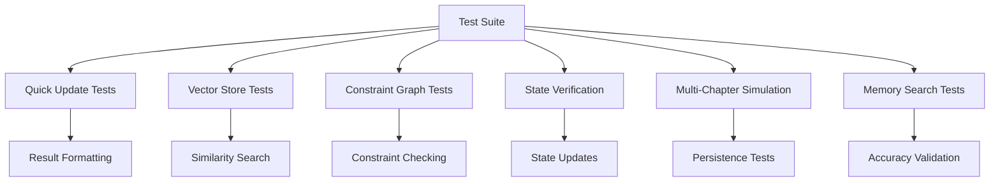

# StateUpdater Pipeline

<cite>
**Referenced Files in This Document**
- [packages/engine/src/memory/stateUpdater.ts](file://packages/engine/src/memory/stateUpdater.ts)
- [packages/engine/src/agents/stateUpdater.ts](file://packages/engine/src/agents/stateUpdater.ts)
- [packages/engine/src/story/structuredState.ts](file://packages/engine/src/story/structuredState.ts)
- [packages/engine/src/memory/canonStore.ts](file://packages/engine/src/memory/canonStore.ts)
- [packages/engine/src/memory/vectorStore.ts](file://packages/engine/src/memory/vectorStore.ts)
- [packages/engine/src/constraints/constraintGraph.ts](file://packages/engine/src/constraints/constraintGraph.ts)
- [packages/engine/src/pipeline/generateChapter.ts](file://packages/engine/src/pipeline/generateChapter.ts)
- [packages/engine/src/llm/client.ts](file://packages/engine/src/llm/client.ts)
- [packages/engine/src/types/index.ts](file://packages/engine/src/types/index.ts)
- [packages/engine/src/test/state-updater.test.ts](file://packages/engine/src/test/state-updater.test.ts)
- [packages/engine/src/index.ts](file://packages/engine/src/index.ts)
</cite>

## Table of Contents
1. [Introduction](#introduction)
2. [Project Structure](#project-structure)
3. [Core Components](#core-components)
4. [Architecture Overview](#architecture-overview)
5. [Detailed Component Analysis](#detailed-component-analysis)
6. [Dependency Analysis](#dependency-analysis)
7. [Performance Considerations](#performance-considerations)
8. [Troubleshooting Guide](#troubleshooting-guide)
9. [Conclusion](#conclusion)

## Introduction

The StateUpdater Pipeline is a sophisticated post-processing system that transforms raw chapter content into structured narrative state changes within the Narrative Operating System. This pipeline serves as the bridge between generated content and persistent story state, maintaining narrative coherence through intelligent extraction, validation, and integration of story elements.

Unlike the simpler StateUpdater agent that focuses on extracting state changes from individual chapters, the StateUpdater Pipeline orchestrates a comprehensive workflow that handles memory extraction, canonical fact establishment, constraint graph updates, and structured state maintenance. It represents Phase 10 of the 10-phase implementation, specifically designed to handle the complex task of updating multiple interconnected story systems simultaneously.

The pipeline operates on a layered approach, processing chapter content through multiple stages while maintaining consistency across the entire narrative ecosystem. It ensures that new information is properly integrated into the story's memory hierarchy, constraint graph, and structural state while preventing logical inconsistencies and maintaining narrative coherence.

## Project Structure

The StateUpdater Pipeline is organized within the engine package's memory subsystem, working in concert with other core components:

**Diagram sources**
- [packages/engine/src/memory/stateUpdater.ts](file://packages/engine/src/memory/stateUpdater.ts#L90-L248)
- [packages/engine/src/memory/vectorStore.ts](file://packages/engine/src/memory/vectorStore.ts#L19-L58)
- [packages/engine/src/memory/canonStore.ts](file://packages/engine/src/memory/canonStore.ts#L12-L22)
- [packages/engine/src/constraints/constraintGraph.ts](file://packages/engine/src/constraints/constraintGraph.ts#L29-L43)

**Section sources**
- [packages/engine/src/memory/stateUpdater.ts](file://packages/engine/src/memory/stateUpdater.ts#L1-L435)
- [packages/engine/src/index.ts](file://packages/engine/src/index.ts#L81-L88)

## Core Components

The StateUpdater Pipeline consists of several interconnected components that work together to maintain narrative consistency:

### StateUpdaterPipeline Class
The main orchestrator that coordinates the entire update process, managing the sequential steps from extraction to integration.

### UpdateContext Interface
Defines the complete context required for state updates, including chapter content, story bible, current state, and all supporting systems.

### StateUpdateResult Interface
Standardized output containing the updated state, metrics about changes made, and detailed logs of all modifications.

### StateChange Interface
Tracks individual changes made during the update process, categorized by type (character, plot, world, canon, memory).

**Section sources**
- [packages/engine/src/memory/stateUpdater.ts](file://packages/engine/src/memory/stateUpdater.ts#L8-L29)
- [packages/engine/src/memory/stateUpdater.ts](file://packages/engine/src/memory/stateUpdater.ts#L90-L248)

## Architecture Overview

The StateUpdater Pipeline follows a systematic approach to processing chapter content, transforming raw text into structured narrative state changes:

**Diagram sources**
- [packages/engine/src/pipeline/generateChapter.ts](file://packages/engine/src/pipeline/generateChapter.ts#L26-L103)
- [packages/engine/src/memory/stateUpdater.ts](file://packages/engine/src/memory/stateUpdater.ts#L94-L248)

The pipeline operates through six distinct phases, each serving a specific purpose in the narrative state update process:

1. **State Change Extraction**: Uses LLM to identify and categorize all narrative changes
2. **Structured State Application**: Applies changes to the structured story state
3. **Canon Fact Establishment**: Adds new canonical facts to the immutable story database
4. **Memory Extraction**: Identifies and extracts narrative memories from chapter content
5. **Constraint Graph Updates**: Maintains logical consistency across the knowledge graph
6. **Recent Events Tracking**: Updates the rolling record of recent story events

**Section sources**
- [packages/engine/src/memory/stateUpdater.ts](file://packages/engine/src/memory/stateUpdater.ts#L94-L248)

## Detailed Component Analysis

### StateUpdaterPipeline Implementation

The StateUpdaterPipeline serves as the central coordinator for all post-chapter update operations. Its implementation demonstrates sophisticated state management and error handling:

**Diagram sources**
- [packages/engine/src/memory/stateUpdater.ts](file://packages/engine/src/memory/stateUpdater.ts#L90-L336)
- [packages/engine/src/memory/stateUpdater.ts](file://packages/engine/src/memory/stateUpdater.ts#L22-L29)

#### Extraction Process

The extraction process utilizes a carefully crafted prompt template that provides the LLM with comprehensive context about the story world, current state, and chapter content. The system employs a two-stage extraction approach:

1. **Character Changes**: Tracks emotional states, locations, knowledge acquisition, relationship developments, and goal changes
2. **Plot Thread Changes**: Monitors status transitions, tension modifications, and summary updates
3. **New Facts**: Establishes canonical facts about characters, world elements, and plot developments
4. **World Changes**: Captures environmental and setting modifications

**Section sources**
- [packages/engine/src/memory/stateUpdater.ts](file://packages/engine/src/memory/stateUpdater.ts#L31-L88)
- [packages/engine/src/memory/stateUpdater.ts](file://packages/engine/src/memory/stateUpdater.ts#L253-L308)

#### Memory Management Integration

The pipeline integrates seamlessly with the vector memory system, extracting meaningful narrative elements from chapter summaries and titles:

**Diagram sources**
- [packages/engine/src/memory/stateUpdater.ts](file://packages/engine/src/memory/stateUpdater.ts#L313-L336)
- [packages/engine/src/memory/vectorStore.ts](file://packages/engine/src/memory/vectorStore.ts#L37-L58)

**Section sources**
- [packages/engine/src/memory/stateUpdater.ts](file://packages/engine/src/memory/stateUpdater.ts#L313-L336)
- [packages/engine/src/memory/vectorStore.ts](file://packages/engine/src/memory/vectorStore.ts#L37-L58)

### Structured State Management

The pipeline maintains a comprehensive structured state that tracks all narrative elements:

**Diagram sources**
- [packages/engine/src/story/structuredState.ts](file://packages/engine/src/story/structuredState.ts#L23-L31)
- [packages/engine/src/story/structuredState.ts](file://packages/engine/src/story/structuredState.ts#L3-L11)

The structured state provides a comprehensive view of the story world, enabling intelligent narrative decisions and maintaining consistency across all story elements.

**Section sources**
- [packages/engine/src/story/structuredState.ts](file://packages/engine/src/story/structuredState.ts#L23-L85)

### Constraint Graph Integration

The pipeline maintains logical consistency through integration with the constraint graph system:

**Diagram sources**
- [packages/engine/src/constraints/constraintGraph.ts](file://packages/engine/src/constraints/constraintGraph.ts#L98-L143)
- [packages/engine/src/constraints/constraintGraph.ts](file://packages/engine/src/constraints/constraintGraph.ts#L163-L192)

The constraint graph enforces logical consistency by tracking character locations, knowledge relationships, timeline constraints, and event participation.

**Section sources**
- [packages/engine/src/constraints/constraintGraph.ts](file://packages/engine/src/constraints/constraintGraph.ts#L98-L192)

## Dependency Analysis

The StateUpdater Pipeline exhibits sophisticated dependency management across multiple systems:

**Diagram sources**
- [packages/engine/src/memory/stateUpdater.ts](file://packages/engine/src/memory/stateUpdater.ts#L1-L6)
- [packages/engine/src/llm/client.ts](file://packages/engine/src/llm/client.ts#L1-L120)
- [packages/engine/src/memory/vectorStore.ts](file://packages/engine/src/memory/vectorStore.ts#L1-L2)

The dependency analysis reveals a well-structured system where each component has a specific responsibility and minimal coupling with other systems. The pipeline maintains loose coupling through well-defined interfaces and clear separation of concerns.

**Section sources**
- [packages/engine/src/memory/stateUpdater.ts](file://packages/engine/src/memory/stateUpdater.ts#L1-L6)
- [packages/engine/src/types/index.ts](file://packages/engine/src/types/index.ts#L1-L90)

## Performance Considerations

The StateUpdater Pipeline is designed with performance optimization in mind, particularly for the memory extraction and constraint graph operations:

### Memory Management Efficiency
- **Batch Processing**: Memories are processed in batches to minimize I/O operations
- **Vector Embedding Caching**: Embeddings are computed once and stored for reuse
- **Incremental Updates**: Only new memories trigger embedding computations

### Constraint Graph Optimization
- **Efficient Node Updates**: Location and knowledge updates are optimized for minimal graph traversal
- **Lazy Validation**: Constraint checking is performed incrementally rather than comprehensively
- **Index Utilization**: Constraint graph uses efficient adjacency lists for fast lookups

### LLM Cost Management
- **Prompt Optimization**: Prompts are truncated to optimal length while maintaining context
- **Temperature Control**: Lower temperatures (0.3) reduce token consumption during JSON extraction
- **Result Validation**: Pre-validation reduces retry attempts and API costs

**Section sources**
- [packages/engine/src/memory/stateUpdater.ts](file://packages/engine/src/memory/stateUpdater.ts#L297-L307)
- [packages/engine/src/llm/client.ts](file://packages/engine/src/llm/client.ts#L90-L109)

## Troubleshooting Guide

### Common Issues and Solutions

#### LLM API Integration Problems
- **Symptom**: JSON parsing failures during extraction
- **Solution**: Verify API key configuration and model availability
- **Prevention**: Implement fallback mechanisms for API unavailability

#### Memory Storage Failures
- **Symptom**: Vector store initialization errors
- **Solution**: Check HNSW library installation and Node.js compatibility
- **Prevention**: Ensure proper cleanup of vector store instances

#### Constraint Graph Inconsistencies
- **Symptom**: Violation detection during state updates
- **Solution**: Review character movements and timeline consistency
- **Prevention**: Implement pre-update validation checks

#### State Synchronization Issues
- **Symptom**: Discrepancies between structured state and constraint graph
- **Solution**: Verify update order and transaction boundaries
- **Prevention**: Use atomic update operations where possible

**Section sources**
- [packages/engine/src/test/state-updater.test.ts](file://packages/engine/src/test/state-updater.test.ts#L173-L175)
- [packages/engine/src/memory/vectorStore.ts](file://packages/engine/src/memory/vectorStore.ts#L30-L35)

### Testing and Validation

The pipeline includes comprehensive test coverage that validates all major functionality:

**Diagram sources**
- [packages/engine/src/test/state-updater.test.ts](file://packages/engine/src/test/state-updater.test.ts#L89-L231)

The test suite validates the pipeline's ability to handle various scenarios, from simple quick updates to complex multi-chapter simulations with proper memory persistence and constraint validation.

**Section sources**
- [packages/engine/src/test/state-updater.test.ts](file://packages/engine/src/test/state-updater.test.ts#L1-L232)

## Conclusion

The StateUpdater Pipeline represents a sophisticated solution for maintaining narrative coherence in long-form AI-generated stories. By orchestrating updates across multiple interconnected systems—memory extraction, canonical fact establishment, constraint graph maintenance, and structured state management—the pipeline ensures that stories remain logically consistent and narratively coherent over time.

The implementation demonstrates several key strengths:

**Architectural Excellence**: The pipeline's modular design enables clear separation of concerns while maintaining efficient coordination between components.

**Scalability**: The use of vector-based memory storage and constraint graphs allows the system to scale effectively as story complexity increases.

**Maintainability**: Comprehensive testing and clear interfaces facilitate ongoing development and debugging.

**Performance**: Optimized memory management and LLM cost controls ensure practical deployment capabilities.

The StateUpdater Pipeline successfully addresses the fundamental challenge of "goldfish memory" in AI storytelling by providing a robust framework for persistent narrative state management. Its integration with the broader Narrative Operating System creates a cohesive ecosystem where stories can evolve naturally while maintaining logical consistency and narrative coherence.

Future enhancements could include more sophisticated memory ranking algorithms, expanded constraint checking capabilities, and additional narrative analysis features to further improve story quality and coherence.