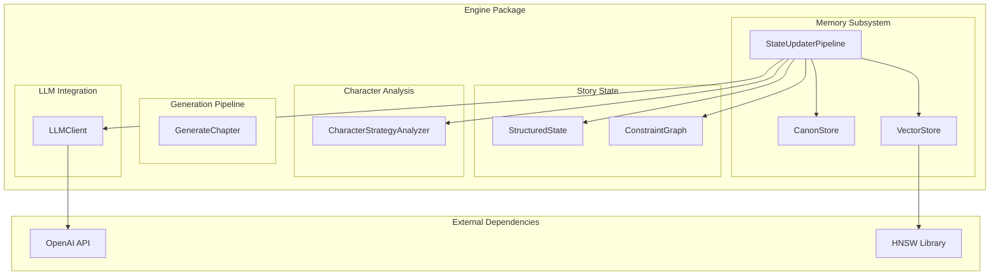
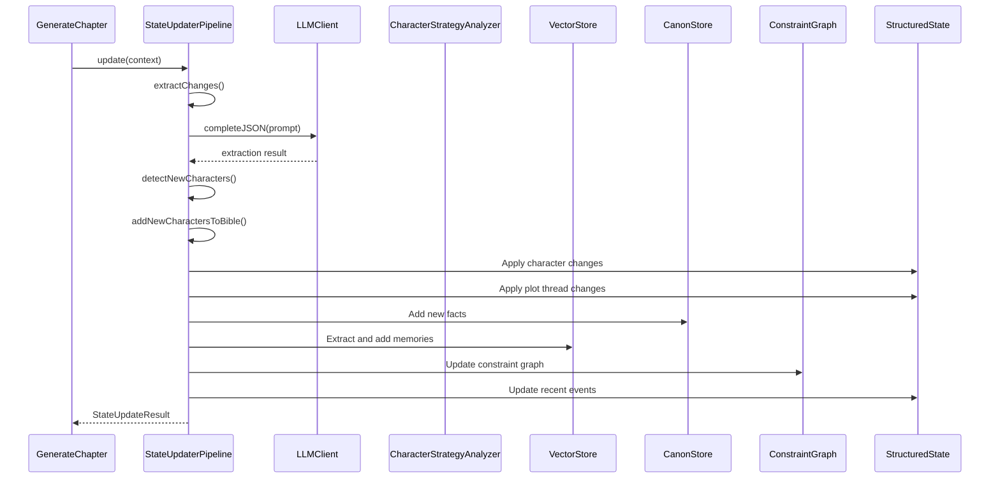
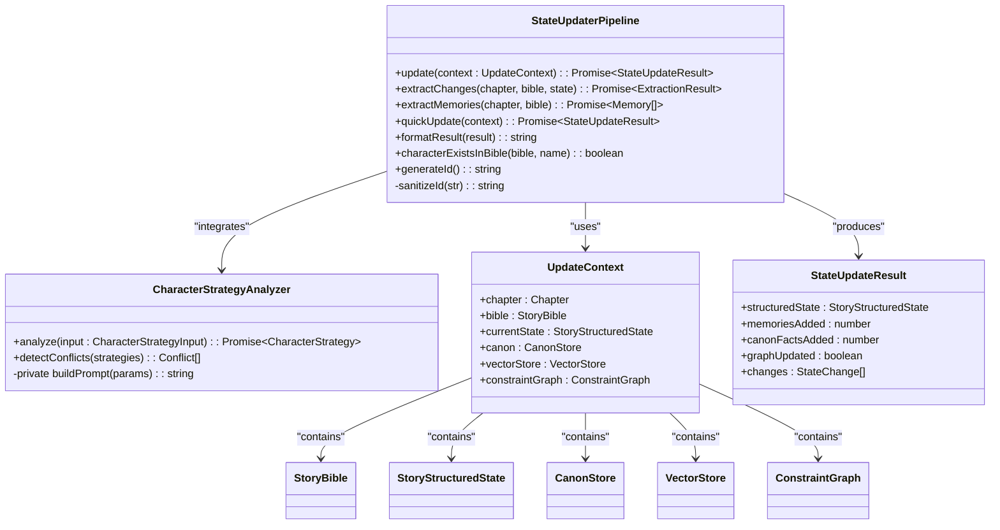
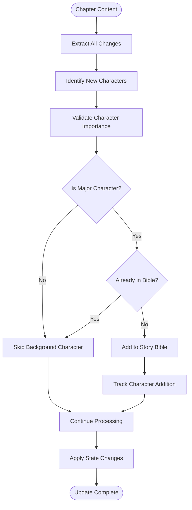
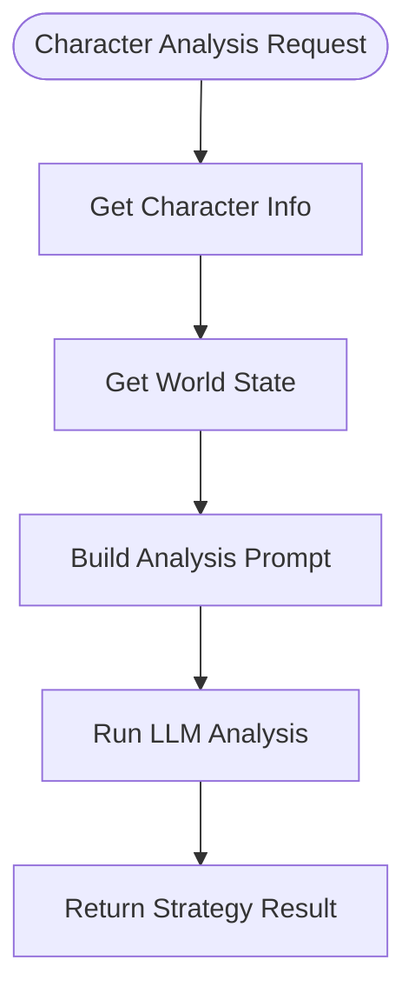
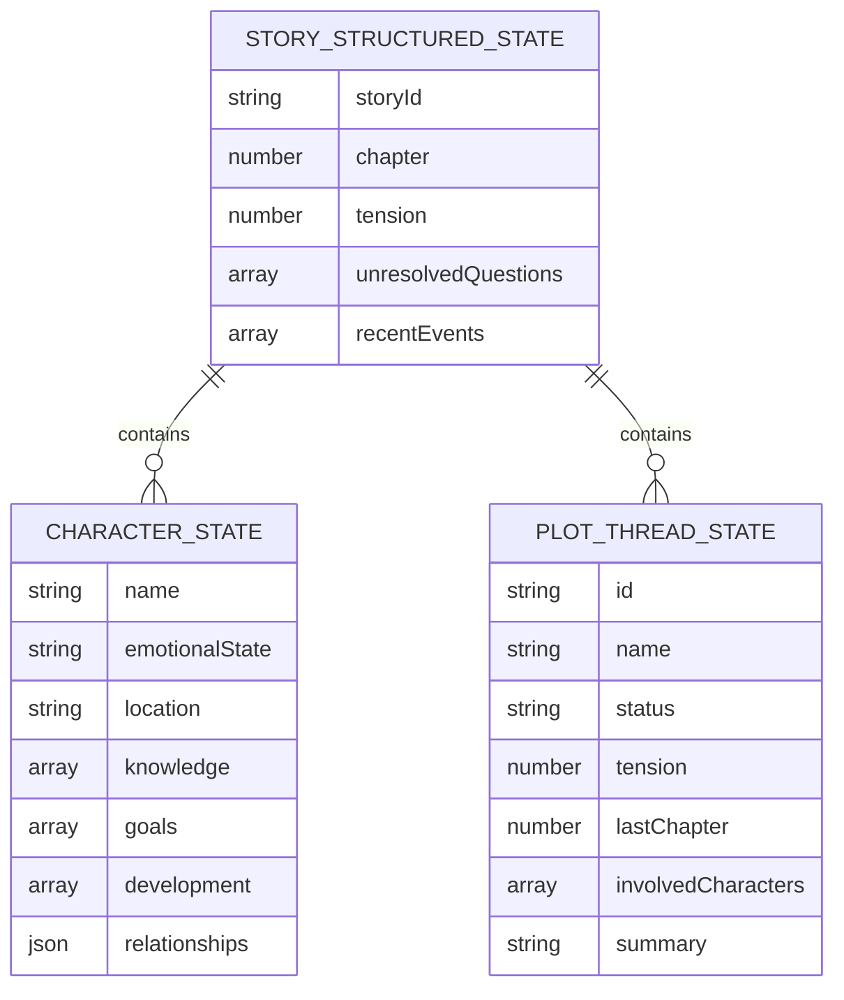
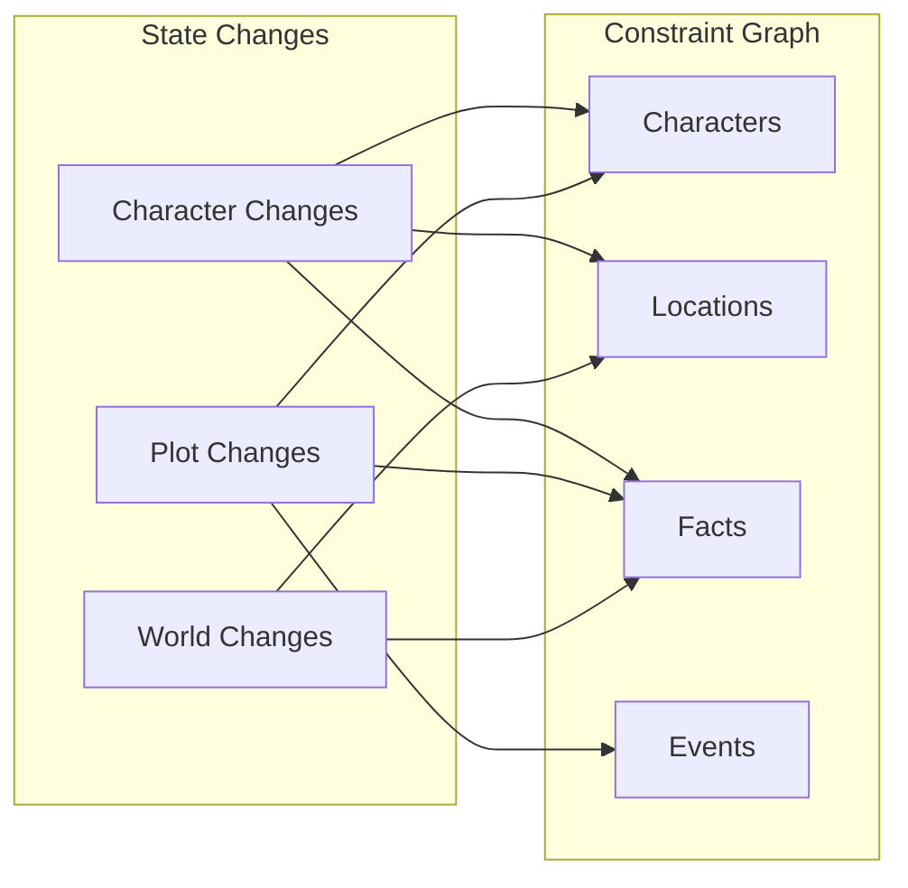
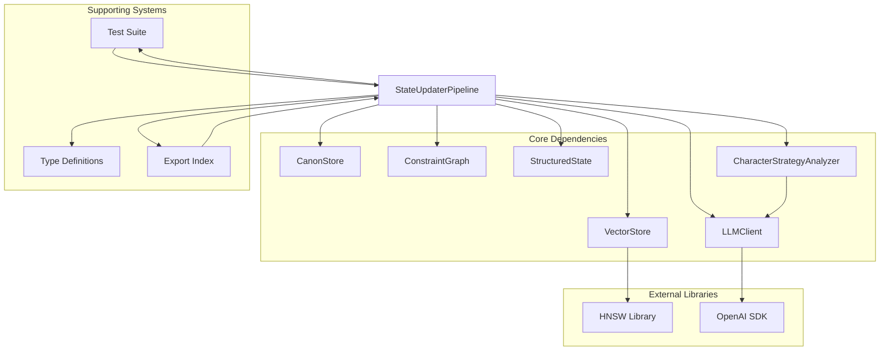
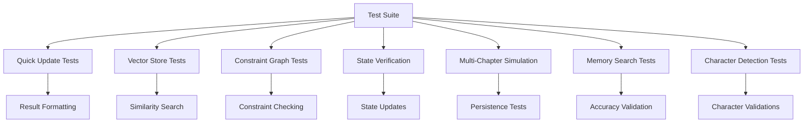

# StateUpdater Pipeline

<cite>
**Referenced Files in This Document**
- [packages/engine/src/memory/stateUpdater.ts](file://packages/engine/src/memory/stateUpdater.ts)
- [packages/engine/src/agents/stateUpdater.ts](file://packages/engine/src/agents/stateUpdater.ts)
- [packages/engine/src/agents/characterStrategy.ts](file://packages/engine/src/agents/characterStrategy.ts)
- [packages/engine/src/story/structuredState.ts](file://packages/engine/src/story/structuredState.ts)
- [packages/engine/src/memory/canonStore.ts](file://packages/engine/src/memory/canonStore.ts)
- [packages/engine/src/memory/vectorStore.ts](file://packages/engine/src/memory/vectorStore.ts)
- [packages/engine/src/constraints/constraintGraph.ts](file://packages/engine/src/constraints/constraintGraph.ts)
- [packages/engine/src/pipeline/generateChapter.ts](file://packages/engine/src/pipeline/generateChapter.ts)
- [packages/engine/src/llm/client.ts](file://packages/engine/src/llm/client.ts)
- [packages/engine/src/types/index.ts](file://packages/engine/src/types/index.ts)
- [packages/engine/src/test/state-updater.test.ts](file://packages/engine/src/test/state-updater.test.ts)
- [packages/engine/src/index.ts](file://packages/engine/src/index.ts)
</cite>

## Update Summary
**Changes Made**
- Enhanced StateUpdaterPipeline with automatic detection and addition of new major characters to story bible
- Expanded state extraction prompt to include new character detection alongside existing character changes, plot thread progression, and world-state modifications
- Integrated CharacterStrategyAnalyzer system for advanced character strategy analysis
- Added new character validation and filtering logic for major character detection
- Enhanced state extraction prompt with comprehensive character, plot, and world-state modification tracking

## Table of Contents
1. [Introduction](#introduction)
2. [Project Structure](#project-structure)
3. [Core Components](#core-components)
4. [Architecture Overview](#architecture-overview)
5. [Detailed Component Analysis](#detailed-component-analysis)
6. [Dependency Analysis](#dependency-analysis)
7. [Performance Considerations](#performance-considerations)
8. [Troubleshooting Guide](#troubleshooting-guide)
9. [Conclusion](#conclusion)

## Introduction

The StateUpdater Pipeline is a sophisticated post-processing system that transforms raw chapter content into structured narrative state changes within the Narrative Operating System. This pipeline serves as the bridge between generated content and persistent story state, maintaining narrative coherence through intelligent extraction, validation, and integration of story elements.

**Updated** The pipeline now features enhanced capabilities for automatic character detection and integration, expanding beyond simple state extraction to include comprehensive narrative analysis and character strategy integration.

Unlike the simpler StateUpdater agent that focuses on extracting state changes from individual chapters, the StateUpdater Pipeline orchestrates a comprehensive workflow that handles memory extraction, canonical fact establishment, constraint graph updates, and structured state maintenance. It represents Phase 10 of the 10-phase implementation, specifically designed to handle the complex task of updating multiple interconnected story systems simultaneously.

The pipeline operates on a layered approach, processing chapter content through multiple stages while maintaining consistency across the entire narrative ecosystem. It ensures that new information is properly integrated into the story's memory hierarchy, constraint graph, and structural state while preventing logical inconsistencies and maintaining narrative coherence.

## Project Structure

The StateUpdater Pipeline is organized within the engine package's memory subsystem, working in concert with other core components and the new CharacterStrategyAnalyzer system:

**Diagram sources**
- [packages/engine/src/memory/stateUpdater.ts:107-140](file://packages/engine/src/memory/stateUpdater.ts#L107-L140)
- [packages/engine/src/agents/characterStrategy.ts:71-105](file://packages/engine/src/agents/characterStrategy.ts#L71-L105)
- [packages/engine/src/memory/vectorStore.ts:19-58](file://packages/engine/src/memory/vectorStore.ts#L19-L58)
- [packages/engine/src/memory/canonStore.ts:12-22](file://packages/engine/src/memory/canonStore.ts#L12-L22)
- [packages/engine/src/constraints/constraintGraph.ts:29-43](file://packages/engine/src/constraints/constraintGraph.ts#L29-L43)

**Section sources**
- [packages/engine/src/memory/stateUpdater.ts:1-493](file://packages/engine/src/memory/stateUpdater.ts#L1-L493)
- [packages/engine/src/index.ts:81-88](file://packages/engine/src/index.ts#L81-L88)

## Core Components

The StateUpdater Pipeline consists of several interconnected components that work together to maintain narrative consistency:

### StateUpdaterPipeline Class
The main orchestrator that coordinates the entire update process, managing the sequential steps from extraction to integration. **Updated** Now includes automatic new character detection and addition to the story bible.

### CharacterStrategyAnalyzer Integration
**New** A sophisticated character analysis system that provides strategic insights into character motivations, goals, and relationship dynamics, enabling more intelligent state updates.

### UpdateContext Interface
Defines the complete context required for state updates, including chapter content, story bible, current state, and all supporting systems.

### StateUpdateResult Interface
Standardized output containing the updated state, metrics about changes made, and detailed logs of all modifications.

### StateChange Interface
Tracks individual changes made during the update process, categorized by type (character, plot, world, canon, memory).

**Section sources**
- [packages/engine/src/memory/stateUpdater.ts:8-29](file://packages/engine/src/memory/stateUpdater.ts#L8-L29)
- [packages/engine/src/agents/characterStrategy.ts:5-23](file://packages/engine/src/agents/characterStrategy.ts#L5-L23)
- [packages/engine/src/memory/stateUpdater.ts:107-140](file://packages/engine/src/memory/stateUpdater.ts#L107-L140)

## Architecture Overview

The StateUpdater Pipeline follows a systematic approach to processing chapter content, transforming raw text into structured narrative state changes with enhanced character analysis capabilities:

**Diagram sources**
- [packages/engine/src/pipeline/generateChapter.ts:26-103](file://packages/engine/src/pipeline/generateChapter.ts#L26-L103)
- [packages/engine/src/memory/stateUpdater.ts:111-140](file://packages/engine/src/memory/stateUpdater.ts#L111-L140)
- [packages/engine/src/agents/characterStrategy.ts:71-105](file://packages/engine/src/agents/characterStrategy.ts#L71-L105)

The pipeline operates through seven distinct phases, each serving a specific purpose in the narrative state update process:

1. **State Change Extraction**: Uses LLM to identify and categorize all narrative changes including new character detection
2. **New Character Detection**: Validates and filters newly introduced characters for major character inclusion
3. **Character Integration**: Automatically adds validated major characters to the story bible
4. **Structured State Application**: Applies changes to the structured story state
5. **Canon Fact Establishment**: Adds new canonical facts to the immutable story database
6. **Memory Extraction**: Identifies and extracts narrative memories from chapter content
7. **Constraint Graph Updates**: Maintains logical consistency across the knowledge graph
8. **Recent Events Tracking**: Updates the rolling record of recent story events

**Section sources**
- [packages/engine/src/memory/stateUpdater.ts:111-140](file://packages/engine/src/memory/stateUpdater.ts#L111-L140)
- [packages/engine/src/memory/stateUpdater.ts:291-356](file://packages/engine/src/memory/stateUpdater.ts#L291-L356)

## Detailed Component Analysis

### StateUpdaterPipeline Implementation

The StateUpdaterPipeline serves as the central coordinator for all post-chapter update operations. Its implementation demonstrates sophisticated state management and error handling with enhanced character detection capabilities:

**Diagram sources**
- [packages/engine/src/memory/stateUpdater.ts:107-490](file://packages/engine/src/memory/stateUpdater.ts#L107-L490)
- [packages/engine/src/agents/characterStrategy.ts:71-105](file://packages/engine/src/agents/characterStrategy.ts#L71-L105)
- [packages/engine/src/memory/stateUpdater.ts:22-29](file://packages/engine/src/memory/stateUpdater.ts#L22-L29)

#### Enhanced Extraction Process

**Updated** The extraction process now includes comprehensive new character detection alongside traditional state changes. The system employs a sophisticated two-stage extraction approach:

1. **Character Changes**: Tracks emotional states, locations, knowledge acquisition, relationship developments, and goal changes for existing characters
2. **New Character Detection**: Identifies and validates new major characters with role, importance, personality traits, and background information
3. **Plot Thread Changes**: Monitors status transitions, tension modifications, and summary updates for existing plot threads
4. **New Facts**: Establishes canonical facts about characters, world elements, and plot developments
5. **World Changes**: Captures environmental and setting modifications

The extraction prompt has been expanded to include comprehensive character, plot, and world-state modification tracking, enabling more nuanced narrative analysis.

**Section sources**
- [packages/engine/src/memory/stateUpdater.ts:31-105](file://packages/engine/src/memory/stateUpdater.ts#L31-L105)
- [packages/engine/src/memory/stateUpdater.ts:291-356](file://packages/engine/src/memory/stateUpdater.ts#L291-L356)

#### Automatic Character Integration

**New** The pipeline now automatically detects and integrates new major characters into the story bible:

**Diagram sources**
- [packages/engine/src/memory/stateUpdater.ts:121-140](file://packages/engine/src/memory/stateUpdater.ts#L121-L140)
- [packages/engine/src/memory/stateUpdater.ts:481-489](file://packages/engine/src/memory/stateUpdater.ts#L481-L489)

The character validation process ensures that only major characters (protagonists, antagonists, supporting characters who will appear in multiple chapters) are automatically added to the story bible, maintaining narrative coherence while expanding the story universe.

**Section sources**
- [packages/engine/src/memory/stateUpdater.ts:121-140](file://packages/engine/src/memory/stateUpdater.ts#L121-L140)
- [packages/engine/src/memory/stateUpdater.ts:481-489](file://packages/engine/src/memory/stateUpdater.ts#L481-L489)

#### Memory Management Integration

The pipeline integrates seamlessly with the vector memory system, extracting meaningful narrative elements from chapter summaries and titles:

**Diagram sources**
- [packages/engine/src/memory/stateUpdater.ts:361-384](file://packages/engine/src/memory/stateUpdater.ts#L361-L384)
- [packages/engine/src/memory/vectorStore.ts:37-58](file://packages/engine/src/memory/vectorStore.ts#L37-L58)

**Section sources**
- [packages/engine/src/memory/stateUpdater.ts:361-384](file://packages/engine/src/memory/stateUpdater.ts#L361-L384)
- [packages/engine/src/memory/vectorStore.ts:37-58](file://packages/engine/src/memory/vectorStore.ts#L37-L58)

### CharacterStrategyAnalyzer Integration

**New** The pipeline now integrates with the CharacterStrategyAnalyzer system for advanced character analysis:

**Diagram sources**
- [packages/engine/src/agents/characterStrategy.ts:71-105](file://packages/engine/src/agents/characterStrategy.ts#L71-L105)

The CharacterStrategyAnalyzer provides comprehensive character analysis including current goals, long-term objectives, motivations, obstacles, relationships, emotional arcs, and next chapter targets. This analysis enhances the StateUpdater Pipeline's understanding of character behavior and narrative progression.

**Section sources**
- [packages/engine/src/agents/characterStrategy.ts:71-105](file://packages/engine/src/agents/characterStrategy.ts#L71-L105)

### Structured State Management

The pipeline maintains a comprehensive structured state that tracks all narrative elements:

**Diagram sources**
- [packages/engine/src/story/structuredState.ts:23-31](file://packages/engine/src/story/structuredState.ts#L23-L31)
- [packages/engine/src/story/structuredState.ts:3-11](file://packages/engine/src/story/structuredState.ts#L3-L11)

The structured state provides a comprehensive view of the story world, enabling intelligent narrative decisions and maintaining consistency across all story elements.

**Section sources**
- [packages/engine/src/story/structuredState.ts:23-85](file://packages/engine/src/story/structuredState.ts#L23-L85)

### Constraint Graph Integration

The pipeline maintains logical consistency through integration with the constraint graph system:

**Diagram sources**
- [packages/engine/src/constraints/constraintGraph.ts:98-143](file://packages/engine/src/constraints/constraintGraph.ts#L98-L143)
- [packages/engine/src/constraints/constraintGraph.ts:163-192](file://packages/engine/src/constraints/constraintGraph.ts#L163-L192)

The constraint graph enforces logical consistency by tracking character locations, knowledge relationships, timeline constraints, and event participation.

**Section sources**
- [packages/engine/src/constraints/constraintGraph.ts:98-192](file://packages/engine/src/constraints/constraintGraph.ts#L98-L192)

## Dependency Analysis

The StateUpdater Pipeline exhibits sophisticated dependency management across multiple systems with enhanced integration capabilities:

**Diagram sources**
- [packages/engine/src/memory/stateUpdater.ts:1-6](file://packages/engine/src/memory/stateUpdater.ts#L1-L6)
- [packages/engine/src/agents/characterStrategy.ts:1-4](file://packages/engine/src/agents/characterStrategy.ts#L1-L4)
- [packages/engine/src/llm/client.ts:1-120](file://packages/engine/src/llm/client.ts#L1-L120)
- [packages/engine/src/memory/vectorStore.ts:1-2](file://packages/engine/src/memory/vectorStore.ts#L1-L2)

The dependency analysis reveals a well-structured system where each component has a specific responsibility and minimal coupling with other systems. The pipeline maintains loose coupling through well-defined interfaces and clear separation of concerns, with the new CharacterStrategyAnalyzer providing additional analytical capabilities.

**Section sources**
- [packages/engine/src/memory/stateUpdater.ts:1-6](file://packages/engine/src/memory/stateUpdater.ts#L1-L6)
- [packages/engine/src/types/index.ts:1-152](file://packages/engine/src/types/index.ts#L1-L152)

## Performance Considerations

The StateUpdater Pipeline is designed with performance optimization in mind, particularly for the memory extraction, constraint graph operations, and new character detection processes:

### Memory Management Efficiency
- **Batch Processing**: Memories are processed in batches to minimize I/O operations
- **Vector Embedding Caching**: Embeddings are computed once and stored for reuse
- **Incremental Updates**: Only new memories trigger embedding computations

### Constraint Graph Optimization
- **Efficient Node Updates**: Location and knowledge updates are optimized for minimal graph traversal
- **Lazy Validation**: Constraint checking is performed incrementally rather than comprehensively
- **Index Utilization**: Constraint graph uses efficient adjacency lists for fast lookups

### LLM Cost Management
- **Prompt Optimization**: Prompts are truncated to optimal length while maintaining context
- **Temperature Control**: Lower temperatures (0.3) reduce token consumption during JSON extraction
- **Result Validation**: Pre-validation reduces retry attempts and API costs

### New Character Detection Optimization
**New** The character detection process includes efficient validation and filtering to minimize unnecessary processing of background characters.

**Section sources**
- [packages/engine/src/memory/stateUpdater.ts:297-307](file://packages/engine/src/memory/stateUpdater.ts#L297-L307)
- [packages/engine/src/llm/client.ts:90-109](file://packages/engine/src/llm/client.ts#L90-L109)

## Troubleshooting Guide

### Common Issues and Solutions

#### LLM API Integration Problems
- **Symptom**: JSON parsing failures during extraction
- **Solution**: Verify API key configuration and model availability
- **Prevention**: Implement fallback mechanisms for API unavailability

#### Memory Storage Failures
- **Symptom**: Vector store initialization errors
- **Solution**: Check HNSW library installation and Node.js compatibility
- **Prevention**: Ensure proper cleanup of vector store instances

#### Constraint Graph Inconsistencies
- **Symptom**: Violation detection during state updates
- **Solution**: Review character movements and timeline consistency
- **Prevention**: Implement pre-update validation checks

#### State Synchronization Issues
- **Symptom**: Discrepancies between structured state and constraint graph
- **Solution**: Verify update order and transaction boundaries
- **Prevention**: Use atomic update operations where possible

#### New Character Detection Issues
**New** Issues with automatic character detection and integration:
- **Symptom**: Major characters not being added to story bible
- **Solution**: Verify character importance classification and existence checks
- **Prevention**: Implement character validation and duplicate prevention

**Section sources**
- [packages/engine/src/test/state-updater.test.ts:173-175](file://packages/engine/src/test/state-updater.test.ts#L173-L175)
- [packages/engine/src/memory/vectorStore.ts:30-35](file://packages/engine/src/memory/vectorStore.ts#L30-L35)

### Testing and Validation

The pipeline includes comprehensive test coverage that validates all major functionality, including the new character detection capabilities:

**Diagram sources**
- [packages/engine/src/test/state-updater.test.ts:89-231](file://packages/engine/src/test/state-updater.test.ts#L89-L231)

The test suite validates the pipeline's ability to handle various scenarios, from simple quick updates to complex multi-chapter simulations with proper memory persistence, constraint validation, and new character detection capabilities.

**Section sources**
- [packages/engine/src/test/state-updater.test.ts:1-353](file://packages/engine/src/test/state-updater.test.ts#L1-L353)

## Conclusion

The StateUpdater Pipeline represents a sophisticated solution for maintaining narrative coherence in long-form AI-generated stories. **Updated** With the integration of automatic character detection, new character validation, and CharacterStrategyAnalyzer integration, the pipeline now provides even more comprehensive narrative analysis and management capabilities.

By orchestrating updates across multiple interconnected systems—memory extraction, canonical fact establishment, constraint graph maintenance, structured state management, and character strategy analysis—the pipeline ensures that stories remain logically consistent, narratively coherent, and richly detailed over time.

The implementation demonstrates several key strengths:

**Architectural Excellence**: The pipeline's modular design enables clear separation of concerns while maintaining efficient coordination between components, including the new CharacterStrategyAnalyzer integration.

**Enhanced Character Management**: The automatic detection and integration of major characters significantly expands the pipeline's capability to grow and evolve story universes dynamically.

**Scalability**: The use of vector-based memory storage, constraint graphs, and character analysis systems allows the system to scale effectively as story complexity increases.

**Maintainability**: Comprehensive testing and clear interfaces facilitate ongoing development and debugging, including validation of new character detection capabilities.

**Performance**: Optimized memory management, LLM cost controls, and character validation processes ensure practical deployment capabilities.

The StateUpdater Pipeline successfully addresses the fundamental challenge of "goldfish memory" in AI storytelling by providing a robust framework for persistent narrative state management. Its integration with the broader Narrative Operating System and the new CharacterStrategyAnalyzer creates a cohesive ecosystem where stories can evolve naturally while maintaining logical consistency, narrative coherence, and rich character development.

Future enhancements could include more sophisticated memory ranking algorithms, expanded constraint checking capabilities, additional narrative analysis features, and enhanced character strategy conflict resolution to further improve story quality and coherence.