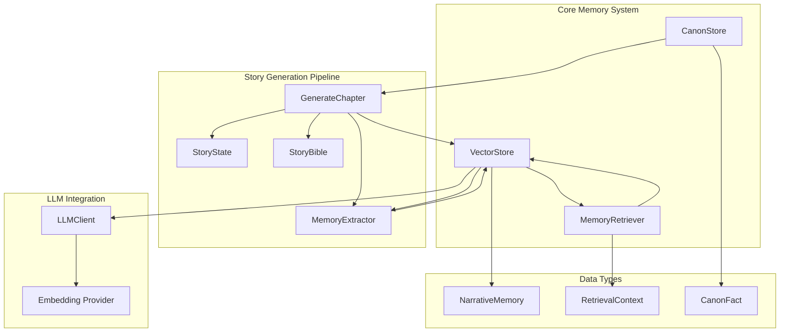
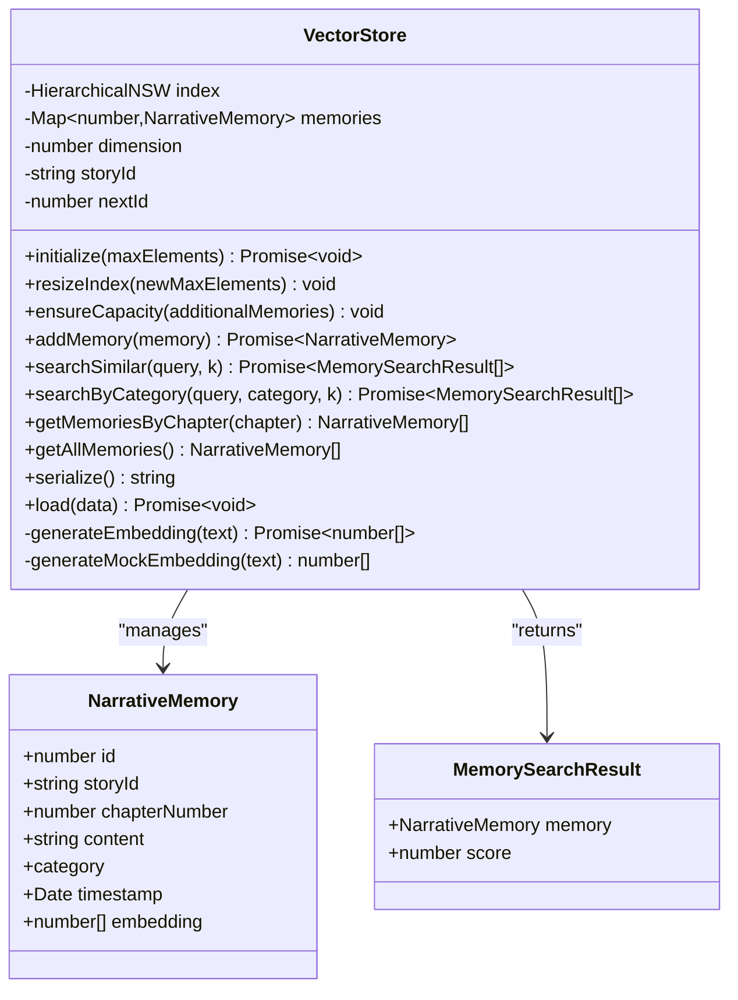
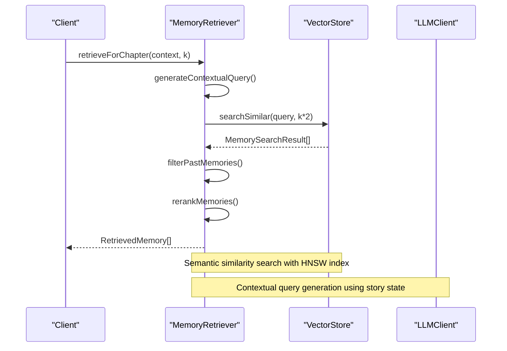
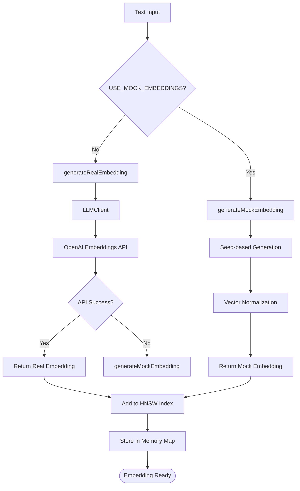
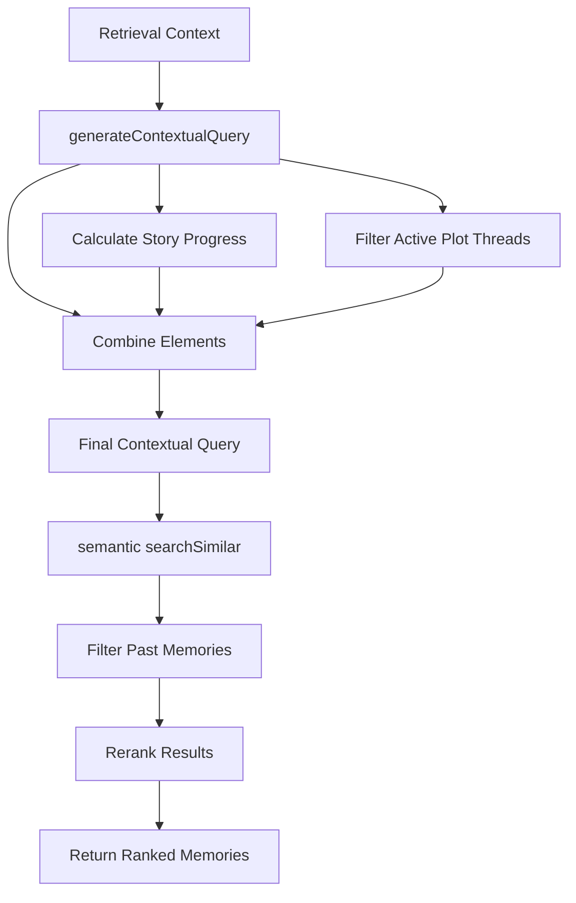
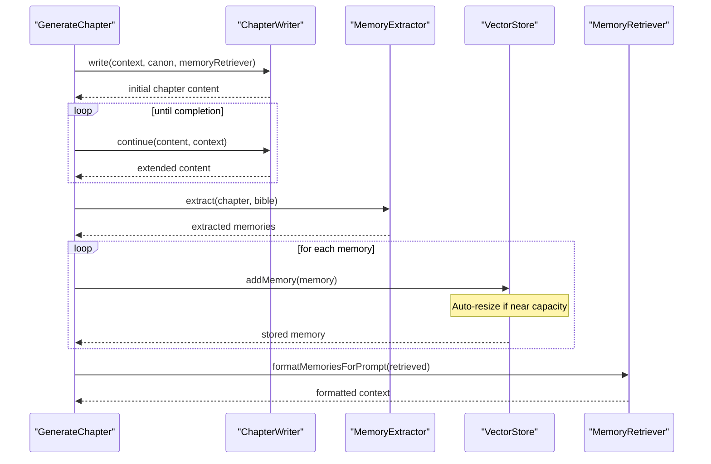
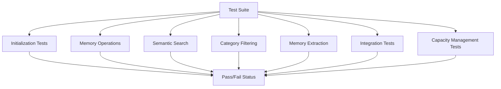

# Vector Memory System

<cite>
**Referenced Files in This Document**
- [vectorStore.ts](file://packages/engine/src/memory/vectorStore.ts)
- [canonStore.ts](file://packages/engine/src/memory/canonStore.ts)
- [memoryRetriever.ts](file://packages/engine/src/memory/memoryRetriever.ts)
- [vector-memory.test.ts](file://packages/engine/src/test/vector-memory.test.ts)
- [index.ts](file://packages/engine/src/index.ts)
- [types/index.ts](file://packages/engine/src/types/index.ts)
- [memoryExtractor.ts](file://packages/engine/src/agents/memoryExtractor.ts)
- [generateChapter.ts](file://packages/engine/src/pipeline/generateChapter.ts)
- [client.ts](file://packages/engine/src/llm/client.ts)
- [bible.ts](file://packages/engine/src/story/bible.ts)
- [state.ts](file://packages/engine/src/story/state.ts)
- [package.json](file://packages/engine/package.json)
</cite>

## Update Summary
**Changes Made**
- Added comprehensive documentation for dynamic index resizing capabilities
- Updated Vector Storage Implementation section to cover new resizeIndex() and ensureCapacity() methods
- Enhanced Performance Considerations section with capacity management strategies
- Added new subsection on Dynamic Capacity Management
- Updated code examples and diagrams to reflect automatic resizing behavior

## Table of Contents
1. [Introduction](#introduction)
2. [System Architecture](#system-architecture)
3. [Core Components](#core-components)
4. [Vector Storage Implementation](#vector-storage-implementation)
5. [Memory Retrieval System](#memory-retrieval-system)
6. [Canonical Memory Management](#canonical-memory-management)
7. [Integration with Story Generation Pipeline](#integration-with-story-generation-pipeline)
8. [Performance Considerations](#performance-considerations)
9. [Testing and Validation](#testing-and-validation)
10. [Conclusion](#conclusion)

## Introduction

The Vector Memory System is a sophisticated narrative memory management framework designed for automated story generation. It combines semantic vector search with structured memory categorization to enable intelligent recall of past story events, character development, world-building details, and plot progression. This system serves as the foundation for maintaining narrative consistency and coherence across multiple chapters of generated fiction.

The system operates on the principle that meaningful narrative content can be represented as high-dimensional vectors that capture semantic meaning, enabling similarity-based retrieval of relevant past experiences. By organizing memories into categories (events, characters, world, plot), the system provides both broad semantic recall and targeted categorical filtering for specific storytelling needs.

**Updated** Enhanced with dynamic index resizing capabilities that automatically expand vector store capacity as memory requirements grow, addressing scalability concerns for long-form narrative generation.

## System Architecture

The Vector Memory System follows a modular architecture with clear separation of concerns:



**Diagram sources**
- [vectorStore.ts](file://packages/engine/src/memory/vectorStore.ts#L19-L158)
- [memoryRetriever.ts](file://packages/engine/src/memory/memoryRetriever.ts#L18-L169)
- [generateChapter.ts](file://packages/engine/src/pipeline/generateChapter.ts#L26-L103)

The architecture consists of three primary layers:

1. **Storage Layer**: VectorStore manages persistent memory storage with semantic indexing and dynamic capacity management
2. **Retrieval Layer**: MemoryRetriever provides intelligent search and filtering capabilities
3. **Integration Layer**: Canonical memory management and story generation pipeline coordination

## Core Components

### VectorStore Class

The VectorStore serves as the central memory repository, implementing advanced vector similarity search using Hierarchical Navigable Small World (HNSW) indexing with dynamic capacity management.



**Diagram sources**
- [vectorStore.ts](file://packages/engine/src/memory/vectorStore.ts#L19-L158)

**Section sources**
- [vectorStore.ts](file://packages/engine/src/memory/vectorStore.ts#L1-L208)

### MemoryRetriever Class

The MemoryRetriever provides sophisticated search capabilities with contextual awareness and relevance ranking.



**Diagram sources**
- [memoryRetriever.ts](file://packages/engine/src/memory/memoryRetriever.ts#L25-L41)

**Section sources**
- [memoryRetriever.ts](file://packages/engine/src/memory/memoryRetriever.ts#L1-L174)

### CanonStore System

The CanonStore maintains canonical facts that serve as immutable truth anchors for narrative consistency.


**Diagram sources**
- [canonStore.ts](file://packages/engine/src/memory/canonStore.ts#L24-L58)

**Section sources**
- [canonStore.ts](file://packages/engine/src/memory/canonStore.ts#L1-L134)

## Vector Storage Implementation

### Dynamic Index Resizing Capabilities

The VectorStore now implements comprehensive dynamic index resizing to address scalability concerns for long-form narrative generation. The system automatically expands HNSW vector store capacity as memory requirements grow.

```mermaid
flowchart TD
AutoResize[Automatic Capacity Management] --> CheckCapacity{Check Current Capacity}
CheckCapacity --> NearCapacity{"Near Capacity Threshold?"}
NearCapacity --> |Yes| AutoResizeCall[auto-resizeIndex(1.5x)]
NearCapacity --> |No| ManualResize[Manual Resize Available]
ManualResize --> ResizeIndex[resizeIndex(newMaxElements)]
ManualResize --> EnsureCapacity[ensureCapacity(additionalMemories)]
ResizeIndex --> HNSWResize[HNSW Index Resize]
EnsureCapacity --> CalcCapacity[Calculate Required Capacity]
CalcCapacity --> GrowCapacity[Grow by 50% or Use Required]
GrowCapacity --> HNSWResize
HNSWResize --> StoreMemories[Store Memories]
StoreMemories --> Complete([Capacity Managed])
```

**Diagram sources**
- [vectorStore.ts](file://packages/engine/src/memory/vectorStore.ts#L39-L63)

**Section sources**
- [vectorStore.ts](file://packages/engine/src/memory/vectorStore.ts#L39-L63)

### Embedding Generation and Indexing

The VectorStore implements a dual-path embedding system that gracefully handles both real embeddings and mock embeddings for testing scenarios.



**Diagram sources**
- [vectorStore.ts](file://packages/engine/src/memory/vectorStore.ts#L125-L147)

The system uses a 1536-dimensional embedding space optimized for the `text-embedding-3-small` model, with HNSW indexing providing efficient similarity search capabilities.

**Section sources**
- [vectorStore.ts](file://packages/engine/src/memory/vectorStore.ts#L20-L35)
- [vectorStore.ts](file://packages/engine/src/memory/vectorStore.ts#L125-L147)

### Memory Persistence and Serialization

The VectorStore implements robust persistence mechanisms for production deployment:

- **Serialization**: Complete memory state export including story metadata, next ID counter, and all stored memories
- **Deserialization**: Full state restoration with automatic HNSW index rebuilding
- **Story Isolation**: Factory pattern ensures separate stores per story ID

**Section sources**
- [vectorStore.ts](file://packages/engine/src/memory/vectorStore.ts#L170-L192)
- [vectorStore.ts](file://packages/engine/src/memory/vectorStore.ts#L195-L208)

## Memory Retrieval System

### Contextual Query Generation

The MemoryRetriever generates sophisticated contextual queries that incorporate story progress, active plot threads, and narrative context:



**Diagram sources**
- [memoryRetriever.ts](file://packages/engine/src/memory/memoryRetriever.ts#L104-L115)

**Section sources**
- [memoryRetriever.ts](file://packages/engine/src/memory/memoryRetriever.ts#L25-L41)

### Category-Specific Retrieval

The system provides specialized retrieval methods for different narrative categories:

- **Character-focused retrieval**: Filters memories containing specific character names
- **Plot thread retrieval**: Targets memories relevant to specific plot threads
- **Event-based retrieval**: Focuses on significant narrative events

**Section sources**
- [memoryRetriever.ts](file://packages/engine/src/memory/memoryRetriever.ts#L43-L83)

## Canonical Memory Management

### Fact Organization and Management

The CanonStore organizes narrative facts into four categories with structured metadata:

```mermaid
erDiagram
CANON_STORE {
string storyId
array facts
}
CANON_FACT {
string id PK
string category
string subject
string attribute
string value
number chapterEstablished
}
CANON_STORE ||--o{ CANON_FACT : contains
note for CANON_FACT """
Categories:
- character: Character traits, backgrounds
- world: Setting details, cultural elements
- plot: Plot thread status, story mechanics
- timeline: Chronological relationships
"""
```

**Diagram sources**
- [canonStore.ts](file://packages/engine/src/memory/canonStore.ts#L3-L15)

**Section sources**
- [canonStore.ts](file://packages/engine/src/memory/canonStore.ts#L17-L99)

### Prompt Formatting

The system automatically formats canonical facts for inclusion in AI prompts with clear categorization and human-readable presentation.

**Section sources**
- [canonStore.ts](file://packages/engine/src/memory/canonStore.ts#L101-L129)

## Integration with Story Generation Pipeline

### Memory Extraction Workflow

The GenerateChapter pipeline integrates memory extraction seamlessly into the story creation process:



**Diagram sources**
- [generateChapter.ts](file://packages/engine/src/pipeline/generateChapter.ts#L26-L103)

**Section sources**
- [generateChapter.ts](file://packages/engine/src/pipeline/generateChapter.ts#L26-L98)

### Memory Retrieval During Generation

The MemoryRetriever provides contextual memory support during chapter generation by:

- Analyzing story progress and current chapter context
- Filtering memories from previous chapters only
- Ranking results by relevance to current narrative needs
- Grouping memories by category for structured presentation

**Section sources**
- [memoryRetriever.ts](file://packages/engine/src/memory/memoryRetriever.ts#L25-L41)
- [memoryRetriever.ts](file://packages/engine/src/memory/memoryRetriever.ts#L85-L102)

## Performance Considerations

### Dynamic Capacity Management

The VectorStore employs advanced capacity management strategies to ensure optimal performance during long-form narrative generation:

- **Automatic Resizing**: The `addMemory()` method automatically triggers resizing when memory usage approaches capacity thresholds
- **Proportional Growth**: Capacity increases by 50% when near capacity limits, providing balanced growth without excessive memory overhead
- **Manual Control**: Developers can use `ensureCapacity()` to pre-emptively manage capacity for planned memory additions
- **Efficient Resizing**: The `resizeIndex()` method provides direct control over index expansion with validation checks

### Vector Indexing Strategy

The VectorStore employs several optimization strategies:

- **HNSW Index**: Hierarchical Navigable Small World graph for efficient similarity search
- **Dimension Management**: Fixed 1536-dimensional embedding space for consistency
- **Memory Mapping**: Efficient in-memory storage with O(1) lookup performance
- **Batch Operations**: Optimized for bulk memory addition and retrieval
- **Capacity Monitoring**: Real-time tracking of memory usage versus index capacity

### Embedding Generation Efficiency

The system implements intelligent fallback mechanisms:

- **Mock Embeddings**: Deterministic generation for testing environments
- **API Fallback**: Automatic switching to mock embeddings when external APIs fail
- **Environment Control**: Configurable embedding generation through environment variables

**Section sources**
- [vectorStore.ts](file://packages/engine/src/memory/vectorStore.ts#L39-L63)
- [vectorStore.ts](file://packages/engine/src/memory/vectorStore.ts#L125-L147)

## Testing and Validation

### Comprehensive Test Suite

The Vector Memory System includes extensive testing covering:

- **Initialization and Persistence**: Store lifecycle management
- **Semantic Search**: Vector similarity accuracy and performance
- **Category Filtering**: Correct categorization and retrieval
- **Memory Extraction**: LLM-based memory generation quality
- **Integration Testing**: End-to-end pipeline functionality
- **Capacity Management**: Dynamic resizing and growth strategies



**Diagram sources**
- [vector-memory.test.ts](file://packages/engine/src/test/vector-memory.test.ts#L31-L174)

**Section sources**
- [vector-memory.test.ts](file://packages/engine/src/test/vector-memory.test.ts#L1-L185)

### Test Configuration and Environment

The testing framework supports flexible configuration through environment variables and local configuration files, enabling testing across different LLM providers and embedding configurations.

**Section sources**
- [vector-memory.test.ts](file://packages/engine/src/test/vector-memory.test.ts#L5-L17)

## Conclusion

The Vector Memory System represents a sophisticated approach to narrative memory management, combining advanced vector similarity search with structured canonical fact management and dynamic capacity management. Its modular architecture enables seamless integration into larger story generation systems while maintaining flexibility for various use cases.

Key strengths of the system include:

- **Robust Vector Indexing**: Efficient similarity search using HNSW with configurable parameters
- **Dynamic Capacity Management**: Automatic resizing capabilities that scale with memory requirements
- **Flexible Embedding Generation**: Support for both real embeddings and deterministic mocks
- **Structured Memory Organization**: Clear categorization enabling targeted retrieval
- **Production-Ready Persistence**: Complete serialization and deserialization capabilities
- **Comprehensive Testing**: Extensive test coverage ensuring reliability and correctness

The system's design supports both research and production deployment scenarios, with clear pathways for customization and extension. The addition of dynamic index resizing capabilities significantly enhances scalability for long-form narrative generation, making it suitable for extended story arcs and complex narrative structures.

Future enhancements could include advanced query expansion, multi-modal memory types, distributed storage capabilities, and more sophisticated capacity prediction algorithms for optimal resource utilization.