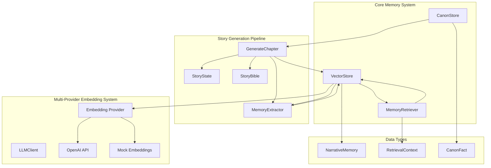
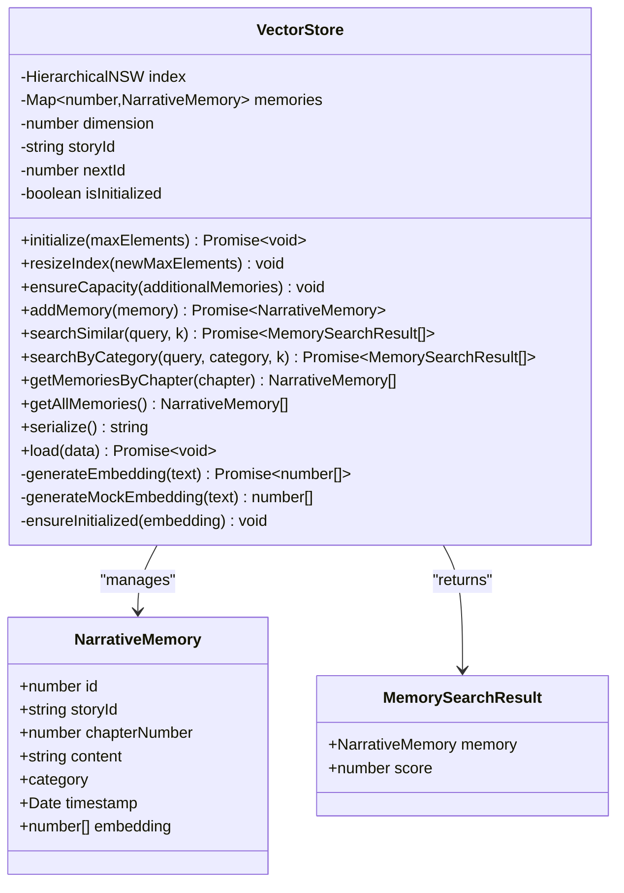
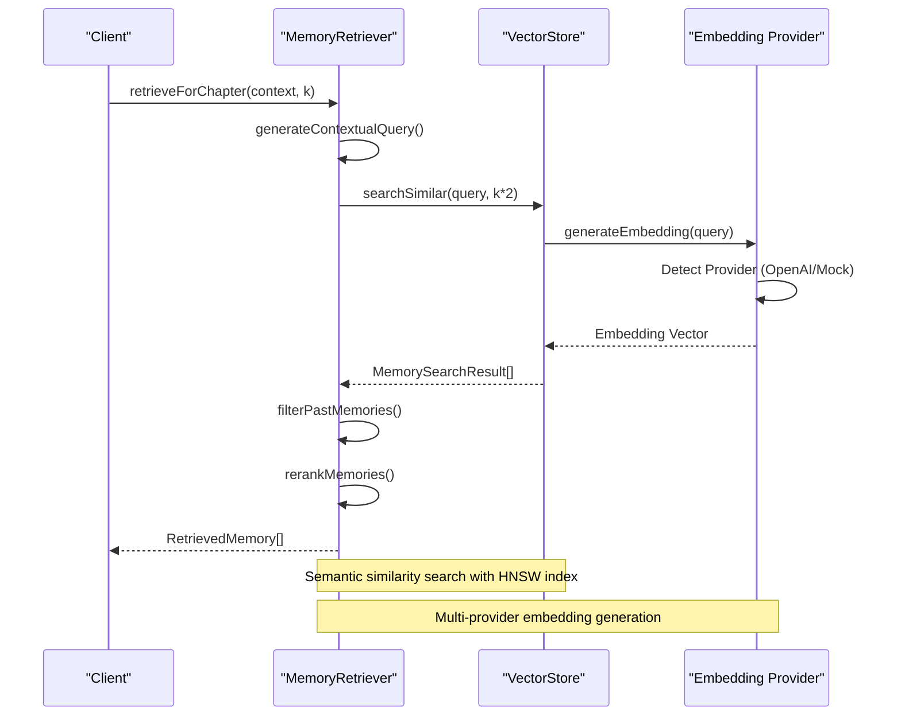
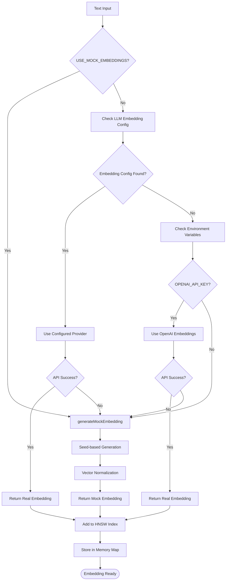
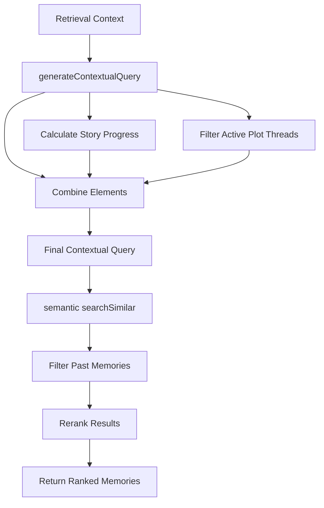
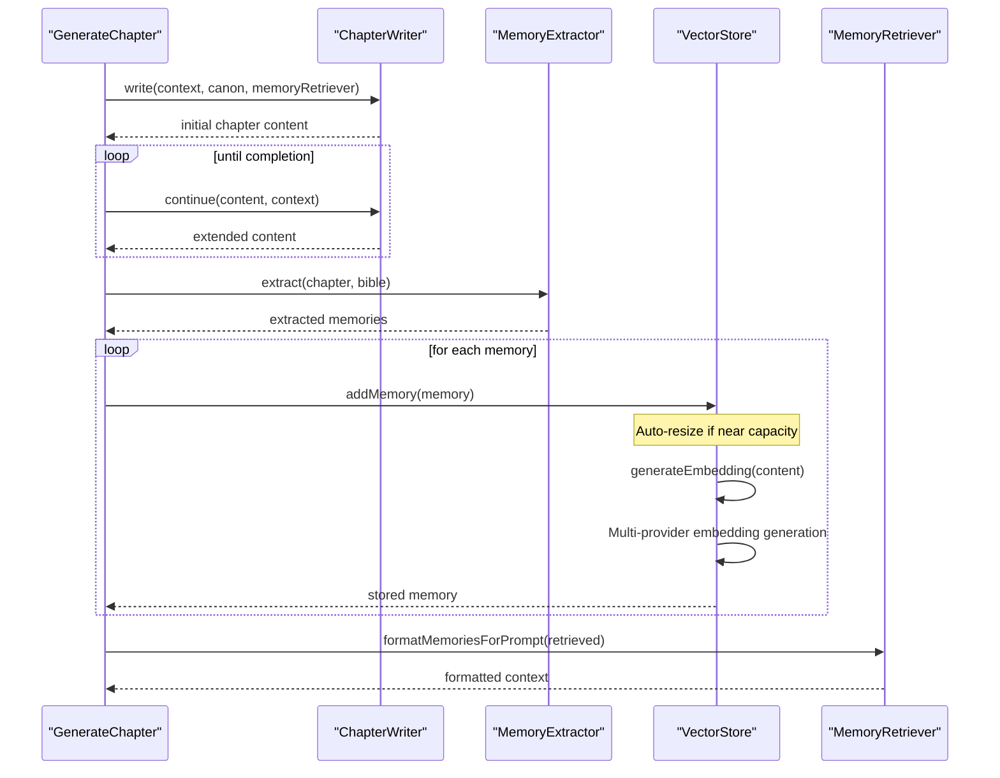
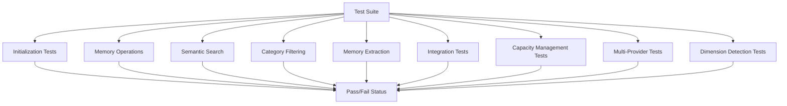

# Vector Memory System

<cite>
**Referenced Files in This Document**
- [vectorStore.ts](file://packages/engine/src/memory/vectorStore.ts)
- [canonStore.ts](file://packages/engine/src/memory/canonStore.ts)
- [memoryRetriever.ts](file://packages/engine/src/memory/memoryRetriever.ts)
- [vector-memory.test.ts](file://packages/engine/src/test/vector-memory.test.ts)
- [index.ts](file://packages/engine/src/index.ts)
- [types/index.ts](file://packages/engine/src/types/index.ts)
- [memoryExtractor.ts](file://packages/engine/src/agents/memoryExtractor.ts)
- [generateChapter.ts](file://packages/engine/src/pipeline/generateChapter.ts)
- [client.ts](file://packages/engine/src/llm/client.ts)
- [bible.ts](file://packages/engine/src/story/bible.ts)
- [state.ts](file://packages/engine/src/story/state.ts)
- [package.json](file://packages/engine/package.json)
</cite>

## Update Summary
**Changes Made**
- Enhanced embedding provider system with comprehensive OpenAI embeddings integration
- Added intelligent dimension detection that automatically adapts to embedding provider dimensions
- Implemented improved initialization process with delayed index creation until first embedding
- Enhanced capacity management for handling variable-length embeddings from different providers
- Added mock embedding fallback mechanisms for testing scenarios
- Implemented provider detection through LLM client configuration system
- Improved error handling with graceful degradation from real embeddings to mock embeddings
- Updated Vector Storage Implementation section to cover new embedding provider architecture
- Enhanced Performance Considerations section with multi-provider capacity management strategies
- Added new subsection on Multi-Provider Embedding Architecture

## Table of Contents
1. [Introduction](#introduction)
2. [System Architecture](#system-architecture)
3. [Core Components](#core-components)
4. [Vector Storage Implementation](#vector-storage-implementation)
5. [Memory Retrieval System](#memory-retrieval-system)
6. [Canonical Memory Management](#canonical-memory-management)
7. [Integration with Story Generation Pipeline](#integration-with-story-generation-pipeline)
8. [Performance Considerations](#performance-considerations)
9. [Testing and Validation](#testing-and-validation)
10. [Conclusion](#conclusion)

## Introduction

The Vector Memory System is a sophisticated narrative memory management framework designed for automated story generation. It combines semantic vector search with structured memory categorization to enable intelligent recall of past story events, character development, world-building details, and plot progression. This system serves as the foundation for maintaining narrative consistency and coherence across multiple chapters of generated fiction.

The system operates on the principle that meaningful narrative content can be represented as high-dimensional vectors that capture semantic meaning, enabling similarity-based retrieval of relevant past experiences. By organizing memories into categories (events, characters, world, plot), the system provides both broad semantic recall and targeted categorical filtering for specific storytelling needs.

**Updated** Enhanced with comprehensive multi-provider AI embedding support that automatically detects and switches between OpenAI and DeepSeek APIs based on available credentials, providing robust fallback mechanisms and improved reliability for long-form narrative generation. The system now features intelligent dimension detection that adapts to different embedding provider outputs and enhanced initialization processes for optimal performance.

## System Architecture

The Vector Memory System follows a modular architecture with clear separation of concerns and enhanced embedding provider flexibility:



**Diagram sources**
- [vectorStore.ts:19-161](file://packages/engine/src/memory/vectorStore.ts#L19-L161)
- [memoryRetriever.ts:18-169](file://packages/engine/src/memory/memoryRetriever.ts#L18-L169)
- [generateChapter.ts:26-103](file://packages/engine/src/pipeline/generateChapter.ts#L26-L103)

The architecture consists of three primary layers with enhanced embedding provider flexibility:

1. **Storage Layer**: VectorStore manages persistent memory storage with semantic indexing and dynamic capacity management
2. **Retrieval Layer**: MemoryRetriever provides intelligent search and filtering capabilities with multi-provider embedding support
3. **Integration Layer**: Canonical memory management and story generation pipeline coordination with flexible embedding providers

## Core Components

### VectorStore Class

The VectorStore serves as the central memory repository, implementing advanced vector similarity search using Hierarchical Navigable Small World (HNSW) indexing with dynamic capacity management and multi-provider embedding support.



**Diagram sources**
- [vectorStore.ts:19-161](file://packages/engine/src/memory/vectorStore.ts#L19-L161)

**Section sources**
- [vectorStore.ts:1-258](file://packages/engine/src/memory/vectorStore.ts#L1-L258)

### MemoryRetriever Class

The MemoryRetriever provides sophisticated search capabilities with contextual awareness and relevance ranking, now supporting multi-provider embedding generation.



**Diagram sources**
- [memoryRetriever.ts:25-41](file://packages/engine/src/memory/memoryRetriever.ts#L25-L41)

**Section sources**
- [memoryRetriever.ts:1-174](file://packages/engine/src/memory/memoryRetriever.ts#L1-L174)

### CanonStore System

The CanonStore maintains canonical facts that serve as immutable truth anchors for narrative consistency.


**Diagram sources**
- [canonStore.ts:24-58](file://packages/engine/src/memory/canonStore.ts#L24-L58)

**Section sources**
- [canonStore.ts:1-134](file://packages/engine/src/memory/canonStore.ts#L1-L134)

## Vector Storage Implementation

### Intelligent Dimension Detection and Dynamic Initialization

The VectorStore now implements a revolutionary intelligent dimension detection system that automatically adapts to different embedding provider outputs. The system delays index creation until the first embedding is processed, allowing it to detect the exact dimensionality of the embedding vectors produced by the chosen provider.


**Diagram sources**
- [vectorStore.ts:31-46](file://packages/engine/src/memory/vectorStore.ts#L31-L46)
- [vectorStore.ts:145-198](file://packages/engine/src/memory/vectorStore.ts#L145-L198)

**Section sources**
- [vectorStore.ts:31-46](file://packages/engine/src/memory/vectorStore.ts#L31-L46)
- [vectorStore.ts:145-198](file://packages/engine/src/memory/vectorStore.ts#L145-L198)

### Comprehensive Embedding Provider Architecture

The VectorStore now implements a sophisticated multi-provider embedding system that automatically detects and utilizes the most appropriate embedding service based on available credentials and configuration. The system prioritizes real embeddings from configured providers with graceful fallback to mock embeddings.



**Diagram sources**
- [vectorStore.ts:145-198](file://packages/engine/src/memory/vectorStore.ts#L145-L198)

**Section sources**
- [vectorStore.ts:145-198](file://packages/engine/src/memory/vectorStore.ts#L145-L198)

### Enhanced Embedding Generation and Indexing

The VectorStore implements a robust multi-provider embedding system that gracefully handles different AI services and provides comprehensive fallback mechanisms:

- **Configured Provider Detection**: Uses LLM client's embedding configuration when available
- **OpenAI Embeddings**: Uses `text-embedding-3-small` model when OpenAI API key is available
- **Environment-Based Configuration**: Falls back to environment variables for API key detection
- **Mock Embeddings**: Deterministic generation for testing without external API dependencies
- **Automatic Fallback**: Graceful degradation from real embeddings to mock embeddings when APIs fail
- **Error Handling**: Comprehensive error catching with logging and fallback mechanisms
- **Intelligent Dimension Detection**: Automatically detects embedding dimension from first embedding
- **Dynamic Index Creation**: Creates HNSW index with correct dimension after first embedding

The system now supports variable-length embeddings from different providers, with the dimension determined dynamically rather than being hardcoded. This allows seamless integration with various embedding providers while maintaining optimal performance characteristics.

**Section sources**
- [vectorStore.ts:20-35](file://packages/engine/src/memory/vectorStore.ts#L20-L35)
- [vectorStore.ts:145-198](file://packages/engine/src/memory/vectorStore.ts#L145-L198)

### Dynamic Index Resizing Capabilities

The VectorStore now implements comprehensive dynamic index resizing to address scalability concerns for long-form narrative generation. The system automatically expands HNSW vector store capacity as memory requirements grow.

```mermaid
flowchart TD
AutoResize[Automatic Capacity Management] --> CheckCapacity{Check Current Capacity}
CheckCapacity --> NearCapacity{"Near Capacity Threshold?"}
NearCapacity --> |Yes| AutoResizeCall[auto-resizeIndex(1.5x)]
NearCapacity --> |No| ManualResize[Manual Resize Available]
ManualResize --> ResizeIndex[resizeIndex(newMaxElements)]
ManualResize --> EnsureCapacity[ensureCapacity(additionalMemories)]
ResizeIndex --> HNSWResize[HNSW Index Resize]
EnsureCapacity --> CalcCapacity[Calculate Required Capacity]
CalcCapacity --> GrowCapacity[Grow by 50% or Use Required]
GrowCapacity --> HNSWResize
HNSWResize --> StoreMemories[Store Memories]
StoreMemories --> Complete([Capacity Managed])
```

**Diagram sources**
- [vectorStore.ts:48-75](file://packages/engine/src/memory/vectorStore.ts#L48-L75)

**Section sources**
- [vectorStore.ts:48-75](file://packages/engine/src/memory/vectorStore.ts#L48-L75)

### Memory Persistence and Serialization

The VectorStore implements robust persistence mechanisms for production deployment:

- **Serialization**: Complete memory state export including story metadata, next ID counter, and all stored memories
- **Deserialization**: Full state restoration with automatic HNSW index rebuilding using detected dimensions
- **Story Isolation**: Factory pattern ensures separate stores per story ID

**Section sources**
- [vectorStore.ts:220-242](file://packages/engine/src/memory/vectorStore.ts#L220-L242)

## Memory Retrieval System

### Contextual Query Generation

The MemoryRetriever generates sophisticated contextual queries that incorporate story progress, active plot threads, and narrative context:



**Diagram sources**
- [memoryRetriever.ts:104-115](file://packages/engine/src/memory/memoryRetriever.ts#L104-L115)

**Section sources**
- [memoryRetriever.ts:25-41](file://packages/engine/src/memory/memoryRetriever.ts#L25-L41)

### Category-Specific Retrieval

The system provides specialized retrieval methods for different narrative categories:

- **Character-focused retrieval**: Filters memories containing specific character names
- **Plot thread retrieval**: Targets memories relevant to specific plot threads
- **Event-based retrieval**: Focuses on significant narrative events

**Section sources**
- [memoryRetriever.ts:43-83](file://packages/engine/src/memory/memoryRetriever.ts#L43-L83)

## Canonical Memory Management

### Fact Organization and Management

The CanonStore organizes narrative facts into four categories with structured metadata:

```mermaid
erDiagram
CANON_STORE {
string storyId
array facts
}
CANON_FACT {
string id PK
string category
string subject
string attribute
string value
number chapterEstablished
}
CANON_STORE ||--o{ CANON_FACT : contains
note for CANON_FACT """
Categories:
- character: Character traits, backgrounds
- world: Setting details, cultural elements
- plot: Plot thread status, story mechanics
- timeline: Chronological relationships
"""
```

**Diagram sources**
- [canonStore.ts:3-15](file://packages/engine/src/memory/canonStore.ts#L3-L15)

**Section sources**
- [canonStore.ts:17-99](file://packages/engine/src/memory/canonStore.ts#L17-L99)

### Prompt Formatting

The system automatically formats canonical facts for inclusion in AI prompts with clear categorization and human-readable presentation.

**Section sources**
- [canonStore.ts:101-129](file://packages/engine/src/memory/canonStore.ts#L101-L129)

## Integration with Story Generation Pipeline

### Memory Extraction Workflow

The GenerateChapter pipeline integrates memory extraction seamlessly into the story creation process:



**Diagram sources**
- [generateChapter.ts:26-103](file://packages/engine/src/pipeline/generateChapter.ts#L26-L103)

**Section sources**
- [generateChapter.ts:26-98](file://packages/engine/src/pipeline/generateChapter.ts#L26-L98)

### Memory Retrieval During Generation

The MemoryRetriever provides contextual memory support during chapter generation by:

- Analyzing story progress and current chapter context
- Filtering memories from previous chapters only
- Ranking results by relevance to current narrative needs
- Grouping memories by category for structured presentation

**Section sources**
- [memoryRetriever.ts:25-41](file://packages/engine/src/memory/memoryRetriever.ts#L25-L41)
- [memoryRetriever.ts:85-102](file://packages/engine/src/memory/memoryRetriever.ts#L85-L102)

## Performance Considerations

### Multi-Provider Embedding Architecture

The VectorStore employs advanced multi-provider embedding strategies to ensure optimal performance and reliability:

- **Automatic Provider Detection**: The system automatically detects available API keys and selects the most appropriate embedding provider
- **Graceful Degradation**: Real embeddings are used when available, with automatic fallback to mock embeddings when APIs fail
- **Provider Priority**: Configured providers take precedence over environment-based detection
- **Environment-Based Configuration**: Flexible configuration through environment variables for different deployment scenarios
- **Intelligent Dimension Detection**: Automatically adapts to embedding provider dimensions for optimal performance

### Dynamic Capacity Management

The VectorStore employs advanced capacity management strategies to ensure optimal performance during long-form narrative generation:

- **Automatic Resizing**: The `addMemory()` method automatically triggers resizing when memory usage approaches capacity thresholds
- **Proportional Growth**: Capacity increases by 50% when near capacity limits, providing balanced growth without excessive memory overhead
- **Manual Control**: Developers can use `ensureCapacity()` to pre-emptively manage capacity for planned memory additions
- **Efficient Resizing**: The `resizeIndex()` method provides direct control over index expansion with validation checks

### Vector Indexing Strategy

The VectorStore employs several optimization strategies:

- **HNSW Index**: Hierarchical Navigable Small World graph for efficient similarity search
- **Dynamic Dimension Management**: Variable embedding dimensions based on provider output
- **Memory Mapping**: Efficient in-memory storage with O(1) lookup performance
- **Batch Operations**: Optimized for bulk memory addition and retrieval
- **Capacity Monitoring**: Real-time tracking of memory usage versus index capacity

### Enhanced Embedding Generation Efficiency

The system implements intelligent multi-provider fallback mechanisms:

- **Mock Embeddings**: Deterministic generation for testing environments without external API dependencies
- **API Fallback**: Automatic switching to mock embeddings when external APIs fail or are unavailable
- **Environment Control**: Configurable embedding generation through environment variables
- **Provider Priority**: Automatic selection of configured providers over environment variables
- **Intelligent Dimension Adaptation**: Automatic adjustment to embedding provider output dimensions

**Section sources**
- [vectorStore.ts:48-75](file://packages/engine/src/memory/vectorStore.ts#L48-L75)
- [vectorStore.ts:145-198](file://packages/engine/src/memory/vectorStore.ts#L145-L198)

## Testing and Validation

### Comprehensive Test Suite

The Vector Memory System includes extensive testing covering:

- **Initialization and Persistence**: Store lifecycle management with dynamic dimension detection
- **Semantic Search**: Vector similarity accuracy and performance with multi-provider embeddings
- **Category Filtering**: Correct categorization and retrieval
- **Memory Extraction**: LLM-based memory generation quality
- **Integration Testing**: End-to-end pipeline functionality
- **Capacity Management**: Dynamic resizing and growth strategies
- **Multi-Provider Testing**: Embedding provider switching and fallback mechanisms
- **Dimension Detection Testing**: Variable embedding dimension handling



**Diagram sources**
- [vector-memory.test.ts:31-174](file://packages/engine/src/test/vector-memory.test.ts#L31-L174)

**Section sources**
- [vector-memory.test.ts:1-266](file://packages/engine/src/test/vector-memory.test.ts#L1-L266)

### Test Configuration and Environment

The testing framework supports flexible configuration through environment variables and local configuration files, enabling testing across different LLM providers and embedding configurations. The system automatically detects provider availability and adjusts test execution accordingly.

**Section sources**
- [vector-memory.test.ts:5-17](file://packages/engine/src/test/vector-memory.test.ts#L5-L17)

## Conclusion

The Vector Memory System represents a sophisticated approach to narrative memory management, combining advanced vector similarity search with structured canonical fact management, dynamic capacity management, and comprehensive multi-provider embedding support. Its modular architecture enables seamless integration into larger story generation systems while maintaining flexibility for various use cases and deployment scenarios.

Key strengths of the system include:

- **Robust Multi-Provider Embedding**: Automatic detection and utilization of configured embedding providers with graceful fallback to mock embeddings
- **Intelligent Dimension Detection**: Automatic adaptation to embedding provider dimensions for optimal performance
- **Dynamic Provider Selection**: Intelligent credential-based provider selection with automatic API failure handling
- **Advanced Vector Indexing**: Efficient similarity search using HNSW with configurable parameters
- **Dynamic Capacity Management**: Automatic resizing capabilities that scale with memory requirements
- **Flexible Embedding Generation**: Support for both real embeddings and deterministic mocks
- **Structured Memory Organization**: Clear categorization enabling targeted retrieval
- **Production-Ready Persistence**: Complete serialization and deserialization capabilities
- **Comprehensive Testing**: Extensive test coverage ensuring reliability and correctness across multiple embedding providers
- **Variable-Length Embedding Support**: Seamless handling of different embedding dimensions from various providers

The system's design supports both research and production deployment scenarios, with clear pathways for customization and extension. The addition of comprehensive embedding system integration significantly enhances reliability and accessibility for long-form narrative generation, making it suitable for extended story arcs and complex narrative structures across different AI service providers.

Future enhancements could include advanced query expansion, multi-modal memory types, distributed storage capabilities, more sophisticated capacity prediction algorithms for optimal resource utilization, and expanded support for additional AI embedding providers.