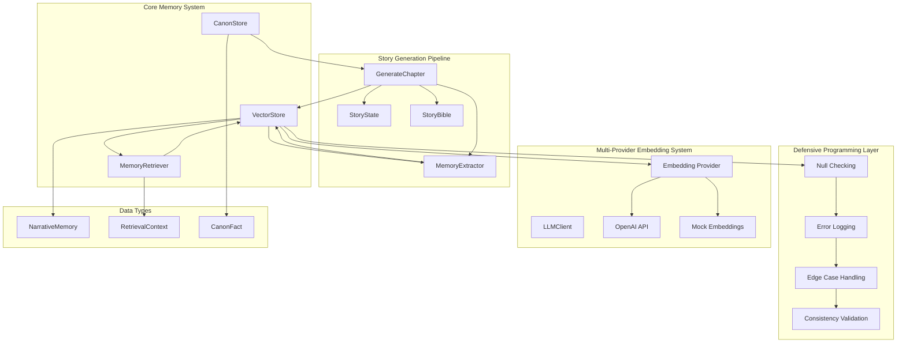
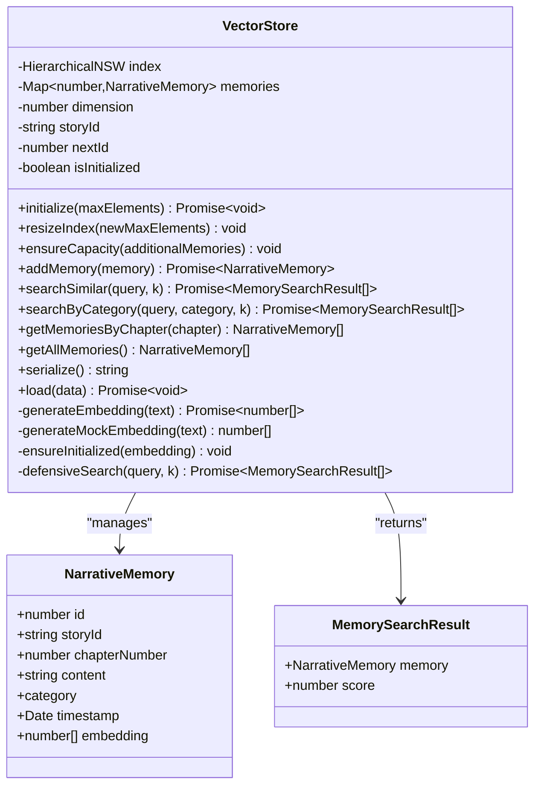
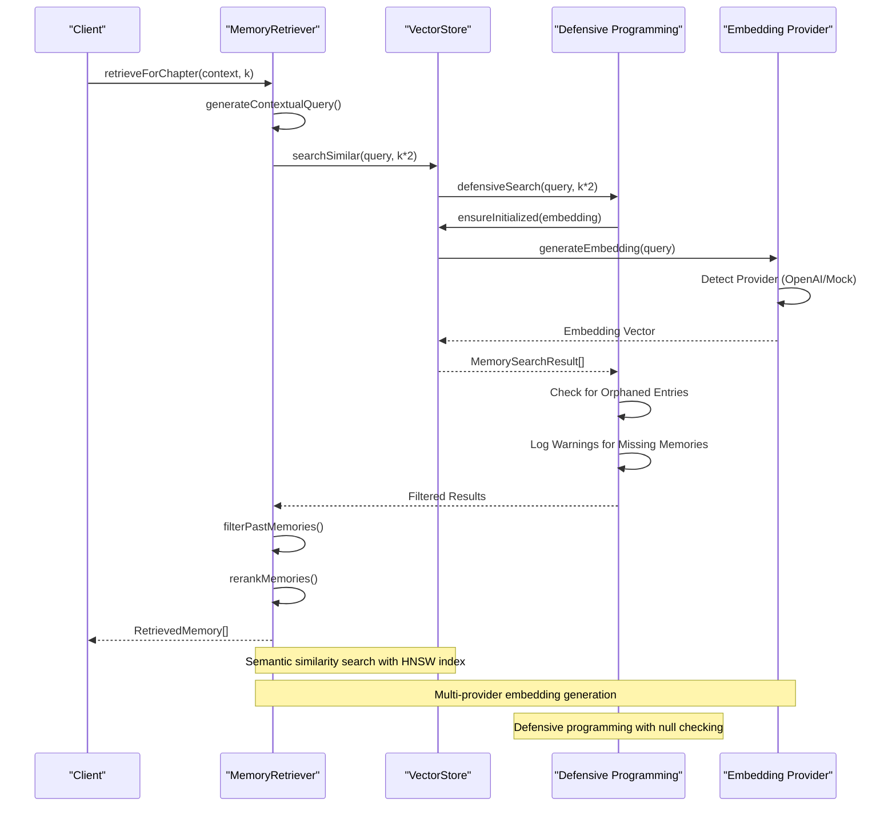
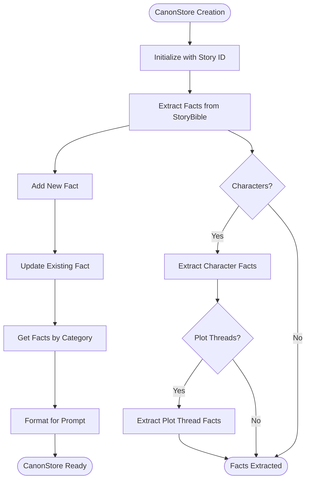
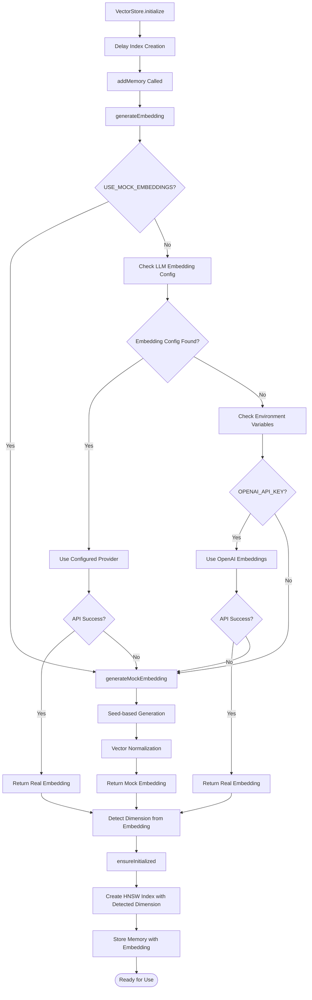
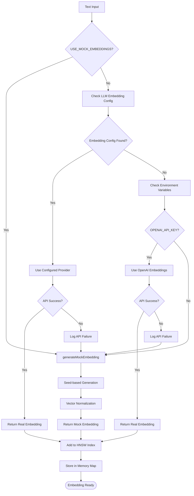
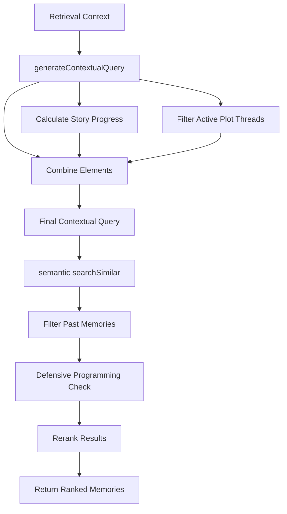
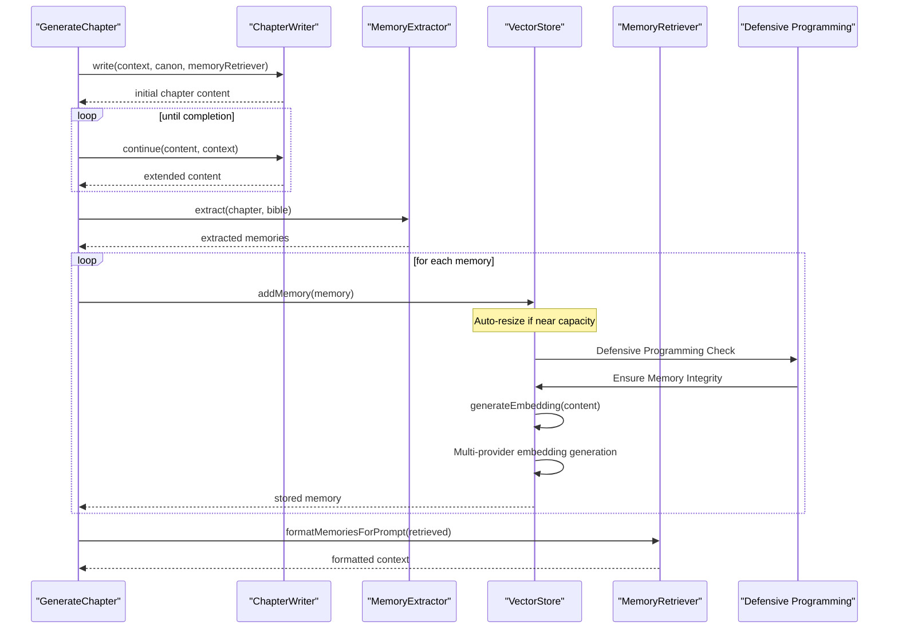
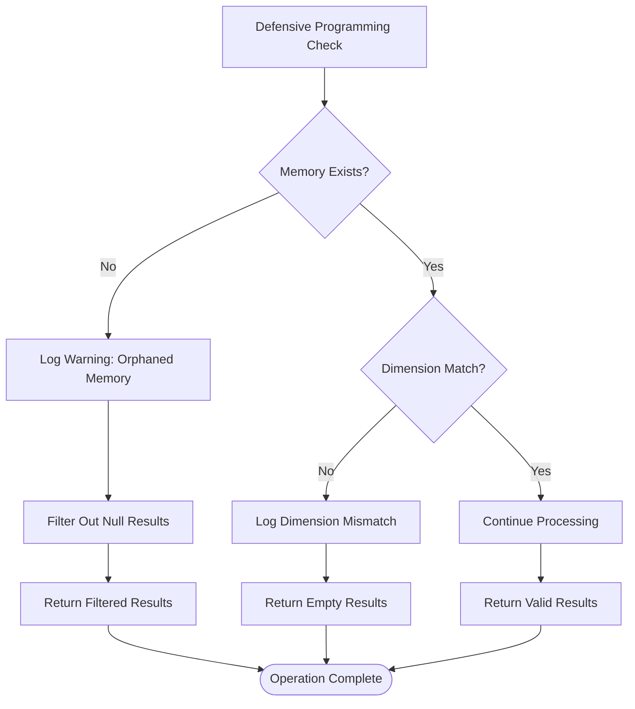
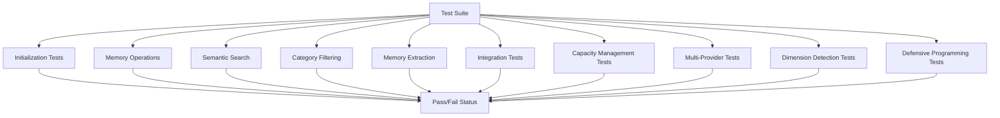

# Vector Memory System

<cite>
**Referenced Files in This Document**
- [vectorStore.ts](file://packages/engine/src/memory/vectorStore.ts)
- [canonStore.ts](file://packages/engine/src/memory/canonStore.ts)
- [memoryRetriever.ts](file://packages/engine/src/memory/memoryRetriever.ts)
- [vector-memory.test.ts](file://packages/engine/src/test/vector-memory.test.ts)
- [index.ts](file://packages/engine/src/index.ts)
- [types/index.ts](file://packages/engine/src/types/index.ts)
- [memoryExtractor.ts](file://packages/engine/src/agents/memoryExtractor.ts)
- [generateChapter.ts](file://packages/engine/src/pipeline/generateChapter.ts)
- [client.ts](file://packages/engine/src/llm/client.ts)
- [bible.ts](file://packages/engine/src/story/bible.ts)
- [state.ts](file://packages/engine/src/story/state.ts)
- [package.json](file://packages/engine/package.json)
</cite>

## Update Summary
**Changes Made**
- Enhanced defensive programming with comprehensive null checking and error logging for orphaned memory entries
- Improved runtime stability during edge cases with graceful error handling mechanisms
- Added robust error logging for embedding API failures and dimension mismatches
- Implemented enhanced orphaned memory detection and cleanup procedures
- Strengthened error handling in vector similarity search operations
- Added comprehensive logging for memory consistency validation

## Table of Contents
1. [Introduction](#introduction)
2. [System Architecture](#system-architecture)
3. [Core Components](#core-components)
4. [Vector Storage Implementation](#vector-storage-implementation)
5. [Memory Retrieval System](#memory-retrieval-system)
6. [Canonical Memory Management](#canonical-memory-management)
7. [Integration with Story Generation Pipeline](#integration-with-story-generation-pipeline)
8. [Performance Considerations](#performance-considerations)
9. [Defensive Programming Enhancements](#defensive-programming-enhancements)
10. [Testing and Validation](#testing-and-validation)
11. [Conclusion](#conclusion)

## Introduction

The Vector Memory System is a sophisticated narrative memory management framework designed for automated story generation. It combines semantic vector search with structured memory categorization to enable intelligent recall of past story events, character development, world-building details, and plot progression. This system serves as the foundation for maintaining narrative consistency and coherence across multiple chapters of generated fiction.

The system operates on the principle that meaningful narrative content can be represented as high-dimensional vectors that capture semantic meaning, enabling similarity-based retrieval of relevant past experiences. By organizing memories into categories (events, characters, world, plot), the system provides both broad semantic recall and targeted categorical filtering for specific storytelling needs.

**Updated** Enhanced with comprehensive defensive programming measures including null checking, error logging for orphaned memory entries, and improved runtime stability during edge cases. The system now features robust error handling mechanisms that gracefully handle embedding API failures, dimension mismatches, and memory consistency issues, significantly improving reliability for long-form narrative generation.

## System Architecture

The Vector Memory System follows a modular architecture with clear separation of concerns and enhanced defensive programming capabilities:



**Diagram sources**
- [vectorStore.ts:19-161](file://packages/engine/src/memory/vectorStore.ts#L19-L161)
- [memoryRetriever.ts:18-169](file://packages/engine/src/memory/memoryRetriever.ts#L18-L169)
- [generateChapter.ts:26-103](file://packages/engine/src/pipeline/generateChapter.ts#L26-L103)

The architecture consists of three primary layers with enhanced defensive programming capabilities:

1. **Storage Layer**: VectorStore manages persistent memory storage with semantic indexing, dynamic capacity management, and comprehensive error handling
2. **Retrieval Layer**: MemoryRetriever provides intelligent search and filtering capabilities with robust null checking and graceful error recovery
3. **Integration Layer**: Canonical memory management and story generation pipeline coordination with defensive programming safeguards

## Core Components

### VectorStore Class

The VectorStore serves as the central memory repository, implementing advanced vector similarity search using Hierarchical Navigable Small World (HNSW) indexing with dynamic capacity management, multi-provider embedding support, and comprehensive defensive programming measures.



**Diagram sources**
- [vectorStore.ts:19-161](file://packages/engine/src/memory/vectorStore.ts#L19-L161)

**Section sources**
- [vectorStore.ts:1-271](file://packages/engine/src/memory/vectorStore.ts#L1-L271)

### MemoryRetriever Class

The MemoryRetriever provides sophisticated search capabilities with contextual awareness, relevance ranking, and comprehensive defensive programming measures for handling edge cases and orphaned memory entries.



**Diagram sources**
- [memoryRetriever.ts:25-41](file://packages/engine/src/memory/memoryRetriever.ts#L25-L41)

**Section sources**
- [memoryRetriever.ts:1-174](file://packages/engine/src/memory/memoryRetriever.ts#L1-L174)

### CanonStore System

The CanonStore maintains canonical facts that serve as immutable truth anchors for narrative consistency, with enhanced error handling for extraction operations.



**Diagram sources**
- [canonStore.ts:24-58](file://packages/engine/src/memory/canonStore.ts#L24-L58)

**Section sources**
- [canonStore.ts:1-304](file://packages/engine/src/memory/canonStore.ts#L1-L304)

## Vector Storage Implementation

### Intelligent Dimension Detection and Dynamic Initialization

The VectorStore now implements a revolutionary intelligent dimension detection system that automatically adapts to different embedding provider outputs. The system delays index creation until the first embedding is processed, allowing it to detect the exact dimensionality of the embedding vectors produced by the chosen provider.



**Diagram sources**
- [vectorStore.ts:31-46](file://packages/engine/src/memory/vectorStore.ts#L31-L46)
- [vectorStore.ts:145-198](file://packages/engine/src/memory/vectorStore.ts#L145-L198)

**Section sources**
- [vectorStore.ts:31-46](file://packages/engine/src/memory/vectorStore.ts#L31-L46)
- [vectorStore.ts:145-198](file://packages/engine/src/memory/vectorStore.ts#L145-L198)

### Comprehensive Embedding Provider Architecture

The VectorStore now implements a sophisticated multi-provider embedding system that automatically detects and utilizes the most appropriate embedding service based on available credentials and configuration. The system prioritizes real embeddings from configured providers with graceful fallback to mock embeddings and comprehensive error logging.



**Diagram sources**
- [vectorStore.ts:145-198](file://packages/engine/src/memory/vectorStore.ts#L145-L198)

**Section sources**
- [vectorStore.ts:145-198](file://packages/engine/src/memory/vectorStore.ts#L145-L198)

### Enhanced Embedding Generation and Indexing

The VectorStore implements a robust multi-provider embedding system that gracefully handles different AI services and provides comprehensive fallback mechanisms with enhanced error logging:

- **Configured Provider Detection**: Uses LLM client's embedding configuration when available
- **OpenAI Embeddings**: Uses `text-embedding-3-small` model when OpenAI API key is available
- **Environment-Based Configuration**: Falls back to environment variables for API key detection
- **Mock Embeddings**: Deterministic generation for testing without external API dependencies
- **Automatic Fallback**: Graceful degradation from real embeddings to mock embeddings when APIs fail
- **Enhanced Error Handling**: Comprehensive error catching with detailed logging and fallback mechanisms
- **Intelligent Dimension Detection**: Automatically detects embedding dimension from first embedding
- **Dynamic Index Creation**: Creates HNSW index with correct dimension after first embedding
- **Defensive Programming**: Null checking and orphaned memory detection for runtime stability

The system now supports variable-length embeddings from different providers, with the dimension determined dynamically rather than being hardcoded. This allows seamless integration with various embedding providers while maintaining optimal performance characteristics.

**Section sources**
- [vectorStore.ts:20-35](file://packages/engine/src/memory/vectorStore.ts#L20-L35)
- [vectorStore.ts:145-198](file://packages/engine/src/memory/vectorStore.ts#L145-L198)

### Dynamic Index Resizing Capabilities

The VectorStore now implements comprehensive dynamic index resizing to address scalability concerns for long-form narrative generation. The system automatically expands HNSW vector store capacity as memory requirements grow.

```mermaid
flowchart TD
AutoResize[Automatic Capacity Management] --> CheckCapacity{Check Current Capacity}
CheckCapacity --> NearCapacity{"Near Capacity Threshold?"}
NearCapacity --> |Yes| AutoResizeCall[auto-resizeIndex(1.5x)]
NearCapacity --> |No| ManualResize[Manual Resize Available]
ManualResize --> ResizeIndex[resizeIndex(newMaxElements)]
ManualResize --> EnsureCapacity[ensureCapacity(additionalMemories)]
ResizeIndex --> HNSWResize[HNSW Index Resize]
EnsureCapacity --> CalcCapacity[Calculate Required Capacity]
CalcCapacity --> GrowCapacity[Grow by 50% or Use Required]
GrowCapacity --> HNSWResize
HNSWResize --> StoreMemories[Store Memories]
StoreMemories --> Complete([Capacity Managed])
```

**Diagram sources**
- [vectorStore.ts:48-75](file://packages/engine/src/memory/vectorStore.ts#L48-L75)

**Section sources**
- [vectorStore.ts:48-75](file://packages/engine/src/memory/vectorStore.ts#L48-L75)

### Memory Persistence and Serialization

The VectorStore implements robust persistence mechanisms for production deployment with enhanced defensive programming:

- **Serialization**: Complete memory state export including story metadata, next ID counter, and all stored memories
- **Deserialization**: Full state restoration with automatic HNSW index rebuilding using detected dimensions
- **Story Isolation**: Factory pattern ensures separate stores per story ID
- **Consistency Validation**: Memory map integrity checks during load operations
- **Orphaned Entry Detection**: Validation of memory references during deserialization

**Section sources**
- [vectorStore.ts:229-255](file://packages/engine/src/memory/vectorStore.ts#L229-L255)

## Memory Retrieval System

### Contextual Query Generation

The MemoryRetriever generates sophisticated contextual queries that incorporate story progress, active plot threads, and narrative context with enhanced defensive programming:



**Diagram sources**
- [memoryRetriever.ts:104-115](file://packages/engine/src/memory/memoryRetriever.ts#L104-L115)

**Section sources**
- [memoryRetriever.ts:25-41](file://packages/engine/src/memory/memoryRetriever.ts#L25-L41)

### Category-Specific Retrieval

The system provides specialized retrieval methods for different narrative categories with comprehensive error handling:

- **Character-focused retrieval**: Filters memories containing specific character names with null checking
- **Plot thread retrieval**: Targets memories relevant to specific plot threads with consistency validation
- **Event-based retrieval**: Focuses on significant narrative events with orphaned entry detection

**Section sources**
- [memoryRetriever.ts:43-83](file://packages/engine/src/memory/memoryRetriever.ts#L43-L83)

## Canonical Memory Management

### Fact Organization and Management

The CanonStore organizes narrative facts into four categories with structured metadata and enhanced error handling:

```mermaid
erDiagram
CANON_STORE {
string storyId
array facts
}
CANON_FACT {
string id PK
string category
string subject
string attribute
string value
number chapterEstablished
}
CANON_STORE ||--o{ CANON_FACT : contains
note for CANON_FACT """
Categories:
- character: Character traits, backgrounds
- world: Setting details, cultural elements
- plot: Plot thread status, story mechanics
- timeline: Chronological relationships
"""
```

**Diagram sources**
- [canonStore.ts:3-15](file://packages/engine/src/memory/canonStore.ts#L3-L15)

**Section sources**
- [canonStore.ts:17-99](file://packages/engine/src/memory/canonStore.ts#L17-L99)

### Prompt Formatting

The system automatically formats canonical facts for inclusion in AI prompts with clear categorization and human-readable presentation, enhanced with error handling for malformed data.

**Section sources**
- [canonStore.ts:101-129](file://packages/engine/src/memory/canonStore.ts#L101-L129)

## Integration with Story Generation Pipeline

### Memory Extraction Workflow

The GenerateChapter pipeline integrates memory extraction seamlessly into the story creation process with comprehensive defensive programming:



**Diagram sources**
- [generateChapter.ts:26-103](file://packages/engine/src/pipeline/generateChapter.ts#L26-L103)

**Section sources**
- [generateChapter.ts:26-98](file://packages/engine/src/pipeline/generateChapter.ts#L26-L98)

### Memory Retrieval During Generation

The MemoryRetriever provides contextual memory support during chapter generation by:

- Analyzing story progress and current chapter context with defensive programming
- Filtering memories from previous chapters only with null checking
- Ranking results by relevance to current narrative needs with orphaned entry detection
- Grouping memories by category for structured presentation with consistency validation

**Section sources**
- [memoryRetriever.ts:25-41](file://packages/engine/src/memory/memoryRetriever.ts#L25-L41)
- [memoryRetriever.ts:85-102](file://packages/engine/src/memory/memoryRetriever.ts#L85-L102)

## Performance Considerations

### Multi-Provider Embedding Architecture

The VectorStore employs advanced multi-provider embedding strategies to ensure optimal performance and reliability with enhanced defensive programming:

- **Automatic Provider Detection**: The system automatically detects available API keys and selects the most appropriate embedding provider
- **Graceful Degradation**: Real embeddings are used when available, with automatic fallback to mock embeddings when APIs fail
- **Provider Priority**: Configured providers take precedence over environment-based detection
- **Environment-Based Configuration**: Flexible configuration through environment variables for different deployment scenarios
- **Intelligent Dimension Detection**: Automatically adapts to embedding provider dimensions for optimal performance
- **Enhanced Error Logging**: Comprehensive logging of embedding API failures and provider switching
- **Defensive Programming**: Null checking and orphaned memory detection for runtime stability

### Dynamic Capacity Management

The VectorStore employs advanced capacity management strategies to ensure optimal performance during long-form narrative generation:

- **Automatic Resizing**: The `addMemory()` method automatically triggers resizing when memory usage approaches capacity thresholds
- **Proportional Growth**: Capacity increases by 50% when near capacity limits, providing balanced growth without excessive memory overhead
- **Manual Control**: Developers can use `ensureCapacity()` to pre-emptively manage capacity for planned memory additions
- **Efficient Resizing**: The `resizeIndex()` method provides direct control over index expansion with validation checks
- **Capacity Monitoring**: Real-time tracking of memory usage versus index capacity with defensive programming safeguards

### Vector Indexing Strategy

The VectorStore employs several optimization strategies with enhanced defensive programming:

- **HNSW Index**: Hierarchical Navigable Small World graph for efficient similarity search
- **Dynamic Dimension Management**: Variable embedding dimensions based on provider output
- **Memory Mapping**: Efficient in-memory storage with O(1) lookup performance and null checking
- **Batch Operations**: Optimized for bulk memory addition and retrieval with consistency validation
- **Capacity Monitoring**: Real-time tracking of memory usage versus index capacity
- **Orphaned Entry Detection**: Validation of memory references during batch operations
- **Dimension Mismatch Handling**: Graceful handling of embedding dimension inconsistencies

### Enhanced Embedding Generation Efficiency

The system implements intelligent multi-provider fallback mechanisms with comprehensive error logging:

- **Mock Embeddings**: Deterministic generation for testing environments without external API dependencies
- **API Fallback**: Automatic switching to mock embeddings when external APIs fail or are unavailable
- **Environment Control**: Configurable embedding generation through environment variables
- **Provider Priority**: Automatic selection of configured providers over environment variables
- **Intelligent Dimension Adaptation**: Automatic adjustment to embedding provider output dimensions
- **Enhanced Error Handling**: Detailed logging of embedding generation failures and provider switching
- **Defensive Programming**: Null checking and orphaned memory detection for runtime stability

**Section sources**
- [vectorStore.ts:48-75](file://packages/engine/src/memory/vectorStore.ts#L48-L75)
- [vectorStore.ts:145-198](file://packages/engine/src/memory/vectorStore.ts#L145-L198)

## Defensive Programming Enhancements

### Null Checking and Orphaned Memory Detection

The Vector Memory System now implements comprehensive defensive programming measures to handle edge cases and prevent runtime errors:

#### Memory Consistency Validation
- **Orphaned Memory Detection**: The `searchSimilar()` method now includes null checking for memory references
- **Missing Memory Logging**: When a memory ID exists in the HNSW index but not in the memory map, the system logs warnings
- **Consistency Validation**: Enhanced validation during deserialization to detect and report orphaned entries
- **Graceful Degradation**: Results are filtered to remove null entries rather than crashing the system

#### Dimension Mismatch Handling
- **Dimension Validation**: The system now validates embedding dimensions before similarity search
- **Mismatch Logging**: When query embedding dimension doesn't match index dimension, the system logs warnings
- **Graceful Failure**: Search operations return empty results rather than throwing exceptions
- **Debug Information**: Detailed logging includes both query and index dimension information

#### Enhanced Error Logging
- **Embedding API Failures**: Comprehensive logging of embedding API errors with provider information
- **Provider Switching**: Detailed logging when switching from real embeddings to mock embeddings
- **Memory Operations**: Logging of memory addition, retrieval, and deletion operations
- **Index Operations**: Logging of index creation, resizing, and search operations

#### Runtime Stability Improvements
- **Edge Case Handling**: The system gracefully handles empty memory stores and uninitialized indexes
- **Memory Limitations**: Automatic resizing prevents memory overflow during high-volume operations
- **Provider Reliability**: Multiple fallback mechanisms ensure system stability even with API failures
- **Consistency Checks**: Regular validation ensures memory integrity throughout system operation



**Diagram sources**
- [vectorStore.ts:107-136](file://packages/engine/src/memory/vectorStore.ts#L107-L136)

**Section sources**
- [vectorStore.ts:107-136](file://packages/engine/src/memory/vectorStore.ts#L107-L136)
- [vectorStore.ts:173-183](file://packages/engine/src/memory/vectorStore.ts#L173-L183)
- [vectorStore.ts:203-206](file://packages/engine/src/memory/vectorStore.ts#L203-L206)

## Testing and Validation

### Comprehensive Test Suite

The Vector Memory System includes extensive testing covering:

- **Initialization and Persistence**: Store lifecycle management with dynamic dimension detection and defensive programming validation
- **Semantic Search**: Vector similarity accuracy and performance with multi-provider embeddings and null checking
- **Category Filtering**: Correct categorization and retrieval with orphaned memory detection
- **Memory Extraction**: LLM-based memory generation quality with enhanced error handling
- **Integration Testing**: End-to-end pipeline functionality with defensive programming safeguards
- **Capacity Management**: Dynamic resizing and growth strategies with edge case handling
- **Multi-Provider Testing**: Embedding provider switching and fallback mechanisms with comprehensive logging
- **Dimension Detection Testing**: Variable embedding dimension handling with defensive programming validation
- **Error Recovery Testing**: Edge case handling and graceful degradation scenarios



**Diagram sources**
- [vector-memory.test.ts:31-174](file://packages/engine/src/test/vector-memory.test.ts#L31-L174)

**Section sources**
- [vector-memory.test.ts:1-266](file://packages/engine/src/test/vector-memory.test.ts#L1-L266)

### Test Configuration and Environment

The testing framework supports flexible configuration through environment variables and local configuration files, enabling testing across different LLM providers and embedding configurations. The system automatically detects provider availability and adjusts test execution accordingly, with comprehensive logging of defensive programming behaviors.

**Section sources**
- [vector-memory.test.ts:5-17](file://packages/engine/src/test/vector-memory.test.ts#L5-L17)

## Conclusion

The Vector Memory System represents a sophisticated approach to narrative memory management, combining advanced vector similarity search with structured canonical fact management, dynamic capacity management, comprehensive multi-provider embedding support, and robust defensive programming measures. Its modular architecture enables seamless integration into larger story generation systems while maintaining flexibility for various use cases and deployment scenarios.

Key strengths of the system include:

- **Robust Multi-Provider Embedding**: Automatic detection and utilization of configured embedding providers with graceful fallback to mock embeddings and comprehensive error logging
- **Intelligent Dimension Detection**: Automatic adaptation to embedding provider dimensions for optimal performance with defensive programming safeguards
- **Dynamic Provider Selection**: Intelligent credential-based provider selection with automatic API failure handling and detailed logging
- **Advanced Vector Indexing**: Efficient similarity search using HNSW with configurable parameters and comprehensive consistency validation
- **Dynamic Capacity Management**: Automatic resizing capabilities that scale with memory requirements with edge case handling
- **Flexible Embedding Generation**: Support for both real embeddings and deterministic mocks with enhanced error recovery
- **Structured Memory Organization**: Clear categorization enabling targeted retrieval with defensive programming measures
- **Production-Ready Persistence**: Complete serialization and deserialization capabilities with orphaned entry detection
- **Comprehensive Testing**: Extensive test coverage ensuring reliability and correctness across multiple embedding providers with defensive programming validation
- **Variable-Length Embedding Support**: Seamless handling of different embedding dimensions from various providers with dimension mismatch handling
- **Enhanced Defensive Programming**: Null checking, orphaned memory detection, comprehensive error logging, and graceful error recovery mechanisms
- **Runtime Stability**: Robust error handling for edge cases, memory consistency validation, and provider reliability measures

The system's design supports both research and production deployment scenarios, with clear pathways for customization and extension. The addition of comprehensive defensive programming enhancements significantly improves reliability and accessibility for long-form narrative generation, making it suitable for extended story arcs and complex narrative structures across different AI service providers. The enhanced error logging and orphaned memory detection capabilities provide valuable insights for debugging and system monitoring, while the graceful error recovery mechanisms ensure system stability even under adverse conditions.

Future enhancements could include advanced query expansion, multi-modal memory types, distributed storage capabilities, more sophisticated capacity prediction algorithms for optimal resource utilization, expanded support for additional AI embedding providers, and enhanced monitoring and alerting systems for production deployments.